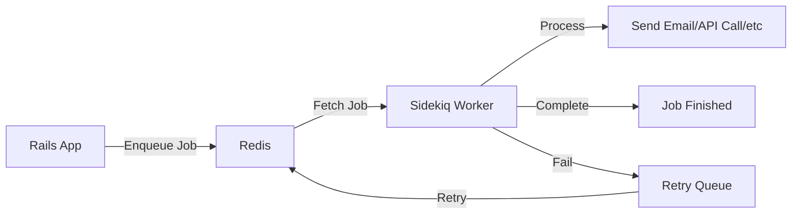

# How to Implement Background Jobs with Sidekiq in Rails

Author: [nawazdhandala](https://www.github.com/nawazdhandala)

Tags: Ruby on Rails, Sidekiq, Background Jobs, Redis, Performance, Ruby

Description: A practical guide to implementing background jobs with Sidekiq in Rails applications. Learn how to set up Redis, create workers, handle retries, schedule jobs, and monitor your background processing in production.

---

Background jobs are essential for any Rails application that needs to handle time-consuming tasks without blocking the main request-response cycle. Sending emails, processing images, generating reports, or syncing data with external APIs - these operations should never make your users wait. Sidekiq is the go-to solution for background job processing in Ruby, offering excellent performance through multi-threaded execution and a clean, simple API.

## Why Sidekiq?

Before diving into implementation, let's understand what makes Sidekiq stand out:

- **Performance**: Sidekiq uses threads instead of processes, meaning a single Sidekiq process can handle many jobs concurrently with much lower memory overhead than alternatives like Delayed Job or Resque.
- **Reliability**: Jobs are stored in Redis and persist across application restarts. Failed jobs are automatically retried with exponential backoff.
- **Simplicity**: Creating a worker is as simple as writing a Ruby class with a `perform` method.
- **Monitoring**: Built-in web UI for monitoring queues, jobs, and workers.

Here's how Sidekiq fits into a typical Rails architecture:



## Setting Up Sidekiq

First, add Sidekiq to your Gemfile:

```ruby
# Gemfile
gem 'sidekiq', '~> 7.2'  # Use the latest stable version
```

Run `bundle install` and then configure your Rails application to use Sidekiq as the Active Job adapter:

```ruby
# config/application.rb
module YourApp
  class Application < Rails::Application
    # Set Sidekiq as the default queue adapter for Active Job
    config.active_job.queue_adapter = :sidekiq
  end
end
```

Create a Sidekiq configuration file to define your queues and concurrency settings:

```yaml
# config/sidekiq.yml
---
:concurrency: 10  # Number of threads per Sidekiq process
:timeout: 25      # Seconds to wait for jobs to finish during shutdown

# Define queues in priority order (higher priority first)
:queues:
  - critical      # Payment processing, urgent notifications
  - default       # Standard background work
  - mailers       # Email delivery
  - low           # Reports, batch processing, cleanup tasks

# Production overrides (optional)
production:
  :concurrency: 25
```

Set up the Redis connection. Sidekiq needs to know where Redis lives:

```ruby
# config/initializers/sidekiq.rb
Sidekiq.configure_server do |config|
  # Redis URL for the Sidekiq server (worker processes)
  config.redis = { url: ENV.fetch('REDIS_URL', 'redis://localhost:6379/0') }
end

Sidekiq.configure_client do |config|
  # Redis URL for the client (your Rails app when enqueuing jobs)
  config.redis = { url: ENV.fetch('REDIS_URL', 'redis://localhost:6379/0') }
end
```

## Creating Your First Worker

Sidekiq workers are plain Ruby classes that include `Sidekiq::Job` and define a `perform` method. Let's create a worker that sends a welcome email:

```ruby
# app/sidekiq/welcome_email_job.rb
class WelcomeEmailJob
  include Sidekiq::Job

  # Process jobs from the 'mailers' queue
  sidekiq_options queue: :mailers, retry: 5

  def perform(user_id)
    # Always fetch the record fresh - IDs are serializable, objects are not
    user = User.find_by(id: user_id)

    # Guard against deleted records (user might be deleted before job runs)
    return unless user

    # Do the actual work
    UserMailer.welcome_email(user).deliver_now

    Rails.logger.info "Welcome email sent to user #{user_id}"
  end
end
```

Now you can enqueue this job from anywhere in your application:

```ruby
# In a controller after user registration
class UsersController < ApplicationController
  def create
    @user = User.new(user_params)

    if @user.save
      # Enqueue the welcome email job - returns immediately
      WelcomeEmailJob.perform_async(@user.id)

      redirect_to @user, notice: 'Account created!'
    else
      render :new
    end
  end
end
```

## Important: What to Pass to Workers

A critical rule when working with Sidekiq: **only pass simple, serializable arguments**. Job arguments are serialized to JSON and stored in Redis, so you should only use:

- Strings
- Numbers (integers, floats)
- Booleans
- Arrays (containing only the above)
- Hashes (with string keys and the above as values)

Never pass ActiveRecord objects, complex Ruby objects, or procs/lambdas:

```ruby
# Bad - Don't do this
WelcomeEmailJob.perform_async(@user)  # ActiveRecord object won't serialize properly

# Good - Pass the ID and fetch the record in the worker
WelcomeEmailJob.perform_async(@user.id)

# Bad - Don't pass Time objects
ReportJob.perform_async(Time.current)

# Good - Pass as integer or ISO8601 string
ReportJob.perform_async(Time.current.to_i)
ReportJob.perform_async(Time.current.iso8601)
```

## Handling Job Failures and Retries

Sidekiq automatically retries failed jobs with exponential backoff. By default, jobs are retried 25 times over about 21 days. You can customize this behavior:

```ruby
# app/sidekiq/payment_processing_job.rb
class PaymentProcessingJob
  include Sidekiq::Job

  # Critical queue, retry 10 times, keep dead jobs for 30 days
  sidekiq_options queue: :critical, retry: 10, dead: true

  # Custom retry logic - called after each failure
  sidekiq_retry_in do |count, exception|
    case exception
    when PaymentGateway::RateLimitError
      # Wait longer for rate limits (5 minutes, 15 minutes, etc.)
      (count ** 2) * 60 * 5
    when PaymentGateway::TemporaryError
      # Standard exponential backoff for temporary errors
      (count ** 4) + 15
    else
      # Use default retry timing
      :default
    end
  end

  def perform(order_id, payment_method_id)
    order = Order.find(order_id)
    payment_method = PaymentMethod.find(payment_method_id)

    result = PaymentGateway.charge(
      amount: order.total,
      payment_method: payment_method.token
    )

    if result.success?
      order.update!(status: 'paid', payment_id: result.transaction_id)
    else
      # Raise an error to trigger retry
      raise PaymentFailedError, result.error_message
    end
  end
end
```

You can also define callbacks for when jobs exhaust all retries:

```ruby
# app/sidekiq/important_sync_job.rb
class ImportantSyncJob
  include Sidekiq::Job

  sidekiq_options retry: 5

  # Called when job has failed all retries and is moved to dead queue
  sidekiq_retries_exhausted do |job, exception|
    # Notify your team that this job permanently failed
    Slack.notify(
      channel: '#alerts',
      text: "Job #{job['class']} with args #{job['args']} failed permanently: #{exception.message}"
    )

    # Or create an incident for manual investigation
    Incident.create!(
      source: 'sidekiq',
      job_class: job['class'],
      job_args: job['args'],
      error: exception.message
    )
  end

  def perform(resource_id)
    # Your job logic here
  end
end
```

## Scheduling Jobs for Later

Sidekiq lets you schedule jobs to run at a specific time in the future:

```ruby
# Run 1 hour from now
WelcomeEmailJob.perform_in(1.hour, user.id)

# Run at a specific time
ReportJob.perform_at(Date.tomorrow.beginning_of_day, report_id)

# For recurring jobs, consider sidekiq-cron or sidekiq-scheduler
```

For recurring jobs, add the `sidekiq-cron` gem:

```ruby
# Gemfile
gem 'sidekiq-cron', '~> 1.10'
```

Configure your scheduled jobs:

```ruby
# config/initializers/sidekiq_cron.rb
Sidekiq::Cron::Job.load_from_hash({
  'daily_cleanup' => {
    'cron' => '0 3 * * *',  # Every day at 3 AM
    'class' => 'DailyCleanupJob',
    'queue' => 'low'
  },
  'hourly_sync' => {
    'cron' => '0 * * * *',  # Every hour
    'class' => 'DataSyncJob',
    'args' => ['full'],     # Arguments to pass to perform
    'queue' => 'default'
  }
})
```

## Using Active Job with Sidekiq

Rails' Active Job provides a framework that works with multiple queue backends. You can use Active Job classes instead of Sidekiq-specific workers:

```ruby
# app/jobs/notification_job.rb
class NotificationJob < ApplicationJob
  queue_as :default

  # Active Job's retry mechanism (requires Rails 6.1+)
  retry_on Net::OpenTimeout, wait: 5.seconds, attempts: 3
  discard_on ActiveRecord::RecordNotFound

  def perform(user_id, message)
    user = User.find(user_id)
    NotificationService.send(user, message)
  end
end

# Enqueue with Active Job syntax
NotificationJob.perform_later(user.id, "Your order shipped!")
NotificationJob.set(wait: 10.minutes).perform_later(user.id, "Reminder")
```

The choice between Sidekiq-native workers and Active Job depends on your needs. Active Job provides portability across queue backends, while Sidekiq-native workers give you access to Sidekiq-specific features like custom retry logic and batch processing.

## Monitoring with the Web UI

Sidekiq ships with a web interface for monitoring. Mount it in your routes:

```ruby
# config/routes.rb
require 'sidekiq/web'

Rails.application.routes.draw do
  # Protect the Sidekiq UI in production
  authenticate :user, ->(u) { u.admin? } do
    mount Sidekiq::Web => '/sidekiq'
  end

  # Or use HTTP Basic Auth
  # Sidekiq::Web.use Rack::Auth::Basic do |username, password|
  #   ActiveSupport::SecurityUtils.secure_compare(username, ENV['SIDEKIQ_USERNAME']) &
  #   ActiveSupport::SecurityUtils.secure_compare(password, ENV['SIDEKIQ_PASSWORD'])
  # end
  # mount Sidekiq::Web => '/sidekiq'
end
```

The web UI shows:

- Active jobs being processed
- Queues and their sizes
- Scheduled jobs
- Failed jobs with error details
- Retry queue
- Dead jobs (jobs that exhausted all retries)

## Production Best Practices

### 1. Use Connection Pooling

With multiple Sidekiq processes and threads, you need enough database connections:

```ruby
# config/database.yml
production:
  pool: <%= ENV.fetch("RAILS_MAX_THREADS") { 5 } %>
  # If running Sidekiq with 25 threads, ensure your connection pool can handle it
```

### 2. Set Timeouts

Prevent jobs from running forever:

```ruby
class LongRunningJob
  include Sidekiq::Job

  # Kill the job if it runs longer than 10 minutes
  sidekiq_options timeout: 600

  def perform(data_id)
    # Processing that might hang
  end
end
```

### 3. Make Jobs Idempotent

Jobs might run more than once (network issues, process crashes). Design them to be safe to repeat:

```ruby
class OrderFulfillmentJob
  include Sidekiq::Job

  def perform(order_id)
    order = Order.find(order_id)

    # Guard: check if already fulfilled
    return if order.fulfilled?

    # Use a transaction with a status check
    order.with_lock do
      return if order.fulfilled?

      FulfillmentService.fulfill(order)
      order.update!(status: 'fulfilled', fulfilled_at: Time.current)
    end
  end
end
```

### 4. Monitor Queue Depth

Alert when queues back up:

```ruby
# app/sidekiq/queue_monitor_job.rb
class QueueMonitorJob
  include Sidekiq::Job

  THRESHOLDS = {
    'critical' => 100,
    'default' => 1000,
    'low' => 5000
  }.freeze

  def perform
    Sidekiq::Queue.all.each do |queue|
      threshold = THRESHOLDS[queue.name] || 1000

      if queue.size > threshold
        AlertService.trigger(
          severity: :warning,
          message: "Queue '#{queue.name}' has #{queue.size} jobs (threshold: #{threshold})"
        )
      end
    end
  end
end
```

### 5. Graceful Shutdown

Sidekiq handles SIGTERM gracefully, but ensure your jobs can be interrupted:

```ruby
class BatchProcessingJob
  include Sidekiq::Job

  def perform(batch_id)
    records = Record.where(batch_id: batch_id).find_each do |record|
      # Check if Sidekiq is shutting down
      raise Sidekiq::Shutdown if Sidekiq.stopping?

      process_record(record)
    end
  end
end
```

## Running Sidekiq

Start Sidekiq with the bundle command:

```bash
# Development
bundle exec sidekiq

# With a specific config file
bundle exec sidekiq -C config/sidekiq.yml

# Specify queues directly (overrides config file)
bundle exec sidekiq -q critical,2 -q default,1 -q low,1
```

For production deployments, use a process manager like systemd:

```ini
# /etc/systemd/system/sidekiq.service
[Unit]
Description=Sidekiq Background Worker
After=network.target

[Service]
Type=simple
User=deploy
WorkingDirectory=/var/www/myapp/current
ExecStart=/bin/bash -lc 'bundle exec sidekiq -e production'
ExecReload=/bin/kill -TSTP $MAINPID
ExecStop=/bin/kill -TERM $MAINPID
Restart=always
RestartSec=1
StandardOutput=syslog
StandardError=syslog
SyslogIdentifier=sidekiq

[Install]
WantedBy=multi-user.target
```

## Testing Sidekiq Jobs

Sidekiq provides testing modes for your test suite:

```ruby
# spec/rails_helper.rb or test/test_helper.rb
require 'sidekiq/testing'

# Inline mode - jobs execute immediately (good for integration tests)
Sidekiq::Testing.inline!

# Fake mode - jobs are pushed to a jobs array (good for unit tests)
Sidekiq::Testing.fake!
```

Example RSpec tests:

```ruby
# spec/sidekiq/welcome_email_job_spec.rb
require 'rails_helper'

RSpec.describe WelcomeEmailJob, type: :job do
  describe '#perform' do
    let(:user) { create(:user) }

    it 'sends a welcome email' do
      expect(UserMailer).to receive(:welcome_email).with(user).and_call_original

      described_class.new.perform(user.id)
    end

    it 'handles missing users gracefully' do
      expect { described_class.new.perform(0) }.not_to raise_error
    end
  end

  describe 'enqueuing' do
    before { Sidekiq::Testing.fake! }
    after { Sidekiq::Worker.clear_all }

    it 'enqueues the job' do
      expect {
        described_class.perform_async(1)
      }.to change(described_class.jobs, :size).by(1)
    end

    it 'enqueues to the mailers queue' do
      described_class.perform_async(1)
      expect(described_class.jobs.last['queue']).to eq('mailers')
    end
  end
end
```

---

Sidekiq transforms how Rails applications handle background work. With Redis as a fast, reliable queue backend and a straightforward Ruby API, you can offload slow operations and keep your application responsive. Start with simple workers, add monitoring, and build up to complex workflows as your needs grow. The patterns covered here - idempotent jobs, proper error handling, and queue prioritization - will serve you well as you scale.
