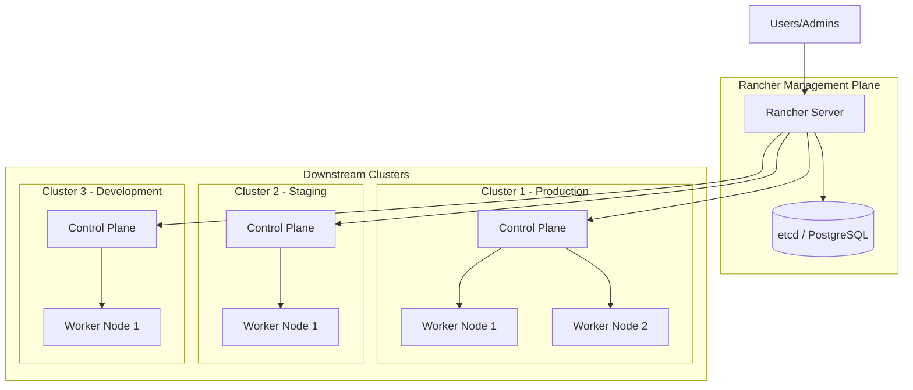
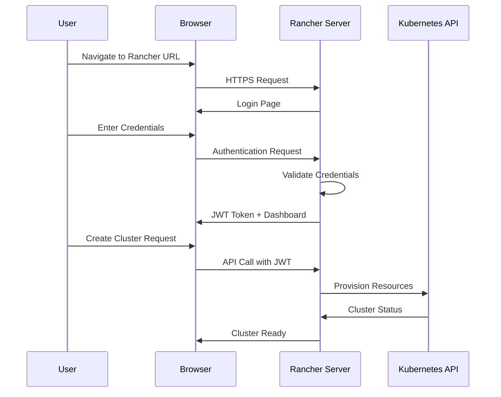
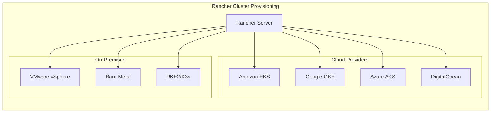
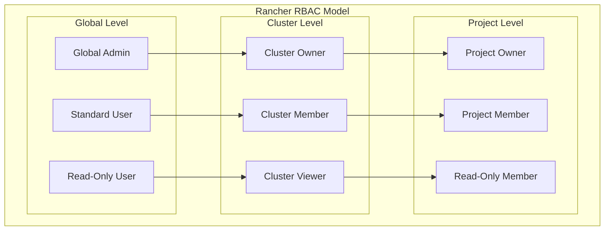

# How to Set Up Rancher for Kubernetes Management

Author: [nawazdhandala](https://www.github.com/nawazdhandala)

Tags: Rancher, Kubernetes, Cluster Management, DevOps, Multi-Cluster

Description: A comprehensive guide to setting up Rancher for Kubernetes cluster management with cluster provisioning, RBAC, and multi-cluster visibility.

---

Rancher is an open-source platform that simplifies Kubernetes cluster management. It provides a unified interface to deploy and manage multiple Kubernetes clusters across different environments, whether on-premises, in the cloud, or at the edge. This guide walks you through installing Rancher and using it to manage your Kubernetes infrastructure.

## Architecture Overview

Before diving into the installation, let's understand how Rancher fits into your infrastructure.



Rancher acts as the central management plane that connects to multiple downstream Kubernetes clusters. The Rancher server itself runs on Kubernetes and manages communication with all registered clusters.

## Prerequisites

Before installing Rancher, ensure you have the following:

- A Kubernetes cluster to host the Rancher server (can be a single-node cluster for testing)
- kubectl configured to access the cluster
- Helm 3.x installed
- A valid domain name pointing to your cluster (for production setups)
- At least 4GB of RAM and 2 CPU cores for the Rancher server

## Installing Rancher with Helm

The recommended way to install Rancher is using Helm on an existing Kubernetes cluster. We will use cert-manager for TLS certificate management.

### Step 1: Install cert-manager

cert-manager handles automatic certificate provisioning for Rancher.

```bash
# Add the Jetstack Helm repository for cert-manager
helm repo add jetstack https://charts.jetstack.io

# Update your local Helm chart repository cache
helm repo update

# Install the cert-manager Custom Resource Definitions (CRDs)
# These define the certificate-related resources cert-manager uses
kubectl apply -f https://github.com/cert-manager/cert-manager/releases/download/v1.14.4/cert-manager.crds.yaml

# Create the cert-manager namespace
kubectl create namespace cert-manager

# Install cert-manager using Helm
# This deploys the cert-manager controller, webhook, and cainjector components
helm install cert-manager jetstack/cert-manager \
  --namespace cert-manager \
  --version v1.14.4
```

Verify cert-manager is running:

```bash
# Check that all cert-manager pods are running
# You should see cert-manager, cert-manager-cainjector, and cert-manager-webhook
kubectl get pods --namespace cert-manager
```

Expected output:

```
NAME                                       READY   STATUS    RESTARTS   AGE
cert-manager-5c6866597-zw7kh              1/1     Running   0          2m
cert-manager-cainjector-577f6d9fd7-tr77l  1/1     Running   0          2m
cert-manager-webhook-787858fcdb-nlzsq     1/1     Running   0          2m
```

### Step 2: Install Rancher

Now install Rancher in its own namespace.

```bash
# Add the Rancher Helm repository
helm repo add rancher-stable https://releases.rancher.com/server-charts/stable

# Update your local Helm chart repository cache
helm repo update

# Create the cattle-system namespace where Rancher will be installed
kubectl create namespace cattle-system

# Install Rancher using Helm
# Replace 'rancher.yourdomain.com' with your actual domain
# The bootstrapPassword is used for the initial admin login
helm install rancher rancher-stable/rancher \
  --namespace cattle-system \
  --set hostname=rancher.yourdomain.com \
  --set bootstrapPassword=admin \
  --set ingress.tls.source=letsEncrypt \
  --set letsEncrypt.email=admin@yourdomain.com \
  --set letsEncrypt.ingress.class=nginx
```

For local testing without a domain, you can use a self-signed certificate:

```bash
# Install Rancher with self-signed certificates (for testing only)
# This avoids the need for a real domain and Let's Encrypt
helm install rancher rancher-stable/rancher \
  --namespace cattle-system \
  --set hostname=rancher.localhost \
  --set bootstrapPassword=admin \
  --set ingress.tls.source=rancher
```

### Step 3: Verify the Installation

Wait for Rancher to deploy and verify all components are running.

```bash
# Watch the Rancher deployment rollout status
# This will wait until the deployment is complete
kubectl -n cattle-system rollout status deploy/rancher

# Check all pods in the cattle-system namespace
kubectl -n cattle-system get pods

# Get the Rancher ingress to find the URL
kubectl -n cattle-system get ingress
```

## Accessing the Rancher UI

Once installed, access the Rancher UI through your browser at `https://rancher.yourdomain.com`. On first access, you will:

1. Set the admin password (or use the bootstrapPassword if configured)
2. Set the Rancher Server URL
3. Agree to the terms and conditions



## Importing an Existing Kubernetes Cluster

Rancher can manage existing Kubernetes clusters. Here is how to import one.

### Step 1: Get the Import Command

From the Rancher UI:

1. Click "Cluster Management" in the left sidebar
2. Click "Import Existing"
3. Select "Generic" for a standard Kubernetes cluster
4. Give your cluster a name and click "Create"

Rancher will generate a kubectl command to run on your existing cluster.

### Step 2: Run the Import Command

The generated command looks like this:

```bash
# This command deploys the Rancher agent to your existing cluster
# The agent establishes a connection back to the Rancher server
# Replace the URL with the one from your Rancher UI
kubectl apply -f https://rancher.yourdomain.com/v3/import/abc123xyz.yaml
```

If your cluster cannot reach the Rancher server directly, use the insecure command:

```bash
# Use this if TLS verification fails (testing environments only)
curl --insecure -sfL https://rancher.yourdomain.com/v3/import/abc123xyz.yaml | kubectl apply -f -
```

### Step 3: Verify the Connection

The cluster will appear in Rancher within a few minutes. Check the agent status on the imported cluster:

```bash
# Verify the Rancher agent pods are running
# The cattle-cluster-agent handles the connection to Rancher
kubectl -n cattle-system get pods
```

Expected output:

```
NAME                                    READY   STATUS    RESTARTS   AGE
cattle-cluster-agent-64d4f9d74b-28xtz   1/1     Running   0          5m
```

## Provisioning a New Cluster with Rancher

Rancher can provision new Kubernetes clusters on various infrastructure providers.



### Creating a Custom Cluster with RKE2

For on-premises or custom infrastructure, use RKE2 (Rancher Kubernetes Engine 2).

From the Rancher UI:

1. Click "Cluster Management"
2. Click "Create"
3. Select "Custom"
4. Configure cluster settings:

```yaml
# Example cluster configuration (shown in Rancher UI)
# These settings control how the cluster is provisioned

# Cluster name - used for identification
name: production-cluster

# Kubernetes version - select from supported versions
kubernetesVersion: v1.28.8+rke2r1

# Container network interface plugin
cni: calico

# Enable Project Network Isolation for multi-tenancy
enableNetworkPolicy: true

# Cluster agent customization
agentEnvVars:
  - name: CATTLE_SERVER
    value: https://rancher.yourdomain.com
```

5. Register nodes by running the provided command on each server:

```bash
# Run this on each node you want to add to the cluster
# The --etcd, --controlplane, and --worker flags determine the node's role

# For a control plane node (runs etcd and control plane components)
curl -fL https://rancher.yourdomain.com/system-agent-install.sh | \
  sudo sh -s - \
  --server https://rancher.yourdomain.com \
  --label 'cattle.io/os=linux' \
  --token abc123xyz \
  --ca-checksum def456 \
  --etcd \
  --controlplane

# For a worker node (runs workloads only)
curl -fL https://rancher.yourdomain.com/system-agent-install.sh | \
  sudo sh -s - \
  --server https://rancher.yourdomain.com \
  --label 'cattle.io/os=linux' \
  --token abc123xyz \
  --ca-checksum def456 \
  --worker
```

## Configuring RBAC with Rancher

Rancher provides centralized RBAC (Role-Based Access Control) across all managed clusters.



### Creating a Custom Role

Define custom roles for fine-grained access control:

```yaml
# custom-role.yaml
# This creates a custom Rancher role with specific permissions
apiVersion: management.cattle.io/v3
kind: GlobalRole
metadata:
  # Name must be unique across all global roles
  name: deployment-manager
  labels:
    cattle.io/creator: norman
spec:
  # Display name shown in the Rancher UI
  displayName: Deployment Manager
  # Description helps users understand the role's purpose
  description: "Can manage deployments but not delete namespaces"
  # Rules define the actual permissions granted
  rules:
    # Allow full access to deployments
    - apiGroups:
        - "apps"
      resources:
        - deployments
        - replicasets
      verbs:
        - "*"
    # Allow read access to pods and services
    - apiGroups:
        - ""
      resources:
        - pods
        - services
        - configmaps
      verbs:
        - get
        - list
        - watch
    # Allow viewing namespaces but not modifying them
    - apiGroups:
        - ""
      resources:
        - namespaces
      verbs:
        - get
        - list
```

Apply the custom role:

```bash
# Create the custom role in Rancher
kubectl apply -f custom-role.yaml
```

### Assigning Users to Clusters

```yaml
# cluster-role-binding.yaml
# This binds a user to a cluster with specific permissions
apiVersion: management.cattle.io/v3
kind: ClusterRoleTemplateBinding
metadata:
  # Generate a unique name for this binding
  name: user-john-cluster-member
  namespace: c-m-abc123  # Replace with your cluster ID
spec:
  # Reference to the cluster (use the cluster ID from Rancher)
  clusterName: c-m-abc123
  # The role to assign - this uses a built-in Rancher role
  roleTemplateName: cluster-member
  # The user principal - format depends on auth provider
  # For local users: local://user-xxxxx
  # For LDAP: ldap_user://uid=john,ou=users,dc=example,dc=com
  userPrincipalName: local://user-abc123
```

## Setting Up Multi-Cluster Monitoring

Rancher includes built-in monitoring based on Prometheus and Grafana.

### Enable Monitoring on a Cluster

From the Rancher UI:

1. Navigate to your cluster
2. Click "Cluster Tools" (or "Apps" > "Charts")
3. Find "Monitoring" and click "Install"

Or install via Helm:

```bash
# Add the Rancher charts repository
helm repo add rancher-charts https://charts.rancher.io

# Update the repository cache
helm repo update

# Install the monitoring stack
# This deploys Prometheus, Alertmanager, and Grafana
helm install rancher-monitoring rancher-charts/rancher-monitoring \
  --namespace cattle-monitoring-system \
  --create-namespace \
  --set prometheus.prometheusSpec.resources.requests.memory=750Mi \
  --set prometheus.prometheusSpec.resources.requests.cpu=750m \
  --set grafana.resources.requests.memory=200Mi \
  --set grafana.resources.requests.cpu=200m
```

### Creating a Custom ServiceMonitor

Monitor your applications with ServiceMonitor resources:

```yaml
# servicemonitor.yaml
# This tells Prometheus to scrape metrics from your application
apiVersion: monitoring.coreos.com/v1
kind: ServiceMonitor
metadata:
  # Name of the ServiceMonitor resource
  name: my-app-metrics
  # Must be in the same namespace as the Prometheus instance
  # or referenced in Prometheus serviceMonitorSelector
  namespace: cattle-monitoring-system
  labels:
    # This label helps Prometheus discover this ServiceMonitor
    release: rancher-monitoring
spec:
  # Selector to find the Service to monitor
  selector:
    matchLabels:
      app: my-application
  # Which namespaces to look for the Service in
  namespaceSelector:
    matchNames:
      - my-app-namespace
  # Endpoints configuration - how to scrape metrics
  endpoints:
    # Port name must match a port in your Service definition
    - port: metrics
      # Path where metrics are exposed
      path: /metrics
      # Scrape interval - how often to collect metrics
      interval: 30s
      # Timeout for scrape requests
      scrapeTimeout: 10s
```

## Backup and Disaster Recovery

Rancher provides backup capabilities for both the Rancher server and managed clusters.

### Installing the Backup Operator

```bash
# Install the Rancher Backup operator
helm install rancher-backup rancher-charts/rancher-backup \
  --namespace cattle-resources-system \
  --create-namespace
```

### Creating a Backup

```yaml
# backup.yaml
# This creates a one-time backup of Rancher configuration
apiVersion: resources.cattle.io/v1
kind: Backup
metadata:
  name: rancher-backup-daily
spec:
  # Storage location for the backup
  # Options: S3, local PV, or NFS
  storageLocation:
    s3:
      # S3 bucket name
      bucketName: rancher-backups
      # AWS region
      region: us-west-2
      # Folder path within the bucket
      folder: daily-backups
      # Reference to a Secret containing AWS credentials
      credentialSecretName: s3-credentials
      credentialSecretNamespace: cattle-resources-system
  # Encryption configuration for backup data
  encryptionConfigSecretName: backup-encryption
  # Resource set to backup - use 'rancher-resource-set' for full backup
  resourceSetName: rancher-resource-set
```

### Creating a Scheduled Backup

```yaml
# scheduled-backup.yaml
# This creates recurring backups on a schedule
apiVersion: resources.cattle.io/v1
kind: Backup
metadata:
  name: rancher-scheduled-backup
spec:
  # Cron schedule for backups (daily at 2 AM)
  schedule: "0 2 * * *"
  # Number of backups to retain
  retentionCount: 10
  storageLocation:
    s3:
      bucketName: rancher-backups
      region: us-west-2
      folder: scheduled-backups
      credentialSecretName: s3-credentials
      credentialSecretNamespace: cattle-resources-system
  encryptionConfigSecretName: backup-encryption
  resourceSetName: rancher-resource-set
```

Apply the backup configurations:

```bash
# Create the S3 credentials secret
kubectl create secret generic s3-credentials \
  --namespace cattle-resources-system \
  --from-literal=accessKey=YOUR_ACCESS_KEY \
  --from-literal=secretKey=YOUR_SECRET_KEY

# Create the encryption secret
kubectl create secret generic backup-encryption \
  --namespace cattle-resources-system \
  --from-literal=encryptionKey=$(openssl rand -base64 32)

# Apply the scheduled backup
kubectl apply -f scheduled-backup.yaml
```

## Troubleshooting Common Issues

### Cluster Agent Not Connecting

If the cluster agent cannot connect to Rancher:

```bash
# Check agent logs for connection errors
kubectl -n cattle-system logs -l app=cattle-cluster-agent -f

# Verify the agent can reach the Rancher server
kubectl -n cattle-system exec -it \
  $(kubectl -n cattle-system get pod -l app=cattle-cluster-agent -o jsonpath='{.items[0].metadata.name}') \
  -- curl -k https://rancher.yourdomain.com/ping

# Restart the agent if needed
kubectl -n cattle-system rollout restart deployment/cattle-cluster-agent
```

### Certificate Issues

For Let's Encrypt certificate problems:

```bash
# Check cert-manager logs
kubectl -n cert-manager logs -l app=cert-manager -f

# View certificate status
kubectl -n cattle-system get certificate

# Describe the certificate for detailed status
kubectl -n cattle-system describe certificate tls-rancher-ingress

# Check certificate requests
kubectl get certificaterequest -A
```

### Rancher Server Not Starting

```bash
# Check Rancher pod logs
kubectl -n cattle-system logs -l app=rancher -f

# Check for resource constraints
kubectl -n cattle-system describe pod -l app=rancher

# Verify the Rancher deployment
kubectl -n cattle-system get deployment rancher -o yaml
```

## Best Practices

When running Rancher in production, follow these guidelines:

1. **High Availability**: Run Rancher on a 3-node cluster for high availability
2. **External Database**: Use an external PostgreSQL or MySQL database instead of embedded etcd for better reliability
3. **TLS Certificates**: Always use valid TLS certificates from a trusted CA
4. **Regular Backups**: Configure scheduled backups to external storage
5. **Network Segmentation**: Isolate the Rancher management network from downstream clusters
6. **Audit Logging**: Enable audit logging for compliance and troubleshooting
7. **Resource Limits**: Set appropriate resource limits for the Rancher server
8. **Upgrade Planning**: Test upgrades in a staging environment before production

## Conclusion

Rancher provides a powerful platform for managing Kubernetes clusters at scale. With its unified interface, you can provision clusters, manage RBAC, monitor workloads, and handle backups across multiple environments. Whether you are running a single development cluster or managing dozens of production clusters, Rancher simplifies the operational complexity of Kubernetes.

Start with a simple single-cluster setup to learn the basics, then expand to multi-cluster management as your infrastructure grows. The investment in setting up Rancher properly pays off with reduced operational overhead and improved visibility across your Kubernetes estate.

**Related Reading:**

- [How to Use Rancher Fleet for GitOps at Scale with Helm Charts](https://oneuptime.com/blog/post/2026-01-17-helm-rancher-fleet-gitops-scale/view)
- [How to configure MetalLB with Kubernetes (Microk8s)](https://oneuptime.com/blog/post/2023-11-06-configure-metallb-with-kubernetes-microk8s/view)
- [How moving from AWS to Bare-Metal saved us $230,000 /yr.](https://oneuptime.com/blog/post/2023-10-30-moving-from-aws-to-bare-metal/view)
