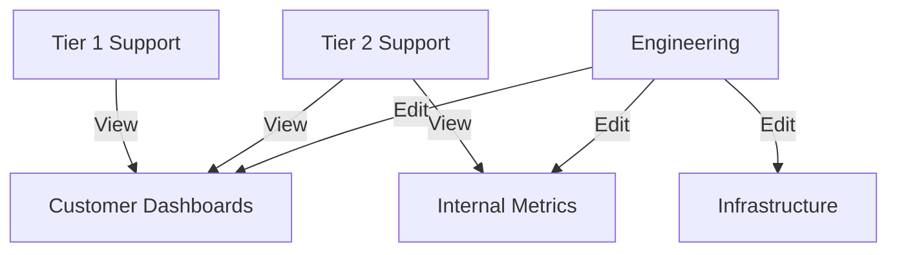

# How to Configure RBAC Policies in Grafana

Author: [nawazdhandala](https://www.github.com/nawazdhandala)

Tags: Grafana, RBAC, Security, Access Control, Permissions, Enterprise, Administration

Description: Learn how to implement Role-Based Access Control in Grafana to manage user permissions, protect sensitive dashboards, and enforce organizational security policies.

---

## Understanding RBAC in Grafana

Role-Based Access Control (RBAC) in Grafana determines what actions users can perform and what resources they can access. A well-designed RBAC policy ensures engineers see what they need while protecting sensitive data and configurations.

Grafana's permission model has evolved over time. Basic roles (Viewer, Editor, Admin) provide coarse-grained control, while RBAC (available in Enterprise and Cloud) enables fine-grained permissions at the resource level.

## Basic Roles

Every Grafana user has an organization role that sets their baseline permissions.

### Viewer

Viewers can:
- View dashboards and explore data
- Create personal playlists
- Access Explore (if enabled)

Viewers cannot:
- Create or modify dashboards
- Manage data sources
- Configure alerting

### Editor

Editors inherit Viewer permissions plus:
- Create, edit, and delete dashboards
- Create folders
- Create and modify alert rules
- Manage playlists

### Admin

Admins have full control:
- Manage users and teams
- Configure data sources
- Install plugins
- Access all folders regardless of permissions

## Folder-Based Permissions

Folders are the primary mechanism for organizing dashboard access.

### Creating a Folder Structure

Design folders around team ownership or data sensitivity:

```
Dashboards/
├── Platform/              # Platform team owns these
│   ├── Infrastructure/
│   └── SLOs/
├── Product/               # Product engineering
│   ├── Web/
│   └── Mobile/
├── Executive/             # Sensitive business metrics
└── Shared/                # Cross-team dashboards
```

### Configuring Folder Permissions

Navigate to a folder and click "Permissions" to configure access:

```yaml
# Example: Platform folder permissions
Folder: Platform
Permissions:
  - Role: Admin
    Permission: Admin
  - Team: platform-team
    Permission: Edit
  - Team: sre-team
    Permission: Edit
  - Built-in role: Viewer
    Permission: View
```

Permission levels for folders:
- **View**: Can view dashboards in the folder
- **Edit**: Can create, modify, and delete dashboards
- **Admin**: Can manage folder permissions

### Removing Inherited Permissions

By default, organization Editors can edit dashboards everywhere. To restrict this:

1. Go to folder permissions
2. Remove the "Editor" role inheritance
3. Explicitly grant edit access to specific teams

```yaml
# Restricted folder permissions
Folder: Executive
Permissions:
  - Team: executive-team
    Permission: View
  - Team: data-analytics
    Permission: Edit
  - Role: Admin
    Permission: Admin
  # No inherited Editor access
```

## Team Management

Teams group users for easier permission management.

### Creating Teams

```bash
# Via API
curl -X POST \
     -H "Authorization: Bearer $TOKEN" \
     -H "Content-Type: application/json" \
     https://grafana.example.com/api/teams \
     -d '{
       "name": "Platform Team",
       "email": "platform@example.com"
     }'
```

### Adding Team Members

```bash
# Add user to team
curl -X POST \
     -H "Authorization: Bearer $TOKEN" \
     -H "Content-Type: application/json" \
     https://grafana.example.com/api/teams/1/members \
     -d '{"userId": 5}'
```

### Team Sync with External Providers

If using LDAP, OAuth, or SAML, configure team sync to automatically manage team membership:

```ini
# grafana.ini for LDAP team sync
[auth.ldap]
enabled = true
config_file = /etc/grafana/ldap.toml

# ldap.toml
[[servers.group_mappings]]
group_dn = "cn=platform-engineers,ou=groups,dc=example,dc=com"
org_role = "Editor"
grafana_team_ids = [1]  # Maps to Platform Team
```

## Fine-Grained RBAC (Enterprise/Cloud)

Grafana Enterprise and Cloud offer granular permissions beyond folder-based access.

### Custom Roles

Create roles with specific permissions:

```yaml
# Custom role definition
role:
  name: dashboard-creator
  description: Can create dashboards but not manage data sources
  permissions:
    - action: dashboards:create
      scope: folders:*
    - action: dashboards:read
      scope: dashboards:*
    - action: dashboards:write
      scope: dashboards:*
    - action: folders:read
      scope: folders:*
```

### Available Permissions

Permissions follow the pattern `resource:action`:

```yaml
# Dashboard permissions
dashboards:read          # View dashboards
dashboards:write         # Edit dashboards
dashboards:create        # Create new dashboards
dashboards:delete        # Delete dashboards
dashboards:permissions:read
dashboards:permissions:write

# Data source permissions
datasources:read
datasources:write
datasources:create
datasources:delete
datasources:query        # Execute queries

# Alert permissions
alert.rules:read
alert.rules:write
alert.rules:create
alert.rules:delete

# User management
users:read
users:write
users:create
```

### Scopes

Scopes limit where permissions apply:

```yaml
# Permission scopes
scope: dashboards:*                    # All dashboards
scope: dashboards:uid:abc123           # Specific dashboard
scope: folders:*                       # All folders
scope: folders:uid:xyz789              # Specific folder
scope: datasources:*                   # All data sources
scope: datasources:uid:prometheus-1    # Specific data source
```

### Creating and Assigning Custom Roles

```bash
# Create a custom role
curl -X POST \
     -H "Authorization: Bearer $TOKEN" \
     -H "Content-Type: application/json" \
     https://grafana.example.com/api/access-control/roles \
     -d '{
       "name": "my-custom-role",
       "description": "Custom permissions for specific use case",
       "permissions": [
         {"action": "dashboards:read", "scope": "dashboards:*"},
         {"action": "dashboards:write", "scope": "folders:uid:team-folder"}
       ]
     }'

# Assign role to a team
curl -X POST \
     -H "Authorization: Bearer $TOKEN" \
     -H "Content-Type: application/json" \
     https://grafana.example.com/api/access-control/teams/1/roles \
     -d '{"roleUid": "my-custom-role"}'
```

## Data Source Permissions

Control which users or teams can query specific data sources.

### Restricting Data Source Access

```yaml
# Data source permission configuration
Data Source: Production Prometheus
Permissions:
  - Team: sre-team
    Permission: Query
  - Team: platform-team
    Permission: Query
  # Other teams cannot query this data source
```

This prevents accidental access to production metrics by development teams.

### Query-Level Restrictions

Some data sources support additional restrictions:

```yaml
# Prometheus data source with query restrictions
jsonData:
  queryTimeout: 30s
  httpMethod: POST

secureJsonData:
  # Some proxies can enforce query patterns
  allowedQueries: "up|http_.*|node_.*"
```

## Service Account Permissions

Service accounts provide API access with scoped permissions.

### Creating a Scoped Service Account

```bash
# Create service account
curl -X POST \
     -H "Authorization: Bearer $TOKEN" \
     -H "Content-Type: application/json" \
     https://grafana.example.com/api/serviceaccounts \
     -d '{
       "name": "dashboard-deployer",
       "role": "None"
     }'

# Assign custom role
curl -X POST \
     -H "Authorization: Bearer $TOKEN" \
     -H "Content-Type: application/json" \
     https://grafana.example.com/api/access-control/serviceaccounts/1/roles \
     -d '{"roleUid": "dashboard-creator"}'

# Create token
curl -X POST \
     -H "Authorization: Bearer $TOKEN" \
     -H "Content-Type: application/json" \
     https://grafana.example.com/api/serviceaccounts/1/tokens \
     -d '{"name": "ci-cd-token"}'
```

## RBAC Provisioning

Manage RBAC configuration as code for consistency across environments.

### Provisioning Roles

```yaml
# provisioning/access-control/roles.yaml
apiVersion: 1

roles:
  - name: custom:dashboard-viewer
    description: View dashboards in specific folders
    permissions:
      - action: dashboards:read
        scope: folders:uid:public-dashboards
      - action: folders:read
        scope: folders:uid:public-dashboards

  - name: custom:alert-manager
    description: Manage alerts without dashboard edit
    permissions:
      - action: alert.rules:read
        scope: "*"
      - action: alert.rules:write
        scope: "*"
      - action: alert.rules:create
        scope: folders:*
```

### Provisioning Role Assignments

```yaml
# provisioning/access-control/assignments.yaml
apiVersion: 1

roleAssignments:
  - role: custom:dashboard-viewer
    teams:
      - support-team
    builtInRoles:
      - Viewer

  - role: custom:alert-manager
    teams:
      - sre-team
```

## Common RBAC Patterns

### Read-Only Production Access

```yaml
# Pattern: Separate prod viewing from staging editing
Folder: Production
Permissions:
  - Team: all-engineers
    Permission: View
  - Team: sre-team
    Permission: Edit

Folder: Staging
Permissions:
  - Team: all-engineers
    Permission: Edit
```

### Tiered Support Access



### Multi-Tenant Isolation

```yaml
# Each customer team sees only their data
Folder: Customer-A
Permissions:
  - Team: customer-a-support
    Permission: View
  - Team: internal-ops
    Permission: Admin

Folder: Customer-B
Permissions:
  - Team: customer-b-support
    Permission: View
  - Team: internal-ops
    Permission: Admin
```

## Auditing Access

Monitor who accesses what in Grafana.

### Enabling Audit Logs (Enterprise)

```ini
# grafana.ini
[auditing]
enabled = true
log_dashboard_access = true
log_query_access = true
```

### Reviewing Access Patterns

Audit logs capture:
- Dashboard views and edits
- Query execution
- Permission changes
- Authentication events

```json
{
  "timestamp": "2026-01-25T10:30:00Z",
  "action": "dashboard:view",
  "user": "john.doe",
  "resource": "dashboard:abc123",
  "outcome": "success"
}
```

## Troubleshooting Permissions

### User Cannot See a Dashboard

Check:
1. User's organization role
2. Team memberships
3. Folder permissions
4. Specific dashboard permissions (if set)

```bash
# Check user permissions via API
curl -H "Authorization: Bearer $TOKEN" \
     https://grafana.example.com/api/access-control/users/5/permissions
```

### Query Fails with Permission Error

Verify:
1. Data source permissions include the user's team
2. User has at least Viewer role
3. Data source exists and is not disabled

### Service Account Cannot Create Dashboards

Ensure:
1. Service account has `dashboards:create` permission
2. Scope includes the target folder
3. Token is valid and not expired

## Conclusion

Effective RBAC in Grafana balances security with usability. Start with folder-based permissions using teams, then layer fine-grained RBAC for sensitive resources. Provision configurations as code for consistency, and audit access patterns to verify your policies work as intended. A well-designed permission model protects sensitive data while keeping engineers productive.
