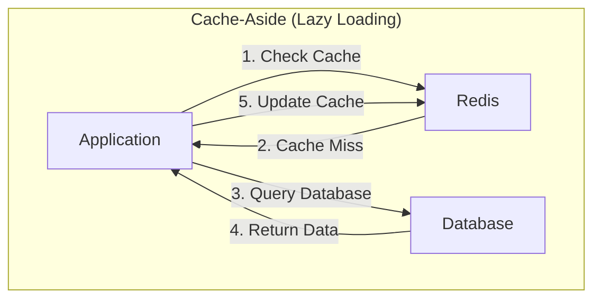
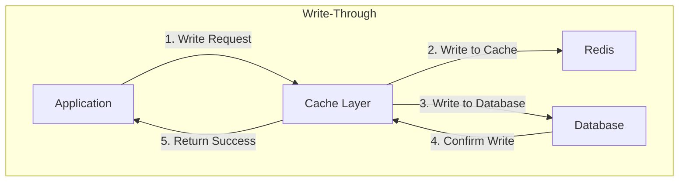
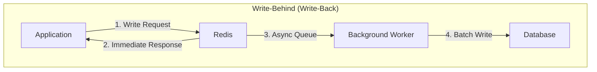
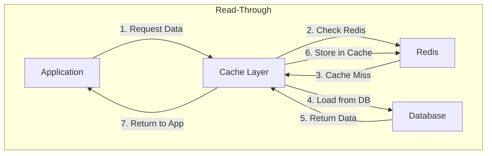
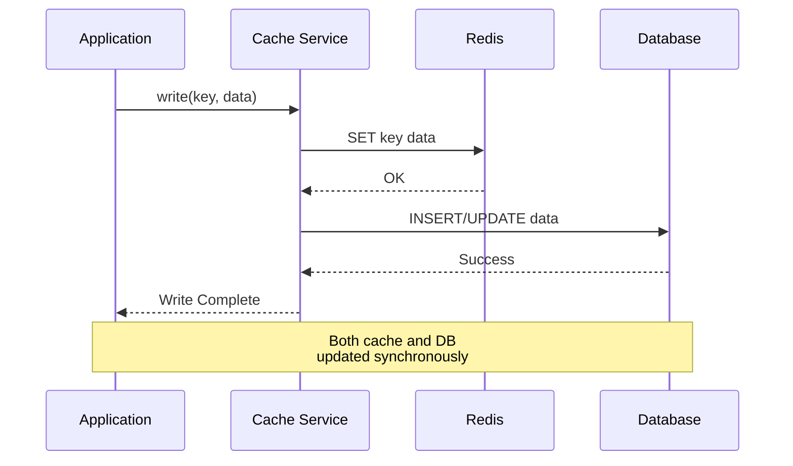
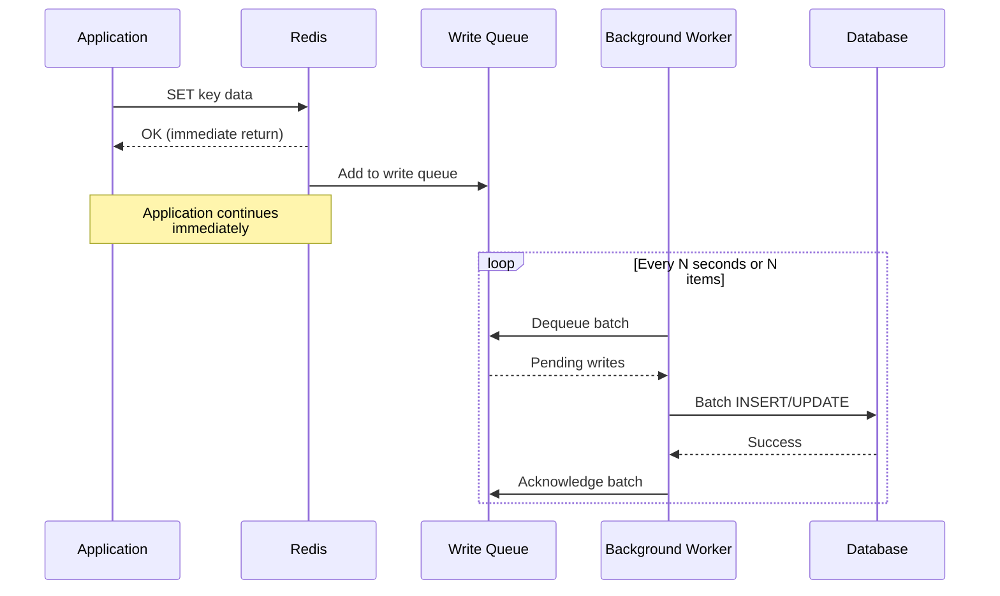
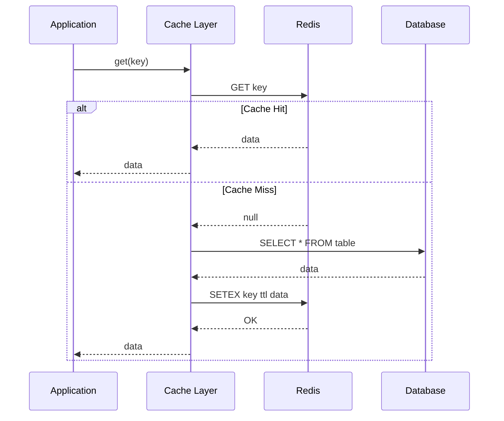
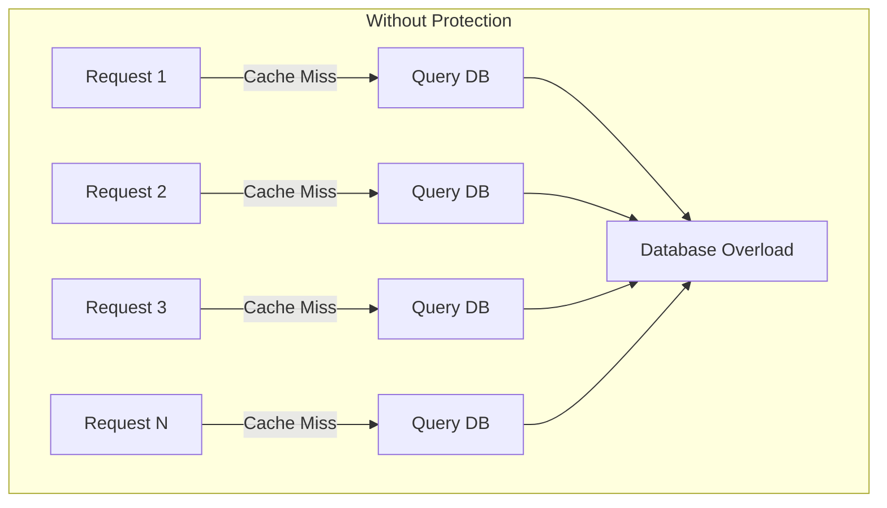
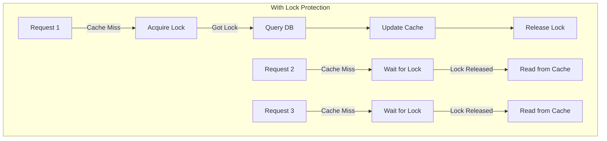

# How to Build Redis Caching Patterns

Author: [nawazdhandala](https://www.github.com/nawazdhandala)

Tags: Redis, Caching, Cache Patterns, Performance, Database, Node.js, Python

Description: A practical guide to implementing Redis caching patterns including cache-aside, write-through, write-behind, and read-through strategies with real-world examples.

---

> Caching is one of the most effective ways to improve application performance. Redis, with its in-memory data store and rich data structures, has become the go-to solution for implementing caching strategies. Understanding which caching pattern to use and when can make a significant difference in your application's responsiveness and scalability.

This guide covers the four primary caching patterns used with Redis: cache-aside, write-through, write-behind, and read-through. Each pattern has its strengths and trade-offs, and choosing the right one depends on your specific use case.

---

## Caching Pattern Overview

Before diving into implementation, let's understand how these patterns work and when to use each one.









---

## Pattern 1: Cache-Aside (Lazy Loading)

Cache-aside is the most common caching pattern. The application is responsible for reading and writing from both the cache and the database. Data is loaded into the cache only when requested.

### When to Use Cache-Aside

- Read-heavy workloads
- When you can tolerate stale data occasionally
- When cache misses are acceptable
- When you need fine-grained control over caching logic

### Node.js Implementation

```javascript
// cache-aside.js
// Cache-Aside pattern implementation with Redis and PostgreSQL

const Redis = require('ioredis');
const { Pool } = require('pg');

// Initialize Redis client with connection pooling
const redis = new Redis({
    host: process.env.REDIS_HOST || 'localhost',
    port: process.env.REDIS_PORT || 6379,
    maxRetriesPerRequest: 3,
    retryDelayOnFailover: 100,
    // Enable automatic reconnection
    retryStrategy(times) {
        const delay = Math.min(times * 50, 2000);
        return delay;
    }
});

// Initialize PostgreSQL connection pool
const db = new Pool({
    host: process.env.DB_HOST || 'localhost',
    database: process.env.DB_NAME || 'myapp',
    user: process.env.DB_USER || 'postgres',
    password: process.env.DB_PASSWORD,
    max: 20, // Maximum pool size
    idleTimeoutMillis: 30000
});

// Cache configuration
const CACHE_TTL = 3600; // 1 hour in seconds
const CACHE_PREFIX = 'user:';

/**
 * Get user by ID using cache-aside pattern
 *
 * Flow:
 * 1. Check if data exists in cache
 * 2. If cache hit, return cached data
 * 3. If cache miss, fetch from database
 * 4. Store result in cache for future requests
 * 5. Return data to caller
 */
async function getUserById(userId) {
    const cacheKey = `${CACHE_PREFIX}${userId}`;

    try {
        // Step 1: Check cache first
        const cachedData = await redis.get(cacheKey);

        if (cachedData) {
            // Cache hit - parse and return cached data
            console.log(`Cache HIT for user ${userId}`);
            return JSON.parse(cachedData);
        }

        // Cache miss - fetch from database
        console.log(`Cache MISS for user ${userId}`);

        // Step 2: Query the database
        const result = await db.query(
            'SELECT id, name, email, created_at FROM users WHERE id = $1',
            [userId]
        );

        if (result.rows.length === 0) {
            return null; // User not found
        }

        const user = result.rows[0];

        // Step 3: Store in cache with TTL
        // Using EX flag for expiration in seconds
        await redis.setex(
            cacheKey,
            CACHE_TTL,
            JSON.stringify(user)
        );

        return user;

    } catch (error) {
        console.error(`Error fetching user ${userId}:`, error.message);

        // Fallback: If Redis fails, still try database
        if (error.message.includes('Redis')) {
            const result = await db.query(
                'SELECT id, name, email, created_at FROM users WHERE id = $1',
                [userId]
            );
            return result.rows[0] || null;
        }

        throw error;
    }
}

/**
 * Update user and invalidate cache
 *
 * Cache-aside requires manual cache invalidation on writes
 */
async function updateUser(userId, updates) {
    const cacheKey = `${CACHE_PREFIX}${userId}`;

    // Update database first (source of truth)
    const result = await db.query(
        `UPDATE users
         SET name = COALESCE($2, name),
             email = COALESCE($3, email),
             updated_at = NOW()
         WHERE id = $1
         RETURNING id, name, email, created_at, updated_at`,
        [userId, updates.name, updates.email]
    );

    if (result.rows.length === 0) {
        throw new Error('User not found');
    }

    // Invalidate cache after successful database update
    // Next read will populate cache with fresh data
    await redis.del(cacheKey);

    return result.rows[0];
}

/**
 * Delete user and remove from cache
 */
async function deleteUser(userId) {
    const cacheKey = `${CACHE_PREFIX}${userId}`;

    // Delete from database
    await db.query('DELETE FROM users WHERE id = $1', [userId]);

    // Remove from cache
    await redis.del(cacheKey);
}

// Example usage
async function main() {
    // First call - cache miss, fetches from DB
    const user1 = await getUserById(123);
    console.log('First fetch:', user1);

    // Second call - cache hit, returns from Redis
    const user2 = await getUserById(123);
    console.log('Second fetch:', user2);

    // Update user - invalidates cache
    await updateUser(123, { name: 'New Name' });

    // Next fetch - cache miss again, fetches updated data
    const user3 = await getUserById(123);
    console.log('After update:', user3);
}

module.exports = { getUserById, updateUser, deleteUser };
```

### Python Implementation

```python
# cache_aside.py
# Cache-Aside pattern implementation with Redis and PostgreSQL

import json
import redis
import psycopg2
from psycopg2.extras import RealDictCursor
from typing import Optional, Dict, Any
import os
import logging

logging.basicConfig(level=logging.INFO)
logger = logging.getLogger(__name__)

# Initialize Redis connection
redis_client = redis.Redis(
    host=os.getenv('REDIS_HOST', 'localhost'),
    port=int(os.getenv('REDIS_PORT', 6379)),
    db=0,
    decode_responses=True,  # Return strings instead of bytes
    socket_timeout=5,
    socket_connect_timeout=5,
    retry_on_timeout=True
)

# Database connection factory
def get_db_connection():
    """Create a new database connection"""
    return psycopg2.connect(
        host=os.getenv('DB_HOST', 'localhost'),
        database=os.getenv('DB_NAME', 'myapp'),
        user=os.getenv('DB_USER', 'postgres'),
        password=os.getenv('DB_PASSWORD', ''),
        cursor_factory=RealDictCursor
    )

# Cache configuration
CACHE_TTL = 3600  # 1 hour in seconds
CACHE_PREFIX = 'user:'


def get_user_by_id(user_id: int) -> Optional[Dict[str, Any]]:
    """
    Get user by ID using cache-aside pattern

    The application controls both cache and database operations:
    1. Check cache for existing data
    2. On miss, query database
    3. Populate cache with database result
    4. Return data to caller
    """
    cache_key = f"{CACHE_PREFIX}{user_id}"

    try:
        # Step 1: Check cache first
        cached_data = redis_client.get(cache_key)

        if cached_data:
            logger.info(f"Cache HIT for user {user_id}")
            return json.loads(cached_data)

        logger.info(f"Cache MISS for user {user_id}")

    except redis.RedisError as e:
        # Log error but continue to database
        logger.warning(f"Redis error: {e}")

    # Step 2: Query database on cache miss
    conn = get_db_connection()
    try:
        with conn.cursor() as cursor:
            cursor.execute(
                """
                SELECT id, name, email, created_at
                FROM users
                WHERE id = %s
                """,
                (user_id,)
            )
            user = cursor.fetchone()

            if not user:
                return None

            # Convert to regular dict for JSON serialization
            user_dict = dict(user)
            # Handle datetime serialization
            user_dict['created_at'] = user_dict['created_at'].isoformat()

            # Step 3: Store in cache
            try:
                redis_client.setex(
                    cache_key,
                    CACHE_TTL,
                    json.dumps(user_dict)
                )
            except redis.RedisError as e:
                # Cache write failed, but we still have the data
                logger.warning(f"Failed to cache user {user_id}: {e}")

            return user_dict

    finally:
        conn.close()


def update_user(user_id: int, name: str = None, email: str = None) -> Dict[str, Any]:
    """
    Update user in database and invalidate cache

    Cache-aside pattern requires explicit cache invalidation
    after database writes
    """
    cache_key = f"{CACHE_PREFIX}{user_id}"

    conn = get_db_connection()
    try:
        with conn.cursor() as cursor:
            cursor.execute(
                """
                UPDATE users
                SET name = COALESCE(%s, name),
                    email = COALESCE(%s, email),
                    updated_at = NOW()
                WHERE id = %s
                RETURNING id, name, email, created_at, updated_at
                """,
                (name, email, user_id)
            )
            user = cursor.fetchone()
            conn.commit()

            if not user:
                raise ValueError(f"User {user_id} not found")

            # Invalidate cache after successful DB update
            # This ensures next read gets fresh data
            try:
                redis_client.delete(cache_key)
                logger.info(f"Invalidated cache for user {user_id}")
            except redis.RedisError as e:
                logger.warning(f"Failed to invalidate cache: {e}")

            return dict(user)

    finally:
        conn.close()


def get_users_batch(user_ids: list) -> Dict[int, Dict[str, Any]]:
    """
    Batch fetch users with cache-aside pattern

    Optimizes multiple lookups by:
    1. Checking cache for all keys in one call (MGET)
    2. Fetching missing users from database
    3. Caching all fetched users in one call (MSET)
    """
    if not user_ids:
        return {}

    cache_keys = [f"{CACHE_PREFIX}{uid}" for uid in user_ids]
    results = {}
    missing_ids = []

    # Step 1: Batch cache lookup
    try:
        cached_values = redis_client.mget(cache_keys)

        for user_id, cached_data in zip(user_ids, cached_values):
            if cached_data:
                results[user_id] = json.loads(cached_data)
            else:
                missing_ids.append(user_id)

    except redis.RedisError as e:
        logger.warning(f"Redis batch read failed: {e}")
        missing_ids = user_ids

    # Step 2: Fetch missing users from database
    if missing_ids:
        conn = get_db_connection()
        try:
            with conn.cursor() as cursor:
                # Use ANY for batch query
                cursor.execute(
                    """
                    SELECT id, name, email, created_at
                    FROM users
                    WHERE id = ANY(%s)
                    """,
                    (missing_ids,)
                )

                db_users = cursor.fetchall()
                cache_updates = {}

                for user in db_users:
                    user_dict = dict(user)
                    user_dict['created_at'] = user_dict['created_at'].isoformat()
                    results[user['id']] = user_dict
                    cache_updates[f"{CACHE_PREFIX}{user['id']}"] = json.dumps(user_dict)

                # Step 3: Batch cache update
                if cache_updates:
                    try:
                        pipe = redis_client.pipeline()
                        for key, value in cache_updates.items():
                            pipe.setex(key, CACHE_TTL, value)
                        pipe.execute()
                    except redis.RedisError as e:
                        logger.warning(f"Redis batch write failed: {e}")

        finally:
            conn.close()

    return results


if __name__ == '__main__':
    # Test the implementation
    user = get_user_by_id(1)
    print(f"User: {user}")
```

---

## Pattern 2: Write-Through

Write-through caching writes data to both the cache and the database simultaneously. This ensures cache and database are always in sync, at the cost of higher write latency.

### When to Use Write-Through

- Data consistency is critical
- Writes are not extremely frequent
- You need immediate cache population
- Read-after-write consistency is required



### Node.js Implementation

```javascript
// write-through.js
// Write-Through caching pattern implementation

const Redis = require('ioredis');
const { Pool } = require('pg');

const redis = new Redis({
    host: process.env.REDIS_HOST || 'localhost',
    port: 6379
});

const db = new Pool({
    host: process.env.DB_HOST || 'localhost',
    database: 'myapp',
    user: 'postgres',
    password: process.env.DB_PASSWORD
});

const CACHE_TTL = 3600;

/**
 * Write-Through Cache Service
 *
 * All writes go through this service which handles
 * both cache and database updates synchronously
 */
class WriteThroughCache {
    constructor(redis, db, options = {}) {
        this.redis = redis;
        this.db = db;
        this.ttl = options.ttl || 3600;
        this.prefix = options.prefix || '';
    }

    /**
     * Create a new product with write-through caching
     *
     * Write flow:
     * 1. Write to cache first (optimistic)
     * 2. Write to database
     * 3. If DB fails, rollback cache
     * 4. Return result
     */
    async createProduct(product) {
        const { name, price, category, inventory } = product;
        const cacheKey = `${this.prefix}product:pending:${Date.now()}`;

        try {
            // Step 1: Insert into database (source of truth)
            const result = await this.db.query(
                `INSERT INTO products (name, price, category, inventory)
                 VALUES ($1, $2, $3, $4)
                 RETURNING id, name, price, category, inventory, created_at`,
                [name, price, category, inventory]
            );

            const newProduct = result.rows[0];
            const productKey = `${this.prefix}product:${newProduct.id}`;

            // Step 2: Write to cache after successful DB insert
            await this.redis.setex(
                productKey,
                this.ttl,
                JSON.stringify(newProduct)
            );

            // Also update category index for faster lookups
            await this.redis.sadd(
                `${this.prefix}category:${category}:products`,
                newProduct.id
            );

            console.log(`Created product ${newProduct.id} in DB and cache`);
            return newProduct;

        } catch (error) {
            console.error('Write-through create failed:', error.message);
            throw error;
        }
    }

    /**
     * Update product with write-through pattern
     *
     * Both cache and database are updated synchronously
     * to maintain consistency
     */
    async updateProduct(productId, updates) {
        const cacheKey = `${this.prefix}product:${productId}`;

        // Build dynamic update query
        const fields = [];
        const values = [];
        let paramIndex = 1;

        for (const [key, value] of Object.entries(updates)) {
            if (value !== undefined) {
                fields.push(`${key} = $${paramIndex}`);
                values.push(value);
                paramIndex++;
            }
        }

        if (fields.length === 0) {
            throw new Error('No fields to update');
        }

        values.push(productId);

        try {
            // Step 1: Update database first
            const result = await this.db.query(
                `UPDATE products
                 SET ${fields.join(', ')}, updated_at = NOW()
                 WHERE id = $${paramIndex}
                 RETURNING id, name, price, category, inventory, created_at, updated_at`,
                values
            );

            if (result.rows.length === 0) {
                throw new Error(`Product ${productId} not found`);
            }

            const updatedProduct = result.rows[0];

            // Step 2: Update cache with new data
            await this.redis.setex(
                cacheKey,
                this.ttl,
                JSON.stringify(updatedProduct)
            );

            console.log(`Updated product ${productId} in DB and cache`);
            return updatedProduct;

        } catch (error) {
            // On failure, invalidate cache to prevent stale data
            await this.redis.del(cacheKey);
            console.error('Write-through update failed:', error.message);
            throw error;
        }
    }

    /**
     * Read product - benefits from write-through as cache is always warm
     */
    async getProduct(productId) {
        const cacheKey = `${this.prefix}product:${productId}`;

        // Check cache first
        const cached = await this.redis.get(cacheKey);
        if (cached) {
            console.log(`Cache hit for product ${productId}`);
            return JSON.parse(cached);
        }

        // Cache miss - fetch from DB and populate cache
        console.log(`Cache miss for product ${productId}`);
        const result = await this.db.query(
            'SELECT * FROM products WHERE id = $1',
            [productId]
        );

        if (result.rows.length === 0) {
            return null;
        }

        const product = result.rows[0];

        // Populate cache for future reads
        await this.redis.setex(cacheKey, this.ttl, JSON.stringify(product));

        return product;
    }

    /**
     * Delete product with write-through
     */
    async deleteProduct(productId) {
        const cacheKey = `${this.prefix}product:${productId}`;

        // Get product first to find category
        const result = await this.db.query(
            'SELECT category FROM products WHERE id = $1',
            [productId]
        );

        if (result.rows.length === 0) {
            throw new Error(`Product ${productId} not found`);
        }

        const { category } = result.rows[0];

        // Delete from database
        await this.db.query('DELETE FROM products WHERE id = $1', [productId]);

        // Delete from cache and indexes
        await this.redis.del(cacheKey);
        await this.redis.srem(`${this.prefix}category:${category}:products`, productId);

        console.log(`Deleted product ${productId} from DB and cache`);
    }
}

// Initialize and export
const cache = new WriteThroughCache(redis, db, {
    ttl: CACHE_TTL,
    prefix: 'store:'
});

module.exports = { WriteThroughCache, cache };
```

---

## Pattern 3: Write-Behind (Write-Back)

Write-behind caching writes data to the cache immediately and asynchronously writes to the database later. This provides the lowest write latency but requires careful handling of data durability.

### When to Use Write-Behind

- Write latency is critical
- High write throughput is needed
- Some data loss is acceptable (or you have durability mechanisms)
- Write coalescing would benefit your workload



### Node.js Implementation

```javascript
// write-behind.js
// Write-Behind (Write-Back) caching pattern with async persistence

const Redis = require('ioredis');
const { Pool } = require('pg');

const redis = new Redis({
    host: process.env.REDIS_HOST || 'localhost',
    port: 6379
});

const db = new Pool({
    host: process.env.DB_HOST || 'localhost',
    database: 'myapp',
    user: 'postgres',
    password: process.env.DB_PASSWORD,
    max: 10
});

/**
 * Write-Behind Cache with async database persistence
 *
 * Key components:
 * 1. Primary cache store in Redis
 * 2. Write queue (Redis List) for pending DB writes
 * 3. Background worker that flushes queue to DB
 */
class WriteBehindCache {
    constructor(redis, db, options = {}) {
        this.redis = redis;
        this.db = db;
        this.ttl = options.ttl || 3600;
        this.prefix = options.prefix || '';
        this.writeQueueKey = `${this.prefix}write_queue`;
        this.batchSize = options.batchSize || 100;
        this.flushInterval = options.flushInterval || 5000; // 5 seconds
        this.isRunning = false;
    }

    /**
     * Write data to cache immediately
     * Database write is queued for async processing
     */
    async write(key, data, operation = 'upsert') {
        const cacheKey = `${this.prefix}${key}`;

        // Step 1: Write to cache immediately (low latency)
        await this.redis.setex(
            cacheKey,
            this.ttl,
            JSON.stringify(data)
        );

        // Step 2: Queue write operation for async DB persistence
        const writeOp = {
            key: key,
            data: data,
            operation: operation, // 'insert', 'update', 'upsert', 'delete'
            timestamp: Date.now()
        };

        await this.redis.lpush(
            this.writeQueueKey,
            JSON.stringify(writeOp)
        );

        console.log(`Cached ${key} and queued for DB write`);
        return data;
    }

    /**
     * Read from cache - database is eventually consistent
     */
    async read(key) {
        const cacheKey = `${this.prefix}${key}`;
        const cached = await this.redis.get(cacheKey);

        if (cached) {
            return JSON.parse(cached);
        }

        return null;
    }

    /**
     * Delete from cache and queue delete operation
     */
    async delete(key) {
        const cacheKey = `${this.prefix}${key}`;

        await this.redis.del(cacheKey);

        const writeOp = {
            key: key,
            operation: 'delete',
            timestamp: Date.now()
        };

        await this.redis.lpush(
            this.writeQueueKey,
            JSON.stringify(writeOp)
        );
    }

    /**
     * Start the background worker that flushes writes to database
     */
    startWorker() {
        if (this.isRunning) return;

        this.isRunning = true;
        console.log('Write-behind worker started');

        this.workerLoop();
    }

    /**
     * Stop the background worker
     */
    async stopWorker() {
        this.isRunning = false;
        // Flush remaining items before stopping
        await this.flushToDatabase();
        console.log('Write-behind worker stopped');
    }

    /**
     * Main worker loop - processes write queue periodically
     */
    async workerLoop() {
        while (this.isRunning) {
            try {
                await this.flushToDatabase();
            } catch (error) {
                console.error('Worker flush error:', error.message);
            }

            // Wait before next flush cycle
            await new Promise(resolve =>
                setTimeout(resolve, this.flushInterval)
            );
        }
    }

    /**
     * Flush pending writes to database in batches
     *
     * This is where write coalescing happens - multiple writes
     * to the same key are merged into a single DB write
     */
    async flushToDatabase() {
        const queueLength = await this.redis.llen(this.writeQueueKey);

        if (queueLength === 0) return;

        console.log(`Flushing ${Math.min(queueLength, this.batchSize)} writes to database`);

        // Dequeue batch of writes
        const batch = [];
        for (let i = 0; i < this.batchSize; i++) {
            const item = await this.redis.rpop(this.writeQueueKey);
            if (!item) break;
            batch.push(JSON.parse(item));
        }

        if (batch.length === 0) return;

        // Coalesce writes - keep only the latest write per key
        const coalesced = new Map();
        for (const op of batch) {
            // Later operations override earlier ones for the same key
            coalesced.set(op.key, op);
        }

        console.log(`Coalesced ${batch.length} ops to ${coalesced.size} unique writes`);

        // Execute writes in a transaction
        const client = await this.db.connect();
        try {
            await client.query('BEGIN');

            for (const [key, op] of coalesced) {
                await this.executeDbWrite(client, op);
            }

            await client.query('COMMIT');
            console.log(`Flushed ${coalesced.size} writes to database`);

        } catch (error) {
            await client.query('ROLLBACK');

            // Re-queue failed operations for retry
            for (const [key, op] of coalesced) {
                await this.redis.lpush(
                    this.writeQueueKey,
                    JSON.stringify(op)
                );
            }

            throw error;

        } finally {
            client.release();
        }
    }

    /**
     * Execute a single database write operation
     */
    async executeDbWrite(client, op) {
        const { key, data, operation } = op;

        // Extract entity type and ID from key (e.g., "session:abc123")
        const [entityType, entityId] = key.split(':');

        switch (operation) {
            case 'insert':
                await client.query(
                    `INSERT INTO ${entityType}s (id, data, created_at)
                     VALUES ($1, $2, NOW())`,
                    [entityId, JSON.stringify(data)]
                );
                break;

            case 'update':
            case 'upsert':
                await client.query(
                    `INSERT INTO ${entityType}s (id, data, created_at, updated_at)
                     VALUES ($1, $2, NOW(), NOW())
                     ON CONFLICT (id) DO UPDATE
                     SET data = $2, updated_at = NOW()`,
                    [entityId, JSON.stringify(data)]
                );
                break;

            case 'delete':
                await client.query(
                    `DELETE FROM ${entityType}s WHERE id = $1`,
                    [entityId]
                );
                break;
        }
    }

    /**
     * Get queue statistics
     */
    async getStats() {
        const queueLength = await this.redis.llen(this.writeQueueKey);
        return {
            pendingWrites: queueLength,
            isRunning: this.isRunning
        };
    }
}

// Example usage for session management (high write frequency)
const sessionCache = new WriteBehindCache(redis, db, {
    prefix: 'session:',
    ttl: 86400,        // 24 hours
    batchSize: 200,    // Flush 200 items at a time
    flushInterval: 10000 // Flush every 10 seconds
});

// Start the background worker
sessionCache.startWorker();

// Session operations are now super fast
async function updateSession(sessionId, data) {
    return sessionCache.write(`session:${sessionId}`, {
        ...data,
        lastActivity: Date.now()
    });
}

async function getSession(sessionId) {
    return sessionCache.read(`session:${sessionId}`);
}

module.exports = { WriteBehindCache, sessionCache };
```

---

## Pattern 4: Read-Through

Read-through caching encapsulates the cache population logic within the caching layer itself. The application only interacts with the cache, which handles database fetches transparently.

### When to Use Read-Through

- You want to simplify application code
- Cache population logic should be centralized
- You need a consistent interface for data access
- Working with ORM or repository patterns



### Node.js Implementation

```javascript
// read-through.js
// Read-Through caching pattern with automatic cache population

const Redis = require('ioredis');
const { Pool } = require('pg');

const redis = new Redis({
    host: process.env.REDIS_HOST || 'localhost',
    port: 6379
});

const db = new Pool({
    host: process.env.DB_HOST || 'localhost',
    database: 'myapp',
    user: 'postgres',
    password: process.env.DB_PASSWORD
});

/**
 * Read-Through Cache
 *
 * The cache layer handles all data fetching logic.
 * Applications request data from the cache, which transparently
 * fetches from the database on cache misses.
 */
class ReadThroughCache {
    constructor(redis, options = {}) {
        this.redis = redis;
        this.ttl = options.ttl || 3600;
        this.prefix = options.prefix || '';

        // Store data loaders for different entity types
        this.loaders = new Map();
    }

    /**
     * Register a data loader for an entity type
     *
     * Loaders define how to fetch data from the source of truth
     * when cache misses occur
     */
    registerLoader(entityType, loader) {
        this.loaders.set(entityType, loader);
    }

    /**
     * Get data through cache
     *
     * The cache transparently handles:
     * 1. Checking cache for existing data
     * 2. Calling the appropriate loader on cache miss
     * 3. Caching the loaded data
     * 4. Returning data to the application
     */
    async get(entityType, id) {
        const cacheKey = `${this.prefix}${entityType}:${id}`;

        // Check cache first
        const cached = await this.redis.get(cacheKey);
        if (cached) {
            console.log(`Read-through cache HIT: ${cacheKey}`);
            return JSON.parse(cached);
        }

        console.log(`Read-through cache MISS: ${cacheKey}`);

        // Get the loader for this entity type
        const loader = this.loaders.get(entityType);
        if (!loader) {
            throw new Error(`No loader registered for entity type: ${entityType}`);
        }

        // Load from source of truth
        const data = await loader(id);

        if (data === null || data === undefined) {
            // Optionally cache null results to prevent cache stampede
            await this.redis.setex(cacheKey, 60, JSON.stringify(null));
            return null;
        }

        // Cache the loaded data
        await this.redis.setex(cacheKey, this.ttl, JSON.stringify(data));

        return data;
    }

    /**
     * Get multiple items through cache (batch)
     *
     * Optimizes multiple lookups by batching cache and DB operations
     */
    async getMany(entityType, ids) {
        if (!ids || ids.length === 0) return [];

        const cacheKeys = ids.map(id => `${this.prefix}${entityType}:${id}`);

        // Batch cache lookup
        const cached = await this.redis.mget(cacheKeys);

        const results = new Map();
        const missingIds = [];

        // Process cache results
        cached.forEach((value, index) => {
            if (value) {
                results.set(ids[index], JSON.parse(value));
            } else {
                missingIds.push(ids[index]);
            }
        });

        // Load missing items
        if (missingIds.length > 0) {
            const loader = this.loaders.get(entityType);
            if (!loader) {
                throw new Error(`No loader registered for entity type: ${entityType}`);
            }

            // Check if loader supports batch loading
            const loadedItems = loader.batch
                ? await loader.batch(missingIds)
                : await Promise.all(missingIds.map(id => loader(id)));

            // Cache loaded items
            const pipeline = this.redis.pipeline();

            loadedItems.forEach((item, index) => {
                const id = missingIds[index];
                if (item) {
                    results.set(id, item);
                    pipeline.setex(
                        `${this.prefix}${entityType}:${id}`,
                        this.ttl,
                        JSON.stringify(item)
                    );
                }
            });

            await pipeline.exec();
        }

        // Return in original order
        return ids.map(id => results.get(id) || null);
    }

    /**
     * Invalidate cached data
     */
    async invalidate(entityType, id) {
        const cacheKey = `${this.prefix}${entityType}:${id}`;
        await this.redis.del(cacheKey);
        console.log(`Invalidated cache: ${cacheKey}`);
    }

    /**
     * Invalidate multiple items
     */
    async invalidateMany(entityType, ids) {
        const cacheKeys = ids.map(id => `${this.prefix}${entityType}:${id}`);
        await this.redis.del(...cacheKeys);
    }

    /**
     * Refresh cache - force reload from source
     */
    async refresh(entityType, id) {
        await this.invalidate(entityType, id);
        return this.get(entityType, id);
    }
}

// Initialize cache with loaders
const cache = new ReadThroughCache(redis, {
    prefix: 'app:',
    ttl: 3600
});

// Register loaders for different entity types
// Loaders encapsulate the database query logic

cache.registerLoader('user', async (userId) => {
    const result = await db.query(
        `SELECT id, name, email, role, created_at
         FROM users WHERE id = $1`,
        [userId]
    );
    return result.rows[0] || null;
});

// Loader with batch support for efficiency
const productLoader = async (productId) => {
    const result = await db.query(
        `SELECT id, name, price, category, inventory
         FROM products WHERE id = $1`,
        [productId]
    );
    return result.rows[0] || null;
};

productLoader.batch = async (productIds) => {
    const result = await db.query(
        `SELECT id, name, price, category, inventory
         FROM products WHERE id = ANY($1)`,
        [productIds]
    );

    // Return in same order as input
    const byId = new Map(result.rows.map(r => [r.id, r]));
    return productIds.map(id => byId.get(id) || null);
};

cache.registerLoader('product', productLoader);

cache.registerLoader('order', async (orderId) => {
    const result = await db.query(
        `SELECT o.id, o.user_id, o.status, o.total, o.created_at,
                json_agg(json_build_object(
                    'product_id', oi.product_id,
                    'quantity', oi.quantity,
                    'price', oi.price
                )) as items
         FROM orders o
         LEFT JOIN order_items oi ON o.id = oi.order_id
         WHERE o.id = $1
         GROUP BY o.id`,
        [orderId]
    );
    return result.rows[0] || null;
});

// Usage example - application code is clean and simple
async function getOrderDetails(orderId) {
    // Cache handles everything - checking cache, loading from DB, caching result
    const order = await cache.get('order', orderId);

    if (!order) {
        throw new Error('Order not found');
    }

    // Get user details (also through cache)
    const user = await cache.get('user', order.user_id);

    // Get product details for all items (batch through cache)
    const productIds = order.items.map(i => i.product_id);
    const products = await cache.getMany('product', productIds);

    return {
        ...order,
        user,
        items: order.items.map((item, i) => ({
            ...item,
            product: products[i]
        }))
    };
}

module.exports = { ReadThroughCache, cache, getOrderDetails };
```

---

## Cache Invalidation Strategies

Cache invalidation is often cited as one of the hardest problems in computer science. Here are proven strategies for keeping your cache consistent.

### Time-Based Expiration (TTL)

```javascript
// Simple TTL-based expiration
await redis.setex('user:123', 3600, JSON.stringify(userData)); // Expires in 1 hour

// Different TTLs for different data types
const TTL_CONFIG = {
    user: 3600,           // 1 hour - user data changes infrequently
    session: 86400,       // 24 hours - sessions are long-lived
    product: 300,         // 5 minutes - prices may change
    inventory: 60,        // 1 minute - inventory changes frequently
    config: 86400 * 7     // 1 week - config rarely changes
};

async function cacheWithTTL(entityType, key, data) {
    const ttl = TTL_CONFIG[entityType] || 3600;
    await redis.setex(`${entityType}:${key}`, ttl, JSON.stringify(data));
}
```

### Event-Based Invalidation

```javascript
// event-invalidation.js
// Invalidate cache based on application events

const EventEmitter = require('events');

class CacheInvalidator extends EventEmitter {
    constructor(redis) {
        super();
        this.redis = redis;
        this.setupListeners();
    }

    setupListeners() {
        // Listen for entity updates and invalidate related caches

        this.on('user:updated', async ({ userId }) => {
            await this.redis.del(`user:${userId}`);
            // Also invalidate related caches
            await this.redis.del(`user:${userId}:orders`);
            await this.redis.del(`user:${userId}:preferences`);
        });

        this.on('product:updated', async ({ productId, categoryId }) => {
            await this.redis.del(`product:${productId}`);
            // Invalidate category listings that include this product
            await this.redis.del(`category:${categoryId}:products`);
            // Invalidate search results (use pattern matching carefully)
            const keys = await this.redis.keys('search:*');
            if (keys.length > 0) {
                await this.redis.del(...keys);
            }
        });

        this.on('order:created', async ({ userId, productIds }) => {
            // Invalidate user's order history
            await this.redis.del(`user:${userId}:orders`);
            // Update inventory caches
            for (const productId of productIds) {
                await this.redis.del(`product:${productId}:inventory`);
            }
        });
    }

    // Helper to emit events after database operations
    async invalidateOnUpdate(entityType, entityId, metadata = {}) {
        this.emit(`${entityType}:updated`, {
            [`${entityType}Id`]: entityId,
            ...metadata
        });
    }
}

const invalidator = new CacheInvalidator(redis);

// Usage in application code
async function updateProduct(productId, updates) {
    // Update database
    const product = await db.query(
        'UPDATE products SET ... WHERE id = $1 RETURNING *',
        [productId, ...]
    );

    // Emit event for cache invalidation
    invalidator.invalidateOnUpdate('product', productId, {
        categoryId: product.category_id
    });

    return product;
}

module.exports = { CacheInvalidator, invalidator };
```

### Version-Based Invalidation

```javascript
// version-invalidation.js
// Use version numbers to invalidate stale cache entries

class VersionedCache {
    constructor(redis) {
        this.redis = redis;
        this.versionKey = 'cache:versions';
    }

    /**
     * Get current version for an entity type
     */
    async getVersion(entityType) {
        const version = await this.redis.hget(this.versionKey, entityType);
        return version ? parseInt(version) : 1;
    }

    /**
     * Increment version to invalidate all cached items of this type
     */
    async incrementVersion(entityType) {
        const newVersion = await this.redis.hincrby(this.versionKey, entityType, 1);
        console.log(`Incremented ${entityType} version to ${newVersion}`);
        return newVersion;
    }

    /**
     * Build a versioned cache key
     */
    async buildKey(entityType, id) {
        const version = await this.getVersion(entityType);
        return `${entityType}:v${version}:${id}`;
    }

    /**
     * Get with version check
     */
    async get(entityType, id) {
        const key = await this.buildKey(entityType, id);
        const cached = await this.redis.get(key);
        return cached ? JSON.parse(cached) : null;
    }

    /**
     * Set with current version
     */
    async set(entityType, id, data, ttl = 3600) {
        const key = await this.buildKey(entityType, id);
        await this.redis.setex(key, ttl, JSON.stringify(data));
    }

    /**
     * Invalidate all items of a type by incrementing version
     * Old versioned keys will expire naturally via TTL
     */
    async invalidateAll(entityType) {
        await this.incrementVersion(entityType);
        // Old keys (v1, v2, etc.) will expire via TTL
        // New requests will use new version (v3, etc.)
    }
}

// Usage
const versionedCache = new VersionedCache(redis);

// Normal operations
await versionedCache.set('product', 123, productData);
const product = await versionedCache.get('product', 123);

// Mass invalidation (e.g., after bulk import)
await versionedCache.invalidateAll('product');
// All products now use new version - old cache entries ignored
```

---

## Handling Cache Stampedes

A cache stampede occurs when many requests simultaneously try to populate the cache after a miss. Here are techniques to prevent this.





### Distributed Lock Pattern

```javascript
// stampede-protection.js
// Prevent cache stampedes with distributed locks

const Redis = require('ioredis');
const redis = new Redis();

/**
 * Cache with stampede protection using distributed locks
 */
class StampedeProtectedCache {
    constructor(redis, options = {}) {
        this.redis = redis;
        this.lockTTL = options.lockTTL || 10000;  // Lock timeout in ms
        this.waitTimeout = options.waitTimeout || 5000;
        this.retryDelay = options.retryDelay || 50;
    }

    /**
     * Get with lock-based stampede protection
     */
    async get(key, loader, ttl = 3600) {
        // Try to get from cache
        const cached = await this.redis.get(key);
        if (cached) {
            return JSON.parse(cached);
        }

        // Cache miss - try to acquire lock
        const lockKey = `lock:${key}`;
        const lockId = `${process.pid}:${Date.now()}:${Math.random()}`;

        // Try to acquire lock
        const acquired = await this.redis.set(
            lockKey,
            lockId,
            'PX', this.lockTTL,  // Expire lock after lockTTL ms
            'NX'                  // Only set if not exists
        );

        if (acquired) {
            // We got the lock - load data and cache it
            try {
                const data = await loader();

                if (data !== null && data !== undefined) {
                    await this.redis.setex(key, ttl, JSON.stringify(data));
                }

                return data;

            } finally {
                // Release lock using Lua script (only if we own it)
                await this.releaseLock(lockKey, lockId);
            }
        } else {
            // Another process has the lock - wait for cache to be populated
            return this.waitForCache(key, loader, ttl);
        }
    }

    /**
     * Wait for another process to populate the cache
     */
    async waitForCache(key, loader, ttl) {
        const startTime = Date.now();

        while (Date.now() - startTime < this.waitTimeout) {
            // Wait a bit
            await new Promise(resolve => setTimeout(resolve, this.retryDelay));

            // Check if cache is now populated
            const cached = await this.redis.get(key);
            if (cached) {
                return JSON.parse(cached);
            }
        }

        // Timeout waiting - load data ourselves
        console.warn(`Timeout waiting for cache ${key}, loading directly`);
        const data = await loader();

        // Try to cache it (another process might have already)
        await this.redis.set(key, JSON.stringify(data), 'EX', ttl, 'NX');

        return data;
    }

    /**
     * Release lock safely using Lua script
     * Only releases if we own the lock (lockId matches)
     */
    async releaseLock(lockKey, lockId) {
        const script = `
            if redis.call("get", KEYS[1]) == ARGV[1] then
                return redis.call("del", KEYS[1])
            else
                return 0
            end
        `;

        await this.redis.eval(script, 1, lockKey, lockId);
    }
}

// Alternative: Probabilistic Early Expiration (no locks needed)
class ProbabilisticCache {
    constructor(redis) {
        this.redis = redis;
    }

    /**
     * Get with probabilistic early recomputation
     *
     * As TTL approaches, some requests will trigger early refresh
     * This spreads the load and prevents thundering herd
     */
    async get(key, loader, ttl = 3600, beta = 1) {
        const result = await this.redis.multi()
            .get(key)
            .ttl(key)
            .exec();

        const cached = result[0][1];
        const remainingTTL = result[1][1];

        if (cached && remainingTTL > 0) {
            const data = JSON.parse(cached);

            // Probabilistic early expiration
            // As TTL decreases, probability of refresh increases
            const delta = ttl - remainingTTL;
            const probability = Math.exp(-delta * beta / ttl);

            if (Math.random() < probability) {
                // Refresh cache in background (don't await)
                this.refreshInBackground(key, loader, ttl);
            }

            return data;
        }

        // Cache miss - load and cache
        const data = await loader();
        await this.redis.setex(key, ttl, JSON.stringify(data));
        return data;
    }

    async refreshInBackground(key, loader, ttl) {
        try {
            const data = await loader();
            await this.redis.setex(key, ttl, JSON.stringify(data));
        } catch (error) {
            console.error(`Background refresh failed for ${key}:`, error.message);
        }
    }
}

module.exports = { StampedeProtectedCache, ProbabilisticCache };
```

---

## Monitoring and Observability

Track cache performance to identify issues and optimize your caching strategy.

```javascript
// cache-metrics.js
// Cache monitoring and metrics collection

const Redis = require('ioredis');

class CacheMetrics {
    constructor(redis) {
        this.redis = redis;
        this.metricsKey = 'cache:metrics';
    }

    /**
     * Record a cache hit
     */
    async recordHit(cacheType) {
        await this.redis.hincrby(this.metricsKey, `${cacheType}:hits`, 1);
    }

    /**
     * Record a cache miss
     */
    async recordMiss(cacheType) {
        await this.redis.hincrby(this.metricsKey, `${cacheType}:misses`, 1);
    }

    /**
     * Record cache operation latency
     */
    async recordLatency(cacheType, operation, durationMs) {
        const key = `${cacheType}:${operation}:latency`;

        // Use sorted set for latency percentiles
        await this.redis.zadd(
            `${this.metricsKey}:${key}`,
            Date.now(),
            `${Date.now()}:${durationMs}`
        );

        // Keep only last hour of data
        const oneHourAgo = Date.now() - 3600000;
        await this.redis.zremrangebyscore(
            `${this.metricsKey}:${key}`,
            '-inf',
            oneHourAgo
        );
    }

    /**
     * Get cache statistics
     */
    async getStats() {
        const metrics = await this.redis.hgetall(this.metricsKey);

        const stats = {};

        for (const [key, value] of Object.entries(metrics)) {
            const [cacheType, metric] = key.split(':');

            if (!stats[cacheType]) {
                stats[cacheType] = { hits: 0, misses: 0 };
            }

            stats[cacheType][metric] = parseInt(value);
        }

        // Calculate hit rates
        for (const cacheType of Object.keys(stats)) {
            const { hits, misses } = stats[cacheType];
            const total = hits + misses;
            stats[cacheType].hitRate = total > 0
                ? (hits / total * 100).toFixed(2) + '%'
                : 'N/A';
        }

        return stats;
    }

    /**
     * Get Redis memory usage info
     */
    async getMemoryInfo() {
        const info = await this.redis.info('memory');

        const lines = info.split('\r\n');
        const memory = {};

        for (const line of lines) {
            if (line.includes(':')) {
                const [key, value] = line.split(':');
                memory[key] = value;
            }
        }

        return {
            usedMemory: memory.used_memory_human,
            usedMemoryPeak: memory.used_memory_peak_human,
            fragmentationRatio: parseFloat(memory.mem_fragmentation_ratio)
        };
    }

    /**
     * Get key count by pattern
     */
    async getKeyCounts() {
        const counts = {};

        // Use SCAN to safely iterate keys
        let cursor = '0';

        do {
            const [newCursor, keys] = await this.redis.scan(
                cursor,
                'COUNT', 1000
            );
            cursor = newCursor;

            for (const key of keys) {
                const prefix = key.split(':')[0];
                counts[prefix] = (counts[prefix] || 0) + 1;
            }
        } while (cursor !== '0');

        return counts;
    }
}

// Wrapper that adds metrics to any cache
function withMetrics(cache, metrics, cacheType) {
    const originalGet = cache.get.bind(cache);

    cache.get = async function(...args) {
        const startTime = Date.now();

        const result = await originalGet(...args);

        const duration = Date.now() - startTime;

        // Determine if it was a hit or miss based on duration
        // (Misses take longer due to DB query)
        if (duration < 10) {
            await metrics.recordHit(cacheType);
        } else {
            await metrics.recordMiss(cacheType);
        }

        await metrics.recordLatency(cacheType, 'get', duration);

        return result;
    };

    return cache;
}

module.exports = { CacheMetrics, withMetrics };
```

---

## Best Practices Summary

1. **Choose the right pattern** - Cache-aside for simplicity, write-through for consistency, write-behind for performance, read-through for clean abstractions.

2. **Set appropriate TTLs** - Balance freshness against cache hit rates. Use shorter TTLs for frequently changing data.

3. **Handle cache failures gracefully** - Always have a fallback to the database when Redis is unavailable.

4. **Prevent stampedes** - Use locks or probabilistic early expiration for high-traffic keys.

5. **Monitor cache performance** - Track hit rates, latency, and memory usage to identify issues early.

6. **Use appropriate data structures** - Redis offers hashes, sets, sorted sets, and more. Choose the right one for your use case.

7. **Serialize efficiently** - JSON is readable but consider MessagePack or Protocol Buffers for large objects.

---

## Conclusion

Redis caching patterns provide powerful tools for improving application performance. The key takeaways:

- **Cache-aside** gives you control but requires manual invalidation
- **Write-through** ensures consistency at the cost of write latency
- **Write-behind** provides the fastest writes but requires careful durability handling
- **Read-through** simplifies application code by encapsulating cache logic

Choose the pattern that best fits your data access patterns, consistency requirements, and performance needs. Often, a combination of patterns works best for different parts of your application.

---

*Need to monitor your Redis cache performance? [OneUptime](https://oneuptime.com) provides comprehensive monitoring for Redis instances with alerts for memory usage, latency spikes, and availability issues.*
