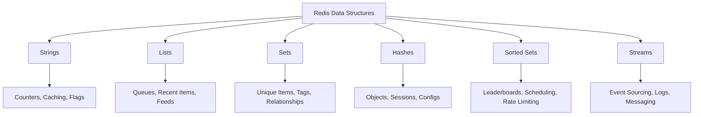

# How to Use Redis Data Structures Effectively

Author: [nawazdhandala](https://github.com/nawazdhandala)

Tags: Redis, Data Structures, Caching, Performance, Backend Development

Description: A practical guide to Redis data structures including Strings, Lists, Sets, Hashes, Sorted Sets, and Streams - with real-world examples and performance tips for building efficient applications.

---

Redis is much more than a simple key-value cache. Its built-in data structures let you solve complex problems with minimal code and maximum performance. But many developers only scratch the surface, using Redis as a basic cache when it can do so much more.

This guide covers each Redis data structure with practical examples. You will learn when to use each type, common patterns, and performance considerations that matter in production.

## Redis Data Structure Overview

Before diving into code, here is a quick comparison of what each data structure offers:



| Data Structure | Time Complexity | Best For |
|----------------|-----------------|----------|
| Strings | O(1) get/set | Caching, counters, simple values |
| Lists | O(1) push/pop | Queues, recent items, feeds |
| Sets | O(1) add/remove | Unique collections, tags |
| Hashes | O(1) per field | Objects with multiple fields |
| Sorted Sets | O(log N) add | Leaderboards, time-based data |
| Streams | O(1) append | Event logs, messaging |

## Strings - More Than Just Text

Strings are the foundation of Redis. Despite the name, they can store text, numbers, serialized JSON, or binary data up to 512MB.

### Basic Operations

```python
import redis

# Connect to Redis
r = redis.Redis(host='localhost', port=6379, decode_responses=True)

# Simple string operations
r.set('user:1001:name', 'Alice')
name = r.get('user:1001:name')  # Returns: 'Alice'

# Set with expiration (good for caching)
r.setex('session:abc123', 3600, 'user_data_here')  # Expires in 1 hour

# Set only if key doesn't exist (useful for locks)
was_set = r.setnx('lock:resource', 'owner_id')  # Returns True if set, False if key exists
```

### Atomic Counters

Strings shine when you need atomic counters. The INCR command is thread-safe and blazingly fast.

```python
# Page view counter - atomic increment
r.incr('page:home:views')
r.incrby('page:home:views', 10)  # Increment by 10

# Rate limiting with counters
def check_rate_limit(user_id, limit=100, window=60):
    """
    Allow 'limit' requests per 'window' seconds.
    Returns True if request is allowed, False if rate limited.
    """
    key = f'rate:{user_id}:{int(time.time() // window)}'

    current = r.incr(key)
    if current == 1:
        # First request in this window - set expiration
        r.expire(key, window)

    return current <= limit
```

### Caching Serialized Objects

```python
import json

def get_user_profile(user_id):
    """
    Cache user profiles with automatic expiration.
    """
    cache_key = f'user:{user_id}:profile'

    # Try cache first
    cached = r.get(cache_key)
    if cached:
        return json.loads(cached)

    # Cache miss - fetch from database
    profile = fetch_from_database(user_id)

    # Cache for 5 minutes
    r.setex(cache_key, 300, json.dumps(profile))

    return profile
```

## Lists - Queues and Recent Items

Redis Lists are linked lists that support push/pop operations from both ends. They are perfect for queues, recent activity feeds, and bounded collections.

### Building a Task Queue

```python
# Producer - add tasks to queue
def enqueue_task(task_data):
    """
    Add a task to the processing queue.
    LPUSH adds to the left (head) of the list.
    """
    r.lpush('tasks:pending', json.dumps(task_data))

# Consumer - process tasks
def process_tasks():
    """
    Process tasks from the queue using blocking pop.
    BRPOP blocks until an item is available (timeout of 30 seconds).
    """
    while True:
        # BRPOP returns (key, value) tuple or None on timeout
        result = r.brpop('tasks:pending', timeout=30)
        if result:
            _, task_json = result
            task = json.loads(task_json)
            handle_task(task)

# Reliable queue with backup (in case worker crashes)
def process_tasks_reliably():
    """
    Move task to processing list atomically.
    If worker crashes, tasks can be recovered from processing list.
    """
    while True:
        # BRPOPLPUSH: pop from source, push to destination
        task_json = r.brpoplpush(
            'tasks:pending',
            'tasks:processing',
            timeout=30
        )
        if task_json:
            try:
                task = json.loads(task_json)
                handle_task(task)
                # Remove from processing list on success
                r.lrem('tasks:processing', 1, task_json)
            except Exception as e:
                # Task stays in processing list for recovery
                log_error(e)
```

### Recent Activity Feed

```python
def add_activity(user_id, activity):
    """
    Maintain a bounded list of recent activities.
    Only keeps the last 100 items.
    """
    key = f'user:{user_id}:activity'

    # Add to front of list
    r.lpush(key, json.dumps(activity))

    # Trim to keep only last 100 items
    # This is O(1) because we trim by a constant amount
    r.ltrim(key, 0, 99)

def get_recent_activity(user_id, count=20):
    """
    Get the most recent activities.
    """
    key = f'user:{user_id}:activity'

    # LRANGE returns items from start to stop (inclusive)
    items = r.lrange(key, 0, count - 1)
    return [json.loads(item) for item in items]
```

## Sets - Unique Collections

Sets store unique unordered elements. They support powerful operations like union, intersection, and difference that make them great for tags, relationships, and deduplication.

### Tag System

```python
def add_tags(article_id, tags):
    """
    Add tags to an article.
    Sets automatically handle duplicates.
    """
    key = f'article:{article_id}:tags'
    if tags:
        r.sadd(key, *tags)

def get_tags(article_id):
    """
    Get all tags for an article.
    """
    return r.smembers(f'article:{article_id}:tags')

def find_articles_by_tag(tag):
    """
    Maintain reverse index: tag -> articles.
    """
    return r.smembers(f'tag:{tag}:articles')

def find_articles_with_all_tags(tags):
    """
    Find articles that have ALL specified tags.
    Uses set intersection across multiple tag sets.
    """
    keys = [f'tag:{tag}:articles' for tag in tags]
    return r.sinter(keys)  # Returns articles in ALL sets

def find_articles_with_any_tag(tags):
    """
    Find articles that have ANY of the specified tags.
    Uses set union across multiple tag sets.
    """
    keys = [f'tag:{tag}:articles' for tag in tags]
    return r.sunion(keys)  # Returns articles in ANY set
```

### Online Users and Presence

```python
def set_user_online(user_id):
    """
    Track online users with a set.
    """
    r.sadd('users:online', user_id)

def set_user_offline(user_id):
    """
    Remove user from online set.
    """
    r.srem('users:online', user_id)

def get_online_count():
    """
    Get count of online users efficiently.
    """
    return r.scard('users:online')  # Returns set cardinality

def is_user_online(user_id):
    """
    Check if specific user is online.
    O(1) membership check.
    """
    return r.sismember('users:online', user_id)

def get_mutual_friends(user_a, user_b):
    """
    Find mutual friends using set intersection.
    """
    return r.sinter(
        f'user:{user_a}:friends',
        f'user:{user_b}:friends'
    )
```

## Hashes - Structured Objects

Hashes store field-value pairs under a single key. They are memory-efficient for storing objects and let you update individual fields without reading the entire object.

### User Session Management

```python
def create_session(session_id, user_data):
    """
    Store session data as a hash.
    More memory-efficient than separate string keys.
    """
    key = f'session:{session_id}'

    # HSET can set multiple fields at once
    r.hset(key, mapping={
        'user_id': user_data['user_id'],
        'username': user_data['username'],
        'role': user_data['role'],
        'created_at': str(time.time()),
        'last_access': str(time.time())
    })

    # Set session expiration (1 hour)
    r.expire(key, 3600)

def get_session(session_id):
    """
    Get all session data at once.
    """
    key = f'session:{session_id}'
    data = r.hgetall(key)

    if not data:
        return None

    return data

def update_session_access(session_id):
    """
    Update a single field without reading the whole object.
    This is what makes hashes powerful.
    """
    key = f'session:{session_id}'

    # Update single field
    r.hset(key, 'last_access', str(time.time()))

    # Refresh expiration
    r.expire(key, 3600)

def increment_session_counter(session_id, field):
    """
    Atomic increment on a hash field.
    Useful for tracking requests per session.
    """
    return r.hincrby(f'session:{session_id}', field, 1)
```

### Configuration Storage

```python
class RedisConfig:
    """
    Store application configuration in Redis hash.
    Supports live updates without restart.
    """

    def __init__(self, redis_client, config_key='app:config'):
        self.redis = redis_client
        self.key = config_key

    def get(self, field, default=None):
        """
        Get a single config value.
        """
        value = self.redis.hget(self.key, field)
        return value if value is not None else default

    def get_all(self):
        """
        Get all configuration as a dictionary.
        """
        return self.redis.hgetall(self.key)

    def set(self, field, value):
        """
        Update a single config value.
        """
        self.redis.hset(self.key, field, value)

    def set_many(self, config_dict):
        """
        Update multiple config values atomically.
        """
        self.redis.hset(self.key, mapping=config_dict)

# Usage
config = RedisConfig(r)
config.set_many({
    'max_upload_size': '10485760',
    'rate_limit': '100',
    'maintenance_mode': 'false'
})

max_size = int(config.get('max_upload_size', '5242880'))
```

## Sorted Sets - Ranked Data

Sorted Sets combine the uniqueness of sets with a score that determines order. They are perfect for leaderboards, scheduling, and any ranked data.

### Leaderboard Implementation

```python
def update_score(leaderboard_name, user_id, score):
    """
    Add or update a user's score.
    If user exists, score is updated.
    """
    r.zadd(f'leaderboard:{leaderboard_name}', {user_id: score})

def increment_score(leaderboard_name, user_id, points):
    """
    Atomically increment a user's score.
    """
    return r.zincrby(f'leaderboard:{leaderboard_name}', points, user_id)

def get_top_players(leaderboard_name, count=10):
    """
    Get top N players with scores.
    ZREVRANGE returns highest scores first.
    """
    key = f'leaderboard:{leaderboard_name}'

    # Returns list of (member, score) tuples
    return r.zrevrange(key, 0, count - 1, withscores=True)

def get_player_rank(leaderboard_name, user_id):
    """
    Get a player's rank (0-indexed, 0 is highest).
    Returns None if player not in leaderboard.
    """
    rank = r.zrevrank(f'leaderboard:{leaderboard_name}', user_id)
    return rank + 1 if rank is not None else None  # Convert to 1-indexed

def get_players_around(leaderboard_name, user_id, count=5):
    """
    Get players around a specific user's rank.
    Useful for showing context in leaderboards.
    """
    key = f'leaderboard:{leaderboard_name}'
    rank = r.zrevrank(key, user_id)

    if rank is None:
        return []

    # Get 'count' players above and below
    start = max(0, rank - count)
    end = rank + count

    return r.zrevrange(key, start, end, withscores=True)
```

### Scheduled Jobs

```python
import time

def schedule_job(job_id, run_at_timestamp, job_data):
    """
    Schedule a job to run at a specific time.
    Score is the Unix timestamp when job should run.
    """
    r.zadd('jobs:scheduled', {json.dumps({
        'id': job_id,
        'data': job_data
    }): run_at_timestamp})

def get_due_jobs(batch_size=100):
    """
    Get jobs that are due to run.
    Uses ZRANGEBYSCORE to get items with score <= now.
    """
    now = time.time()

    # Get jobs with score (timestamp) <= current time
    jobs = r.zrangebyscore(
        'jobs:scheduled',
        '-inf',  # Minimum score
        now,     # Maximum score (current time)
        start=0,
        num=batch_size,
        withscores=True
    )

    return [(json.loads(job), score) for job, score in jobs]

def process_scheduled_jobs():
    """
    Process jobs that are ready to run.
    """
    while True:
        jobs = get_due_jobs()

        for job_data, scheduled_time in jobs:
            try:
                # Process the job
                execute_job(job_data)

                # Remove from scheduled set
                r.zrem('jobs:scheduled', json.dumps(job_data))
            except Exception as e:
                log_error(e, job_data)

        # Sleep briefly to avoid spinning
        time.sleep(1)
```

### Sliding Window Rate Limiter

```python
def sliding_window_rate_limit(user_id, limit=100, window=60):
    """
    Sliding window rate limiter using sorted sets.
    More accurate than fixed window approach.

    Returns True if request is allowed, False if rate limited.
    """
    key = f'ratelimit:{user_id}'
    now = time.time()
    window_start = now - window

    # Use pipeline for atomic operations
    pipe = r.pipeline()

    # Remove old entries outside the window
    pipe.zremrangebyscore(key, '-inf', window_start)

    # Count current entries in window
    pipe.zcard(key)

    # Add current request with timestamp as score
    pipe.zadd(key, {str(now): now})

    # Set key expiration to clean up old keys
    pipe.expire(key, window)

    # Execute pipeline
    results = pipe.execute()
    current_count = results[1]

    # Check if under limit (check before adding current request)
    if current_count >= limit:
        # Remove the request we just added
        r.zrem(key, str(now))
        return False

    return True
```

## Streams - Event Logs and Messaging

Streams are append-only logs with consumer groups support. They are ideal for event sourcing, activity streams, and pub/sub patterns with persistence.

### Event Log

```python
def log_event(stream_name, event_type, data):
    """
    Append an event to a stream.
    Returns the auto-generated event ID.
    """
    event_id = r.xadd(f'events:{stream_name}', {
        'type': event_type,
        'data': json.dumps(data),
        'timestamp': str(time.time())
    })
    return event_id

def get_recent_events(stream_name, count=100):
    """
    Get the most recent events from a stream.
    """
    # XREVRANGE returns newest first
    events = r.xrevrange(
        f'events:{stream_name}',
        '+',  # Maximum ID (newest)
        '-',  # Minimum ID (oldest)
        count=count
    )

    return [
        {'id': event_id, **fields}
        for event_id, fields in events
    ]

def get_events_since(stream_name, last_id):
    """
    Get events after a specific ID.
    Useful for catching up after reconnection.
    """
    events = r.xrange(
        f'events:{stream_name}',
        f'({last_id}',  # Exclusive start (events AFTER this ID)
        '+'             # Up to newest
    )

    return [
        {'id': event_id, **fields}
        for event_id, fields in events
    ]
```

### Consumer Groups for Distributed Processing

```python
def setup_consumer_group(stream_name, group_name):
    """
    Create a consumer group for a stream.
    Consumer groups allow multiple workers to process events.
    """
    try:
        r.xgroup_create(
            f'events:{stream_name}',
            group_name,
            id='0',  # Start from beginning
            mkstream=True  # Create stream if it doesn't exist
        )
    except redis.ResponseError as e:
        if 'BUSYGROUP' not in str(e):
            raise  # Group already exists is OK

def consume_events(stream_name, group_name, consumer_name, batch_size=10):
    """
    Consume events as part of a consumer group.
    Each event is delivered to exactly one consumer in the group.
    """
    while True:
        # XREADGROUP: read events assigned to this consumer
        events = r.xreadgroup(
            group_name,
            consumer_name,
            {f'events:{stream_name}': '>'},  # '>' means only new events
            count=batch_size,
            block=5000  # Block for 5 seconds waiting for events
        )

        if not events:
            continue

        for stream, messages in events:
            for event_id, fields in messages:
                try:
                    process_event(event_id, fields)

                    # Acknowledge successful processing
                    r.xack(stream, group_name, event_id)
                except Exception as e:
                    log_error(e, event_id, fields)
                    # Don't acknowledge - event will be redelivered

def recover_pending_events(stream_name, group_name, consumer_name, min_idle_time=60000):
    """
    Claim events that were assigned to crashed consumers.
    Events idle for more than min_idle_time (ms) are reclaimed.
    """
    # XPENDING shows unacknowledged events
    pending = r.xpending_range(
        f'events:{stream_name}',
        group_name,
        '-', '+',
        count=100
    )

    for event_info in pending:
        event_id = event_info['message_id']
        idle_time = event_info['time_since_delivered']

        if idle_time >= min_idle_time:
            # Claim the event for this consumer
            r.xclaim(
                f'events:{stream_name}',
                group_name,
                consumer_name,
                min_idle_time,
                [event_id]
            )
```

## Performance Tips

### Pipeline Commands

Reduce round trips by batching commands:

```python
def get_multiple_users(user_ids):
    """
    Fetch multiple users in a single round trip.
    Pipeline batches commands and sends them together.
    """
    pipe = r.pipeline()

    for user_id in user_ids:
        pipe.hgetall(f'user:{user_id}')

    # Execute all commands at once
    results = pipe.execute()

    return dict(zip(user_ids, results))
```

### Memory Optimization

```python
# Use short key names in production
# Instead of: user:profile:settings:theme
# Use: u:p:s:t

# Use SCAN instead of KEYS for large datasets
def find_keys_safely(pattern, batch_size=1000):
    """
    SCAN is non-blocking unlike KEYS.
    Safe to use in production.
    """
    cursor = 0
    all_keys = []

    while True:
        cursor, keys = r.scan(cursor, match=pattern, count=batch_size)
        all_keys.extend(keys)

        if cursor == 0:
            break

    return all_keys

# Set memory limits with MAXMEMORY policies
# In redis.conf: maxmemory-policy volatile-lru
```

### Connection Pooling

```python
import redis

# Create a connection pool (do this once at startup)
pool = redis.ConnectionPool(
    host='localhost',
    port=6379,
    max_connections=50,
    decode_responses=True
)

# Get connections from the pool
def get_redis():
    return redis.Redis(connection_pool=pool)

# Connections are automatically returned to pool when done
```

## Choosing the Right Data Structure

| Use Case | Data Structure | Why |
|----------|----------------|-----|
| Session storage | Hash | Update fields independently |
| Cache | String | Simple, with expiration |
| Task queue | List | FIFO with blocking pop |
| Unique visitors | Set | Automatic deduplication |
| Leaderboard | Sorted Set | Ordered by score |
| Activity feed | Stream or List | Append-only with trimming |
| Rate limiting | Sorted Set | Sliding window accuracy |
| Real-time analytics | String + INCR | Atomic counters |
| Tag relationships | Set | Intersection/union operations |
| Scheduled jobs | Sorted Set | Score as timestamp |

## Summary

Redis data structures let you solve complex problems with simple commands. Strings handle caching and counters. Lists power queues and feeds. Sets manage unique collections and relationships. Hashes store structured objects efficiently. Sorted Sets handle rankings and scheduling. Streams provide durable event logs.

The key is matching your use case to the right data structure. A leaderboard in a Sorted Set is simpler and faster than building one with Strings. A rate limiter using Sorted Sets handles sliding windows elegantly. Consumer groups on Streams distribute work across workers reliably.

Start with the simplest structure that fits your needs, then optimize based on real usage patterns. Redis gives you the building blocks - how you combine them is where the real power lies.
