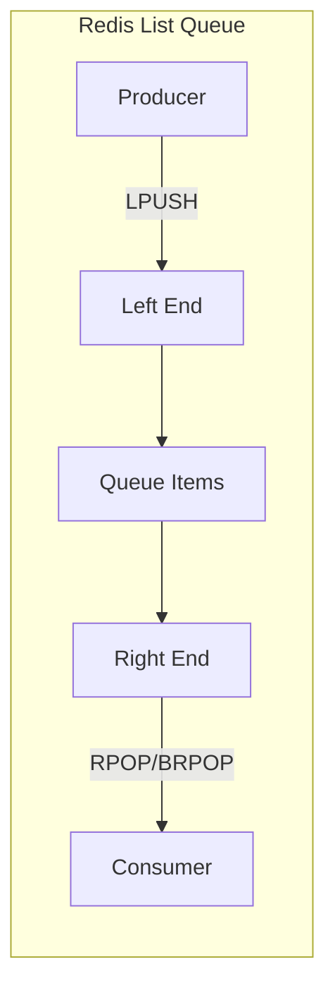
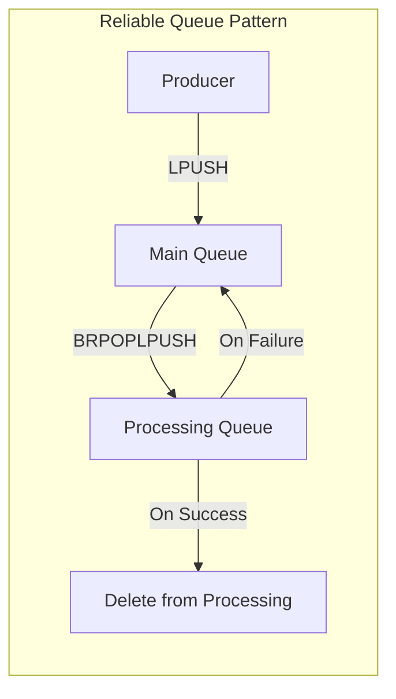

# How to Build Message Queues with Redis Lists

Author: [nawazdhandala](https://www.github.com/nawazdhandala)

Tags: Redis, Message Queue, Lists, BRPOP, LPUSH, Background Jobs, Task Processing

Description: Learn how to build reliable message queues using Redis Lists. This guide covers producer-consumer patterns, blocking operations, reliable delivery with RPOPLPUSH, and implementing priority queues.

---

> Redis Lists provide a simple yet powerful foundation for building message queues. With atomic operations like LPUSH and BRPOP, you can implement producer-consumer patterns that handle thousands of messages per second with minimal complexity.

Message queues decouple producers from consumers, enabling asynchronous processing, load leveling, and fault tolerance. While dedicated message brokers like RabbitMQ or Kafka offer advanced features, Redis Lists provide a lightweight alternative that's often sufficient and much simpler to operate.

---

## Understanding Redis Lists for Queues

### Basic Queue Operations

Redis Lists support operations from both ends, making them perfect for FIFO queues:



Key commands:
- **LPUSH**: Add items to the left (head) of the list
- **RPOP**: Remove items from the right (tail) of the list
- **BRPOP**: Blocking pop - waits for items if queue is empty
- **LLEN**: Get queue length

---

## Basic Producer-Consumer Pattern

### Simple Queue Implementation

```python
import redis
import json
import time
from datetime import datetime

class SimpleQueue:
    """
    Basic Redis queue implementation using Lists.
    Messages flow from left (push) to right (pop).
    """

    def __init__(self, redis_client, queue_name):
        self.redis = redis_client
        self.queue_name = queue_name

    def enqueue(self, message):
        """
        Add a message to the queue.
        Messages are pushed to the left, creating FIFO order.
        """
        # Wrap message with metadata
        envelope = {
            'id': f"{time.time_ns()}",
            'timestamp': datetime.utcnow().isoformat(),
            'payload': message
        }

        # LPUSH returns the new length of the list
        length = self.redis.lpush(self.queue_name, json.dumps(envelope))
        return envelope['id'], length

    def dequeue(self, timeout=0):
        """
        Remove and return the next message from the queue.

        timeout: seconds to wait for a message (0 = block forever)
        Returns None if timeout expires with no message.
        """
        # BRPOP blocks until a message is available
        # Returns tuple: (queue_name, message) or None on timeout
        result = self.redis.brpop(self.queue_name, timeout=timeout)

        if result is None:
            return None

        queue_name, raw_message = result
        envelope = json.loads(raw_message)

        return envelope

    def peek(self, count=1):
        """
        Look at messages without removing them.
        Useful for monitoring and debugging.
        """
        # LRANGE returns elements from right to left (oldest first)
        messages = self.redis.lrange(self.queue_name, -count, -1)
        return [json.loads(m) for m in messages]

    def length(self):
        """Get the number of messages in the queue"""
        return self.redis.llen(self.queue_name)

    def clear(self):
        """Remove all messages from the queue"""
        return self.redis.delete(self.queue_name)

# Usage example
r = redis.Redis(host='localhost', port=6379, decode_responses=True)
queue = SimpleQueue(r, 'tasks')

# Producer: add some tasks
task1_id, _ = queue.enqueue({'action': 'send_email', 'to': 'user@example.com'})
task2_id, _ = queue.enqueue({'action': 'process_image', 'file': 'photo.jpg'})

print(f"Queue length: {queue.length()}")

# Consumer: process tasks
while queue.length() > 0:
    message = queue.dequeue(timeout=1)
    if message:
        print(f"Processing task {message['id']}: {message['payload']}")
```

### Running Workers

Create worker processes that continuously consume messages:

```python
import redis
import json
import signal
import sys
import time

class Worker:
    """
    Background worker that processes queue messages.
    Handles graceful shutdown on SIGTERM/SIGINT.
    """

    def __init__(self, redis_client, queue_name, handler_func):
        self.redis = redis_client
        self.queue_name = queue_name
        self.handler = handler_func
        self.running = True

        # Set up signal handlers for graceful shutdown
        signal.signal(signal.SIGTERM, self._shutdown)
        signal.signal(signal.SIGINT, self._shutdown)

    def _shutdown(self, signum, frame):
        """Handle shutdown signals gracefully"""
        print(f"\nReceived signal {signum}, shutting down...")
        self.running = False

    def run(self):
        """
        Main worker loop. Blocks waiting for messages.
        """
        print(f"Worker started, listening on queue: {self.queue_name}")

        while self.running:
            try:
                # Use short timeout to allow checking self.running
                result = self.redis.brpop(self.queue_name, timeout=1)

                if result is None:
                    continue  # Timeout, check if still running

                queue_name, raw_message = result
                envelope = json.loads(raw_message)

                print(f"Processing message {envelope['id']}")

                try:
                    # Call the handler function with the payload
                    self.handler(envelope['payload'])
                    print(f"Completed message {envelope['id']}")

                except Exception as e:
                    # Handler failed - in production, you'd retry or dead-letter
                    print(f"Error processing {envelope['id']}: {e}")

            except redis.ConnectionError as e:
                print(f"Redis connection error: {e}")
                time.sleep(5)  # Wait before reconnecting

        print("Worker stopped")

# Define task handlers
def process_task(payload):
    """Example task handler"""
    action = payload.get('action')

    if action == 'send_email':
        print(f"  Sending email to {payload.get('to')}")
        time.sleep(0.5)  # Simulate work

    elif action == 'process_image':
        print(f"  Processing image: {payload.get('file')}")
        time.sleep(1)  # Simulate work

    else:
        print(f"  Unknown action: {action}")

# Run worker
if __name__ == '__main__':
    r = redis.Redis(host='localhost', port=6379, decode_responses=True)
    worker = Worker(r, 'tasks', process_task)
    worker.run()
```

---

## Reliable Queue with RPOPLPUSH

The basic pattern has a problem: if a worker crashes while processing, the message is lost. RPOPLPUSH provides at-least-once delivery:



### Implementation

```python
import redis
import json
import time
from datetime import datetime

class ReliableQueue:
    """
    Reliable queue that guarantees message delivery.

    Uses two lists:
    - Main queue: holds pending messages
    - Processing queue: holds messages being processed

    If a worker crashes, messages in processing can be recovered.
    """

    def __init__(self, redis_client, queue_name, processing_timeout=30):
        self.redis = redis_client
        self.queue_name = queue_name
        self.processing_queue = f"{queue_name}:processing"
        self.processing_timeout = processing_timeout

    def enqueue(self, message):
        """Add a message to the queue"""
        envelope = {
            'id': f"{time.time_ns()}",
            'timestamp': datetime.utcnow().isoformat(),
            'attempts': 0,
            'payload': message
        }
        self.redis.lpush(self.queue_name, json.dumps(envelope))
        return envelope['id']

    def dequeue(self, timeout=0):
        """
        Atomically move a message from main queue to processing queue.

        BRPOPLPUSH is atomic - the message either stays in main queue
        or moves to processing queue, never lost.
        """
        # BRPOPLPUSH: blocking pop from source, push to destination
        raw_message = self.redis.brpoplpush(
            self.queue_name,
            self.processing_queue,
            timeout=timeout
        )

        if raw_message is None:
            return None

        envelope = json.loads(raw_message)
        envelope['started_at'] = datetime.utcnow().isoformat()
        envelope['attempts'] += 1

        # Update the message in processing queue with new metadata
        # Remove old version and add updated one
        self.redis.lrem(self.processing_queue, 1, raw_message)
        self.redis.lpush(self.processing_queue, json.dumps(envelope))

        return envelope

    def complete(self, envelope):
        """
        Mark a message as successfully processed.
        Removes it from the processing queue.
        """
        raw_message = json.dumps(envelope)
        removed = self.redis.lrem(self.processing_queue, 1, raw_message)
        return removed > 0

    def fail(self, envelope, requeue=True):
        """
        Mark a message as failed.

        If requeue=True, move it back to main queue for retry.
        If requeue=False, message is dropped (or you could move to dead-letter).
        """
        raw_message = json.dumps(envelope)
        self.redis.lrem(self.processing_queue, 1, raw_message)

        if requeue:
            # Reset started_at and push back to main queue
            envelope.pop('started_at', None)
            self.redis.rpush(self.queue_name, json.dumps(envelope))

    def recover_stale(self):
        """
        Recover messages that have been processing too long.

        Run this periodically to handle crashed workers.
        """
        # Get all messages in processing queue
        messages = self.redis.lrange(self.processing_queue, 0, -1)
        recovered = 0

        for raw_message in messages:
            envelope = json.loads(raw_message)

            # Check if processing time exceeded timeout
            if 'started_at' in envelope:
                started = datetime.fromisoformat(envelope['started_at'])
                elapsed = (datetime.utcnow() - started).total_seconds()

                if elapsed > self.processing_timeout:
                    print(f"Recovering stale message: {envelope['id']}")
                    self.fail(envelope, requeue=True)
                    recovered += 1

        return recovered

    def stats(self):
        """Get queue statistics"""
        return {
            'pending': self.redis.llen(self.queue_name),
            'processing': self.redis.llen(self.processing_queue)
        }

# Usage with reliable delivery
r = redis.Redis(host='localhost', port=6379, decode_responses=True)
queue = ReliableQueue(r, 'reliable_tasks', processing_timeout=60)

# Producer
queue.enqueue({'job': 'important_task', 'data': 'valuable'})

# Consumer with explicit completion
message = queue.dequeue(timeout=5)
if message:
    try:
        # Process the message
        print(f"Processing: {message['payload']}")
        # ... do work ...

        # Mark as complete only after successful processing
        queue.complete(message)
        print("Task completed successfully")

    except Exception as e:
        # Processing failed, requeue for retry
        print(f"Task failed: {e}")
        queue.fail(message, requeue=True)
```

---

## Priority Queue

Implement priority levels using multiple lists:

```python
class PriorityQueue:
    """
    Priority queue using multiple Redis lists.

    Higher priority messages are processed first.
    Within same priority, FIFO order is maintained.
    """

    PRIORITIES = ['critical', 'high', 'normal', 'low']

    def __init__(self, redis_client, base_name):
        self.redis = redis_client
        self.base_name = base_name
        # Create queue names for each priority
        self.queues = {
            p: f"{base_name}:{p}"
            for p in self.PRIORITIES
        }

    def enqueue(self, message, priority='normal'):
        """
        Add message to appropriate priority queue.
        """
        if priority not in self.PRIORITIES:
            raise ValueError(f"Invalid priority: {priority}")

        envelope = {
            'id': f"{time.time_ns()}",
            'priority': priority,
            'timestamp': datetime.utcnow().isoformat(),
            'payload': message
        }

        queue_name = self.queues[priority]
        self.redis.lpush(queue_name, json.dumps(envelope))

        return envelope['id']

    def dequeue(self, timeout=0):
        """
        Get the highest priority message available.

        Uses BRPOP with multiple keys - Redis checks them in order
        and returns from the first non-empty queue.
        """
        # Order queues by priority (critical first)
        queue_names = [self.queues[p] for p in self.PRIORITIES]

        # BRPOP checks queues in order, returns from first non-empty
        result = self.redis.brpop(queue_names, timeout=timeout)

        if result is None:
            return None

        queue_name, raw_message = result
        envelope = json.loads(raw_message)

        return envelope

    def stats(self):
        """Get message counts per priority"""
        return {
            priority: self.redis.llen(queue_name)
            for priority, queue_name in self.queues.items()
        }

# Usage
r = redis.Redis(host='localhost', port=6379, decode_responses=True)
pq = PriorityQueue(r, 'jobs')

# Add jobs with different priorities
pq.enqueue({'task': 'system_alert'}, priority='critical')
pq.enqueue({'task': 'user_request'}, priority='high')
pq.enqueue({'task': 'batch_process'}, priority='normal')
pq.enqueue({'task': 'cleanup'}, priority='low')

print("Queue stats:", pq.stats())

# Consumer processes highest priority first
while True:
    message = pq.dequeue(timeout=1)
    if message is None:
        break
    print(f"Processing [{message['priority']}]: {message['payload']}")
```

---

## Delayed Queue

Schedule messages for future processing:

```python
class DelayedQueue:
    """
    Delayed queue using a sorted set for scheduling
    and a list for ready-to-process messages.

    Messages are added with a future timestamp and
    moved to the ready queue when their time comes.
    """

    def __init__(self, redis_client, queue_name):
        self.redis = redis_client
        self.queue_name = queue_name
        self.scheduled_set = f"{queue_name}:scheduled"
        self.ready_queue = f"{queue_name}:ready"

    def schedule(self, message, delay_seconds):
        """
        Schedule a message for future delivery.

        delay_seconds: how many seconds to wait before message is ready
        """
        envelope = {
            'id': f"{time.time_ns()}",
            'scheduled_for': time.time() + delay_seconds,
            'payload': message
        }

        # ZADD with score = scheduled timestamp
        self.redis.zadd(
            self.scheduled_set,
            {json.dumps(envelope): envelope['scheduled_for']}
        )

        return envelope['id']

    def promote_ready(self):
        """
        Move scheduled messages that are ready to the ready queue.

        This should be called periodically by a scheduler process.
        """
        now = time.time()

        # Get all messages with score <= now
        # Using a Lua script for atomicity
        script = """
        local scheduled = KEYS[1]
        local ready = KEYS[2]
        local now = tonumber(ARGV[1])

        -- Get messages ready to process
        local messages = redis.call('ZRANGEBYSCORE', scheduled, '-inf', now)

        local promoted = 0
        for _, msg in ipairs(messages) do
            -- Move to ready queue
            redis.call('LPUSH', ready, msg)
            redis.call('ZREM', scheduled, msg)
            promoted = promoted + 1
        end

        return promoted
        """

        promoted = self.redis.eval(
            script,
            2,  # Number of keys
            self.scheduled_set,
            self.ready_queue,
            now
        )

        return promoted

    def dequeue(self, timeout=0):
        """
        Get a ready message for processing.
        """
        result = self.redis.brpop(self.ready_queue, timeout=timeout)

        if result is None:
            return None

        queue_name, raw_message = result
        envelope = json.loads(raw_message)

        return envelope

    def stats(self):
        """Get queue statistics"""
        return {
            'scheduled': self.redis.zcard(self.scheduled_set),
            'ready': self.redis.llen(self.ready_queue)
        }

# Usage
r = redis.Redis(host='localhost', port=6379, decode_responses=True)
dq = DelayedQueue(r, 'delayed_tasks')

# Schedule tasks for the future
dq.schedule({'task': 'send_reminder'}, delay_seconds=60)  # 1 minute
dq.schedule({'task': 'check_status'}, delay_seconds=5)    # 5 seconds

print("Initial stats:", dq.stats())

# In production, run this in a scheduler loop
import time
for _ in range(10):
    promoted = dq.promote_ready()
    if promoted > 0:
        print(f"Promoted {promoted} messages")

    message = dq.dequeue(timeout=1)
    if message:
        print(f"Processing: {message['payload']}")

    time.sleep(1)
```

---

## Monitoring Queue Health

```python
class QueueMonitor:
    """
    Monitor Redis queue metrics for alerting and dashboards.
    """

    def __init__(self, redis_client, queue_names):
        self.redis = redis_client
        self.queue_names = queue_names

    def get_metrics(self):
        """
        Collect metrics for all monitored queues.
        """
        metrics = {}

        for queue_name in self.queue_names:
            length = self.redis.llen(queue_name)

            # Check oldest message age
            oldest = self.redis.lindex(queue_name, -1)
            age_seconds = 0

            if oldest:
                try:
                    envelope = json.loads(oldest)
                    created = datetime.fromisoformat(envelope['timestamp'])
                    age_seconds = (datetime.utcnow() - created).total_seconds()
                except (json.JSONDecodeError, KeyError):
                    pass

            metrics[queue_name] = {
                'length': length,
                'oldest_message_age_seconds': age_seconds
            }

        return metrics

    def check_health(self, max_length=10000, max_age_seconds=300):
        """
        Check queue health against thresholds.
        Returns list of issues found.
        """
        metrics = self.get_metrics()
        issues = []

        for queue_name, data in metrics.items():
            if data['length'] > max_length:
                issues.append({
                    'queue': queue_name,
                    'issue': 'queue_too_long',
                    'value': data['length'],
                    'threshold': max_length
                })

            if data['oldest_message_age_seconds'] > max_age_seconds:
                issues.append({
                    'queue': queue_name,
                    'issue': 'messages_too_old',
                    'value': data['oldest_message_age_seconds'],
                    'threshold': max_age_seconds
                })

        return issues

# Usage
r = redis.Redis(host='localhost', port=6379, decode_responses=True)
monitor = QueueMonitor(r, ['tasks', 'tasks:processing', 'jobs:critical'])

metrics = monitor.get_metrics()
print("Queue metrics:", json.dumps(metrics, indent=2))

issues = monitor.check_health(max_length=1000, max_age_seconds=60)
if issues:
    print("Health issues found:")
    for issue in issues:
        print(f"  {issue['queue']}: {issue['issue']} ({issue['value']})")
```

---

## Conclusion

Redis Lists provide a solid foundation for building message queues. Key patterns covered:

- **Basic queue**: LPUSH/BRPOP for simple producer-consumer
- **Reliable queue**: BRPOPLPUSH for at-least-once delivery
- **Priority queue**: Multiple lists with ordered BRPOP
- **Delayed queue**: Sorted sets for scheduling

For most applications, Redis queues offer excellent performance with minimal operational overhead. Consider dedicated message brokers when you need features like message acknowledgment groups, complex routing, or cross-datacenter replication.

---

*Monitor your Redis queue depths and processing latency with [OneUptime](https://oneuptime.com). Set up alerts for queue backup before it impacts your application.*

**Related Reading:**
- [How to Build Distributed Counters with Redis](https://oneuptime.com/blog/post/2026-01-27-redis-distributed-counters/view)
- [How to Debug Latency with Redis SLOWLOG](https://oneuptime.com/blog/post/2026-01-26-redis-slowlog-latency-debugging/view)
