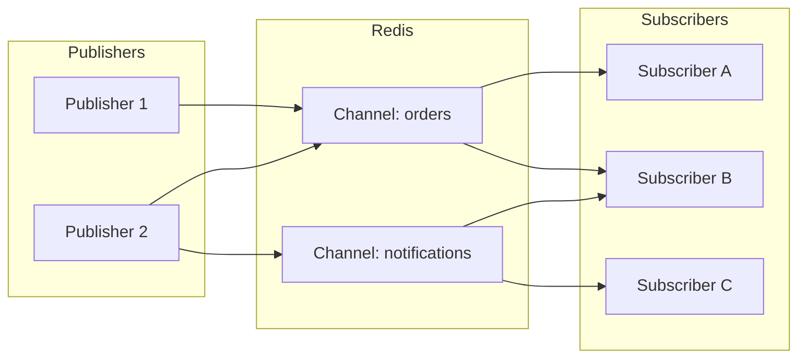
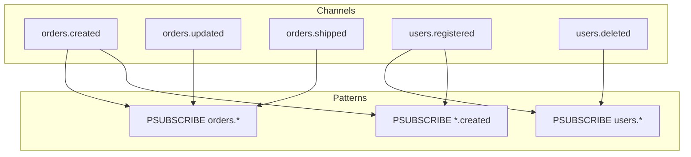
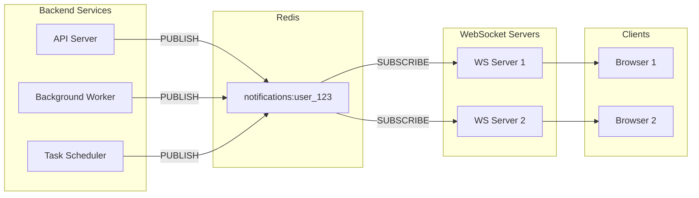

# How to Implement Redis Pub/Sub

Author: [nawazdhandala](https://www.github.com/nawazdhandala)

Tags: Redis, Pub/Sub, Messaging, Real-Time, Event-Driven Architecture, Backend Development

Description: A practical guide to implementing Redis Pub/Sub for real-time messaging, covering publishers, subscribers, pattern subscriptions, and production deployment patterns.

---

Redis Pub/Sub is one of those features that sounds simple but becomes incredibly powerful once you understand how to use it properly. At its core, it lets you broadcast messages to multiple subscribers without the publisher knowing who's listening. This decoupling makes it perfect for real-time notifications, live updates, and event-driven architectures.

In this guide, we'll build practical Pub/Sub implementations from the ground up, covering everything from basic patterns to production-ready setups.

## Understanding How Redis Pub/Sub Works

Before writing code, let's understand the mechanics. Redis Pub/Sub follows a fire-and-forget model where publishers send messages to channels, and any subscribers listening to those channels receive the messages instantly.



Key characteristics to remember:

- **No message persistence**: If no subscriber is listening when a message is published, that message is lost forever
- **At-most-once delivery**: Messages are delivered to subscribers present at the time of publishing
- **No acknowledgments**: Publishers don't know if messages were received
- **Real-time only**: This is not a message queue with guaranteed delivery

## Setting Up Redis

First, let's get Redis running. You can install it locally or use Docker:

```bash
# Using Docker (recommended for development)
docker run -d --name redis-pubsub -p 6379:6379 redis:7-alpine

# Verify it's running
docker exec -it redis-pubsub redis-cli ping
# Should return: PONG
```

## Basic Pub/Sub with redis-cli

Before writing application code, let's understand Pub/Sub using the Redis CLI. Open two terminal windows:

**Terminal 1 - Subscriber:**
```bash
docker exec -it redis-pubsub redis-cli

# Subscribe to a channel
SUBSCRIBE news
```

**Terminal 2 - Publisher:**
```bash
docker exec -it redis-pubsub redis-cli

# Publish a message
PUBLISH news "Breaking: Redis Pub/Sub is awesome!"
```

You'll see the message appear in Terminal 1 immediately. The subscriber receives a three-element array: message type, channel name, and the actual message.

## Implementing Pub/Sub in Node.js

Let's build a real application. We'll create a notification system where different services can publish events and multiple consumers can react to them.

### Project Setup

```bash
mkdir redis-pubsub-demo && cd redis-pubsub-demo
npm init -y
npm install redis
```

### The Publisher

```javascript
// publisher.js
// Publishes events to Redis channels for subscribers to consume

import { createClient } from 'redis';

// Create a dedicated client for publishing
// Publishers can use the same connection for other Redis operations
const publisher = createClient({
    url: 'redis://localhost:6379'
});

publisher.on('error', (err) => {
    console.error('Redis Publisher Error:', err);
});

await publisher.connect();
console.log('Publisher connected to Redis');

// Publish a message to a specific channel
// Returns the number of subscribers that received the message
async function publishEvent(channel, event) {
    const message = JSON.stringify({
        ...event,
        timestamp: new Date().toISOString()
    });

    const subscriberCount = await publisher.publish(channel, message);
    console.log(`Published to ${channel}: ${subscriberCount} subscriber(s) received`);
    return subscriberCount;
}

// Simulate publishing various events
async function simulateEvents() {
    // User events
    await publishEvent('users', {
        type: 'user.registered',
        userId: 'usr_123',
        email: 'alice@example.com'
    });

    await publishEvent('users', {
        type: 'user.login',
        userId: 'usr_123',
        ip: '192.168.1.100'
    });

    // Order events
    await publishEvent('orders', {
        type: 'order.created',
        orderId: 'ord_456',
        userId: 'usr_123',
        total: 99.99
    });

    await publishEvent('orders', {
        type: 'order.shipped',
        orderId: 'ord_456',
        trackingNumber: 'TRK789'
    });

    // System events
    await publishEvent('system', {
        type: 'system.health',
        service: 'api-gateway',
        status: 'healthy',
        cpu: 45.2,
        memory: 62.8
    });
}

// Run the simulation
await simulateEvents();

// Keep publishing health checks every 5 seconds
setInterval(async () => {
    await publishEvent('system', {
        type: 'system.health',
        service: 'api-gateway',
        status: 'healthy',
        cpu: Math.random() * 100,
        memory: Math.random() * 100
    });
}, 5000);
```

### The Subscriber

```javascript
// subscriber.js
// Subscribes to Redis channels and processes incoming messages

import { createClient } from 'redis';

// IMPORTANT: Subscribers need a dedicated connection
// Once you subscribe, that connection can ONLY be used for Pub/Sub operations
const subscriber = createClient({
    url: 'redis://localhost:6379'
});

subscriber.on('error', (err) => {
    console.error('Redis Subscriber Error:', err);
});

await subscriber.connect();
console.log('Subscriber connected to Redis');

// Define message handlers for different event types
const eventHandlers = {
    'user.registered': async (event) => {
        console.log(`Welcome email queued for ${event.email}`);
        // In real code: trigger welcome email, create default settings, etc.
    },

    'user.login': async (event) => {
        console.log(`Login recorded for user ${event.userId} from ${event.ip}`);
        // In real code: update last login, check for suspicious activity
    },

    'order.created': async (event) => {
        console.log(`Processing new order ${event.orderId} for $${event.total}`);
        // In real code: reserve inventory, charge payment, send confirmation
    },

    'order.shipped': async (event) => {
        console.log(`Sending shipping notification for ${event.orderId}`);
        // In real code: send email/SMS with tracking info
    },

    'system.health': async (event) => {
        if (event.cpu > 80 || event.memory > 90) {
            console.warn(`ALERT: High resource usage on ${event.service}`);
        }
    }
};

// Generic message processor that routes to specific handlers
function processMessage(message, channel) {
    try {
        const event = JSON.parse(message);
        console.log(`\n[${channel}] Received: ${event.type}`);

        const handler = eventHandlers[event.type];
        if (handler) {
            handler(event);
        } else {
            console.log(`No handler for event type: ${event.type}`);
        }
    } catch (err) {
        console.error('Failed to process message:', err);
    }
}

// Subscribe to multiple channels
// Each subscription receives messages on that specific channel
await subscriber.subscribe('users', (message) => {
    processMessage(message, 'users');
});

await subscriber.subscribe('orders', (message) => {
    processMessage(message, 'orders');
});

await subscriber.subscribe('system', (message) => {
    processMessage(message, 'system');
});

console.log('Subscribed to channels: users, orders, system');
console.log('Waiting for messages...\n');

// Handle graceful shutdown
process.on('SIGINT', async () => {
    console.log('\nShutting down subscriber...');
    await subscriber.unsubscribe();
    await subscriber.quit();
    process.exit(0);
});
```

Run the subscriber first in one terminal, then the publisher in another:

```bash
# Terminal 1
node subscriber.js

# Terminal 2
node publisher.js
```

## Pattern Subscriptions

Sometimes you need to subscribe to multiple channels that match a pattern. Redis supports glob-style pattern matching with `PSUBSCRIBE`.



Here's how to implement pattern subscriptions:

```javascript
// pattern-subscriber.js
// Subscribe to channels matching specific patterns

import { createClient } from 'redis';

const subscriber = createClient({
    url: 'redis://localhost:6379'
});

await subscriber.connect();

// Subscribe to all order-related events
// The asterisk (*) matches any characters
await subscriber.pSubscribe('orders.*', (message, channel) => {
    const event = JSON.parse(message);
    console.log(`[Pattern: orders.*] Channel: ${channel}`);
    console.log(`  Event: ${event.type}, Order: ${event.orderId}`);
});

// Subscribe to all events from the payments service
await subscriber.pSubscribe('payments.*', (message, channel) => {
    const event = JSON.parse(message);
    console.log(`[Pattern: payments.*] Channel: ${channel}`);
    console.log(`  Amount: $${event.amount}, Status: ${event.status}`);
});

// Subscribe to all creation events across all services
// This catches orders.created, users.created, products.created, etc.
await subscriber.pSubscribe('*.created', (message, channel) => {
    const event = JSON.parse(message);
    console.log(`[Pattern: *.created] New resource created on ${channel}`);
});

console.log('Pattern subscriber ready');

// Publisher example for testing
const publisher = createClient({ url: 'redis://localhost:6379' });
await publisher.connect();

// These messages will be caught by pattern subscribers
await publisher.publish('orders.created', JSON.stringify({
    type: 'order.created',
    orderId: 'ord_001',
    total: 150.00
}));

await publisher.publish('orders.shipped', JSON.stringify({
    type: 'order.shipped',
    orderId: 'ord_001',
    carrier: 'FedEx'
}));

await publisher.publish('payments.completed', JSON.stringify({
    type: 'payment.completed',
    orderId: 'ord_001',
    amount: 150.00,
    status: 'success'
}));

await publisher.publish('users.created', JSON.stringify({
    type: 'user.created',
    userId: 'usr_999'
}));
```

## Implementing Pub/Sub in Python

Python developers often prefer the `redis-py` library. Here's the same pattern:

```python
# publisher.py
# Publishes events to Redis channels

import redis
import json
import time
from datetime import datetime

# Create Redis connection
# Publishers can reuse the connection for other operations
redis_client = redis.Redis(
    host='localhost',
    port=6379,
    decode_responses=True  # Return strings instead of bytes
)

def publish_event(channel: str, event: dict) -> int:
    """
    Publish an event to a Redis channel.
    Returns the number of subscribers that received the message.
    """
    event['timestamp'] = datetime.utcnow().isoformat()
    message = json.dumps(event)

    subscriber_count = redis_client.publish(channel, message)
    print(f"Published to {channel}: {subscriber_count} subscriber(s)")
    return subscriber_count

# Publish some test events
if __name__ == '__main__':
    # User registration event
    publish_event('users', {
        'type': 'user.registered',
        'user_id': 'usr_python_123',
        'email': 'pythonista@example.com'
    })

    # Order event
    publish_event('orders', {
        'type': 'order.created',
        'order_id': 'ord_py_456',
        'items': ['widget', 'gadget'],
        'total': 249.99
    })

    # Continuous health check publishing
    print("\nPublishing health checks every 3 seconds (Ctrl+C to stop)...")
    while True:
        publish_event('system', {
            'type': 'health_check',
            'service': 'python-worker',
            'status': 'healthy'
        })
        time.sleep(3)
```

```python
# subscriber.py
# Subscribes to Redis channels and processes messages

import redis
import json
import signal
import sys

# Create a separate Redis connection for subscribing
# This connection will be dedicated to Pub/Sub
redis_client = redis.Redis(
    host='localhost',
    port=6379,
    decode_responses=True
)

# Create a PubSub object
pubsub = redis_client.pubsub()

def handle_user_event(message):
    """Process user-related events."""
    if message['type'] != 'message':
        return

    event = json.loads(message['data'])
    print(f"\n[USERS] Event: {event['type']}")

    if event['type'] == 'user.registered':
        print(f"  New user: {event['email']}")
        # Queue welcome email, create profile, etc.

def handle_order_event(message):
    """Process order-related events."""
    if message['type'] != 'message':
        return

    event = json.loads(message['data'])
    print(f"\n[ORDERS] Event: {event['type']}")
    print(f"  Order ID: {event.get('order_id')}")
    print(f"  Total: ${event.get('total', 0):.2f}")

def handle_system_event(message):
    """Process system health events."""
    if message['type'] != 'message':
        return

    event = json.loads(message['data'])
    status = event.get('status', 'unknown')
    service = event.get('service', 'unknown')
    print(f"[SYSTEM] {service}: {status}")

# Subscribe to channels with their handlers
pubsub.subscribe(**{
    'users': handle_user_event,
    'orders': handle_order_event,
    'system': handle_system_event
})

def signal_handler(sig, frame):
    """Handle graceful shutdown."""
    print('\nShutting down...')
    pubsub.unsubscribe()
    pubsub.close()
    sys.exit(0)

signal.signal(signal.SIGINT, signal_handler)

print("Subscriber ready. Waiting for messages...")

# Start listening for messages
# This runs in a loop and calls handlers when messages arrive
for message in pubsub.listen():
    # The listen() method handles routing to the correct handler
    pass
```

## Building a Real-Time Notification Service

Let's build something practical: a notification service that broadcasts updates to connected WebSocket clients using Redis Pub/Sub.



```javascript
// notification-service.js
// A complete notification service using Redis Pub/Sub and WebSockets

import { createClient } from 'redis';
import { WebSocketServer, WebSocket } from 'ws';

// Track connected WebSocket clients by user ID
// Each user can have multiple connected devices
const userConnections = new Map(); // userId -> Set<WebSocket>

// Redis clients
const publisher = createClient({ url: 'redis://localhost:6379' });
const subscriber = createClient({ url: 'redis://localhost:6379' });

await publisher.connect();
await subscriber.connect();

// WebSocket server
const wss = new WebSocketServer({ port: 8080 });

wss.on('connection', async (ws, req) => {
    // In production, extract user ID from auth token
    const userId = new URL(req.url, 'http://localhost').searchParams.get('userId');

    if (!userId) {
        ws.close(4001, 'Missing userId');
        return;
    }

    console.log(`User ${userId} connected`);

    // Track this connection
    if (!userConnections.has(userId)) {
        userConnections.set(userId, new Set());

        // Subscribe to this user's notification channel
        // We only subscribe once per user, regardless of device count
        await subscriber.subscribe(`notifications:${userId}`, (message) => {
            deliverToUser(userId, message);
        });
    }
    userConnections.get(userId).add(ws);

    // Handle disconnection
    ws.on('close', async () => {
        console.log(`User ${userId} disconnected`);
        const connections = userConnections.get(userId);
        connections.delete(ws);

        // If no more connections for this user, unsubscribe
        if (connections.size === 0) {
            userConnections.delete(userId);
            await subscriber.unsubscribe(`notifications:${userId}`);
        }
    });

    // Send welcome message
    ws.send(JSON.stringify({
        type: 'connected',
        message: 'Notification service connected'
    }));
});

// Deliver a message to all of a user's connected devices
function deliverToUser(userId, message) {
    const connections = userConnections.get(userId);
    if (!connections) return;

    for (const ws of connections) {
        if (ws.readyState === WebSocket.OPEN) {
            ws.send(message);
        }
    }
}

// Public API to send notifications
// Call this from your API servers, background workers, etc.
async function sendNotification(userId, notification) {
    const message = JSON.stringify({
        type: 'notification',
        ...notification,
        timestamp: new Date().toISOString()
    });

    // Publish to the user's channel
    // Any server subscribed to this channel will receive it
    await publisher.publish(`notifications:${userId}`, message);
}

// Example: Simulate sending notifications
async function simulateNotifications() {
    const testUserId = 'user_123';

    await sendNotification(testUserId, {
        title: 'New Message',
        body: 'You have a new message from Alice',
        category: 'message',
        data: { senderId: 'alice_456', conversationId: 'conv_789' }
    });

    setTimeout(async () => {
        await sendNotification(testUserId, {
            title: 'Order Shipped',
            body: 'Your order #12345 has been shipped',
            category: 'order',
            data: { orderId: 'ord_12345', trackingUrl: 'https://...' }
        });
    }, 3000);

    setTimeout(async () => {
        await sendNotification(testUserId, {
            title: 'Payment Received',
            body: 'We received your payment of $99.99',
            category: 'payment',
            data: { amount: 99.99, currency: 'USD' }
        });
    }, 6000);
}

console.log('Notification service running on ws://localhost:8080');
console.log('Connect with: ws://localhost:8080?userId=user_123');

// Run simulation after a short delay
setTimeout(simulateNotifications, 2000);

// Export for use in other modules
export { sendNotification };
```

## Handling Connection Failures

In production, connections fail. Redis restarts. Networks hiccup. Here's how to handle these situations gracefully:

```javascript
// resilient-subscriber.js
// A subscriber with automatic reconnection and error handling

import { createClient } from 'redis';

class ResilientSubscriber {
    constructor(redisUrl, options = {}) {
        this.redisUrl = redisUrl;
        this.maxRetries = options.maxRetries || 10;
        this.retryDelay = options.retryDelay || 1000;
        this.subscriptions = new Map(); // channel -> handler
        this.client = null;
        this.isConnected = false;
        this.retryCount = 0;
    }

    async connect() {
        this.client = createClient({
            url: this.redisUrl,
            socket: {
                reconnectStrategy: (retries) => {
                    if (retries > this.maxRetries) {
                        console.error('Max reconnection attempts reached');
                        return new Error('Max retries exceeded');
                    }
                    const delay = Math.min(retries * this.retryDelay, 30000);
                    console.log(`Reconnecting in ${delay}ms (attempt ${retries})`);
                    return delay;
                }
            }
        });

        // Handle connection events
        this.client.on('connect', () => {
            console.log('Connected to Redis');
        });

        this.client.on('ready', async () => {
            console.log('Redis connection ready');
            this.isConnected = true;
            this.retryCount = 0;

            // Resubscribe to all channels after reconnection
            await this.resubscribeAll();
        });

        this.client.on('error', (err) => {
            console.error('Redis error:', err.message);
        });

        this.client.on('end', () => {
            console.log('Redis connection closed');
            this.isConnected = false;
        });

        await this.client.connect();
    }

    async subscribe(channel, handler) {
        // Store the subscription for reconnection
        this.subscriptions.set(channel, handler);

        if (this.isConnected) {
            await this.client.subscribe(channel, handler);
            console.log(`Subscribed to: ${channel}`);
        }
    }

    async pSubscribe(pattern, handler) {
        // Store pattern subscriptions with a prefix to distinguish them
        this.subscriptions.set(`pattern:${pattern}`, { pattern, handler });

        if (this.isConnected) {
            await this.client.pSubscribe(pattern, handler);
            console.log(`Pattern subscribed to: ${pattern}`);
        }
    }

    async resubscribeAll() {
        // Restore all subscriptions after reconnection
        console.log('Restoring subscriptions...');

        for (const [key, value] of this.subscriptions) {
            if (key.startsWith('pattern:')) {
                await this.client.pSubscribe(value.pattern, value.handler);
                console.log(`  Restored pattern: ${value.pattern}`);
            } else {
                await this.client.subscribe(key, value);
                console.log(`  Restored channel: ${key}`);
            }
        }
    }

    async unsubscribe(channel) {
        this.subscriptions.delete(channel);
        if (this.isConnected) {
            await this.client.unsubscribe(channel);
        }
    }

    async close() {
        this.subscriptions.clear();
        if (this.client) {
            await this.client.quit();
        }
    }
}

// Usage example
const subscriber = new ResilientSubscriber('redis://localhost:6379');
await subscriber.connect();

await subscriber.subscribe('orders', (message) => {
    console.log('Order event:', message);
});

await subscriber.pSubscribe('notifications.*', (message, channel) => {
    console.log(`[${channel}] Notification:`, message);
});

console.log('Resilient subscriber running...');
```

## Performance Considerations

Redis Pub/Sub is fast, but understanding its performance characteristics helps you make better architecture decisions:

### Throughput

A single Redis instance can handle hundreds of thousands of messages per second. The bottleneck is usually your subscriber's ability to process messages, not Redis publishing them.

### Message Size

Keep messages small. Redis holds messages in memory while delivering them. Large messages (several MB) can cause memory spikes and slow down delivery to other subscribers.

```javascript
// Good: Send references, not full data
await publisher.publish('images', JSON.stringify({
    type: 'image.processed',
    imageId: 'img_123',
    bucket: 's3://my-bucket',
    key: 'processed/img_123.jpg'
}));

// Avoid: Sending large payloads
// await publisher.publish('images', JSON.stringify({
//     type: 'image.processed',
//     imageData: '... 5MB base64 string ...'
// }));
```

### Subscriber Count

Each additional subscriber increases the work Redis does when publishing. With thousands of subscribers on a single channel, consider:

- Using pattern subscriptions to distribute load across channels
- Running multiple Redis instances with a load balancer
- Using Redis Cluster for horizontal scaling

## When NOT to Use Redis Pub/Sub

Redis Pub/Sub is not the right choice for every messaging need:

**Use message queues instead when you need:**
- Message persistence (messages stored until consumed)
- Guaranteed delivery (at-least-once semantics)
- Message acknowledgments
- Consumer groups and load balancing
- Message replay from history

Consider Redis Streams, RabbitMQ, or Apache Kafka for these use cases.

**Redis Pub/Sub is ideal for:**
- Real-time notifications where missing a message is acceptable
- Live updates to connected users
- Cache invalidation across servers
- Service-to-service events where immediacy matters more than persistence

## Wrapping Up

Redis Pub/Sub provides a simple but powerful way to build real-time messaging into your applications. The fire-and-forget model keeps things fast and simple, but remember that messages are ephemeral - if nobody's listening, they're gone.

We covered the fundamentals of publishers and subscribers, pattern matching for flexible subscriptions, building a practical notification service, and handling connection failures in production. The key is understanding when Pub/Sub fits your use case versus when you need a more robust message queue.

Start with simple publish/subscribe patterns, measure your actual delivery requirements, and scale up to Redis Streams or dedicated message brokers if you find you need message persistence or guaranteed delivery. For most real-time notification and event broadcasting scenarios, Redis Pub/Sub hits the sweet spot of simplicity and performance.
