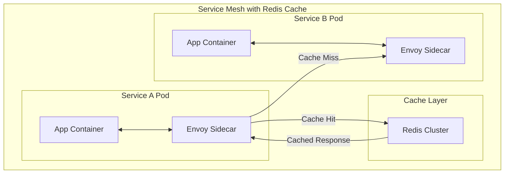

# How to Use Redis as a Service Mesh Cache

Author: [nawazdhandala](https://www.github.com/nawazdhandala)

Tags: Redis, Service Mesh, Caching, Microservices, Istio, Envoy, Sidecar

Description: Learn how to integrate Redis caching into service mesh architectures. This guide covers sidecar patterns, cache-aside implementations, distributed caching strategies, and integration with Istio and Envoy proxies.

---

> Service meshes handle traffic management, security, and observability for microservices. Adding Redis as a caching layer within the mesh reduces inter-service latency, decreases load on backend services, and improves resilience when downstream services are unavailable.

Modern microservices architectures often suffer from the "chatty" problem - services make many small requests to each other, amplifying latency. A well-designed caching strategy with Redis can eliminate redundant calls while respecting the service mesh's traffic policies and observability requirements.

---

## Service Mesh Caching Architecture

### Where Cache Fits in the Mesh



### Caching Patterns

1. **Cache-Aside (Lazy Loading)**: Application checks cache first, fetches from service on miss
2. **Cache-Through**: Proxy handles caching transparently
3. **Sidecar Cache**: Local cache per pod with Redis for shared state

---

## Cache-Aside Pattern Implementation

### Basic Cache-Aside Client

```python
import redis
import httpx
import json
import hashlib
from typing import Optional, Any
from datetime import datetime

class ServiceMeshCacheClient:
    """
    Cache-aside client for microservices in a service mesh.

    Checks Redis cache before making service calls.
    Respects service mesh timeouts and retry policies.
    """

    def __init__(
        self,
        redis_client: redis.Redis,
        default_ttl: int = 300,
        cache_prefix: str = "svc_cache"
    ):
        self.redis = redis_client
        self.default_ttl = default_ttl
        self.cache_prefix = cache_prefix
        self.http_client = httpx.Client(timeout=30.0)

    def _cache_key(self, service: str, endpoint: str, params: dict) -> str:
        """
        Generate consistent cache key from request details.
        """
        # Create deterministic hash from request parameters
        param_str = json.dumps(params, sort_keys=True)
        param_hash = hashlib.sha256(param_str.encode()).hexdigest()[:16]

        return f"{self.cache_prefix}:{service}:{endpoint}:{param_hash}"

    def get_cached(
        self,
        service_url: str,
        endpoint: str,
        params: Optional[dict] = None,
        ttl: Optional[int] = None,
        bypass_cache: bool = False
    ) -> dict:
        """
        Get data with cache-aside pattern.

        service_url: Base URL of the target service
        endpoint: API endpoint path
        params: Query parameters
        ttl: Cache TTL in seconds (uses default if not specified)
        bypass_cache: Force fresh fetch, useful for cache refresh
        """
        params = params or {}
        ttl = ttl or self.default_ttl
        cache_key = self._cache_key(service_url, endpoint, params)

        # Try cache first (unless bypassing)
        if not bypass_cache:
            cached = self.redis.get(cache_key)
            if cached:
                data = json.loads(cached)
                data['_cache_hit'] = True
                return data

        # Cache miss - fetch from service
        full_url = f"{service_url}{endpoint}"

        try:
            response = self.http_client.get(full_url, params=params)
            response.raise_for_status()
            data = response.json()

            # Store in cache
            cache_entry = {
                'data': data,
                'cached_at': datetime.utcnow().isoformat(),
                'source_service': service_url
            }
            self.redis.setex(cache_key, ttl, json.dumps(cache_entry))

            data['_cache_hit'] = False
            return data

        except httpx.HTTPError as e:
            # On service error, try stale cache as fallback
            stale_key = f"{cache_key}:stale"
            stale = self.redis.get(stale_key)

            if stale:
                data = json.loads(stale)
                data['_cache_stale'] = True
                return data

            raise

    def invalidate(self, service: str, endpoint: str, params: dict = None):
        """Invalidate a specific cache entry"""
        params = params or {}
        cache_key = self._cache_key(service, endpoint, params)
        self.redis.delete(cache_key)

    def invalidate_service(self, service: str):
        """Invalidate all cache entries for a service"""
        pattern = f"{self.cache_prefix}:{service}:*"
        cursor = 0

        while True:
            cursor, keys = self.redis.scan(cursor, match=pattern, count=100)
            if keys:
                self.redis.delete(*keys)
            if cursor == 0:
                break

# Usage
r = redis.Redis(host='localhost', port=6379, decode_responses=True)
cache_client = ServiceMeshCacheClient(r, default_ttl=300)

# Make cached service call
result = cache_client.get_cached(
    service_url="http://user-service.default.svc.cluster.local:8080",
    endpoint="/api/users/123",
    params={'include': 'profile'}
)

print(f"Cache hit: {result.get('_cache_hit', False)}")
print(f"Data: {result.get('data')}")
```

### Circuit Breaker Integration

```python
import time
from enum import Enum
from threading import Lock

class CircuitState(Enum):
    CLOSED = "closed"
    OPEN = "open"
    HALF_OPEN = "half_open"

class CachedCircuitBreaker:
    """
    Circuit breaker that falls back to cached data when service is unavailable.
    """

    def __init__(
        self,
        redis_client: redis.Redis,
        service_name: str,
        failure_threshold: int = 5,
        recovery_timeout: int = 30,
        cache_ttl: int = 300
    ):
        self.redis = redis_client
        self.service_name = service_name
        self.failure_threshold = failure_threshold
        self.recovery_timeout = recovery_timeout
        self.cache_ttl = cache_ttl

        self.state = CircuitState.CLOSED
        self.failure_count = 0
        self.last_failure_time = 0
        self.lock = Lock()

    def _circuit_key(self):
        return f"circuit:{self.service_name}"

    def _cache_key(self, request_id: str):
        return f"circuit_cache:{self.service_name}:{request_id}"

    def call(self, request_id: str, service_func, *args, **kwargs):
        """
        Execute service call with circuit breaker protection.

        Returns cached data if circuit is open and cache is available.
        """
        # Check circuit state
        if self.state == CircuitState.OPEN:
            if time.time() - self.last_failure_time > self.recovery_timeout:
                with self.lock:
                    self.state = CircuitState.HALF_OPEN
            else:
                # Circuit open - try cache
                return self._get_cached_fallback(request_id)

        try:
            # Attempt service call
            result = service_func(*args, **kwargs)

            # Success - update cache and reset failures
            self._cache_result(request_id, result)

            with self.lock:
                if self.state == CircuitState.HALF_OPEN:
                    self.state = CircuitState.CLOSED
                self.failure_count = 0

            return result

        except Exception as e:
            # Failure - update circuit state
            with self.lock:
                self.failure_count += 1
                self.last_failure_time = time.time()

                if self.failure_count >= self.failure_threshold:
                    self.state = CircuitState.OPEN
                    print(f"Circuit opened for {self.service_name}")

            # Try cached fallback
            cached = self._get_cached_fallback(request_id)
            if cached:
                return cached

            raise

    def _cache_result(self, request_id: str, result):
        """Cache successful response"""
        cache_key = self._cache_key(request_id)
        self.redis.setex(
            cache_key,
            self.cache_ttl,
            json.dumps({
                'result': result,
                'cached_at': time.time()
            })
        )

    def _get_cached_fallback(self, request_id: str):
        """Get cached data as fallback"""
        cache_key = self._cache_key(request_id)
        cached = self.redis.get(cache_key)

        if cached:
            data = json.loads(cached)
            data['_from_cache'] = True
            data['_circuit_state'] = self.state.value
            return data

        return None

# Usage
r = redis.Redis(host='localhost', port=6379, decode_responses=True)

def fetch_user(user_id):
    """Simulated service call"""
    import httpx
    response = httpx.get(f"http://user-service/api/users/{user_id}")
    response.raise_for_status()
    return response.json()

breaker = CachedCircuitBreaker(r, "user-service")

# Make call through circuit breaker
try:
    result = breaker.call(
        request_id="user:123",
        service_func=fetch_user,
        user_id=123
    )
    print(f"Result: {result}")
except Exception as e:
    print(f"Service unavailable: {e}")
```

---

## Distributed Cache Coordination

### Cache Invalidation Events

```python
import redis
import json
import threading
from typing import Callable

class DistributedCacheCoordinator:
    """
    Coordinate cache invalidation across service mesh instances.

    Uses Redis Pub/Sub to broadcast invalidation events to all pods.
    """

    CHANNEL = "cache:invalidation"

    def __init__(self, redis_client: redis.Redis, instance_id: str):
        self.redis = redis_client
        self.instance_id = instance_id
        self.cache_prefix = "mesh_cache"
        self.invalidation_handlers = []
        self._running = False

    def add_invalidation_handler(self, handler: Callable):
        """Register handler for invalidation events"""
        self.invalidation_handlers.append(handler)

    def start_listener(self):
        """Start listening for invalidation events"""
        self._running = True
        thread = threading.Thread(target=self._listen_loop, daemon=True)
        thread.start()
        print(f"Cache coordinator started for {self.instance_id}")

    def stop_listener(self):
        """Stop listening"""
        self._running = False

    def _listen_loop(self):
        """Background listener for invalidation events"""
        pubsub = self.redis.pubsub()
        pubsub.subscribe(self.CHANNEL)

        for message in pubsub.listen():
            if not self._running:
                break

            if message['type'] == 'message':
                try:
                    event = json.loads(message['data'])

                    # Skip our own messages
                    if event.get('source') == self.instance_id:
                        continue

                    self._handle_invalidation(event)

                except json.JSONDecodeError:
                    pass

    def _handle_invalidation(self, event):
        """Process invalidation event"""
        print(f"Received invalidation: {event}")

        # Delete local cache entries
        if event.get('type') == 'key':
            self.redis.delete(event['key'])

        elif event.get('type') == 'pattern':
            cursor = 0
            while True:
                cursor, keys = self.redis.scan(
                    cursor,
                    match=event['pattern'],
                    count=100
                )
                if keys:
                    self.redis.delete(*keys)
                if cursor == 0:
                    break

        # Notify handlers
        for handler in self.invalidation_handlers:
            try:
                handler(event)
            except Exception as e:
                print(f"Handler error: {e}")

    def invalidate_key(self, key: str):
        """Broadcast key invalidation to all instances"""
        event = {
            'type': 'key',
            'key': key,
            'source': self.instance_id,
            'timestamp': time.time()
        }

        # Delete locally
        self.redis.delete(key)

        # Broadcast to other instances
        self.redis.publish(self.CHANNEL, json.dumps(event))

    def invalidate_pattern(self, pattern: str):
        """Broadcast pattern invalidation to all instances"""
        event = {
            'type': 'pattern',
            'pattern': pattern,
            'source': self.instance_id,
            'timestamp': time.time()
        }

        # Delete locally
        cursor = 0
        while True:
            cursor, keys = self.redis.scan(cursor, match=pattern, count=100)
            if keys:
                self.redis.delete(*keys)
            if cursor == 0:
                break

        # Broadcast to other instances
        self.redis.publish(self.CHANNEL, json.dumps(event))

    def set_cached(self, key: str, value: Any, ttl: int = 300):
        """Store value in cache"""
        full_key = f"{self.cache_prefix}:{key}"
        self.redis.setex(full_key, ttl, json.dumps(value))

    def get_cached(self, key: str) -> Optional[Any]:
        """Retrieve value from cache"""
        full_key = f"{self.cache_prefix}:{key}"
        data = self.redis.get(full_key)
        if data:
            return json.loads(data)
        return None

# Usage
import os
import uuid

r = redis.Redis(host='localhost', port=6379, decode_responses=True)
instance_id = os.environ.get('POD_NAME', f'instance-{uuid.uuid4().hex[:8]}')

coordinator = DistributedCacheCoordinator(r, instance_id)
coordinator.start_listener()

# Cache some data
coordinator.set_cached('user:123', {'name': 'Alice', 'role': 'admin'})

# Invalidate across all instances
coordinator.invalidate_key('mesh_cache:user:123')
coordinator.invalidate_pattern('mesh_cache:user:*')
```

---

## Envoy Integration

### External Authorization with Cache

```python
from flask import Flask, request, jsonify
import redis

app = Flask(__name__)
r = redis.Redis(host='localhost', port=6379, decode_responses=True)

@app.route('/auth/check', methods=['POST'])
def check_auth():
    """
    Envoy ext_authz endpoint with Redis caching.

    Envoy calls this for every request. Cache authorization
    decisions to reduce latency.
    """
    # Extract headers from Envoy request
    headers = request.headers
    auth_token = headers.get('Authorization', '')
    path = headers.get('X-Original-Uri', '/')
    method = headers.get('X-Original-Method', 'GET')

    if not auth_token:
        return jsonify({'status': 'denied', 'reason': 'no_token'}), 403

    # Check cache first
    cache_key = f"auth:{hash(auth_token)}:{method}:{path}"
    cached = r.get(cache_key)

    if cached:
        decision = json.loads(cached)
        # Add header to indicate cache hit
        response = jsonify(decision)
        response.headers['X-Auth-Cache'] = 'hit'
        return response, 200 if decision['status'] == 'allowed' else 403

    # Validate token (simplified example)
    try:
        user_info = validate_token(auth_token)
        allowed = check_permission(user_info, method, path)

        decision = {
            'status': 'allowed' if allowed else 'denied',
            'user_id': user_info.get('user_id'),
            'cached_at': time.time()
        }

        # Cache the decision (short TTL for security)
        r.setex(cache_key, 60, json.dumps(decision))

        response = jsonify(decision)
        response.headers['X-Auth-Cache'] = 'miss'
        return response, 200 if allowed else 403

    except Exception as e:
        return jsonify({'status': 'denied', 'reason': str(e)}), 403

def validate_token(token):
    """Validate JWT or session token"""
    # Implementation depends on your auth system
    return {'user_id': 123, 'roles': ['user']}

def check_permission(user_info, method, path):
    """Check if user can access resource"""
    # Implementation depends on your authorization model
    return True

if __name__ == '__main__':
    app.run(host='0.0.0.0', port=9001)
```

### Envoy Configuration

```yaml
# envoy.yaml
static_resources:
  listeners:
    - name: listener_0
      address:
        socket_address:
          address: 0.0.0.0
          port_value: 8080
      filter_chains:
        - filters:
            - name: envoy.filters.network.http_connection_manager
              typed_config:
                "@type": type.googleapis.com/envoy.extensions.filters.network.http_connection_manager.v3.HttpConnectionManager
                stat_prefix: ingress_http
                route_config:
                  name: local_route
                  virtual_hosts:
                    - name: local_service
                      domains: ["*"]
                      routes:
                        - match:
                            prefix: "/"
                          route:
                            cluster: service_cluster
                http_filters:
                  - name: envoy.filters.http.ext_authz
                    typed_config:
                      "@type": type.googleapis.com/envoy.extensions.filters.http.ext_authz.v3.ExtAuthz
                      http_service:
                        server_uri:
                          uri: http://auth-cache:9001
                          cluster: auth_cluster
                          timeout: 0.25s
                  - name: envoy.filters.http.router
                    typed_config:
                      "@type": type.googleapis.com/envoy.extensions.filters.http.router.v3.Router

  clusters:
    - name: auth_cluster
      connect_timeout: 0.25s
      type: STRICT_DNS
      lb_policy: ROUND_ROBIN
      load_assignment:
        cluster_name: auth_cluster
        endpoints:
          - lb_endpoints:
              - endpoint:
                  address:
                    socket_address:
                      address: auth-cache
                      port_value: 9001
```

---

## Monitoring Cache Performance

```python
class ServiceMeshCacheMetrics:
    """
    Collect and expose cache metrics for service mesh observability.
    """

    def __init__(self, redis_client: redis.Redis):
        self.redis = redis_client
        self.metrics_key = "cache:metrics"

    def record_hit(self, service: str, endpoint: str):
        """Record cache hit"""
        key = f"{self.metrics_key}:hits:{service}:{endpoint}"
        self.redis.incr(key)
        self.redis.expire(key, 3600)  # 1 hour window

    def record_miss(self, service: str, endpoint: str):
        """Record cache miss"""
        key = f"{self.metrics_key}:misses:{service}:{endpoint}"
        self.redis.incr(key)
        self.redis.expire(key, 3600)

    def record_latency(self, service: str, latency_ms: float, cached: bool):
        """Record response latency"""
        label = "cached" if cached else "uncached"
        key = f"{self.metrics_key}:latency:{service}:{label}"

        # Store in sorted set for percentile calculations
        self.redis.zadd(key, {f"{time.time()}": latency_ms})
        self.redis.expire(key, 3600)

        # Trim old entries
        cutoff = time.time() - 3600
        self.redis.zremrangebyscore(key, '-inf', cutoff)

    def get_stats(self, service: str = None):
        """Get cache statistics"""
        pattern = f"{self.metrics_key}:*"
        if service:
            pattern = f"{self.metrics_key}:*:{service}:*"

        stats = {
            'hits': {},
            'misses': {},
            'hit_ratio': {}
        }

        cursor = 0
        while True:
            cursor, keys = self.redis.scan(cursor, match=pattern, count=100)

            for key in keys:
                parts = key.split(':')
                metric_type = parts[2]
                svc = parts[3] if len(parts) > 3 else 'unknown'

                if metric_type == 'hits':
                    stats['hits'][svc] = stats['hits'].get(svc, 0) + int(self.redis.get(key) or 0)
                elif metric_type == 'misses':
                    stats['misses'][svc] = stats['misses'].get(svc, 0) + int(self.redis.get(key) or 0)

            if cursor == 0:
                break

        # Calculate hit ratios
        for svc in set(list(stats['hits'].keys()) + list(stats['misses'].keys())):
            hits = stats['hits'].get(svc, 0)
            misses = stats['misses'].get(svc, 0)
            total = hits + misses
            stats['hit_ratio'][svc] = hits / total if total > 0 else 0

        return stats

# Usage
r = redis.Redis(host='localhost', port=6379, decode_responses=True)
metrics = ServiceMeshCacheMetrics(r)

# Record metrics (typically called from cache client)
metrics.record_hit('user-service', '/api/users/123')
metrics.record_miss('order-service', '/api/orders')
metrics.record_latency('user-service', 2.5, cached=True)
metrics.record_latency('user-service', 45.0, cached=False)

# Get statistics
stats = metrics.get_stats()
print("Cache Statistics:")
for service, ratio in stats['hit_ratio'].items():
    print(f"  {service}: {ratio*100:.1f}% hit ratio")
```

---

## Conclusion

Redis caching within a service mesh provides significant performance and resilience benefits. Key patterns covered:

- **Cache-aside**: Application-controlled caching with service fallback
- **Circuit breaker**: Cache as fallback when services fail
- **Distributed coordination**: Invalidation across mesh instances
- **Envoy integration**: Auth caching with external authorization

When implementing caching in your service mesh, consider cache consistency requirements, TTL strategies, and observability needs to maintain system reliability.

---

*Monitor your service mesh cache performance with [OneUptime](https://oneuptime.com). Track hit ratios, latency improvements, and cache coordination across your Kubernetes clusters.*

**Related Reading:**
- [How to Tune Redis for High Write Throughput](https://oneuptime.com/blog/post/2026-01-25-redis-high-write-throughput/view)
- [How to Implement Sliding TTL in Redis](https://oneuptime.com/blog/post/2026-01-26-redis-sliding-ttl/view)
