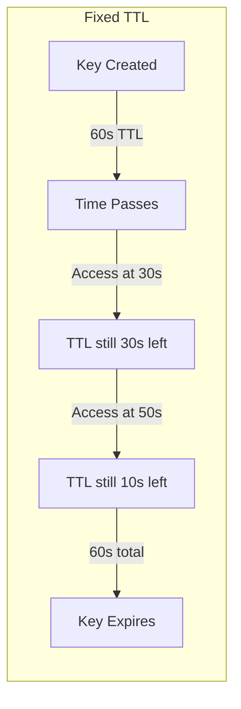
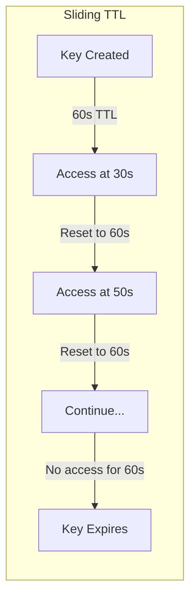

# How to Implement Sliding TTL in Redis

Author: [nawazdhandala](https://www.github.com/nawazdhandala)

Tags: Redis, TTL, Expiration, Session Management, Caching, Sliding Window

Description: Learn how to implement sliding TTL patterns in Redis for session management and caching. This guide covers automatic expiration extension on access, Lua scripts for atomic operations, and practical patterns for keep-alive scenarios.

---

> Standard Redis TTL is fixed at key creation time. Sliding TTL extends the expiration each time a key is accessed, keeping frequently used data alive while allowing inactive data to expire naturally. This pattern is essential for session management and intelligent caching.

Session tokens, user activity tracking, and cache warming all benefit from sliding expiration. Instead of a hard cutoff, the expiration window resets on each access, matching real-world usage patterns where active users should stay logged in and frequently accessed cache entries should persist.

---

## Understanding Sliding vs Fixed TTL

### Fixed TTL Behavior



### Sliding TTL Behavior



---

## Basic Sliding TTL Pattern

### Manual TTL Extension

The simplest approach extends TTL on every read:

```python
import redis
import json
from datetime import datetime

class SlidingTTLCache:
    """
    Cache with sliding TTL - expiration resets on each access.
    """

    def __init__(self, redis_client, default_ttl=3600):
        self.redis = redis_client
        self.default_ttl = default_ttl  # seconds

    def set(self, key, value, ttl=None):
        """
        Store a value with TTL.

        ttl: seconds until expiration (uses default if not specified)
        """
        ttl = ttl or self.default_ttl
        serialized = json.dumps(value)

        # SETEX sets value and expiration atomically
        self.redis.setex(key, ttl, serialized)

    def get(self, key, extend_ttl=True):
        """
        Retrieve a value and optionally extend its TTL.

        extend_ttl: if True, reset expiration on access
        """
        value = self.redis.get(key)

        if value is None:
            return None

        if extend_ttl:
            # Get current TTL to preserve custom TTLs
            current_ttl = self.redis.ttl(key)
            if current_ttl > 0:
                # Only extend if key still exists and has TTL
                self.redis.expire(key, self.default_ttl)

        return json.loads(value)

    def get_without_extend(self, key):
        """Get value without extending TTL"""
        return self.get(key, extend_ttl=False)

    def touch(self, key):
        """
        Extend TTL without retrieving value.
        Useful for keep-alive operations.
        """
        current_ttl = self.redis.ttl(key)
        if current_ttl > 0:
            self.redis.expire(key, self.default_ttl)
            return True
        return False

    def remaining_ttl(self, key):
        """Get remaining TTL in seconds"""
        return self.redis.ttl(key)

# Usage
r = redis.Redis(host='localhost', port=6379, decode_responses=True)
cache = SlidingTTLCache(r, default_ttl=300)  # 5 minute sliding window

# Store session data
cache.set('session:abc123', {'user_id': 42, 'role': 'admin'})

# Each access resets the 5-minute timer
session = cache.get('session:abc123')
print(f"Session data: {session}")
print(f"TTL remaining: {cache.remaining_ttl('session:abc123')}s")
```

---

## Atomic Sliding TTL with Lua

The basic pattern has a race condition between GET and EXPIRE. Use Lua for atomic operations:

```python
class AtomicSlidingTTL:
    """
    Sliding TTL implementation using Lua scripts for atomicity.
    Prevents race conditions in high-concurrency scenarios.
    """

    # Lua script: GET value and extend TTL atomically
    GET_AND_EXTEND_SCRIPT = """
    local key = KEYS[1]
    local new_ttl = tonumber(ARGV[1])

    -- Get the value
    local value = redis.call('GET', key)

    if value then
        -- Key exists, extend TTL
        redis.call('EXPIRE', key, new_ttl)
    end

    return value
    """

    # Lua script: GET value only if TTL extension succeeds
    GET_IF_ACTIVE_SCRIPT = """
    local key = KEYS[1]
    local new_ttl = tonumber(ARGV[1])
    local min_remaining = tonumber(ARGV[2])

    -- Check current TTL
    local current_ttl = redis.call('TTL', key)

    -- Only proceed if key exists and has reasonable TTL
    if current_ttl < min_remaining then
        return nil
    end

    -- Get value and extend TTL
    local value = redis.call('GET', key)
    if value then
        redis.call('EXPIRE', key, new_ttl)
    end

    return value
    """

    # Lua script: SET with conditional TTL behavior
    SET_WITH_SLIDING_SCRIPT = """
    local key = KEYS[1]
    local value = ARGV[1]
    local ttl = tonumber(ARGV[2])
    local only_if_exists = ARGV[3] == 'true'

    if only_if_exists then
        -- Only set if key already exists (update scenario)
        local exists = redis.call('EXISTS', key)
        if exists == 0 then
            return 0
        end
    end

    redis.call('SETEX', key, ttl, value)
    return 1
    """

    def __init__(self, redis_client, default_ttl=3600):
        self.redis = redis_client
        self.default_ttl = default_ttl

        # Register Lua scripts
        self.get_extend_sha = self.redis.script_load(self.GET_AND_EXTEND_SCRIPT)
        self.get_active_sha = self.redis.script_load(self.GET_IF_ACTIVE_SCRIPT)
        self.set_sliding_sha = self.redis.script_load(self.SET_WITH_SLIDING_SCRIPT)

    def get(self, key, ttl=None):
        """
        Atomically get value and extend TTL.
        """
        ttl = ttl or self.default_ttl

        value = self.redis.evalsha(
            self.get_extend_sha,
            1,      # Number of keys
            key,    # KEYS[1]
            ttl     # ARGV[1]
        )

        if value:
            return json.loads(value)
        return None

    def get_if_active(self, key, min_remaining=10, ttl=None):
        """
        Get value only if the key has been recently accessed.

        min_remaining: minimum TTL required to consider key "active"

        This prevents extending nearly-expired keys, useful for
        security scenarios where you want sessions to truly expire.
        """
        ttl = ttl or self.default_ttl

        value = self.redis.evalsha(
            self.get_active_sha,
            1,
            key,
            ttl,
            min_remaining
        )

        if value:
            return json.loads(value)
        return None

    def set(self, key, value, ttl=None, update_only=False):
        """
        Set value with TTL.

        update_only: if True, only update existing keys
        """
        ttl = ttl or self.default_ttl
        serialized = json.dumps(value)

        result = self.redis.evalsha(
            self.set_sliding_sha,
            1,
            key,
            serialized,
            ttl,
            'true' if update_only else 'false'
        )

        return result == 1

# Usage
r = redis.Redis(host='localhost', port=6379, decode_responses=True)
cache = AtomicSlidingTTL(r, default_ttl=1800)  # 30 minute window

# Store data
cache.set('user:session:xyz', {'user_id': 123, 'permissions': ['read', 'write']})

# Atomic get with TTL extension
data = cache.get('user:session:xyz')
```

---

## Session Management Pattern

### Complete Session Handler

```python
import redis
import json
import secrets
import hashlib
from datetime import datetime, timedelta

class SessionManager:
    """
    Session management with sliding TTL for user authentication.

    Features:
    - Sliding expiration on activity
    - Absolute maximum session lifetime
    - Session metadata tracking
    """

    SESSION_SCRIPT = """
    local session_key = KEYS[1]
    local metadata_key = KEYS[2]
    local sliding_ttl = tonumber(ARGV[1])
    local action = ARGV[2]

    if action == 'get' then
        -- Get session and extend TTL
        local session = redis.call('GET', session_key)
        if session then
            redis.call('EXPIRE', session_key, sliding_ttl)
            -- Update last access time in metadata
            redis.call('HSET', metadata_key, 'last_access', ARGV[3])
            redis.call('EXPIRE', metadata_key, sliding_ttl)
        end
        return session

    elseif action == 'create' then
        local session_data = ARGV[3]
        local absolute_ttl = tonumber(ARGV[4])

        -- Set session with sliding TTL
        redis.call('SETEX', session_key, sliding_ttl, session_data)

        -- Store metadata with absolute expiration
        redis.call('HMSET', metadata_key,
            'created_at', ARGV[5],
            'last_access', ARGV[5],
            'absolute_expiry', ARGV[6]
        )
        redis.call('EXPIRE', metadata_key, absolute_ttl)

        return 'OK'

    elseif action == 'check_absolute' then
        local absolute_expiry = redis.call('HGET', metadata_key, 'absolute_expiry')
        return absolute_expiry
    end
    """

    def __init__(self, redis_client, sliding_ttl=1800, absolute_ttl=86400):
        """
        sliding_ttl: seconds of inactivity before session expires (default 30 min)
        absolute_ttl: maximum session lifetime regardless of activity (default 24 hours)
        """
        self.redis = redis_client
        self.sliding_ttl = sliding_ttl
        self.absolute_ttl = absolute_ttl
        self.script_sha = self.redis.script_load(self.SESSION_SCRIPT)

    def _session_key(self, session_id):
        return f"session:{session_id}"

    def _metadata_key(self, session_id):
        return f"session:{session_id}:meta"

    def create_session(self, user_data):
        """
        Create a new session for a user.

        Returns: session_id string
        """
        # Generate secure session ID
        session_id = secrets.token_urlsafe(32)

        now = datetime.utcnow()
        absolute_expiry = now + timedelta(seconds=self.absolute_ttl)

        session_data = {
            'session_id': session_id,
            'user': user_data,
            'created_at': now.isoformat()
        }

        self.redis.evalsha(
            self.script_sha,
            2,
            self._session_key(session_id),
            self._metadata_key(session_id),
            self.sliding_ttl,
            'create',
            json.dumps(session_data),
            self.absolute_ttl,
            now.isoformat(),
            absolute_expiry.isoformat()
        )

        return session_id

    def get_session(self, session_id):
        """
        Retrieve session data and extend TTL.

        Returns None if session expired or doesn't exist.
        Also checks absolute expiration.
        """
        now = datetime.utcnow()

        # First check absolute expiration
        absolute_expiry = self.redis.evalsha(
            self.script_sha,
            2,
            self._session_key(session_id),
            self._metadata_key(session_id),
            self.sliding_ttl,
            'check_absolute'
        )

        if absolute_expiry:
            expiry_time = datetime.fromisoformat(absolute_expiry)
            if now > expiry_time:
                # Absolute TTL exceeded, destroy session
                self.destroy_session(session_id)
                return None

        # Get session with sliding TTL extension
        session_data = self.redis.evalsha(
            self.script_sha,
            2,
            self._session_key(session_id),
            self._metadata_key(session_id),
            self.sliding_ttl,
            'get',
            now.isoformat()
        )

        if session_data:
            return json.loads(session_data)
        return None

    def destroy_session(self, session_id):
        """Explicitly destroy a session (logout)"""
        pipe = self.redis.pipeline()
        pipe.delete(self._session_key(session_id))
        pipe.delete(self._metadata_key(session_id))
        pipe.execute()

    def get_session_info(self, session_id):
        """Get session metadata without extending TTL"""
        meta = self.redis.hgetall(self._metadata_key(session_id))
        ttl = self.redis.ttl(self._session_key(session_id))

        if not meta:
            return None

        return {
            'created_at': meta.get('created_at'),
            'last_access': meta.get('last_access'),
            'absolute_expiry': meta.get('absolute_expiry'),
            'remaining_ttl': ttl
        }

# Usage
r = redis.Redis(host='localhost', port=6379, decode_responses=True)
sessions = SessionManager(r, sliding_ttl=1800, absolute_ttl=86400)

# User logs in
session_id = sessions.create_session({
    'user_id': 42,
    'username': 'alice',
    'roles': ['user', 'editor']
})
print(f"Created session: {session_id}")

# Check session (extends TTL)
session = sessions.get_session(session_id)
print(f"Session data: {session}")

# Get session info
info = sessions.get_session_info(session_id)
print(f"Session info: {info}")

# User logs out
sessions.destroy_session(session_id)
```

---

## Rate Limiting with Sliding Window

Implement sliding window rate limiting:

```python
class SlidingWindowRateLimiter:
    """
    Rate limiter using sliding window with automatic cleanup.

    More accurate than fixed windows because it considers
    the actual time distribution of requests.
    """

    RATE_LIMIT_SCRIPT = """
    local key = KEYS[1]
    local now = tonumber(ARGV[1])
    local window = tonumber(ARGV[2])
    local max_requests = tonumber(ARGV[3])

    -- Remove old entries outside the window
    local window_start = now - window
    redis.call('ZREMRANGEBYSCORE', key, '-inf', window_start)

    -- Count current requests in window
    local current_count = redis.call('ZCARD', key)

    if current_count < max_requests then
        -- Add this request
        redis.call('ZADD', key, now, now .. ':' .. math.random())
        -- Set TTL to window size for automatic cleanup
        redis.call('EXPIRE', key, window)
        return {1, max_requests - current_count - 1}  -- allowed, remaining
    else
        -- Get time until oldest request expires
        local oldest = redis.call('ZRANGE', key, 0, 0, 'WITHSCORES')
        local retry_after = 0
        if oldest and #oldest > 0 then
            retry_after = window - (now - oldest[2])
        end
        return {0, retry_after}  -- denied, retry_after
    end
    """

    def __init__(self, redis_client, max_requests=100, window_seconds=60):
        self.redis = redis_client
        self.max_requests = max_requests
        self.window_seconds = window_seconds
        self.script_sha = self.redis.script_load(self.RATE_LIMIT_SCRIPT)

    def check(self, identifier):
        """
        Check if request is allowed for identifier.

        Returns: {
            'allowed': bool,
            'remaining': int (if allowed),
            'retry_after': float (if denied, seconds to wait)
        }
        """
        import time
        key = f"ratelimit:{identifier}"
        now = time.time()

        result = self.redis.evalsha(
            self.script_sha,
            1,
            key,
            now,
            self.window_seconds,
            self.max_requests
        )

        if result[0] == 1:
            return {
                'allowed': True,
                'remaining': result[1]
            }
        else:
            return {
                'allowed': False,
                'retry_after': result[1]
            }

    def get_usage(self, identifier):
        """Get current usage stats for identifier"""
        import time
        key = f"ratelimit:{identifier}"
        now = time.time()
        window_start = now - self.window_seconds

        # Remove expired and count remaining
        self.redis.zremrangebyscore(key, '-inf', window_start)
        current = self.redis.zcard(key)

        return {
            'used': current,
            'remaining': max(0, self.max_requests - current),
            'limit': self.max_requests,
            'window_seconds': self.window_seconds
        }

# Usage
r = redis.Redis(host='localhost', port=6379, decode_responses=True)
limiter = SlidingWindowRateLimiter(r, max_requests=10, window_seconds=60)

# Test rate limiting
user_id = 'user:123'

for i in range(15):
    result = limiter.check(user_id)
    if result['allowed']:
        print(f"Request {i+1}: Allowed ({result['remaining']} remaining)")
    else:
        print(f"Request {i+1}: Denied (retry in {result['retry_after']:.1f}s)")
```

---

## Monitoring TTL Health

```python
class TTLMonitor:
    """
    Monitor TTL patterns across your Redis keys.
    """

    def __init__(self, redis_client):
        self.redis = redis_client

    def analyze_ttls(self, pattern='*', sample_size=1000):
        """
        Analyze TTL distribution for keys matching pattern.
        """
        cursor = 0
        ttl_buckets = {
            'no_ttl': 0,
            'under_1min': 0,
            '1-10min': 0,
            '10-60min': 0,
            '1-24hr': 0,
            'over_24hr': 0,
            'expired': 0
        }
        total_scanned = 0

        while total_scanned < sample_size:
            cursor, keys = self.redis.scan(cursor, match=pattern, count=100)

            for key in keys:
                ttl = self.redis.ttl(key)

                if ttl == -1:
                    ttl_buckets['no_ttl'] += 1
                elif ttl == -2:
                    ttl_buckets['expired'] += 1
                elif ttl < 60:
                    ttl_buckets['under_1min'] += 1
                elif ttl < 600:
                    ttl_buckets['1-10min'] += 1
                elif ttl < 3600:
                    ttl_buckets['10-60min'] += 1
                elif ttl < 86400:
                    ttl_buckets['1-24hr'] += 1
                else:
                    ttl_buckets['over_24hr'] += 1

                total_scanned += 1
                if total_scanned >= sample_size:
                    break

            if cursor == 0:
                break

        return {
            'total_scanned': total_scanned,
            'distribution': ttl_buckets
        }

# Usage
r = redis.Redis(host='localhost', port=6379, decode_responses=True)
monitor = TTLMonitor(r)

analysis = monitor.analyze_ttls('session:*', sample_size=500)
print("TTL Analysis for sessions:")
print(f"  Total scanned: {analysis['total_scanned']}")
for bucket, count in analysis['distribution'].items():
    if count > 0:
        print(f"  {bucket}: {count}")
```

---

## Conclusion

Sliding TTL patterns in Redis enable sophisticated session and caching behavior that matches real-world usage patterns. Key takeaways:

- Basic sliding TTL uses GET + EXPIRE, but has race conditions
- Use Lua scripts for atomic sliding TTL operations
- Combine sliding TTL with absolute maximums for security
- Sliding windows work well for rate limiting
- Monitor TTL distribution to understand cache behavior

Sliding expiration keeps active data warm while allowing inactive entries to naturally expire, optimizing both memory usage and cache hit rates.

---

*Monitor your Redis key expiration patterns with [OneUptime](https://oneuptime.com). Track TTL distributions, cache hit rates, and memory trends to optimize your caching strategy.*

**Related Reading:**
- [How to Build Message Queues with Redis Lists](https://oneuptime.com/blog/post/2026-01-26-redis-message-queues-lists/view)
- [How to Tune Redis for High Write Throughput](https://oneuptime.com/blog/post/2026-01-25-redis-high-write-throughput/view)
