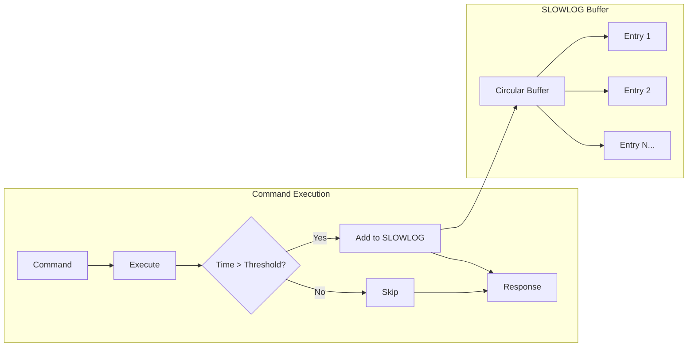

# How to Debug Latency with Redis SLOWLOG

Author: [nawazdhandala](https://www.github.com/nawazdhandala)

Tags: Redis, SLOWLOG, Performance, Latency, Debugging, Monitoring

Description: Learn how to use Redis SLOWLOG to identify and debug slow commands. This guide covers SLOWLOG configuration, analysis techniques, common latency patterns, and automated monitoring for production systems.

---

> When Redis response times increase, SLOWLOG is your first tool for investigation. It captures commands that exceed a configurable threshold, helping you identify expensive operations that degrade performance.

Redis is designed for sub-millisecond response times, but certain commands or usage patterns can cause latency spikes. SLOWLOG provides visibility into which commands are taking longer than expected, making it essential for maintaining Redis performance in production.

---

## Understanding SLOWLOG

### How SLOWLOG Works

SLOWLOG records commands that take longer than a configurable threshold:



Important notes:
- SLOWLOG measures only command execution time, not network latency
- Time is measured in microseconds
- Uses a circular buffer that overwrites oldest entries
- Does not persist across restarts

---

## Configuring SLOWLOG

### Basic Configuration

```bash
# redis.conf or via CONFIG SET

# Log commands slower than 10 milliseconds (10000 microseconds)
slowlog-log-slower-than 10000

# Keep the last 128 slow commands
slowlog-max-len 128

# Apply configuration at runtime
redis-cli CONFIG SET slowlog-log-slower-than 10000
redis-cli CONFIG SET slowlog-max-len 128
```

### Environment-Specific Settings

```bash
# Development: Aggressive logging to catch issues early
# Log anything over 1ms
CONFIG SET slowlog-log-slower-than 1000
CONFIG SET slowlog-max-len 256

# Production: Balance between visibility and noise
# Log anything over 10ms
CONFIG SET slowlog-log-slower-than 10000
CONFIG SET slowlog-max-len 128

# High-performance production: Only critical slowdowns
# Log anything over 50ms
CONFIG SET slowlog-log-slower-than 50000
CONFIG SET slowlog-max-len 64

# Disable SLOWLOG (not recommended)
CONFIG SET slowlog-log-slower-than -1
```

---

## Reading SLOWLOG

### Basic Commands

```bash
# Get the last 10 slow commands
SLOWLOG GET 10

# Get all recorded slow commands
SLOWLOG GET

# Get the current SLOWLOG length
SLOWLOG LEN

# Clear the SLOWLOG
SLOWLOG RESET
```

### Understanding SLOWLOG Entries

Each entry contains:

```bash
redis-cli SLOWLOG GET 1

# Output:
1) 1) (integer) 14                    # Unique entry ID
   2) (integer) 1706200000            # Unix timestamp
   3) (integer) 15234                 # Execution time in microseconds
   4) 1) "KEYS"                       # Command and arguments
      2) "*"
   5) "192.168.1.100:54321"          # Client IP:port
   6) "my-app"                        # Client name (if set)
```

---

## Python Tools for SLOWLOG Analysis

### Basic SLOWLOG Reader

```python
import redis
from datetime import datetime
from collections import defaultdict

class SlowlogAnalyzer:
    """
    Analyze Redis SLOWLOG entries to identify performance issues.
    """

    def __init__(self, redis_client):
        self.redis = redis_client

    def get_slowlog(self, count=100):
        """
        Retrieve and parse SLOWLOG entries.
        Returns list of structured entries.
        """
        raw_entries = self.redis.slowlog_get(count)
        entries = []

        for entry in raw_entries:
            # Parse the raw slowlog entry
            parsed = {
                'id': entry['id'],
                'timestamp': datetime.fromtimestamp(entry['start_time']),
                'duration_us': entry['duration'],
                'duration_ms': entry['duration'] / 1000,
                'command': entry['command'].decode() if isinstance(entry['command'], bytes) else entry['command'],
                'client_address': entry.get('client_address', 'unknown'),
                'client_name': entry.get('client_name', '')
            }
            entries.append(parsed)

        return entries

    def get_summary(self, count=100):
        """
        Generate summary statistics from SLOWLOG.
        """
        entries = self.get_slowlog(count)

        if not entries:
            return {'message': 'No slow commands recorded'}

        durations = [e['duration_ms'] for e in entries]
        commands = [e['command'].split()[0] for e in entries]

        # Count by command type
        command_counts = defaultdict(int)
        command_total_time = defaultdict(float)

        for entry in entries:
            cmd = entry['command'].split()[0]
            command_counts[cmd] += 1
            command_total_time[cmd] += entry['duration_ms']

        return {
            'total_entries': len(entries),
            'duration_stats': {
                'min_ms': min(durations),
                'max_ms': max(durations),
                'avg_ms': sum(durations) / len(durations),
                'total_ms': sum(durations)
            },
            'command_frequency': dict(command_counts),
            'command_total_time_ms': dict(command_total_time),
            'time_range': {
                'oldest': min(e['timestamp'] for e in entries),
                'newest': max(e['timestamp'] for e in entries)
            }
        }

    def find_patterns(self, count=100):
        """
        Identify problematic patterns in slow commands.
        """
        entries = self.get_slowlog(count)
        issues = []

        for entry in entries:
            cmd_parts = entry['command'].split()
            cmd = cmd_parts[0].upper()

            # Check for known problematic patterns
            if cmd == 'KEYS':
                issues.append({
                    'type': 'keys_command',
                    'severity': 'high',
                    'entry': entry,
                    'recommendation': 'Replace KEYS with SCAN for production use'
                })

            elif cmd in ('SMEMBERS', 'HGETALL', 'LRANGE'):
                issues.append({
                    'type': 'large_collection_read',
                    'severity': 'medium',
                    'entry': entry,
                    'recommendation': f'Consider using {cmd[0]}SCAN or pagination'
                })

            elif cmd == 'FLUSHALL' or cmd == 'FLUSHDB':
                issues.append({
                    'type': 'flush_command',
                    'severity': 'high',
                    'entry': entry,
                    'recommendation': 'Avoid FLUSH commands in production'
                })

            elif entry['duration_ms'] > 100:
                issues.append({
                    'type': 'very_slow_command',
                    'severity': 'high',
                    'entry': entry,
                    'recommendation': 'Investigate command arguments and data size'
                })

        return issues

# Usage
r = redis.Redis(host='localhost', port=6379, decode_responses=False)
analyzer = SlowlogAnalyzer(r)

# Get summary
summary = analyzer.get_summary()
print("SLOWLOG Summary:")
print(f"  Total entries: {summary.get('total_entries', 0)}")
if 'duration_stats' in summary:
    stats = summary['duration_stats']
    print(f"  Avg duration: {stats['avg_ms']:.2f}ms")
    print(f"  Max duration: {stats['max_ms']:.2f}ms")
    print(f"  Command frequency: {summary['command_frequency']}")

# Find issues
issues = analyzer.find_patterns()
if issues:
    print("\nPotential issues found:")
    for issue in issues:
        print(f"  [{issue['severity']}] {issue['type']}")
        print(f"    Command: {issue['entry']['command'][:100]}")
        print(f"    Recommendation: {issue['recommendation']}")
```

### Continuous Monitoring

```python
import redis
import time
import threading
from collections import deque

class SlowlogMonitor:
    """
    Continuously monitor SLOWLOG and alert on issues.
    """

    def __init__(self, redis_client, check_interval=10):
        self.redis = redis_client
        self.check_interval = check_interval
        self.last_id = -1
        self.running = False
        self.recent_slow_commands = deque(maxlen=1000)
        self.alert_callbacks = []

    def add_alert_callback(self, callback):
        """Add a function to call when slow commands are detected"""
        self.alert_callbacks.append(callback)

    def _check_slowlog(self):
        """Check for new SLOWLOG entries"""
        entries = self.redis.slowlog_get(50)

        new_entries = []
        for entry in entries:
            if entry['id'] > self.last_id:
                new_entries.append(entry)

        if new_entries:
            # Update last seen ID
            self.last_id = max(e['id'] for e in new_entries)

            # Store recent entries
            for entry in new_entries:
                self.recent_slow_commands.append({
                    'id': entry['id'],
                    'timestamp': time.time(),
                    'duration_ms': entry['duration'] / 1000,
                    'command': entry['command']
                })

            # Trigger alerts
            for callback in self.alert_callbacks:
                try:
                    callback(new_entries)
                except Exception as e:
                    print(f"Alert callback error: {e}")

    def _monitor_loop(self):
        """Main monitoring loop"""
        while self.running:
            try:
                self._check_slowlog()
            except redis.ConnectionError:
                print("Redis connection lost, retrying...")
            except Exception as e:
                print(f"Monitor error: {e}")

            time.sleep(self.check_interval)

    def start(self):
        """Start monitoring in background thread"""
        self.running = True
        self.thread = threading.Thread(target=self._monitor_loop, daemon=True)
        self.thread.start()
        print("SLOWLOG monitor started")

    def stop(self):
        """Stop monitoring"""
        self.running = False
        self.thread.join(timeout=5)
        print("SLOWLOG monitor stopped")

    def get_stats(self, window_seconds=60):
        """Get statistics for recent slow commands"""
        now = time.time()
        cutoff = now - window_seconds

        recent = [
            e for e in self.recent_slow_commands
            if e['timestamp'] > cutoff
        ]

        if not recent:
            return {'count': 0, 'message': 'No slow commands in window'}

        durations = [e['duration_ms'] for e in recent]

        return {
            'count': len(recent),
            'avg_ms': sum(durations) / len(durations),
            'max_ms': max(durations),
            'commands': [e['command'][:50] for e in recent[-5:]]
        }

# Alert function example
def alert_on_slow_command(entries):
    """Example alert callback"""
    for entry in entries:
        duration_ms = entry['duration'] / 1000
        if duration_ms > 100:
            print(f"ALERT: Very slow command ({duration_ms:.1f}ms): {entry['command'][:80]}")
        elif duration_ms > 50:
            print(f"WARNING: Slow command ({duration_ms:.1f}ms): {entry['command'][:80]}")

# Usage
r = redis.Redis(host='localhost', port=6379, decode_responses=False)
monitor = SlowlogMonitor(r, check_interval=5)
monitor.add_alert_callback(alert_on_slow_command)
monitor.start()

# Let it run
try:
    while True:
        time.sleep(30)
        stats = monitor.get_stats(window_seconds=60)
        print(f"Last 60s: {stats['count']} slow commands, avg={stats.get('avg_ms', 0):.1f}ms")
except KeyboardInterrupt:
    monitor.stop()
```

---

## Common Latency Patterns

### Pattern 1: KEYS Command

```python
# BAD: KEYS blocks Redis while scanning all keys
# This can take seconds on large databases
keys = r.keys('user:*')  # Don't do this in production

# GOOD: Use SCAN for iterative scanning
# Doesn't block, returns results incrementally
def scan_keys(redis_client, pattern, count=100):
    """
    Safely iterate over keys matching a pattern.
    """
    cursor = 0
    all_keys = []

    while True:
        cursor, keys = redis_client.scan(
            cursor=cursor,
            match=pattern,
            count=count
        )
        all_keys.extend(keys)

        if cursor == 0:
            break

    return all_keys

# Usage
keys = scan_keys(r, 'user:*')
```

### Pattern 2: Large Collection Operations

```python
# BAD: Getting all members of a large set at once
members = r.smembers('large_set')  # Blocks if set is huge

# GOOD: Use SSCAN for large sets
def scan_set_members(redis_client, key, count=100):
    """
    Iterate over set members without blocking.
    """
    cursor = 0
    all_members = []

    while True:
        cursor, members = redis_client.sscan(
            key,
            cursor=cursor,
            count=count
        )
        all_members.extend(members)

        if cursor == 0:
            break

    return all_members

# BAD: LRANGE on a list with millions of items
items = r.lrange('huge_list', 0, -1)

# GOOD: Paginate or process in chunks
def process_list_chunks(redis_client, key, chunk_size=1000, processor=None):
    """
    Process a large list in chunks.
    """
    start = 0
    while True:
        chunk = redis_client.lrange(key, start, start + chunk_size - 1)
        if not chunk:
            break

        if processor:
            processor(chunk)
        else:
            yield chunk

        start += chunk_size
```

### Pattern 3: Lua Scripts with Large Data

```python
# BAD: Lua script that processes too much data
bad_script = """
local keys = redis.call('KEYS', ARGV[1])
local results = {}
for i, key in ipairs(keys) do
    results[i] = redis.call('GET', key)
end
return results
"""

# GOOD: Process in smaller batches or use SCAN
good_script = """
local cursor = ARGV[1]
local pattern = ARGV[2]
local batch_size = tonumber(ARGV[3])

local result = redis.call('SCAN', cursor, 'MATCH', pattern, 'COUNT', batch_size)
local new_cursor = result[1]
local keys = result[2]

local values = {}
for i, key in ipairs(keys) do
    values[i] = {key, redis.call('GET', key)}
end

return {new_cursor, values}
"""
```

---

## Identifying Root Causes

### Analyzing SLOWLOG for Root Cause

```python
def diagnose_slowlog(redis_client, count=100):
    """
    Analyze SLOWLOG and provide diagnostic information.
    """
    entries = redis_client.slowlog_get(count)

    diagnosis = {
        'total_entries': len(entries),
        'by_command': defaultdict(list),
        'by_duration_bucket': {
            '10-50ms': [],
            '50-100ms': [],
            '100-500ms': [],
            '500ms+': []
        },
        'recommendations': []
    }

    for entry in entries:
        cmd_parts = entry['command'].decode().split() if isinstance(entry['command'], bytes) else entry['command'].split()
        cmd = cmd_parts[0].upper()
        duration_ms = entry['duration'] / 1000

        # Group by command
        diagnosis['by_command'][cmd].append(duration_ms)

        # Group by duration bucket
        if duration_ms < 50:
            diagnosis['by_duration_bucket']['10-50ms'].append(cmd)
        elif duration_ms < 100:
            diagnosis['by_duration_bucket']['50-100ms'].append(cmd)
        elif duration_ms < 500:
            diagnosis['by_duration_bucket']['100-500ms'].append(cmd)
        else:
            diagnosis['by_duration_bucket']['500ms+'].append(cmd)

    # Generate recommendations
    for cmd, durations in diagnosis['by_command'].items():
        avg_duration = sum(durations) / len(durations)
        count = len(durations)

        if cmd == 'KEYS':
            diagnosis['recommendations'].append(
                f"KEYS command found {count} times (avg {avg_duration:.1f}ms). "
                "Replace with SCAN for non-blocking key iteration."
            )

        elif cmd in ('SMEMBERS', 'HGETALL', 'LRANGE', 'ZRANGE'):
            diagnosis['recommendations'].append(
                f"{cmd} command found {count} times (avg {avg_duration:.1f}ms). "
                f"Check data sizes; consider SSCAN/HSCAN/pagination."
            )

        elif cmd == 'DEL' and avg_duration > 10:
            diagnosis['recommendations'].append(
                f"DEL command slow ({avg_duration:.1f}ms avg). "
                "Consider UNLINK for async deletion of large keys."
            )

        elif avg_duration > 100:
            diagnosis['recommendations'].append(
                f"{cmd} command averaging {avg_duration:.1f}ms over {count} calls. "
                "Investigate specific use case and data sizes."
            )

    # Summary statistics
    diagnosis['summary'] = {
        cmd: {
            'count': len(durations),
            'avg_ms': sum(durations) / len(durations),
            'max_ms': max(durations)
        }
        for cmd, durations in diagnosis['by_command'].items()
    }

    return diagnosis

# Usage
r = redis.Redis(host='localhost', port=6379, decode_responses=False)
diagnosis = diagnose_slowlog(r)

print("SLOWLOG Diagnosis")
print("=" * 50)
print(f"Total entries analyzed: {diagnosis['total_entries']}")

print("\nCommand Summary:")
for cmd, stats in diagnosis['summary'].items():
    print(f"  {cmd}: {stats['count']} calls, avg={stats['avg_ms']:.1f}ms, max={stats['max_ms']:.1f}ms")

print("\nDuration Distribution:")
for bucket, commands in diagnosis['by_duration_bucket'].items():
    if commands:
        print(f"  {bucket}: {len(commands)} commands")

print("\nRecommendations:")
for rec in diagnosis['recommendations']:
    print(f"  - {rec}")
```

---

## Best Practices

### Configuration Guidelines

1. **Set appropriate thresholds**: Start with 10ms for production, lower for development
2. **Size the buffer appropriately**: 128-256 entries is usually sufficient
3. **Monitor regularly**: Check SLOWLOG as part of routine operations
4. **Reset after investigating**: Clear SLOWLOG after fixing issues to track improvements

### Operational Tips

```bash
# Quick health check command
redis-cli SLOWLOG LEN

# Export SLOWLOG for analysis
redis-cli SLOWLOG GET 100 > slowlog_export.txt

# Monitor SLOWLOG in real-time
watch -n 5 'redis-cli SLOWLOG GET 5'
```

---

## Conclusion

Redis SLOWLOG is essential for identifying and debugging latency issues. Key practices:

- Configure appropriate thresholds for your environment
- Monitor SLOWLOG regularly, not just during incidents
- Use analysis tools to identify patterns and root causes
- Replace problematic commands (KEYS, large SMEMBERS) with safer alternatives
- Track improvements after making changes

Remember that SLOWLOG measures command execution time, not end-to-end latency. For complete latency analysis, combine SLOWLOG with client-side metrics and network monitoring.

---

*Get alerted on Redis latency spikes before your users notice. [OneUptime](https://oneuptime.com) monitors your Redis instances and can trigger alerts based on SLOWLOG patterns and other performance metrics.*

**Related Reading:**
- [How to Tune Redis for High Write Throughput](https://oneuptime.com/blog/post/2026-01-25-redis-high-write-throughput/view)
- [How to Build Message Queues with Redis Lists](https://oneuptime.com/blog/post/2026-01-26-redis-message-queues-lists/view)
