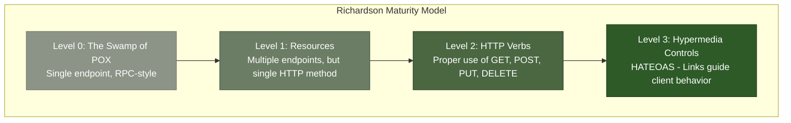
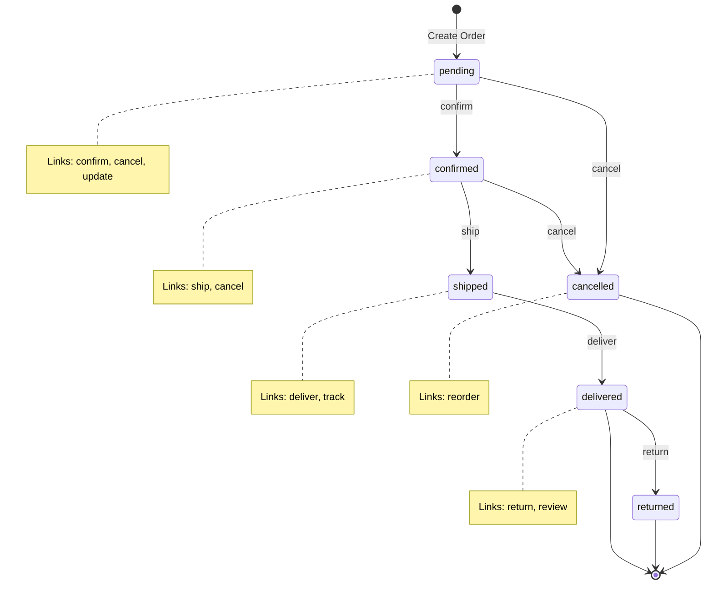
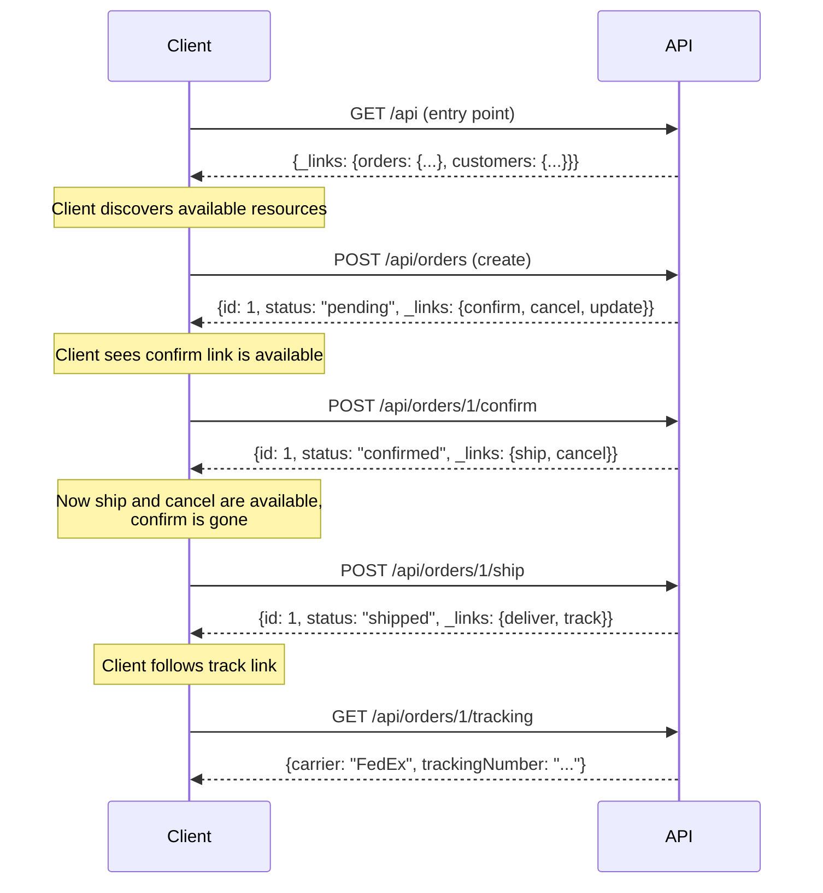

# How to Implement HATEOAS in REST APIs

Author: [nawazdhandala](https://www.github.com/nawazdhandala)

Tags: REST API, HATEOAS, API Design, Hypermedia, Web Services, Backend Development, API Architecture

Description: Learn how to implement HATEOAS (Hypermedia as the Engine of Application State) in your REST APIs to create self-documenting, discoverable endpoints that guide clients through available actions.

---

HATEOAS stands for Hypermedia as the Engine of Application State. It is a constraint of REST architecture that makes APIs truly RESTful by including hypermedia links in responses. These links tell clients what actions they can take next without requiring them to hardcode URL structures.

## Why HATEOAS Matters

Most APIs that claim to be RESTful are actually just HTTP-based APIs. True REST APIs use hypermedia to drive application state, which provides several benefits:

- **Discoverability**: Clients can explore the API by following links
- **Decoupling**: Clients do not need to construct URLs themselves
- **Evolvability**: Server can change URLs without breaking clients
- **Self-documentation**: Responses describe available actions

## Understanding the Richardson Maturity Model

Before diving into implementation, it helps to understand where HATEOAS fits in API design maturity.



Level 3 is where HATEOAS lives. Most production APIs stop at Level 2.

## Basic HATEOAS Response Structure

A HATEOAS-compliant response includes links that describe what the client can do next. Here is a simple example:

```json
{
  "id": 1,
  "name": "John Doe",
  "email": "john@example.com",
  "status": "active",
  "_links": {
    "self": {
      "href": "/api/users/1"
    },
    "update": {
      "href": "/api/users/1",
      "method": "PUT"
    },
    "delete": {
      "href": "/api/users/1",
      "method": "DELETE"
    },
    "orders": {
      "href": "/api/users/1/orders"
    },
    "deactivate": {
      "href": "/api/users/1/deactivate",
      "method": "POST"
    }
  }
}
```

The `_links` object contains hypermedia controls. Each link has a relation name (like `self`, `update`, `orders`) and the URL to follow.

## Common Link Relation Types

Link relations describe the relationship between the current resource and the linked resource. Some standard relations include:

| Relation | Description |
|----------|-------------|
| `self` | Link to the current resource |
| `collection` | Link to the parent collection |
| `next` | Link to the next page in a paginated list |
| `prev` | Link to the previous page |
| `first` | Link to the first page |
| `last` | Link to the last page |
| `edit` | Link to edit the resource |
| `delete` | Link to delete the resource |
| `related` | Link to related resources |

## Implementing HATEOAS in Node.js with Express

Let us build a practical example of a HATEOAS-compliant API for managing orders.

### Project Structure

```
src/
├── controllers/
│   └── orderController.js
├── models/
│   └── order.js
├── middleware/
│   └── hateoasLinks.js
├── utils/
│   └── linkBuilder.js
└── app.js
```

### Link Builder Utility

First, create a utility to build links consistently:

```javascript
// src/utils/linkBuilder.js

class LinkBuilder {
  constructor(baseUrl) {
    this.baseUrl = baseUrl;
  }

  // Build a single link object
  buildLink(path, method = 'GET', title = null) {
    const link = {
      href: `${this.baseUrl}${path}`,
      method: method
    };

    if (title) {
      link.title = title;
    }

    return link;
  }

  // Build links for a single order based on its current state
  buildOrderLinks(order) {
    const links = {
      self: this.buildLink(`/api/orders/${order.id}`),
      collection: this.buildLink('/api/orders')
    };

    // Add state-dependent links
    // Only show actions that are valid for the current order state
    switch (order.status) {
      case 'pending':
        links.confirm = this.buildLink(
          `/api/orders/${order.id}/confirm`,
          'POST',
          'Confirm this order'
        );
        links.cancel = this.buildLink(
          `/api/orders/${order.id}/cancel`,
          'POST',
          'Cancel this order'
        );
        links.update = this.buildLink(
          `/api/orders/${order.id}`,
          'PUT',
          'Update order details'
        );
        break;

      case 'confirmed':
        links.ship = this.buildLink(
          `/api/orders/${order.id}/ship`,
          'POST',
          'Mark as shipped'
        );
        links.cancel = this.buildLink(
          `/api/orders/${order.id}/cancel`,
          'POST',
          'Cancel this order'
        );
        break;

      case 'shipped':
        links.deliver = this.buildLink(
          `/api/orders/${order.id}/deliver`,
          'POST',
          'Mark as delivered'
        );
        links.track = this.buildLink(
          `/api/orders/${order.id}/tracking`,
          'GET',
          'Get tracking information'
        );
        break;

      case 'delivered':
        links.return = this.buildLink(
          `/api/orders/${order.id}/return`,
          'POST',
          'Initiate return'
        );
        links.review = this.buildLink(
          `/api/orders/${order.id}/review`,
          'POST',
          'Leave a review'
        );
        break;

      case 'cancelled':
        links.reorder = this.buildLink(
          `/api/orders/${order.id}/reorder`,
          'POST',
          'Place this order again'
        );
        break;
    }

    // Always include customer link if customer exists
    if (order.customerId) {
      links.customer = this.buildLink(`/api/customers/${order.customerId}`);
    }

    // Include items link
    links.items = this.buildLink(`/api/orders/${order.id}/items`);

    return links;
  }

  // Build pagination links for collections
  buildPaginationLinks(resourcePath, page, limit, totalItems) {
    const totalPages = Math.ceil(totalItems / limit);
    const links = {
      self: this.buildLink(`${resourcePath}?page=${page}&limit=${limit}`)
    };

    if (page > 1) {
      links.first = this.buildLink(`${resourcePath}?page=1&limit=${limit}`);
      links.prev = this.buildLink(`${resourcePath}?page=${page - 1}&limit=${limit}`);
    }

    if (page < totalPages) {
      links.next = this.buildLink(`${resourcePath}?page=${page + 1}&limit=${limit}`);
      links.last = this.buildLink(`${resourcePath}?page=${totalPages}&limit=${limit}`);
    }

    return links;
  }
}

module.exports = LinkBuilder;
```

### Order Model

Define the order model with valid state transitions:

```javascript
// src/models/order.js

// Valid state transitions for an order
// This defines the state machine that governs order lifecycle
const STATE_TRANSITIONS = {
  pending: ['confirmed', 'cancelled'],
  confirmed: ['shipped', 'cancelled'],
  shipped: ['delivered'],
  delivered: ['returned'],
  cancelled: [],
  returned: []
};

class Order {
  constructor(data) {
    this.id = data.id;
    this.customerId = data.customerId;
    this.items = data.items || [];
    this.status = data.status || 'pending';
    this.totalAmount = data.totalAmount || 0;
    this.createdAt = data.createdAt || new Date().toISOString();
    this.updatedAt = data.updatedAt || new Date().toISOString();
  }

  // Check if a transition to the new status is valid
  canTransitionTo(newStatus) {
    const allowedTransitions = STATE_TRANSITIONS[this.status] || [];
    return allowedTransitions.includes(newStatus);
  }

  // Attempt to transition to a new status
  transitionTo(newStatus) {
    if (!this.canTransitionTo(newStatus)) {
      throw new Error(
        `Cannot transition from ${this.status} to ${newStatus}. ` +
        `Allowed transitions: ${STATE_TRANSITIONS[this.status].join(', ') || 'none'}`
      );
    }

    this.status = newStatus;
    this.updatedAt = new Date().toISOString();
    return this;
  }

  // Get allowed next states
  getAllowedTransitions() {
    return STATE_TRANSITIONS[this.status] || [];
  }
}

module.exports = Order;
```

### Order Controller with HATEOAS

Now implement the controller that returns HATEOAS-compliant responses:

```javascript
// src/controllers/orderController.js

const LinkBuilder = require('../utils/linkBuilder');
const Order = require('../models/order');

class OrderController {
  constructor(baseUrl) {
    this.linkBuilder = new LinkBuilder(baseUrl);

    // In-memory storage for demo purposes
    // In production, this would be a database
    this.orders = new Map();
    this.nextId = 1;
  }

  // GET /api/orders
  // Returns a paginated list of orders with HATEOAS links
  listOrders(req, res) {
    const page = parseInt(req.query.page) || 1;
    const limit = parseInt(req.query.limit) || 10;
    const status = req.query.status; // Optional filter

    // Convert orders map to array and apply filters
    let orderList = Array.from(this.orders.values());

    if (status) {
      orderList = orderList.filter(order => order.status === status);
    }

    const totalItems = orderList.length;
    const startIndex = (page - 1) * limit;
    const endIndex = startIndex + limit;
    const paginatedOrders = orderList.slice(startIndex, endIndex);

    // Add links to each order in the collection
    const ordersWithLinks = paginatedOrders.map(order => ({
      ...order,
      _links: this.linkBuilder.buildOrderLinks(order)
    }));

    // Build the response with collection-level links
    const response = {
      _embedded: {
        orders: ordersWithLinks
      },
      _links: {
        ...this.linkBuilder.buildPaginationLinks('/api/orders', page, limit, totalItems),
        create: this.linkBuilder.buildLink('/api/orders', 'POST', 'Create a new order')
      },
      page: {
        size: limit,
        totalElements: totalItems,
        totalPages: Math.ceil(totalItems / limit),
        number: page
      }
    };

    res.json(response);
  }

  // GET /api/orders/:id
  // Returns a single order with contextual HATEOAS links
  getOrder(req, res) {
    const orderId = parseInt(req.params.id);
    const order = this.orders.get(orderId);

    if (!order) {
      return res.status(404).json({
        error: 'Order not found',
        _links: {
          collection: this.linkBuilder.buildLink('/api/orders'),
          create: this.linkBuilder.buildLink('/api/orders', 'POST')
        }
      });
    }

    // Return order with state-appropriate links
    const response = {
      ...order,
      _links: this.linkBuilder.buildOrderLinks(order)
    };

    res.json(response);
  }

  // POST /api/orders
  // Creates a new order and returns it with links
  createOrder(req, res) {
    const orderData = {
      id: this.nextId++,
      customerId: req.body.customerId,
      items: req.body.items,
      totalAmount: req.body.totalAmount,
      status: 'pending'
    };

    const order = new Order(orderData);
    this.orders.set(order.id, order);

    const response = {
      ...order,
      _links: this.linkBuilder.buildOrderLinks(order)
    };

    res.status(201).json(response);
  }

  // POST /api/orders/:id/confirm
  // Confirms a pending order
  confirmOrder(req, res) {
    const orderId = parseInt(req.params.id);
    const order = this.orders.get(orderId);

    if (!order) {
      return res.status(404).json({ error: 'Order not found' });
    }

    try {
      order.transitionTo('confirmed');

      const response = {
        ...order,
        _links: this.linkBuilder.buildOrderLinks(order)
      };

      res.json(response);
    } catch (error) {
      res.status(409).json({
        error: error.message,
        currentStatus: order.status,
        _links: this.linkBuilder.buildOrderLinks(order)
      });
    }
  }

  // POST /api/orders/:id/ship
  // Marks a confirmed order as shipped
  shipOrder(req, res) {
    const orderId = parseInt(req.params.id);
    const order = this.orders.get(orderId);

    if (!order) {
      return res.status(404).json({ error: 'Order not found' });
    }

    try {
      order.transitionTo('shipped');
      order.trackingNumber = req.body.trackingNumber;
      order.carrier = req.body.carrier;

      const response = {
        ...order,
        _links: this.linkBuilder.buildOrderLinks(order)
      };

      res.json(response);
    } catch (error) {
      res.status(409).json({
        error: error.message,
        currentStatus: order.status,
        _links: this.linkBuilder.buildOrderLinks(order)
      });
    }
  }

  // POST /api/orders/:id/cancel
  // Cancels a pending or confirmed order
  cancelOrder(req, res) {
    const orderId = parseInt(req.params.id);
    const order = this.orders.get(orderId);

    if (!order) {
      return res.status(404).json({ error: 'Order not found' });
    }

    try {
      order.transitionTo('cancelled');
      order.cancellationReason = req.body.reason;

      const response = {
        ...order,
        _links: this.linkBuilder.buildOrderLinks(order)
      };

      res.json(response);
    } catch (error) {
      res.status(409).json({
        error: error.message,
        currentStatus: order.status,
        _links: this.linkBuilder.buildOrderLinks(order)
      });
    }
  }
}

module.exports = OrderController;
```

### Express Application Setup

```javascript
// src/app.js

const express = require('express');
const OrderController = require('./controllers/orderController');

const app = express();
app.use(express.json());

// Determine base URL from environment or request
const BASE_URL = process.env.BASE_URL || 'http://localhost:3000';

const orderController = new OrderController(BASE_URL);

// API Root - Entry point with links to all available resources
app.get('/api', (req, res) => {
  res.json({
    _links: {
      self: { href: `${BASE_URL}/api` },
      orders: {
        href: `${BASE_URL}/api/orders`,
        title: 'List all orders'
      },
      customers: {
        href: `${BASE_URL}/api/customers`,
        title: 'List all customers'
      },
      products: {
        href: `${BASE_URL}/api/products`,
        title: 'List all products'
      }
    }
  });
});

// Order routes
app.get('/api/orders', (req, res) => orderController.listOrders(req, res));
app.post('/api/orders', (req, res) => orderController.createOrder(req, res));
app.get('/api/orders/:id', (req, res) => orderController.getOrder(req, res));
app.post('/api/orders/:id/confirm', (req, res) => orderController.confirmOrder(req, res));
app.post('/api/orders/:id/ship', (req, res) => orderController.shipOrder(req, res));
app.post('/api/orders/:id/cancel', (req, res) => orderController.cancelOrder(req, res));

const PORT = process.env.PORT || 3000;
app.listen(PORT, () => {
  console.log(`Server running on port ${PORT}`);
});
```

## Order State Machine Flow

The order lifecycle follows a state machine. HATEOAS links reflect which transitions are valid at any given state:



## Example API Interactions

### Creating an Order

**Request:**
```bash
curl -X POST http://localhost:3000/api/orders \
  -H "Content-Type: application/json" \
  -d '{
    "customerId": 42,
    "items": [
      {"productId": 1, "quantity": 2, "price": 29.99},
      {"productId": 5, "quantity": 1, "price": 49.99}
    ],
    "totalAmount": 109.97
  }'
```

**Response:**
```json
{
  "id": 1,
  "customerId": 42,
  "items": [
    {"productId": 1, "quantity": 2, "price": 29.99},
    {"productId": 5, "quantity": 1, "price": 49.99}
  ],
  "totalAmount": 109.97,
  "status": "pending",
  "createdAt": "2026-01-26T10:30:00.000Z",
  "updatedAt": "2026-01-26T10:30:00.000Z",
  "_links": {
    "self": {
      "href": "http://localhost:3000/api/orders/1",
      "method": "GET"
    },
    "collection": {
      "href": "http://localhost:3000/api/orders",
      "method": "GET"
    },
    "confirm": {
      "href": "http://localhost:3000/api/orders/1/confirm",
      "method": "POST",
      "title": "Confirm this order"
    },
    "cancel": {
      "href": "http://localhost:3000/api/orders/1/cancel",
      "method": "POST",
      "title": "Cancel this order"
    },
    "update": {
      "href": "http://localhost:3000/api/orders/1",
      "method": "PUT",
      "title": "Update order details"
    },
    "customer": {
      "href": "http://localhost:3000/api/customers/42",
      "method": "GET"
    },
    "items": {
      "href": "http://localhost:3000/api/orders/1/items",
      "method": "GET"
    }
  }
}
```

Notice how the response includes `confirm` and `cancel` links because those are valid actions for a pending order.

### Confirming the Order

**Request:**
```bash
curl -X POST http://localhost:3000/api/orders/1/confirm
```

**Response:**
```json
{
  "id": 1,
  "customerId": 42,
  "status": "confirmed",
  "updatedAt": "2026-01-26T10:35:00.000Z",
  "_links": {
    "self": {
      "href": "http://localhost:3000/api/orders/1",
      "method": "GET"
    },
    "collection": {
      "href": "http://localhost:3000/api/orders",
      "method": "GET"
    },
    "ship": {
      "href": "http://localhost:3000/api/orders/1/ship",
      "method": "POST",
      "title": "Mark as shipped"
    },
    "cancel": {
      "href": "http://localhost:3000/api/orders/1/cancel",
      "method": "POST",
      "title": "Cancel this order"
    },
    "customer": {
      "href": "http://localhost:3000/api/customers/42",
      "method": "GET"
    },
    "items": {
      "href": "http://localhost:3000/api/orders/1/items",
      "method": "GET"
    }
  }
}
```

Now the response shows `ship` and `cancel` links instead of `confirm` and `update`. The available actions changed based on the new state.

## Implementing HATEOAS in Spring Boot (Java)

For Java developers, Spring HATEOAS provides excellent support. Here is how to implement the same order API:

```java
// Order.java - Entity with state
package com.example.orders.model;

import java.time.Instant;
import java.util.List;

public class Order {
    private Long id;
    private Long customerId;
    private List<OrderItem> items;
    private OrderStatus status;
    private Double totalAmount;
    private Instant createdAt;
    private Instant updatedAt;

    public enum OrderStatus {
        PENDING, CONFIRMED, SHIPPED, DELIVERED, CANCELLED, RETURNED
    }

    // Getters, setters, and constructors omitted for brevity

    public boolean canTransitionTo(OrderStatus newStatus) {
        return switch (this.status) {
            case PENDING -> newStatus == OrderStatus.CONFIRMED ||
                           newStatus == OrderStatus.CANCELLED;
            case CONFIRMED -> newStatus == OrderStatus.SHIPPED ||
                             newStatus == OrderStatus.CANCELLED;
            case SHIPPED -> newStatus == OrderStatus.DELIVERED;
            case DELIVERED -> newStatus == OrderStatus.RETURNED;
            default -> false;
        };
    }
}
```

```java
// OrderModelAssembler.java - Converts Order to HATEOAS model
package com.example.orders.assembler;

import com.example.orders.controller.OrderController;
import com.example.orders.model.Order;
import com.example.orders.model.Order.OrderStatus;
import org.springframework.hateoas.EntityModel;
import org.springframework.hateoas.server.RepresentationModelAssembler;
import org.springframework.stereotype.Component;

import static org.springframework.hateoas.server.mvc.WebMvcLinkBuilder.*;

@Component
public class OrderModelAssembler
    implements RepresentationModelAssembler<Order, EntityModel<Order>> {

    @Override
    public EntityModel<Order> toModel(Order order) {
        // Start with self link - always present
        EntityModel<Order> orderModel = EntityModel.of(order,
            linkTo(methodOn(OrderController.class).getOrder(order.getId()))
                .withSelfRel(),
            linkTo(methodOn(OrderController.class).listOrders(null, null))
                .withRel("collection")
        );

        // Add state-dependent links
        // This is where HATEOAS shines - clients discover available actions
        if (order.getStatus() == OrderStatus.PENDING) {
            orderModel.add(
                linkTo(methodOn(OrderController.class).confirmOrder(order.getId()))
                    .withRel("confirm"),
                linkTo(methodOn(OrderController.class).cancelOrder(order.getId(), null))
                    .withRel("cancel"),
                linkTo(methodOn(OrderController.class).updateOrder(order.getId(), null))
                    .withRel("update")
            );
        }

        if (order.getStatus() == OrderStatus.CONFIRMED) {
            orderModel.add(
                linkTo(methodOn(OrderController.class).shipOrder(order.getId(), null))
                    .withRel("ship"),
                linkTo(methodOn(OrderController.class).cancelOrder(order.getId(), null))
                    .withRel("cancel")
            );
        }

        if (order.getStatus() == OrderStatus.SHIPPED) {
            orderModel.add(
                linkTo(methodOn(OrderController.class).deliverOrder(order.getId()))
                    .withRel("deliver"),
                linkTo(methodOn(OrderController.class).getTracking(order.getId()))
                    .withRel("track")
            );
        }

        if (order.getStatus() == OrderStatus.DELIVERED) {
            orderModel.add(
                linkTo(methodOn(OrderController.class).returnOrder(order.getId(), null))
                    .withRel("return")
            );
        }

        if (order.getStatus() == OrderStatus.CANCELLED) {
            orderModel.add(
                linkTo(methodOn(OrderController.class).reorder(order.getId()))
                    .withRel("reorder")
            );
        }

        // Add related resource links
        if (order.getCustomerId() != null) {
            orderModel.add(
                linkTo(methodOn(CustomerController.class)
                    .getCustomer(order.getCustomerId()))
                    .withRel("customer")
            );
        }

        return orderModel;
    }
}
```

```java
// OrderController.java - REST endpoints
package com.example.orders.controller;

import com.example.orders.assembler.OrderModelAssembler;
import com.example.orders.model.Order;
import com.example.orders.service.OrderService;
import org.springframework.hateoas.CollectionModel;
import org.springframework.hateoas.EntityModel;
import org.springframework.hateoas.IanaLinkRelations;
import org.springframework.http.ResponseEntity;
import org.springframework.web.bind.annotation.*;

import java.util.List;
import java.util.stream.Collectors;

import static org.springframework.hateoas.server.mvc.WebMvcLinkBuilder.*;

@RestController
@RequestMapping("/api/orders")
public class OrderController {

    private final OrderService orderService;
    private final OrderModelAssembler assembler;

    public OrderController(OrderService orderService,
                          OrderModelAssembler assembler) {
        this.orderService = orderService;
        this.assembler = assembler;
    }

    @GetMapping
    public CollectionModel<EntityModel<Order>> listOrders(
            @RequestParam(required = false) Integer page,
            @RequestParam(required = false) Integer size) {

        List<EntityModel<Order>> orders = orderService.findAll().stream()
            .map(assembler::toModel)
            .collect(Collectors.toList());

        return CollectionModel.of(orders,
            linkTo(methodOn(OrderController.class).listOrders(page, size))
                .withSelfRel(),
            linkTo(methodOn(OrderController.class).createOrder(null))
                .withRel("create")
        );
    }

    @GetMapping("/{id}")
    public EntityModel<Order> getOrder(@PathVariable Long id) {
        Order order = orderService.findById(id);
        return assembler.toModel(order);
    }

    @PostMapping
    public ResponseEntity<EntityModel<Order>> createOrder(
            @RequestBody Order newOrder) {
        Order savedOrder = orderService.create(newOrder);
        EntityModel<Order> entityModel = assembler.toModel(savedOrder);

        return ResponseEntity
            .created(entityModel.getRequiredLink(IanaLinkRelations.SELF).toUri())
            .body(entityModel);
    }

    @PostMapping("/{id}/confirm")
    public EntityModel<Order> confirmOrder(@PathVariable Long id) {
        Order order = orderService.confirm(id);
        return assembler.toModel(order);
    }

    @PostMapping("/{id}/ship")
    public EntityModel<Order> shipOrder(
            @PathVariable Long id,
            @RequestBody ShipmentDetails details) {
        Order order = orderService.ship(id, details);
        return assembler.toModel(order);
    }

    @PostMapping("/{id}/cancel")
    public EntityModel<Order> cancelOrder(
            @PathVariable Long id,
            @RequestBody(required = false) CancellationRequest request) {
        Order order = orderService.cancel(id, request);
        return assembler.toModel(order);
    }

    // Additional endpoints omitted for brevity
}
```

## Client-Side Usage

A HATEOAS-aware client follows links instead of constructing URLs. Here is how a JavaScript client might work:

```javascript
// hateoasClient.js - A simple HATEOAS-aware API client

class HateoasClient {
  constructor(entryPointUrl) {
    this.entryPointUrl = entryPointUrl;
    this.cache = new Map();
  }

  // Start from the API entry point
  async discover() {
    const response = await fetch(this.entryPointUrl);
    return response.json();
  }

  // Follow a link relation from a resource
  async follow(resource, relation, options = {}) {
    const link = resource._links?.[relation];

    if (!link) {
      throw new Error(`Link relation '${relation}' not found in resource`);
    }

    const method = link.method || 'GET';
    const fetchOptions = {
      method: method,
      headers: {
        'Content-Type': 'application/json'
      }
    };

    if (options.body && method !== 'GET') {
      fetchOptions.body = JSON.stringify(options.body);
    }

    const response = await fetch(link.href, fetchOptions);

    if (!response.ok) {
      const error = await response.json();
      throw new Error(error.error || `Request failed: ${response.status}`);
    }

    return response.json();
  }

  // Check if an action is available
  canPerform(resource, action) {
    return resource._links?.[action] !== undefined;
  }
}

// Example usage
async function orderWorkflow() {
  const client = new HateoasClient('http://localhost:3000/api');

  // 1. Discover the API
  const api = await client.discover();
  console.log('Available resources:', Object.keys(api._links));

  // 2. Create an order by following the 'orders' link
  const ordersCollection = await client.follow(api, 'orders');
  const newOrder = await client.follow(ordersCollection, 'create', {
    body: {
      customerId: 42,
      items: [{ productId: 1, quantity: 2, price: 29.99 }],
      totalAmount: 59.98
    }
  });

  console.log('Order created:', newOrder.id, 'Status:', newOrder.status);

  // 3. Check what actions are available
  if (client.canPerform(newOrder, 'confirm')) {
    console.log('Order can be confirmed');

    // 4. Confirm the order
    const confirmedOrder = await client.follow(newOrder, 'confirm');
    console.log('Order confirmed. New status:', confirmedOrder.status);

    // 5. Now we can ship it
    if (client.canPerform(confirmedOrder, 'ship')) {
      const shippedOrder = await client.follow(confirmedOrder, 'ship', {
        body: {
          trackingNumber: 'TRK123456',
          carrier: 'FedEx'
        }
      });
      console.log('Order shipped. Tracking:', shippedOrder.trackingNumber);

      // 6. Get tracking information
      if (client.canPerform(shippedOrder, 'track')) {
        const tracking = await client.follow(shippedOrder, 'track');
        console.log('Tracking info:', tracking);
      }
    }
  }
}
```

## HATEOAS Response Flow

Here is how clients interact with a HATEOAS API:



## Best Practices

### 1. Use Standard Link Relations When Possible

IANA maintains a list of standard link relations. Use these when they fit your use case:

```json
{
  "_links": {
    "self": { "href": "/api/orders/1" },
    "collection": { "href": "/api/orders" },
    "next": { "href": "/api/orders?page=2" },
    "edit": { "href": "/api/orders/1", "method": "PUT" }
  }
}
```

### 2. Include Method Information

Not all links are GET requests. Include the HTTP method when it is not GET:

```json
{
  "_links": {
    "cancel": {
      "href": "/api/orders/1/cancel",
      "method": "POST"
    }
  }
}
```

### 3. Add Human-Readable Titles

Help developers understand what each link does:

```json
{
  "_links": {
    "ship": {
      "href": "/api/orders/1/ship",
      "method": "POST",
      "title": "Mark this order as shipped"
    }
  }
}
```

### 4. Handle Link Absence Gracefully

Clients should check for link presence before using them:

```javascript
// Good - checks if action is available
if (order._links.cancel) {
  showCancelButton();
}

// Bad - assumes link exists
const cancelUrl = order._links.cancel.href; // May throw error
```

### 5. Use Embedded Resources for Efficiency

Reduce round trips by embedding related resources:

```json
{
  "id": 1,
  "status": "pending",
  "_embedded": {
    "items": [
      { "productId": 1, "name": "Widget", "quantity": 2 },
      { "productId": 5, "name": "Gadget", "quantity": 1 }
    ],
    "customer": {
      "id": 42,
      "name": "John Doe"
    }
  },
  "_links": {
    "self": { "href": "/api/orders/1" }
  }
}
```

### 6. Provide an API Entry Point

Give clients a single URL to discover the entire API:

```json
{
  "_links": {
    "self": { "href": "/api" },
    "orders": { "href": "/api/orders", "title": "Order management" },
    "customers": { "href": "/api/customers", "title": "Customer management" },
    "products": { "href": "/api/products", "title": "Product catalog" },
    "docs": { "href": "/api/docs", "title": "API documentation" }
  }
}
```

## Common Formats for HATEOAS

Several formats exist for representing hypermedia in JSON:

| Format | Description |
|--------|-------------|
| HAL (Hypertext Application Language) | Simple format using `_links` and `_embedded` |
| JSON-LD | Linked Data format with rich semantic context |
| Collection+JSON | Read/write format for managing collections |
| Siren | Includes actions with form-like definitions |
| JSON:API | Includes relationships and compound documents |

The examples in this post use HAL-style conventions, which is the most widely adopted format.

## Conclusion

HATEOAS transforms your REST API from a collection of endpoints into a navigable, self-documenting system. Clients discover available actions at runtime instead of relying on out-of-band documentation. This makes your API more resilient to change and easier for developers to explore.

Key takeaways:

1. Include `_links` in every response to guide clients
2. Vary links based on resource state to show only valid actions
3. Use standard link relations when possible
4. Provide an API entry point for discovery
5. Build clients that follow links instead of constructing URLs

While HATEOAS requires more upfront effort, it pays off in maintainability and developer experience. Your API becomes a living document that tells clients exactly what they can do at any moment.
