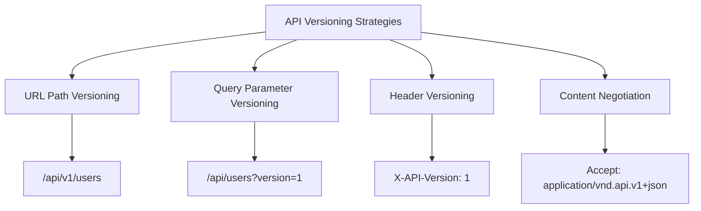
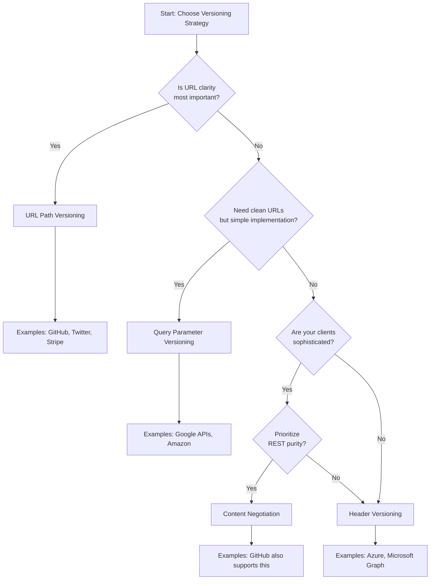
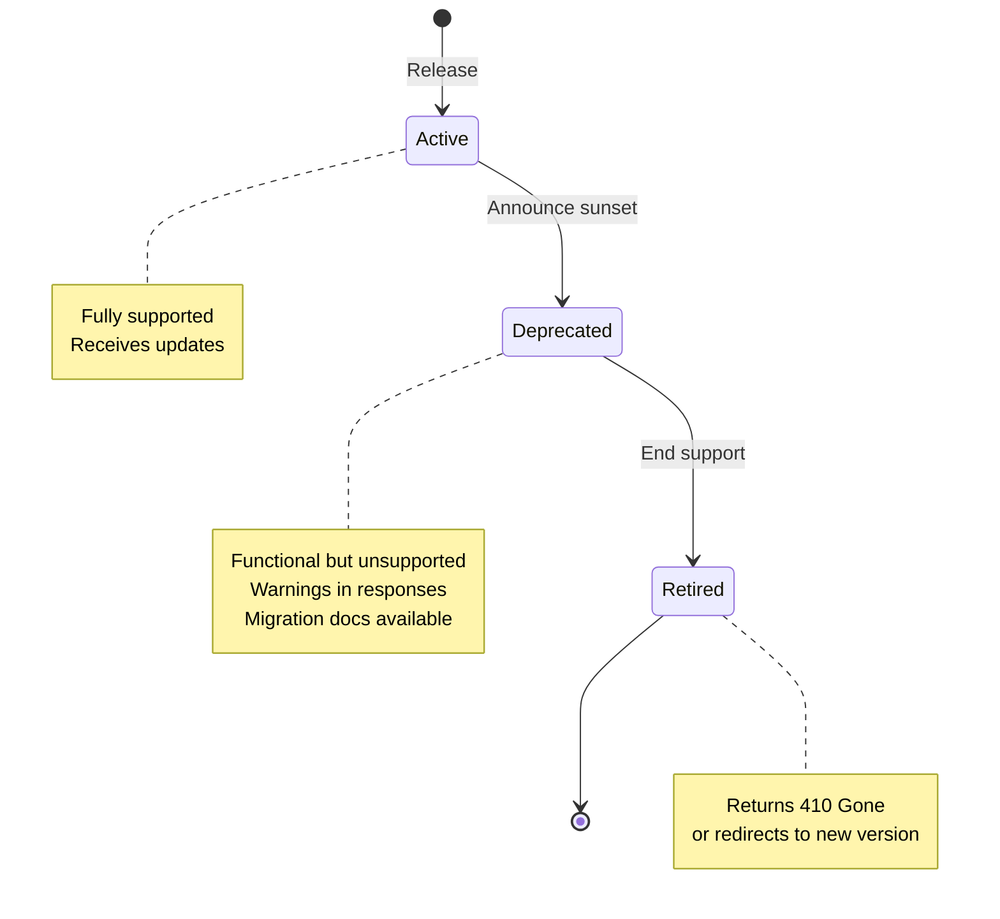

# How to Version REST APIs Effectively

Author: [nawazdhandala](https://www.github.com/nawazdhandala)

Tags: REST API, API Versioning, Web Development, Backend Development, API Design, Semantic Versioning, Microservices

Description: A practical guide to implementing REST API versioning strategies that keep your clients happy while allowing your API to evolve.

---

When you build a REST API that other teams or external clients depend on, you face a common problem: how do you add new features or fix design mistakes without breaking existing integrations? API versioning solves this challenge by allowing multiple versions of your API to coexist.

This guide covers the major versioning strategies, their trade-offs, and practical implementation patterns you can apply regardless of your tech stack.

## Why Version Your APIs?

APIs evolve. You might need to:

- Change the structure of request or response payloads
- Rename fields to improve clarity
- Remove deprecated endpoints
- Fix security vulnerabilities that require breaking changes
- Redesign resources based on lessons learned

Without versioning, any of these changes could break client applications. With proper versioning, you give clients time to migrate while continuing to iterate on your API.

## Versioning Strategies Overview

There are four primary approaches to REST API versioning:



Let's explore each approach with real-world examples.

## 1. URL Path Versioning

URL path versioning embeds the version number directly in the URL. This is the most popular approach because it's explicit and easy to understand.

### Basic Implementation

```python
# Python Flask example showing URL path versioning

from flask import Flask, jsonify

app = Flask(__name__)

# Version 1 - Returns basic user information
@app.route('/api/v1/users/<int:user_id>', methods=['GET'])
def get_user_v1(user_id):
    # V1 returns a flat structure with full_name
    user = fetch_user_from_database(user_id)
    return jsonify({
        'id': user.id,
        'full_name': f"{user.first_name} {user.last_name}",
        'email': user.email
    })

# Version 2 - Returns enhanced user information with separate name fields
@app.route('/api/v2/users/<int:user_id>', methods=['GET'])
def get_user_v2(user_id):
    # V2 separates first_name and last_name for better data handling
    # Also adds created_at timestamp that clients requested
    user = fetch_user_from_database(user_id)
    return jsonify({
        'id': user.id,
        'first_name': user.first_name,
        'last_name': user.last_name,
        'email': user.email,
        'created_at': user.created_at.isoformat()
    })
```

### Node.js Express Implementation

```javascript
// Node.js Express example with modular version routing

const express = require('express');
const app = express();

// Import version-specific route modules
const usersV1 = require('./routes/v1/users');
const usersV2 = require('./routes/v2/users');

// Mount each version at its own path
// This keeps version-specific logic isolated in separate files
app.use('/api/v1/users', usersV1);
app.use('/api/v2/users', usersV2);

// routes/v1/users.js
const router = express.Router();

router.get('/:id', async (req, res) => {
    const user = await User.findById(req.params.id);

    // V1 response format - legacy structure that existing clients expect
    res.json({
        id: user.id,
        full_name: `${user.firstName} ${user.lastName}`,
        email: user.email
    });
});

module.exports = router;

// routes/v2/users.js
const router = express.Router();

router.get('/:id', async (req, res) => {
    const user = await User.findById(req.params.id);

    // V2 response format - improved structure with additional metadata
    // Breaking change: full_name is now split into firstName and lastName
    res.json({
        id: user.id,
        firstName: user.firstName,
        lastName: user.lastName,
        email: user.email,
        createdAt: user.createdAt,
        updatedAt: user.updatedAt
    });
});

module.exports = router;
```

### Advantages

- Clear and visible in URLs, making debugging easier
- Easy to route requests to different handlers
- Clients can bookmark specific API versions
- Simple to document and communicate

### Disadvantages

- URLs change between versions, breaking REST principles (same resource, different URI)
- Can lead to URL proliferation if you version frequently

## 2. Query Parameter Versioning

Query parameter versioning adds the version as a URL parameter. This keeps the resource path consistent while allowing version selection.

### Implementation Example

```python
# Python Flask example with query parameter versioning

from flask import Flask, jsonify, request

app = Flask(__name__)

@app.route('/api/users/<int:user_id>', methods=['GET'])
def get_user(user_id):
    # Extract version from query parameter, default to latest stable version
    # Example: /api/users/123?version=2
    version = request.args.get('version', '2')

    user = fetch_user_from_database(user_id)

    if version == '1':
        # Legacy response format for backward compatibility
        return jsonify({
            'id': user.id,
            'full_name': f"{user.first_name} {user.last_name}",
            'email': user.email
        })
    elif version == '2':
        # Current response format with improved structure
        return jsonify({
            'id': user.id,
            'first_name': user.first_name,
            'last_name': user.last_name,
            'email': user.email,
            'profile': {
                'avatar_url': user.avatar_url,
                'bio': user.bio
            }
        })
    else:
        # Return error for unsupported versions
        return jsonify({
            'error': 'Unsupported API version',
            'supported_versions': ['1', '2']
        }), 400
```

### Go Implementation

```go
// Go implementation with query parameter versioning

package main

import (
    "encoding/json"
    "net/http"
)

// UserV1Response represents the legacy user format
type UserV1Response struct {
    ID       int    `json:"id"`
    FullName string `json:"full_name"`
    Email    string `json:"email"`
}

// UserV2Response represents the current user format with nested profile
type UserV2Response struct {
    ID        int     `json:"id"`
    FirstName string  `json:"first_name"`
    LastName  string  `json:"last_name"`
    Email     string  `json:"email"`
    Profile   Profile `json:"profile"`
}

type Profile struct {
    AvatarURL string `json:"avatar_url"`
    Bio       string `json:"bio"`
}

func getUserHandler(w http.ResponseWriter, r *http.Request) {
    // Get version from query parameter, default to "2" if not specified
    version := r.URL.Query().Get("version")
    if version == "" {
        version = "2"
    }

    user := fetchUserFromDatabase(r.URL.Query().Get("id"))

    w.Header().Set("Content-Type", "application/json")

    switch version {
    case "1":
        // Serialize response in V1 format
        json.NewEncoder(w).Encode(UserV1Response{
            ID:       user.ID,
            FullName: user.FirstName + " " + user.LastName,
            Email:    user.Email,
        })
    case "2":
        // Serialize response in V2 format with profile data
        json.NewEncoder(w).Encode(UserV2Response{
            ID:        user.ID,
            FirstName: user.FirstName,
            LastName:  user.LastName,
            Email:     user.Email,
            Profile: Profile{
                AvatarURL: user.AvatarURL,
                Bio:       user.Bio,
            },
        })
    default:
        http.Error(w, "Unsupported API version", http.StatusBadRequest)
    }
}
```

### Advantages

- Maintains consistent resource URIs
- Easy to implement and test
- Optional parameter allows defaulting to latest version

### Disadvantages

- Version can be accidentally omitted
- Less visible than URL path versioning
- Can be lost when copying/sharing URLs

## 3. Header Versioning

Header versioning uses custom HTTP headers to specify the API version. This approach keeps URLs clean while giving clients explicit control.

### Implementation Example

```python
# Python Flask example with custom header versioning

from flask import Flask, jsonify, request

app = Flask(__name__)

@app.route('/api/users/<int:user_id>', methods=['GET'])
def get_user(user_id):
    # Read version from custom header
    # Clients send: X-API-Version: 2
    api_version = request.headers.get('X-API-Version', '2')

    user = fetch_user_from_database(user_id)

    # Build response based on requested version
    if api_version == '1':
        response_data = {
            'id': user.id,
            'full_name': f"{user.first_name} {user.last_name}",
            'email': user.email
        }
    else:
        response_data = {
            'id': user.id,
            'first_name': user.first_name,
            'last_name': user.last_name,
            'email': user.email,
            'metadata': {
                'created_at': user.created_at.isoformat(),
                'updated_at': user.updated_at.isoformat()
            }
        }

    response = jsonify(response_data)
    # Echo back the version used in response header for transparency
    response.headers['X-API-Version'] = api_version
    return response
```

### Client-Side Usage

```javascript
// JavaScript client example showing how to request a specific API version

async function fetchUser(userId, apiVersion = '2') {
    const response = await fetch(`https://api.example.com/users/${userId}`, {
        method: 'GET',
        headers: {
            'Content-Type': 'application/json',
            'X-API-Version': apiVersion  // Specify desired version in header
        }
    });

    // Log which version was actually used (helpful for debugging)
    console.log('API Version used:', response.headers.get('X-API-Version'));

    return response.json();
}

// Fetch user with V1 format (legacy clients)
const userV1 = await fetchUser(123, '1');

// Fetch user with V2 format (current clients)
const userV2 = await fetchUser(123, '2');
```

### Advantages

- Clean URLs without version clutter
- Follows HTTP semantics (metadata in headers)
- Can include additional version metadata

### Disadvantages

- Requires clients to manage headers
- Harder to test in browsers without tools
- Version not visible in server logs without extra configuration

## 4. Content Negotiation (Media Type Versioning)

Content negotiation uses the `Accept` header with vendor-specific media types. This is the most RESTful approach as it treats versions as different representations of the same resource.

### Implementation Example

```python
# Python Flask example with content negotiation versioning

from flask import Flask, jsonify, request

app = Flask(__name__)

def parse_accept_header(accept_header):
    """
    Parse the Accept header to extract version information.
    Expected format: application/vnd.myapi.v1+json
    """
    if not accept_header:
        return '2'  # Default to latest version

    # Look for vendor-specific media type pattern
    if 'vnd.myapi.v1' in accept_header:
        return '1'
    elif 'vnd.myapi.v2' in accept_header:
        return '2'

    return '2'  # Default to latest

@app.route('/api/users/<int:user_id>', methods=['GET'])
def get_user(user_id):
    # Parse version from Accept header
    # Client sends: Accept: application/vnd.myapi.v2+json
    accept_header = request.headers.get('Accept', '')
    version = parse_accept_header(accept_header)

    user = fetch_user_from_database(user_id)

    if version == '1':
        response_data = {
            'id': user.id,
            'full_name': f"{user.first_name} {user.last_name}",
            'email': user.email
        }
        content_type = 'application/vnd.myapi.v1+json'
    else:
        response_data = {
            'id': user.id,
            'first_name': user.first_name,
            'last_name': user.last_name,
            'email': user.email,
            'links': {
                'self': f'/api/users/{user.id}',
                'posts': f'/api/users/{user.id}/posts'
            }
        }
        content_type = 'application/vnd.myapi.v2+json'

    response = jsonify(response_data)
    response.headers['Content-Type'] = content_type
    return response
```

### Advantages

- Most RESTful approach (same URI, different representation)
- Clear separation of version from resource identity
- Can version individual resources independently

### Disadvantages

- More complex to implement and test
- Requires clients to understand media type conventions
- Browser testing requires specialized tools

## Comparing Versioning Strategies

Here's a decision flow to help you choose:



## Version Lifecycle Management

Managing the lifecycle of API versions is just as important as choosing a versioning strategy.



### Implementing Deprecation Headers

```python
# Python example showing deprecation warning headers

from flask import Flask, jsonify, request
from datetime import datetime, timedelta

app = Flask(__name__)

# Configuration for version lifecycle
VERSION_CONFIG = {
    'v1': {
        'status': 'deprecated',
        'sunset_date': '2026-06-01',
        'successor': 'v2'
    },
    'v2': {
        'status': 'active',
        'sunset_date': None,
        'successor': None
    }
}

def add_deprecation_headers(response, version):
    """
    Add standard deprecation headers to inform clients about version status.
    Uses the Deprecation and Sunset HTTP headers (RFC 8594).
    """
    config = VERSION_CONFIG.get(version, {})

    if config.get('status') == 'deprecated':
        # Deprecation header indicates the version is deprecated
        response.headers['Deprecation'] = 'true'

        # Sunset header tells clients when the version will be removed
        if config.get('sunset_date'):
            response.headers['Sunset'] = config['sunset_date']

        # Link to migration documentation
        response.headers['Link'] = (
            f'</docs/migration/{version}-to-{config["successor"]}>; '
            f'rel="deprecation"; type="text/html"'
        )

    return response

@app.route('/api/v1/users/<int:user_id>', methods=['GET'])
def get_user_v1(user_id):
    user = fetch_user_from_database(user_id)

    response = jsonify({
        'id': user.id,
        'full_name': f"{user.first_name} {user.last_name}",
        'email': user.email,
        # Include deprecation warning in response body too
        '_warning': 'This API version is deprecated. Please migrate to v2.'
    })

    return add_deprecation_headers(response, 'v1')
```

## Handling Breaking vs Non-Breaking Changes

Not every change requires a new version. Understanding when to increment versions helps avoid version sprawl.

### Non-Breaking Changes (No Version Bump Needed)

```python
# These changes are backward compatible and don't require a new version

# SAFE: Adding a new optional field to responses
# Existing clients will simply ignore it
response_v2_compatible = {
    'id': user.id,
    'first_name': user.first_name,
    'last_name': user.last_name,
    'email': user.email,
    'phone': user.phone  # New optional field - clients can ignore this
}

# SAFE: Adding a new endpoint
# Existing clients won't call it, new clients can use it
@app.route('/api/v2/users/<int:user_id>/preferences', methods=['GET'])
def get_user_preferences(user_id):
    # Brand new endpoint - no impact on existing integrations
    pass

# SAFE: Adding optional query parameters
# Existing clients don't send it, behavior unchanged for them
@app.route('/api/v2/users', methods=['GET'])
def list_users():
    include_inactive = request.args.get('include_inactive', 'false')
    # Default behavior unchanged, new parameter is optional
```

### Breaking Changes (Version Bump Required)

```python
# These changes break existing clients and require a new API version

# BREAKING: Removing a field from responses
# V1 response - clients depend on 'full_name'
response_v1 = {
    'id': user.id,
    'full_name': f"{user.first_name} {user.last_name}",  # Clients use this
    'email': user.email
}

# V2 response - 'full_name' removed, replaced with separate fields
response_v2 = {
    'id': user.id,
    'first_name': user.first_name,  # Breaking: clients expecting 'full_name' will fail
    'last_name': user.last_name,
    'email': user.email
}

# BREAKING: Changing field types
# V1: status as string
response_v1 = {'status': 'active'}

# V2: status as object - breaks clients parsing as string
response_v2 = {'status': {'code': 'active', 'since': '2026-01-01'}}

# BREAKING: Changing required fields in requests
# V1: only email required
# V2: email AND phone required - breaks existing client requests
```

## Practical Implementation: Version Router Pattern

Here's a reusable pattern for managing multiple API versions:

```python
# Python example of a version router pattern

from flask import Flask, Blueprint, request, g
from functools import wraps

app = Flask(__name__)

class VersionedAPI:
    """
    A class to manage multiple API versions with shared and version-specific logic.
    """

    def __init__(self, app):
        self.app = app
        self.versions = {}

    def register_version(self, version, blueprint):
        """Register a versioned blueprint."""
        self.versions[version] = blueprint
        self.app.register_blueprint(blueprint, url_prefix=f'/api/{version}')

    def get_supported_versions(self):
        """Return list of all supported versions."""
        return list(self.versions.keys())

# Create version-specific blueprints
v1_bp = Blueprint('v1', __name__)
v2_bp = Blueprint('v2', __name__)

# Shared business logic that all versions use
class UserService:
    @staticmethod
    def get_user(user_id):
        # This is the core logic, shared across versions
        return fetch_user_from_database(user_id)

    @staticmethod
    def format_user_v1(user):
        """Format user data for V1 response schema."""
        return {
            'id': user.id,
            'full_name': f"{user.first_name} {user.last_name}",
            'email': user.email
        }

    @staticmethod
    def format_user_v2(user):
        """Format user data for V2 response schema."""
        return {
            'id': user.id,
            'firstName': user.first_name,
            'lastName': user.last_name,
            'email': user.email,
            'createdAt': user.created_at.isoformat(),
            'updatedAt': user.updated_at.isoformat()
        }

# Version 1 endpoints
@v1_bp.route('/users/<int:user_id>')
def get_user_v1(user_id):
    user = UserService.get_user(user_id)
    return jsonify(UserService.format_user_v1(user))

# Version 2 endpoints
@v2_bp.route('/users/<int:user_id>')
def get_user_v2(user_id):
    user = UserService.get_user(user_id)
    return jsonify(UserService.format_user_v2(user))

# Initialize versioned API
api = VersionedAPI(app)
api.register_version('v1', v1_bp)
api.register_version('v2', v2_bp)
```

## Testing Multiple API Versions

Testing versioned APIs requires covering all supported versions:

```python
# pytest example for testing multiple API versions

import pytest
from app import app

@pytest.fixture
def client():
    app.config['TESTING'] = True
    with app.test_client() as client:
        yield client

class TestUserAPIVersions:
    """Test suite covering all supported API versions."""

    def test_v1_returns_full_name(self, client):
        """V1 should return combined full_name field."""
        response = client.get('/api/v1/users/1')

        assert response.status_code == 200
        data = response.get_json()

        # V1 specific assertions
        assert 'full_name' in data
        assert 'first_name' not in data  # V1 doesn't have separate fields
        assert 'last_name' not in data

    def test_v2_returns_separate_name_fields(self, client):
        """V2 should return separate firstName and lastName fields."""
        response = client.get('/api/v2/users/1')

        assert response.status_code == 200
        data = response.get_json()

        # V2 specific assertions
        assert 'firstName' in data
        assert 'lastName' in data
        assert 'full_name' not in data  # V2 removed this field
        assert 'createdAt' in data  # V2 added metadata

    def test_v1_deprecation_headers(self, client):
        """V1 responses should include deprecation warnings."""
        response = client.get('/api/v1/users/1')

        # Check for deprecation headers
        assert response.headers.get('Deprecation') == 'true'
        assert 'Sunset' in response.headers

    @pytest.mark.parametrize('version', ['v1', 'v2'])
    def test_all_versions_return_required_fields(self, client, version):
        """All versions should return id and email."""
        response = client.get(f'/api/{version}/users/1')

        assert response.status_code == 200
        data = response.get_json()

        # These fields are required in all versions
        assert 'id' in data
        assert 'email' in data
```

## Documentation Strategy

Document each API version clearly:

```yaml
# OpenAPI specification example showing version documentation

openapi: 3.0.0
info:
  title: User API
  version: "2.0"
  description: |
    ## Version History

    | Version | Status     | Sunset Date | Notes                    |
    |---------|------------|-------------|--------------------------|
    | v2      | Active     | -           | Current recommended      |
    | v1      | Deprecated | 2026-06-01  | Migrate to v2            |

    ## Migration Guide

    See [V1 to V2 Migration Guide](/docs/migration/v1-to-v2) for details.

servers:
  - url: https://api.example.com/v2
    description: Production (v2)
  - url: https://api.example.com/v1
    description: Production (v1 - Deprecated)

paths:
  /users/{userId}:
    get:
      summary: Get user by ID
      description: |
        Retrieves a user by their unique identifier.

        **Breaking changes from v1:**
        - `full_name` replaced with `firstName` and `lastName`
        - Added `createdAt` and `updatedAt` timestamps
      parameters:
        - name: userId
          in: path
          required: true
          schema:
            type: integer
      responses:
        '200':
          description: User found
          content:
            application/json:
              schema:
                $ref: '#/components/schemas/UserV2'
```

## Best Practices Summary

1. **Choose one primary strategy** and stick with it across your entire API. Mixing strategies creates confusion.

2. **Default to the latest stable version** when clients don't specify a version. This encourages adoption of current versions.

3. **Support at least two versions** at any time - the current version and the previous one. This gives clients migration time.

4. **Communicate deprecation early** using HTTP headers and documentation. Give clients at least 6-12 months notice.

5. **Version at the API level, not the resource level**, unless you have a specific need for granular versioning.

6. **Use semantic versioning concepts** - major versions for breaking changes, consider minor/patch for backward-compatible updates within a major version.

7. **Test all supported versions** in your CI/CD pipeline. Automated tests catch accidental breaking changes.

8. **Document migration paths** clearly. Show clients exactly what changed and how to update their code.

## Conclusion

API versioning is a balance between flexibility for your team and stability for your clients. URL path versioning works well for most teams due to its simplicity and visibility. Header-based approaches offer cleaner URLs at the cost of complexity. Whatever strategy you choose, the key is consistency and clear communication with your API consumers.

Start with the simplest approach that meets your needs, establish clear lifecycle policies, and document everything. Your future self and your API consumers will thank you.
