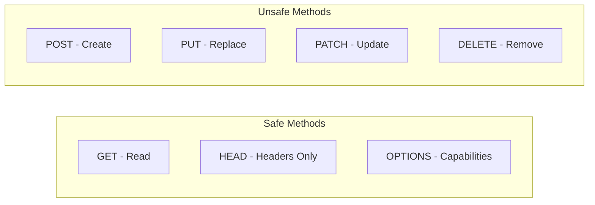
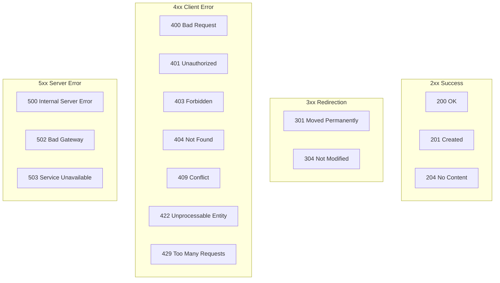
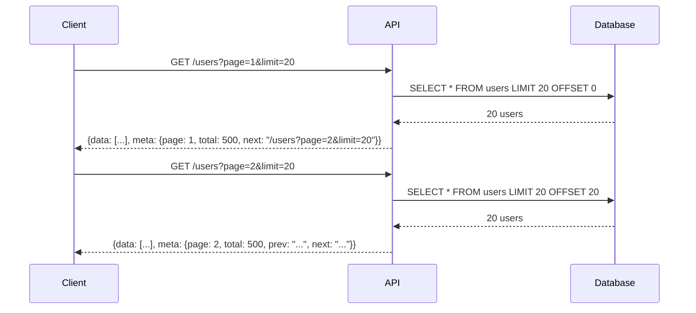

# How to Design RESTful APIs Following Best Practices

Author: [nawazdhandala](https://www.github.com/nawazdhandala)

Tags: REST API, API Design, Best Practices, Backend Development, Web Development

Description: A comprehensive guide to designing RESTful APIs with proper resource naming, HTTP methods, status codes, versioning, and error handling.

---

> A well-designed REST API makes the difference between developers loving your service and abandoning it in frustration. This guide covers the fundamental principles that will help you create APIs that are intuitive, maintainable, and scalable.

REST (Representational State Transfer) is an architectural style that has become the standard for web APIs. While many APIs claim to be RESTful, few actually follow the principles consistently. Let's fix that.

---

## REST API Architecture Overview

```mermaid
graph TB
    subgraph Client
        A[Mobile App]
        B[Web App]
        C[Third-Party Service]
    end

    subgraph API Gateway
        D[Authentication]
        E[Rate Limiting]
        F[Request Routing]
    end

    subgraph REST API
        G[/users]
        H[/products]
        I[/orders]
    end

    subgraph Backend
        J[(Database)]
        K[Cache]
        L[Message Queue]
    end

    A --> D
    B --> D
    C --> D
    D --> E
    E --> F
    F --> G
    F --> H
    F --> I
    G --> J
    H --> J
    I --> J
    G --> K
    H --> K
```

---

## Resource Naming Conventions

Resource naming is where most APIs go wrong. Follow these rules for clean, predictable URLs.

### Use Nouns, Not Verbs

Resources represent entities, not actions. The HTTP method defines the action.

| Wrong | Correct |
|-------|---------|
| `/getUsers` | `GET /users` |
| `/createUser` | `POST /users` |
| `/deleteUser/123` | `DELETE /users/123` |
| `/updateUserEmail` | `PATCH /users/123` |

### Use Plural Nouns

Keep it consistent by always using plural forms:

```
GET    /users           # List all users
GET    /users/123       # Get specific user
POST   /users           # Create a user
PUT    /users/123       # Replace a user
PATCH  /users/123       # Update a user
DELETE /users/123       # Delete a user
```

### Use Hyphens for Multi-Word Resources

```
GET /user-profiles      # Correct
GET /user_profiles      # Avoid underscores
GET /userProfiles       # Avoid camelCase
```

### Nest Related Resources

```mermaid
graph LR
    A[/users/123] --> B[/users/123/orders]
    B --> C[/users/123/orders/456]
    C --> D[/users/123/orders/456/items]
```

Example endpoints:

```
GET /users/123/orders           # All orders for user 123
GET /users/123/orders/456       # Specific order
GET /users/123/orders/456/items # Items in that order
```

---

## HTTP Methods and Their Usage



### Complete Method Reference

```python
# rest_api_example.py
from flask import Flask, request, jsonify
from datetime import datetime

app = Flask(__name__)

# In-memory storage for demonstration
users = {}
user_counter = 0

# GET - Retrieve a resource (or collection)
# Safe and idempotent: calling it multiple times has no side effects
@app.route('/users', methods=['GET'])
def get_users():
    """
    Retrieve all users with optional filtering and pagination.

    Query Parameters:
        - page: Page number (default: 1)
        - limit: Items per page (default: 20)
        - status: Filter by status (active, inactive)
    """
    page = request.args.get('page', 1, type=int)
    limit = request.args.get('limit', 20, type=int)
    status = request.args.get('status')

    # Filter users if status is provided
    filtered = users.values()
    if status:
        filtered = [u for u in filtered if u.get('status') == status]

    # Paginate results
    filtered = list(filtered)
    start = (page - 1) * limit
    end = start + limit

    return jsonify({
        'data': filtered[start:end],
        'pagination': {
            'page': page,
            'limit': limit,
            'total': len(filtered)
        }
    }), 200

@app.route('/users/<int:user_id>', methods=['GET'])
def get_user(user_id):
    """Retrieve a specific user by ID."""
    user = users.get(user_id)

    if not user:
        return jsonify({
            'error': {
                'code': 'USER_NOT_FOUND',
                'message': f'User with ID {user_id} does not exist'
            }
        }), 404

    return jsonify({'data': user}), 200


# POST - Create a new resource
# Not idempotent: calling it multiple times creates multiple resources
@app.route('/users', methods=['POST'])
def create_user():
    """
    Create a new user.

    Request Body:
        - name: string (required)
        - email: string (required)
        - role: string (optional, default: 'user')
    """
    global user_counter

    data = request.get_json()

    # Validate required fields
    if not data or 'name' not in data or 'email' not in data:
        return jsonify({
            'error': {
                'code': 'VALIDATION_ERROR',
                'message': 'Name and email are required',
                'details': {
                    'name': 'required' if 'name' not in data else None,
                    'email': 'required' if 'email' not in data else None
                }
            }
        }), 400

    # Create the user
    user_counter += 1
    user = {
        'id': user_counter,
        'name': data['name'],
        'email': data['email'],
        'role': data.get('role', 'user'),
        'status': 'active',
        'created_at': datetime.utcnow().isoformat(),
        'updated_at': datetime.utcnow().isoformat()
    }
    users[user_counter] = user

    # Return 201 Created with the new resource
    # Include Location header pointing to the new resource
    response = jsonify({'data': user})
    response.headers['Location'] = f'/users/{user_counter}'
    return response, 201


# PUT - Replace an entire resource
# Idempotent: calling it multiple times with same data produces same result
@app.route('/users/<int:user_id>', methods=['PUT'])
def replace_user(user_id):
    """
    Replace an entire user resource.
    Client must provide all fields.
    """
    if user_id not in users:
        return jsonify({
            'error': {
                'code': 'USER_NOT_FOUND',
                'message': f'User with ID {user_id} does not exist'
            }
        }), 404

    data = request.get_json()

    # Validate all required fields for complete replacement
    required = ['name', 'email', 'role', 'status']
    missing = [f for f in required if f not in data]

    if missing:
        return jsonify({
            'error': {
                'code': 'VALIDATION_ERROR',
                'message': 'PUT requires all fields',
                'details': {f: 'required' for f in missing}
            }
        }), 400

    # Replace the entire resource
    users[user_id] = {
        'id': user_id,
        'name': data['name'],
        'email': data['email'],
        'role': data['role'],
        'status': data['status'],
        'created_at': users[user_id]['created_at'],  # Preserve creation time
        'updated_at': datetime.utcnow().isoformat()
    }

    return jsonify({'data': users[user_id]}), 200


# PATCH - Partial update of a resource
# Idempotent: same partial update produces same result
@app.route('/users/<int:user_id>', methods=['PATCH'])
def update_user(user_id):
    """
    Partially update a user.
    Client only provides fields to update.
    """
    if user_id not in users:
        return jsonify({
            'error': {
                'code': 'USER_NOT_FOUND',
                'message': f'User with ID {user_id} does not exist'
            }
        }), 404

    data = request.get_json()

    # Only update provided fields
    allowed_fields = ['name', 'email', 'role', 'status']
    for field in allowed_fields:
        if field in data:
            users[user_id][field] = data[field]

    users[user_id]['updated_at'] = datetime.utcnow().isoformat()

    return jsonify({'data': users[user_id]}), 200


# DELETE - Remove a resource
# Idempotent: deleting same resource multiple times has same effect
@app.route('/users/<int:user_id>', methods=['DELETE'])
def delete_user(user_id):
    """Delete a user by ID."""
    if user_id not in users:
        # Return 404 if resource does not exist
        return jsonify({
            'error': {
                'code': 'USER_NOT_FOUND',
                'message': f'User with ID {user_id} does not exist'
            }
        }), 404

    del users[user_id]

    # Return 204 No Content on successful deletion
    return '', 204
```

---

## HTTP Status Codes

Using correct status codes helps clients understand what happened without parsing the response body.



### Status Code Reference Table

| Code | Name | When to Use |
|------|------|-------------|
| 200 | OK | Successful GET, PUT, PATCH |
| 201 | Created | Successful POST that creates a resource |
| 204 | No Content | Successful DELETE or action with no response body |
| 400 | Bad Request | Malformed request syntax |
| 401 | Unauthorized | Missing or invalid authentication |
| 403 | Forbidden | Valid auth but insufficient permissions |
| 404 | Not Found | Resource does not exist |
| 409 | Conflict | Resource state conflict (duplicate, etc.) |
| 422 | Unprocessable Entity | Valid syntax but semantic errors |
| 429 | Too Many Requests | Rate limit exceeded |
| 500 | Internal Server Error | Unexpected server error |
| 503 | Service Unavailable | Server temporarily unavailable |

---

## Error Handling

Consistent error responses make debugging easier for API consumers.

```python
# error_handling.py
from flask import Flask, jsonify
from functools import wraps

app = Flask(__name__)

class APIError(Exception):
    """Base class for API errors with consistent structure."""

    def __init__(self, code, message, status_code=400, details=None):
        self.code = code
        self.message = message
        self.status_code = status_code
        self.details = details or {}
        super().__init__(message)


class ValidationError(APIError):
    """Raised when request validation fails."""

    def __init__(self, message, details=None):
        super().__init__(
            code='VALIDATION_ERROR',
            message=message,
            status_code=400,
            details=details
        )


class NotFoundError(APIError):
    """Raised when a resource is not found."""

    def __init__(self, resource, identifier):
        super().__init__(
            code=f'{resource.upper()}_NOT_FOUND',
            message=f'{resource} with ID {identifier} does not exist',
            status_code=404
        )


class ConflictError(APIError):
    """Raised when there is a resource conflict."""

    def __init__(self, message, details=None):
        super().__init__(
            code='CONFLICT',
            message=message,
            status_code=409,
            details=details
        )


class RateLimitError(APIError):
    """Raised when rate limit is exceeded."""

    def __init__(self, retry_after=60):
        super().__init__(
            code='RATE_LIMIT_EXCEEDED',
            message='Too many requests. Please try again later.',
            status_code=429,
            details={'retry_after': retry_after}
        )


# Global error handler
@app.errorhandler(APIError)
def handle_api_error(error):
    """Convert APIError to JSON response with proper structure."""
    response = jsonify({
        'error': {
            'code': error.code,
            'message': error.message,
            'details': error.details
        }
    })
    response.status_code = error.status_code

    # Add Retry-After header for rate limit errors
    if isinstance(error, RateLimitError):
        response.headers['Retry-After'] = str(error.details['retry_after'])

    return response


# Catch unexpected errors
@app.errorhandler(Exception)
def handle_unexpected_error(error):
    """Handle unexpected errors without exposing internal details."""
    # Log the actual error for debugging
    app.logger.error(f'Unexpected error: {error}', exc_info=True)

    return jsonify({
        'error': {
            'code': 'INTERNAL_ERROR',
            'message': 'An unexpected error occurred. Please try again later.'
        }
    }), 500


# Example usage in routes
@app.route('/users/<int:user_id>')
def get_user(user_id):
    user = find_user_by_id(user_id)

    if not user:
        raise NotFoundError('User', user_id)

    return jsonify({'data': user})


@app.route('/users', methods=['POST'])
def create_user():
    data = request.get_json()

    errors = {}
    if not data.get('email'):
        errors['email'] = 'Email is required'
    elif not is_valid_email(data['email']):
        errors['email'] = 'Invalid email format'

    if not data.get('name'):
        errors['name'] = 'Name is required'

    if errors:
        raise ValidationError('Request validation failed', errors)

    # Check for duplicate email
    if email_exists(data['email']):
        raise ConflictError(
            'A user with this email already exists',
            {'email': data['email']}
        )

    # Create user...
```

### Error Response Format

Always use a consistent error structure:

```json
{
  "error": {
    "code": "VALIDATION_ERROR",
    "message": "Request validation failed",
    "details": {
      "email": "Invalid email format",
      "name": "Name must be at least 2 characters"
    }
  }
}
```

---

## API Versioning

Version your API to allow changes without breaking existing clients.

```mermaid
flowchart TD
    A[API Request] --> B{Versioning Strategy}

    B --> C[URL Path]
    B --> D[Query Parameter]
    B --> E[Custom Header]
    B --> F[Accept Header]

    C --> G[/v1/users]
    D --> H[/users?version=1]
    E --> I[X-API-Version: 1]
    F --> J[Accept: application/vnd.api+json;version=1]
```

### URL Path Versioning (Recommended)

The most straightforward and widely adopted approach:

```python
# versioning.py
from flask import Flask, Blueprint

app = Flask(__name__)

# Version 1 API
v1 = Blueprint('v1', __name__, url_prefix='/v1')

@v1.route('/users')
def get_users_v1():
    """Original user endpoint."""
    return jsonify({
        'users': [
            {'id': 1, 'name': 'John'}  # Simple structure
        ]
    })


# Version 2 API with breaking changes
v2 = Blueprint('v2', __name__, url_prefix='/v2')

@v2.route('/users')
def get_users_v2():
    """
    Enhanced user endpoint with:
    - Wrapped data structure
    - Additional fields
    - Pagination metadata
    """
    return jsonify({
        'data': [
            {
                'id': 1,
                'name': 'John',
                'profile': {           # New nested structure
                    'avatar': '...',
                    'bio': '...'
                }
            }
        ],
        'meta': {
            'total': 100,
            'page': 1
        }
    })


app.register_blueprint(v1)
app.register_blueprint(v2)
```

### Header-Based Versioning

More RESTful but requires custom header handling:

```python
# header_versioning.py
from flask import Flask, request, jsonify
from functools import wraps

app = Flask(__name__)

def versioned(versions):
    """Decorator to handle multiple API versions."""
    def decorator(f):
        @wraps(f)
        def wrapper(*args, **kwargs):
            # Get version from header, default to latest
            version = request.headers.get('X-API-Version', 'v2')

            if version not in versions:
                return jsonify({
                    'error': {
                        'code': 'INVALID_VERSION',
                        'message': f'API version {version} is not supported',
                        'details': {
                            'supported_versions': list(versions.keys())
                        }
                    }
                }), 400

            return versions[version](*args, **kwargs)
        return wrapper
    return decorator


def get_users_v1():
    return jsonify({'users': [{'id': 1, 'name': 'John'}]})

def get_users_v2():
    return jsonify({
        'data': [{'id': 1, 'name': 'John', 'email': 'john@example.com'}]
    })


@app.route('/users')
@versioned({'v1': get_users_v1, 'v2': get_users_v2})
def get_users():
    pass  # Handled by decorator
```

---

## Pagination

Always paginate collections to prevent overwhelming responses.



### Offset-Based Pagination

Simple but has performance issues with large datasets:

```python
# pagination.py
from flask import Flask, request, jsonify
from urllib.parse import urlencode

app = Flask(__name__)

@app.route('/users')
def get_users():
    # Get pagination parameters
    page = request.args.get('page', 1, type=int)
    limit = request.args.get('limit', 20, type=int)

    # Enforce limits
    limit = min(limit, 100)  # Maximum 100 items per page
    offset = (page - 1) * limit

    # Query database
    users = db.query(User).offset(offset).limit(limit).all()
    total = db.query(User).count()

    # Calculate pagination metadata
    total_pages = (total + limit - 1) // limit

    # Build response with links
    base_url = request.base_url
    links = {}

    if page > 1:
        links['first'] = f'{base_url}?{urlencode({"page": 1, "limit": limit})}'
        links['prev'] = f'{base_url}?{urlencode({"page": page - 1, "limit": limit})}'

    if page < total_pages:
        links['next'] = f'{base_url}?{urlencode({"page": page + 1, "limit": limit})}'
        links['last'] = f'{base_url}?{urlencode({"page": total_pages, "limit": limit})}'

    return jsonify({
        'data': [user.to_dict() for user in users],
        'meta': {
            'page': page,
            'limit': limit,
            'total': total,
            'total_pages': total_pages
        },
        'links': links
    })
```

### Cursor-Based Pagination

Better performance for large datasets:

```python
# cursor_pagination.py
import base64
import json
from flask import Flask, request, jsonify

app = Flask(__name__)

def encode_cursor(data):
    """Encode cursor data to base64 string."""
    return base64.b64encode(json.dumps(data).encode()).decode()

def decode_cursor(cursor):
    """Decode base64 cursor to data."""
    try:
        return json.loads(base64.b64decode(cursor.encode()).decode())
    except:
        return None


@app.route('/users')
def get_users():
    limit = request.args.get('limit', 20, type=int)
    limit = min(limit, 100)

    cursor = request.args.get('cursor')

    # Build query based on cursor
    query = db.query(User).order_by(User.created_at.desc(), User.id.desc())

    if cursor:
        cursor_data = decode_cursor(cursor)
        if cursor_data:
            # Filter to items after the cursor position
            query = query.filter(
                (User.created_at < cursor_data['created_at']) |
                (
                    (User.created_at == cursor_data['created_at']) &
                    (User.id < cursor_data['id'])
                )
            )

    # Fetch one extra to check if there are more results
    users = query.limit(limit + 1).all()

    has_more = len(users) > limit
    users = users[:limit]  # Return only requested amount

    # Build next cursor from last item
    next_cursor = None
    if has_more and users:
        last = users[-1]
        next_cursor = encode_cursor({
            'created_at': last.created_at.isoformat(),
            'id': last.id
        })

    return jsonify({
        'data': [user.to_dict() for user in users],
        'meta': {
            'has_more': has_more,
            'next_cursor': next_cursor
        }
    })
```

---

## Filtering, Sorting, and Field Selection

Give clients control over what data they receive.

```python
# filtering_sorting.py
from flask import Flask, request, jsonify
from sqlalchemy import desc, asc

app = Flask(__name__)

@app.route('/products')
def get_products():
    """
    GET /products?status=active&category=electronics&sort=-price,name&fields=id,name,price

    Query Parameters:
        - Filter by any field: ?status=active&category=electronics
        - Sort: ?sort=-price,name (prefix with - for descending)
        - Select fields: ?fields=id,name,price
    """
    query = db.query(Product)

    # Apply filters
    # Whitelist allowed filter fields for security
    allowed_filters = ['status', 'category', 'brand', 'in_stock']
    for field in allowed_filters:
        value = request.args.get(field)
        if value:
            # Handle comma-separated values as OR condition
            if ',' in value:
                values = value.split(',')
                query = query.filter(getattr(Product, field).in_(values))
            else:
                query = query.filter(getattr(Product, field) == value)

    # Apply sorting
    sort_param = request.args.get('sort', '-created_at')
    sort_fields = sort_param.split(',')

    for field in sort_fields:
        if field.startswith('-'):
            query = query.order_by(desc(getattr(Product, field[1:])))
        else:
            query = query.order_by(asc(getattr(Product, field)))

    # Execute query
    products = query.all()

    # Apply field selection
    fields_param = request.args.get('fields')
    if fields_param:
        allowed_fields = {'id', 'name', 'price', 'description', 'category', 'status'}
        requested_fields = set(fields_param.split(',')) & allowed_fields

        data = [
            {k: getattr(p, k) for k in requested_fields}
            for p in products
        ]
    else:
        data = [p.to_dict() for p in products]

    return jsonify({'data': data})


# Range filters for numeric and date fields
@app.route('/orders')
def get_orders():
    """
    GET /orders?total_min=100&total_max=500&created_after=2024-01-01

    Range filters:
        - {field}_min: Greater than or equal
        - {field}_max: Less than or equal
        - {field}_after: Date after
        - {field}_before: Date before
    """
    query = db.query(Order)

    # Numeric range filters
    if total_min := request.args.get('total_min', type=float):
        query = query.filter(Order.total >= total_min)

    if total_max := request.args.get('total_max', type=float):
        query = query.filter(Order.total <= total_max)

    # Date range filters
    if created_after := request.args.get('created_after'):
        query = query.filter(Order.created_at >= created_after)

    if created_before := request.args.get('created_before'):
        query = query.filter(Order.created_at <= created_before)

    return jsonify({'data': [o.to_dict() for o in query.all()]})
```

---

## Request/Response Format

### Request Headers

```
Content-Type: application/json
Accept: application/json
Authorization: Bearer <token>
X-Request-ID: uuid-for-tracing
```

### Response Headers

```python
# response_headers.py
from flask import Flask, jsonify, request, g
import uuid
from datetime import datetime

app = Flask(__name__)

@app.before_request
def before_request():
    """Add request ID for tracing."""
    g.request_id = request.headers.get('X-Request-ID', str(uuid.uuid4()))
    g.request_start = datetime.utcnow()


@app.after_request
def after_request(response):
    """Add standard response headers."""
    # Request tracing
    response.headers['X-Request-ID'] = g.request_id

    # Response time
    elapsed = (datetime.utcnow() - g.request_start).total_seconds()
    response.headers['X-Response-Time'] = f'{elapsed:.3f}s'

    # Content type
    if response.content_type == 'application/json':
        response.headers['Content-Type'] = 'application/json; charset=utf-8'

    # Security headers
    response.headers['X-Content-Type-Options'] = 'nosniff'
    response.headers['X-Frame-Options'] = 'DENY'

    # Caching headers for GET requests
    if request.method == 'GET':
        response.headers['Cache-Control'] = 'private, max-age=60'
    else:
        response.headers['Cache-Control'] = 'no-store'

    return response
```

### Standard Response Envelope

```python
# response_envelope.py
from flask import Flask, jsonify
from functools import wraps

def api_response(f):
    """Decorator to wrap responses in standard envelope."""
    @wraps(f)
    def wrapper(*args, **kwargs):
        result = f(*args, **kwargs)

        # If already a Response object, return as-is
        if isinstance(result, Response):
            return result

        # Handle tuple returns (data, status_code)
        if isinstance(result, tuple):
            data, status_code = result
        else:
            data = result
            status_code = 200

        # Wrap in standard envelope
        response = {
            'success': 200 <= status_code < 300,
            'data': data
        }

        return jsonify(response), status_code

    return wrapper


@app.route('/users/<int:user_id>')
@api_response
def get_user(user_id):
    user = find_user(user_id)
    if not user:
        return {'error': 'User not found'}, 404
    return user  # Will be wrapped in {'success': True, 'data': user}
```

---

## HATEOAS (Hypermedia Links)

Include links to related resources and actions:

```python
# hateoas.py
from flask import Flask, jsonify, url_for

app = Flask(__name__)

@app.route('/users/<int:user_id>')
def get_user(user_id):
    user = find_user(user_id)

    return jsonify({
        'data': {
            'id': user.id,
            'name': user.name,
            'email': user.email,
            'status': user.status
        },
        'links': {
            'self': url_for('get_user', user_id=user.id, _external=True),
            'orders': url_for('get_user_orders', user_id=user.id, _external=True),
            'profile': url_for('get_user_profile', user_id=user.id, _external=True)
        },
        'actions': {
            'update': {
                'href': url_for('update_user', user_id=user.id, _external=True),
                'method': 'PATCH'
            },
            'delete': {
                'href': url_for('delete_user', user_id=user.id, _external=True),
                'method': 'DELETE'
            },
            'deactivate': {
                'href': url_for('deactivate_user', user_id=user.id, _external=True),
                'method': 'POST'
            } if user.status == 'active' else None
        }
    })


@app.route('/orders')
def get_orders():
    orders = get_all_orders()

    return jsonify({
        'data': [
            {
                'id': order.id,
                'total': order.total,
                'status': order.status,
                'links': {
                    'self': url_for('get_order', order_id=order.id, _external=True),
                    'user': url_for('get_user', user_id=order.user_id, _external=True),
                    'items': url_for('get_order_items', order_id=order.id, _external=True)
                }
            }
            for order in orders
        ],
        'links': {
            'self': url_for('get_orders', _external=True),
            'create': url_for('create_order', _external=True)
        }
    })
```

---

## Complete API Example

Here is a complete example putting all the best practices together:

```python
# complete_api.py
from flask import Flask, request, jsonify, url_for, g
from functools import wraps
from datetime import datetime
import uuid

app = Flask(__name__)

# ============================================================
# Configuration and Setup
# ============================================================

class Config:
    DEFAULT_PAGE_SIZE = 20
    MAX_PAGE_SIZE = 100


# ============================================================
# Error Classes
# ============================================================

class APIError(Exception):
    def __init__(self, code, message, status_code=400, details=None):
        self.code = code
        self.message = message
        self.status_code = status_code
        self.details = details or {}


class NotFoundError(APIError):
    def __init__(self, resource, identifier):
        super().__init__(
            code=f'{resource.upper()}_NOT_FOUND',
            message=f'{resource} not found',
            status_code=404,
            details={'id': identifier}
        )


class ValidationError(APIError):
    def __init__(self, errors):
        super().__init__(
            code='VALIDATION_ERROR',
            message='Validation failed',
            status_code=400,
            details=errors
        )


# ============================================================
# Error Handlers
# ============================================================

@app.errorhandler(APIError)
def handle_api_error(error):
    return jsonify({
        'success': False,
        'error': {
            'code': error.code,
            'message': error.message,
            'details': error.details
        }
    }), error.status_code


@app.errorhandler(404)
def handle_not_found(error):
    return jsonify({
        'success': False,
        'error': {
            'code': 'ENDPOINT_NOT_FOUND',
            'message': 'The requested endpoint does not exist'
        }
    }), 404


@app.errorhandler(500)
def handle_server_error(error):
    app.logger.error(f'Server error: {error}')
    return jsonify({
        'success': False,
        'error': {
            'code': 'INTERNAL_ERROR',
            'message': 'An unexpected error occurred'
        }
    }), 500


# ============================================================
# Middleware
# ============================================================

@app.before_request
def before_request():
    g.request_id = request.headers.get('X-Request-ID', str(uuid.uuid4()))
    g.start_time = datetime.utcnow()


@app.after_request
def after_request(response):
    # Add standard headers
    response.headers['X-Request-ID'] = g.request_id

    elapsed = (datetime.utcnow() - g.start_time).total_seconds()
    response.headers['X-Response-Time'] = f'{elapsed:.3f}s'

    # Security headers
    response.headers['X-Content-Type-Options'] = 'nosniff'

    return response


# ============================================================
# In-Memory Data Store (replace with real database)
# ============================================================

users_db = {}
user_id_counter = 0


# ============================================================
# Validation Helpers
# ============================================================

def validate_user_data(data, required_fields=None):
    """Validate user input data."""
    errors = {}
    required = required_fields or ['name', 'email']

    for field in required:
        if field not in data or not data[field]:
            errors[field] = f'{field} is required'

    if 'email' in data and data['email']:
        if '@' not in data['email']:
            errors['email'] = 'Invalid email format'

    if errors:
        raise ValidationError(errors)

    return True


# ============================================================
# Pagination Helper
# ============================================================

def paginate(items, page, limit):
    """Apply pagination to a list of items."""
    total = len(items)
    start = (page - 1) * limit
    end = start + limit

    return {
        'items': items[start:end],
        'meta': {
            'page': page,
            'limit': limit,
            'total': total,
            'total_pages': (total + limit - 1) // limit if total > 0 else 0
        }
    }


# ============================================================
# API Routes
# ============================================================

# GET /api/v1/users - List all users
@app.route('/api/v1/users', methods=['GET'])
def list_users():
    # Parse query parameters
    page = request.args.get('page', 1, type=int)
    limit = min(
        request.args.get('limit', Config.DEFAULT_PAGE_SIZE, type=int),
        Config.MAX_PAGE_SIZE
    )
    status_filter = request.args.get('status')
    sort = request.args.get('sort', '-created_at')

    # Get and filter users
    users = list(users_db.values())

    if status_filter:
        users = [u for u in users if u['status'] == status_filter]

    # Sort users
    reverse = sort.startswith('-')
    sort_field = sort.lstrip('-')
    users.sort(key=lambda u: u.get(sort_field, ''), reverse=reverse)

    # Paginate
    result = paginate(users, page, limit)

    # Build response
    return jsonify({
        'success': True,
        'data': result['items'],
        'meta': result['meta'],
        'links': {
            'self': url_for('list_users', page=page, limit=limit, _external=True)
        }
    })


# GET /api/v1/users/:id - Get a specific user
@app.route('/api/v1/users/<int:user_id>', methods=['GET'])
def get_user(user_id):
    user = users_db.get(user_id)

    if not user:
        raise NotFoundError('User', user_id)

    return jsonify({
        'success': True,
        'data': user,
        'links': {
            'self': url_for('get_user', user_id=user_id, _external=True),
            'collection': url_for('list_users', _external=True)
        }
    })


# POST /api/v1/users - Create a new user
@app.route('/api/v1/users', methods=['POST'])
def create_user():
    global user_id_counter

    data = request.get_json() or {}

    # Validate input
    validate_user_data(data)

    # Create user
    user_id_counter += 1
    now = datetime.utcnow().isoformat()

    user = {
        'id': user_id_counter,
        'name': data['name'],
        'email': data['email'],
        'role': data.get('role', 'user'),
        'status': 'active',
        'created_at': now,
        'updated_at': now
    }

    users_db[user_id_counter] = user

    response = jsonify({
        'success': True,
        'data': user,
        'links': {
            'self': url_for('get_user', user_id=user_id_counter, _external=True)
        }
    })
    response.status_code = 201
    response.headers['Location'] = url_for('get_user', user_id=user_id_counter, _external=True)

    return response


# PATCH /api/v1/users/:id - Update a user
@app.route('/api/v1/users/<int:user_id>', methods=['PATCH'])
def update_user(user_id):
    user = users_db.get(user_id)

    if not user:
        raise NotFoundError('User', user_id)

    data = request.get_json() or {}

    # Update allowed fields
    allowed_fields = ['name', 'email', 'role', 'status']
    for field in allowed_fields:
        if field in data:
            user[field] = data[field]

    user['updated_at'] = datetime.utcnow().isoformat()

    return jsonify({
        'success': True,
        'data': user
    })


# DELETE /api/v1/users/:id - Delete a user
@app.route('/api/v1/users/<int:user_id>', methods=['DELETE'])
def delete_user(user_id):
    if user_id not in users_db:
        raise NotFoundError('User', user_id)

    del users_db[user_id]

    return '', 204


# ============================================================
# Run the application
# ============================================================

if __name__ == '__main__':
    app.run(debug=True, port=5000)
```

---

## Best Practices Checklist

Use this checklist when designing your API:

| Category | Practice | Done? |
|----------|----------|-------|
| **Naming** | Use plural nouns for collections | |
| **Naming** | Use hyphens for multi-word resources | |
| **Naming** | Nest related resources logically | |
| **Methods** | Use correct HTTP methods for actions | |
| **Methods** | Support OPTIONS for CORS preflight | |
| **Status Codes** | Return 201 for created resources | |
| **Status Codes** | Return 204 for successful deletes | |
| **Status Codes** | Use 4xx for client errors | |
| **Status Codes** | Use 5xx only for server errors | |
| **Errors** | Use consistent error format | |
| **Errors** | Include error codes for programmatic handling | |
| **Errors** | Provide helpful error messages | |
| **Versioning** | Version your API from day one | |
| **Pagination** | Always paginate collections | |
| **Pagination** | Include total count and links | |
| **Filtering** | Support filtering on relevant fields | |
| **Sorting** | Support multi-field sorting | |
| **Headers** | Include rate limit headers | |
| **Headers** | Include request ID for tracing | |
| **Security** | Validate and sanitize all input | |
| **Security** | Use HTTPS only | |

---

## Conclusion

Designing a good REST API requires attention to detail and consistency. The key principles to remember:

- Use nouns for resources, verbs come from HTTP methods
- Be consistent with naming conventions and response formats
- Return appropriate status codes and informative error messages
- Version your API to allow changes without breaking clients
- Paginate, filter, and sort collections to give clients control
- Include hypermedia links to make your API discoverable

By following these practices, you will create APIs that developers enjoy using and that scale well as your service grows.

---

*Need to monitor your REST API in production? [OneUptime](https://oneuptime.com) provides comprehensive API monitoring with uptime tracking, latency metrics, and instant alerting when issues occur.*

**Related Reading:**
- [How to Implement Rate Limiting in FastAPI Without External Services](https://oneuptime.com/blog/post/2025-01-06-fastapi-rate-limiting/view)
- [How to Build Production-Ready REST APIs with Flask](https://oneuptime.com/blog/post/2026-02-12-set-up-python-rest-api-on-aws-with-flask-and-lambda/view)
