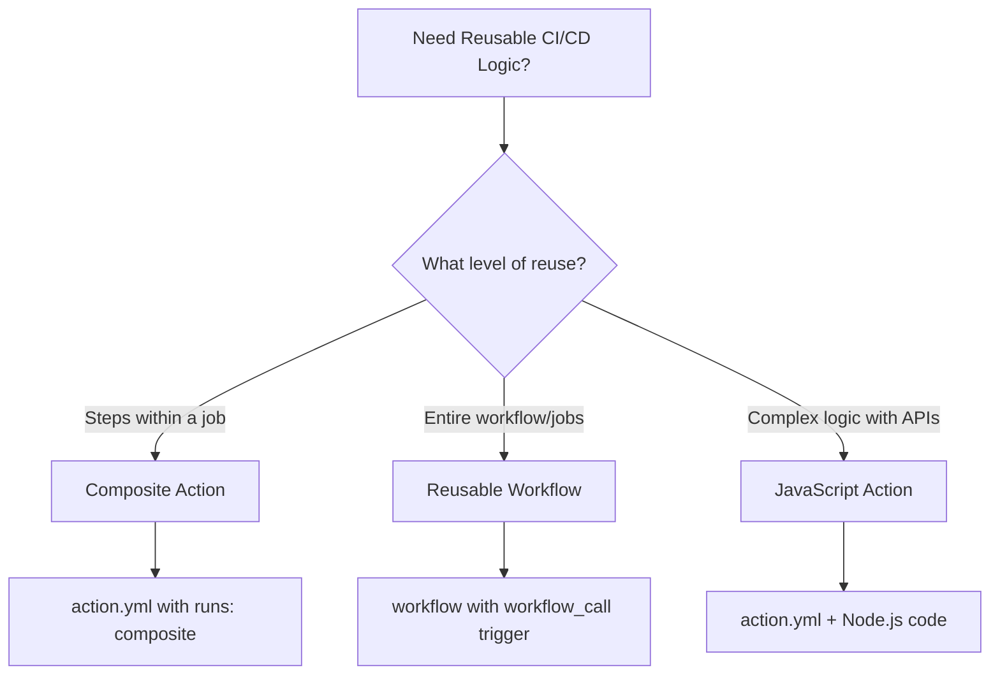
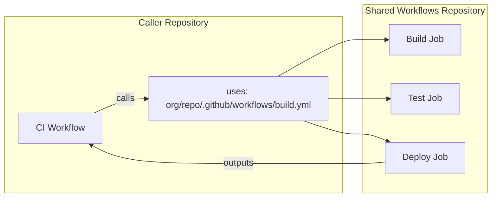
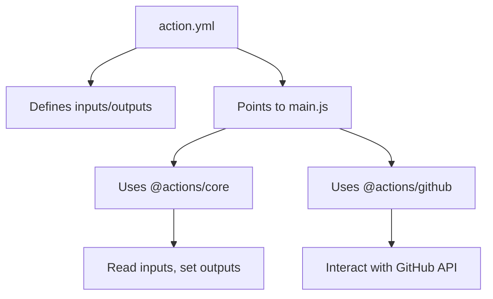
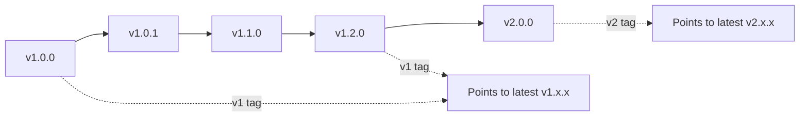

# How to Build Reusable GitHub Actions

Author: [nawazdhandala](https://www.github.com/nawazdhandala)

Tags: GitHub Actions, CI/CD, Automation, Reusable Workflows, DevOps

Description: Learn how to build reusable GitHub Actions with composite actions, reusable workflows, and custom JavaScript actions for DRY CI/CD pipelines.

---

Duplicating CI/CD logic across repositories leads to maintenance headaches. When a security vulnerability requires updating your build process, you find yourself editing dozens of workflow files. GitHub Actions provides three powerful mechanisms for creating reusable automation: composite actions, reusable workflows, and custom JavaScript actions. This guide covers when to use each approach and how to build them effectively.

## The Three Approaches

Before diving into implementation, understand when to use each reusability mechanism:



| Approach | Best For | Complexity | Flexibility |
|----------|----------|------------|-------------|
| Composite Action | Bundling steps together | Low | Medium |
| Reusable Workflow | Standardizing entire pipelines | Medium | Low |
| JavaScript Action | Custom logic, API calls, complex processing | High | High |

## Building Composite Actions

Composite actions bundle multiple steps into a single action. They live in a repository and are referenced like any other action.

### Basic Composite Action Structure

Create a directory with an `action.yml` file:

```yaml
# .github/actions/setup-node-project/action.yml
name: 'Setup Node.js Project'
description: 'Install Node.js, cache dependencies, and run npm install'

# Define inputs that callers can provide
inputs:
  node-version:
    description: 'Node.js version to install'
    required: false
    default: '20'
  working-directory:
    description: 'Directory containing package.json'
    required: false
    default: '.'

# Define outputs to pass data back to the caller
outputs:
  cache-hit:
    description: 'Whether npm cache was hit'
    value: ${{ steps.npm-cache.outputs.cache-hit }}

# The composite run steps
runs:
  using: 'composite'
  steps:
    # Step 1: Setup Node.js
    - name: Setup Node.js ${{ inputs.node-version }}
      uses: actions/setup-node@v4
      with:
        node-version: ${{ inputs.node-version }}

    # Step 2: Cache npm dependencies
    - name: Cache npm dependencies
      id: npm-cache
      uses: actions/cache@v4
      with:
        path: ~/.npm
        key: ${{ runner.os }}-npm-${{ hashFiles('**/package-lock.json') }}
        restore-keys: |
          ${{ runner.os }}-npm-

    # Step 3: Install dependencies
    - name: Install dependencies
      shell: bash
      working-directory: ${{ inputs.working-directory }}
      run: npm ci
```

### Using the Composite Action

Reference composite actions from the same repository or external repositories:

```yaml
# .github/workflows/ci.yml
name: CI

on:
  push:
    branches: [main]
  pull_request:

jobs:
  build:
    runs-on: ubuntu-latest
    steps:
      - uses: actions/checkout@v4

      # Use composite action from same repository
      - name: Setup project
        uses: ./.github/actions/setup-node-project
        with:
          node-version: '20'

      - name: Run tests
        run: npm test
```

### Composite Action with Shell Scripts

For more complex logic, composite actions can run shell scripts:

```yaml
# .github/actions/docker-build-push/action.yml
name: 'Docker Build and Push'
description: 'Build Docker image and push to registry'

inputs:
  image-name:
    description: 'Docker image name'
    required: true
  registry:
    description: 'Container registry'
    required: false
    default: 'ghcr.io'
  dockerfile:
    description: 'Path to Dockerfile'
    required: false
    default: 'Dockerfile'
  build-args:
    description: 'Build arguments (one per line)'
    required: false
    default: ''

outputs:
  image-tag:
    description: 'Full image tag that was pushed'
    value: ${{ steps.meta.outputs.tags }}
  digest:
    description: 'Image digest'
    value: ${{ steps.build.outputs.digest }}

runs:
  using: 'composite'
  steps:
    # Generate image metadata (tags, labels)
    - name: Docker meta
      id: meta
      uses: docker/metadata-action@v5
      with:
        images: ${{ inputs.registry }}/${{ inputs.image-name }}
        tags: |
          type=sha,prefix=
          type=ref,event=branch
          type=ref,event=tag

    # Build and push the image
    - name: Build and push
      id: build
      uses: docker/build-push-action@v5
      with:
        context: .
        file: ${{ inputs.dockerfile }}
        push: true
        tags: ${{ steps.meta.outputs.tags }}
        labels: ${{ steps.meta.outputs.labels }}
        build-args: ${{ inputs.build-args }}
        cache-from: type=gha
        cache-to: type=gha,mode=max
```

### Passing Data Between Steps

Use outputs to pass data between composite action steps:

```yaml
# .github/actions/version-bump/action.yml
name: 'Version Bump'
description: 'Determine and apply version bump based on commit messages'

outputs:
  new-version:
    description: 'The new version number'
    value: ${{ steps.bump.outputs.version }}
  changelog:
    description: 'Generated changelog entries'
    value: ${{ steps.changelog.outputs.content }}

runs:
  using: 'composite'
  steps:
    # Analyze commits to determine bump type
    - name: Analyze commits
      id: analyze
      shell: bash
      run: |
        # Check commit messages for conventional commit prefixes
        if git log --oneline origin/main..HEAD | grep -qE '^[a-f0-9]+ (BREAKING|!)'; then
          echo "bump=major" >> $GITHUB_OUTPUT
        elif git log --oneline origin/main..HEAD | grep -qE '^[a-f0-9]+ feat'; then
          echo "bump=minor" >> $GITHUB_OUTPUT
        else
          echo "bump=patch" >> $GITHUB_OUTPUT
        fi

    # Calculate new version
    - name: Calculate version
      id: bump
      shell: bash
      run: |
        # Get current version from package.json
        CURRENT=$(node -p "require('./package.json').version")

        # Parse semver components
        IFS='.' read -r MAJOR MINOR PATCH <<< "$CURRENT"

        # Apply bump
        case "${{ steps.analyze.outputs.bump }}" in
          major) MAJOR=$((MAJOR + 1)); MINOR=0; PATCH=0 ;;
          minor) MINOR=$((MINOR + 1)); PATCH=0 ;;
          patch) PATCH=$((PATCH + 1)) ;;
        esac

        VERSION="$MAJOR.$MINOR.$PATCH"
        echo "version=$VERSION" >> $GITHUB_OUTPUT

    # Generate changelog
    - name: Generate changelog
      id: changelog
      shell: bash
      run: |
        CHANGELOG=$(git log --oneline origin/main..HEAD | head -20)
        # Use EOF delimiter for multiline output
        {
          echo 'content<<EOF'
          echo "$CHANGELOG"
          echo 'EOF'
        } >> $GITHUB_OUTPUT
```

## Building Reusable Workflows

Reusable workflows let you define entire jobs that other workflows can call. They provide more structure than composite actions.



### Creating a Reusable Workflow

Define workflows with the `workflow_call` trigger:

```yaml
# .github/workflows/nodejs-ci.yml
name: Node.js CI Pipeline

on:
  workflow_call:
    inputs:
      node-version:
        description: 'Node.js version'
        type: string
        default: '20'
      run-e2e:
        description: 'Run end-to-end tests'
        type: boolean
        default: false
      environment:
        description: 'Deployment environment'
        type: string
        required: false

    outputs:
      test-results:
        description: 'Test results summary'
        value: ${{ jobs.test.outputs.summary }}
      coverage:
        description: 'Code coverage percentage'
        value: ${{ jobs.test.outputs.coverage }}

    secrets:
      NPM_TOKEN:
        description: 'NPM authentication token'
        required: false
      CODECOV_TOKEN:
        description: 'Codecov upload token'
        required: false

jobs:
  lint:
    runs-on: ubuntu-latest
    steps:
      - uses: actions/checkout@v4

      - name: Setup Node.js
        uses: actions/setup-node@v4
        with:
          node-version: ${{ inputs.node-version }}
          cache: 'npm'

      - run: npm ci
      - run: npm run lint

  test:
    runs-on: ubuntu-latest
    needs: lint

    outputs:
      summary: ${{ steps.results.outputs.summary }}
      coverage: ${{ steps.coverage.outputs.percent }}

    steps:
      - uses: actions/checkout@v4

      - name: Setup Node.js
        uses: actions/setup-node@v4
        with:
          node-version: ${{ inputs.node-version }}
          cache: 'npm'

      - run: npm ci

      - name: Run tests with coverage
        run: npm test -- --coverage --coverageReporters=text-summary

      - name: Extract coverage
        id: coverage
        run: |
          # Parse coverage from Jest output
          COVERAGE=$(cat coverage/coverage-summary.json | jq '.total.lines.pct')
          echo "percent=$COVERAGE" >> $GITHUB_OUTPUT

      - name: Test results summary
        id: results
        run: |
          echo "summary=All tests passed" >> $GITHUB_OUTPUT

  e2e:
    if: inputs.run-e2e
    runs-on: ubuntu-latest
    needs: test

    steps:
      - uses: actions/checkout@v4

      - name: Setup Node.js
        uses: actions/setup-node@v4
        with:
          node-version: ${{ inputs.node-version }}
          cache: 'npm'

      - run: npm ci
      - run: npx playwright install --with-deps
      - run: npm run test:e2e
```

### Calling Reusable Workflows

```yaml
# .github/workflows/ci.yml
name: CI

on:
  push:
    branches: [main]
  pull_request:

jobs:
  # Call reusable workflow from external repository
  ci:
    uses: your-org/shared-workflows/.github/workflows/nodejs-ci.yml@v1
    with:
      node-version: '20'
      run-e2e: ${{ github.event_name == 'push' }}
    secrets:
      NPM_TOKEN: ${{ secrets.NPM_TOKEN }}
      CODECOV_TOKEN: ${{ secrets.CODECOV_TOKEN }}

  # Use outputs from the reusable workflow
  notify:
    needs: ci
    runs-on: ubuntu-latest
    if: always()
    steps:
      - name: Report results
        run: |
          echo "Test Results: ${{ needs.ci.outputs.test-results }}"
          echo "Coverage: ${{ needs.ci.outputs.coverage }}%"
```

## Building Custom JavaScript Actions

For complex logic that requires API calls, data processing, or conditional behavior, build a JavaScript action:



### JavaScript Action Structure

```
my-action/
  action.yml      # Action metadata
  src/
    main.js       # Entry point
    utils.js      # Helper functions
  dist/
    index.js      # Bundled output (ncc compiled)
  package.json
```

### Action Metadata

```yaml
# action.yml
name: 'PR Size Labeler'
description: 'Automatically label PRs based on size'
author: 'Your Name'

inputs:
  github-token:
    description: 'GitHub token for API access'
    required: true
    default: ${{ github.token }}
  size-thresholds:
    description: 'JSON object with size thresholds'
    required: false
    default: '{"xs": 10, "s": 50, "m": 200, "l": 500}'

outputs:
  label:
    description: 'The label that was applied'
  lines-changed:
    description: 'Total lines changed in the PR'

runs:
  using: 'node20'
  main: 'dist/index.js'
```

### JavaScript Implementation

```javascript
// src/main.js
const core = require('@actions/core');
const github = require('@actions/github');

async function run() {
  try {
    // Read inputs from action.yml
    const token = core.getInput('github-token', { required: true });
    const thresholdsJson = core.getInput('size-thresholds');
    const thresholds = JSON.parse(thresholdsJson);

    // Initialize GitHub client
    const octokit = github.getOctokit(token);
    const context = github.context;

    // Ensure we are running on a pull request
    if (!context.payload.pull_request) {
      core.setFailed('This action only works on pull requests');
      return;
    }

    const prNumber = context.payload.pull_request.number;
    const owner = context.repo.owner;
    const repo = context.repo.repo;

    // Fetch PR details to get changed lines
    const { data: pr } = await octokit.rest.pulls.get({
      owner,
      repo,
      pull_number: prNumber,
    });

    const linesChanged = pr.additions + pr.deletions;
    core.info(`PR #${prNumber} has ${linesChanged} lines changed`);

    // Determine size label based on thresholds
    let sizeLabel;
    if (linesChanged <= thresholds.xs) {
      sizeLabel = 'size/xs';
    } else if (linesChanged <= thresholds.s) {
      sizeLabel = 'size/s';
    } else if (linesChanged <= thresholds.m) {
      sizeLabel = 'size/m';
    } else if (linesChanged <= thresholds.l) {
      sizeLabel = 'size/l';
    } else {
      sizeLabel = 'size/xl';
    }

    // Remove existing size labels
    const existingLabels = pr.labels.map(l => l.name);
    const sizeLabels = existingLabels.filter(l => l.startsWith('size/'));

    for (const label of sizeLabels) {
      if (label !== sizeLabel) {
        await octokit.rest.issues.removeLabel({
          owner,
          repo,
          issue_number: prNumber,
          name: label,
        });
        core.info(`Removed label: ${label}`);
      }
    }

    // Add the new size label
    if (!existingLabels.includes(sizeLabel)) {
      await octokit.rest.issues.addLabels({
        owner,
        repo,
        issue_number: prNumber,
        labels: [sizeLabel],
      });
      core.info(`Added label: ${sizeLabel}`);
    }

    // Set outputs for downstream steps
    core.setOutput('label', sizeLabel);
    core.setOutput('lines-changed', linesChanged.toString());

  } catch (error) {
    core.setFailed(`Action failed: ${error.message}`);
  }
}

run();
```

### Package Configuration

```json
{
  "name": "pr-size-labeler",
  "version": "1.0.0",
  "description": "GitHub Action to label PRs by size",
  "main": "dist/index.js",
  "scripts": {
    "build": "ncc build src/main.js -o dist",
    "test": "jest"
  },
  "dependencies": {
    "@actions/core": "^1.10.1",
    "@actions/github": "^6.0.0"
  },
  "devDependencies": {
    "@vercel/ncc": "^0.38.1",
    "jest": "^29.7.0"
  }
}
```

### Building and Testing

```bash
# Install dependencies
npm install

# Build the action (bundles everything into dist/index.js)
npm run build

# The dist folder should be committed to the repository
git add dist/
git commit -m "Build action"
```

### Using the JavaScript Action

```yaml
# .github/workflows/pr-labeler.yml
name: PR Labeler

on:
  pull_request:
    types: [opened, synchronize]

jobs:
  label:
    runs-on: ubuntu-latest
    permissions:
      pull-requests: write

    steps:
      - uses: actions/checkout@v4

      # Use the JavaScript action
      - name: Label PR by size
        id: labeler
        uses: your-org/pr-size-labeler@v1
        with:
          github-token: ${{ secrets.GITHUB_TOKEN }}
          size-thresholds: '{"xs": 10, "s": 100, "m": 500, "l": 1000}'

      - name: Report
        run: |
          echo "Applied label: ${{ steps.labeler.outputs.label }}"
          echo "Lines changed: ${{ steps.labeler.outputs.lines-changed }}"
```

## Publishing Actions to the Marketplace

Make your actions discoverable by publishing to the GitHub Marketplace:

### Requirements

1. Action must be in a public repository
2. Repository must have only one action (or use subdirectories)
3. `action.yml` must include `name`, `description`, and `author`
4. Add branding for the Marketplace listing

```yaml
# action.yml with branding
name: 'PR Size Labeler'
description: 'Automatically label pull requests based on their size'
author: 'Your Organization'

branding:
  icon: 'tag'
  color: 'blue'

inputs:
  # ... inputs
```

### Creating a Release

```bash
# Tag the release
git tag -a v1.0.0 -m "Initial release"
git push origin v1.0.0

# Also create/update a major version tag for easier referencing
git tag -fa v1 -m "Update v1 tag"
git push origin v1 --force
```

## Best Practices

### Versioning Strategy



Users reference your action by version:

```yaml
# Exact version (most stable)
- uses: your-org/action@v1.2.3

# Major version (recommended, gets compatible updates)
- uses: your-org/action@v1

# Branch (least stable, for testing)
- uses: your-org/action@main
```

### Input Validation

Always validate inputs in your actions:

```javascript
// Validate required inputs
const token = core.getInput('github-token', { required: true });
if (!token) {
  core.setFailed('github-token is required');
  return;
}

// Validate JSON inputs
let config;
try {
  config = JSON.parse(core.getInput('config'));
} catch (e) {
  core.setFailed('config must be valid JSON');
  return;
}

// Validate numeric inputs
const timeout = parseInt(core.getInput('timeout'), 10);
if (isNaN(timeout) || timeout < 0) {
  core.setFailed('timeout must be a positive number');
  return;
}
```

### Error Handling

```javascript
async function run() {
  try {
    // Main logic
    await doWork();
  } catch (error) {
    // Log the full error for debugging
    core.error(error.stack);

    // Set a user-friendly failure message
    core.setFailed(`Action failed: ${error.message}`);
  }
}
```

### Documentation

Include a comprehensive README with:

- What the action does
- All inputs with descriptions and defaults
- All outputs with descriptions
- Usage examples for common scenarios
- Troubleshooting section

```markdown
## Inputs

| Input | Description | Required | Default |
|-------|-------------|----------|---------|
| `github-token` | GitHub token for API access | Yes | `${{ github.token }}` |
| `size-thresholds` | JSON object defining size buckets | No | `{"xs": 10, "s": 50}` |

## Outputs

| Output | Description |
|--------|-------------|
| `label` | The size label that was applied |

## Example Usage

...
```

---

Building reusable GitHub Actions keeps your CI/CD pipelines maintainable as your organization grows. Start with composite actions for simple step bundling, graduate to reusable workflows for standardizing entire pipelines, and build JavaScript actions when you need custom logic or API integrations. Version your actions properly and document them thoroughly so your team can adopt them with confidence.
