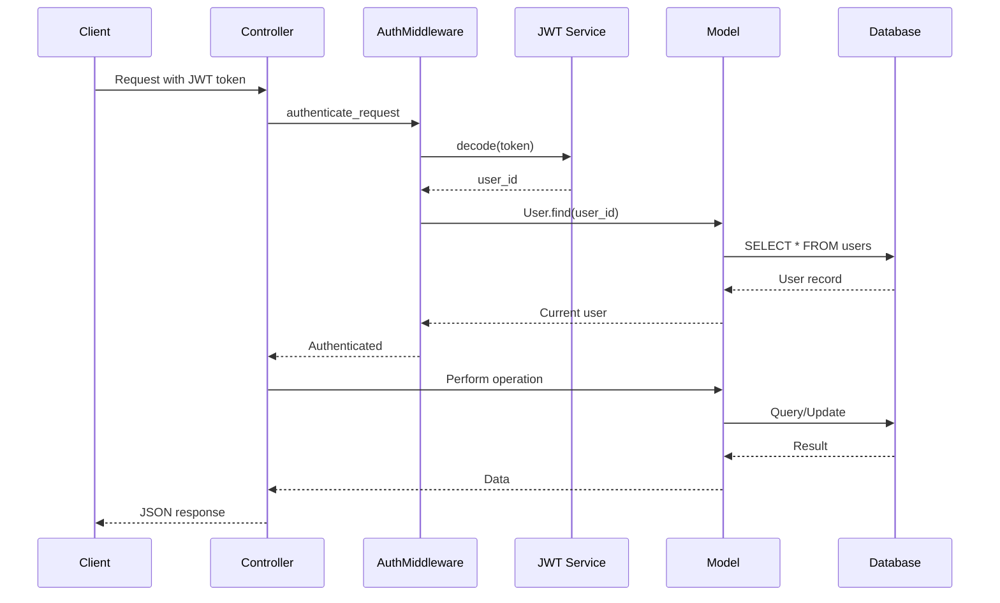

# How to Build a REST API with Ruby on Rails

Author: [nawazdhandala](https://www.github.com/nawazdhandala)

Tags: Ruby, Rails, REST API, Backend Development, Web Development, API Design

Description: Learn how to build a production-ready REST API with Ruby on Rails from scratch. This guide covers project setup, model creation, controllers, authentication, serialization, error handling, and testing.

---

> Ruby on Rails has been powering web applications for nearly two decades. Its convention-over-configuration philosophy makes it one of the fastest frameworks for building REST APIs. This guide walks you through building a complete API from the ground up.

Rails remains a top choice for startups and established companies alike. Companies like GitHub, Shopify, and Airbnb have built their backends with Rails. The framework's maturity, extensive ecosystem, and developer productivity make it ideal for API development.

---

## What We Will Build

We will build a task management API with the following features:

- User authentication with JWT tokens
- CRUD operations for tasks
- Task assignment and status tracking
- Proper error handling and validation
- API versioning
- Comprehensive tests

---

## Project Setup

First, make sure you have Ruby and Rails installed. This guide uses Rails 7.1 with Ruby 3.2.

```bash
# Check your Ruby version
ruby -v
# Should output something like: ruby 3.2.0

# Install Rails if you haven't already
gem install rails

# Create a new API-only Rails application
rails new task_api --api --database=postgresql

# Navigate to the project directory
cd task_api
```

The `--api` flag creates a lightweight Rails application optimized for API development. It excludes middleware for browser features like cookies and sessions that you won't need.

---

## Database Configuration

Update your `config/database.yml` with your PostgreSQL credentials:

```yaml
# config/database.yml
default: &default
  adapter: postgresql
  encoding: unicode
  pool: <%= ENV.fetch("RAILS_MAX_THREADS") { 5 } %>
  username: <%= ENV.fetch("DATABASE_USERNAME", "postgres") %>
  password: <%= ENV.fetch("DATABASE_PASSWORD", "") %>
  host: <%= ENV.fetch("DATABASE_HOST", "localhost") %>

development:
  <<: *default
  database: task_api_development

test:
  <<: *default
  database: task_api_test

production:
  <<: *default
  database: task_api_production
  url: <%= ENV["DATABASE_URL"] %>
```

Create the database:

```bash
rails db:create
```

---

## Creating Models

Let's create our User and Task models with proper associations.

```bash
# Generate User model
rails generate model User email:string:uniq password_digest:string name:string

# Generate Task model
rails generate model Task title:string description:text status:integer priority:integer due_date:datetime user:references
```

Update the migration files to add constraints:

```ruby
# db/migrate/XXXXXX_create_users.rb
class CreateUsers < ActiveRecord::Migration[7.1]
  def change
    create_table :users do |t|
      t.string :email, null: false
      t.string :password_digest, null: false
      t.string :name, null: false

      t.timestamps
    end

    add_index :users, :email, unique: true
  end
end
```

```ruby
# db/migrate/XXXXXX_create_tasks.rb
class CreateTasks < ActiveRecord::Migration[7.1]
  def change
    create_table :tasks do |t|
      t.string :title, null: false
      t.text :description
      t.integer :status, default: 0, null: false
      t.integer :priority, default: 1, null: false
      t.datetime :due_date
      t.references :user, null: false, foreign_key: true

      t.timestamps
    end

    add_index :tasks, :status
    add_index :tasks, :priority
    add_index :tasks, [:user_id, :status]
  end
end
```

Run the migrations:

```bash
rails db:migrate
```

---

## Model Configuration

Now let's set up our models with validations and associations.

```ruby
# app/models/user.rb
class User < ApplicationRecord
  # Enable secure password hashing
  has_secure_password

  # Associations
  has_many :tasks, dependent: :destroy

  # Validations
  validates :email, presence: true,
                    uniqueness: { case_sensitive: false },
                    format: { with: URI::MailTo::EMAIL_REGEXP }
  validates :name, presence: true, length: { minimum: 2, maximum: 100 }
  validates :password, length: { minimum: 8 }, if: -> { new_record? || !password.nil? }

  # Callbacks
  before_save :downcase_email

  private

  def downcase_email
    self.email = email.downcase
  end
end
```

```ruby
# app/models/task.rb
class Task < ApplicationRecord
  # Associations
  belongs_to :user

  # Enums for status and priority
  enum status: {
    pending: 0,
    in_progress: 1,
    completed: 2,
    cancelled: 3
  }

  enum priority: {
    low: 0,
    medium: 1,
    high: 2,
    urgent: 3
  }

  # Validations
  validates :title, presence: true, length: { minimum: 3, maximum: 200 }
  validates :description, length: { maximum: 5000 }
  validates :status, presence: true
  validates :priority, presence: true

  # Scopes for common queries
  scope :active, -> { where.not(status: [:completed, :cancelled]) }
  scope :overdue, -> { active.where("due_date < ?", Time.current) }
  scope :due_soon, -> { active.where(due_date: Time.current..3.days.from_now) }
  scope :by_priority, -> { order(priority: :desc) }
end
```

Add `bcrypt` to your Gemfile for password hashing:

```ruby
# Gemfile
gem 'bcrypt', '~> 3.1.7'
```

Run `bundle install` to install the gem.

---

## JWT Authentication

We'll use JSON Web Tokens for stateless authentication. Add the jwt gem:

```ruby
# Gemfile
gem 'jwt'
```

Create a service class for JWT handling:

```ruby
# app/services/json_web_token.rb
class JsonWebToken
  # Use Rails secret key for signing tokens
  SECRET_KEY = Rails.application.credentials.secret_key_base.to_s

  class << self
    # Encode payload with expiration time
    def encode(payload, exp = 24.hours.from_now)
      payload[:exp] = exp.to_i
      JWT.encode(payload, SECRET_KEY, 'HS256')
    end

    # Decode and verify token
    def decode(token)
      decoded = JWT.decode(token, SECRET_KEY, true, algorithm: 'HS256')
      HashWithIndifferentAccess.new(decoded.first)
    rescue JWT::ExpiredSignature
      raise ExceptionHandler::ExpiredToken, 'Token has expired'
    rescue JWT::DecodeError
      raise ExceptionHandler::InvalidToken, 'Invalid token'
    end
  end
end
```

Create a concern for handling exceptions:

```ruby
# app/controllers/concerns/exception_handler.rb
module ExceptionHandler
  extend ActiveSupport::Concern

  # Custom exception classes
  class AuthenticationError < StandardError; end
  class ExpiredToken < StandardError; end
  class InvalidToken < StandardError; end

  included do
    # Handle all exceptions with appropriate responses
    rescue_from ActiveRecord::RecordNotFound, with: :not_found
    rescue_from ActiveRecord::RecordInvalid, with: :unprocessable_entity
    rescue_from ExceptionHandler::AuthenticationError, with: :unauthorized
    rescue_from ExceptionHandler::ExpiredToken, with: :unauthorized
    rescue_from ExceptionHandler::InvalidToken, with: :unauthorized
  end

  private

  def not_found(exception)
    render json: { error: exception.message }, status: :not_found
  end

  def unprocessable_entity(exception)
    render json: { error: exception.record.errors.full_messages }, status: :unprocessable_entity
  end

  def unauthorized(exception)
    render json: { error: exception.message }, status: :unauthorized
  end
end
```

---

## Authentication Controller

Create controllers for user registration and login:

```ruby
# app/controllers/application_controller.rb
class ApplicationController < ActionController::API
  include ExceptionHandler

  # Make current_user available to all controllers
  attr_reader :current_user

  private

  # Authenticate user from Authorization header
  def authenticate_request
    @current_user = authorize_request
  end

  def authorize_request
    header = request.headers['Authorization']
    raise ExceptionHandler::AuthenticationError, 'Missing token' unless header

    token = header.split(' ').last
    decoded = JsonWebToken.decode(token)
    User.find(decoded[:user_id])
  end
end
```

```ruby
# app/controllers/api/v1/authentication_controller.rb
module Api
  module V1
    class AuthenticationController < ApplicationController
      # POST /api/v1/auth/register
      def register
        user = User.create!(user_params)
        token = JsonWebToken.encode(user_id: user.id)

        render json: {
          message: 'Account created successfully',
          user: UserSerializer.new(user).as_json,
          token: token
        }, status: :created
      end

      # POST /api/v1/auth/login
      def login
        user = User.find_by!(email: params[:email].downcase)

        if user.authenticate(params[:password])
          token = JsonWebToken.encode(user_id: user.id)
          render json: {
            message: 'Login successful',
            user: UserSerializer.new(user).as_json,
            token: token
          }
        else
          raise ExceptionHandler::AuthenticationError, 'Invalid credentials'
        end
      rescue ActiveRecord::RecordNotFound
        raise ExceptionHandler::AuthenticationError, 'Invalid credentials'
      end

      private

      def user_params
        params.permit(:email, :password, :password_confirmation, :name)
      end
    end
  end
end
```

---

## Serializers

Create serializers to control JSON output:

```ruby
# app/serializers/user_serializer.rb
class UserSerializer
  def initialize(user)
    @user = user
  end

  def as_json
    {
      id: @user.id,
      email: @user.email,
      name: @user.name,
      created_at: @user.created_at.iso8601
    }
  end
end
```

```ruby
# app/serializers/task_serializer.rb
class TaskSerializer
  def initialize(task)
    @task = task
  end

  def as_json
    {
      id: @task.id,
      title: @task.title,
      description: @task.description,
      status: @task.status,
      priority: @task.priority,
      due_date: @task.due_date&.iso8601,
      user_id: @task.user_id,
      created_at: @task.created_at.iso8601,
      updated_at: @task.updated_at.iso8601,
      overdue: overdue?,
      days_until_due: days_until_due
    }
  end

  private

  def overdue?
    return false unless @task.due_date
    return false if @task.completed? || @task.cancelled?

    @task.due_date < Time.current
  end

  def days_until_due
    return nil unless @task.due_date

    (@task.due_date.to_date - Date.current).to_i
  end
end
```

---

## Tasks Controller

Create the main tasks controller with full CRUD operations:

```ruby
# app/controllers/api/v1/tasks_controller.rb
module Api
  module V1
    class TasksController < ApplicationController
      before_action :authenticate_request
      before_action :set_task, only: [:show, :update, :destroy]

      # GET /api/v1/tasks
      def index
        tasks = current_user.tasks

        # Apply filters
        tasks = tasks.where(status: params[:status]) if params[:status].present?
        tasks = tasks.where(priority: params[:priority]) if params[:priority].present?
        tasks = tasks.overdue if params[:overdue] == 'true'
        tasks = tasks.due_soon if params[:due_soon] == 'true'

        # Apply sorting
        tasks = case params[:sort]
                when 'priority'
                  tasks.by_priority
                when 'due_date'
                  tasks.order(:due_date)
                when 'created'
                  tasks.order(created_at: :desc)
                else
                  tasks.order(created_at: :desc)
                end

        # Pagination
        page = (params[:page] || 1).to_i
        per_page = [(params[:per_page] || 20).to_i, 100].min
        total = tasks.count
        tasks = tasks.offset((page - 1) * per_page).limit(per_page)

        render json: {
          tasks: tasks.map { |t| TaskSerializer.new(t).as_json },
          pagination: {
            current_page: page,
            per_page: per_page,
            total_pages: (total.to_f / per_page).ceil,
            total_count: total
          }
        }
      end

      # GET /api/v1/tasks/:id
      def show
        render json: { task: TaskSerializer.new(@task).as_json }
      end

      # POST /api/v1/tasks
      def create
        task = current_user.tasks.create!(task_params)
        render json: { task: TaskSerializer.new(task).as_json }, status: :created
      end

      # PATCH/PUT /api/v1/tasks/:id
      def update
        @task.update!(task_params)
        render json: { task: TaskSerializer.new(@task).as_json }
      end

      # DELETE /api/v1/tasks/:id
      def destroy
        @task.destroy
        head :no_content
      end

      # POST /api/v1/tasks/:id/complete
      def complete
        set_task
        @task.update!(status: :completed)
        render json: { task: TaskSerializer.new(@task).as_json }
      end

      private

      def set_task
        @task = current_user.tasks.find(params[:id])
      end

      def task_params
        params.permit(:title, :description, :status, :priority, :due_date)
      end
    end
  end
end
```

---

## Routes Configuration

Set up API versioning with proper routes:

```ruby
# config/routes.rb
Rails.application.routes.draw do
  namespace :api do
    namespace :v1 do
      # Authentication routes
      post 'auth/register', to: 'authentication#register'
      post 'auth/login', to: 'authentication#login'

      # Task routes
      resources :tasks do
        member do
          post :complete
        end
      end

      # Health check endpoint
      get 'health', to: 'health#show'
    end
  end
end
```

Create a simple health check controller:

```ruby
# app/controllers/api/v1/health_controller.rb
module Api
  module V1
    class HealthController < ApplicationController
      def show
        render json: {
          status: 'healthy',
          timestamp: Time.current.iso8601,
          version: '1.0.0'
        }
      end
    end
  end
end
```

---

## API Request Flow

Here is how a typical authenticated request flows through the system:



---

## Error Handling

Create a consistent error response format:

```ruby
# app/controllers/concerns/error_handler.rb
module ErrorHandler
  extend ActiveSupport::Concern

  included do
    rescue_from StandardError, with: :handle_standard_error
    rescue_from ActiveRecord::RecordNotFound, with: :handle_not_found
    rescue_from ActiveRecord::RecordInvalid, with: :handle_validation_error
    rescue_from ActionController::ParameterMissing, with: :handle_parameter_missing
  end

  private

  def handle_standard_error(exception)
    # Log the error for debugging
    Rails.logger.error("Unhandled error: #{exception.message}")
    Rails.logger.error(exception.backtrace.first(10).join("\n"))

    render json: {
      error: {
        code: 'internal_error',
        message: Rails.env.production? ? 'An unexpected error occurred' : exception.message
      }
    }, status: :internal_server_error
  end

  def handle_not_found(exception)
    render json: {
      error: {
        code: 'not_found',
        message: "Resource not found: #{exception.message}"
      }
    }, status: :not_found
  end

  def handle_validation_error(exception)
    render json: {
      error: {
        code: 'validation_failed',
        message: 'Validation failed',
        details: exception.record.errors.messages
      }
    }, status: :unprocessable_entity
  end

  def handle_parameter_missing(exception)
    render json: {
      error: {
        code: 'missing_parameter',
        message: exception.message
      }
    }, status: :bad_request
  end
end
```

---

## Request Specs

Write comprehensive tests for your API:

```ruby
# spec/requests/api/v1/tasks_spec.rb
require 'rails_helper'

RSpec.describe 'Api::V1::Tasks', type: :request do
  let(:user) { create(:user) }
  let(:token) { JsonWebToken.encode(user_id: user.id) }
  let(:headers) { { 'Authorization' => "Bearer #{token}" } }

  describe 'GET /api/v1/tasks' do
    before do
      # Create sample tasks
      create_list(:task, 5, user: user)
      create(:task, user: user, status: :completed)
    end

    it 'returns all tasks for the user' do
      get '/api/v1/tasks', headers: headers

      expect(response).to have_http_status(:ok)
      expect(json['tasks'].length).to eq(6)
      expect(json['pagination']['total_count']).to eq(6)
    end

    it 'filters by status' do
      get '/api/v1/tasks', params: { status: 'completed' }, headers: headers

      expect(response).to have_http_status(:ok)
      expect(json['tasks'].length).to eq(1)
    end

    it 'returns unauthorized without token' do
      get '/api/v1/tasks'

      expect(response).to have_http_status(:unauthorized)
    end
  end

  describe 'POST /api/v1/tasks' do
    let(:valid_params) do
      {
        title: 'Complete project documentation',
        description: 'Write comprehensive API docs',
        priority: 'high',
        due_date: 1.week.from_now.iso8601
      }
    end

    it 'creates a new task' do
      expect {
        post '/api/v1/tasks', params: valid_params, headers: headers
      }.to change(Task, :count).by(1)

      expect(response).to have_http_status(:created)
      expect(json['task']['title']).to eq('Complete project documentation')
    end

    it 'returns validation errors for invalid data' do
      post '/api/v1/tasks', params: { title: '' }, headers: headers

      expect(response).to have_http_status(:unprocessable_entity)
      expect(json['error']['code']).to eq('validation_failed')
    end
  end

  describe 'PUT /api/v1/tasks/:id' do
    let(:task) { create(:task, user: user) }

    it 'updates the task' do
      put "/api/v1/tasks/#{task.id}",
          params: { title: 'Updated title' },
          headers: headers

      expect(response).to have_http_status(:ok)
      expect(task.reload.title).to eq('Updated title')
    end
  end

  describe 'DELETE /api/v1/tasks/:id' do
    let!(:task) { create(:task, user: user) }

    it 'deletes the task' do
      expect {
        delete "/api/v1/tasks/#{task.id}", headers: headers
      }.to change(Task, :count).by(-1)

      expect(response).to have_http_status(:no_content)
    end
  end

  private

  def json
    JSON.parse(response.body)
  end
end
```

Create factories for testing:

```ruby
# spec/factories/users.rb
FactoryBot.define do
  factory :user do
    sequence(:email) { |n| "user#{n}@example.com" }
    name { 'Test User' }
    password { 'password123' }
    password_confirmation { 'password123' }
  end
end

# spec/factories/tasks.rb
FactoryBot.define do
  factory :task do
    sequence(:title) { |n| "Task #{n}" }
    description { 'A sample task description' }
    status { :pending }
    priority { :medium }
    due_date { 1.week.from_now }
    association :user
  end
end
```

---

## CORS Configuration

If your API will be accessed from a browser, configure CORS:

```ruby
# Gemfile
gem 'rack-cors'
```

```ruby
# config/initializers/cors.rb
Rails.application.config.middleware.insert_before 0, Rack::Cors do
  allow do
    origins ENV.fetch('CORS_ORIGINS', '*').split(',')

    resource '*',
      headers: :any,
      methods: [:get, :post, :put, :patch, :delete, :options, :head],
      expose: ['Authorization'],
      max_age: 600
  end
end
```

---

## Rate Limiting

Add basic rate limiting to protect your API:

```ruby
# Gemfile
gem 'rack-attack'
```

```ruby
# config/initializers/rack_attack.rb
class Rack::Attack
  # Throttle all requests by IP (60 requests per minute)
  throttle('req/ip', limit: 60, period: 1.minute) do |req|
    req.ip
  end

  # Throttle login attempts by IP (5 requests per 20 seconds)
  throttle('logins/ip', limit: 5, period: 20.seconds) do |req|
    if req.path == '/api/v1/auth/login' && req.post?
      req.ip
    end
  end

  # Throttle login attempts by email (5 requests per minute)
  throttle('logins/email', limit: 5, period: 1.minute) do |req|
    if req.path == '/api/v1/auth/login' && req.post?
      req.params['email'].to_s.downcase.gsub(/\s+/, '')
    end
  end

  # Custom response for throttled requests
  self.throttled_responder = lambda do |env|
    retry_after = (env['rack.attack.match_data'] || {})[:period]
    [
      429,
      {
        'Content-Type' => 'application/json',
        'Retry-After' => retry_after.to_s
      },
      [{ error: 'Rate limit exceeded. Try again later.' }.to_json]
    ]
  end
end
```

---

## Production Checklist

Before deploying to production, make sure to:

1. Set strong secret keys in environment variables
2. Enable SSL/TLS for all connections
3. Configure proper logging levels
4. Set up database connection pooling
5. Enable response compression
6. Configure proper CORS origins
7. Set up monitoring and alerting
8. Implement request logging for debugging

```ruby
# config/environments/production.rb
Rails.application.configure do
  config.force_ssl = true
  config.log_level = :info
  config.log_tags = [:request_id]

  # Enable response compression
  config.middleware.use Rack::Deflater
end
```

---

## Conclusion

You now have a fully functional REST API built with Ruby on Rails. The key components covered include:

- API-only Rails setup with PostgreSQL
- User authentication with JWT tokens
- Full CRUD operations with proper validations
- API versioning for future compatibility
- Comprehensive error handling
- Rate limiting for protection
- Request specs for testing

Rails continues to be an excellent choice for building APIs quickly without sacrificing code quality. The convention-over-configuration approach means less time spent on boilerplate and more time building features that matter.

The complete source code structure follows Rails conventions, making it easy for any Rails developer to understand and extend.

---

*Building APIs requires robust monitoring to catch issues before your users do. [OneUptime](https://oneuptime.com) provides comprehensive API monitoring with response time tracking, error alerting, and detailed analytics.*

**Related Reading:**
- [How to Implement Rate Limiting in FastAPI Without External Services](https://oneuptime.com/blog/post/2025-01-06-fastapi-rate-limiting/view)
- [How to Build Health Checks and Readiness Probes in Python for Kubernetes](https://oneuptime.com/blog/post/2025-01-06-python-health-checks-kubernetes/view)
