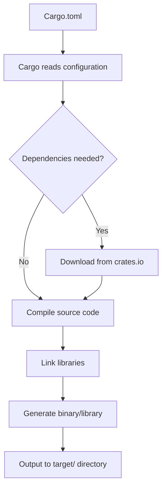
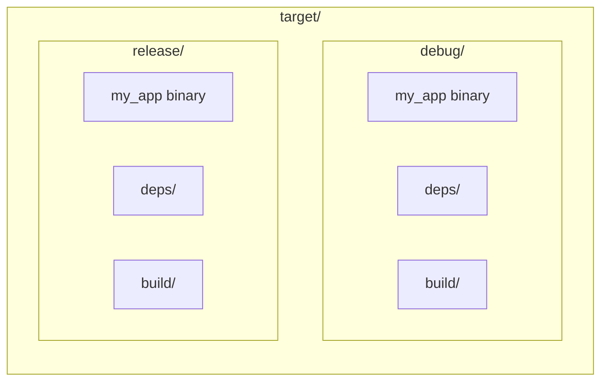
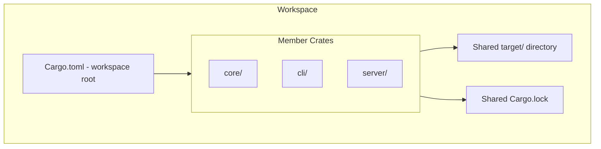

# How to Use Cargo for Rust Project Management

Author: [nawazdhandala](https://www.github.com/nawazdhandala)

Tags: Rust, Cargo, Package Management, Build Tools, Dependencies, Rust Development, Project Structure

Description: A comprehensive guide to using Cargo for managing Rust projects, from creating new projects to publishing crates.

---

Cargo is the official package manager and build system for Rust. It handles downloading dependencies, compiling your code, running tests, generating documentation, and much more. If you're working with Rust, mastering Cargo is essential for efficient project management.

## Understanding How Cargo Works

Before diving into commands, let's understand how Cargo organizes and builds Rust projects.



## Creating a New Project

Cargo makes it simple to start a new Rust project with the proper structure.

### Creating a Binary Application

```bash
# Create a new binary project
cargo new my_app

# Navigate into the project
cd my_app
```

This creates the following structure:

```
my_app/
├── Cargo.toml    # Project manifest with metadata and dependencies
├── src/
│   └── main.rs   # Entry point for binary applications
└── .gitignore    # Git ignore file (auto-generated)
```

### Creating a Library

```bash
# Create a new library project
cargo new my_library --lib
```

Library projects have `lib.rs` instead of `main.rs`:

```
my_library/
├── Cargo.toml
├── src/
│   └── lib.rs    # Entry point for libraries
└── .gitignore
```

## Understanding Cargo.toml

The `Cargo.toml` file is the heart of your Rust project. Here's a complete example:

```toml
[package]
# Basic package information
name = "my_app"                      # Crate name (must be unique on crates.io)
version = "0.1.0"                    # Semantic versioning
edition = "2021"                     # Rust edition (affects language features)
authors = ["Your Name <you@example.com>"]
description = "A brief description of what this crate does"
license = "MIT"                      # SPDX license identifier
repository = "https://github.com/username/my_app"
keywords = ["cli", "tool"]           # Up to 5 keywords for crates.io search
categories = ["command-line-utilities"]

[dependencies]
# Production dependencies
serde = "1.0"                        # Latest compatible with 1.0.x
serde_json = "1.0.108"               # Exact minor version
tokio = { version = "1.35", features = ["full"] }  # With features enabled

[dev-dependencies]
# Dependencies only used for testing and examples
criterion = "0.5"                    # Benchmarking framework
tempfile = "3.9"                     # Temporary file handling in tests

[build-dependencies]
# Dependencies used in build.rs scripts
cc = "1.0"                           # C compiler integration

[features]
# Optional features that users can enable
default = ["json"]                   # Features enabled by default
json = ["serde_json"]                # Named feature that enables serde_json
full = ["json", "async"]             # Feature that enables multiple other features
async = ["tokio"]                    # Feature for async runtime
```

## Managing Dependencies

### Adding Dependencies

```bash
# Add a dependency (fetches latest compatible version)
cargo add serde

# Add with specific version
cargo add serde@1.0.193

# Add with features enabled
cargo add tokio --features full

# Add as a dev dependency (for tests only)
cargo add --dev mockall

# Add as a build dependency
cargo add --build cc
```

### Dependency Version Syntax

Cargo uses semantic versioning with several ways to specify versions:

```toml
[dependencies]
# Caret requirements (default) - allows semver-compatible updates
serde = "^1.0.0"        # Same as "1.0.0", allows 1.0.1, 1.1.0, but not 2.0.0

# Tilde requirements - more restrictive updates
regex = "~1.5.4"        # Allows 1.5.5, but not 1.6.0

# Exact version - no updates allowed
uuid = "=1.6.1"         # Must be exactly 1.6.1

# Wildcard - any version matching the pattern
rand = "0.8.*"          # Any 0.8.x version

# Comparison requirements
log = ">=1.0, <2.0"     # Range specification
```

### Updating Dependencies

```bash
# Update all dependencies to latest compatible versions
cargo update

# Update a specific dependency
cargo update serde

# Check for outdated dependencies (requires cargo-outdated)
cargo outdated
```

## Building and Running Projects

### Development Builds

```bash
# Build the project in debug mode (faster compilation, slower execution)
cargo build

# Build and run the project
cargo run

# Build and run with arguments passed to your program
cargo run -- --config settings.toml
```

### Release Builds

```bash
# Build optimized release binary
cargo build --release

# Run in release mode
cargo run --release
```

The build output goes to the `target/` directory:



### Build Profiles

Customize build settings in `Cargo.toml`:

```toml
# Optimize debug builds slightly for faster runtime during development
[profile.dev]
opt-level = 1                # 0 = no optimization, 3 = full optimization

# Maximum optimization for release builds
[profile.release]
opt-level = 3                # Full optimization
lto = true                   # Link-time optimization for smaller binaries
codegen-units = 1            # Single codegen unit for better optimization
panic = "abort"              # Abort on panic (smaller binary, no unwinding)
strip = true                 # Strip symbols from binary
```

## Testing with Cargo

Cargo provides built-in support for unit tests, integration tests, and documentation tests.

### Running Tests

```bash
# Run all tests
cargo test

# Run tests with output shown (normally captured)
cargo test -- --nocapture

# Run a specific test by name
cargo test test_addition

# Run tests in a specific module
cargo test tests::unit_tests

# Run tests with multiple threads
cargo test -- --test-threads=4

# Run only ignored tests
cargo test -- --ignored
```

### Test Organization

```rust
// src/lib.rs

/// Adds two numbers together.
///
/// # Examples
///
/// ```
/// // This code block is a documentation test - Cargo runs it automatically
/// let result = my_library::add(2, 3);
/// assert_eq!(result, 5);
/// ```
pub fn add(a: i32, b: i32) -> i32 {
    a + b
}

// Unit tests go in the same file as the code they test
#[cfg(test)]  // Only compile this module when running tests
mod tests {
    use super::*;  // Import everything from parent module

    #[test]
    fn test_addition() {
        assert_eq!(add(2, 2), 4);
    }

    #[test]
    fn test_negative_numbers() {
        assert_eq!(add(-1, 1), 0);
    }

    #[test]
    #[should_panic(expected = "overflow")]  // Test expects a panic
    fn test_overflow() {
        let _ = add(i32::MAX, 1);  // This would overflow in debug mode
    }

    #[test]
    #[ignore]  // Skip this test unless specifically requested
    fn expensive_test() {
        // Long-running test that we don't want to run every time
    }
}
```

### Integration Tests

Integration tests live in the `tests/` directory:

```
my_library/
├── Cargo.toml
├── src/
│   └── lib.rs
└── tests/
    └── integration_test.rs    # Each file is a separate test crate
```

```rust
// tests/integration_test.rs

// Integration tests treat your library as an external crate
use my_library;

#[test]
fn test_public_api() {
    // Test the public interface of your library
    let result = my_library::add(10, 20);
    assert_eq!(result, 30);
}
```

## Workspaces for Multi-Crate Projects

Workspaces allow you to manage multiple related packages together.



### Creating a Workspace

Create a root `Cargo.toml`:

```toml
# Root Cargo.toml
[workspace]
members = [
    "core",       # Shared library code
    "cli",        # Command-line interface
    "server",     # Web server
]

# Share dependency versions across all workspace members
[workspace.dependencies]
serde = { version = "1.0", features = ["derive"] }
tokio = { version = "1.35", features = ["full"] }
thiserror = "1.0"
```

Each member has its own `Cargo.toml`:

```toml
# cli/Cargo.toml
[package]
name = "my_cli"
version = "0.1.0"
edition = "2021"

[dependencies]
# Reference workspace dependencies
serde.workspace = true
# Depend on sibling crate
core = { path = "../core" }
```

### Working with Workspaces

```bash
# Build all workspace members
cargo build --workspace

# Build a specific member
cargo build -p my_cli

# Run tests for all members
cargo test --workspace

# Run a specific package's binary
cargo run -p my_cli
```

## Useful Cargo Commands

### Code Quality

```bash
# Format code according to Rust style guidelines
cargo fmt

# Check formatting without making changes
cargo fmt --check

# Run the linter for common mistakes and improvements
cargo clippy

# Run clippy and treat warnings as errors (useful in CI)
cargo clippy -- -D warnings
```

### Documentation

```bash
# Generate documentation for your crate and dependencies
cargo doc

# Generate and open documentation in browser
cargo doc --open

# Include private items in documentation
cargo doc --document-private-items
```

### Checking Code

```bash
# Check if code compiles without producing binaries (faster than build)
cargo check

# Check with all features enabled
cargo check --all-features

# Check for all targets (lib, bins, tests, examples)
cargo check --all-targets
```

### Cleaning Up

```bash
# Remove the target directory (compiled artifacts)
cargo clean

# Remove only release build artifacts
cargo clean --release
```

## Publishing to crates.io

When your crate is ready for the world, you can publish it to crates.io.

### Preparing for Publication

```bash
# Log in to crates.io (you'll need an API token)
cargo login

# Verify everything is ready for publishing
cargo publish --dry-run

# Check what files will be included in the package
cargo package --list
```

### Publishing

```bash
# Publish the crate
cargo publish

# Publish without running tests (not recommended)
cargo publish --no-verify
```

### Versioning

Follow semantic versioning when updating your crate:

```bash
# After making changes, update version in Cargo.toml
# MAJOR.MINOR.PATCH

# PATCH: Bug fixes (0.1.0 -> 0.1.1)
# MINOR: New features, backwards compatible (0.1.0 -> 0.2.0)
# MAJOR: Breaking changes (0.1.0 -> 1.0.0)
```

## Installing Cargo Extensions

Cargo can be extended with additional subcommands:

```bash
# Install useful Cargo extensions
cargo install cargo-edit       # Adds `cargo add`, `cargo rm` commands
cargo install cargo-watch      # Watch for changes and re-run commands
cargo install cargo-outdated   # Check for outdated dependencies
cargo install cargo-audit      # Check for security vulnerabilities
cargo install cargo-expand     # Expand macros for debugging

# Example usage of cargo-watch
cargo watch -x check -x test -x run
# This watches for changes and runs check, then test, then run
```

## Practical Example: Setting Up a CLI Application

Let's walk through creating a complete CLI application:

```bash
# Create the project
cargo new file_counter
cd file_counter

# Add dependencies
cargo add clap --features derive    # Command-line argument parsing
cargo add walkdir                   # Directory traversal
cargo add anyhow                    # Error handling
```

Here's the complete application code:

```rust
// src/main.rs

use anyhow::Result;                       // Simplified error handling
use clap::Parser;                         // Derive macro for CLI arguments
use std::collections::HashMap;
use walkdir::WalkDir;                     // Recursive directory walking

/// A simple file counter that shows file statistics for a directory
#[derive(Parser, Debug)]
#[command(author, version, about, long_about = None)]
struct Args {
    /// Directory to scan
    #[arg(default_value = ".")]
    path: String,

    /// Maximum depth to traverse (0 = no limit)
    #[arg(short, long, default_value = "0")]
    depth: usize,

    /// Show hidden files
    #[arg(short = 'H', long)]
    hidden: bool,
}

fn main() -> Result<()> {
    // Parse command-line arguments
    let args = Args::parse();

    // Count files by extension
    let mut extension_counts: HashMap<String, usize> = HashMap::new();
    let mut total_files = 0;
    let mut total_dirs = 0;

    // Configure directory walker
    let mut walker = WalkDir::new(&args.path);

    // Set max depth if specified
    if args.depth > 0 {
        walker = walker.max_depth(args.depth);
    }

    // Iterate through all entries
    for entry in walker.into_iter().filter_entry(|e| {
        // Filter hidden files unless --hidden flag is set
        args.hidden || !e.file_name()
            .to_str()
            .map(|s| s.starts_with('.'))
            .unwrap_or(false)
    }) {
        let entry = entry?;  // Handle potential errors

        if entry.file_type().is_file() {
            total_files += 1;

            // Get file extension or use "no extension"
            let ext = entry.path()
                .extension()
                .and_then(|e| e.to_str())
                .unwrap_or("no extension")
                .to_lowercase();

            *extension_counts.entry(ext).or_insert(0) += 1;
        } else if entry.file_type().is_dir() {
            total_dirs += 1;
        }
    }

    // Print results
    println!("Directory: {}", args.path);
    println!("Total files: {}", total_files);
    println!("Total directories: {}", total_dirs);
    println!("\nFiles by extension:");

    // Sort by count (descending)
    let mut sorted: Vec<_> = extension_counts.iter().collect();
    sorted.sort_by(|a, b| b.1.cmp(a.1));

    for (ext, count) in sorted {
        println!("  .{}: {}", ext, count);
    }

    Ok(())
}
```

Build and run the application:

```bash
# Run with default settings (current directory)
cargo run

# Run with arguments
cargo run -- /path/to/directory --depth 3 --hidden

# Build optimized release version
cargo build --release

# The binary is now at target/release/file_counter
```

## Summary

Cargo is more than just a package manager. It's a complete build system and project management tool that handles:

- Project scaffolding with `cargo new`
- Dependency management through `Cargo.toml`
- Building with `cargo build` and running with `cargo run`
- Testing with `cargo test`
- Documentation with `cargo doc`
- Publishing with `cargo publish`
- Workspace management for complex multi-crate projects

By mastering Cargo, you can focus on writing Rust code instead of managing build configurations. The commands and patterns covered in this guide will serve you well whether you're building a small utility or a large-scale application.
