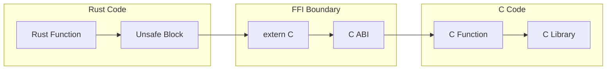
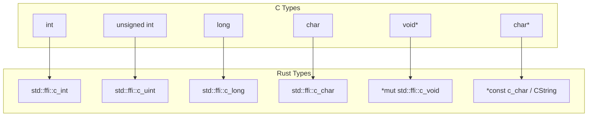

# How to Use Rust FFI for C Interoperability

Author: [nawazdhandala](https://www.github.com/nawazdhandala)

Tags: Rust, FFI, C, Interoperability, Systems Programming, Unsafe Rust, Foreign Functions

Description: Learn how to use Rust's Foreign Function Interface (FFI) to call C code from Rust and expose Rust functions to C, with practical examples and safety considerations.

---

Rust is known for its memory safety guarantees, but the real world is full of existing C libraries. Whether you need to use a battle-tested cryptography library, interface with operating system APIs, or gradually migrate a C codebase to Rust, FFI (Foreign Function Interface) makes it possible.

This guide walks through the practical aspects of Rust-C interoperability. We will cover calling C from Rust, exposing Rust to C, handling data types across the boundary, and managing memory safely.

## How FFI Works

At the binary level, Rust and C can call each other because they share the same calling conventions. When you mark a Rust function with `extern "C"`, it uses the C ABI (Application Binary Interface), making it indistinguishable from a C function at runtime.



The key insight is that FFI is inherently unsafe. Rust cannot verify that the C code follows memory safety rules, so all FFI calls happen inside `unsafe` blocks. Your job is to create safe Rust wrappers around the unsafe FFI calls.

## Calling C Functions from Rust

Let's start with a simple example: calling the C standard library's `strlen` function.

```rust
// Declare the external C function
// This tells Rust about a function that exists in a C library
extern "C" {
    // strlen takes a pointer to a null-terminated C string
    // and returns its length (not including the null terminator)
    fn strlen(s: *const std::ffi::c_char) -> usize;
}

fn main() {
    // Create a C-compatible string
    // CString adds a null terminator and ensures no interior null bytes
    let c_string = std::ffi::CString::new("Hello, FFI!").unwrap();

    // Call the C function inside an unsafe block
    // We must use unsafe because Rust cannot verify the C code's behavior
    let length = unsafe {
        strlen(c_string.as_ptr())
    };

    println!("String length: {}", length);  // Output: String length: 11
}
```

The `extern "C"` block declares functions that exist somewhere else, using C calling conventions. We are not defining `strlen` here; we are telling Rust it exists and what its signature looks like.

## Linking to C Libraries

For functions beyond the C standard library, you need to tell Cargo how to link to the library. Create a `build.rs` file in your project root:

```rust
// build.rs
// This build script runs before compiling your Rust code
fn main() {
    // Tell Cargo to link against libm (the math library)
    println!("cargo:rustc-link-lib=m");

    // For a library in a non-standard location:
    // println!("cargo:rustc-link-search=/path/to/lib");

    // For static linking:
    // println!("cargo:rustc-link-lib=static=mylib");
}
```

Now you can use functions from that library:

```rust
// Using libm's pow function for exponentiation
extern "C" {
    // double pow(double base, double exponent)
    fn pow(base: f64, exponent: f64) -> f64;
}

fn main() {
    let result = unsafe { pow(2.0, 10.0) };
    println!("2^10 = {}", result);  // Output: 2^10 = 1024
}
```

## Type Mapping Between Rust and C

Getting types right is critical for FFI. Here's how common C types map to Rust:



Here's a practical reference:

```rust
use std::ffi::{c_char, c_int, c_uint, c_long, c_ulong, c_void, c_double, c_float};

// Example struct showing type mappings
#[repr(C)]  // Use C memory layout
struct CCompatibleStruct {
    // Signed integers
    int_val: c_int,           // C: int
    long_val: c_long,         // C: long

    // Unsigned integers
    uint_val: c_uint,         // C: unsigned int
    ulong_val: c_ulong,       // C: unsigned long

    // Floating point
    float_val: c_float,       // C: float
    double_val: c_double,     // C: double

    // Pointers
    void_ptr: *mut c_void,    // C: void*
    string_ptr: *const c_char, // C: const char*

    // Fixed-size integers (when you need exact sizes)
    byte: u8,                 // C: uint8_t
    word: u16,                // C: uint16_t
    dword: u32,               // C: uint32_t
    qword: u64,               // C: uint64_t
}
```

The `#[repr(C)]` attribute is essential. Without it, Rust may reorder struct fields for optimization, breaking compatibility with C code that expects a specific memory layout.

## Working with C Strings

Strings require special handling because C and Rust represent them differently. C strings are null-terminated byte arrays; Rust strings are length-prefixed UTF-8.

```rust
use std::ffi::{CStr, CString};
use std::os::raw::c_char;

extern "C" {
    fn puts(s: *const c_char) -> c_int;
    fn getenv(name: *const c_char) -> *mut c_char;
}

fn print_to_c(message: &str) {
    // Convert Rust string to C string
    // CString::new() adds a null terminator
    // It fails if the string contains interior null bytes
    let c_message = CString::new(message)
        .expect("String contains null byte");

    unsafe {
        puts(c_message.as_ptr());
    }
    // c_message is automatically freed when it goes out of scope
}

fn get_env_var(name: &str) -> Option<String> {
    let c_name = CString::new(name).ok()?;

    unsafe {
        let ptr = getenv(c_name.as_ptr());

        // Check for null pointer (environment variable not found)
        if ptr.is_null() {
            return None;
        }

        // Convert C string back to Rust string
        // CStr::from_ptr creates a borrowed view of the C string
        // to_string_lossy handles invalid UTF-8 gracefully
        let c_str = CStr::from_ptr(ptr);
        Some(c_str.to_string_lossy().into_owned())
    }
}

fn main() {
    print_to_c("Hello from Rust!");

    if let Some(path) = get_env_var("PATH") {
        println!("PATH: {}", path);
    }
}
```

## Exposing Rust Functions to C

The reverse direction is exposing Rust code so C programs can call it. This is useful for writing plugins, shared libraries, or gradually introducing Rust into a C codebase.

```rust
use std::ffi::{c_char, c_int, CStr};

// Export this function with C linkage
// no_mangle prevents Rust from changing the function name
#[no_mangle]
pub extern "C" fn rust_add(a: c_int, b: c_int) -> c_int {
    a + b
}

// A more complex example: string processing
#[no_mangle]
pub extern "C" fn rust_string_length(s: *const c_char) -> c_int {
    // Handle null pointer gracefully
    if s.is_null() {
        return -1;
    }

    unsafe {
        // Safely create a CStr from the raw pointer
        match CStr::from_ptr(s).to_str() {
            Ok(rust_str) => rust_str.len() as c_int,
            Err(_) => -1,  // Invalid UTF-8
        }
    }
}

// Example with heap allocation
// The caller is responsible for freeing this memory
#[no_mangle]
pub extern "C" fn rust_create_greeting(name: *const c_char) -> *mut c_char {
    if name.is_null() {
        return std::ptr::null_mut();
    }

    unsafe {
        let name_str = match CStr::from_ptr(name).to_str() {
            Ok(s) => s,
            Err(_) => return std::ptr::null_mut(),
        };

        let greeting = format!("Hello, {}!", name_str);

        // Convert to CString and leak the memory
        // The caller must call rust_free_string to deallocate
        match std::ffi::CString::new(greeting) {
            Ok(c_greeting) => c_greeting.into_raw(),
            Err(_) => std::ptr::null_mut(),
        }
    }
}

// Companion function to free strings allocated by Rust
#[no_mangle]
pub extern "C" fn rust_free_string(s: *mut c_char) {
    if !s.is_null() {
        unsafe {
            // Reconstruct the CString and let it drop naturally
            drop(std::ffi::CString::from_raw(s));
        }
    }
}
```

To use these from C, you need a header file:

```c
// rust_functions.h
#ifndef RUST_FUNCTIONS_H
#define RUST_FUNCTIONS_H

int rust_add(int a, int b);
int rust_string_length(const char* s);
char* rust_create_greeting(const char* name);
void rust_free_string(char* s);

#endif
```

Build your Rust code as a C-compatible library by adding this to `Cargo.toml`:

```toml
[lib]
crate-type = ["cdylib"]  # For a dynamic library (.so/.dylib/.dll)
# Or use "staticlib" for a static library (.a)
```

## Handling Opaque Types and Callbacks

Real-world C libraries often use opaque pointers and function callbacks. Here's how to handle them:

```rust
use std::ffi::{c_int, c_void};

// Opaque type - we don't know the internal structure
// This is common for handles and contexts in C APIs
#[repr(C)]
pub struct OpaqueHandle {
    _private: [u8; 0],  // Zero-sized, prevents instantiation
}

// Function pointer type for callbacks
type Callback = extern "C" fn(data: *mut c_void, value: c_int);

extern "C" {
    fn create_handle() -> *mut OpaqueHandle;
    fn destroy_handle(handle: *mut OpaqueHandle);
    fn set_callback(handle: *mut OpaqueHandle, cb: Callback, user_data: *mut c_void);
    fn trigger_callback(handle: *mut OpaqueHandle, value: c_int);
}

// Safe wrapper around the opaque handle
pub struct SafeHandle {
    raw: *mut OpaqueHandle,
}

impl SafeHandle {
    pub fn new() -> Option<Self> {
        let raw = unsafe { create_handle() };
        if raw.is_null() {
            None
        } else {
            Some(SafeHandle { raw })
        }
    }

    pub fn set_callback<F>(&mut self, callback: F)
    where
        F: FnMut(c_int) + 'static,
    {
        // Box the closure and convert to raw pointer
        let boxed: Box<Box<dyn FnMut(c_int)>> = Box::new(Box::new(callback));
        let user_data = Box::into_raw(boxed) as *mut c_void;

        unsafe {
            set_callback(self.raw, trampoline, user_data);
        }
    }

    pub fn trigger(&self, value: c_int) {
        unsafe {
            trigger_callback(self.raw, value);
        }
    }
}

// Trampoline function that bridges C callback to Rust closure
extern "C" fn trampoline(user_data: *mut c_void, value: c_int) {
    unsafe {
        let callback = &mut *(user_data as *mut Box<dyn FnMut(c_int)>);
        callback(value);
    }
}

impl Drop for SafeHandle {
    fn drop(&mut self) {
        unsafe {
            destroy_handle(self.raw);
        }
    }
}

// Ensure the handle cannot be sent between threads unless explicitly allowed
// This is important if the C library is not thread-safe
impl !Send for SafeHandle {}
impl !Sync for SafeHandle {}
```

## Using bindgen for Automatic Bindings

For large C libraries, writing bindings by hand is tedious and error-prone. The `bindgen` tool automatically generates Rust FFI bindings from C headers.

Add to your `Cargo.toml`:

```toml
[build-dependencies]
bindgen = "0.70"
```

Create a `build.rs`:

```rust
// build.rs
use std::env;
use std::path::PathBuf;

fn main() {
    // Tell cargo to invalidate the built crate whenever the wrapper changes
    println!("cargo:rerun-if-changed=wrapper.h");

    // Link to the library
    println!("cargo:rustc-link-lib=mylib");

    // Generate bindings
    let bindings = bindgen::Builder::default()
        // The input header file
        .header("wrapper.h")
        // Generate bindings for these functions
        .allowlist_function("mylib_.*")
        // Generate bindings for these types
        .allowlist_type("mylib_.*")
        // Use core instead of std for no_std compatibility
        .use_core()
        // Generate documentation comments
        .generate_comments(true)
        // Finish the builder and generate the bindings
        .generate()
        .expect("Unable to generate bindings");

    // Write the bindings to the $OUT_DIR/bindings.rs file
    let out_path = PathBuf::from(env::var("OUT_DIR").unwrap());
    bindings
        .write_to_file(out_path.join("bindings.rs"))
        .expect("Couldn't write bindings!");
}
```

Create `wrapper.h` that includes the headers you need:

```c
// wrapper.h
#include <mylib/api.h>
#include <mylib/types.h>
```

Then include the generated bindings in your code:

```rust
// src/lib.rs
#![allow(non_upper_case_globals)]
#![allow(non_camel_case_types)]
#![allow(non_snake_case)]

// Include the auto-generated bindings
include!(concat!(env!("OUT_DIR"), "/bindings.rs"));

// Now create safe wrappers around the raw bindings
pub mod safe {
    use super::*;

    // Safe wrapper functions go here
}
```

## Memory Management Across the FFI Boundary

Memory ownership is the trickiest part of FFI. The golden rule: whoever allocates memory must also free it.


Here's a complete example showing proper memory management:

```rust
use std::ffi::{c_char, c_int, c_void, CStr, CString};

extern "C" {
    // C functions that allocate memory
    fn c_create_buffer(size: c_int) -> *mut c_void;
    fn c_free_buffer(buf: *mut c_void);
    fn c_get_string() -> *mut c_char;
    fn c_free_string(s: *mut c_char);
}

// Safe wrapper for C-allocated buffer
pub struct CBuffer {
    ptr: *mut c_void,
    size: usize,
}

impl CBuffer {
    pub fn new(size: usize) -> Option<Self> {
        let ptr = unsafe { c_create_buffer(size as c_int) };
        if ptr.is_null() {
            None
        } else {
            Some(CBuffer { ptr, size })
        }
    }

    pub fn as_slice(&self) -> &[u8] {
        unsafe {
            std::slice::from_raw_parts(self.ptr as *const u8, self.size)
        }
    }

    pub fn as_mut_slice(&mut self) -> &mut [u8] {
        unsafe {
            std::slice::from_raw_parts_mut(self.ptr as *mut u8, self.size)
        }
    }
}

impl Drop for CBuffer {
    fn drop(&mut self) {
        // Free using the C allocator since C allocated it
        unsafe {
            c_free_buffer(self.ptr);
        }
    }
}

// Safe wrapper for C-allocated string
pub struct CAllocatedString {
    ptr: *mut c_char,
}

impl CAllocatedString {
    pub fn get() -> Option<Self> {
        let ptr = unsafe { c_get_string() };
        if ptr.is_null() {
            None
        } else {
            Some(CAllocatedString { ptr })
        }
    }

    pub fn as_str(&self) -> Result<&str, std::str::Utf8Error> {
        unsafe {
            CStr::from_ptr(self.ptr).to_str()
        }
    }
}

impl Drop for CAllocatedString {
    fn drop(&mut self) {
        // Free using the C function since C allocated it
        unsafe {
            c_free_string(self.ptr);
        }
    }
}

// Functions to pass Rust-allocated data to C
// The C code must NOT free this memory

#[no_mangle]
pub extern "C" fn rust_provide_data(callback: extern "C" fn(*const u8, c_int)) {
    let data: Vec<u8> = vec![1, 2, 3, 4, 5];

    // Pass a pointer to C, but Rust retains ownership
    callback(data.as_ptr(), data.len() as c_int);

    // data is automatically freed here when it goes out of scope
    // The C code should not try to free it or use it after this function returns
}

// If C needs to own the data, explicitly transfer ownership
#[no_mangle]
pub extern "C" fn rust_give_data_to_c() -> *mut u8 {
    let mut data: Vec<u8> = vec![1, 2, 3, 4, 5];
    let ptr = data.as_mut_ptr();

    // Prevent Rust from freeing the memory
    std::mem::forget(data);

    // C now owns this memory and must free it with rust_free_data
    ptr
}

#[no_mangle]
pub extern "C" fn rust_free_data(ptr: *mut u8, len: c_int, capacity: c_int) {
    if !ptr.is_null() {
        unsafe {
            // Reconstruct the Vec and let it drop
            let _ = Vec::from_raw_parts(ptr, len as usize, capacity as usize);
        }
    }
}
```

## Error Handling

C typically handles errors through return codes or errno. Here's a pattern for converting between C-style and Rust-style error handling:

```rust
use std::ffi::{c_int, c_char, CStr};

// Error codes that match the C library
#[repr(C)]
#[derive(Debug, Clone, Copy, PartialEq, Eq)]
pub enum ErrorCode {
    Success = 0,
    InvalidArgument = -1,
    OutOfMemory = -2,
    IoError = -3,
    Unknown = -99,
}

extern "C" {
    fn c_operation(input: c_int) -> c_int;
    fn c_get_last_error() -> *const c_char;
}

// Rust-friendly error type
#[derive(Debug)]
pub struct LibraryError {
    code: ErrorCode,
    message: String,
}

impl std::fmt::Display for LibraryError {
    fn fmt(&self, f: &mut std::fmt::Formatter<'_>) -> std::fmt::Result {
        write!(f, "Error {:?}: {}", self.code, self.message)
    }
}

impl std::error::Error for LibraryError {}

// Convert C error to Rust Result
fn check_error(result: c_int) -> Result<c_int, LibraryError> {
    if result >= 0 {
        Ok(result)
    } else {
        let code = match result {
            -1 => ErrorCode::InvalidArgument,
            -2 => ErrorCode::OutOfMemory,
            -3 => ErrorCode::IoError,
            _ => ErrorCode::Unknown,
        };

        let message = unsafe {
            let ptr = c_get_last_error();
            if ptr.is_null() {
                "Unknown error".to_string()
            } else {
                CStr::from_ptr(ptr).to_string_lossy().into_owned()
            }
        };

        Err(LibraryError { code, message })
    }
}

// Safe wrapper function
pub fn perform_operation(input: i32) -> Result<i32, LibraryError> {
    let result = unsafe { c_operation(input as c_int) };
    check_error(result).map(|v| v as i32)
}
```

## Real-World Example: Wrapping a C Compression Library

Let's put it all together with a practical example wrapping zlib for compression:

```rust
// Example: Safe wrapper around zlib compression functions

use std::ffi::{c_int, c_ulong, c_void};
use std::ptr;

// Raw FFI bindings
extern "C" {
    fn compress(
        dest: *mut u8,
        dest_len: *mut c_ulong,
        source: *const u8,
        source_len: c_ulong,
    ) -> c_int;

    fn uncompress(
        dest: *mut u8,
        dest_len: *mut c_ulong,
        source: *const u8,
        source_len: c_ulong,
    ) -> c_int;

    fn compressBound(source_len: c_ulong) -> c_ulong;
}

// Error type for compression operations
#[derive(Debug)]
pub enum CompressionError {
    BufferTooSmall,
    InvalidData,
    MemoryError,
    Unknown(c_int),
}

impl std::fmt::Display for CompressionError {
    fn fmt(&self, f: &mut std::fmt::Formatter<'_>) -> std::fmt::Result {
        match self {
            CompressionError::BufferTooSmall => write!(f, "Output buffer too small"),
            CompressionError::InvalidData => write!(f, "Invalid compressed data"),
            CompressionError::MemoryError => write!(f, "Memory allocation failed"),
            CompressionError::Unknown(code) => write!(f, "Unknown error: {}", code),
        }
    }
}

impl std::error::Error for CompressionError {}

// Convert zlib error code to our error type
fn zlib_result(code: c_int) -> Result<(), CompressionError> {
    match code {
        0 => Ok(()),     // Z_OK
        -4 => Err(CompressionError::MemoryError),    // Z_MEM_ERROR
        -5 => Err(CompressionError::BufferTooSmall), // Z_BUF_ERROR
        -3 => Err(CompressionError::InvalidData),    // Z_DATA_ERROR
        other => Err(CompressionError::Unknown(other)),
    }
}

/// Compress data using zlib
///
/// # Example
/// ```
/// let data = b"Hello, World! Hello, World!";
/// let compressed = compress_data(data).unwrap();
/// assert!(compressed.len() < data.len());
/// ```
pub fn compress_data(input: &[u8]) -> Result<Vec<u8>, CompressionError> {
    // Calculate maximum compressed size
    let max_compressed_size = unsafe { compressBound(input.len() as c_ulong) };

    // Allocate output buffer
    let mut output = vec![0u8; max_compressed_size as usize];
    let mut output_len = max_compressed_size;

    // Perform compression
    let result = unsafe {
        compress(
            output.as_mut_ptr(),
            &mut output_len,
            input.as_ptr(),
            input.len() as c_ulong,
        )
    };

    // Check for errors
    zlib_result(result)?;

    // Shrink output to actual size
    output.truncate(output_len as usize);
    Ok(output)
}

/// Decompress zlib-compressed data
///
/// # Arguments
/// * `input` - Compressed data
/// * `max_output_size` - Maximum expected uncompressed size
///
/// # Example
/// ```
/// let original = b"Hello, World!";
/// let compressed = compress_data(original).unwrap();
/// let decompressed = decompress_data(&compressed, 1024).unwrap();
/// assert_eq!(&decompressed, original);
/// ```
pub fn decompress_data(input: &[u8], max_output_size: usize) -> Result<Vec<u8>, CompressionError> {
    // Allocate output buffer
    let mut output = vec![0u8; max_output_size];
    let mut output_len = max_output_size as c_ulong;

    // Perform decompression
    let result = unsafe {
        uncompress(
            output.as_mut_ptr(),
            &mut output_len,
            input.as_ptr(),
            input.len() as c_ulong,
        )
    };

    // Check for errors
    zlib_result(result)?;

    // Shrink output to actual size
    output.truncate(output_len as usize);
    Ok(output)
}

#[cfg(test)]
mod tests {
    use super::*;

    #[test]
    fn test_roundtrip() {
        let original = b"The quick brown fox jumps over the lazy dog. \
                        The quick brown fox jumps over the lazy dog.";

        let compressed = compress_data(original).unwrap();
        println!("Original: {} bytes, Compressed: {} bytes",
                 original.len(), compressed.len());

        let decompressed = decompress_data(&compressed, original.len() * 2).unwrap();
        assert_eq!(&decompressed[..], &original[..]);
    }
}
```

## Safety Guidelines

When working with FFI, follow these practices to minimize risk:

1. **Minimize unsafe surface area**: Create safe wrapper types and functions. Users of your library should not need to write `unsafe` code.

2. **Validate all inputs**: Check for null pointers and valid ranges before passing data to C.

3. **Document invariants**: Clearly state what the C code expects and what guarantees it provides.

4. **Use RAII for resources**: Implement `Drop` for any type that owns C resources.

5. **Consider thread safety**: Mark types as `!Send` or `!Sync` if the underlying C code is not thread-safe.

6. **Test extensively**: FFI bugs often manifest as memory corruption or undefined behavior. Use tools like Valgrind, AddressSanitizer, and Miri.

```rust
// Example of a well-documented unsafe wrapper
/// Creates a new handle to the C library.
///
/// # Safety
///
/// The returned handle must be freed with `Handle::drop()` or memory will leak.
/// The handle is not thread-safe and must not be shared between threads.
///
/// # Panics
///
/// Panics if the C library fails to initialize (returns null).
pub fn create_handle() -> Handle {
    let raw = unsafe { ffi::create_handle() };
    assert!(!raw.is_null(), "Failed to create handle");
    Handle { raw }
}
```

## Wrapping Up

Rust FFI is a powerful feature that lets you leverage existing C libraries while maintaining Rust's safety guarantees in your own code. The key points to remember:

- Use `extern "C"` and `#[repr(C)]` to ensure ABI compatibility
- Always wrap unsafe FFI calls in safe abstractions
- Use `CString` and `CStr` for string conversion
- Match memory allocation with the corresponding deallocation
- Consider using `bindgen` for large C libraries

FFI is inherently about bridging two different worlds. With careful wrapper design, you can create interfaces that feel natural in Rust while correctly handling all the details of C interoperability.

**Related Reading:**

- [The Rust FFI Omnibus](http://jakegoulding.com/rust-ffi-omnibus/)
- [The Rustonomicon - FFI](https://doc.rust-lang.org/nomicon/ffi.html)
- [bindgen User Guide](https://rust-lang.github.io/rust-bindgen/)
