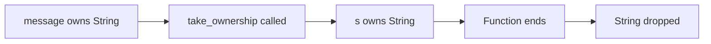
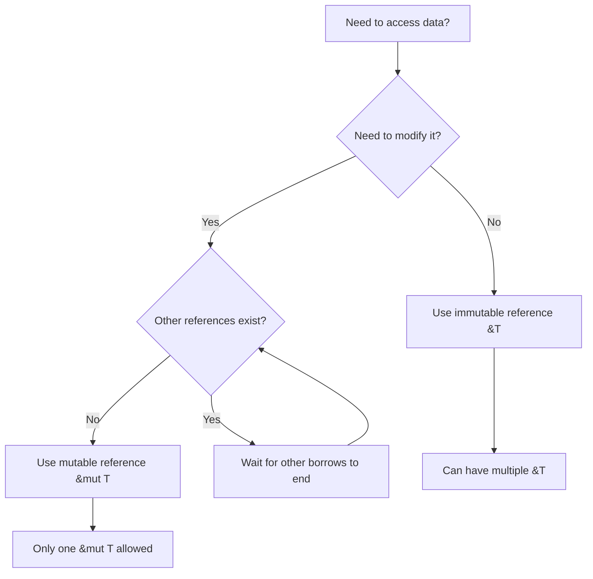

# How to Use Rust Ownership and Borrowing

Author: [nawazdhandala](https://www.github.com/nawazdhandala)

Tags: Rust, Ownership, Borrowing, Memory Safety, Programming

Description: Master Rust's ownership and borrowing system to write memory-safe code without a garbage collector. This guide covers the rules, common patterns, and practical examples that will help you think like a Rustacean.

---

Rust's ownership system is what makes the language unique. It guarantees memory safety at compile time without needing a garbage collector, which means zero-cost abstractions and predictable performance. But for developers coming from languages like Python, JavaScript, or even C++, ownership can feel like learning to code all over again.

The good news is that once you internalize the rules, ownership becomes intuitive. This guide breaks down the ownership and borrowing concepts with practical examples so you can write idiomatic Rust code with confidence.

## The Three Rules of Ownership

Rust's ownership system is built on three simple rules:

1. **Each value in Rust has a single owner** - a variable that "owns" the data
2. **There can only be one owner at a time** - when ownership transfers, the previous owner can no longer access the value
3. **When the owner goes out of scope, the value is dropped** - memory is automatically freed

Let's see these rules in action:

```rust
fn main() {
    // Rule 1: s1 owns the String
    let s1 = String::from("hello");

    // Rule 2: Ownership moves to s2, s1 is now invalid
    let s2 = s1;

    // This would cause a compile error:
    // println!("{}", s1); // error: value borrowed here after move

    println!("{}", s2); // Works fine

    // Rule 3: When s2 goes out of scope here, the String is dropped
}
```

The compiler enforces these rules strictly. If you try to use a value after it has been moved, you get a compile-time error - not a runtime crash or undefined behavior.

## Understanding Move Semantics

When you assign a value to another variable or pass it to a function, Rust performs a "move" by default for types that don't implement the `Copy` trait. This means ownership transfers, and the original variable becomes invalid.

```rust
fn take_ownership(s: String) {
    // s comes into scope and owns the String
    println!("Received: {}", s);
    // s goes out of scope, String is dropped
}

fn main() {
    let message = String::from("important data");

    take_ownership(message);

    // message is no longer valid here
    // This would fail: println!("{}", message);
}
```

Here's a diagram showing how ownership flows:



## Types That Copy Instead of Move

Some types are cheap to copy, like integers, floats, and booleans. These types implement the `Copy` trait, which means they are copied instead of moved:

```rust
fn main() {
    let x = 42;
    let y = x; // x is copied, not moved

    // Both x and y are valid
    println!("x = {}, y = {}", x, y);

    // Same for tuples of Copy types
    let point = (10, 20);
    let another_point = point;

    println!("Original: {:?}, Copy: {:?}", point, another_point);
}
```

Types that implement `Copy` include:
- All integer types (i32, u64, etc.)
- Floating point types (f32, f64)
- Booleans
- Characters
- Tuples containing only Copy types
- Arrays of Copy types with fixed size

## Borrowing with References

Moving ownership everywhere would be impractical. You would have to return values from every function just to use them again. This is where borrowing comes in.

A reference lets you use a value without taking ownership. Think of it as borrowing a book from a friend - you can read it, but you have to give it back.

```rust
fn calculate_length(s: &String) -> usize {
    // s is a reference to a String
    s.len()
    // s goes out of scope, but since it doesn't own the String,
    // nothing is dropped
}

fn main() {
    let message = String::from("hello world");

    // Pass a reference using &
    let length = calculate_length(&message);

    // message is still valid because we only borrowed it
    println!("'{}' has {} characters", message, length);
}
```

## Mutable References

By default, references are immutable - you can read the data but not modify it. If you need to modify borrowed data, use a mutable reference:

```rust
fn add_exclamation(s: &mut String) {
    // s is a mutable reference, so we can modify the String
    s.push_str("!");
}

fn main() {
    // The variable must be declared as mutable
    let mut greeting = String::from("Hello");

    // Pass a mutable reference using &mut
    add_exclamation(&mut greeting);

    println!("{}", greeting); // Prints: Hello!
}
```

Rust enforces a critical rule for mutable references: **you can have either one mutable reference OR any number of immutable references, but not both at the same time**.

```rust
fn main() {
    let mut data = String::from("content");

    let r1 = &data;     // immutable borrow
    let r2 = &data;     // another immutable borrow - OK

    // This would fail:
    // let r3 = &mut data; // can't borrow as mutable while immutable borrows exist

    println!("{} and {}", r1, r2);
    // r1 and r2 are no longer used after this point

    // Now we can create a mutable reference
    let r3 = &mut data;
    r3.push_str(" modified");
    println!("{}", r3);
}
```

This rule prevents data races at compile time. A data race occurs when:
- Two or more pointers access the same data
- At least one pointer writes to the data
- There's no synchronization

Rust's borrowing rules make data races impossible in safe code.

## The Borrowing Rules Visualized



## Lifetimes - Preventing Dangling References

Rust uses lifetimes to ensure references are always valid. Most of the time, the compiler infers lifetimes automatically, but sometimes you need to annotate them explicitly.

The classic example is a function that returns a reference:

```rust
// This won't compile - Rust doesn't know which input lifetime
// the return value is tied to
// fn longest(x: &str, y: &str) -> &str { ... }

// We need to specify that the return value lives as long as
// the shorter of the two input lifetimes
fn longest<'a>(x: &'a str, y: &'a str) -> &'a str {
    if x.len() > y.len() {
        x
    } else {
        y
    }
}

fn main() {
    let string1 = String::from("long string");
    let result;

    {
        let string2 = String::from("short");
        result = longest(&string1, &string2);
        println!("Longest: {}", result);
    }

    // This would fail if we tried to use result here,
    // because string2 is out of scope
}
```

The lifetime annotation `'a` tells the compiler: "The returned reference will be valid for as long as both input references are valid."

## Common Patterns for Working with Ownership

### Pattern 1: Clone When You Need Independence

If you need to keep using a value after passing it somewhere, clone it:

```rust
fn process(data: String) {
    println!("Processing: {}", data);
}

fn main() {
    let original = String::from("important");

    // Clone creates a deep copy
    process(original.clone());

    // original is still valid
    println!("Still have: {}", original);
}
```

Cloning has a performance cost, so use it deliberately.

### Pattern 2: Return Ownership from Functions

Functions can return ownership, giving the caller the value:

```rust
fn create_greeting(name: &str) -> String {
    // Create and return a new String
    // Ownership transfers to the caller
    format!("Hello, {}!", name)
}

fn main() {
    let greeting = create_greeting("Alice");
    println!("{}", greeting);
}
```

### Pattern 3: Use References for Read-Only Access

When a function only needs to read data, take a reference:

```rust
// Good - borrows the vector, doesn't need ownership
fn sum_values(numbers: &[i32]) -> i32 {
    numbers.iter().sum()
}

fn main() {
    let values = vec![1, 2, 3, 4, 5];

    let total = sum_values(&values);
    println!("Sum: {}", total);

    // values is still available
    println!("Count: {}", values.len());
}
```

### Pattern 4: Take Ownership When You Need to Store or Transform

When a function needs to store the data or transform it significantly, take ownership:

```rust
struct Container {
    data: String,
}

impl Container {
    // Takes ownership because we need to store the String
    fn new(data: String) -> Self {
        Container { data }
    }

    // Returns a reference to avoid giving up ownership
    fn get_data(&self) -> &str {
        &self.data
    }
}

fn main() {
    let text = String::from("stored value");
    let container = Container::new(text);

    // text is now owned by container
    println!("Container holds: {}", container.get_data());
}
```

## Working with Structs and Ownership

When structs contain references, you need to specify lifetimes:

```rust
// This struct borrows a string slice
struct Article<'a> {
    title: &'a str,
    content: &'a str,
}

impl<'a> Article<'a> {
    fn summary(&self) -> String {
        format!("{}: {}...", self.title, &self.content[..50.min(self.content.len())])
    }
}

fn main() {
    let title = String::from("Understanding Ownership");
    let content = String::from("Rust's ownership system is powerful.");

    let article = Article {
        title: &title,
        content: &content,
    };

    println!("{}", article.summary());

    // article must not outlive title or content
}
```

For structs that own their data, no lifetime annotations are needed:

```rust
// This struct owns its data
struct OwnedArticle {
    title: String,
    content: String,
}

impl OwnedArticle {
    fn new(title: String, content: String) -> Self {
        OwnedArticle { title, content }
    }
}
```

## Practical Example: Building a Cache

Let's put it all together with a practical example - a simple cache that demonstrates ownership patterns:

```rust
use std::collections::HashMap;

struct Cache {
    // The cache owns both keys and values
    store: HashMap<String, String>,
}

impl Cache {
    fn new() -> Self {
        Cache {
            store: HashMap::new(),
        }
    }

    // Takes ownership of both key and value to store them
    fn insert(&mut self, key: String, value: String) {
        self.store.insert(key, value);
    }

    // Returns a reference - caller can read but cache keeps ownership
    fn get(&self, key: &str) -> Option<&String> {
        self.store.get(key)
    }

    // Takes ownership back from the cache
    fn remove(&mut self, key: &str) -> Option<String> {
        self.store.remove(key)
    }
}

fn main() {
    let mut cache = Cache::new();

    // Insert takes ownership of the strings
    cache.insert(
        String::from("user:123"),
        String::from("Alice")
    );

    // Get returns a reference
    if let Some(name) = cache.get("user:123") {
        println!("Found user: {}", name);
    }

    // Remove returns owned value
    if let Some(name) = cache.remove("user:123") {
        println!("Removed: {}", name);
        // name is now owned by this scope
    }
}
```

## Common Mistakes and How to Fix Them

### Mistake 1: Returning References to Local Variables

```rust
// This won't compile
fn bad_function() -> &String {
    let s = String::from("hello");
    &s // Error: returns reference to local variable
}

// Fix: Return the owned value
fn good_function() -> String {
    let s = String::from("hello");
    s // Ownership transfers to caller
}
```

### Mistake 2: Modifying While Iterating

```rust
fn main() {
    let mut numbers = vec![1, 2, 3, 4, 5];

    // This won't compile - can't mutate while iterating
    // for n in &numbers {
    //     if *n == 3 {
    //         numbers.push(6);
    //     }
    // }

    // Fix: Collect indices first, then modify
    let indices: Vec<usize> = numbers
        .iter()
        .enumerate()
        .filter(|(_, &n)| n == 3)
        .map(|(i, _)| i)
        .collect();

    for i in indices {
        numbers[i] = 30;
    }
}
```

### Mistake 3: Storing References in Structs Without Lifetimes

```rust
// This won't compile
// struct BadHolder {
//     data: &str,
// }

// Fix: Add lifetime annotation
struct GoodHolder<'a> {
    data: &'a str,
}

// Or own the data
struct OwnedHolder {
    data: String,
}
```

## Summary

Rust's ownership and borrowing system provides memory safety without runtime overhead. The key concepts to remember:

1. **Every value has exactly one owner** - ownership can be transferred (moved) but not shared
2. **References let you borrow without taking ownership** - use `&T` for read access, `&mut T` for write access
3. **Borrowing rules prevent data races** - either one mutable reference OR multiple immutable references
4. **Lifetimes ensure references stay valid** - the compiler tracks how long references live

Start by thinking about who needs to own the data. If a function just needs to read something, take a reference. If it needs to store or significantly transform the data, take ownership. When in doubt, let the compiler guide you - its error messages are remarkably helpful.

Once ownership becomes second nature, you'll find that Rust code is not just safe, but also clear about data flow and responsibilities. That clarity makes reasoning about complex systems much easier.
