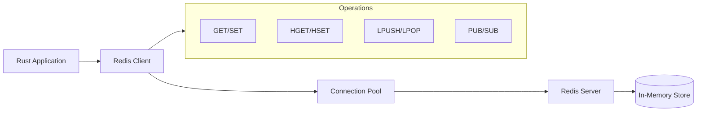
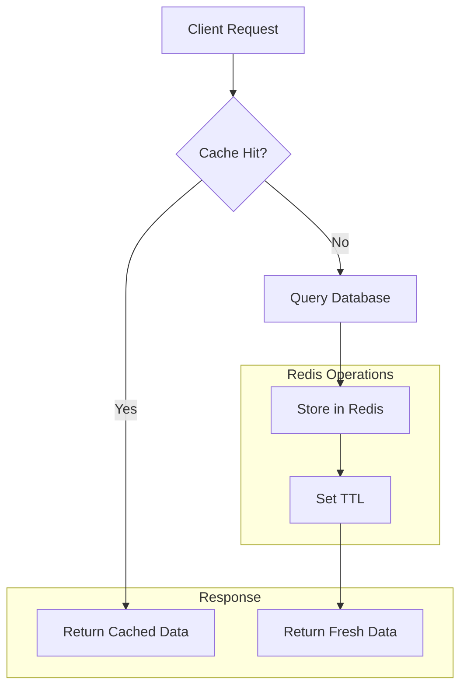
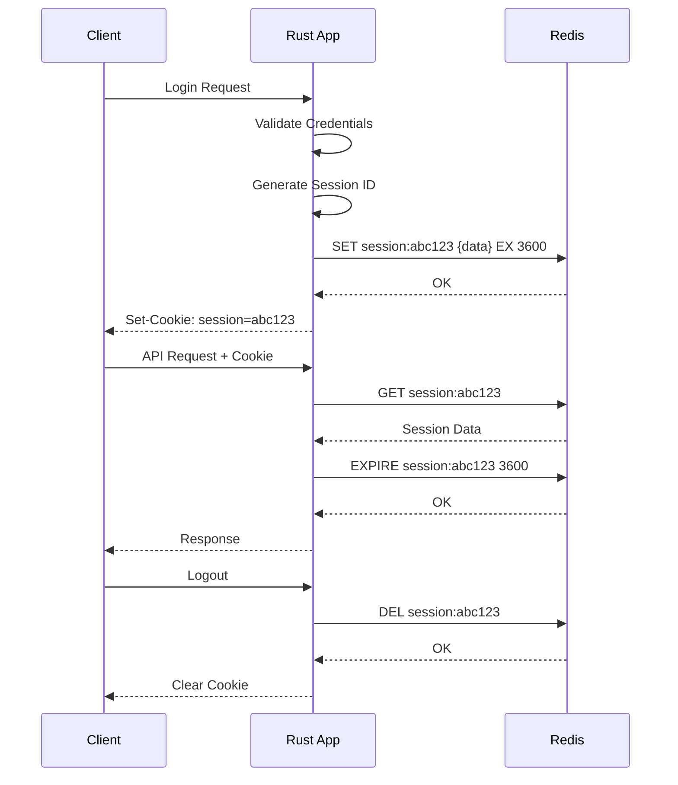

# How to Use Rust with Redis

Author: [nawazdhandala](https://www.github.com/nawazdhandala)

Tags: Rust, Redis, Caching, Database, Backend Development, Async Programming

Description: A practical guide to integrating Redis with Rust applications using the redis-rs crate for caching, session management, and data persistence.

---

Redis is a fast, in-memory data store that pairs well with Rust's performance-focused design. Whether you need caching, session storage, or a message broker, Redis provides a straightforward solution. This guide walks you through connecting Rust to Redis, performing common operations, and building practical features for real applications.

## Prerequisites

Before we begin, make sure you have:
- Rust installed (1.70 or later)
- Redis server running locally or accessible remotely
- Basic familiarity with Rust and Cargo

## Setting Up Your Project

Start by creating a new Rust project and adding the required dependencies:

```bash
cargo new rust-redis-app
cd rust-redis-app
```

Add these dependencies to your `Cargo.toml`:

```toml
[dependencies]
redis = { version = "0.24", features = ["tokio-comp", "connection-manager"] }
tokio = { version = "1", features = ["full"] }
serde = { version = "1.0", features = ["derive"] }
serde_json = "1.0"
```

The `redis` crate is the official Rust client for Redis. We enable `tokio-comp` for async support and `connection-manager` for automatic reconnection handling.

## Architecture Overview

Here's how your Rust application interacts with Redis:



## Basic Connection

Let's start with a simple synchronous connection to understand the fundamentals:

```rust
use redis::{Client, Commands};

fn main() -> redis::RedisResult<()> {
    // Create a client that connects to Redis on localhost
    let client = Client::open("redis://127.0.0.1:6379/")?;

    // Get a connection from the client
    let mut con = client.get_connection()?;

    // Set a key-value pair
    // The underscore ignores the return value (OK response)
    let _: () = con.set("greeting", "Hello from Rust!")?;

    // Retrieve the value we just set
    let value: String = con.get("greeting")?;
    println!("Retrieved: {}", value);

    Ok(())
}
```

This example demonstrates the basic workflow: create a client, get a connection, and perform operations. The type annotations (like `String`) tell Redis what type to deserialize the response into.

## Async Connection with Tokio

For production applications, async connections provide better performance by not blocking threads during I/O operations:

```rust
use redis::AsyncCommands;

#[tokio::main]
async fn main() -> redis::RedisResult<()> {
    // Create an async client
    let client = redis::Client::open("redis://127.0.0.1:6379/")?;

    // Get an async connection
    // This connection can be used concurrently across tasks
    let mut con = client.get_multiplexed_async_connection().await?;

    // Async set operation
    // Note: we use .await instead of blocking
    let _: () = con.set("async_key", "Async value").await?;

    // Async get operation
    let value: String = con.get("async_key").await?;
    println!("Async retrieved: {}", value);

    Ok(())
}
```

The `get_multiplexed_async_connection()` method returns a connection that can be cloned and shared across multiple Tokio tasks safely.

## Connection Pooling

For applications with high throughput, connection pooling prevents the overhead of creating new connections for each operation:

```rust
use redis::aio::ConnectionManager;

#[tokio::main]
async fn main() -> redis::RedisResult<()> {
    let client = redis::Client::open("redis://127.0.0.1:6379/")?;

    // ConnectionManager handles reconnection automatically
    // It maintains a single connection that can be cloned
    let mut manager = ConnectionManager::new(client).await?;

    // Clone the manager for use in different parts of your application
    // Each clone shares the underlying connection
    let mut manager_clone = manager.clone();

    // Use in parallel tasks
    let handle1 = tokio::spawn(async move {
        let _: () = redis::cmd("SET")
            .arg("key1")
            .arg("value1")
            .query_async(&mut manager)
            .await
            .unwrap();
    });

    let handle2 = tokio::spawn(async move {
        let _: () = redis::cmd("SET")
            .arg("key2")
            .arg("value2")
            .query_async(&mut manager_clone)
            .await
            .unwrap();
    });

    // Wait for both tasks to complete
    let _ = tokio::join!(handle1, handle2);

    Ok(())
}
```

## Working with Different Data Types

Redis supports multiple data structures. Here's how to work with each:

### Strings with Expiration

```rust
use redis::AsyncCommands;
use std::time::Duration;

async fn cache_with_expiry(
    con: &mut impl AsyncCommands,
    key: &str,
    value: &str,
    ttl_seconds: u64,
) -> redis::RedisResult<()> {
    // SETEX sets a key with an expiration time in one atomic operation
    // This is useful for caching where data should auto-expire
    con.set_ex(key, value, ttl_seconds).await?;
    Ok(())
}

async fn get_or_set<F, Fut>(
    con: &mut impl AsyncCommands,
    key: &str,
    ttl_seconds: u64,
    fetch_fn: F,
) -> redis::RedisResult<String>
where
    F: FnOnce() -> Fut,
    Fut: std::future::Future<Output = String>,
{
    // Try to get the cached value first
    let cached: Option<String> = con.get(key).await?;

    match cached {
        Some(value) => Ok(value),
        None => {
            // Cache miss - fetch the value and store it
            let value = fetch_fn().await;
            con.set_ex(key, &value, ttl_seconds).await?;
            Ok(value)
        }
    }
}
```

### Hash Maps

Hashes are perfect for storing structured data like user profiles:

```rust
use redis::AsyncCommands;
use std::collections::HashMap;

#[derive(Debug)]
struct User {
    id: String,
    name: String,
    email: String,
    role: String,
}

async fn store_user(
    con: &mut impl AsyncCommands,
    user: &User,
) -> redis::RedisResult<()> {
    let key = format!("user:{}", user.id);

    // HSET stores multiple field-value pairs in a hash
    // This is more memory-efficient than storing JSON strings
    con.hset_multiple(
        &key,
        &[
            ("name", &user.name),
            ("email", &user.email),
            ("role", &user.role),
        ],
    )
    .await?;

    Ok(())
}

async fn get_user(
    con: &mut impl AsyncCommands,
    user_id: &str,
) -> redis::RedisResult<Option<User>> {
    let key = format!("user:{}", user_id);

    // HGETALL retrieves all fields and values from a hash
    let data: HashMap<String, String> = con.hgetall(&key).await?;

    if data.is_empty() {
        return Ok(None);
    }

    Ok(Some(User {
        id: user_id.to_string(),
        name: data.get("name").cloned().unwrap_or_default(),
        email: data.get("email").cloned().unwrap_or_default(),
        role: data.get("role").cloned().unwrap_or_default(),
    }))
}

async fn update_user_field(
    con: &mut impl AsyncCommands,
    user_id: &str,
    field: &str,
    value: &str,
) -> redis::RedisResult<()> {
    let key = format!("user:{}", user_id);

    // HSET can update individual fields without touching others
    con.hset(&key, field, value).await?;

    Ok(())
}
```

### Lists for Queues

Lists work well for implementing queues and recent activity feeds:

```rust
use redis::AsyncCommands;

async fn add_to_queue(
    con: &mut impl AsyncCommands,
    queue_name: &str,
    item: &str,
) -> redis::RedisResult<()> {
    // RPUSH adds to the end of the list (right side)
    // This creates a FIFO queue when combined with LPOP
    con.rpush(queue_name, item).await?;
    Ok(())
}

async fn process_from_queue(
    con: &mut impl AsyncCommands,
    queue_name: &str,
) -> redis::RedisResult<Option<String>> {
    // LPOP removes and returns the first element (left side)
    // Returns None if the queue is empty
    con.lpop(queue_name, None).await
}

async fn get_recent_activity(
    con: &mut impl AsyncCommands,
    user_id: &str,
    count: isize,
) -> redis::RedisResult<Vec<String>> {
    let key = format!("activity:{}", user_id);

    // LRANGE gets elements by index range
    // 0 to count-1 gets the first 'count' elements
    con.lrange(&key, 0, count - 1).await
}

async fn add_activity_with_limit(
    con: &mut impl AsyncCommands,
    user_id: &str,
    activity: &str,
    max_items: isize,
) -> redis::RedisResult<()> {
    let key = format!("activity:{}", user_id);

    // Use a pipeline for atomic operations
    // This ensures both operations happen together
    redis::pipe()
        .lpush(&key, activity)  // Add new activity at the front
        .ltrim(&key, 0, max_items - 1)  // Keep only the most recent items
        .query_async(con)
        .await?;

    Ok(())
}
```

### Sets for Unique Collections

Sets are ideal for tracking unique items like tags or user sessions:

```rust
use redis::AsyncCommands;

async fn add_tags(
    con: &mut impl AsyncCommands,
    article_id: &str,
    tags: &[&str],
) -> redis::RedisResult<()> {
    let key = format!("article:{}:tags", article_id);

    // SADD adds members to a set, ignoring duplicates
    for tag in tags {
        con.sadd(&key, *tag).await?;
    }

    Ok(())
}

async fn get_tags(
    con: &mut impl AsyncCommands,
    article_id: &str,
) -> redis::RedisResult<Vec<String>> {
    let key = format!("article:{}:tags", article_id);

    // SMEMBERS returns all members of the set
    con.smembers(&key).await
}

async fn find_common_tags(
    con: &mut impl AsyncCommands,
    article_id_1: &str,
    article_id_2: &str,
) -> redis::RedisResult<Vec<String>> {
    let key1 = format!("article:{}:tags", article_id_1);
    let key2 = format!("article:{}:tags", article_id_2);

    // SINTER returns the intersection of multiple sets
    con.sinter(&[&key1, &key2]).await
}
```

## Data Flow for Caching

Here's a typical caching pattern:



## Storing Complex Objects with Serde

For complex data structures, serialize them to JSON:

```rust
use redis::AsyncCommands;
use serde::{Deserialize, Serialize};

#[derive(Debug, Serialize, Deserialize)]
struct Product {
    id: u64,
    name: String,
    price: f64,
    categories: Vec<String>,
    in_stock: bool,
}

async fn cache_product(
    con: &mut impl AsyncCommands,
    product: &Product,
    ttl_seconds: u64,
) -> redis::RedisResult<()> {
    let key = format!("product:{}", product.id);

    // Serialize the struct to JSON
    // This allows storing complex nested structures
    let json = serde_json::to_string(product)
        .map_err(|e| redis::RedisError::from((
            redis::ErrorKind::TypeError,
            "Serialization failed",
            e.to_string(),
        )))?;

    con.set_ex(&key, json, ttl_seconds).await?;

    Ok(())
}

async fn get_product(
    con: &mut impl AsyncCommands,
    product_id: u64,
) -> redis::RedisResult<Option<Product>> {
    let key = format!("product:{}", product_id);

    let json: Option<String> = con.get(&key).await?;

    match json {
        Some(data) => {
            let product: Product = serde_json::from_str(&data)
                .map_err(|e| redis::RedisError::from((
                    redis::ErrorKind::TypeError,
                    "Deserialization failed",
                    e.to_string(),
                )))?;
            Ok(Some(product))
        }
        None => Ok(None),
    }
}
```

## Transactions with MULTI/EXEC

Use transactions when you need multiple operations to execute atomically:

```rust
use redis::AsyncCommands;

async fn transfer_points(
    con: &mut impl AsyncCommands,
    from_user: &str,
    to_user: &str,
    points: i64,
) -> redis::RedisResult<bool> {
    let from_key = format!("user:{}:points", from_user);
    let to_key = format!("user:{}:points", to_user);

    // Check if the sender has enough points
    let current_points: i64 = con.get(&from_key).await.unwrap_or(0);

    if current_points < points {
        return Ok(false);
    }

    // Use a pipeline with atomic flag for transaction behavior
    // All operations succeed or none do
    redis::pipe()
        .atomic()
        .decrby(&from_key, points)  // Decrease sender's points
        .incrby(&to_key, points)     // Increase receiver's points
        .query_async(con)
        .await?;

    Ok(true)
}
```

## Building a Session Store

Here's a complete session management implementation:

```rust
use redis::AsyncCommands;
use serde::{Deserialize, Serialize};
use std::collections::HashMap;

#[derive(Debug, Clone, Serialize, Deserialize)]
pub struct Session {
    pub user_id: String,
    pub created_at: i64,
    pub data: HashMap<String, String>,
}

pub struct SessionStore {
    prefix: String,
    ttl_seconds: u64,
}

impl SessionStore {
    pub fn new(prefix: &str, ttl_seconds: u64) -> Self {
        Self {
            prefix: prefix.to_string(),
            ttl_seconds,
        }
    }

    fn make_key(&self, session_id: &str) -> String {
        format!("{}:{}", self.prefix, session_id)
    }

    pub async fn create(
        &self,
        con: &mut impl AsyncCommands,
        session_id: &str,
        session: &Session,
    ) -> redis::RedisResult<()> {
        let key = self.make_key(session_id);
        let json = serde_json::to_string(session).unwrap();

        // Store session with expiration
        // Sessions auto-delete when TTL expires
        con.set_ex(&key, json, self.ttl_seconds).await?;

        Ok(())
    }

    pub async fn get(
        &self,
        con: &mut impl AsyncCommands,
        session_id: &str,
    ) -> redis::RedisResult<Option<Session>> {
        let key = self.make_key(session_id);

        let json: Option<String> = con.get(&key).await?;

        Ok(json.and_then(|data| serde_json::from_str(&data).ok()))
    }

    pub async fn refresh(
        &self,
        con: &mut impl AsyncCommands,
        session_id: &str,
    ) -> redis::RedisResult<bool> {
        let key = self.make_key(session_id);

        // EXPIRE resets the TTL, extending the session lifetime
        // Returns 1 if key exists, 0 otherwise
        let result: i32 = con.expire(&key, self.ttl_seconds as i64).await?;

        Ok(result == 1)
    }

    pub async fn destroy(
        &self,
        con: &mut impl AsyncCommands,
        session_id: &str,
    ) -> redis::RedisResult<()> {
        let key = self.make_key(session_id);

        // DEL removes the key completely
        con.del(&key).await?;

        Ok(())
    }

    pub async fn update_data(
        &self,
        con: &mut impl AsyncCommands,
        session_id: &str,
        field: &str,
        value: &str,
    ) -> redis::RedisResult<bool> {
        let key = self.make_key(session_id);

        // Get existing session
        let json: Option<String> = con.get(&key).await?;

        match json {
            Some(data) => {
                let mut session: Session = serde_json::from_str(&data).unwrap();
                session.data.insert(field.to_string(), value.to_string());

                let updated_json = serde_json::to_string(&session).unwrap();
                con.set_ex(&key, updated_json, self.ttl_seconds).await?;

                Ok(true)
            }
            None => Ok(false),
        }
    }
}
```

## Session Store Workflow



## Error Handling

Proper error handling is essential for production applications:

```rust
use redis::RedisError;

#[derive(Debug)]
pub enum CacheError {
    Connection(String),
    Serialization(String),
    NotFound(String),
    Timeout,
    Unknown(String),
}

impl From<RedisError> for CacheError {
    fn from(err: RedisError) -> Self {
        match err.kind() {
            redis::ErrorKind::IoError => {
                CacheError::Connection(err.to_string())
            }
            redis::ErrorKind::TypeError => {
                CacheError::Serialization(err.to_string())
            }
            redis::ErrorKind::ResponseError => {
                CacheError::Unknown(err.to_string())
            }
            _ => CacheError::Unknown(err.to_string()),
        }
    }
}

async fn safe_get<T>(
    con: &mut impl redis::AsyncCommands,
    key: &str,
) -> Result<Option<T>, CacheError>
where
    T: redis::FromRedisValue,
{
    match con.get(key).await {
        Ok(value) => Ok(value),
        Err(e) if e.kind() == redis::ErrorKind::TypeError => {
            // Key exists but type mismatch
            Ok(None)
        }
        Err(e) => Err(CacheError::from(e)),
    }
}
```

## Connection Configuration

Configure connections for different environments:

```rust
use redis::{Client, ConnectionInfo, RedisConnectionInfo};

fn create_client_with_options() -> redis::RedisResult<Client> {
    // Build connection info with specific options
    let connection_info = ConnectionInfo {
        addr: redis::ConnectionAddr::Tcp(
            "redis.example.com".to_string(),
            6379,
        ),
        redis: RedisConnectionInfo {
            db: 0,                           // Database number
            username: Some("app".to_string()), // Redis 6+ ACL username
            password: Some("secret".to_string()),
        },
    };

    Client::open(connection_info)
}

fn create_client_from_url() -> redis::RedisResult<Client> {
    // Connection URL format:
    // redis://[username:password@]host[:port][/database]
    Client::open("redis://:password@redis.example.com:6379/0")
}

fn create_tls_client() -> redis::RedisResult<Client> {
    // For TLS connections, use rediss:// scheme
    Client::open("rediss://redis.example.com:6379/")
}
```

## Performance Tips

1. **Use Pipelines for Batch Operations**: Reduce round trips by batching commands.

```rust
use redis::AsyncCommands;

async fn batch_get(
    con: &mut impl AsyncCommands,
    keys: &[String],
) -> redis::RedisResult<Vec<Option<String>>> {
    // MGET retrieves multiple keys in a single round trip
    // Much faster than individual GET calls
    con.mget(keys).await
}

async fn batch_set(
    con: &mut impl AsyncCommands,
    pairs: &[(&str, &str)],
) -> redis::RedisResult<()> {
    // Use a pipeline for multiple SET operations
    let mut pipe = redis::pipe();

    for (key, value) in pairs {
        pipe.set(*key, *value);
    }

    pipe.query_async(con).await?;

    Ok(())
}
```

2. **Use Connection Pooling**: Share connections across your application.

3. **Set Appropriate TTLs**: Prevent memory bloat by expiring unused keys.

4. **Use the Right Data Structure**: Choose hashes over JSON strings when you need to update individual fields.

## Complete Example Application

Here's a working example that ties everything together:

```rust
use redis::AsyncCommands;
use serde::{Deserialize, Serialize};
use std::collections::HashMap;

#[derive(Debug, Serialize, Deserialize)]
struct CacheEntry<T> {
    data: T,
    cached_at: i64,
}

pub struct RedisCache {
    client: redis::Client,
    default_ttl: u64,
}

impl RedisCache {
    pub fn new(redis_url: &str, default_ttl: u64) -> redis::RedisResult<Self> {
        let client = redis::Client::open(redis_url)?;
        Ok(Self { client, default_ttl })
    }

    pub async fn get_connection(
        &self,
    ) -> redis::RedisResult<redis::aio::MultiplexedConnection> {
        self.client.get_multiplexed_async_connection().await
    }

    pub async fn set<T: Serialize>(
        &self,
        key: &str,
        value: &T,
        ttl: Option<u64>,
    ) -> redis::RedisResult<()> {
        let mut con = self.get_connection().await?;

        let entry = CacheEntry {
            data: value,
            cached_at: chrono::Utc::now().timestamp(),
        };

        let json = serde_json::to_string(&entry).unwrap();
        let ttl = ttl.unwrap_or(self.default_ttl);

        con.set_ex(key, json, ttl).await
    }

    pub async fn get<T: for<'de> Deserialize<'de>>(
        &self,
        key: &str,
    ) -> redis::RedisResult<Option<T>> {
        let mut con = self.get_connection().await?;

        let json: Option<String> = con.get(key).await?;

        Ok(json.and_then(|data| {
            serde_json::from_str::<CacheEntry<T>>(&data)
                .ok()
                .map(|entry| entry.data)
        }))
    }

    pub async fn delete(&self, key: &str) -> redis::RedisResult<()> {
        let mut con = self.get_connection().await?;
        con.del(key).await
    }

    pub async fn exists(&self, key: &str) -> redis::RedisResult<bool> {
        let mut con = self.get_connection().await?;
        con.exists(key).await
    }
}

// Usage example
#[tokio::main]
async fn main() -> redis::RedisResult<()> {
    let cache = RedisCache::new("redis://127.0.0.1:6379/", 3600)?;

    // Cache a product
    let product = HashMap::from([
        ("name".to_string(), "Laptop".to_string()),
        ("price".to_string(), "999.99".to_string()),
    ]);

    cache.set("product:1", &product, None).await?;

    // Retrieve the cached product
    let cached: Option<HashMap<String, String>> = cache.get("product:1").await?;

    if let Some(data) = cached {
        println!("Cached product: {:?}", data);
    }

    Ok(())
}
```

## Summary

You now have a solid foundation for using Redis with Rust. The key takeaways are:

- Use `redis-rs` with Tokio for async operations in production
- Connection pooling through `ConnectionManager` prevents connection overhead
- Choose the right Redis data structure for your use case (strings, hashes, lists, sets)
- Pipelines reduce network round trips for batch operations
- Serialize complex objects with Serde for storage
- Always set TTLs to prevent memory issues

Redis and Rust together provide a high-performance solution for caching, session management, and real-time data processing. Start with simple key-value operations and expand to more complex patterns as your application grows.
