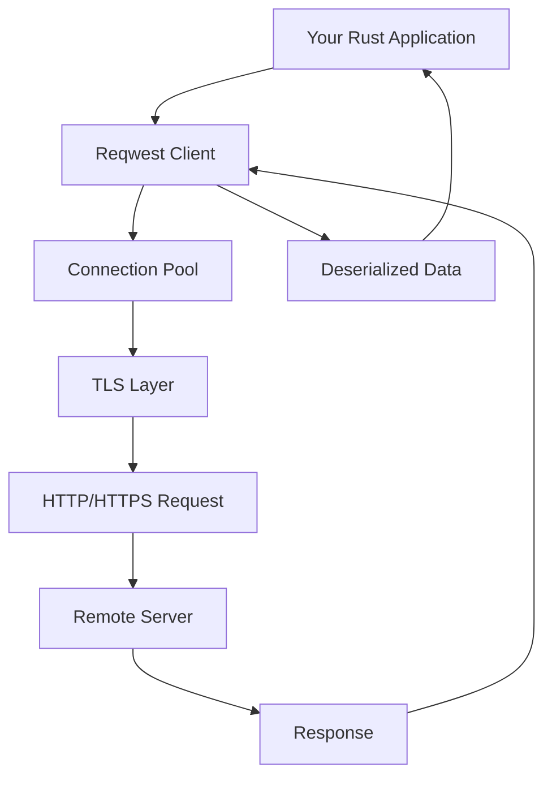
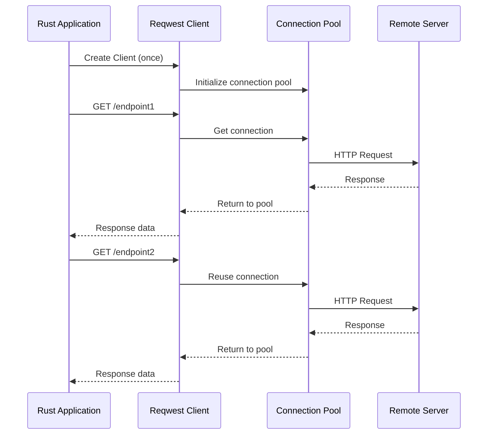
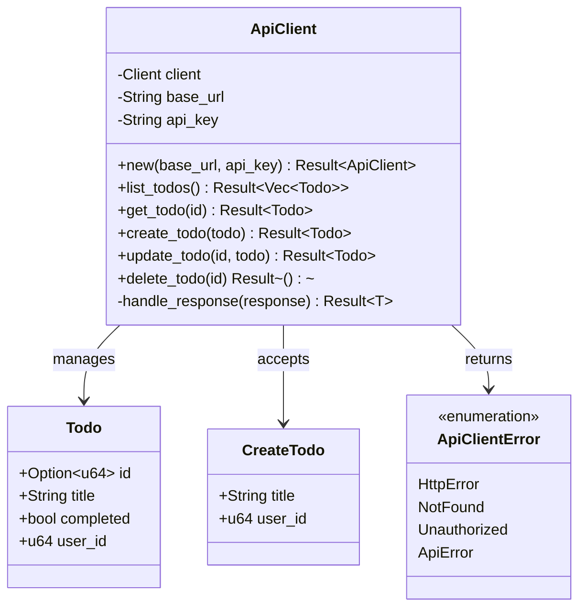

# How to Build HTTP Clients in Rust with Reqwest

Author: [nawazdhandala](https://www.github.com/nawazdhandala)

Tags: Rust, Reqwest, HTTP Client, REST API, Async Rust, Web Development, Networking

Description: A practical guide to building HTTP clients in Rust using the reqwest library, covering GET, POST, headers, JSON handling, and error management.

---

Building HTTP clients is a fundamental skill for any developer working with web services, APIs, or microservices. Rust's `reqwest` library provides a powerful, ergonomic, and type-safe way to make HTTP requests. In this guide, we'll walk through everything you need to know to build robust HTTP clients in Rust.

## Why Reqwest?

Reqwest is the most popular HTTP client library in the Rust ecosystem. It offers:

- Async and blocking APIs
- Built-in JSON serialization/deserialization with serde
- TLS/SSL support out of the box
- Cookie handling
- Proxy support
- Connection pooling
- Timeout configuration



## Setting Up Your Project

First, create a new Rust project and add the required dependencies:

```bash
cargo new http_client_demo
cd http_client_demo
```

Add these dependencies to your `Cargo.toml`:

```toml
[package]
name = "http_client_demo"
version = "0.1.0"
edition = "2021"

[dependencies]
# The main HTTP client library
reqwest = { version = "0.12", features = ["json"] }

# Async runtime - reqwest uses tokio under the hood
tokio = { version = "1", features = ["full"] }

# Serialization/deserialization for JSON
serde = { version = "1.0", features = ["derive"] }
serde_json = "1.0"

# For better error handling
thiserror = "2.0"
```

## Making Your First GET Request

Let's start with the simplest possible HTTP request:

```rust
use reqwest::Error;

#[tokio::main]
async fn main() -> Result<(), Error> {
    // Create a simple GET request to a public API
    let response = reqwest::get("https://api.github.com/users/rust-lang")
        .await?;

    // Check if the request was successful
    println!("Status: {}", response.status());

    // Get the response body as text
    let body = response.text().await?;
    println!("Body: {}", body);

    Ok(())
}
```

This example uses the convenient `reqwest::get()` function, which creates a temporary client for a single request. For production applications, you'll want to reuse a client instance.

## Creating a Reusable Client

For better performance and resource management, create a client once and reuse it:

```rust
use reqwest::Client;
use std::time::Duration;

#[tokio::main]
async fn main() -> Result<(), reqwest::Error> {
    // Build a client with custom configuration
    let client = Client::builder()
        // Set a timeout for the entire request
        .timeout(Duration::from_secs(30))
        // Set a timeout for establishing connections
        .connect_timeout(Duration::from_secs(10))
        // Enable gzip decompression
        .gzip(true)
        // Set a custom User-Agent header
        .user_agent("MyRustApp/1.0")
        // Build the client
        .build()?;

    // Now use this client for multiple requests
    let response = client
        .get("https://httpbin.org/get")
        .send()
        .await?;

    println!("Status: {}", response.status());

    Ok(())
}
```



## Working with JSON

Most modern APIs communicate using JSON. Reqwest integrates seamlessly with serde for JSON handling:

```rust
use reqwest::Client;
use serde::{Deserialize, Serialize};

// Define a struct that matches the API response
#[derive(Debug, Deserialize)]
struct GitHubUser {
    login: String,
    id: u64,
    public_repos: u32,
    followers: u32,
    following: u32,
    created_at: String,
}

// Define a struct for sending data
#[derive(Debug, Serialize)]
struct CreatePost {
    title: String,
    body: String,
    user_id: u32,
}

#[tokio::main]
async fn main() -> Result<(), Box<dyn std::error::Error>> {
    let client = Client::new();

    // GET request with automatic JSON deserialization
    let user: GitHubUser = client
        .get("https://api.github.com/users/rust-lang")
        .header("User-Agent", "MyRustApp")
        .send()
        .await?
        .json()  // Automatically deserializes JSON to our struct
        .await?;

    println!("User: {}", user.login);
    println!("Public repos: {}", user.public_repos);
    println!("Followers: {}", user.followers);

    Ok(())
}
```

## Making POST Requests

Sending data to an API is just as straightforward:

```rust
use reqwest::Client;
use serde::{Deserialize, Serialize};

#[derive(Debug, Serialize)]
struct NewUser {
    name: String,
    email: String,
    role: String,
}

#[derive(Debug, Deserialize)]
struct ApiResponse {
    id: u64,
    name: String,
    email: String,
    role: String,
    created_at: String,
}

#[tokio::main]
async fn main() -> Result<(), Box<dyn std::error::Error>> {
    let client = Client::new();

    // Create the data to send
    let new_user = NewUser {
        name: "Alice Johnson".to_string(),
        email: "alice@example.com".to_string(),
        role: "developer".to_string(),
    };

    // Send POST request with JSON body
    let response = client
        .post("https://httpbin.org/post")
        .json(&new_user)  // Automatically serializes to JSON
        .send()
        .await?;

    // Check status before processing
    if response.status().is_success() {
        let body = response.text().await?;
        println!("Success! Response: {}", body);
    } else {
        println!("Error: {}", response.status());
    }

    Ok(())
}
```

## Adding Headers and Authentication

Many APIs require authentication or custom headers:

```rust
use reqwest::{Client, header};
use std::collections::HashMap;

#[tokio::main]
async fn main() -> Result<(), Box<dyn std::error::Error>> {
    let client = Client::new();

    // Method 1: Add headers to a single request
    let response = client
        .get("https://api.example.com/data")
        .header("Authorization", "Bearer your-token-here")
        .header("Accept", "application/json")
        .header("X-Custom-Header", "custom-value")
        .send()
        .await?;

    // Method 2: Create a client with default headers
    let mut headers = header::HeaderMap::new();
    headers.insert(
        header::AUTHORIZATION,
        header::HeaderValue::from_static("Bearer your-token-here")
    );
    headers.insert(
        header::ACCEPT,
        header::HeaderValue::from_static("application/json")
    );

    let client_with_headers = Client::builder()
        .default_headers(headers)
        .build()?;

    // All requests from this client will include the default headers
    let response = client_with_headers
        .get("https://httpbin.org/headers")
        .send()
        .await?;

    println!("Response: {}", response.text().await?);

    Ok(())
}
```

## Handling Query Parameters

Building URLs with query parameters is clean and safe:

```rust
use reqwest::Client;
use serde::Deserialize;

#[derive(Debug, Deserialize)]
struct SearchResult {
    total_count: u32,
    incomplete_results: bool,
}

#[tokio::main]
async fn main() -> Result<(), Box<dyn std::error::Error>> {
    let client = Client::new();

    // Method 1: Using the query method with tuples
    let response = client
        .get("https://api.github.com/search/repositories")
        .query(&[
            ("q", "language:rust"),
            ("sort", "stars"),
            ("order", "desc"),
            ("per_page", "10"),
        ])
        .header("User-Agent", "MyRustApp")
        .send()
        .await?;

    println!("URL was: {}", response.url());

    // Method 2: Using a struct for query parameters
    #[derive(Serialize)]
    struct SearchParams {
        q: String,
        sort: String,
        order: String,
        per_page: u32,
    }

    let params = SearchParams {
        q: "language:rust".to_string(),
        sort: "stars".to_string(),
        order: "desc".to_string(),
        per_page: 10,
    };

    let response = client
        .get("https://api.github.com/search/repositories")
        .query(&params)
        .header("User-Agent", "MyRustApp")
        .send()
        .await?;

    println!("Status: {}", response.status());

    Ok(())
}

use serde::Serialize;
```

## Error Handling

Proper error handling is critical for production applications:

```rust
use reqwest::{Client, StatusCode};
use thiserror::Error;
use serde::Deserialize;

// Define custom error types for your application
#[derive(Error, Debug)]
enum ApiError {
    #[error("Network error: {0}")]
    NetworkError(#[from] reqwest::Error),

    #[error("Resource not found")]
    NotFound,

    #[error("Unauthorized - check your API key")]
    Unauthorized,

    #[error("Rate limited - try again later")]
    RateLimited,

    #[error("Server error: {0}")]
    ServerError(String),

    #[error("Unexpected status code: {0}")]
    UnexpectedStatus(StatusCode),
}

#[derive(Debug, Deserialize)]
struct User {
    login: String,
    id: u64,
}

async fn fetch_user(client: &Client, username: &str) -> Result<User, ApiError> {
    let url = format!("https://api.github.com/users/{}", username);

    let response = client
        .get(&url)
        .header("User-Agent", "MyRustApp")
        .send()
        .await?;  // Network errors are automatically converted

    // Handle different status codes appropriately
    match response.status() {
        StatusCode::OK => {
            // Parse the successful response
            let user = response.json::<User>().await?;
            Ok(user)
        }
        StatusCode::NOT_FOUND => Err(ApiError::NotFound),
        StatusCode::UNAUTHORIZED => Err(ApiError::Unauthorized),
        StatusCode::TOO_MANY_REQUESTS => Err(ApiError::RateLimited),
        status if status.is_server_error() => {
            let body = response.text().await.unwrap_or_default();
            Err(ApiError::ServerError(body))
        }
        status => Err(ApiError::UnexpectedStatus(status)),
    }
}

#[tokio::main]
async fn main() {
    let client = Client::new();

    match fetch_user(&client, "rust-lang").await {
        Ok(user) => println!("Found user: {} (ID: {})", user.login, user.id),
        Err(ApiError::NotFound) => println!("User not found"),
        Err(ApiError::RateLimited) => println!("Slow down! API rate limit hit"),
        Err(e) => println!("Error fetching user: {}", e),
    }
}
```

## Handling Timeouts

Configure timeouts at different levels for robust applications:

```rust
use reqwest::Client;
use std::time::Duration;

#[tokio::main]
async fn main() -> Result<(), Box<dyn std::error::Error>> {
    // Client-level timeouts (apply to all requests)
    let client = Client::builder()
        // Maximum time to wait for a connection to be established
        .connect_timeout(Duration::from_secs(5))
        // Maximum time for the entire request/response cycle
        .timeout(Duration::from_secs(30))
        .build()?;

    // Request-level timeout (overrides client timeout for this request)
    let response = client
        .get("https://httpbin.org/delay/2")
        .timeout(Duration::from_secs(10))  // This request has a 10s timeout
        .send()
        .await;

    match response {
        Ok(resp) => println!("Success: {}", resp.status()),
        Err(e) if e.is_timeout() => println!("Request timed out!"),
        Err(e) => println!("Other error: {}", e),
    }

    Ok(())
}
```

## Sending Form Data

For APIs that expect form-encoded data instead of JSON:

```rust
use reqwest::Client;
use std::collections::HashMap;

#[tokio::main]
async fn main() -> Result<(), Box<dyn std::error::Error>> {
    let client = Client::new();

    // Method 1: Using a HashMap
    let mut form_data = HashMap::new();
    form_data.insert("username", "alice");
    form_data.insert("password", "secret123");

    let response = client
        .post("https://httpbin.org/post")
        .form(&form_data)
        .send()
        .await?;

    println!("Form submission: {}", response.status());

    // Method 2: Using tuples (cleaner for small forms)
    let response = client
        .post("https://httpbin.org/post")
        .form(&[
            ("grant_type", "password"),
            ("username", "user@example.com"),
            ("password", "mypassword"),
        ])
        .send()
        .await?;

    println!("OAuth-style form: {}", response.status());

    Ok(())
}
```

## Building a Practical API Client

Let's put everything together in a real-world example - a simple REST API client:

```rust
use reqwest::{Client, StatusCode};
use serde::{Deserialize, Serialize};
use std::time::Duration;
use thiserror::Error;

// API client structure
pub struct ApiClient {
    client: Client,
    base_url: String,
    api_key: String,
}

// Domain models
#[derive(Debug, Serialize, Deserialize)]
pub struct Todo {
    #[serde(skip_serializing_if = "Option::is_none")]
    pub id: Option<u64>,
    pub title: String,
    pub completed: bool,
    pub user_id: u64,
}

#[derive(Debug, Serialize)]
pub struct CreateTodo {
    pub title: String,
    pub user_id: u64,
}

// Custom error type
#[derive(Error, Debug)]
pub enum ApiClientError {
    #[error("HTTP error: {0}")]
    HttpError(#[from] reqwest::Error),

    #[error("Not found")]
    NotFound,

    #[error("Unauthorized")]
    Unauthorized,

    #[error("API error: {status} - {message}")]
    ApiError { status: StatusCode, message: String },
}

impl ApiClient {
    // Constructor with sensible defaults
    pub fn new(base_url: &str, api_key: &str) -> Result<Self, reqwest::Error> {
        let client = Client::builder()
            .timeout(Duration::from_secs(30))
            .connect_timeout(Duration::from_secs(10))
            .gzip(true)
            .build()?;

        Ok(Self {
            client,
            base_url: base_url.to_string(),
            api_key: api_key.to_string(),
        })
    }

    // Helper method to build full URL
    fn url(&self, path: &str) -> String {
        format!("{}{}", self.base_url, path)
    }

    // List all todos
    pub async fn list_todos(&self) -> Result<Vec<Todo>, ApiClientError> {
        let response = self.client
            .get(self.url("/todos"))
            .header("Authorization", format!("Bearer {}", self.api_key))
            .send()
            .await?;

        self.handle_response(response).await
    }

    // Get a single todo by ID
    pub async fn get_todo(&self, id: u64) -> Result<Todo, ApiClientError> {
        let response = self.client
            .get(self.url(&format!("/todos/{}", id)))
            .header("Authorization", format!("Bearer {}", self.api_key))
            .send()
            .await?;

        self.handle_response(response).await
    }

    // Create a new todo
    pub async fn create_todo(&self, todo: CreateTodo) -> Result<Todo, ApiClientError> {
        let response = self.client
            .post(self.url("/todos"))
            .header("Authorization", format!("Bearer {}", self.api_key))
            .json(&todo)
            .send()
            .await?;

        self.handle_response(response).await
    }

    // Update an existing todo
    pub async fn update_todo(&self, id: u64, todo: &Todo) -> Result<Todo, ApiClientError> {
        let response = self.client
            .put(self.url(&format!("/todos/{}", id)))
            .header("Authorization", format!("Bearer {}", self.api_key))
            .json(todo)
            .send()
            .await?;

        self.handle_response(response).await
    }

    // Delete a todo
    pub async fn delete_todo(&self, id: u64) -> Result<(), ApiClientError> {
        let response = self.client
            .delete(self.url(&format!("/todos/{}", id)))
            .header("Authorization", format!("Bearer {}", self.api_key))
            .send()
            .await?;

        match response.status() {
            StatusCode::OK | StatusCode::NO_CONTENT => Ok(()),
            StatusCode::NOT_FOUND => Err(ApiClientError::NotFound),
            StatusCode::UNAUTHORIZED => Err(ApiClientError::Unauthorized),
            status => {
                let message = response.text().await.unwrap_or_default();
                Err(ApiClientError::ApiError { status, message })
            }
        }
    }

    // Generic response handler
    async fn handle_response<T: for<'de> Deserialize<'de>>(
        &self,
        response: reqwest::Response,
    ) -> Result<T, ApiClientError> {
        match response.status() {
            StatusCode::OK | StatusCode::CREATED => {
                Ok(response.json().await?)
            }
            StatusCode::NOT_FOUND => Err(ApiClientError::NotFound),
            StatusCode::UNAUTHORIZED => Err(ApiClientError::Unauthorized),
            status => {
                let message = response.text().await.unwrap_or_default();
                Err(ApiClientError::ApiError { status, message })
            }
        }
    }
}

// Usage example
#[tokio::main]
async fn main() -> Result<(), Box<dyn std::error::Error>> {
    // Initialize the client
    let client = ApiClient::new(
        "https://jsonplaceholder.typicode.com",
        "your-api-key"
    )?;

    // List todos
    println!("Fetching todos...");
    let todos = client.list_todos().await?;
    println!("Found {} todos", todos.len());

    // Get a specific todo
    let todo = client.get_todo(1).await?;
    println!("Todo 1: {:?}", todo);

    // Create a new todo
    let new_todo = CreateTodo {
        title: "Learn Rust HTTP clients".to_string(),
        user_id: 1,
    };
    let created = client.create_todo(new_todo).await?;
    println!("Created: {:?}", created);

    Ok(())
}
```



## Best Practices Summary

1. **Reuse clients**: Create one `Client` instance and reuse it. Connection pooling improves performance.

2. **Set timeouts**: Always configure timeouts to prevent requests from hanging indefinitely.

3. **Handle errors properly**: Match on status codes and convert them to meaningful domain errors.

4. **Use strong types**: Define structs for your request and response bodies instead of using raw JSON.

5. **Add appropriate headers**: Include User-Agent, Accept, and Authorization headers as needed.

6. **Configure for production**: Enable compression, set reasonable timeouts, and consider retry logic.

## Conclusion

Reqwest makes building HTTP clients in Rust both safe and ergonomic. Starting with simple GET requests and building up to a full-featured API client, you now have the foundation to interact with any REST API from your Rust applications.

The type system ensures you handle errors at compile time, serde integration makes JSON handling seamless, and async support means your applications can efficiently handle many concurrent requests.

For more advanced patterns like retry logic and middleware, check out the companion articles on building resilient HTTP clients and middleware patterns in Rust.
