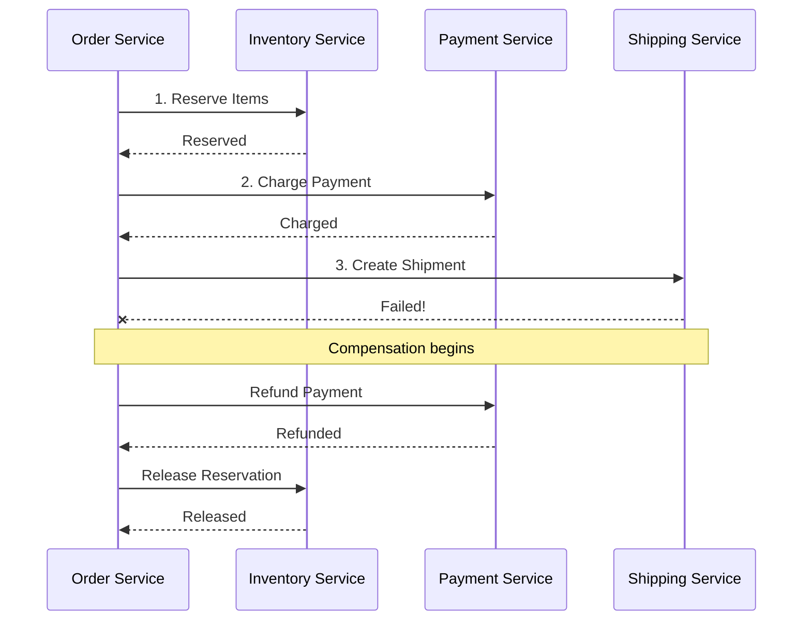

# How to Implement Saga Pattern in Node.js

Author: [nawazdhandala](https://www.github.com/nawazdhandala)

Tags: NodeJS, TypeScript, Microservices, Distributed Systems, Transactions, Backend

Description: Learn how to implement the Saga pattern in Node.js for managing distributed transactions across microservices with compensation logic and rollback capabilities.

---

Distributed transactions across microservices are hard. You cannot use traditional database transactions when your data spans multiple services. The Saga pattern solves this by breaking a transaction into a sequence of local transactions, each with a compensating action to undo its effects if something fails later in the chain.

## Understanding the Saga Pattern

A saga is a sequence of transactions where each step either succeeds or triggers compensations for all previous steps. Consider an e-commerce order flow:

1. Reserve inventory
2. Charge payment
3. Create shipment

If payment fails, you must release the inventory reservation. If shipment creation fails, you must refund the payment and release inventory.



## Saga Step Definition

Start by defining what a saga step looks like. Each step has an action to execute and a compensating action to undo it.

```typescript
// saga-types.ts
// Core types for saga orchestration

interface SagaStep<TContext> {
  name: string;
  // The forward action to execute
  execute: (context: TContext) => Promise<void>;
  // The compensation action to undo the execute action
  compensate: (context: TContext) => Promise<void>;
}

interface SagaResult<TContext> {
  success: boolean;
  context: TContext;
  completedSteps: string[];
  failedStep?: string;
  error?: Error;
}

interface SagaOptions {
  // Maximum retries for each step
  maxRetries?: number;
  // Delay between retries in milliseconds
  retryDelay?: number;
  // Timeout for each step in milliseconds
  stepTimeout?: number;
  // Called when a step completes
  onStepComplete?: (stepName: string) => void;
  // Called when compensation runs
  onCompensate?: (stepName: string) => void;
}
```

## Basic Saga Orchestrator

The orchestrator runs steps in sequence and handles compensation when failures occur.

```typescript
// saga-orchestrator.ts
import { SagaStep, SagaResult, SagaOptions } from './saga-types';

class SagaOrchestrator<TContext> {
  private steps: SagaStep<TContext>[] = [];
  private options: Required<SagaOptions>;

  constructor(options: SagaOptions = {}) {
    this.options = {
      maxRetries: options.maxRetries ?? 3,
      retryDelay: options.retryDelay ?? 1000,
      stepTimeout: options.stepTimeout ?? 30000,
      onStepComplete: options.onStepComplete ?? (() => {}),
      onCompensate: options.onCompensate ?? (() => {}),
    };
  }

  // Add a step to the saga
  addStep(step: SagaStep<TContext>): this {
    this.steps.push(step);
    return this;
  }

  // Execute the saga
  async execute(initialContext: TContext): Promise<SagaResult<TContext>> {
    const context = { ...initialContext };
    const completedSteps: string[] = [];

    for (const step of this.steps) {
      try {
        // Execute step with retry logic
        await this.executeStepWithRetry(step, context);
        completedSteps.push(step.name);
        this.options.onStepComplete(step.name);
      } catch (error) {
        // Step failed, run compensations
        console.error(`Step "${step.name}" failed:`, error);

        await this.compensate(completedSteps, context);

        return {
          success: false,
          context,
          completedSteps,
          failedStep: step.name,
          error: error as Error,
        };
      }
    }

    return {
      success: true,
      context,
      completedSteps,
    };
  }

  // Execute a single step with retries
  private async executeStepWithRetry(
    step: SagaStep<TContext>,
    context: TContext
  ): Promise<void> {
    let lastError: Error | undefined;

    for (let attempt = 1; attempt <= this.options.maxRetries; attempt++) {
      try {
        // Wrap in timeout
        await Promise.race([
          step.execute(context),
          this.timeout(this.options.stepTimeout, step.name),
        ]);
        return; // Success
      } catch (error) {
        lastError = error as Error;
        console.warn(
          `Step "${step.name}" attempt ${attempt} failed:`,
          error
        );

        if (attempt < this.options.maxRetries) {
          await this.delay(this.options.retryDelay * attempt);
        }
      }
    }

    throw lastError;
  }

  // Run compensations in reverse order
  private async compensate(
    completedSteps: string[],
    context: TContext
  ): Promise<void> {
    // Reverse order for compensation
    const stepsToCompensate = [...completedSteps].reverse();

    for (const stepName of stepsToCompensate) {
      const step = this.steps.find(s => s.name === stepName);
      if (!step) continue;

      try {
        this.options.onCompensate(stepName);
        await step.compensate(context);
        console.log(`Compensated step: ${stepName}`);
      } catch (error) {
        // Log but continue compensating other steps
        console.error(`Failed to compensate step "${stepName}":`, error);
      }
    }
  }

  private timeout(ms: number, stepName: string): Promise<never> {
    return new Promise((_, reject) => {
      setTimeout(() => {
        reject(new Error(`Step "${stepName}" timed out after ${ms}ms`));
      }, ms);
    });
  }

  private delay(ms: number): Promise<void> {
    return new Promise(resolve => setTimeout(resolve, ms));
  }
}

export { SagaOrchestrator };
```

## Order Processing Saga Example

Here is a complete example of an order processing saga with real service calls.

```typescript
// order-saga.ts
import { SagaOrchestrator } from './saga-orchestrator';
import { SagaStep } from './saga-types';

// Context passed through all saga steps
interface OrderContext {
  orderId: string;
  userId: string;
  items: Array<{ productId: string; quantity: number }>;
  totalAmount: number;
  // Results from steps
  reservationId?: string;
  paymentId?: string;
  shipmentId?: string;
}

// Inventory service client
const inventoryService = {
  async reserveItems(orderId: string, items: OrderContext['items']): Promise<string> {
    const response = await fetch('http://inventory-service/reservations', {
      method: 'POST',
      headers: { 'Content-Type': 'application/json' },
      body: JSON.stringify({ orderId, items }),
    });

    if (!response.ok) {
      throw new Error(`Inventory reservation failed: ${response.status}`);
    }

    const data = await response.json();
    return data.reservationId;
  },

  async releaseReservation(reservationId: string): Promise<void> {
    await fetch(`http://inventory-service/reservations/${reservationId}`, {
      method: 'DELETE',
    });
  },
};

// Payment service client
const paymentService = {
  async charge(userId: string, amount: number, orderId: string): Promise<string> {
    const response = await fetch('http://payment-service/charges', {
      method: 'POST',
      headers: { 'Content-Type': 'application/json' },
      body: JSON.stringify({ userId, amount, orderId }),
    });

    if (!response.ok) {
      throw new Error(`Payment charge failed: ${response.status}`);
    }

    const data = await response.json();
    return data.paymentId;
  },

  async refund(paymentId: string): Promise<void> {
    await fetch(`http://payment-service/charges/${paymentId}/refund`, {
      method: 'POST',
    });
  },
};

// Shipping service client
const shippingService = {
  async createShipment(orderId: string, userId: string): Promise<string> {
    const response = await fetch('http://shipping-service/shipments', {
      method: 'POST',
      headers: { 'Content-Type': 'application/json' },
      body: JSON.stringify({ orderId, userId }),
    });

    if (!response.ok) {
      throw new Error(`Shipment creation failed: ${response.status}`);
    }

    const data = await response.json();
    return data.shipmentId;
  },

  async cancelShipment(shipmentId: string): Promise<void> {
    await fetch(`http://shipping-service/shipments/${shipmentId}/cancel`, {
      method: 'POST',
    });
  },
};

// Define saga steps
const reserveInventoryStep: SagaStep<OrderContext> = {
  name: 'reserve-inventory',

  async execute(context) {
    console.log(`Reserving inventory for order ${context.orderId}`);
    context.reservationId = await inventoryService.reserveItems(
      context.orderId,
      context.items
    );
  },

  async compensate(context) {
    if (context.reservationId) {
      console.log(`Releasing reservation ${context.reservationId}`);
      await inventoryService.releaseReservation(context.reservationId);
    }
  },
};

const chargePaymentStep: SagaStep<OrderContext> = {
  name: 'charge-payment',

  async execute(context) {
    console.log(`Charging payment for order ${context.orderId}`);
    context.paymentId = await paymentService.charge(
      context.userId,
      context.totalAmount,
      context.orderId
    );
  },

  async compensate(context) {
    if (context.paymentId) {
      console.log(`Refunding payment ${context.paymentId}`);
      await paymentService.refund(context.paymentId);
    }
  },
};

const createShipmentStep: SagaStep<OrderContext> = {
  name: 'create-shipment',

  async execute(context) {
    console.log(`Creating shipment for order ${context.orderId}`);
    context.shipmentId = await shippingService.createShipment(
      context.orderId,
      context.userId
    );
  },

  async compensate(context) {
    if (context.shipmentId) {
      console.log(`Canceling shipment ${context.shipmentId}`);
      await shippingService.cancelShipment(context.shipmentId);
    }
  },
};

// Build and execute the saga
async function processOrder(order: Omit<OrderContext, 'reservationId' | 'paymentId' | 'shipmentId'>) {
  const saga = new SagaOrchestrator<OrderContext>({
    maxRetries: 3,
    retryDelay: 1000,
    stepTimeout: 10000,
    onStepComplete: (name) => console.log(`Completed: ${name}`),
    onCompensate: (name) => console.log(`Compensating: ${name}`),
  });

  saga
    .addStep(reserveInventoryStep)
    .addStep(chargePaymentStep)
    .addStep(createShipmentStep);

  const result = await saga.execute(order as OrderContext);

  if (result.success) {
    console.log('Order processed successfully', {
      reservationId: result.context.reservationId,
      paymentId: result.context.paymentId,
      shipmentId: result.context.shipmentId,
    });
  } else {
    console.error('Order processing failed', {
      failedStep: result.failedStep,
      error: result.error?.message,
    });
  }

  return result;
}

export { processOrder };
```

## Persistent Saga State

For production systems, saga state should be persisted so recovery is possible after process restarts.

```typescript
// persistent-saga.ts
import { Pool } from 'pg';

interface SagaState {
  id: string;
  name: string;
  status: 'running' | 'completed' | 'failed' | 'compensating';
  context: Record<string, unknown>;
  completedSteps: string[];
  failedStep?: string;
  error?: string;
  createdAt: Date;
  updatedAt: Date;
}

class PersistentSagaStore {
  constructor(private pool: Pool) {}

  async create(saga: Omit<SagaState, 'createdAt' | 'updatedAt'>): Promise<void> {
    await this.pool.query(
      `INSERT INTO sagas (id, name, status, context, completed_steps, created_at, updated_at)
       VALUES ($1, $2, $3, $4, $5, NOW(), NOW())`,
      [saga.id, saga.name, saga.status, JSON.stringify(saga.context), saga.completedSteps]
    );
  }

  async update(id: string, updates: Partial<SagaState>): Promise<void> {
    const sets: string[] = ['updated_at = NOW()'];
    const values: unknown[] = [];
    let paramIndex = 1;

    if (updates.status) {
      sets.push(`status = $${paramIndex++}`);
      values.push(updates.status);
    }
    if (updates.context) {
      sets.push(`context = $${paramIndex++}`);
      values.push(JSON.stringify(updates.context));
    }
    if (updates.completedSteps) {
      sets.push(`completed_steps = $${paramIndex++}`);
      values.push(updates.completedSteps);
    }
    if (updates.failedStep) {
      sets.push(`failed_step = $${paramIndex++}`);
      values.push(updates.failedStep);
    }
    if (updates.error) {
      sets.push(`error = $${paramIndex++}`);
      values.push(updates.error);
    }

    values.push(id);
    await this.pool.query(
      `UPDATE sagas SET ${sets.join(', ')} WHERE id = $${paramIndex}`,
      values
    );
  }

  async get(id: string): Promise<SagaState | null> {
    const result = await this.pool.query(
      'SELECT * FROM sagas WHERE id = $1',
      [id]
    );
    return result.rows[0] || null;
  }

  async getIncomplete(): Promise<SagaState[]> {
    const result = await this.pool.query(
      `SELECT * FROM sagas WHERE status IN ('running', 'compensating')
       ORDER BY created_at ASC`
    );
    return result.rows;
  }
}

// Saga orchestrator with persistence
class PersistentSagaOrchestrator<TContext extends Record<string, unknown>> {
  constructor(
    private store: PersistentSagaStore,
    private sagaName: string,
    private steps: SagaStep<TContext>[]
  ) {}

  async execute(sagaId: string, initialContext: TContext): Promise<SagaResult<TContext>> {
    // Create saga record
    await this.store.create({
      id: sagaId,
      name: this.sagaName,
      status: 'running',
      context: initialContext,
      completedSteps: [],
    });

    const context = { ...initialContext };
    const completedSteps: string[] = [];

    for (const step of this.steps) {
      try {
        await step.execute(context);
        completedSteps.push(step.name);

        // Persist progress after each step
        await this.store.update(sagaId, {
          context,
          completedSteps,
        });
      } catch (error) {
        await this.store.update(sagaId, {
          status: 'compensating',
          failedStep: step.name,
          error: (error as Error).message,
        });

        await this.compensate(sagaId, completedSteps, context);

        await this.store.update(sagaId, { status: 'failed' });

        return {
          success: false,
          context,
          completedSteps,
          failedStep: step.name,
          error: error as Error,
        };
      }
    }

    await this.store.update(sagaId, { status: 'completed' });

    return { success: true, context, completedSteps };
  }

  private async compensate(
    sagaId: string,
    completedSteps: string[],
    context: TContext
  ): Promise<void> {
    const reversed = [...completedSteps].reverse();

    for (const stepName of reversed) {
      const step = this.steps.find(s => s.name === stepName);
      if (!step) continue;

      try {
        await step.compensate(context);
      } catch (error) {
        console.error(`Compensation failed for ${stepName}:`, error);
      }
    }
  }

  // Recover incomplete sagas after restart
  async recover(): Promise<void> {
    const incomplete = await this.store.getIncomplete();

    for (const saga of incomplete) {
      if (saga.name !== this.sagaName) continue;

      console.log(`Recovering saga ${saga.id}`);

      if (saga.status === 'running') {
        // Resume from where it left off or compensate
        await this.compensate(
          saga.id,
          saga.completedSteps,
          saga.context as TContext
        );
        await this.store.update(saga.id, { status: 'failed' });
      } else if (saga.status === 'compensating') {
        // Continue compensation
        await this.compensate(
          saga.id,
          saga.completedSteps,
          saga.context as TContext
        );
        await this.store.update(saga.id, { status: 'failed' });
      }
    }
  }
}

export { PersistentSagaStore, PersistentSagaOrchestrator };
```

## Parallel Steps in Sagas

Some saga steps can run in parallel when they do not depend on each other.

```typescript
// parallel-saga.ts
// Support for parallel step execution within a saga

interface ParallelStepGroup<TContext> {
  type: 'parallel';
  steps: SagaStep<TContext>[];
}

type SagaStepOrGroup<TContext> = SagaStep<TContext> | ParallelStepGroup<TContext>;

class ParallelSagaOrchestrator<TContext> {
  private steps: SagaStepOrGroup<TContext>[] = [];

  addStep(step: SagaStep<TContext>): this {
    this.steps.push(step);
    return this;
  }

  // Add multiple steps that can run in parallel
  addParallelSteps(steps: SagaStep<TContext>[]): this {
    this.steps.push({ type: 'parallel', steps });
    return this;
  }

  async execute(context: TContext): Promise<SagaResult<TContext>> {
    const completedSteps: string[] = [];

    for (const stepOrGroup of this.steps) {
      try {
        if ('type' in stepOrGroup && stepOrGroup.type === 'parallel') {
          // Execute steps in parallel
          await Promise.all(
            stepOrGroup.steps.map(step => step.execute(context))
          );
          completedSteps.push(...stepOrGroup.steps.map(s => s.name));
        } else {
          // Single step
          await (stepOrGroup as SagaStep<TContext>).execute(context);
          completedSteps.push((stepOrGroup as SagaStep<TContext>).name);
        }
      } catch (error) {
        // Compensate in reverse
        await this.compensate(completedSteps, context);

        return {
          success: false,
          context,
          completedSteps,
          error: error as Error,
        };
      }
    }

    return { success: true, context, completedSteps };
  }

  private async compensate(completedSteps: string[], context: TContext): Promise<void> {
    const allSteps = this.steps.flatMap(s =>
      'type' in s ? s.steps : [s]
    );

    const reversed = [...completedSteps].reverse();

    for (const stepName of reversed) {
      const step = allSteps.find(s => s.name === stepName);
      if (step) {
        try {
          await step.compensate(context);
        } catch (e) {
          console.error(`Compensation failed: ${stepName}`);
        }
      }
    }
  }
}

// Example with parallel steps
const saga = new ParallelSagaOrchestrator<OrderContext>();

saga
  .addStep(reserveInventoryStep)
  // These two can run in parallel since they are independent
  .addParallelSteps([
    notifyWarehouseStep,
    sendConfirmationEmailStep,
  ])
  .addStep(chargePaymentStep);
```

## Summary

| Concept | Purpose |
|---------|---------|
| Saga steps | Define action and compensation pairs |
| Orchestrator | Executes steps and manages compensation |
| Persistence | Enables recovery after failures |
| Parallel steps | Improves performance for independent operations |
| Retries | Handles transient failures |

The Saga pattern provides a way to maintain data consistency across microservices without distributed transactions. By defining clear compensation logic for each step, your system can recover gracefully from failures at any point in a complex workflow.
