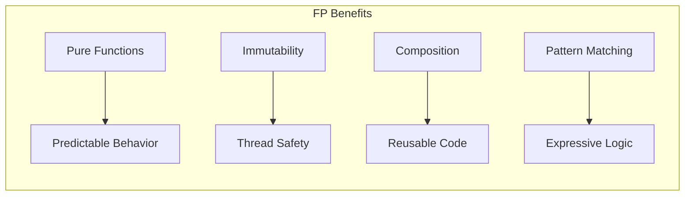
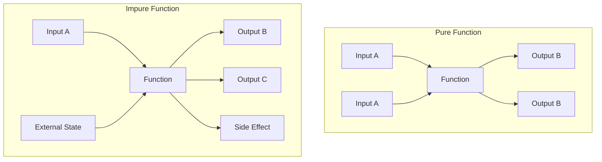
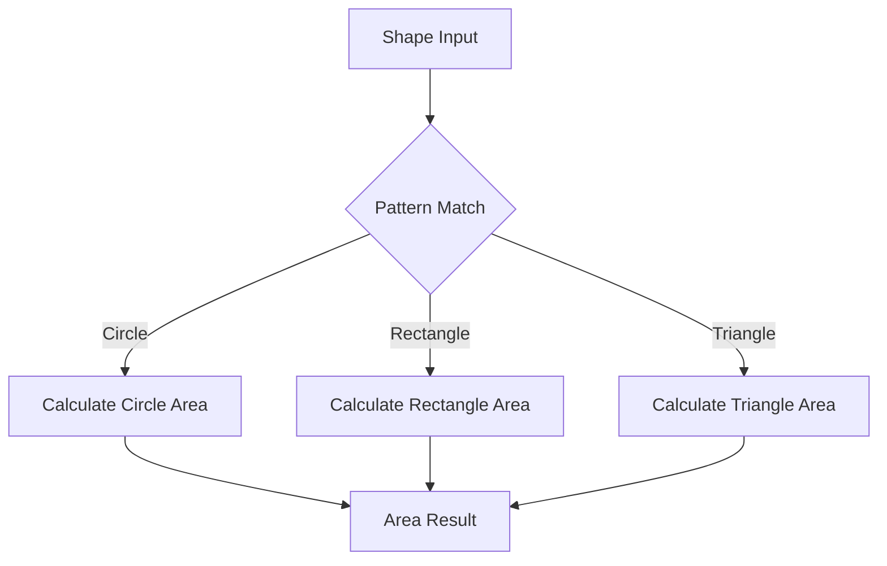
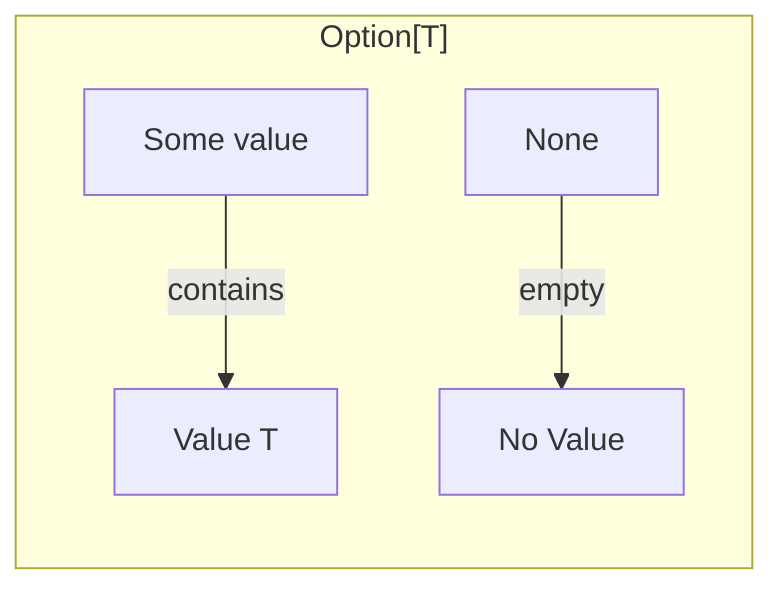
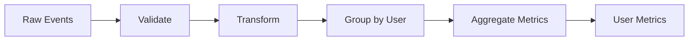

# How to Implement Functional Programming in Scala

Author: [nawazdhandala](https://www.github.com/nawazdhandala)

Tags: Scala, Functional Programming, Immutability, Higher-Order Functions, Pattern Matching, JVM

Description: A practical guide to functional programming in Scala covering immutability, pure functions, higher-order functions, pattern matching, and real-world application patterns.

---

Scala combines object-oriented and functional programming paradigms, making it an excellent language for building robust, maintainable applications. This guide walks through the core functional programming concepts in Scala with practical examples you can use in production code.

## Why Functional Programming?

Functional programming offers several advantages for modern software development:



- **Predictability**: Pure functions always return the same output for the same input
- **Testability**: No hidden state means easier unit testing
- **Concurrency**: Immutable data eliminates race conditions
- **Composition**: Small functions combine into complex operations

## Setting Up a Scala Project

Create a new Scala project with sbt (Scala Build Tool):

```bash
# Create project directory
mkdir scala-fp-demo && cd scala-fp-demo

# Create build.sbt
cat > build.sbt << 'EOF'
name := "scala-fp-demo"
version := "1.0.0"
scalaVersion := "3.3.1"

libraryDependencies ++= Seq(
  "org.typelevel" %% "cats-core" % "2.10.0",
  "org.scalatest" %% "scalatest" % "3.2.17" % Test
)
EOF

# Create source directories
mkdir -p src/main/scala src/test/scala
```

## Immutability: The Foundation

In functional programming, data should not change after creation. Scala provides `val` for immutable values and immutable collections by default.

### Immutable Values

```scala
// Immutable - preferred in FP
val name = "Alice"
// name = "Bob"  // Compilation error: reassignment to val

// Mutable - avoid when possible
var counter = 0
counter = 1  // Works, but not recommended
```

### Immutable Collections

```scala
// Immutable List - default in Scala
val numbers = List(1, 2, 3, 4, 5)

// Operations return new collections, original unchanged
val doubled = numbers.map(_ * 2)
// numbers is still List(1, 2, 3, 4, 5)
// doubled is List(2, 4, 6, 8, 10)

// Immutable Map
val users = Map(
  1 -> "Alice",
  2 -> "Bob",
  3 -> "Charlie"
)

// Adding returns a new Map
val updatedUsers = users + (4 -> "Diana")
// users still has 3 entries
// updatedUsers has 4 entries
```

### Case Classes for Immutable Data

Case classes are perfect for modeling immutable domain objects:

```scala
// Define an immutable data structure
case class User(
  id: Long,
  name: String,
  email: String,
  active: Boolean = true
)

// Create instances
val alice = User(1, "Alice", "alice@example.com")

// "Update" creates a new instance with copy
val inactiveAlice = alice.copy(active = false)

// Original unchanged
println(alice.active)        // true
println(inactiveAlice.active) // false
```

## Pure Functions

Pure functions have two properties:
1. Same input always produces same output
2. No side effects (no I/O, no mutation, no exceptions)



### Pure Function Examples

```scala
// Pure: same input always gives same output
def add(a: Int, b: Int): Int = a + b

def calculateDiscount(price: Double, percentage: Double): Double =
  price * (percentage / 100)

// Pure: transforms data without side effects
def formatUserName(user: User): String =
  s"${user.name} <${user.email}>"

// Test pure functions easily
assert(add(2, 3) == 5)
assert(add(2, 3) == 5)  // Always true, guaranteed
```

### Impure Functions to Avoid

```scala
// Impure: depends on external state
var globalCounter = 0
def incrementCounter(): Int = {
  globalCounter += 1  // Side effect: mutation
  globalCounter
}

// Impure: performs I/O
def logMessage(msg: String): Unit =
  println(msg)  // Side effect: I/O

// Impure: depends on current time
def getCurrentTimestamp(): Long =
  System.currentTimeMillis()  // Different output each call
```

### Converting Impure to Pure

```scala
// Instead of depending on global state, pass state as parameter
def incrementCounter(counter: Int): Int = counter + 1

// Instead of performing I/O, return data to be logged
case class LogEntry(level: String, message: String)
def createLogEntry(level: String, msg: String): LogEntry =
  LogEntry(level, msg)

// Instead of getting current time, accept time as parameter
def formatTimestamp(timestamp: Long): String =
  java.time.Instant.ofEpochMilli(timestamp).toString
```

## Higher-Order Functions

Functions that take other functions as parameters or return functions.

### Common Higher-Order Functions

```scala
val numbers = List(1, 2, 3, 4, 5, 6, 7, 8, 9, 10)

// map: transform each element
val squared = numbers.map(n => n * n)
// List(1, 4, 9, 16, 25, 36, 49, 64, 81, 100)

// filter: keep elements matching predicate
val evens = numbers.filter(n => n % 2 == 0)
// List(2, 4, 6, 8, 10)

// reduce: combine all elements into one
val sum = numbers.reduce((a, b) => a + b)
// 55

// fold: reduce with initial value
val product = numbers.fold(1)((acc, n) => acc * n)
// 3628800

// flatMap: map then flatten
val nestedData = List(List(1, 2), List(3, 4), List(5, 6))
val flattened = nestedData.flatMap(identity)
// List(1, 2, 3, 4, 5, 6)
```

### Function Composition

Build complex operations from simple ones:

```scala
// Define simple transformation functions
val double: Int => Int = _ * 2
val addTen: Int => Int = _ + 10
val square: Int => Int = n => n * n

// Compose functions with andThen (left to right)
val doubleThenAddTen = double.andThen(addTen)
doubleThenAddTen(5)  // (5 * 2) + 10 = 20

// Compose with compose (right to left)
val addTenThenDouble = double.compose(addTen)
addTenThenDouble(5)  // (5 + 10) * 2 = 30

// Chain multiple transformations
val complexTransform = double.andThen(addTen).andThen(square)
complexTransform(3)  // ((3 * 2) + 10)^2 = 256
```

### Creating Custom Higher-Order Functions

```scala
// Function that returns a function
def multiplier(factor: Int): Int => Int =
  (n: Int) => n * factor

val triple = multiplier(3)
val quadruple = multiplier(4)

triple(5)     // 15
quadruple(5)  // 20

// Function that takes a function and enhances it
def withLogging[A, B](f: A => B, name: String): A => B =
  (a: A) => {
    val result = f(a)
    println(s"$name($a) = $result")  // Side effect for demo
    result
  }

val loggedDouble = withLogging(double, "double")
loggedDouble(5)  // Prints: double(5) = 10, returns 10
```

## Pattern Matching

Pattern matching is one of Scala's most powerful features for handling different cases elegantly.

### Basic Pattern Matching

```scala
def describe(x: Any): String = x match {
  case 0 => "zero"
  case n: Int if n > 0 => s"positive integer: $n"
  case n: Int => s"negative integer: $n"
  case s: String => s"string of length ${s.length}"
  case (a, b) => s"tuple: ($a, $b)"
  case list: List[_] => s"list with ${list.length} elements"
  case _ => "something else"
}

describe(0)           // "zero"
describe(42)          // "positive integer: 42"
describe(-5)          // "negative integer: -5"
describe("hello")     // "string of length 5"
describe((1, "a"))    // "tuple: (1, a)"
describe(List(1,2,3)) // "list with 3 elements"
```

### Pattern Matching with Case Classes

```scala
// Define a domain model using sealed traits and case classes
sealed trait Shape
case class Circle(radius: Double) extends Shape
case class Rectangle(width: Double, height: Double) extends Shape
case class Triangle(base: Double, height: Double) extends Shape

// Pattern match on shape type
def area(shape: Shape): Double = shape match {
  case Circle(r) => Math.PI * r * r
  case Rectangle(w, h) => w * h
  case Triangle(b, h) => 0.5 * b * h
}

area(Circle(5))           // 78.54...
area(Rectangle(4, 6))     // 24.0
area(Triangle(3, 4))      // 6.0
```

### Exhaustive Pattern Matching



Using `sealed` traits ensures the compiler warns about missing cases:

```scala
sealed trait PaymentStatus
case object Pending extends PaymentStatus
case object Completed extends PaymentStatus
case object Failed extends PaymentStatus
case class Refunded(reason: String) extends PaymentStatus

def handlePayment(status: PaymentStatus): String = status match {
  case Pending => "Processing payment..."
  case Completed => "Payment successful!"
  case Failed => "Payment failed. Please try again."
  case Refunded(reason) => s"Payment refunded: $reason"
}
// Compiler warns if any case is missing
```

## Option: Handling Absence of Values

Avoid null with `Option[T]` - a container that may or may not hold a value.



### Using Option

```scala
// Define functions that might not return a value
def findUser(id: Long): Option[User] =
  if (id == 1) Some(User(1, "Alice", "alice@example.com"))
  else None

def parseNumber(s: String): Option[Int] =
  try Some(s.toInt)
  catch { case _: NumberFormatException => None }

// Safe operations with Option
val maybeUser = findUser(1)

// Pattern matching
maybeUser match {
  case Some(user) => println(s"Found: ${user.name}")
  case None => println("User not found")
}

// map: transform if present
val maybeName: Option[String] = maybeUser.map(_.name)

// flatMap: chain operations that return Option
def getUserEmail(id: Long): Option[String] =
  findUser(id).map(_.email)

// getOrElse: provide default value
val name = maybeUser.map(_.name).getOrElse("Unknown")

// fold: handle both cases
val greeting = maybeUser.fold("Hello, Guest!")(u => s"Hello, ${u.name}!")
```

### Chaining Option Operations

```scala
case class Address(city: String, country: String)
case class Company(name: String, address: Option[Address])
case class Employee(name: String, company: Option[Company])

def getEmployeeCountry(employee: Employee): Option[String] =
  for {
    company <- employee.company
    address <- company.address
  } yield address.country

// Equivalent to:
def getEmployeeCountryExplicit(employee: Employee): Option[String] =
  employee.company
    .flatMap(_.address)
    .map(_.country)

val emp = Employee(
  "Alice",
  Some(Company("TechCorp", Some(Address("London", "UK"))))
)

getEmployeeCountry(emp)  // Some("UK")
```

## Either: Handling Errors Functionally

`Either[E, A]` represents a value that can be one of two types - typically an error (Left) or success (Right).

```scala
// Define domain errors
sealed trait ValidationError
case class InvalidEmail(email: String) extends ValidationError
case class InvalidAge(age: Int) extends ValidationError
case class EmptyName() extends ValidationError

// Validation functions return Either
def validateEmail(email: String): Either[ValidationError, String] =
  if (email.contains("@")) Right(email)
  else Left(InvalidEmail(email))

def validateAge(age: Int): Either[ValidationError, Int] =
  if (age >= 0 && age <= 150) Right(age)
  else Left(InvalidAge(age))

def validateName(name: String): Either[ValidationError, String] =
  if (name.nonEmpty) Right(name)
  else Left(EmptyName())
```

### Chaining Either Operations

```scala
case class ValidatedUser(name: String, email: String, age: Int)

def createUser(
  name: String,
  email: String,
  age: Int
): Either[ValidationError, ValidatedUser] =
  for {
    validName <- validateName(name)
    validEmail <- validateEmail(email)
    validAge <- validateAge(age)
  } yield ValidatedUser(validName, validEmail, validAge)

// Usage
createUser("Alice", "alice@example.com", 30)
// Right(ValidatedUser("Alice", "alice@example.com", 30))

createUser("", "invalid-email", -5)
// Left(EmptyName()) - fails on first error
```

## Recursion and Tail Recursion

Functional programming prefers recursion over loops. Scala optimizes tail-recursive functions.

### Basic Recursion

```scala
// Calculate factorial recursively
def factorial(n: Int): BigInt =
  if (n <= 1) 1
  else n * factorial(n - 1)

factorial(5)  // 120

// Problem: deep recursion causes stack overflow
// factorial(10000) would crash
```

### Tail Recursion

Use `@tailrec` to ensure the compiler optimizes the recursion:

```scala
import scala.annotation.tailrec

// Tail-recursive factorial
def factorialTailRec(n: Int): BigInt = {
  @tailrec
  def loop(current: Int, accumulator: BigInt): BigInt =
    if (current <= 1) accumulator
    else loop(current - 1, current * accumulator)

  loop(n, 1)
}

factorialTailRec(10000)  // Works! No stack overflow

// Tail-recursive list operations
def sumList(numbers: List[Int]): Int = {
  @tailrec
  def loop(remaining: List[Int], acc: Int): Int =
    remaining match {
      case Nil => acc
      case head :: tail => loop(tail, acc + head)
    }

  loop(numbers, 0)
}

sumList(List(1, 2, 3, 4, 5))  // 15
```

## Real-World Example: Data Processing Pipeline

Let's build a functional data processing pipeline for user analytics:

```scala
// Domain models
case class RawEvent(
  userId: String,
  eventType: String,
  timestamp: Long,
  metadata: Map[String, String]
)

case class ProcessedEvent(
  userId: String,
  eventType: String,
  timestamp: Long,
  sessionId: String,
  deviceType: String
)

case class UserMetrics(
  userId: String,
  totalEvents: Int,
  uniqueSessions: Int,
  deviceBreakdown: Map[String, Int]
)
```

### Building the Pipeline



```scala
object EventPipeline {

  // Step 1: Validate events (pure function)
  def validateEvent(event: RawEvent): Option[RawEvent] =
    if (event.userId.nonEmpty && event.eventType.nonEmpty)
      Some(event)
    else
      None

  // Step 2: Transform events (pure function)
  def transformEvent(event: RawEvent): ProcessedEvent = {
    val sessionId = event.metadata.getOrElse("sessionId", "unknown")
    val deviceType = event.metadata.getOrElse("device", "unknown")

    ProcessedEvent(
      userId = event.userId,
      eventType = event.eventType,
      timestamp = event.timestamp,
      sessionId = sessionId,
      deviceType = deviceType
    )
  }

  // Step 3: Group events by user (pure function)
  def groupByUser(
    events: List[ProcessedEvent]
  ): Map[String, List[ProcessedEvent]] =
    events.groupBy(_.userId)

  // Step 4: Aggregate user metrics (pure function)
  def aggregateMetrics(
    userId: String,
    events: List[ProcessedEvent]
  ): UserMetrics = {
    val uniqueSessions = events.map(_.sessionId).distinct.size
    val deviceBreakdown = events
      .groupBy(_.deviceType)
      .view
      .mapValues(_.size)
      .toMap

    UserMetrics(
      userId = userId,
      totalEvents = events.size,
      uniqueSessions = uniqueSessions,
      deviceBreakdown = deviceBreakdown
    )
  }

  // Compose the full pipeline
  def processPipeline(rawEvents: List[RawEvent]): List[UserMetrics] =
    rawEvents
      .flatMap(validateEvent)           // Filter invalid
      .map(transformEvent)              // Transform
      .pipe(groupByUser)                // Group
      .map { case (userId, events) =>   // Aggregate
        aggregateMetrics(userId, events)
      }
      .toList
}
```

### Using the Pipeline

```scala
// Sample data
val rawEvents = List(
  RawEvent("user1", "click", 1000L, Map("sessionId" -> "s1", "device" -> "mobile")),
  RawEvent("user1", "view", 1001L, Map("sessionId" -> "s1", "device" -> "mobile")),
  RawEvent("user2", "click", 1002L, Map("sessionId" -> "s2", "device" -> "desktop")),
  RawEvent("user1", "purchase", 1003L, Map("sessionId" -> "s3", "device" -> "desktop")),
  RawEvent("", "invalid", 1004L, Map()),  // Will be filtered out
)

// Process events
val metrics = EventPipeline.processPipeline(rawEvents)

// Results:
// List(
//   UserMetrics("user1", 3, 2, Map("mobile" -> 2, "desktop" -> 1)),
//   UserMetrics("user2", 1, 1, Map("desktop" -> 1))
// )
```

## Using Cats Library for Advanced FP

The Cats library provides type classes and abstractions for functional programming:

```scala
import cats.syntax.all._

// Combine Options
val opt1: Option[Int] = Some(10)
val opt2: Option[Int] = Some(20)
val combined = (opt1, opt2).mapN(_ + _)  // Some(30)

// Combine Eithers
type Result[A] = Either[String, A]
val r1: Result[Int] = Right(10)
val r2: Result[Int] = Right(20)
val combinedResults = (r1, r2).mapN(_ + _)  // Right(30)

// Traverse: turn List[Option[A]] into Option[List[A]]
val options: List[Option[Int]] = List(Some(1), Some(2), Some(3))
val traversed: Option[List[Int]] = options.sequence  // Some(List(1, 2, 3))

val withNone: List[Option[Int]] = List(Some(1), None, Some(3))
val traversedWithNone: Option[List[Int]] = withNone.sequence  // None
```

## Testing Functional Code

Pure functions are trivial to test:

```scala
import org.scalatest.flatspec.AnyFlatSpec
import org.scalatest.matchers.should.Matchers

class EventPipelineSpec extends AnyFlatSpec with Matchers {

  "validateEvent" should "return Some for valid events" in {
    val event = RawEvent("user1", "click", 1000L, Map.empty)
    EventPipeline.validateEvent(event) shouldBe Some(event)
  }

  it should "return None for events with empty userId" in {
    val event = RawEvent("", "click", 1000L, Map.empty)
    EventPipeline.validateEvent(event) shouldBe None
  }

  "transformEvent" should "extract session and device from metadata" in {
    val event = RawEvent(
      "user1",
      "click",
      1000L,
      Map("sessionId" -> "s123", "device" -> "mobile")
    )

    val result = EventPipeline.transformEvent(event)

    result.sessionId shouldBe "s123"
    result.deviceType shouldBe "mobile"
  }

  "aggregateMetrics" should "calculate correct totals" in {
    val events = List(
      ProcessedEvent("user1", "click", 1000L, "s1", "mobile"),
      ProcessedEvent("user1", "view", 1001L, "s1", "mobile"),
      ProcessedEvent("user1", "click", 1002L, "s2", "desktop")
    )

    val metrics = EventPipeline.aggregateMetrics("user1", events)

    metrics.totalEvents shouldBe 3
    metrics.uniqueSessions shouldBe 2
    metrics.deviceBreakdown shouldBe Map("mobile" -> 2, "desktop" -> 1)
  }
}
```

## Summary

Functional programming in Scala provides a powerful toolkit for writing reliable, testable code:

| Concept | Benefit | Scala Feature |
|---------|---------|---------------|
| Immutability | Thread safety, predictability | `val`, case classes, immutable collections |
| Pure Functions | Testability, composability | Regular methods without side effects |
| Higher-Order Functions | Code reuse, abstraction | First-class functions, `map`, `filter`, `fold` |
| Pattern Matching | Expressive conditionals | `match` expressions, sealed traits |
| Option/Either | Safe error handling | `Option[T]`, `Either[E, A]` |
| Tail Recursion | Efficient iteration | `@tailrec` annotation |

Start by making your data immutable, then build pure functions that transform that data. Compose small functions into larger ones, and use types like `Option` and `Either` to handle edge cases explicitly. The result is code that is easier to reason about, test, and maintain.

---

Functional programming takes practice to master, but Scala makes the journey smooth by letting you mix FP and OOP styles. Start with immutability and pure functions, then gradually adopt more advanced patterns as they become natural.
