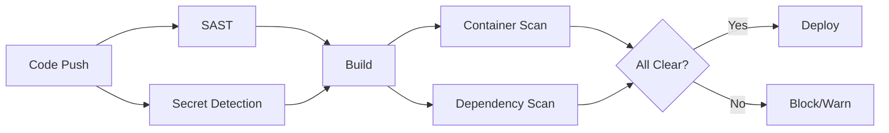

# How to Run Security Scanning in GitLab CI

Author: [nawazdhandala](https://www.github.com/nawazdhandala)

Tags: GitLab CI, Security, SAST, DAST, Container Scanning, DevSecOps

Description: Learn how to implement comprehensive security scanning in GitLab CI with SAST, DAST, dependency scanning, and container scanning to catch vulnerabilities before they reach production.

---

Security vulnerabilities in your code cost far more to fix in production than during development. GitLab CI provides built-in security scanning tools that integrate directly into your pipeline. This guide shows you how to implement SAST, DAST, dependency scanning, and container scanning to catch issues early.

## Security Scanning Overview

GitLab offers several scanning types:

- **SAST (Static Application Security Testing)**: Analyzes source code for vulnerabilities
- **DAST (Dynamic Application Security Testing)**: Tests running applications for vulnerabilities
- **Dependency Scanning**: Checks third-party libraries for known CVEs
- **Container Scanning**: Examines Docker images for vulnerabilities
- **Secret Detection**: Finds accidentally committed credentials

## Quick Start with GitLab Templates

The fastest way to add security scanning is using GitLab's built-in templates.

```yaml
include:
  - template: Security/SAST.gitlab-ci.yml
  - template: Security/Secret-Detection.gitlab-ci.yml
  - template: Security/Dependency-Scanning.gitlab-ci.yml
  - template: Security/Container-Scanning.gitlab-ci.yml

stages:
  - build
  - test
  - security
  - deploy

build:
  stage: build
  script:
    - docker build -t $CI_REGISTRY_IMAGE:$CI_COMMIT_SHA .
    - docker push $CI_REGISTRY_IMAGE:$CI_COMMIT_SHA

# Templates add their own jobs to the security stage
```

These templates automatically detect your project's languages and run appropriate scanners.

## Security Scanning Flow

Here's how security scanning fits into your pipeline:



## Static Application Security Testing (SAST)

SAST scans your source code without running it. Configure it for your specific needs.

```yaml
include:
  - template: Security/SAST.gitlab-ci.yml

variables:
  # Exclude test files from scanning
  SAST_EXCLUDED_PATHS: "spec, test, tests, tmp"
  # Set severity threshold
  SAST_DISABLED: "false"

# Override the template job for customization
sast:
  stage: test
  variables:
    # Language-specific analyzers to use
    SAST_EXCLUDED_ANALYZERS: "eslint"  # If using custom ESLint config
  rules:
    - if: $CI_PIPELINE_SOURCE == "merge_request_event"
    - if: $CI_COMMIT_BRANCH == $CI_DEFAULT_BRANCH
```

For custom SAST configuration with Semgrep:

```yaml
semgrep-sast:
  stage: test
  image: returntocorp/semgrep:latest
  script:
    # Run Semgrep with custom rules
    - semgrep scan --config auto --config ./security-rules/ --json -o semgrep-results.json .
  artifacts:
    reports:
      sast: semgrep-results.json
    paths:
      - semgrep-results.json
```

## Secret Detection

Catch accidentally committed secrets before they cause breaches.

```yaml
include:
  - template: Security/Secret-Detection.gitlab-ci.yml

variables:
  # Scan historical commits too
  SECRET_DETECTION_HISTORIC_SCAN: "true"
  # Exclude false positives
  SECRET_DETECTION_EXCLUDED_PATHS: "tests/fixtures"
```

For custom patterns, create a `.gitlab/secret-detection-ruleset.toml`:

```toml
[secrets]
  [[secrets.rules]]
    id = "internal-api-key"
    description = "Internal API Key Pattern"
    regex = '''INTERNAL_KEY_[A-Z0-9]{32}'''
    tags = ["internal"]
```

## Dependency Scanning

Find vulnerabilities in your project's dependencies.

```yaml
include:
  - template: Security/Dependency-Scanning.gitlab-ci.yml

variables:
  # Fail on high severity vulnerabilities
  DS_REMEDIATE: "true"

dependency_scanning:
  variables:
    # For Python projects
    PIP_REQUIREMENTS_FILE: "requirements.txt"
    # For Node.js projects
    DS_EXCLUDED_ANALYZERS: "retire.js"  # If using npm audit instead
```

Manual dependency scanning with Trivy:

```yaml
dependency-scan:
  stage: security
  image:
    name: aquasec/trivy:latest
    entrypoint: [""]
  script:
    # Scan filesystem for vulnerable dependencies
    - trivy fs --format json --output dependency-report.json .
    # Fail on critical vulnerabilities
    - trivy fs --exit-code 1 --severity CRITICAL .
  artifacts:
    reports:
      dependency_scanning: dependency-report.json
```

## Container Scanning

Scan Docker images for OS and application vulnerabilities.

```yaml
include:
  - template: Security/Container-Scanning.gitlab-ci.yml

variables:
  CS_IMAGE: $CI_REGISTRY_IMAGE:$CI_COMMIT_SHA
  # Severity levels to report
  CS_SEVERITY_THRESHOLD: "HIGH"

container_scanning:
  stage: security
  needs:
    - build  # Ensure image is built first
```

For more control, use Trivy directly:

```yaml
container-scan:
  stage: security
  image:
    name: aquasec/trivy:latest
    entrypoint: [""]
  script:
    # Scan the built image
    - trivy image --format json --output container-report.json $CI_REGISTRY_IMAGE:$CI_COMMIT_SHA
    # Generate SARIF for GitHub/GitLab integration
    - trivy image --format sarif --output container-report.sarif $CI_REGISTRY_IMAGE:$CI_COMMIT_SHA
    # Fail pipeline on critical/high vulnerabilities
    - trivy image --exit-code 1 --severity CRITICAL,HIGH $CI_REGISTRY_IMAGE:$CI_COMMIT_SHA
  artifacts:
    reports:
      container_scanning: container-report.json
    paths:
      - container-report.sarif
  needs:
    - build
```

## Dynamic Application Security Testing (DAST)

DAST tests your running application for vulnerabilities like XSS and SQL injection.

```yaml
include:
  - template: DAST.gitlab-ci.yml

variables:
  # URL to test
  DAST_WEBSITE: "https://staging.example.com"
  # Full scan (slower but more thorough)
  DAST_FULL_SCAN_ENABLED: "true"

dast:
  stage: dast
  needs:
    - deploy-staging
  rules:
    - if: $CI_COMMIT_BRANCH == "develop"
```

For API testing with DAST:

```yaml
dast-api:
  stage: dast
  image:
    name: owasp/zap2docker-stable:latest
    entrypoint: [""]
  script:
    - mkdir -p /zap/wrk
    # API scan using OpenAPI spec
    - zap-api-scan.py -t https://staging.example.com/api/openapi.json -f openapi -r report.html -x report.xml
  artifacts:
    paths:
      - report.html
      - report.xml
    when: always
```

## Infrastructure as Code Scanning

Scan Terraform, Kubernetes manifests, and other IaC for misconfigurations.

```yaml
iac-scan:
  stage: security
  image:
    name: aquasec/trivy:latest
    entrypoint: [""]
  script:
    # Scan IaC files
    - trivy config --format json --output iac-report.json .
    # Fail on high severity misconfigurations
    - trivy config --exit-code 1 --severity HIGH,CRITICAL .
  artifacts:
    reports:
      sast: iac-report.json
```

Using Checkov for more detailed IaC scanning:

```yaml
checkov-scan:
  stage: security
  image:
    name: bridgecrew/checkov:latest
    entrypoint: [""]
  script:
    - checkov -d . --output-file-path . --output cli --output junitxml
  artifacts:
    reports:
      junit: results_junitxml.xml
    paths:
      - results_cli.txt
```

## Handling Scan Results

Configure how vulnerabilities affect your pipeline.

```yaml
# Block merge requests with critical vulnerabilities
workflow:
  rules:
    - if: $CI_MERGE_REQUEST_IID

stages:
  - test
  - security
  - deploy

security-gate:
  stage: security
  image: alpine:latest
  script:
    # Check if any critical vulnerabilities were found
    - |
      if grep -q '"severity":"Critical"' reports/*.json 2>/dev/null; then
        echo "Critical vulnerabilities found! Blocking deployment."
        exit 1
      fi
  needs:
    - sast
    - dependency_scanning
    - container_scanning
  allow_failure: false
```

## Vulnerability Management

Track and manage vulnerabilities over time.

```yaml
# Generate compliance report
compliance-report:
  stage: security
  image: python:3.11-slim
  script:
    - pip install jq
    # Combine all security reports
    - jq -s 'add' reports/*.json > combined-report.json
    # Upload to vulnerability management system
    - |
      curl -X POST "https://security.example.com/api/reports" \
        -H "Authorization: Bearer $SECURITY_API_TOKEN" \
        -F "report=@combined-report.json" \
        -F "project=$CI_PROJECT_PATH" \
        -F "commit=$CI_COMMIT_SHA"
  artifacts:
    paths:
      - combined-report.json
  only:
    - main
```

## Excluding False Positives

Create a vulnerability allowlist for known false positives.

```yaml
# .gitlab/vulnerability-allowlist.yml
version: "1.0"
vulnerabilities:
  - id: "CVE-2023-12345"
    reason: "Not exploitable in our configuration"
    expiry: "2024-12-31"
  - id: "CVE-2023-67890"
    reason: "Mitigated by network policy"
```

Reference it in your pipeline:

```yaml
container-scan:
  script:
    # Ignore allowed vulnerabilities
    - trivy image --ignorefile .trivyignore --exit-code 1 $CI_REGISTRY_IMAGE:$CI_COMMIT_SHA
```

## Scheduled Security Scans

Run comprehensive scans on a schedule, not just on commits.

```yaml
# Full security audit - runs nightly
security-audit:
  stage: security
  rules:
    - if: $CI_PIPELINE_SOURCE == "schedule"
  script:
    # Full SAST scan including historical
    - semgrep scan --config auto --json -o sast-full.json .
    # Scan all dependencies including transitive
    - trivy fs --scanners vuln --json -o deps-full.json .
    # Deep container scan
    - trivy image --scanners vuln,secret,config --json -o container-full.json $CI_REGISTRY_IMAGE:latest
  artifacts:
    paths:
      - "*-full.json"
    expire_in: 30 days
```

Create a scheduled pipeline in CI/CD, then Schedules that runs nightly with comprehensive security scanning.

---

Security scanning in GitLab CI transforms security from a gate at the end to a continuous process throughout development. Start with the built-in templates for quick wins, then customize scanners and policies as your security requirements mature. The goal is catching vulnerabilities early when they're cheap to fix.
