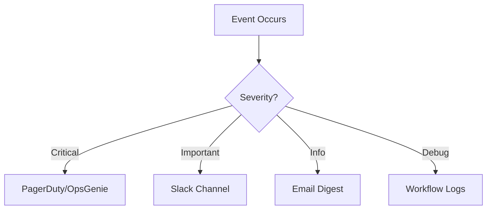

# How to Send Notifications with GitHub Actions

Author: [nawazdhandala](https://www.github.com/nawazdhandala)

Tags: GitHub Actions, Notifications, Slack, Discord, Teams, Webhooks, DevOps

Description: Learn how to integrate notifications into your GitHub Actions workflows to alert your team about build status, deployments, failures, and other important events via Slack, Discord, Teams, and email.

---

Automated notifications keep your team informed without requiring them to watch CI dashboards. This guide covers integrating various notification channels into your GitHub Actions workflows.

## Notification Strategy

Choose the right notification channel based on urgency and audience:



## Slack Notifications

Slack is the most common notification target. Use incoming webhooks for simple messages:

```yaml
jobs:
  notify-slack:
    runs-on: ubuntu-latest
    steps:
      - name: Send Slack notification
        run: |
          curl -X POST ${{ secrets.SLACK_WEBHOOK_URL }} \
            -H 'Content-Type: application/json' \
            -d '{
              "text": "Deployment completed successfully!",
              "blocks": [
                {
                  "type": "section",
                  "text": {
                    "type": "mrkdwn",
                    "text": "*Deployment Complete* :rocket:\n\nRepository: `${{ github.repository }}`\nBranch: `${{ github.ref_name }}`\nCommit: `${{ github.sha }}`"
                  }
                },
                {
                  "type": "actions",
                  "elements": [
                    {
                      "type": "button",
                      "text": {
                        "type": "plain_text",
                        "text": "View Workflow"
                      },
                      "url": "${{ github.server_url }}/${{ github.repository }}/actions/runs/${{ github.run_id }}"
                    }
                  ]
                }
              ]
            }'
```

For richer Slack messages, use a dedicated action:

```yaml
      - name: Slack notification
        uses: slackapi/slack-github-action@v1.25.0
        with:
          channel-id: 'deployments'
          slack-message: |
            *${{ github.workflow }}* completed with status: *${{ job.status }}*

            - Repository: ${{ github.repository }}
            - Branch: ${{ github.ref_name }}
            - Triggered by: ${{ github.actor }}
            - <${{ github.server_url }}/${{ github.repository }}/actions/runs/${{ github.run_id }}|View Run>
        env:
          SLACK_BOT_TOKEN: ${{ secrets.SLACK_BOT_TOKEN }}
```

## Conditional Notifications

Send different notifications based on workflow outcome:

```yaml
jobs:
  build:
    runs-on: ubuntu-latest
    steps:
      - uses: actions/checkout@v4
      - run: npm ci
      - run: npm test
      - run: npm run build

  notify:
    needs: build
    runs-on: ubuntu-latest
    if: always()  # Run even if build fails
    steps:
      - name: Notify on success
        if: needs.build.result == 'success'
        run: |
          curl -X POST ${{ secrets.SLACK_WEBHOOK }} \
            -d '{"text": ":white_check_mark: Build passed for ${{ github.ref_name }}"}'

      - name: Notify on failure
        if: needs.build.result == 'failure'
        run: |
          curl -X POST ${{ secrets.SLACK_WEBHOOK }} \
            -d '{
              "text": ":x: Build failed!",
              "attachments": [{
                "color": "danger",
                "fields": [
                  {"title": "Branch", "value": "${{ github.ref_name }}", "short": true},
                  {"title": "Author", "value": "${{ github.actor }}", "short": true},
                  {"title": "Commit", "value": "${{ github.event.head_commit.message }}", "short": false}
                ]
              }]
            }'

      - name: Notify on cancellation
        if: needs.build.result == 'cancelled'
        run: |
          curl -X POST ${{ secrets.SLACK_WEBHOOK }} \
            -d '{"text": ":warning: Build was cancelled for ${{ github.ref_name }}"}'
```

## Discord Notifications

Discord uses similar webhooks to Slack:

```yaml
jobs:
  notify-discord:
    runs-on: ubuntu-latest
    steps:
      - name: Discord notification
        run: |
          curl -X POST "${{ secrets.DISCORD_WEBHOOK }}" \
            -H "Content-Type: application/json" \
            -d '{
              "embeds": [{
                "title": "Deployment Status",
                "description": "Deployment to production completed!",
                "color": 3066993,
                "fields": [
                  {"name": "Repository", "value": "${{ github.repository }}", "inline": true},
                  {"name": "Branch", "value": "${{ github.ref_name }}", "inline": true},
                  {"name": "Commit", "value": "`${{ github.sha }}`", "inline": false}
                ],
                "footer": {"text": "Triggered by ${{ github.actor }}"},
                "timestamp": "${{ github.event.head_commit.timestamp }}"
              }]
            }'
```

Using a Discord action for simpler syntax:

```yaml
      - name: Discord notification
        uses: sarisia/actions-status-discord@v1
        if: always()
        with:
          webhook: ${{ secrets.DISCORD_WEBHOOK }}
          status: ${{ job.status }}
          title: "Build"
          description: "Build and test workflow"
          color: 0x0099ff
          username: "GitHub Actions"
```

## Microsoft Teams Notifications

Send notifications to Microsoft Teams via webhooks:

```yaml
jobs:
  notify-teams:
    runs-on: ubuntu-latest
    steps:
      - name: Teams notification
        run: |
          curl -X POST "${{ secrets.TEAMS_WEBHOOK }}" \
            -H "Content-Type: application/json" \
            -d '{
              "@type": "MessageCard",
              "@context": "http://schema.org/extensions",
              "themeColor": "0076D7",
              "summary": "Build Status",
              "sections": [{
                "activityTitle": "Build Completed",
                "activitySubtitle": "${{ github.repository }}",
                "activityImage": "https://github.githubassets.com/images/modules/logos_page/GitHub-Mark.png",
                "facts": [
                  {"name": "Branch", "value": "${{ github.ref_name }}"},
                  {"name": "Commit", "value": "${{ github.sha }}"},
                  {"name": "Author", "value": "${{ github.actor }}"}
                ],
                "markdown": true
              }],
              "potentialAction": [{
                "@type": "OpenUri",
                "name": "View Workflow",
                "targets": [{"os": "default", "uri": "${{ github.server_url }}/${{ github.repository }}/actions/runs/${{ github.run_id }}"}]
              }]
            }'
```

## Email Notifications

Send emails using SendGrid, Mailgun, or SMTP:

```yaml
jobs:
  notify-email:
    runs-on: ubuntu-latest
    steps:
      - name: Send email via SendGrid
        run: |
          curl -X POST "https://api.sendgrid.com/v3/mail/send" \
            -H "Authorization: Bearer ${{ secrets.SENDGRID_API_KEY }}" \
            -H "Content-Type: application/json" \
            -d '{
              "personalizations": [{"to": [{"email": "team@example.com"}]}],
              "from": {"email": "ci@example.com", "name": "CI System"},
              "subject": "Build Status: ${{ github.repository }}",
              "content": [{
                "type": "text/html",
                "value": "<h2>Build Completed</h2><p>Repository: ${{ github.repository }}</p><p>Branch: ${{ github.ref_name }}</p><p>Status: Success</p><p><a href=\"${{ github.server_url }}/${{ github.repository }}/actions/runs/${{ github.run_id }}\">View Details</a></p>"
              }]
            }'
```

## PagerDuty for Critical Alerts

Alert on-call engineers for critical failures:

```yaml
jobs:
  deploy:
    runs-on: ubuntu-latest
    steps:
      - name: Deploy
        id: deploy
        run: ./deploy.sh
        continue-on-error: true

      - name: Alert PagerDuty on failure
        if: steps.deploy.outcome == 'failure'
        run: |
          curl -X POST "https://events.pagerduty.com/v2/enqueue" \
            -H "Content-Type: application/json" \
            -d '{
              "routing_key": "${{ secrets.PAGERDUTY_ROUTING_KEY }}",
              "event_action": "trigger",
              "dedup_key": "deploy-${{ github.repository }}-${{ github.run_id }}",
              "payload": {
                "summary": "Production deployment failed for ${{ github.repository }}",
                "severity": "critical",
                "source": "GitHub Actions",
                "custom_details": {
                  "repository": "${{ github.repository }}",
                  "branch": "${{ github.ref_name }}",
                  "commit": "${{ github.sha }}",
                  "workflow_url": "${{ github.server_url }}/${{ github.repository }}/actions/runs/${{ github.run_id }}"
                }
              }
            }'

      - name: Resolve PagerDuty on success
        if: steps.deploy.outcome == 'success'
        run: |
          curl -X POST "https://events.pagerduty.com/v2/enqueue" \
            -H "Content-Type: application/json" \
            -d '{
              "routing_key": "${{ secrets.PAGERDUTY_ROUTING_KEY }}",
              "event_action": "resolve",
              "dedup_key": "deploy-${{ github.repository }}-${{ github.run_id }}"
            }'
```

## GitHub Issues for Tracking

Create issues for build failures:

```yaml
jobs:
  build:
    runs-on: ubuntu-latest
    steps:
      - uses: actions/checkout@v4
      - run: npm test

  create-issue-on-failure:
    needs: build
    if: failure()
    runs-on: ubuntu-latest
    steps:
      - name: Create issue
        uses: actions/github-script@v7
        with:
          script: |
            const title = `Build failed on ${context.ref}`;
            const body = `
            ## Build Failure

            - **Branch**: ${context.ref}
            - **Commit**: ${context.sha}
            - **Author**: @${context.actor}
            - **Workflow**: [View Run](${context.serverUrl}/${context.repo.owner}/${context.repo.repo}/actions/runs/${context.runId})

            Please investigate and fix the failing tests.
            `;

            // Check if issue already exists
            const issues = await github.rest.issues.listForRepo({
              owner: context.repo.owner,
              repo: context.repo.repo,
              state: 'open',
              labels: 'build-failure',
              per_page: 100
            });

            const existing = issues.data.find(i => i.title === title);
            if (!existing) {
              await github.rest.issues.create({
                owner: context.repo.owner,
                repo: context.repo.repo,
                title: title,
                body: body,
                labels: ['build-failure', 'automated']
              });
            }
```

## Workflow Summary Notifications

Post a summary after complex workflows:

```yaml
jobs:
  summarize:
    needs: [lint, test, build, deploy]
    if: always()
    runs-on: ubuntu-latest
    steps:
      - name: Create summary
        run: |
          STATUS_EMOJI() {
            case "$1" in
              success) echo ":white_check_mark:" ;;
              failure) echo ":x:" ;;
              cancelled) echo ":warning:" ;;
              skipped) echo ":fast_forward:" ;;
              *) echo ":question:" ;;
            esac
          }

          MESSAGE=$(cat <<EOF
          *Workflow Summary*

          $(STATUS_EMOJI ${{ needs.lint.result }}) Lint: ${{ needs.lint.result }}
          $(STATUS_EMOJI ${{ needs.test.result }}) Test: ${{ needs.test.result }}
          $(STATUS_EMOJI ${{ needs.build.result }}) Build: ${{ needs.build.result }}
          $(STATUS_EMOJI ${{ needs.deploy.result }}) Deploy: ${{ needs.deploy.result }}

          <${{ github.server_url }}/${{ github.repository }}/actions/runs/${{ github.run_id }}|View Details>
          EOF
          )

          curl -X POST ${{ secrets.SLACK_WEBHOOK }} \
            -d "{\"text\": \"$MESSAGE\"}"
```

## Best Practices

1. **Do not over-notify** - Only alert on actionable events. Too many notifications lead to alert fatigue.

2. **Use appropriate channels** - Critical failures go to PagerDuty; routine updates go to Slack.

3. **Include context** - Add links to workflows, commits, and relevant details.

4. **Make notifications actionable** - Include buttons or links to take immediate action.

5. **Deduplicate alerts** - Prevent duplicate notifications for the same issue.

6. **Test your webhooks** - Verify notifications work before relying on them.

Good notifications keep your team informed without overwhelming them. Choose the right channel and message for each type of event.
