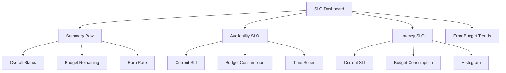

# How to Build SLO Dashboards in Grafana

Author: [nawazdhandala](https://www.github.com/nawazdhandala)

Tags: Grafana, SLO, SLI, Error Budget, Reliability, SRE, Observability, Prometheus

Description: Learn how to design and build effective SLO dashboards in Grafana that track service level indicators, error budgets, and reliability trends.

---

## Why SLO Dashboards Matter

Service Level Objectives (SLOs) translate abstract reliability goals into measurable targets. An SLO dashboard transforms these targets into actionable visibility, showing whether you are meeting commitments and how much error budget remains for risky changes.

A good SLO dashboard answers:
- Are we meeting our reliability targets?
- How much error budget have we consumed?
- What is the burn rate?
- When will we exhaust our budget at current rates?

## SLO Fundamentals

Before building dashboards, establish your SLO structure.

### Service Level Indicators (SLIs)

SLIs are the metrics that measure reliability. Common SLIs include:

```yaml
# Availability SLI
definition: Proportion of successful requests
calculation: successful_requests / total_requests

# Latency SLI
definition: Proportion of requests faster than threshold
calculation: requests_under_threshold / total_requests

# Throughput SLI
definition: Proportion of time system handles expected load
calculation: time_above_minimum_rate / total_time
```

### SLO Targets

SLOs set targets for your SLIs:

```yaml
service: api-gateway
slos:
  - name: availability
    target: 99.9%
    window: 30 days

  - name: latency_p99
    target: 99%
    threshold: 200ms
    window: 30 days
```

### Error Budget

Error budget is the acceptable amount of unreliability:

```
Error Budget = 100% - SLO Target
For 99.9% availability: Error Budget = 0.1%
Over 30 days: 0.1% * 30 * 24 * 60 = 43.2 minutes of allowed downtime
```

## Building the Dashboard

Let's construct an SLO dashboard step by step.

### Dashboard Structure



### Panel 1: SLI Current Value

Create a stat panel showing the current SLI:

```promql
# Availability SLI over 30 days
sum(rate(http_requests_total{service="api-gateway", status!~"5.."}[30d]))
/
sum(rate(http_requests_total{service="api-gateway"}[30d]))
```

Configure the panel:

```yaml
Panel Type: Stat
Title: Availability SLI (30d)

Value Options:
  - Show: Calculate (Last)
  - Fields: Numeric

Standard Options:
  - Unit: Percent (0.0-1.0)
  - Decimals: 3

Thresholds:
  - 0.999: green     # Meeting target
  - 0.995: yellow    # Warning
  - 0: red           # Critical
```

### Panel 2: Error Budget Remaining

Calculate remaining error budget as a percentage:

```promql
# Error budget remaining (%)
(
  (
    sum(rate(http_requests_total{service="api-gateway", status!~"5.."}[30d]))
    /
    sum(rate(http_requests_total{service="api-gateway"}[30d]))
  )
  - 0.999  # SLO target
)
/
(1 - 0.999)  # Error budget (0.1%)
* 100
```

Panel configuration:

```yaml
Panel Type: Gauge
Title: Error Budget Remaining

Gauge Options:
  - Show threshold labels: true
  - Show threshold markers: true

Standard Options:
  - Unit: Percent (0-100)
  - Min: 0
  - Max: 100

Thresholds:
  - 50: green
  - 25: yellow
  - 0: red
```

### Panel 3: Burn Rate

Burn rate indicates how quickly you are consuming error budget:

```promql
# Burn rate (1 = consuming at expected rate, >1 = faster than expected)
(
  1 - (
    sum(rate(http_requests_total{service="api-gateway", status!~"5.."}[1h]))
    /
    sum(rate(http_requests_total{service="api-gateway"}[1h]))
  )
)
/
(1 - 0.999)  # Error budget rate
```

A burn rate of 1 means you will exactly exhaust your budget by window end. Greater than 1 means you will run out early.

```yaml
Panel Type: Stat
Title: Current Burn Rate (1h)

Standard Options:
  - Unit: none
  - Decimals: 2

Thresholds:
  - 1: green      # Sustainable
  - 5: yellow     # Elevated
  - 10: red       # Critical
```

### Panel 4: Time Until Budget Exhaustion

Project when the budget will run out:

```promql
# Hours until budget exhaustion at current burn rate
(
  # Remaining budget (as ratio)
  (
    sum(rate(http_requests_total{service="api-gateway", status!~"5.."}[30d]))
    /
    sum(rate(http_requests_total{service="api-gateway"}[30d]))
  )
  - 0.999
)
/
(
  # Current hourly error rate
  1 - (
    sum(rate(http_requests_total{service="api-gateway", status!~"5.."}[1h]))
    /
    sum(rate(http_requests_total{service="api-gateway"}[1h]))
  )
)
```

### Panel 5: SLI Over Time

Track SLI trends with a time series panel:

```promql
# Rolling 1-hour availability
sum(rate(http_requests_total{service="api-gateway", status!~"5.."}[1h]))
/
sum(rate(http_requests_total{service="api-gateway"}[1h]))
```

Add reference lines for thresholds:

```yaml
Panel Type: Time series
Title: Availability Over Time

Field Config:
  - Custom: Line width 2

Overrides:
  - Match: Field name = "SLO Target"
    Properties:
      - Color: yellow
      - Line style: dashed
```

Add a constant query for the SLO line:

```promql
# SLO Target line
vector(0.999)
```

### Panel 6: Error Budget Consumption Over Time

Visualize budget burn as a time series:

```promql
# Cumulative error budget consumption
1 - (
  sum(increase(http_requests_total{service="api-gateway", status!~"5.."}[$__range]))
  /
  sum(increase(http_requests_total{service="api-gateway"}[$__range]))
)
/
(1 - 0.999)
```

## Latency SLO Panels

For latency-based SLOs, the queries differ slightly.

### Latency SLI

```promql
# Proportion of requests under 200ms threshold
sum(rate(http_request_duration_seconds_bucket{service="api-gateway", le="0.2"}[30d]))
/
sum(rate(http_request_duration_seconds_count{service="api-gateway"}[30d]))
```

### Latency Distribution

A histogram panel shows the full latency distribution:

```promql
# Histogram buckets
sum(rate(http_request_duration_seconds_bucket{service="api-gateway"}[5m])) by (le)
```

Panel configuration:

```yaml
Panel Type: Heatmap
Title: Latency Distribution

Data format: Time series buckets
Y-axis: le
Color scheme: Spectral
```

## Multi-Service SLO Dashboard

Scale to multiple services with template variables.

### Variable Configuration

```yaml
Variable: service
Type: Query
Query: label_values(http_requests_total, service)
Multi-value: true
Include All option: true
```

### Dynamic Queries

Update queries to use the variable:

```promql
# Availability SLI with variable
sum(rate(http_requests_total{service=~"$service", status!~"5.."}[30d])) by (service)
/
sum(rate(http_requests_total{service=~"$service"}[30d])) by (service)
```

### Multi-Service Summary Table

Create a table showing all services:

```promql
# Multi-service SLI summary
sum(rate(http_requests_total{status!~"5.."}[30d])) by (service)
/
sum(rate(http_requests_total[30d])) by (service)
```

Table configuration:

```yaml
Panel Type: Table
Transformations:
  - Rename fields:
      Value: SLI

Field Config:
  - SLI:
      Unit: percentunit
      Decimals: 3
      Thresholds:
        - 0.999: green
        - 0.995: yellow
        - 0: red
      Cell display mode: Color background
```

## Recording Rules for Performance

Complex SLO queries can be slow. Use Prometheus recording rules:

```yaml
# prometheus/rules/slo.yaml
groups:
  - name: slo_recording_rules
    interval: 1m
    rules:
      # Availability SLI (1h window)
      - record: slo:availability:ratio_rate1h
        expr: |
          sum(rate(http_requests_total{status!~"5.."}[1h])) by (service)
          /
          sum(rate(http_requests_total[1h])) by (service)

      # Availability SLI (30d window)
      - record: slo:availability:ratio_rate30d
        expr: |
          sum(rate(http_requests_total{status!~"5.."}[30d])) by (service)
          /
          sum(rate(http_requests_total[30d])) by (service)

      # Error budget remaining
      - record: slo:error_budget:remaining_ratio
        expr: |
          (slo:availability:ratio_rate30d - 0.999) / (1 - 0.999)

      # Burn rate
      - record: slo:burn_rate:ratio_rate1h
        expr: |
          (1 - slo:availability:ratio_rate1h) / (1 - 0.999)
```

Then simplify dashboard queries:

```promql
# Use recording rule instead of complex query
slo:availability:ratio_rate30d{service="api-gateway"}
```

## Alerting on SLO Breaches

Connect your dashboard to alerts.

### Multi-Window Burn Rate Alerts

```yaml
# Alert on elevated burn rate
groups:
  - name: slo_alerts
    rules:
      # Fast burn (page immediately)
      - alert: SLOBurnRateCritical
        expr: slo:burn_rate:ratio_rate1h > 14.4
        for: 2m
        labels:
          severity: critical
        annotations:
          summary: "SLO burn rate critical for {{ $labels.service }}"
          description: "Burn rate is {{ $value }}, budget will exhaust in < 1 hour"

      # Slow burn (ticket)
      - alert: SLOBurnRateWarning
        expr: slo:burn_rate:ratio_rate6h > 6
        for: 1h
        labels:
          severity: warning
        annotations:
          summary: "Elevated SLO burn rate for {{ $labels.service }}"
```

### Dashboard Alert Annotations

Add alert annotations to your time series panels to show when alerts fired:

```yaml
Annotations:
  - Name: SLO Alerts
    Data source: Prometheus
    Query: ALERTS{alertname=~"SLO.*", service="$service"}
```

## Best Practices

### Choose Appropriate Windows

- Short windows (1h, 6h) for burn rate and alerting
- Long windows (7d, 30d) for SLO compliance reporting

### Avoid Vanity SLOs

Set targets you can actually meet and that matter to users. 99.999% looks impressive but may be unrealistic and unmeasurable for your scale.

### Include Context

Add text panels explaining:
- What each SLO measures
- Who owns the service
- Links to runbooks when budget is low

### Review Regularly

Schedule monthly SLO reviews to:
- Assess if targets remain appropriate
- Identify services consistently over or under target
- Adjust based on user feedback and business needs

## Conclusion

SLO dashboards transform reliability from an abstract concept into a visible, measurable practice. Start with availability and latency SLOs for your most critical services, use recording rules for query performance, and set up burn rate alerts for proactive notification. As your SLO practice matures, expand to more services and refine your targets based on actual user expectations and business needs.
