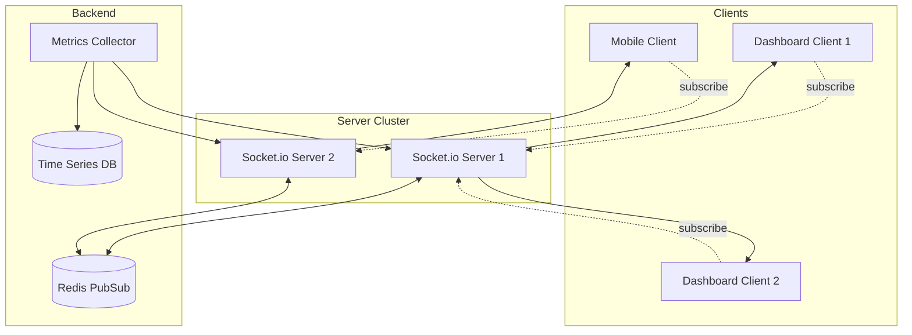

# How to Build Real-Time Dashboards with Socket.io in Node.js

Author: [nawazdhandala](https://www.github.com/nawazdhandala)

Tags: NodeJS, Socket.io, WebSocket, Real-Time, Dashboard, TypeScript

Description: Learn how to build real-time dashboards using Socket.io in Node.js with room-based updates, efficient data broadcasting, authentication, and scaling patterns.

---

Dashboards that update in real-time provide immediate visibility into system health, user activity, and business metrics. Polling for updates wastes resources and introduces latency. WebSockets let the server push changes the moment they happen. Socket.io simplifies WebSocket implementation with automatic reconnection, fallbacks for older browsers, and a clean room-based API for targeted updates.

This guide walks through building a production-ready real-time dashboard backend with Socket.io.

## Basic Socket.io Server Setup

Start with a basic server that broadcasts metrics to connected clients:

```typescript
// server.ts
import express from 'express';
import { createServer } from 'http';
import { Server, Socket } from 'socket.io';

const app = express();
const httpServer = createServer(app);

// Configure Socket.io with CORS for development
const io = new Server(httpServer, {
  cors: {
    origin: 'http://localhost:3000',
    methods: ['GET', 'POST'],
  },
  // Increase ping timeout for unstable connections
  pingTimeout: 60000,
});

// Track connected clients
let connectedClients = 0;

io.on('connection', (socket: Socket) => {
  connectedClients++;
  console.log(`Client connected: ${socket.id} (total: ${connectedClients})`);

  // Send initial state to new client
  socket.emit('dashboard:init', {
    serverTime: Date.now(),
    connectedClients,
  });

  socket.on('disconnect', () => {
    connectedClients--;
    console.log(`Client disconnected: ${socket.id} (total: ${connectedClients})`);
  });
});

// Serve static files for the dashboard
app.use(express.static('public'));

httpServer.listen(4000, () => {
  console.log('Dashboard server running on port 4000');
});
```

## Structured Event System

Define clear event types and payloads for type safety:

```typescript
// types/events.ts

// Server-to-client events
export interface ServerToClientEvents {
  'dashboard:init': (data: DashboardInit) => void;
  'metrics:update': (data: MetricsUpdate) => void;
  'alerts:new': (data: Alert) => void;
  'service:status': (data: ServiceStatus) => void;
}

// Client-to-server events
export interface ClientToServerEvents {
  'subscribe:metrics': (services: string[]) => void;
  'unsubscribe:metrics': (services: string[]) => void;
  'request:history': (params: HistoryRequest, callback: (data: MetricsHistory) => void) => void;
}

// Event payload types
export interface DashboardInit {
  serverTime: number;
  services: ServiceInfo[];
  activeAlerts: Alert[];
}

export interface MetricsUpdate {
  service: string;
  timestamp: number;
  metrics: {
    cpu: number;
    memory: number;
    requestsPerSecond: number;
    errorRate: number;
    latencyP50: number;
    latencyP99: number;
  };
}

export interface Alert {
  id: string;
  service: string;
  severity: 'info' | 'warning' | 'critical';
  message: string;
  timestamp: number;
}

export interface ServiceStatus {
  service: string;
  status: 'healthy' | 'degraded' | 'down';
  lastCheck: number;
}

export interface ServiceInfo {
  name: string;
  status: 'healthy' | 'degraded' | 'down';
  lastMetrics: MetricsUpdate['metrics'];
}

export interface HistoryRequest {
  service: string;
  from: number;
  to: number;
  resolution: '1m' | '5m' | '1h';
}

export interface MetricsHistory {
  service: string;
  dataPoints: { timestamp: number; metrics: MetricsUpdate['metrics'] }[];
}
```

## Room-Based Subscriptions

Use Socket.io rooms to send updates only to interested clients:

```typescript
// dashboard-server.ts
import express from 'express';
import { createServer } from 'http';
import { Server, Socket } from 'socket.io';
import {
  ServerToClientEvents,
  ClientToServerEvents,
  MetricsUpdate,
  Alert,
} from './types/events';

const app = express();
const httpServer = createServer(app);

const io = new Server<ClientToServerEvents, ServerToClientEvents>(httpServer, {
  cors: { origin: '*' },
});

// In-memory store for latest metrics (use Redis in production)
const latestMetrics = new Map<string, MetricsUpdate>();
const activeAlerts: Alert[] = [];

io.on('connection', (socket) => {
  console.log(`Dashboard client connected: ${socket.id}`);

  // Send current state on connection
  socket.emit('dashboard:init', {
    serverTime: Date.now(),
    services: Array.from(latestMetrics.entries()).map(([name, m]) => ({
      name,
      status: 'healthy',
      lastMetrics: m.metrics,
    })),
    activeAlerts,
  });

  // Handle subscription requests
  // Client joins a room for each service they want updates for
  socket.on('subscribe:metrics', (services) => {
    for (const service of services) {
      socket.join(`metrics:${service}`);
      console.log(`${socket.id} subscribed to ${service}`);

      // Send latest metrics immediately
      const latest = latestMetrics.get(service);
      if (latest) {
        socket.emit('metrics:update', latest);
      }
    }
  });

  socket.on('unsubscribe:metrics', (services) => {
    for (const service of services) {
      socket.leave(`metrics:${service}`);
      console.log(`${socket.id} unsubscribed from ${service}`);
    }
  });

  // Handle history requests with acknowledgment callback
  socket.on('request:history', (params, callback) => {
    // In production, fetch from time-series database
    const mockHistory = generateMockHistory(params);
    callback(mockHistory);
  });

  socket.on('disconnect', () => {
    console.log(`Dashboard client disconnected: ${socket.id}`);
  });
});

// Broadcast metrics to subscribed clients only
export function broadcastMetrics(update: MetricsUpdate) {
  latestMetrics.set(update.service, update);

  // Send to room for this service
  io.to(`metrics:${update.service}`).emit('metrics:update', update);
}

// Broadcast alert to all connected clients
export function broadcastAlert(alert: Alert) {
  activeAlerts.push(alert);

  // Limit stored alerts
  if (activeAlerts.length > 100) {
    activeAlerts.shift();
  }

  io.emit('alerts:new', alert);
}

// Broadcast service status change
export function broadcastServiceStatus(service: string, status: 'healthy' | 'degraded' | 'down') {
  io.emit('service:status', {
    service,
    status,
    lastCheck: Date.now(),
  });
}

function generateMockHistory(params: any) {
  // Generate mock data points for demo
  const points = [];
  const interval = params.resolution === '1m' ? 60000 : params.resolution === '5m' ? 300000 : 3600000;

  for (let t = params.from; t <= params.to; t += interval) {
    points.push({
      timestamp: t,
      metrics: {
        cpu: 20 + Math.random() * 60,
        memory: 40 + Math.random() * 40,
        requestsPerSecond: 100 + Math.random() * 400,
        errorRate: Math.random() * 5,
        latencyP50: 10 + Math.random() * 40,
        latencyP99: 50 + Math.random() * 150,
      },
    });
  }

  return { service: params.service, dataPoints: points };
}

httpServer.listen(4000, () => {
  console.log('Dashboard server on port 4000');
});

export { io };
```

## Metrics Collector Integration

Connect your metrics collection to the broadcast system:

```typescript
// metrics-collector.ts
import { broadcastMetrics, broadcastAlert, broadcastServiceStatus } from './dashboard-server';

interface ServiceMetrics {
  cpu: number;
  memory: number;
  requestsPerSecond: number;
  errorRate: number;
  latencyP50: number;
  latencyP99: number;
}

// Thresholds for alerting
const alertThresholds = {
  cpu: { warning: 70, critical: 90 },
  memory: { warning: 75, critical: 90 },
  errorRate: { warning: 1, critical: 5 },
  latencyP99: { warning: 200, critical: 500 },
};

// Track previous states for status changes
const previousStatus = new Map<string, 'healthy' | 'degraded' | 'down'>();

// Call this when new metrics arrive
export function processMetrics(service: string, metrics: ServiceMetrics) {
  const timestamp = Date.now();

  // Broadcast metrics update
  broadcastMetrics({
    service,
    timestamp,
    metrics,
  });

  // Check thresholds and generate alerts
  checkThresholds(service, metrics);

  // Determine overall service status
  const status = determineStatus(metrics);
  const prevStatus = previousStatus.get(service);

  if (status !== prevStatus) {
    previousStatus.set(service, status);
    broadcastServiceStatus(service, status);
  }
}

function checkThresholds(service: string, metrics: ServiceMetrics) {
  // Check CPU
  if (metrics.cpu >= alertThresholds.cpu.critical) {
    broadcastAlert({
      id: `${service}-cpu-${Date.now()}`,
      service,
      severity: 'critical',
      message: `CPU usage at ${metrics.cpu.toFixed(1)}%`,
      timestamp: Date.now(),
    });
  } else if (metrics.cpu >= alertThresholds.cpu.warning) {
    broadcastAlert({
      id: `${service}-cpu-${Date.now()}`,
      service,
      severity: 'warning',
      message: `CPU usage elevated at ${metrics.cpu.toFixed(1)}%`,
      timestamp: Date.now(),
    });
  }

  // Check error rate
  if (metrics.errorRate >= alertThresholds.errorRate.critical) {
    broadcastAlert({
      id: `${service}-errors-${Date.now()}`,
      service,
      severity: 'critical',
      message: `Error rate at ${metrics.errorRate.toFixed(2)}%`,
      timestamp: Date.now(),
    });
  }

  // Check latency
  if (metrics.latencyP99 >= alertThresholds.latencyP99.critical) {
    broadcastAlert({
      id: `${service}-latency-${Date.now()}`,
      service,
      severity: 'critical',
      message: `P99 latency at ${metrics.latencyP99.toFixed(0)}ms`,
      timestamp: Date.now(),
    });
  }
}

function determineStatus(metrics: ServiceMetrics): 'healthy' | 'degraded' | 'down' {
  // Critical thresholds indicate service is effectively down
  if (
    metrics.cpu >= 95 ||
    metrics.errorRate >= 10 ||
    metrics.latencyP99 >= 1000
  ) {
    return 'down';
  }

  // Warning thresholds indicate degraded performance
  if (
    metrics.cpu >= alertThresholds.cpu.warning ||
    metrics.memory >= alertThresholds.memory.warning ||
    metrics.errorRate >= alertThresholds.errorRate.warning ||
    metrics.latencyP99 >= alertThresholds.latencyP99.warning
  ) {
    return 'degraded';
  }

  return 'healthy';
}

// Simulate metrics for demo purposes
export function startMockMetricsCollection() {
  const services = ['api-gateway', 'user-service', 'order-service', 'payment-service'];

  setInterval(() => {
    for (const service of services) {
      // Generate realistic-looking random metrics
      const baseLoad = Math.random() * 30;

      processMetrics(service, {
        cpu: baseLoad + Math.random() * 40,
        memory: 30 + Math.random() * 50,
        requestsPerSecond: 50 + Math.random() * 200,
        errorRate: Math.random() * 3,
        latencyP50: 15 + Math.random() * 25,
        latencyP99: 50 + Math.random() * 100,
      });
    }
  }, 5000); // Update every 5 seconds
}
```

## Client Authentication

Secure your WebSocket connections with token-based authentication:

```typescript
// auth-middleware.ts
import { Socket } from 'socket.io';
import jwt from 'jsonwebtoken';

const JWT_SECRET = process.env.JWT_SECRET || 'your-secret-key';

interface AuthenticatedSocket extends Socket {
  userId: string;
  permissions: string[];
}

// Middleware to authenticate socket connections
export function authenticateSocket(socket: Socket, next: (err?: Error) => void) {
  const token = socket.handshake.auth.token || socket.handshake.headers.authorization?.split(' ')[1];

  if (!token) {
    return next(new Error('Authentication token required'));
  }

  try {
    const decoded = jwt.verify(token, JWT_SECRET) as {
      userId: string;
      permissions: string[];
    };

    // Attach user info to socket
    (socket as AuthenticatedSocket).userId = decoded.userId;
    (socket as AuthenticatedSocket).permissions = decoded.permissions;

    next();
  } catch (err) {
    next(new Error('Invalid authentication token'));
  }
}

// Check if user can access specific service metrics
export function canAccessService(socket: AuthenticatedSocket, service: string): boolean {
  // Admin can access everything
  if (socket.permissions.includes('admin')) {
    return true;
  }

  // Check service-specific permission
  return socket.permissions.includes(`service:${service}`);
}
```

Apply the middleware:

```typescript
// In dashboard-server.ts
import { authenticateSocket, canAccessService } from './auth-middleware';

// Apply authentication middleware
io.use(authenticateSocket);

io.on('connection', (socket) => {
  // ... connection handling

  socket.on('subscribe:metrics', (services) => {
    for (const service of services) {
      // Check permissions before allowing subscription
      if (!canAccessService(socket as any, service)) {
        socket.emit('error', { message: `Access denied to ${service}` });
        continue;
      }

      socket.join(`metrics:${service}`);
    }
  });
});
```

## Efficient Data Broadcasting

For high-frequency updates, batch and throttle broadcasts:

```typescript
// broadcast-manager.ts

interface PendingUpdate {
  service: string;
  metrics: any;
  timestamp: number;
}

class BroadcastManager {
  private pendingUpdates: Map<string, PendingUpdate> = new Map();
  private broadcastInterval: NodeJS.Timeout | null = null;
  private io: any;
  private intervalMs: number;

  constructor(io: any, intervalMs: number = 1000) {
    this.io = io;
    this.intervalMs = intervalMs;
  }

  // Queue an update - only the latest for each service is kept
  queueUpdate(service: string, metrics: any) {
    this.pendingUpdates.set(service, {
      service,
      metrics,
      timestamp: Date.now(),
    });
  }

  // Start broadcasting batched updates
  start() {
    this.broadcastInterval = setInterval(() => {
      if (this.pendingUpdates.size === 0) return;

      // Broadcast all pending updates
      for (const [service, update] of this.pendingUpdates) {
        this.io.to(`metrics:${service}`).emit('metrics:update', update);
      }

      // Clear pending updates
      this.pendingUpdates.clear();
    }, this.intervalMs);
  }

  stop() {
    if (this.broadcastInterval) {
      clearInterval(this.broadcastInterval);
    }
  }
}

// Delta updates - only send changed values
class DeltaBroadcaster {
  private lastSent: Map<string, any> = new Map();
  private io: any;

  constructor(io: any) {
    this.io = io;
  }

  broadcast(service: string, metrics: any) {
    const lastMetrics = this.lastSent.get(service);

    if (!lastMetrics) {
      // First update - send everything
      this.lastSent.set(service, { ...metrics });
      this.io.to(`metrics:${service}`).emit('metrics:update', {
        service,
        timestamp: Date.now(),
        metrics,
        full: true,
      });
      return;
    }

    // Calculate delta
    const delta: any = {};
    let hasChanges = false;

    for (const [key, value] of Object.entries(metrics)) {
      // Only include if changed significantly (avoid floating point noise)
      if (Math.abs((value as number) - lastMetrics[key]) > 0.1) {
        delta[key] = value;
        hasChanges = true;
      }
    }

    if (hasChanges) {
      this.lastSent.set(service, { ...metrics });
      this.io.to(`metrics:${service}`).emit('metrics:update', {
        service,
        timestamp: Date.now(),
        delta,
        full: false,
      });
    }
  }
}
```

## Scaling with Redis Adapter

For multiple server instances, use Redis to coordinate broadcasts:

```typescript
// scaled-server.ts
import { createServer } from 'http';
import { Server } from 'socket.io';
import { createAdapter } from '@socket.io/redis-adapter';
import { createClient } from 'redis';

const httpServer = createServer();

const io = new Server(httpServer, {
  cors: { origin: '*' },
});

// Connect to Redis
async function setupRedisAdapter() {
  const pubClient = createClient({ url: 'redis://localhost:6379' });
  const subClient = pubClient.duplicate();

  await Promise.all([pubClient.connect(), subClient.connect()]);

  // Use Redis adapter for multi-server coordination
  io.adapter(createAdapter(pubClient, subClient));

  console.log('Redis adapter connected');
}

setupRedisAdapter().catch(console.error);

// Now broadcasts work across all server instances
// io.emit() and io.to().emit() are coordinated through Redis
```

## Architecture Overview

Here is how the components work together:



## Frontend Integration Example

Here is a basic React component that connects to the dashboard:

```typescript
// DashboardClient.tsx
import { useEffect, useState, useCallback } from 'react';
import { io, Socket } from 'socket.io-client';

interface Metrics {
  cpu: number;
  memory: number;
  requestsPerSecond: number;
  errorRate: number;
}

export function useDashboard(services: string[]) {
  const [socket, setSocket] = useState<Socket | null>(null);
  const [metrics, setMetrics] = useState<Map<string, Metrics>>(new Map());
  const [connected, setConnected] = useState(false);

  useEffect(() => {
    const newSocket = io('http://localhost:4000', {
      auth: { token: localStorage.getItem('authToken') },
    });

    newSocket.on('connect', () => {
      setConnected(true);
      // Subscribe to requested services
      newSocket.emit('subscribe:metrics', services);
    });

    newSocket.on('disconnect', () => {
      setConnected(false);
    });

    newSocket.on('metrics:update', (data) => {
      setMetrics((prev) => {
        const next = new Map(prev);
        next.set(data.service, data.metrics);
        return next;
      });
    });

    setSocket(newSocket);

    return () => {
      newSocket.close();
    };
  }, [services.join(',')]);

  return { connected, metrics };
}
```

## Summary

Building real-time dashboards with Socket.io involves several key patterns:

| Pattern | Purpose |
|---------|---------|
| Room-based subscriptions | Send updates only to interested clients |
| Typed events | Type safety for client-server communication |
| Authentication middleware | Secure WebSocket connections |
| Batched broadcasting | Reduce network overhead for high-frequency updates |
| Delta updates | Minimize payload size |
| Redis adapter | Scale across multiple server instances |

Socket.io handles the complexity of WebSocket connections while you focus on the dashboard logic. The room-based model makes it straightforward to build dashboards where different users see different subsets of your system metrics.
