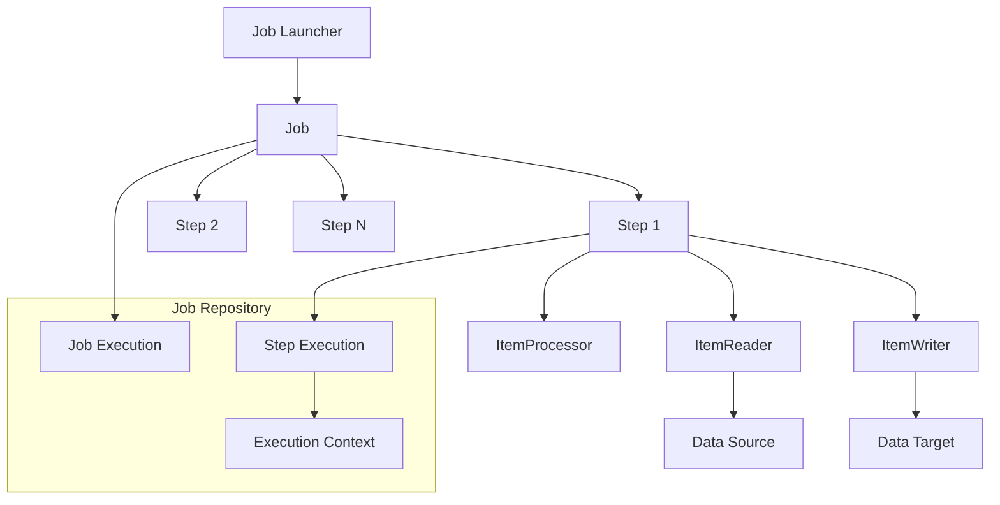
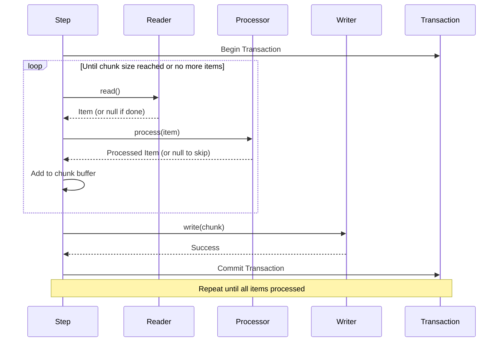
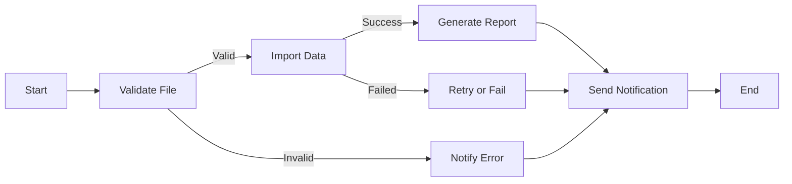

# How to Build Batch Processing Jobs with Spring Batch

Author: [nawazdhandala](https://www.github.com/nawazdhandala)

Tags: Spring Batch, Java, Batch Processing, ETL, Spring Boot

Description: Learn how to build batch processing jobs with Spring Batch including readers, processors, writers, job scheduling, and error handling.

---

Spring Batch is a framework designed for processing large volumes of data in a reliable and efficient manner. Whether you need to import CSV files into a database, generate reports, or run nightly data transformations, Spring Batch provides the infrastructure to handle these tasks with minimal code.

This guide walks you through building batch processing jobs from the ground up, covering the core concepts and practical patterns you will use in production systems.

## Understanding Spring Batch Architecture

Before writing any code, let's understand how Spring Batch organizes work. The framework uses a layered architecture where jobs contain steps, and steps contain the actual processing logic.



The key components are:

- **Job**: A container for steps that represents the entire batch process
- **Step**: A phase in the job that reads, processes, and writes data
- **ItemReader**: Retrieves data from a source one item at a time
- **ItemProcessor**: Transforms or validates each item
- **ItemWriter**: Writes processed items to a destination
- **Job Repository**: Stores metadata about job and step executions

## Setting Up Your Project

Start by adding the Spring Batch dependencies to your project. If you are using Maven, add these to your `pom.xml`:

```xml
<!-- pom.xml -->
<dependencies>
    <!-- Spring Boot Starter for Batch -->
    <dependency>
        <groupId>org.springframework.boot</groupId>
        <artifactId>spring-boot-starter-batch</artifactId>
    </dependency>

    <!-- Database for Job Repository metadata -->
    <dependency>
        <groupId>org.springframework.boot</groupId>
        <artifactId>spring-boot-starter-data-jpa</artifactId>
    </dependency>

    <!-- H2 for development, replace with your production database -->
    <dependency>
        <groupId>com.h2database</groupId>
        <artifactId>h2</artifactId>
        <scope>runtime</scope>
    </dependency>

    <!-- Testing support -->
    <dependency>
        <groupId>org.springframework.batch</groupId>
        <artifactId>spring-batch-test</artifactId>
        <scope>test</scope>
    </dependency>
</dependencies>
```

Configure your application properties:

```yaml
# application.yml
spring:
  batch:
    # Create batch tables automatically
    jdbc:
      initialize-schema: always
    job:
      # Prevent jobs from running on startup
      enabled: false
  datasource:
    url: jdbc:h2:mem:batchdb
    driver-class-name: org.h2.Driver
```

## Building Your First Batch Job

Let's create a job that reads customer records from a CSV file, validates and transforms them, then writes the results to a database.

### Define Your Domain Model

```java
// Customer.java
// Represents a customer record from the input file
public class Customer {

    private Long id;
    private String firstName;
    private String lastName;
    private String email;
    private LocalDate birthDate;
    private boolean active;

    // Default constructor required by Spring Batch
    public Customer() {
    }

    public Customer(String firstName, String lastName, String email) {
        this.firstName = firstName;
        this.lastName = lastName;
        this.email = email;
        this.active = true;
    }

    // Getters and setters omitted for brevity

    public Long getId() { return id; }
    public void setId(Long id) { this.id = id; }

    public String getFirstName() { return firstName; }
    public void setFirstName(String firstName) { this.firstName = firstName; }

    public String getLastName() { return lastName; }
    public void setLastName(String lastName) { this.lastName = lastName; }

    public String getEmail() { return email; }
    public void setEmail(String email) { this.email = email; }

    public LocalDate getBirthDate() { return birthDate; }
    public void setBirthDate(LocalDate birthDate) { this.birthDate = birthDate; }

    public boolean isActive() { return active; }
    public void setActive(boolean active) { this.active = active; }
}
```

### Configure the ItemReader

The reader pulls data from your source. Spring Batch provides readers for files, databases, message queues, and more.

```java
// BatchConfiguration.java
@Configuration
@EnableBatchProcessing
public class BatchConfiguration {

    // Reads customer data from a CSV file
    // Each line becomes a Customer object
    @Bean
    public FlatFileItemReader<Customer> customerReader() {
        return new FlatFileItemReaderBuilder<Customer>()
            .name("customerReader")
            // Resource location - can be file system or classpath
            .resource(new ClassPathResource("customers.csv"))
            // Skip the header row
            .linesToSkip(1)
            // Parse each line using comma delimiter
            .delimited()
            .delimiter(",")
            // Map CSV columns to Customer fields
            .names("firstName", "lastName", "email", "birthDate")
            // Convert line data to Customer object
            .fieldSetMapper(new BeanWrapperFieldSetMapper<>() {{
                setTargetType(Customer.class);
                // Register custom date converter
                setConversionService(createConversionService());
            }})
            // Enable strict mode - fail if file is missing
            .strict(true)
            .build();
    }

    // Create conversion service for date parsing
    private ConversionService createConversionService() {
        DefaultConversionService service = new DefaultConversionService();
        service.addConverter(new Converter<String, LocalDate>() {
            @Override
            public LocalDate convert(String source) {
                if (source == null || source.isEmpty()) {
                    return null;
                }
                return LocalDate.parse(source, DateTimeFormatter.ISO_DATE);
            }
        });
        return service;
    }
}
```

### Implement the ItemProcessor

Processors transform, validate, or filter data between reading and writing.

```java
// CustomerProcessor.java
// Processes each customer record
// Returns null to filter out invalid records
@Component
public class CustomerProcessor implements ItemProcessor<Customer, Customer> {

    private static final Logger log = LoggerFactory.getLogger(CustomerProcessor.class);

    // Email validation pattern
    private static final Pattern EMAIL_PATTERN =
        Pattern.compile("^[A-Za-z0-9+_.-]+@[A-Za-z0-9.-]+$");

    @Override
    public Customer process(Customer customer) throws Exception {
        // Validate email format
        if (!isValidEmail(customer.getEmail())) {
            log.warn("Skipping customer with invalid email: {}", customer.getEmail());
            // Returning null tells Spring Batch to skip this item
            return null;
        }

        // Transform names to proper case
        customer.setFirstName(toProperCase(customer.getFirstName()));
        customer.setLastName(toProperCase(customer.getLastName()));

        // Normalize email to lowercase
        customer.setEmail(customer.getEmail().toLowerCase().trim());

        // Set active status based on business rules
        // Customers under 18 are marked inactive
        if (customer.getBirthDate() != null) {
            int age = Period.between(customer.getBirthDate(), LocalDate.now()).getYears();
            customer.setActive(age >= 18);
        }

        log.debug("Processed customer: {} {}",
            customer.getFirstName(), customer.getLastName());

        return customer;
    }

    private boolean isValidEmail(String email) {
        return email != null && EMAIL_PATTERN.matcher(email).matches();
    }

    private String toProperCase(String input) {
        if (input == null || input.isEmpty()) {
            return input;
        }
        return input.substring(0, 1).toUpperCase() +
               input.substring(1).toLowerCase();
    }
}
```

### Configure the ItemWriter

Writers persist processed data to your target system. Here we write to a database using JDBC:

```java
// Add to BatchConfiguration.java

// Writes processed customers to the database
// Uses batch inserts for better performance
@Bean
public JdbcBatchItemWriter<Customer> customerWriter(DataSource dataSource) {
    return new JdbcBatchItemWriterBuilder<Customer>()
        .dataSource(dataSource)
        // SQL insert statement with named parameters
        .sql("""
            INSERT INTO customers (first_name, last_name, email, birth_date, active)
            VALUES (:firstName, :lastName, :email, :birthDate, :active)
            """)
        // Use bean properties as parameter source
        .beanMapped()
        // Fail if insert affects 0 rows
        .assertUpdates(true)
        .build();
}
```

### Assemble the Step

A step combines a reader, processor, and writer with a chunk size that determines how many items are processed before committing a transaction.

```java
// Add to BatchConfiguration.java

// Creates a step that processes customers in chunks
// Chunk size of 100 means 100 items are processed per transaction
@Bean
public Step importCustomerStep(
        JobRepository jobRepository,
        PlatformTransactionManager transactionManager,
        FlatFileItemReader<Customer> reader,
        CustomerProcessor processor,
        JdbcBatchItemWriter<Customer> writer) {

    return new StepBuilder("importCustomerStep", jobRepository)
        // Process 100 items per transaction
        .<Customer, Customer>chunk(100, transactionManager)
        .reader(reader)
        .processor(processor)
        .writer(writer)
        // Configure fault tolerance
        .faultTolerant()
        // Skip up to 10 bad records before failing
        .skipLimit(10)
        // Skip these exception types
        .skip(FlatFileParseException.class)
        .skip(DataIntegrityViolationException.class)
        // Add a listener for monitoring
        .listener(new ItemReadListener<Customer>() {
            @Override
            public void onReadError(Exception ex) {
                log.error("Error reading customer record", ex);
            }
        })
        .build();
}
```

### Build the Job

The job ties everything together and defines the execution flow.

```java
// Add to BatchConfiguration.java

// Creates the customer import job
// Jobs can have multiple steps executed in sequence
@Bean
public Job importCustomerJob(
        JobRepository jobRepository,
        Step importCustomerStep,
        JobCompletionListener listener) {

    return new JobBuilder("importCustomerJob", jobRepository)
        // Add completion listener for notifications
        .listener(listener)
        // Start with the import step
        .start(importCustomerStep)
        // Prevent duplicate executions with same parameters
        .preventRestart()
        .build();
}
```

## The Chunk Processing Flow

Understanding how chunks work is important for tuning performance. Here's what happens during chunk processing:



## Implementing Error Handling

Production jobs need robust error handling. Spring Batch provides several mechanisms:

### Skip Policy

Skip policies determine which errors are recoverable:

```java
// CustomSkipPolicy.java
// Determines whether to skip an item or fail the job
@Component
public class CustomSkipPolicy implements SkipPolicy {

    private static final int MAX_SKIP_COUNT = 100;
    private static final Logger log = LoggerFactory.getLogger(CustomSkipPolicy.class);

    @Override
    public boolean shouldSkip(Throwable throwable, long skipCount)
            throws SkipLimitExceededException {

        // Always fail on system errors
        if (throwable instanceof OutOfMemoryError ||
            throwable instanceof StackOverflowError) {
            return false;
        }

        // Skip data validation errors up to the limit
        if (throwable instanceof ValidationException ||
            throwable instanceof FlatFileParseException) {

            if (skipCount < MAX_SKIP_COUNT) {
                log.warn("Skipping item due to error (skip count: {}): {}",
                    skipCount, throwable.getMessage());
                return true;
            }

            log.error("Skip limit exceeded: {}", skipCount);
            throw new SkipLimitExceededException(MAX_SKIP_COUNT, throwable);
        }

        // Do not skip unknown errors
        return false;
    }
}
```

### Retry Logic

For transient failures like network timeouts, configure retries:

```java
// Step configuration with retry
@Bean
public Step importCustomerStepWithRetry(
        JobRepository jobRepository,
        PlatformTransactionManager transactionManager,
        FlatFileItemReader<Customer> reader,
        CustomerProcessor processor,
        JdbcBatchItemWriter<Customer> writer) {

    return new StepBuilder("importCustomerStep", jobRepository)
        .<Customer, Customer>chunk(100, transactionManager)
        .reader(reader)
        .processor(processor)
        .writer(writer)
        .faultTolerant()
        // Retry configuration
        .retryLimit(3)
        // Retry on these transient errors
        .retry(DeadlockLoserDataAccessException.class)
        .retry(OptimisticLockingFailureException.class)
        // Add exponential backoff between retries
        .backOffPolicy(new ExponentialBackOffPolicy() {{
            setInitialInterval(1000);  // 1 second
            setMultiplier(2.0);        // Double each retry
            setMaxInterval(10000);     // Max 10 seconds
        }})
        .build();
}
```

### Job Completion Listener

Monitor job outcomes with a completion listener:

```java
// JobCompletionListener.java
// Handles job completion events for logging and notifications
@Component
public class JobCompletionListener implements JobExecutionListener {

    private static final Logger log = LoggerFactory.getLogger(JobCompletionListener.class);

    private final NotificationService notificationService;

    public JobCompletionListener(NotificationService notificationService) {
        this.notificationService = notificationService;
    }

    @Override
    public void beforeJob(JobExecution jobExecution) {
        log.info("Job {} starting at {}",
            jobExecution.getJobInstance().getJobName(),
            jobExecution.getStartTime());
    }

    @Override
    public void afterJob(JobExecution jobExecution) {
        BatchStatus status = jobExecution.getStatus();
        String jobName = jobExecution.getJobInstance().getJobName();

        // Log execution summary
        log.info("Job {} completed with status: {}", jobName, status);

        // Log step details
        for (StepExecution step : jobExecution.getStepExecutions()) {
            log.info("Step {}: Read={}, Processed={}, Written={}, Skipped={}",
                step.getStepName(),
                step.getReadCount(),
                step.getFilterCount(),
                step.getWriteCount(),
                step.getSkipCount());
        }

        // Send notifications based on outcome
        if (status == BatchStatus.COMPLETED) {
            notificationService.notifySuccess(jobName, jobExecution.getEndTime());
        } else if (status == BatchStatus.FAILED) {
            String errorMessage = jobExecution.getAllFailureExceptions()
                .stream()
                .map(Throwable::getMessage)
                .collect(Collectors.joining("; "));
            notificationService.notifyFailure(jobName, errorMessage);
        }
    }
}
```

## Scheduling Batch Jobs

You can trigger batch jobs on a schedule using Spring's scheduling support or integrate with external schedulers.

### Using Spring Scheduler

```java
// BatchScheduler.java
// Schedules batch jobs to run at specific times
@Component
@EnableScheduling
public class BatchScheduler {

    private static final Logger log = LoggerFactory.getLogger(BatchScheduler.class);

    private final JobLauncher jobLauncher;
    private final Job importCustomerJob;

    public BatchScheduler(JobLauncher jobLauncher,
                         @Qualifier("importCustomerJob") Job importCustomerJob) {
        this.jobLauncher = jobLauncher;
        this.importCustomerJob = importCustomerJob;
    }

    // Run every day at 2 AM
    @Scheduled(cron = "0 0 2 * * ?")
    public void runDailyImport() {
        try {
            // Create unique job parameters for each run
            // This allows the same job to run multiple times
            JobParameters params = new JobParametersBuilder()
                .addLocalDateTime("executionTime", LocalDateTime.now())
                .addString("source", "scheduled")
                .toJobParameters();

            log.info("Starting scheduled customer import");
            JobExecution execution = jobLauncher.run(importCustomerJob, params);
            log.info("Job completed with status: {}", execution.getStatus());

        } catch (JobExecutionAlreadyRunningException e) {
            log.warn("Job is already running, skipping this execution");
        } catch (Exception e) {
            log.error("Failed to start scheduled job", e);
        }
    }
}
```

### REST API Trigger

Allow jobs to be triggered via HTTP:

```java
// BatchController.java
// REST endpoint for triggering batch jobs manually
@RestController
@RequestMapping("/api/batch")
public class BatchController {

    private final JobLauncher jobLauncher;
    private final JobExplorer jobExplorer;
    private final Job importCustomerJob;

    public BatchController(JobLauncher jobLauncher,
                          JobExplorer jobExplorer,
                          @Qualifier("importCustomerJob") Job importCustomerJob) {
        this.jobLauncher = jobLauncher;
        this.jobExplorer = jobExplorer;
        this.importCustomerJob = importCustomerJob;
    }

    // Trigger job via POST request
    @PostMapping("/jobs/import-customers")
    public ResponseEntity<JobExecutionResponse> triggerImport(
            @RequestParam(required = false) String inputFile) {

        try {
            JobParametersBuilder paramsBuilder = new JobParametersBuilder()
                .addLocalDateTime("executionTime", LocalDateTime.now())
                .addString("source", "api");

            // Allow custom input file
            if (inputFile != null) {
                paramsBuilder.addString("inputFile", inputFile);
            }

            JobExecution execution = jobLauncher.run(
                importCustomerJob,
                paramsBuilder.toJobParameters());

            return ResponseEntity.accepted()
                .body(new JobExecutionResponse(
                    execution.getId(),
                    execution.getStatus().toString(),
                    "Job started successfully"));

        } catch (JobExecutionAlreadyRunningException e) {
            return ResponseEntity.status(HttpStatus.CONFLICT)
                .body(new JobExecutionResponse(null, "CONFLICT",
                    "Job is already running"));
        } catch (Exception e) {
            return ResponseEntity.status(HttpStatus.INTERNAL_SERVER_ERROR)
                .body(new JobExecutionResponse(null, "FAILED", e.getMessage()));
        }
    }

    // Get job execution status
    @GetMapping("/jobs/executions/{id}")
    public ResponseEntity<JobExecutionStatus> getJobStatus(@PathVariable Long id) {
        JobExecution execution = jobExplorer.getJobExecution(id);

        if (execution == null) {
            return ResponseEntity.notFound().build();
        }

        return ResponseEntity.ok(new JobExecutionStatus(
            execution.getId(),
            execution.getStatus().toString(),
            execution.getStartTime(),
            execution.getEndTime(),
            execution.getStepExecutions().stream()
                .map(this::toStepStatus)
                .collect(Collectors.toList())));
    }

    private StepStatus toStepStatus(StepExecution step) {
        return new StepStatus(
            step.getStepName(),
            step.getStatus().toString(),
            step.getReadCount(),
            step.getWriteCount(),
            step.getSkipCount());
    }
}

// Response DTOs
record JobExecutionResponse(Long executionId, String status, String message) {}
record JobExecutionStatus(Long id, String status, LocalDateTime startTime,
                         LocalDateTime endTime, List<StepStatus> steps) {}
record StepStatus(String name, String status, int readCount,
                 int writeCount, int skipCount) {}
```

## Working with Different Data Sources

Spring Batch includes readers and writers for many data sources.

### Reading from a Database

```java
// Read customers from database using pagination
// This is memory-efficient for large tables
@Bean
public JdbcPagingItemReader<Customer> databaseReader(DataSource dataSource) {

    // Define how to sort results for consistent pagination
    Map<String, Order> sortKeys = new HashMap<>();
    sortKeys.put("id", Order.ASCENDING);

    return new JdbcPagingItemReaderBuilder<Customer>()
        .name("customerDatabaseReader")
        .dataSource(dataSource)
        // Page size determines batch fetching
        .pageSize(1000)
        // Use database-specific paging query provider
        .queryProvider(new SqlPagingQueryProviderFactoryBean() {{
            setDataSource(dataSource);
            setSelectClause("SELECT id, first_name, last_name, email, birth_date, active");
            setFromClause("FROM customers");
            setWhereClause("WHERE active = true");
            setSortKeys(sortKeys);
        }}.getObject())
        // Map rows to Customer objects
        .rowMapper((rs, rowNum) -> {
            Customer customer = new Customer();
            customer.setId(rs.getLong("id"));
            customer.setFirstName(rs.getString("first_name"));
            customer.setLastName(rs.getString("last_name"));
            customer.setEmail(rs.getString("email"));
            customer.setBirthDate(rs.getObject("birth_date", LocalDate.class));
            customer.setActive(rs.getBoolean("active"));
            return customer;
        })
        .build();
}
```

### Writing to JSON Files

```java
// Write processed results to a JSON file
@Bean
public JsonFileItemWriter<Customer> jsonWriter() {
    return new JsonFileItemWriterBuilder<Customer>()
        .name("customerJsonWriter")
        // Output file location
        .resource(new FileSystemResource("output/customers.json"))
        // Use Jackson for JSON serialization
        .jsonObjectMarshaller(new JacksonJsonObjectMarshaller<>())
        // Append to existing file
        .append(false)
        // Enable transaction support
        .transactional(true)
        .build();
}
```

## Multi-Step Jobs

Complex workflows often require multiple steps that run in sequence or conditionally.



```java
// Multi-step job configuration
@Bean
public Job customerProcessingJob(
        JobRepository jobRepository,
        Step validateFileStep,
        Step importCustomerStep,
        Step generateReportStep,
        Step notificationStep,
        Step errorNotificationStep) {

    return new JobBuilder("customerProcessingJob", jobRepository)
        // Start with file validation
        .start(validateFileStep)
        // On success, proceed to import
        .on("COMPLETED").to(importCustomerStep)
        // On validation failure, send error notification
        .from(validateFileStep).on("FAILED").to(errorNotificationStep)
        // After import, generate report
        .from(importCustomerStep).on("COMPLETED").to(generateReportStep)
        // On import failure, still send notification
        .from(importCustomerStep).on("FAILED").to(notificationStep)
        // After report, send success notification
        .from(generateReportStep).on("*").to(notificationStep)
        // Error notification ends the job
        .from(errorNotificationStep).on("*").end()
        // Success notification ends the job
        .from(notificationStep).on("*").end()
        .build()
        .build();
}

// Simple tasklet step for validation
@Bean
public Step validateFileStep(JobRepository jobRepository,
                            PlatformTransactionManager transactionManager) {
    return new StepBuilder("validateFileStep", jobRepository)
        .tasklet((contribution, chunkContext) -> {
            // Get input file from job parameters
            String inputFile = chunkContext.getStepContext()
                .getJobParameters()
                .getString("inputFile", "customers.csv");

            Resource resource = new ClassPathResource(inputFile);

            if (!resource.exists()) {
                throw new FileNotFoundException("Input file not found: " + inputFile);
            }

            // Check file is not empty
            if (resource.contentLength() == 0) {
                throw new IllegalStateException("Input file is empty");
            }

            return RepeatStatus.FINISHED;
        }, transactionManager)
        .build();
}
```

## Testing Batch Jobs

Spring Batch provides testing utilities to verify your jobs work correctly.

```java
// CustomerImportJobTest.java
@SpringBatchTest
@SpringBootTest
class CustomerImportJobTest {

    // Utility for testing jobs
    @Autowired
    private JobLauncherTestUtils jobLauncherTestUtils;

    @Autowired
    private JdbcTemplate jdbcTemplate;

    @BeforeEach
    void setUp() {
        // Clear test data before each test
        jdbcTemplate.execute("DELETE FROM customers");
    }

    @Test
    void testImportCustomerJob() throws Exception {
        // Given: A CSV file with test data (in test resources)
        JobParameters params = new JobParametersBuilder()
            .addString("inputFile", "test-customers.csv")
            .addLocalDateTime("executionTime", LocalDateTime.now())
            .toJobParameters();

        // When: We run the job
        JobExecution execution = jobLauncherTestUtils.launchJob(params);

        // Then: Job completes successfully
        assertEquals(BatchStatus.COMPLETED, execution.getStatus());

        // And: Correct number of records were imported
        int count = jdbcTemplate.queryForObject(
            "SELECT COUNT(*) FROM customers", Integer.class);
        assertEquals(5, count);  // Assuming 5 valid records in test file
    }

    @Test
    void testImportCustomerStep() throws Exception {
        // Test individual step
        JobExecution execution = jobLauncherTestUtils.launchStep("importCustomerStep");

        // Verify step execution
        StepExecution stepExecution = execution.getStepExecutions()
            .iterator().next();

        assertEquals(BatchStatus.COMPLETED, stepExecution.getStatus());
        assertTrue(stepExecution.getWriteCount() > 0);
        assertEquals(0, stepExecution.getSkipCount());
    }

    @Test
    void testProcessorFiltersInvalidEmails() throws Exception {
        // Test processor in isolation
        CustomerProcessor processor = new CustomerProcessor();

        // Valid customer passes through
        Customer valid = new Customer("John", "Doe", "john@example.com");
        Customer result = processor.process(valid);
        assertNotNull(result);
        assertEquals("john@example.com", result.getEmail());

        // Invalid email is filtered (returns null)
        Customer invalid = new Customer("Jane", "Doe", "invalid-email");
        assertNull(processor.process(invalid));
    }
}
```

## Monitoring and Observability

Track your batch jobs with proper logging and metrics.

```java
// BatchMetricsConfig.java
// Configure metrics for monitoring batch job performance
@Configuration
public class BatchMetricsConfig {

    // Register custom metrics with Micrometer
    @Bean
    public MeterBinder batchMetrics(JobExplorer jobExplorer) {
        return registry -> {
            // Gauge for running jobs
            Gauge.builder("batch.jobs.running", jobExplorer, explorer ->
                explorer.findRunningJobExecutions("importCustomerJob").size())
                .description("Number of currently running batch jobs")
                .register(registry);
        };
    }

    // Step listener to record metrics
    @Bean
    public StepExecutionListener metricsStepListener(MeterRegistry registry) {
        return new StepExecutionListener() {

            private Timer.Sample sample;

            @Override
            public void beforeStep(StepExecution stepExecution) {
                sample = Timer.start(registry);
            }

            @Override
            public ExitStatus afterStep(StepExecution stepExecution) {
                // Record step duration
                sample.stop(Timer.builder("batch.step.duration")
                    .tag("step", stepExecution.getStepName())
                    .tag("status", stepExecution.getStatus().toString())
                    .register(registry));

                // Record item counts
                Counter.builder("batch.items.read")
                    .tag("step", stepExecution.getStepName())
                    .register(registry)
                    .increment(stepExecution.getReadCount());

                Counter.builder("batch.items.written")
                    .tag("step", stepExecution.getStepName())
                    .register(registry)
                    .increment(stepExecution.getWriteCount());

                Counter.builder("batch.items.skipped")
                    .tag("step", stepExecution.getStepName())
                    .register(registry)
                    .increment(stepExecution.getSkipCount());

                return stepExecution.getExitStatus();
            }
        };
    }
}
```

## Best Practices Summary

When building batch jobs with Spring Batch, keep these guidelines in mind:

1. **Choose the right chunk size**: Start with 100-500 items and tune based on memory usage and transaction overhead. Larger chunks mean fewer commits but more memory usage.

2. **Make processors idempotent**: Jobs may restart from a failed chunk. Your processor should produce the same output for the same input.

3. **Use pagination for database reads**: Cursor-based readers hold database connections open. Paging readers are more scalable.

4. **Configure skip limits thoughtfully**: Too low and jobs fail on minor data issues. Too high and you might miss systematic problems.

5. **Add logging at key points**: Log at job start/end, step boundaries, and when skipping items. This helps with debugging production issues.

6. **Test at multiple levels**: Test processors in isolation, individual steps, and complete jobs. Use the `@SpringBatchTest` annotation for integration tests.

7. **Monitor in production**: Track job duration, item counts, skip rates, and failure reasons. Set up alerts for job failures and unusual metrics.

Spring Batch handles the hard parts of batch processing: transaction management, checkpointing, restartability, and parallel execution. Your job is to define the business logic in readers, processors, and writers, and configure the job structure to match your workflow requirements.
