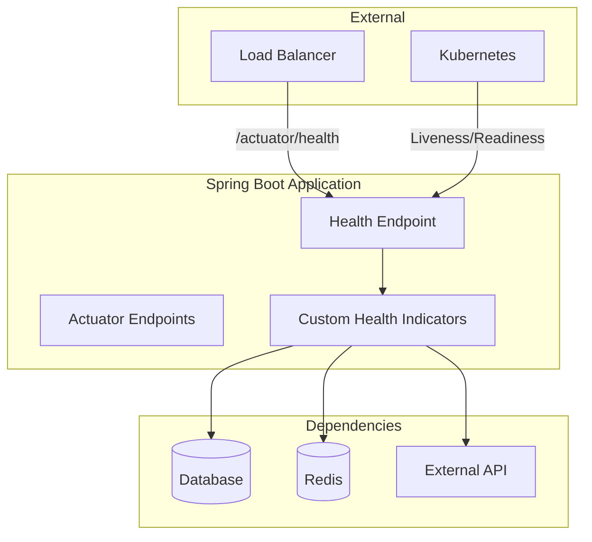
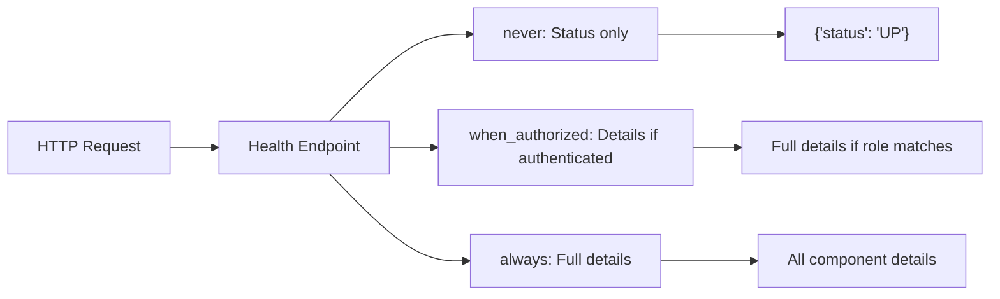
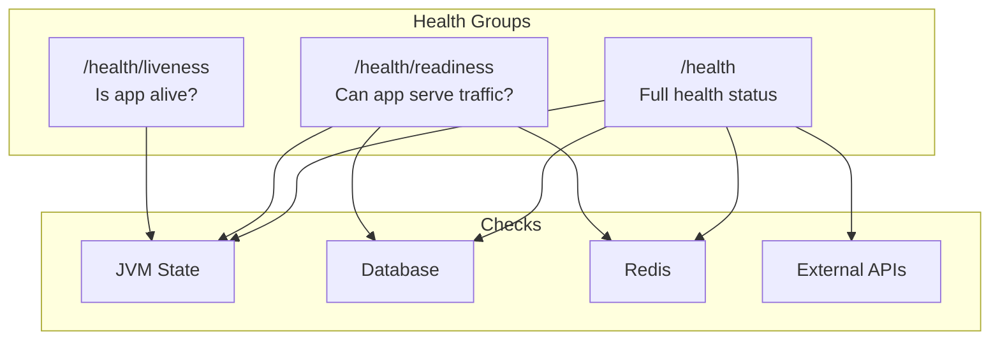
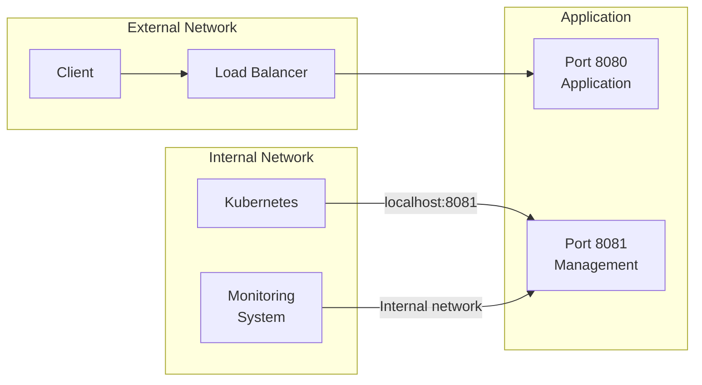
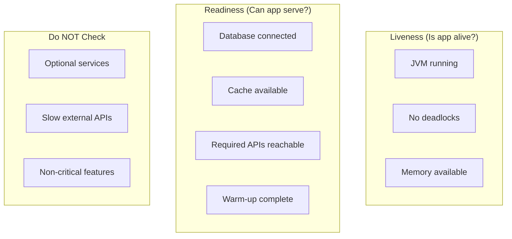

# How to Configure Spring Boot Actuator for Health Checks

Author: [nawazdhandala](https://www.github.com/nawazdhandala)

Tags: Java, Spring Boot, Actuator, Health Checks, Monitoring, Kubernetes, Microservices

Description: A practical guide to configuring Spring Boot Actuator health checks for production environments, including custom health indicators, Kubernetes probes, and security best practices.

---

> Health checks are the heartbeat of production systems. Spring Boot Actuator provides a robust health endpoint out of the box, but proper configuration makes the difference between catching issues early and scrambling during outages.

When your application runs in Kubernetes or behind a load balancer, health checks determine whether traffic gets routed to your service. Get them wrong, and you risk downtime or cascading failures.

---

## Architecture Overview



---

## Getting Started

### Add Dependencies

Add Spring Boot Actuator to your project. This single dependency enables all health check functionality:

```xml
<!-- pom.xml -->
<dependency>
    <groupId>org.springframework.boot</groupId>
    <artifactId>spring-boot-starter-actuator</artifactId>
</dependency>
```

For Gradle users:

```groovy
// build.gradle
implementation 'org.springframework.boot:spring-boot-starter-actuator'
```

---

## Basic Configuration

### Enable Health Endpoint

Configure the health endpoint in your application properties. By default, Actuator exposes minimal information for security reasons:

```yaml
# application.yml

# Management server configuration
management:
  endpoints:
    web:
      # Base path for all actuator endpoints (default: /actuator)
      base-path: /actuator
      exposure:
        # Expose only health and info endpoints (security best practice)
        include: health,info

  endpoint:
    health:
      # Show full health details (never, when_authorized, always)
      show-details: when_authorized
      # Show individual component status
      show-components: when_authorized
```

### Understanding Show-Details Options

The `show-details` property controls how much information the health endpoint reveals:



| Option | Use Case |
|--------|----------|
| `never` | Public-facing health checks |
| `when_authorized` | Internal health checks with authentication |
| `always` | Development or trusted networks only |

---

## Health Check Response Structure

### Default Response

A basic health check returns a simple status:

```json
{
  "status": "UP"
}
```

### Detailed Response

With `show-details: always`, the response includes component-level information:

```json
{
  "status": "UP",
  "components": {
    "db": {
      "status": "UP",
      "details": {
        "database": "PostgreSQL",
        "validationQuery": "isValid()"
      }
    },
    "diskSpace": {
      "status": "UP",
      "details": {
        "total": 107374182400,
        "free": 85899345920,
        "threshold": 10485760,
        "path": "/app/."
      }
    },
    "redis": {
      "status": "UP",
      "details": {
        "version": "7.0.11"
      }
    }
  }
}
```

---

## Custom Health Indicators

### Creating a Custom Health Indicator

Implement `HealthIndicator` to check application-specific dependencies. This example checks an external payment API:

```java
// PaymentApiHealthIndicator.java
package com.example.health;

import org.springframework.boot.actuate.health.Health;
import org.springframework.boot.actuate.health.HealthIndicator;
import org.springframework.stereotype.Component;
import org.springframework.web.client.RestTemplate;
import org.springframework.web.client.RestClientException;

@Component
public class PaymentApiHealthIndicator implements HealthIndicator {

    private final RestTemplate restTemplate;
    private final String paymentApiUrl;

    // Constructor injection for testability
    public PaymentApiHealthIndicator(
            RestTemplate restTemplate,
            @Value("${payment.api.health-url}") String paymentApiUrl) {
        this.restTemplate = restTemplate;
        this.paymentApiUrl = paymentApiUrl;
    }

    @Override
    public Health health() {
        try {
            // Attempt to call the payment API health endpoint
            long startTime = System.currentTimeMillis();
            restTemplate.getForObject(paymentApiUrl, String.class);
            long responseTime = System.currentTimeMillis() - startTime;

            // Include response time in health details for monitoring
            return Health.up()
                    .withDetail("responseTime", responseTime + "ms")
                    .withDetail("url", paymentApiUrl)
                    .build();

        } catch (RestClientException e) {
            // Return DOWN status with error details
            return Health.down()
                    .withDetail("error", e.getMessage())
                    .withDetail("url", paymentApiUrl)
                    .build();
        }
    }
}
```

### Health Indicator with Degraded State

Sometimes a dependency can be partially available. Use `Health.status()` to indicate degraded states:

```java
// CacheHealthIndicator.java
package com.example.health;

import org.springframework.boot.actuate.health.Health;
import org.springframework.boot.actuate.health.HealthIndicator;
import org.springframework.boot.actuate.health.Status;
import org.springframework.data.redis.connection.RedisConnectionFactory;
import org.springframework.data.redis.core.RedisTemplate;
import org.springframework.stereotype.Component;

@Component
public class CacheHealthIndicator implements HealthIndicator {

    // Custom status for degraded state (cache unavailable but app can function)
    private static final Status DEGRADED = new Status("DEGRADED");

    private final RedisTemplate<String, Object> redisTemplate;

    public CacheHealthIndicator(RedisTemplate<String, Object> redisTemplate) {
        this.redisTemplate = redisTemplate;
    }

    @Override
    public Health health() {
        try {
            // Test Redis connectivity with a ping command
            String result = redisTemplate.getConnectionFactory()
                    .getConnection()
                    .ping();

            if ("PONG".equals(result)) {
                return Health.up()
                        .withDetail("connection", "established")
                        .build();
            }

            // Unexpected response indicates degraded state
            return Health.status(DEGRADED)
                    .withDetail("connection", "unexpected response")
                    .withDetail("response", result)
                    .build();

        } catch (Exception e) {
            // Cache failure is degraded, not down (app can function without cache)
            return Health.status(DEGRADED)
                    .withDetail("error", e.getMessage())
                    .withDetail("fallback", "in-memory cache active")
                    .build();
        }
    }
}
```

---

## Health Groups

### Configuring Health Groups

Health groups let you expose different health checks for different purposes. Kubernetes uses separate endpoints for liveness and readiness probes:

```yaml
# application.yml
management:
  endpoint:
    health:
      group:
        # Liveness: Is the application running? (should restart if false)
        liveness:
          include: livenessState
          show-details: always

        # Readiness: Can the application handle requests? (should stop traffic if false)
        readiness:
          include: readinessState,db,redis
          show-details: always

        # Custom group for external monitoring
        external:
          include: ping
          show-details: never
```

### Health Group Flow



---

## Kubernetes Integration

### Kubernetes Probe Configuration

Configure your Kubernetes deployment to use the appropriate health endpoints:

```yaml
# deployment.yaml
apiVersion: apps/v1
kind: Deployment
metadata:
  name: my-spring-app
spec:
  replicas: 3
  selector:
    matchLabels:
      app: my-spring-app
  template:
    metadata:
      labels:
        app: my-spring-app
    spec:
      containers:
      - name: app
        image: my-spring-app:latest
        ports:
        - containerPort: 8080

        # Liveness probe: Restart container if this fails
        # Use for detecting deadlocks or unrecoverable states
        livenessProbe:
          httpGet:
            path: /actuator/health/liveness
            port: 8080
          # Wait for app to start before checking
          initialDelaySeconds: 30
          # Check every 10 seconds
          periodSeconds: 10
          # Restart after 3 consecutive failures
          failureThreshold: 3

        # Readiness probe: Stop sending traffic if this fails
        # Use for checking if dependencies are available
        readinessProbe:
          httpGet:
            path: /actuator/health/readiness
            port: 8080
          initialDelaySeconds: 10
          periodSeconds: 5
          # Mark unready after 3 failures
          failureThreshold: 3
          # Mark ready after 1 success
          successThreshold: 1

        # Startup probe: Give slow-starting apps more time
        # Prevents liveness probe from killing app during startup
        startupProbe:
          httpGet:
            path: /actuator/health/liveness
            port: 8080
          # Allow up to 5 minutes for startup (30 * 10s)
          failureThreshold: 30
          periodSeconds: 10
```

### Spring Boot Kubernetes Properties

Enable Kubernetes-specific health indicators:

```yaml
# application.yml
management:
  health:
    # Enable Kubernetes probe support
    probes:
      enabled: true

    # Configure liveness state
    livenessstate:
      enabled: true

    # Configure readiness state
    readinessstate:
      enabled: true
```

---

## Security Configuration

### Securing Health Endpoints

In production, protect detailed health information while allowing basic health checks:

```java
// SecurityConfig.java
package com.example.config;

import org.springframework.context.annotation.Bean;
import org.springframework.context.annotation.Configuration;
import org.springframework.security.config.annotation.web.builders.HttpSecurity;
import org.springframework.security.config.annotation.web.configuration.EnableWebSecurity;
import org.springframework.security.web.SecurityFilterChain;

@Configuration
@EnableWebSecurity
public class SecurityConfig {

    @Bean
    public SecurityFilterChain securityFilterChain(HttpSecurity http) throws Exception {
        http
            .authorizeHttpRequests(auth -> auth
                // Allow unauthenticated access to basic health (for load balancers)
                .requestMatchers("/actuator/health").permitAll()
                // Allow liveness/readiness for Kubernetes probes
                .requestMatchers("/actuator/health/liveness").permitAll()
                .requestMatchers("/actuator/health/readiness").permitAll()
                // Require authentication for detailed health info
                .requestMatchers("/actuator/health/**").hasRole("ACTUATOR")
                // Require authentication for other actuator endpoints
                .requestMatchers("/actuator/**").hasRole("ADMIN")
                // All other requests require authentication
                .anyRequest().authenticated()
            )
            .httpBasic();  // Use basic auth for simplicity

        return http.build();
    }
}
```

### Role-Based Health Details

Configure which roles can view health details:

```yaml
# application.yml
management:
  endpoint:
    health:
      show-details: when_authorized
      # Roles that can view health details
      roles: ACTUATOR,ADMIN
```

---

## Separate Management Port

### Running Actuator on a Different Port

For security, run actuator endpoints on a separate port that is not exposed externally:

```yaml
# application.yml
server:
  # Main application port (exposed externally)
  port: 8080

management:
  server:
    # Actuator endpoints on internal-only port
    port: 8081
    # Bind only to localhost for internal access
    address: 127.0.0.1
  endpoints:
    web:
      exposure:
        # Safe to expose more endpoints on internal port
        include: health,info,metrics,prometheus
```

### Network Architecture



---

## Database Health Checks

### Default Database Health

Spring Boot automatically configures database health checks when a DataSource is present:

```yaml
# application.yml
management:
  health:
    db:
      enabled: true  # Enabled by default
```

### Custom Database Health Check

For more control, create a custom database health indicator:

```java
// DatabaseHealthIndicator.java
package com.example.health;

import org.springframework.boot.actuate.health.Health;
import org.springframework.boot.actuate.health.HealthIndicator;
import org.springframework.jdbc.core.JdbcTemplate;
import org.springframework.stereotype.Component;

@Component
public class DatabaseHealthIndicator implements HealthIndicator {

    private final JdbcTemplate jdbcTemplate;

    public DatabaseHealthIndicator(JdbcTemplate jdbcTemplate) {
        this.jdbcTemplate = jdbcTemplate;
    }

    @Override
    public Health health() {
        try {
            // Execute a lightweight query to verify database connectivity
            long startTime = System.currentTimeMillis();
            Integer result = jdbcTemplate.queryForObject("SELECT 1", Integer.class);
            long queryTime = System.currentTimeMillis() - startTime;

            // Check query time against threshold
            if (queryTime > 1000) {
                // Database is responding slowly
                return Health.up()
                        .withDetail("status", "slow")
                        .withDetail("queryTime", queryTime + "ms")
                        .withDetail("threshold", "1000ms")
                        .build();
            }

            return Health.up()
                    .withDetail("queryTime", queryTime + "ms")
                    .build();

        } catch (Exception e) {
            return Health.down()
                    .withException(e)
                    .build();
        }
    }
}
```

---

## Composite Health Checks

### Aggregating Multiple Checks

Create a composite health indicator that checks multiple related services:

```java
// MicroservicesHealthIndicator.java
package com.example.health;

import org.springframework.boot.actuate.health.CompositeHealthContributor;
import org.springframework.boot.actuate.health.HealthContributor;
import org.springframework.boot.actuate.health.NamedContributor;
import org.springframework.stereotype.Component;

import java.util.Iterator;
import java.util.LinkedHashMap;
import java.util.Map;

@Component("microservices")
public class MicroservicesHealthIndicator implements CompositeHealthContributor {

    private final Map<String, HealthContributor> contributors;

    public MicroservicesHealthIndicator(
            UserServiceHealthIndicator userService,
            OrderServiceHealthIndicator orderService,
            InventoryServiceHealthIndicator inventoryService) {

        // Register all microservice health indicators
        this.contributors = new LinkedHashMap<>();
        this.contributors.put("userService", userService);
        this.contributors.put("orderService", orderService);
        this.contributors.put("inventoryService", inventoryService);
    }

    @Override
    public HealthContributor getContributor(String name) {
        return contributors.get(name);
    }

    @Override
    public Iterator<NamedContributor<HealthContributor>> iterator() {
        return contributors.entrySet().stream()
                .map(entry -> NamedContributor.of(entry.getKey(), entry.getValue()))
                .iterator();
    }
}
```

The resulting health response shows nested components:

```json
{
  "status": "UP",
  "components": {
    "microservices": {
      "status": "UP",
      "components": {
        "userService": {
          "status": "UP",
          "details": { "responseTime": "45ms" }
        },
        "orderService": {
          "status": "UP",
          "details": { "responseTime": "32ms" }
        },
        "inventoryService": {
          "status": "UP",
          "details": { "responseTime": "28ms" }
        }
      }
    }
  }
}
```

---

## Health Check Best Practices

### What to Check



### Configuration Best Practices

```yaml
# application.yml - Production configuration
management:
  endpoints:
    web:
      exposure:
        # Only expose what you need
        include: health,info,prometheus

  endpoint:
    health:
      # Never expose details to anonymous users in production
      show-details: when_authorized

      # Configure health groups for Kubernetes
      group:
        liveness:
          include: livenessState
        readiness:
          include: readinessState,db

  health:
    # Disable health checks for optional dependencies
    mail:
      enabled: false

    # Configure timeouts to prevent slow health checks
    defaults:
      enabled: true

# Custom timeout for health checks
app:
  health:
    timeout: 5000  # 5 second timeout for external checks
```

### Implementing Timeouts

Prevent slow dependencies from blocking health checks:

```java
// TimeoutHealthIndicator.java
package com.example.health;

import org.springframework.boot.actuate.health.Health;
import org.springframework.boot.actuate.health.HealthIndicator;
import org.springframework.stereotype.Component;

import java.util.concurrent.*;

@Component
public class ExternalApiHealthIndicator implements HealthIndicator {

    private final ExternalApiClient apiClient;
    private final ExecutorService executor;
    private final long timeoutMillis;

    public ExternalApiHealthIndicator(
            ExternalApiClient apiClient,
            @Value("${app.health.timeout:5000}") long timeoutMillis) {
        this.apiClient = apiClient;
        this.timeoutMillis = timeoutMillis;
        // Single thread executor for health checks
        this.executor = Executors.newSingleThreadExecutor();
    }

    @Override
    public Health health() {
        Future<Health> future = executor.submit(this::checkHealth);

        try {
            // Wait for health check with timeout
            return future.get(timeoutMillis, TimeUnit.MILLISECONDS);

        } catch (TimeoutException e) {
            future.cancel(true);
            return Health.down()
                    .withDetail("error", "Health check timed out")
                    .withDetail("timeout", timeoutMillis + "ms")
                    .build();

        } catch (Exception e) {
            return Health.down()
                    .withException(e)
                    .build();
        }
    }

    private Health checkHealth() {
        try {
            boolean healthy = apiClient.isHealthy();
            return healthy ? Health.up().build() : Health.down().build();
        } catch (Exception e) {
            return Health.down().withException(e).build();
        }
    }
}
```

---

## Testing Health Indicators

### Unit Testing Custom Health Indicators

```java
// PaymentApiHealthIndicatorTest.java
package com.example.health;

import org.junit.jupiter.api.Test;
import org.junit.jupiter.api.extension.ExtendWith;
import org.mockito.InjectMocks;
import org.mockito.Mock;
import org.mockito.junit.jupiter.MockitoExtension;
import org.springframework.boot.actuate.health.Health;
import org.springframework.boot.actuate.health.Status;
import org.springframework.web.client.RestTemplate;
import org.springframework.web.client.RestClientException;

import static org.assertj.core.api.Assertions.assertThat;
import static org.mockito.Mockito.when;

@ExtendWith(MockitoExtension.class)
class PaymentApiHealthIndicatorTest {

    @Mock
    private RestTemplate restTemplate;

    @InjectMocks
    private PaymentApiHealthIndicator healthIndicator;

    @Test
    void shouldReturnUpWhenApiResponds() {
        // Given
        when(restTemplate.getForObject("http://payment-api/health", String.class))
                .thenReturn("OK");

        // When
        Health health = healthIndicator.health();

        // Then
        assertThat(health.getStatus()).isEqualTo(Status.UP);
        assertThat(health.getDetails()).containsKey("responseTime");
    }

    @Test
    void shouldReturnDownWhenApiUnavailable() {
        // Given
        when(restTemplate.getForObject("http://payment-api/health", String.class))
                .thenThrow(new RestClientException("Connection refused"));

        // When
        Health health = healthIndicator.health();

        // Then
        assertThat(health.getStatus()).isEqualTo(Status.DOWN);
        assertThat(health.getDetails()).containsEntry("error", "Connection refused");
    }
}
```

### Integration Testing Health Endpoints

```java
// HealthEndpointIntegrationTest.java
package com.example.health;

import org.junit.jupiter.api.Test;
import org.springframework.beans.factory.annotation.Autowired;
import org.springframework.boot.test.autoconfigure.web.servlet.AutoConfigureMockMvc;
import org.springframework.boot.test.context.SpringBootTest;
import org.springframework.test.web.servlet.MockMvc;

import static org.springframework.test.web.servlet.request.MockMvcRequestBuilders.get;
import static org.springframework.test.web.servlet.result.MockMvcResultMatchers.*;

@SpringBootTest
@AutoConfigureMockMvc
class HealthEndpointIntegrationTest {

    @Autowired
    private MockMvc mockMvc;

    @Test
    void healthEndpointReturnsUp() throws Exception {
        mockMvc.perform(get("/actuator/health"))
                .andExpect(status().isOk())
                .andExpect(jsonPath("$.status").value("UP"));
    }

    @Test
    void livenessProbeReturnsUp() throws Exception {
        mockMvc.perform(get("/actuator/health/liveness"))
                .andExpect(status().isOk())
                .andExpect(jsonPath("$.status").value("UP"));
    }

    @Test
    void readinessProbeChecksDatabase() throws Exception {
        mockMvc.perform(get("/actuator/health/readiness"))
                .andExpect(status().isOk())
                .andExpect(jsonPath("$.status").value("UP"))
                .andExpect(jsonPath("$.components.db").exists());
    }
}
```

---

## Conclusion

Spring Boot Actuator health checks are essential for production deployments. Key points to remember:

- **Use health groups** to separate liveness from readiness checks
- **Secure detailed health information** with authentication
- **Implement timeouts** to prevent slow checks from blocking probes
- **Create custom health indicators** for application-specific dependencies
- **Test your health indicators** to ensure they behave correctly under failure conditions

Proper health check configuration keeps your application running smoothly in Kubernetes, behind load balancers, and under monitoring systems.

---

*Looking for comprehensive monitoring beyond health checks? [OneUptime](https://oneuptime.com) provides full-stack observability with metrics, traces, and alerting that integrates with Spring Boot Actuator endpoints.*
