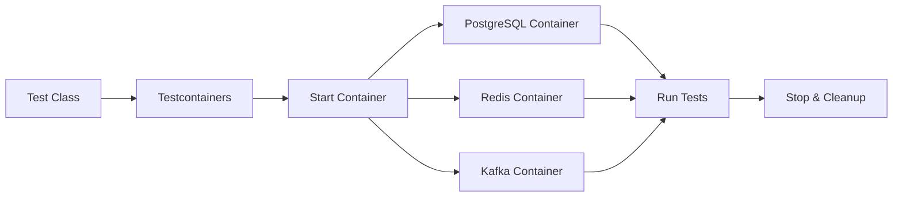
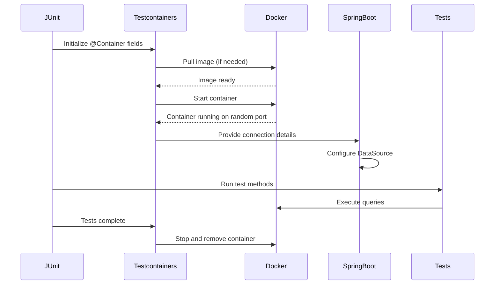
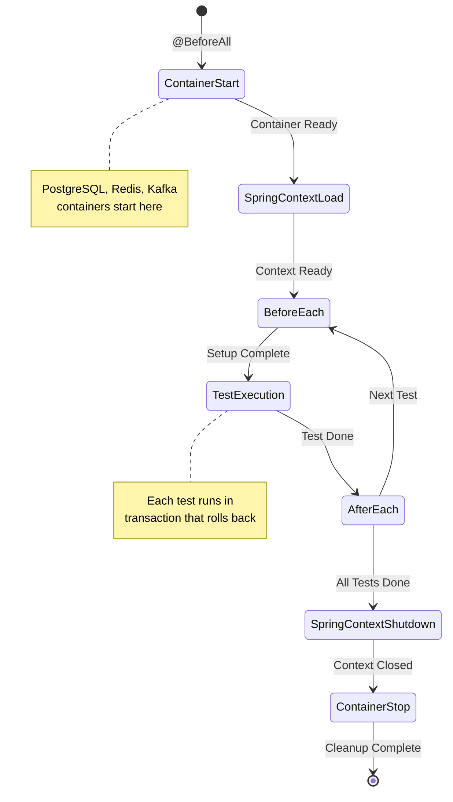

# How to Use Spring Boot Testcontainers

Author: [nawazdhandala](https://www.github.com/nawazdhandala)

Tags: Spring Boot, Testcontainers, Java, Integration Testing, Docker, JUnit 5, Database Testing

Description: Learn how to use Testcontainers with Spring Boot to run integration tests against real databases and services in Docker containers.

---

Testing against real dependencies like databases, message queues, and caches gives you confidence that your application works in production. Spring Boot 3.1+ provides first-class support for Testcontainers, making it simple to spin up Docker containers during your tests.

## Why Use Testcontainers?

Traditional integration testing often relies on:
- In-memory databases like H2 that behave differently from production databases
- Shared test databases that lead to flaky tests
- Manual setup of local services before running tests

Testcontainers solves these problems by starting fresh, isolated Docker containers for each test run.



## Project Setup

Add the Testcontainers dependencies to your `pom.xml`:

```xml
<!-- pom.xml -->
<dependencies>
    <!-- Spring Boot Starter Test includes JUnit 5 -->
    <dependency>
        <groupId>org.springframework.boot</groupId>
        <artifactId>spring-boot-starter-test</artifactId>
        <scope>test</scope>
    </dependency>

    <!-- Testcontainers BOM for version management -->
    <dependency>
        <groupId>org.springframework.boot</groupId>
        <artifactId>spring-boot-testcontainers</artifactId>
        <scope>test</scope>
    </dependency>

    <!-- Testcontainers JUnit 5 integration -->
    <dependency>
        <groupId>org.testcontainers</groupId>
        <artifactId>junit-jupiter</artifactId>
        <scope>test</scope>
    </dependency>

    <!-- PostgreSQL Testcontainer module -->
    <dependency>
        <groupId>org.testcontainers</groupId>
        <artifactId>postgresql</artifactId>
        <scope>test</scope>
    </dependency>
</dependencies>

<dependencyManagement>
    <dependencies>
        <!-- Testcontainers BOM ensures compatible versions -->
        <dependency>
            <groupId>org.testcontainers</groupId>
            <artifactId>testcontainers-bom</artifactId>
            <version>1.19.7</version>
            <type>pom</type>
            <scope>import</scope>
        </dependency>
    </dependencies>
</dependencyManagement>
```

For Gradle projects, add to `build.gradle`:

```groovy
// build.gradle
dependencies {
    testImplementation 'org.springframework.boot:spring-boot-starter-test'
    testImplementation 'org.springframework.boot:spring-boot-testcontainers'
    testImplementation 'org.testcontainers:junit-jupiter'
    testImplementation 'org.testcontainers:postgresql'
}
```

## Basic PostgreSQL Integration Test

Here is a complete example testing a user repository against a real PostgreSQL database:

```java
// src/test/java/com/example/UserRepositoryTest.java
package com.example;

import org.junit.jupiter.api.Test;
import org.springframework.beans.factory.annotation.Autowired;
import org.springframework.boot.test.context.SpringBootTest;
import org.springframework.boot.testcontainers.service.connection.ServiceConnection;
import org.testcontainers.containers.PostgreSQLContainer;
import org.testcontainers.junit.jupiter.Container;
import org.testcontainers.junit.jupiter.Testcontainers;

import static org.assertj.core.api.Assertions.assertThat;

// Enable Testcontainers JUnit 5 extension
@Testcontainers
// Load full Spring application context for integration test
@SpringBootTest
class UserRepositoryTest {

    // @Container marks this as a container managed by Testcontainers
    // @ServiceConnection tells Spring Boot to auto-configure the datasource
    @Container
    @ServiceConnection
    static PostgreSQLContainer<?> postgres = new PostgreSQLContainer<>("postgres:16-alpine");

    @Autowired
    private UserRepository userRepository;

    @Test
    void shouldSaveAndRetrieveUser() {
        // Arrange: Create a new user entity
        User user = new User();
        user.setEmail("john@example.com");
        user.setName("John Doe");

        // Act: Save to the real PostgreSQL database
        User savedUser = userRepository.save(user);

        // Assert: Verify the user was persisted correctly
        assertThat(savedUser.getId()).isNotNull();

        // Query back from database to verify persistence
        User foundUser = userRepository.findById(savedUser.getId()).orElseThrow();
        assertThat(foundUser.getEmail()).isEqualTo("john@example.com");
        assertThat(foundUser.getName()).isEqualTo("John Doe");
    }

    @Test
    void shouldFindUserByEmail() {
        // Arrange: Insert test data
        User user = new User();
        user.setEmail("jane@example.com");
        user.setName("Jane Doe");
        userRepository.save(user);

        // Act: Query by email
        User found = userRepository.findByEmail("jane@example.com");

        // Assert: Verify the query works against real PostgreSQL
        assertThat(found).isNotNull();
        assertThat(found.getName()).isEqualTo("Jane Doe");
    }
}
```

The `@ServiceConnection` annotation is the key integration point. Spring Boot automatically detects the container type and configures the corresponding properties (like `spring.datasource.url`).

## How Container Lifecycle Works

Understanding the container lifecycle helps you write efficient tests:



## Sharing Containers Across Tests

Starting a new container for every test class is slow. Use a singleton pattern to share containers:

```java
// src/test/java/com/example/IntegrationTestBase.java
package com.example;

import org.springframework.boot.test.context.SpringBootTest;
import org.springframework.boot.testcontainers.service.connection.ServiceConnection;
import org.testcontainers.containers.PostgreSQLContainer;
import org.testcontainers.junit.jupiter.Testcontainers;

// Base class for all integration tests
@Testcontainers
@SpringBootTest
public abstract class IntegrationTestBase {

    // Static container shared across all test classes
    // Not annotated with @Container since we manage lifecycle manually
    @ServiceConnection
    static PostgreSQLContainer<?> postgres;

    // Static block ensures container starts once for all tests
    static {
        postgres = new PostgreSQLContainer<>("postgres:16-alpine")
            // Use a fixed database name for debugging
            .withDatabaseName("testdb")
            // Custom username and password
            .withUsername("test")
            .withPassword("test")
            // Initialize with schema if needed
            .withInitScript("schema.sql");

        // Start the container once
        postgres.start();
    }
}
```

```java
// src/test/java/com/example/OrderServiceTest.java
package com.example;

import org.junit.jupiter.api.Test;
import org.springframework.beans.factory.annotation.Autowired;
import org.springframework.transaction.annotation.Transactional;

// Extends base class to reuse the shared container
@Transactional // Each test runs in a transaction that rolls back
class OrderServiceTest extends IntegrationTestBase {

    @Autowired
    private OrderService orderService;

    @Autowired
    private UserRepository userRepository;

    @Test
    void shouldCreateOrderForUser() {
        // Arrange
        User user = userRepository.save(new User("buyer@example.com", "Buyer"));

        // Act
        Order order = orderService.createOrder(user.getId(), "SKU-123", 2);

        // Assert
        assertThat(order.getId()).isNotNull();
        assertThat(order.getUserId()).isEqualTo(user.getId());
        assertThat(order.getQuantity()).isEqualTo(2);
    }
}
```

## Testing with Multiple Containers

Real applications depend on multiple services. Here is how to set up PostgreSQL and Redis together:

```java
// src/test/java/com/example/CachedUserServiceTest.java
package com.example;

import org.junit.jupiter.api.BeforeEach;
import org.junit.jupiter.api.Test;
import org.springframework.beans.factory.annotation.Autowired;
import org.springframework.boot.test.context.SpringBootTest;
import org.springframework.boot.testcontainers.service.connection.ServiceConnection;
import org.testcontainers.containers.GenericContainer;
import org.testcontainers.containers.PostgreSQLContainer;
import org.testcontainers.junit.jupiter.Container;
import org.testcontainers.junit.jupiter.Testcontainers;
import org.testcontainers.utility.DockerImageName;

import static org.assertj.core.api.Assertions.assertThat;

@Testcontainers
@SpringBootTest
class CachedUserServiceTest {

    // PostgreSQL for persistence
    @Container
    @ServiceConnection
    static PostgreSQLContainer<?> postgres = new PostgreSQLContainer<>("postgres:16-alpine");

    // Redis for caching - using GenericContainer since there is no @ServiceConnection for Redis
    @Container
    static GenericContainer<?> redis = new GenericContainer<>(DockerImageName.parse("redis:7-alpine"))
        .withExposedPorts(6379);

    @Autowired
    private CachedUserService userService;

    @Autowired
    private UserRepository userRepository;

    // Configure Redis connection dynamically
    @org.springframework.test.context.DynamicPropertySource
    static void configureRedis(org.springframework.test.context.DynamicPropertyRegistry registry) {
        // Testcontainers maps container ports to random host ports
        registry.add("spring.data.redis.host", redis::getHost);
        registry.add("spring.data.redis.port", () -> redis.getMappedPort(6379));
    }

    @BeforeEach
    void setUp() {
        // Clear any cached data between tests
        userService.clearCache();
    }

    @Test
    void shouldCacheUserAfterFirstLookup() {
        // Arrange: Save user to database
        User user = userRepository.save(new User("cached@example.com", "Cached User"));

        // Act: First call hits the database
        User firstCall = userService.findById(user.getId());
        // Second call should hit the cache
        User secondCall = userService.findById(user.getId());

        // Assert: Both return the same data
        assertThat(firstCall.getEmail()).isEqualTo("cached@example.com");
        assertThat(secondCall.getEmail()).isEqualTo("cached@example.com");

        // Verify cache was used (check metrics or use spy)
        assertThat(userService.getCacheHitCount()).isEqualTo(1);
    }
}
```

## Using Testcontainers with Docker Compose

For complex setups, use Docker Compose to define your test infrastructure:

```yaml
# src/test/resources/docker-compose-test.yml
version: '3.8'
services:
  postgres:
    image: postgres:16-alpine
    environment:
      POSTGRES_DB: testdb
      POSTGRES_USER: test
      POSTGRES_PASSWORD: test
    ports:
      - "5432"

  redis:
    image: redis:7-alpine
    ports:
      - "6379"

  kafka:
    image: confluentinc/cp-kafka:7.5.0
    environment:
      KAFKA_BROKER_ID: 1
      KAFKA_ZOOKEEPER_CONNECT: zookeeper:2181
      KAFKA_ADVERTISED_LISTENERS: PLAINTEXT://kafka:9092
    depends_on:
      - zookeeper
    ports:
      - "9092"

  zookeeper:
    image: confluentinc/cp-zookeeper:7.5.0
    environment:
      ZOOKEEPER_CLIENT_PORT: 2181
```

```java
// src/test/java/com/example/DockerComposeIntegrationTest.java
package com.example;

import org.junit.jupiter.api.Test;
import org.springframework.beans.factory.annotation.Autowired;
import org.springframework.boot.test.context.SpringBootTest;
import org.springframework.test.context.DynamicPropertyRegistry;
import org.springframework.test.context.DynamicPropertySource;
import org.testcontainers.containers.DockerComposeContainer;
import org.testcontainers.containers.wait.strategy.Wait;
import org.testcontainers.junit.jupiter.Container;
import org.testcontainers.junit.jupiter.Testcontainers;

import java.io.File;
import java.time.Duration;

@Testcontainers
@SpringBootTest
class DockerComposeIntegrationTest {

    @Container
    static DockerComposeContainer<?> compose = new DockerComposeContainer<>(
            new File("src/test/resources/docker-compose-test.yml"))
        // Wait for PostgreSQL to be ready
        .withExposedService("postgres", 5432,
            Wait.forListeningPort().withStartupTimeout(Duration.ofSeconds(60)))
        // Wait for Redis to be ready
        .withExposedService("redis", 6379,
            Wait.forListeningPort())
        // Wait for Kafka to be ready
        .withExposedService("kafka", 9092,
            Wait.forListeningPort().withStartupTimeout(Duration.ofSeconds(90)));

    @DynamicPropertySource
    static void configureProperties(DynamicPropertyRegistry registry) {
        // Configure PostgreSQL
        String postgresHost = compose.getServiceHost("postgres", 5432);
        Integer postgresPort = compose.getServicePort("postgres", 5432);
        registry.add("spring.datasource.url",
            () -> "jdbc:postgresql://" + postgresHost + ":" + postgresPort + "/testdb");
        registry.add("spring.datasource.username", () -> "test");
        registry.add("spring.datasource.password", () -> "test");

        // Configure Redis
        registry.add("spring.data.redis.host",
            () -> compose.getServiceHost("redis", 6379));
        registry.add("spring.data.redis.port",
            () -> compose.getServicePort("redis", 6379));

        // Configure Kafka
        registry.add("spring.kafka.bootstrap-servers",
            () -> compose.getServiceHost("kafka", 9092) + ":" +
                  compose.getServicePort("kafka", 9092));
    }

    @Autowired
    private OrderEventPublisher eventPublisher;

    @Test
    void shouldPublishOrderEventToKafka() {
        // Test with all services running
        Order order = new Order(1L, "SKU-001", 5);

        eventPublisher.publish(order);

        // Assert event was published and can be consumed
        // ... verification logic
    }
}
```

## Testing Database Migrations with Flyway

Testcontainers works great with Flyway to verify your migrations:

```java
// src/test/java/com/example/MigrationTest.java
package com.example;

import org.flywaydb.core.Flyway;
import org.junit.jupiter.api.Test;
import org.springframework.beans.factory.annotation.Autowired;
import org.springframework.boot.test.context.SpringBootTest;
import org.springframework.boot.testcontainers.service.connection.ServiceConnection;
import org.springframework.jdbc.core.JdbcTemplate;
import org.testcontainers.containers.PostgreSQLContainer;
import org.testcontainers.junit.jupiter.Container;
import org.testcontainers.junit.jupiter.Testcontainers;

import java.util.List;
import java.util.Map;

import static org.assertj.core.api.Assertions.assertThat;

@Testcontainers
@SpringBootTest
class MigrationTest {

    @Container
    @ServiceConnection
    static PostgreSQLContainer<?> postgres = new PostgreSQLContainer<>("postgres:16-alpine");

    @Autowired
    private JdbcTemplate jdbcTemplate;

    @Autowired
    private Flyway flyway;

    @Test
    void shouldApplyAllMigrations() {
        // Verify all migrations applied successfully
        var info = flyway.info();

        assertThat(info.pending()).isEmpty();
        assertThat(info.applied()).isNotEmpty();
    }

    @Test
    void shouldCreateUsersTableWithCorrectSchema() {
        // Query PostgreSQL system catalog to verify schema
        List<Map<String, Object>> columns = jdbcTemplate.queryForList(
            "SELECT column_name, data_type, is_nullable " +
            "FROM information_schema.columns " +
            "WHERE table_name = 'users' " +
            "ORDER BY ordinal_position"
        );

        // Verify expected columns exist with correct types
        assertThat(columns).hasSize(4);
        assertThat(columns.get(0).get("column_name")).isEqualTo("id");
        assertThat(columns.get(1).get("column_name")).isEqualTo("email");
        assertThat(columns.get(2).get("column_name")).isEqualTo("name");
        assertThat(columns.get(3).get("column_name")).isEqualTo("created_at");
    }

    @Test
    void shouldEnforceUniqueEmailConstraint() {
        // Insert first user
        jdbcTemplate.update(
            "INSERT INTO users (email, name) VALUES (?, ?)",
            "unique@example.com", "First User"
        );

        // Attempt duplicate should fail
        assertThatThrownBy(() ->
            jdbcTemplate.update(
                "INSERT INTO users (email, name) VALUES (?, ?)",
                "unique@example.com", "Second User"
            )
        ).hasMessageContaining("unique");
    }
}
```

## Testing REST APIs with Real Database

Combine Testcontainers with MockMvc for end-to-end API tests:

```java
// src/test/java/com/example/UserControllerIntegrationTest.java
package com.example;

import com.fasterxml.jackson.databind.ObjectMapper;
import org.junit.jupiter.api.Test;
import org.springframework.beans.factory.annotation.Autowired;
import org.springframework.boot.test.autoconfigure.web.servlet.AutoConfigureMockMvc;
import org.springframework.boot.test.context.SpringBootTest;
import org.springframework.boot.testcontainers.service.connection.ServiceConnection;
import org.springframework.http.MediaType;
import org.springframework.test.web.servlet.MockMvc;
import org.testcontainers.containers.PostgreSQLContainer;
import org.testcontainers.junit.jupiter.Container;
import org.testcontainers.junit.jupiter.Testcontainers;

import static org.springframework.test.web.servlet.request.MockMvcRequestBuilders.*;
import static org.springframework.test.web.servlet.result.MockMvcResultMatchers.*;

@Testcontainers
@SpringBootTest
@AutoConfigureMockMvc
class UserControllerIntegrationTest {

    @Container
    @ServiceConnection
    static PostgreSQLContainer<?> postgres = new PostgreSQLContainer<>("postgres:16-alpine");

    @Autowired
    private MockMvc mockMvc;

    @Autowired
    private ObjectMapper objectMapper;

    @Autowired
    private UserRepository userRepository;

    @Test
    void shouldCreateUserViaApi() throws Exception {
        // Arrange: Prepare request body
        CreateUserRequest request = new CreateUserRequest("api@example.com", "API User");

        // Act & Assert: POST to create user
        mockMvc.perform(post("/api/users")
                .contentType(MediaType.APPLICATION_JSON)
                .content(objectMapper.writeValueAsString(request)))
            .andExpect(status().isCreated())
            .andExpect(jsonPath("$.id").exists())
            .andExpect(jsonPath("$.email").value("api@example.com"))
            .andExpect(jsonPath("$.name").value("API User"));

        // Verify user exists in database
        User saved = userRepository.findByEmail("api@example.com");
        assertThat(saved).isNotNull();
    }

    @Test
    void shouldReturnUserById() throws Exception {
        // Arrange: Insert user directly into database
        User user = userRepository.save(new User("existing@example.com", "Existing User"));

        // Act & Assert: GET user by ID
        mockMvc.perform(get("/api/users/{id}", user.getId()))
            .andExpect(status().isOk())
            .andExpect(jsonPath("$.email").value("existing@example.com"))
            .andExpect(jsonPath("$.name").value("Existing User"));
    }

    @Test
    void shouldReturn404ForNonExistentUser() throws Exception {
        mockMvc.perform(get("/api/users/{id}", 99999))
            .andExpect(status().isNotFound());
    }

    @Test
    void shouldValidateUserInput() throws Exception {
        // Missing required fields should return 400
        CreateUserRequest invalid = new CreateUserRequest("", "");

        mockMvc.perform(post("/api/users")
                .contentType(MediaType.APPLICATION_JSON)
                .content(objectMapper.writeValueAsString(invalid)))
            .andExpect(status().isBadRequest())
            .andExpect(jsonPath("$.errors").isArray());
    }
}
```

## Test Data Management

Managing test data across integration tests requires careful consideration:

```java
// src/test/java/com/example/TestDataBuilder.java
package com.example;

import org.springframework.stereotype.Component;
import org.springframework.transaction.annotation.Transactional;

// Helper class for creating test data
@Component
public class TestDataBuilder {

    private final UserRepository userRepository;
    private final OrderRepository orderRepository;

    public TestDataBuilder(UserRepository userRepository, OrderRepository orderRepository) {
        this.userRepository = userRepository;
        this.orderRepository = orderRepository;
    }

    // Create user with sensible defaults
    public User createUser(String email) {
        User user = new User();
        user.setEmail(email);
        user.setName(email.split("@")[0]);
        return userRepository.save(user);
    }

    // Create user with order history
    public User createUserWithOrders(String email, int orderCount) {
        User user = createUser(email);

        for (int i = 0; i < orderCount; i++) {
            Order order = new Order();
            order.setUserId(user.getId());
            order.setSku("SKU-" + i);
            order.setQuantity(1 + i);
            orderRepository.save(order);
        }

        return user;
    }

    // Cleanup all test data
    @Transactional
    public void cleanup() {
        orderRepository.deleteAll();
        userRepository.deleteAll();
    }
}
```

```java
// src/test/java/com/example/OrderHistoryTest.java
package com.example;

import org.junit.jupiter.api.AfterEach;
import org.junit.jupiter.api.Test;
import org.springframework.beans.factory.annotation.Autowired;

class OrderHistoryTest extends IntegrationTestBase {

    @Autowired
    private TestDataBuilder testData;

    @Autowired
    private OrderHistoryService orderHistoryService;

    @AfterEach
    void tearDown() {
        // Clean up after each test for isolation
        testData.cleanup();
    }

    @Test
    void shouldCalculateTotalOrderValue() {
        // Arrange: Create user with 3 orders
        User user = testData.createUserWithOrders("shopper@example.com", 3);

        // Act
        OrderSummary summary = orderHistoryService.getSummary(user.getId());

        // Assert
        assertThat(summary.getOrderCount()).isEqualTo(3);
        assertThat(summary.getTotalValue()).isGreaterThan(BigDecimal.ZERO);
    }
}
```

## Container Lifecycle Diagram

This diagram shows how containers interact with the Spring test lifecycle:



## Performance Optimization Tips

Testcontainers can be slow if not configured properly. Here are some optimizations:

### 1. Use Container Reuse

Enable container reuse in `~/.testcontainers.properties`:

```properties
# ~/.testcontainers.properties
testcontainers.reuse.enable=true
```

Then mark containers as reusable:

```java
@Container
@ServiceConnection
static PostgreSQLContainer<?> postgres = new PostgreSQLContainer<>("postgres:16-alpine")
    .withReuse(true);  // Keep container running between test runs
```

### 2. Use Alpine Images

Alpine-based images are smaller and start faster:

```java
// Prefer alpine images when available
new PostgreSQLContainer<>("postgres:16-alpine")  // 80MB vs 400MB
new GenericContainer<>("redis:7-alpine")          // 15MB vs 50MB
```

### 3. Parallel Test Execution

Configure JUnit 5 to run tests in parallel with shared containers:

```properties
# src/test/resources/junit-platform.properties
junit.jupiter.execution.parallel.enabled=true
junit.jupiter.execution.parallel.mode.default=same_thread
junit.jupiter.execution.parallel.mode.classes.default=concurrent
```

### 4. Use Test Slices When Possible

For focused tests, use Spring Boot test slices instead of `@SpringBootTest`:

```java
// Only loads JPA-related beans
@DataJpaTest
@Testcontainers
class UserRepositorySliceTest {

    @Container
    @ServiceConnection
    static PostgreSQLContainer<?> postgres = new PostgreSQLContainer<>("postgres:16-alpine");

    @Autowired
    private UserRepository userRepository;

    @Test
    void shouldFindByEmail() {
        // Faster because minimal context is loaded
        userRepository.save(new User("slice@example.com", "Slice Test"));

        User found = userRepository.findByEmail("slice@example.com");
        assertThat(found).isNotNull();
    }
}
```

## Common Issues and Solutions

### Docker Not Running

```java
// Check Docker availability at test startup
@BeforeAll
static void checkDocker() {
    Assumptions.assumeTrue(
        DockerClientFactory.instance().isDockerAvailable(),
        "Docker is not available. Skipping integration tests."
    );
}
```

### Port Already in Use

Testcontainers uses random ports by default. If you need a specific port:

```java
PostgreSQLContainer<?> postgres = new PostgreSQLContainer<>("postgres:16-alpine")
    .withExposedPorts(5432);

// Get the mapped port
int mappedPort = postgres.getMappedPort(5432);
```

### Container Startup Timeout

Increase wait timeout for slow-starting containers:

```java
PostgreSQLContainer<?> postgres = new PostgreSQLContainer<>("postgres:16-alpine")
    .withStartupTimeout(Duration.ofMinutes(3));
```

### Database Initialization

Initialize schema or data on container startup:

```java
PostgreSQLContainer<?> postgres = new PostgreSQLContainer<>("postgres:16-alpine")
    // Run SQL file on startup
    .withInitScript("init.sql")
    // Or run multiple commands
    .withDatabaseName("mydb")
    .withUsername("user")
    .withPassword("password");
```

## CI/CD Integration

Run Testcontainers in your CI pipeline. Here is a GitHub Actions example:

```yaml
# .github/workflows/test.yml
name: Integration Tests

on: [push, pull_request]

jobs:
  test:
    runs-on: ubuntu-latest

    steps:
      - uses: actions/checkout@v4

      - name: Set up JDK 21
        uses: actions/setup-java@v4
        with:
          java-version: '21'
          distribution: 'temurin'
          cache: 'maven'

      # Docker is pre-installed on GitHub Actions runners
      - name: Run Integration Tests
        run: mvn verify -Dspring.profiles.active=test

      - name: Upload Test Results
        uses: actions/upload-artifact@v4
        if: always()
        with:
          name: test-results
          path: target/surefire-reports/
```

## Conclusion

Spring Boot Testcontainers integration provides a powerful way to test against real dependencies. The key benefits include:

- Tests run against the same database you use in production
- Each test run starts with a clean environment
- No need to mock complex database behavior
- Catches SQL compatibility issues early

Start with simple single-container tests, then add complexity as needed. The `@ServiceConnection` annotation handles most configuration automatically, letting you focus on writing meaningful tests instead of managing infrastructure.

For more advanced scenarios, explore Testcontainers modules for MongoDB, Elasticsearch, Kafka, and many other services.
