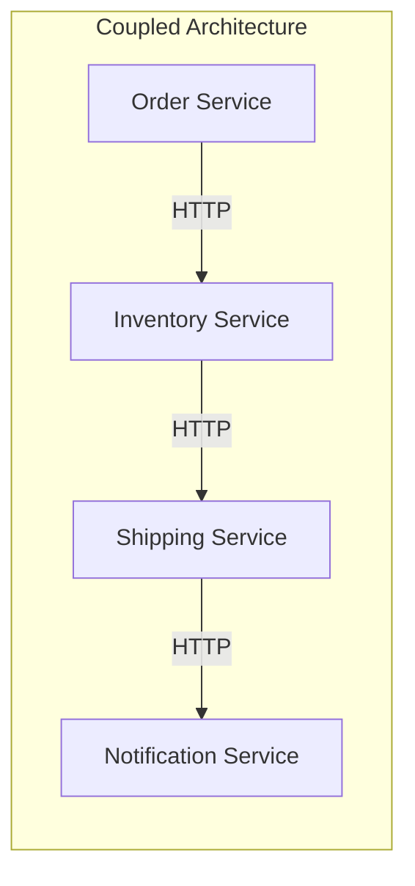
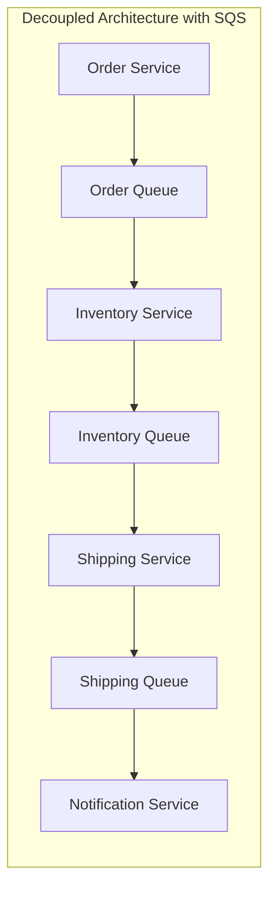
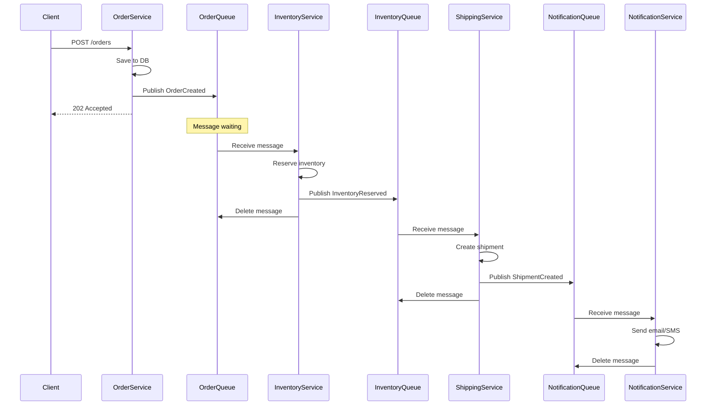
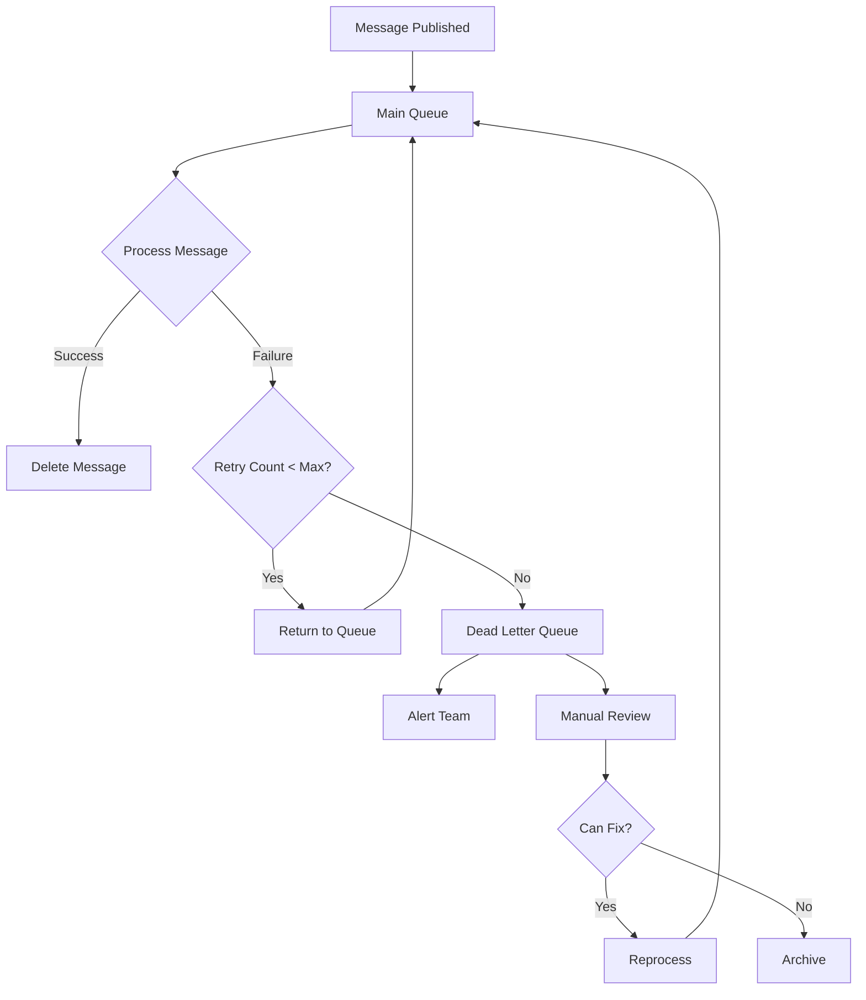

# How to Use SQS for Decoupled Microservices

Author: [nawazdhandala](https://www.github.com/nawazdhandala)

Tags: AWS, SQS, Microservices, Message Queue, Decoupling

Description: Learn how to use Amazon SQS to build decoupled microservices with asynchronous communication, dead letter queues, and error handling patterns.

---

Building microservices that communicate directly with each other creates tight coupling and single points of failure. When one service goes down, the entire chain breaks. Amazon Simple Queue Service (SQS) solves this by acting as a buffer between services, allowing them to communicate asynchronously without knowing about each other.

## Why Decouple Microservices with SQS?

Direct service-to-service communication has several problems:

- **Cascading failures** - If the downstream service is unavailable, the upstream service fails
- **Scaling challenges** - Services must scale together even if their load patterns differ
- **Tight coupling** - Changes in one service often require changes in others

Message queues eliminate these issues by providing a reliable intermediary.





## Setting Up SQS Queues

### Create a Standard Queue

Standard queues offer maximum throughput and at-least-once delivery.

```bash
# Create a standard queue with sensible defaults
aws sqs create-queue \
  --queue-name order-processing-queue \
  --attributes '{
    "VisibilityTimeout": "60",
    "MessageRetentionPeriod": "345600",
    "ReceiveMessageWaitTimeSeconds": "20"
  }'
```

### Create a FIFO Queue

Use FIFO queues when message order matters and you need exactly-once processing.

```bash
# FIFO queue names must end with .fifo
aws sqs create-queue \
  --queue-name order-processing-queue.fifo \
  --attributes '{
    "FifoQueue": "true",
    "ContentBasedDeduplication": "true",
    "VisibilityTimeout": "60",
    "MessageRetentionPeriod": "345600"
  }'
```

### Infrastructure as Code with CloudFormation

```yaml
AWSTemplateFormatVersion: '2010-09-09'
Description: SQS Queues for Decoupled Microservices

Parameters:
  Environment:
    Type: String
    Default: production
    AllowedValues:
      - development
      - staging
      - production

Resources:
  # Main processing queue
  OrderQueue:
    Type: AWS::SQS::Queue
    Properties:
      QueueName: !Sub "${Environment}-order-queue"
      VisibilityTimeout: 60
      MessageRetentionPeriod: 345600
      ReceiveMessageWaitTimeSeconds: 20
      RedrivePolicy:
        deadLetterTargetArn: !GetAtt OrderDLQ.Arn
        maxReceiveCount: 3

  # Dead letter queue for failed messages
  OrderDLQ:
    Type: AWS::SQS::Queue
    Properties:
      QueueName: !Sub "${Environment}-order-dlq"
      MessageRetentionPeriod: 1209600

  # Inventory update queue
  InventoryQueue:
    Type: AWS::SQS::Queue
    Properties:
      QueueName: !Sub "${Environment}-inventory-queue"
      VisibilityTimeout: 30
      MessageRetentionPeriod: 345600
      RedrivePolicy:
        deadLetterTargetArn: !GetAtt InventoryDLQ.Arn
        maxReceiveCount: 3

  InventoryDLQ:
    Type: AWS::SQS::Queue
    Properties:
      QueueName: !Sub "${Environment}-inventory-dlq"
      MessageRetentionPeriod: 1209600

  # Notification queue
  NotificationQueue:
    Type: AWS::SQS::Queue
    Properties:
      QueueName: !Sub "${Environment}-notification-queue"
      VisibilityTimeout: 30
      MessageRetentionPeriod: 86400
      RedrivePolicy:
        deadLetterTargetArn: !GetAtt NotificationDLQ.Arn
        maxReceiveCount: 5

  NotificationDLQ:
    Type: AWS::SQS::Queue
    Properties:
      QueueName: !Sub "${Environment}-notification-dlq"
      MessageRetentionPeriod: 604800

Outputs:
  OrderQueueUrl:
    Value: !Ref OrderQueue
    Export:
      Name: !Sub "${Environment}-OrderQueueUrl"
  InventoryQueueUrl:
    Value: !Ref InventoryQueue
    Export:
      Name: !Sub "${Environment}-InventoryQueueUrl"
  NotificationQueueUrl:
    Value: !Ref NotificationQueue
    Export:
      Name: !Sub "${Environment}-NotificationQueueUrl"
```

## Implementing the Producer Service

The producer publishes messages to the queue without waiting for downstream processing.

### Node.js Producer

```javascript
const { SQSClient, SendMessageCommand, SendMessageBatchCommand } = require('@aws-sdk/client-sqs');

// Initialize the SQS client
const sqs = new SQSClient({ region: process.env.AWS_REGION || 'us-east-1' });
const ORDER_QUEUE_URL = process.env.ORDER_QUEUE_URL;

/**
 * Publish a single order to the queue
 * @param {Object} order - The order data to publish
 * @returns {Promise<string>} - The message ID
 */
async function publishOrder(order) {
  // Create the message with metadata
  const message = {
    orderId: order.id,
    customerId: order.customerId,
    items: order.items,
    totalAmount: order.totalAmount,
    createdAt: new Date().toISOString(),
    version: '1.0'
  };

  const command = new SendMessageCommand({
    QueueUrl: ORDER_QUEUE_URL,
    MessageBody: JSON.stringify(message),
    // Message attributes for filtering and routing
    MessageAttributes: {
      'EventType': {
        DataType: 'String',
        StringValue: 'ORDER_CREATED'
      },
      'Priority': {
        DataType: 'String',
        StringValue: order.totalAmount > 1000 ? 'high' : 'normal'
      },
      'Region': {
        DataType: 'String',
        StringValue: order.shippingRegion
      }
    },
    // Delay delivery if needed (0-900 seconds)
    DelaySeconds: 0
  });

  const response = await sqs.send(command);
  console.log(`Order ${order.id} published with message ID: ${response.MessageId}`);
  return response.MessageId;
}

/**
 * Publish multiple orders in a batch for better throughput
 * SQS allows up to 10 messages per batch
 * @param {Array<Object>} orders - Array of orders to publish
 * @returns {Promise<Object>} - Batch results with successful and failed messages
 */
async function publishOrderBatch(orders) {
  // SQS batch limit is 10 messages
  const batches = [];
  for (let i = 0; i < orders.length; i += 10) {
    batches.push(orders.slice(i, i + 10));
  }

  const results = { successful: [], failed: [] };

  for (const batch of batches) {
    const entries = batch.map((order, index) => ({
      Id: `msg-${index}`,
      MessageBody: JSON.stringify({
        orderId: order.id,
        customerId: order.customerId,
        items: order.items,
        totalAmount: order.totalAmount,
        createdAt: new Date().toISOString()
      }),
      MessageAttributes: {
        'EventType': {
          DataType: 'String',
          StringValue: 'ORDER_CREATED'
        }
      }
    }));

    const command = new SendMessageBatchCommand({
      QueueUrl: ORDER_QUEUE_URL,
      Entries: entries
    });

    const response = await sqs.send(command);

    // Track successful and failed messages
    if (response.Successful) {
      results.successful.push(...response.Successful);
    }
    if (response.Failed) {
      results.failed.push(...response.Failed);
    }
  }

  console.log(`Batch complete: ${results.successful.length} succeeded, ${results.failed.length} failed`);
  return results;
}

// Express route handler example
async function createOrderHandler(req, res) {
  try {
    const order = req.body;

    // Save order to database first
    const savedOrder = await saveOrderToDatabase(order);

    // Publish to queue for async processing
    // This returns immediately without waiting for downstream services
    await publishOrder(savedOrder);

    // Respond to client quickly
    res.status(202).json({
      message: 'Order received and queued for processing',
      orderId: savedOrder.id
    });
  } catch (error) {
    console.error('Failed to create order:', error);
    res.status(500).json({ error: 'Failed to process order' });
  }
}

module.exports = { publishOrder, publishOrderBatch, createOrderHandler };
```

### Python Producer

```python
import boto3
import json
import os
from datetime import datetime
from typing import List, Dict, Any

# Initialize SQS client
sqs = boto3.client('sqs', region_name=os.environ.get('AWS_REGION', 'us-east-1'))
ORDER_QUEUE_URL = os.environ.get('ORDER_QUEUE_URL')


def publish_order(order: Dict[str, Any]) -> str:
    """
    Publish a single order to the SQS queue.

    Args:
        order: Dictionary containing order data

    Returns:
        The message ID from SQS
    """
    # Build the message payload
    message = {
        'order_id': order['id'],
        'customer_id': order['customer_id'],
        'items': order['items'],
        'total_amount': order['total_amount'],
        'created_at': datetime.utcnow().isoformat(),
        'version': '1.0'
    }

    # Determine priority based on order value
    priority = 'high' if order['total_amount'] > 1000 else 'normal'

    response = sqs.send_message(
        QueueUrl=ORDER_QUEUE_URL,
        MessageBody=json.dumps(message),
        MessageAttributes={
            'EventType': {
                'DataType': 'String',
                'StringValue': 'ORDER_CREATED'
            },
            'Priority': {
                'DataType': 'String',
                'StringValue': priority
            },
            'Region': {
                'DataType': 'String',
                'StringValue': order.get('shipping_region', 'US')
            }
        }
    )

    print(f"Order {order['id']} published with message ID: {response['MessageId']}")
    return response['MessageId']


def publish_order_batch(orders: List[Dict[str, Any]]) -> Dict[str, List]:
    """
    Publish multiple orders in batches for better throughput.
    SQS allows up to 10 messages per batch request.

    Args:
        orders: List of order dictionaries

    Returns:
        Dictionary with 'successful' and 'failed' lists
    """
    results = {'successful': [], 'failed': []}

    # Process in batches of 10
    for i in range(0, len(orders), 10):
        batch = orders[i:i + 10]

        entries = []
        for idx, order in enumerate(batch):
            entries.append({
                'Id': f'msg-{idx}',
                'MessageBody': json.dumps({
                    'order_id': order['id'],
                    'customer_id': order['customer_id'],
                    'items': order['items'],
                    'total_amount': order['total_amount'],
                    'created_at': datetime.utcnow().isoformat()
                }),
                'MessageAttributes': {
                    'EventType': {
                        'DataType': 'String',
                        'StringValue': 'ORDER_CREATED'
                    }
                }
            })

        response = sqs.send_message_batch(
            QueueUrl=ORDER_QUEUE_URL,
            Entries=entries
        )

        # Collect results
        results['successful'].extend(response.get('Successful', []))
        results['failed'].extend(response.get('Failed', []))

    print(f"Batch complete: {len(results['successful'])} succeeded, {len(results['failed'])} failed")
    return results
```

## Implementing the Consumer Service

Consumers poll the queue and process messages independently of the producer.

### Node.js Consumer with Graceful Shutdown

```javascript
const { SQSClient, ReceiveMessageCommand, DeleteMessageCommand, ChangeMessageVisibilityCommand } = require('@aws-sdk/client-sqs');

const sqs = new SQSClient({ region: process.env.AWS_REGION || 'us-east-1' });
const QUEUE_URL = process.env.ORDER_QUEUE_URL;

// Track running state for graceful shutdown
let isRunning = true;
let activeMessages = 0;

/**
 * Process a single message from the queue
 * @param {Object} message - The SQS message
 * @returns {Promise<boolean>} - True if processed successfully
 */
async function processMessage(message) {
  const body = JSON.parse(message.Body);
  console.log(`Processing order: ${body.orderId}`);

  try {
    // Simulate business logic
    await updateInventory(body.items);
    await createShipment(body);
    await notifyCustomer(body.customerId, body.orderId);

    return true;
  } catch (error) {
    console.error(`Failed to process order ${body.orderId}:`, error);

    // Check if we should retry or let it go to DLQ
    const receiveCount = parseInt(message.Attributes?.ApproximateReceiveCount || '0');

    if (receiveCount < 3 && isRetryableError(error)) {
      // Extend visibility timeout to delay retry
      await sqs.send(new ChangeMessageVisibilityCommand({
        QueueUrl: QUEUE_URL,
        ReceiptHandle: message.ReceiptHandle,
        VisibilityTimeout: 60 * receiveCount  // Exponential backoff
      }));
      console.log(`Message will retry in ${60 * receiveCount} seconds`);
    }

    return false;
  }
}

/**
 * Determine if an error is transient and worth retrying
 */
function isRetryableError(error) {
  const retryableCodes = ['ETIMEDOUT', 'ECONNRESET', 'ServiceUnavailable', 'ThrottlingException'];
  return retryableCodes.some(code => error.code === code || error.message?.includes(code));
}

/**
 * Main polling loop that continuously fetches and processes messages
 */
async function pollMessages() {
  console.log('Starting message polling...');

  while (isRunning) {
    try {
      // Long polling reduces empty responses and costs
      const command = new ReceiveMessageCommand({
        QueueUrl: QUEUE_URL,
        MaxNumberOfMessages: 10,  // Process up to 10 messages at once
        WaitTimeSeconds: 20,      // Long polling (max 20 seconds)
        AttributeNames: ['All'],
        MessageAttributeNames: ['All'],
        VisibilityTimeout: 60     // 60 seconds to process each message
      });

      const response = await sqs.send(command);

      if (!response.Messages || response.Messages.length === 0) {
        continue;  // No messages, poll again
      }

      console.log(`Received ${response.Messages.length} messages`);

      // Process messages concurrently
      const processingPromises = response.Messages.map(async (message) => {
        activeMessages++;

        try {
          const success = await processMessage(message);

          if (success) {
            // Delete successfully processed message
            await sqs.send(new DeleteMessageCommand({
              QueueUrl: QUEUE_URL,
              ReceiptHandle: message.ReceiptHandle
            }));
            console.log(`Deleted message: ${message.MessageId}`);
          }
        } finally {
          activeMessages--;
        }
      });

      await Promise.all(processingPromises);

    } catch (error) {
      console.error('Polling error:', error);
      // Brief pause before retrying on error
      await new Promise(resolve => setTimeout(resolve, 5000));
    }
  }

  console.log('Polling stopped');
}

/**
 * Graceful shutdown handler
 */
async function shutdown() {
  console.log('Shutdown signal received');
  isRunning = false;

  // Wait for active messages to complete (max 30 seconds)
  const maxWait = 30000;
  const startTime = Date.now();

  while (activeMessages > 0 && Date.now() - startTime < maxWait) {
    console.log(`Waiting for ${activeMessages} messages to complete...`);
    await new Promise(resolve => setTimeout(resolve, 1000));
  }

  if (activeMessages > 0) {
    console.log(`Force shutdown with ${activeMessages} messages still processing`);
  }

  process.exit(0);
}

// Register shutdown handlers
process.on('SIGTERM', shutdown);
process.on('SIGINT', shutdown);

// Start polling
pollMessages();
```

### Lambda Consumer for Serverless Processing

```javascript
const { SQSClient, DeleteMessageCommand } = require('@aws-sdk/client-sqs');

const sqs = new SQSClient({});

/**
 * Lambda handler for SQS events
 * Supports partial batch failure reporting
 */
exports.handler = async (event) => {
  console.log(`Processing ${event.Records.length} messages`);

  // Track failed messages for partial batch failure
  const batchItemFailures = [];

  // Process each message
  for (const record of event.Records) {
    try {
      const body = JSON.parse(record.body);
      console.log(`Processing order: ${body.orderId}`);

      // Process the message
      await processOrder(body);

      console.log(`Successfully processed order: ${body.orderId}`);

    } catch (error) {
      console.error(`Failed to process message ${record.messageId}:`, error);

      // Report this message as failed
      // It will return to the queue and retry (or go to DLQ after max retries)
      batchItemFailures.push({
        itemIdentifier: record.messageId
      });
    }
  }

  // Return partial batch failure response
  // Successfully processed messages are auto-deleted
  // Failed messages are returned to the queue
  return {
    batchItemFailures
  };
};

async function processOrder(order) {
  // Validate order data
  if (!order.orderId || !order.items || order.items.length === 0) {
    throw new Error('Invalid order data');
  }

  // Business logic here
  await updateInventory(order.items);
  await createShipment(order);
  await sendNotification(order);
}
```

## Message Flow Architecture

Here is the complete message flow through decoupled microservices:



## Error Handling Patterns

### Dead Letter Queue Setup



### Implementing Retry with Exponential Backoff

```javascript
const { SQSClient, SendMessageCommand } = require('@aws-sdk/client-sqs');

const sqs = new SQSClient({});

/**
 * Publish message with retry metadata
 */
async function publishWithRetrySupport(queueUrl, message, retryCount = 0) {
  // Calculate delay based on retry count (exponential backoff)
  // 0 retries = 0s, 1 retry = 30s, 2 retries = 60s, etc.
  const delaySeconds = Math.min(retryCount * 30, 900);  // Max 15 minutes

  const command = new SendMessageCommand({
    QueueUrl: queueUrl,
    MessageBody: JSON.stringify(message),
    DelaySeconds: delaySeconds,
    MessageAttributes: {
      'RetryCount': {
        DataType: 'Number',
        StringValue: retryCount.toString()
      },
      'OriginalTimestamp': {
        DataType: 'String',
        StringValue: message.originalTimestamp || new Date().toISOString()
      }
    }
  });

  return sqs.send(command);
}

/**
 * Consumer that handles retries manually for more control
 */
async function processWithManualRetry(message, queueUrl, dlqUrl) {
  const body = JSON.parse(message.Body);
  const retryCount = parseInt(message.MessageAttributes?.RetryCount?.StringValue || '0');
  const maxRetries = 5;

  try {
    await processOrder(body);
    return { success: true };

  } catch (error) {
    console.error(`Processing failed (attempt ${retryCount + 1}):`, error);

    if (retryCount < maxRetries && isRetryableError(error)) {
      // Republish with incremented retry count
      await publishWithRetrySupport(queueUrl, {
        ...body,
        originalTimestamp: body.originalTimestamp || message.MessageAttributes?.OriginalTimestamp?.StringValue
      }, retryCount + 1);

      console.log(`Message requeued for retry ${retryCount + 1}`);
      return { success: false, retried: true };

    } else {
      // Send to DLQ with error details
      await sqs.send(new SendMessageCommand({
        QueueUrl: dlqUrl,
        MessageBody: JSON.stringify({
          originalMessage: body,
          error: {
            message: error.message,
            code: error.code,
            stack: error.stack
          },
          retryCount,
          failedAt: new Date().toISOString()
        })
      }));

      console.log('Message sent to DLQ');
      return { success: false, sentToDLQ: true };
    }
  }
}
```

## Monitoring and Observability

### CloudWatch Metrics and Alarms

```yaml
Resources:
  # Alert when queue depth is high
  QueueDepthAlarm:
    Type: AWS::CloudWatch::Alarm
    Properties:
      AlarmName: OrderQueue-HighDepth
      AlarmDescription: Order queue has more than 1000 messages
      MetricName: ApproximateNumberOfMessagesVisible
      Namespace: AWS/SQS
      Dimensions:
        - Name: QueueName
          Value: !GetAtt OrderQueue.QueueName
      Statistic: Average
      Period: 300
      EvaluationPeriods: 2
      Threshold: 1000
      ComparisonOperator: GreaterThanThreshold
      AlarmActions:
        - !Ref AlertTopic

  # Alert when messages are old (processing is slow)
  OldestMessageAlarm:
    Type: AWS::CloudWatch::Alarm
    Properties:
      AlarmName: OrderQueue-OldMessages
      AlarmDescription: Messages older than 5 minutes in queue
      MetricName: ApproximateAgeOfOldestMessage
      Namespace: AWS/SQS
      Dimensions:
        - Name: QueueName
          Value: !GetAtt OrderQueue.QueueName
      Statistic: Maximum
      Period: 60
      EvaluationPeriods: 5
      Threshold: 300
      ComparisonOperator: GreaterThanThreshold
      AlarmActions:
        - !Ref AlertTopic

  # Alert when DLQ has messages
  DLQAlarm:
    Type: AWS::CloudWatch::Alarm
    Properties:
      AlarmName: OrderDLQ-HasMessages
      AlarmDescription: Messages in dead letter queue require attention
      MetricName: ApproximateNumberOfMessagesVisible
      Namespace: AWS/SQS
      Dimensions:
        - Name: QueueName
          Value: !GetAtt OrderDLQ.QueueName
      Statistic: Sum
      Period: 60
      EvaluationPeriods: 1
      Threshold: 1
      ComparisonOperator: GreaterThanOrEqualToThreshold
      AlarmActions:
        - !Ref AlertTopic

  AlertTopic:
    Type: AWS::SNS::Topic
    Properties:
      TopicName: sqs-alerts
```

### Custom Metrics with CloudWatch

```javascript
const { CloudWatchClient, PutMetricDataCommand } = require('@aws-sdk/client-cloudwatch');

const cloudwatch = new CloudWatchClient({});

/**
 * Publish custom metrics for message processing
 */
async function publishMetrics(metrics) {
  const metricData = [
    {
      MetricName: 'MessagesProcessed',
      Value: metrics.processed,
      Unit: 'Count',
      Dimensions: [
        { Name: 'Service', Value: 'OrderProcessor' },
        { Name: 'Environment', Value: process.env.ENVIRONMENT }
      ]
    },
    {
      MetricName: 'MessagesFailed',
      Value: metrics.failed,
      Unit: 'Count',
      Dimensions: [
        { Name: 'Service', Value: 'OrderProcessor' },
        { Name: 'Environment', Value: process.env.ENVIRONMENT }
      ]
    },
    {
      MetricName: 'ProcessingLatency',
      Value: metrics.latencyMs,
      Unit: 'Milliseconds',
      Dimensions: [
        { Name: 'Service', Value: 'OrderProcessor' },
        { Name: 'Environment', Value: process.env.ENVIRONMENT }
      ]
    }
  ];

  await cloudwatch.send(new PutMetricDataCommand({
    Namespace: 'CustomApp/SQS',
    MetricData: metricData
  }));
}

// Use in your consumer
async function processMessageWithMetrics(message) {
  const startTime = Date.now();
  let success = false;

  try {
    await processMessage(message);
    success = true;
  } finally {
    const latency = Date.now() - startTime;

    await publishMetrics({
      processed: success ? 1 : 0,
      failed: success ? 0 : 1,
      latencyMs: latency
    });
  }
}
```

## Best Practices

### 1. Set Appropriate Visibility Timeout

The visibility timeout should be longer than your maximum expected processing time.

```javascript
// Calculate visibility timeout based on processing requirements
const VISIBILITY_TIMEOUT = 60;  // seconds

// If processing takes longer, extend the timeout
async function processLongRunningMessage(message) {
  const heartbeat = setInterval(async () => {
    await sqs.send(new ChangeMessageVisibilityCommand({
      QueueUrl: QUEUE_URL,
      ReceiptHandle: message.ReceiptHandle,
      VisibilityTimeout: VISIBILITY_TIMEOUT
    }));
  }, (VISIBILITY_TIMEOUT / 2) * 1000);  // Extend at half the timeout

  try {
    await longRunningProcess(message);
  } finally {
    clearInterval(heartbeat);
  }
}
```

### 2. Use Long Polling

Long polling reduces costs and empty responses.

```javascript
// Always use WaitTimeSeconds for long polling
const response = await sqs.send(new ReceiveMessageCommand({
  QueueUrl: QUEUE_URL,
  WaitTimeSeconds: 20,  // Wait up to 20 seconds for messages
  MaxNumberOfMessages: 10
}));
```

### 3. Design Idempotent Consumers

Messages may be delivered more than once. Design your consumers to handle duplicates.

```javascript
async function processOrderIdempotent(message) {
  const body = JSON.parse(message.Body);
  const orderId = body.orderId;

  // Check if already processed using a deduplication store
  const alreadyProcessed = await checkProcessedOrder(orderId);

  if (alreadyProcessed) {
    console.log(`Order ${orderId} already processed, skipping`);
    return true;  // Return success to delete message
  }

  // Process the order
  await processOrder(body);

  // Mark as processed
  await markOrderProcessed(orderId);

  return true;
}

// Simple Redis-based deduplication
const Redis = require('ioredis');
const redis = new Redis(process.env.REDIS_URL);

async function checkProcessedOrder(orderId) {
  const key = `processed:order:${orderId}`;
  return await redis.exists(key);
}

async function markOrderProcessed(orderId) {
  const key = `processed:order:${orderId}`;
  // Keep record for 24 hours
  await redis.setex(key, 86400, '1');
}
```

### 4. Include Correlation IDs for Tracing

```javascript
const { v4: uuidv4 } = require('uuid');

async function publishWithCorrelation(order) {
  const correlationId = order.correlationId || uuidv4();

  await sqs.send(new SendMessageCommand({
    QueueUrl: ORDER_QUEUE_URL,
    MessageBody: JSON.stringify({
      ...order,
      correlationId
    }),
    MessageAttributes: {
      'CorrelationId': {
        DataType: 'String',
        StringValue: correlationId
      }
    }
  }));

  return correlationId;
}

// In the consumer, propagate the correlation ID
async function processAndForward(message) {
  const body = JSON.parse(message.Body);
  const correlationId = message.MessageAttributes?.CorrelationId?.StringValue;

  console.log(`[${correlationId}] Processing order ${body.orderId}`);

  // Include correlation ID in downstream messages
  await sqs.send(new SendMessageCommand({
    QueueUrl: INVENTORY_QUEUE_URL,
    MessageBody: JSON.stringify({
      orderId: body.orderId,
      items: body.items,
      correlationId
    }),
    MessageAttributes: {
      'CorrelationId': {
        DataType: 'String',
        StringValue: correlationId
      }
    }
  }));
}
```

---

Using SQS to decouple microservices creates a more resilient and scalable architecture. Services can fail and recover independently, handle varying loads without affecting each other, and evolve without tight coupling. Start with the patterns shown here and adapt them to your specific requirements. The key is to embrace asynchronous communication and design your consumers to be idempotent and fault-tolerant.
