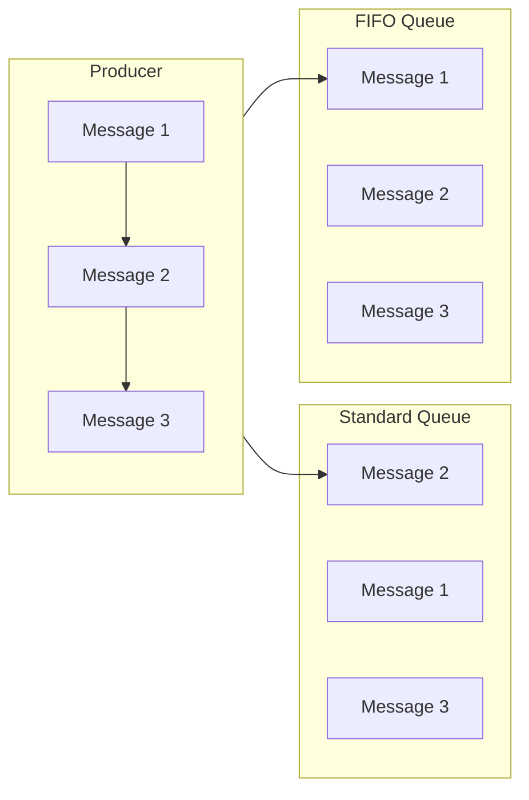
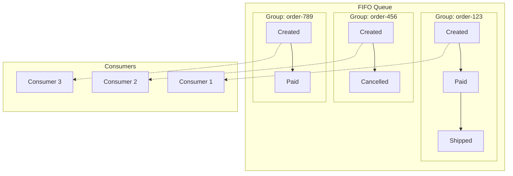
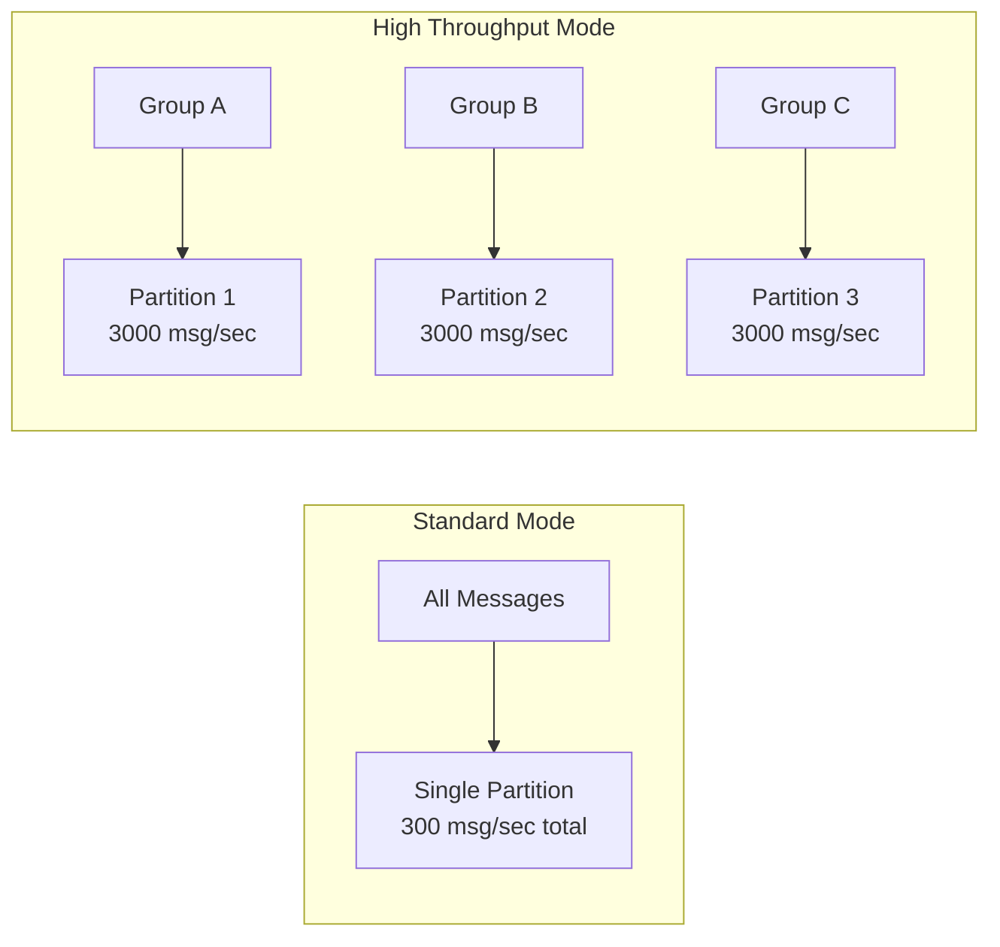

# How to Configure SQS FIFO Queues

Author: [nawazdhandala](https://www.github.com/nawazdhandala)

Tags: AWS, SQS, FIFO Queue, Message Ordering, Exactly-Once Processing, Distributed Systems, Message Deduplication

Description: A practical guide to configuring Amazon SQS FIFO queues for guaranteed message ordering and exactly-once delivery in your distributed applications.

---

Standard SQS queues offer best-effort ordering, which works for most use cases. But when your application requires strict message ordering and exactly-once processing, FIFO (First-In-First-Out) queues are the right choice. This guide walks through the configuration options, best practices, and common patterns for SQS FIFO queues.

## When to Use FIFO Queues

FIFO queues solve two specific problems that standard queues cannot:

1. **Message Ordering** - Messages are processed in the exact order they were sent
2. **Exactly-Once Processing** - Duplicate messages are automatically removed within a 5-minute deduplication window



Common use cases include:

- Financial transaction processing where order matters
- Order management systems with state transitions
- Event sourcing where events must replay in sequence
- Inventory updates that must be applied in order

## Step 1: Create a FIFO Queue

FIFO queue names must end with the `.fifo` suffix. This is not optional.

### Using AWS CLI

```bash
# Create a basic FIFO queue
aws sqs create-queue \
  --queue-name my-orders.fifo \
  --attributes '{
    "FifoQueue": "true",
    "ContentBasedDeduplication": "true",
    "VisibilityTimeout": "30",
    "MessageRetentionPeriod": "345600"
  }'
```

### Using CloudFormation

```yaml
AWSTemplateFormatVersion: '2010-09-09'
Description: SQS FIFO Queue with Dead Letter Queue

Resources:
  # Create the DLQ first - it must also be a FIFO queue
  OrdersDLQ:
    Type: AWS::SQS::Queue
    Properties:
      QueueName: my-orders-dlq.fifo
      FifoQueue: true
      ContentBasedDeduplication: true
      MessageRetentionPeriod: 1209600  # 14 days for investigation
      VisibilityTimeout: 300

  # Main FIFO queue with DLQ redrive policy
  OrdersQueue:
    Type: AWS::SQS::Queue
    Properties:
      QueueName: my-orders.fifo
      FifoQueue: true
      ContentBasedDeduplication: true
      VisibilityTimeout: 30
      MessageRetentionPeriod: 345600  # 4 days
      DeduplicationScope: messageGroup  # Per-group deduplication
      FifoThroughputLimit: perMessageGroupId  # High throughput mode
      RedrivePolicy:
        deadLetterTargetArn: !GetAtt OrdersDLQ.Arn
        maxReceiveCount: 3

Outputs:
  QueueUrl:
    Value: !Ref OrdersQueue
    Description: URL of the FIFO queue
  QueueArn:
    Value: !GetAtt OrdersQueue.Arn
    Description: ARN of the FIFO queue
```

### Using Terraform

```hcl
# Dead Letter Queue for failed messages
resource "aws_sqs_queue" "orders_dlq" {
  name                        = "my-orders-dlq.fifo"
  fifo_queue                  = true
  content_based_deduplication = true
  message_retention_seconds   = 1209600  # 14 days

  tags = {
    Environment = "production"
    Purpose     = "DLQ"
  }
}

# Main FIFO Queue
resource "aws_sqs_queue" "orders" {
  name                        = "my-orders.fifo"
  fifo_queue                  = true
  content_based_deduplication = true
  visibility_timeout_seconds  = 30
  message_retention_seconds   = 345600  # 4 days

  # Enable high throughput mode
  deduplication_scope   = "messageGroup"
  fifo_throughput_limit = "perMessageGroupId"

  # Configure dead letter queue
  redrive_policy = jsonencode({
    deadLetterTargetArn = aws_sqs_queue.orders_dlq.arn
    maxReceiveCount     = 3
  })

  tags = {
    Environment = "production"
    Purpose     = "OrderProcessing"
  }
}

# IAM policy for queue access
resource "aws_sqs_queue_policy" "orders_policy" {
  queue_url = aws_sqs_queue.orders.id

  policy = jsonencode({
    Version = "2012-10-17"
    Statement = [
      {
        Effect    = "Allow"
        Principal = { AWS = var.producer_role_arn }
        Action    = ["sqs:SendMessage"]
        Resource  = aws_sqs_queue.orders.arn
      },
      {
        Effect    = "Allow"
        Principal = { AWS = var.consumer_role_arn }
        Action    = [
          "sqs:ReceiveMessage",
          "sqs:DeleteMessage",
          "sqs:GetQueueAttributes"
        ]
        Resource  = aws_sqs_queue.orders.arn
      }
    ]
  })
}
```

## Step 2: Understand Message Group IDs

Message Group ID is the key concept in FIFO queues. Messages with the same Group ID are processed in order, one at a time. Messages with different Group IDs can be processed in parallel.



### Choosing a Message Group ID Strategy

Your choice of Message Group ID directly affects throughput and ordering guarantees:

| Strategy | Ordering Guarantee | Throughput | Use Case |
|----------|-------------------|------------|----------|
| Single Group ID | All messages ordered globally | Low (300 TPS) | Audit logs, single-tenant systems |
| Entity-based | Per-entity ordering | High (scales with entities) | Order processing, user events |
| Random | No ordering | Maximum | When you only need deduplication |

```python
import boto3
import json
import hashlib
from datetime import datetime

sqs = boto3.client('sqs')
QUEUE_URL = 'https://sqs.us-east-1.amazonaws.com/123456789012/my-orders.fifo'

def send_order_event(order_id: str, event_type: str, payload: dict):
    """
    Send an order event with proper message group ID.

    Using order_id as the group ID ensures all events for the same order
    are processed in sequence, while different orders process in parallel.
    """
    message_body = {
        'order_id': order_id,
        'event_type': event_type,
        'payload': payload,
        'timestamp': datetime.utcnow().isoformat()
    }

    response = sqs.send_message(
        QueueUrl=QUEUE_URL,
        MessageBody=json.dumps(message_body),
        # Group by order_id - all events for this order stay in sequence
        MessageGroupId=order_id,
        # Let SQS generate deduplication ID from content
        # since we enabled ContentBasedDeduplication
    )

    return response['MessageId']


def send_user_activity(user_id: str, activity: dict):
    """
    Send user activity with user-based grouping.

    All activities for a user are ordered, but different users
    can be processed concurrently.
    """
    message_body = {
        'user_id': user_id,
        'activity': activity,
        'timestamp': datetime.utcnow().isoformat()
    }

    response = sqs.send_message(
        QueueUrl=QUEUE_URL,
        MessageBody=json.dumps(message_body),
        MessageGroupId=f"user-{user_id}"
    )

    return response['MessageId']


# Example usage
send_order_event('order-123', 'created', {'items': ['item-1', 'item-2']})
send_order_event('order-123', 'payment_received', {'amount': 99.99})
send_order_event('order-123', 'shipped', {'tracking': 'TRACK123'})

# These three messages will always be processed in this exact order
# because they share the same MessageGroupId
```

## Step 3: Configure Message Deduplication

FIFO queues prevent duplicate messages within a 5-minute window. You have two options:

### Option 1: Content-Based Deduplication

When `ContentBasedDeduplication` is enabled, SQS generates a deduplication ID by hashing the message body with SHA-256.

```python
# With ContentBasedDeduplication enabled, these two sends
# result in only ONE message in the queue

message = {'order_id': '123', 'status': 'created'}

# First send - message is queued
sqs.send_message(
    QueueUrl=QUEUE_URL,
    MessageBody=json.dumps(message),
    MessageGroupId='order-123'
)

# Second send within 5 minutes - message is deduplicated
sqs.send_message(
    QueueUrl=QUEUE_URL,
    MessageBody=json.dumps(message),  # Same body = same dedup ID
    MessageGroupId='order-123'
)
```

### Option 2: Explicit Deduplication ID

For more control, provide your own deduplication ID. This is required when `ContentBasedDeduplication` is disabled.

```python
import uuid

def send_with_explicit_dedup(order_id: str, event_type: str, payload: dict):
    """
    Send with explicit deduplication ID.

    This is useful when:
    - The same logical event might have different serializations
    - You want to allow resending the exact same content as a new message
    - You need precise control over deduplication logic
    """
    # Generate a unique ID for this specific event
    # Using a combination of business identifiers ensures idempotency
    dedup_id = f"{order_id}-{event_type}-{payload.get('version', 1)}"

    message_body = {
        'order_id': order_id,
        'event_type': event_type,
        'payload': payload
    }

    response = sqs.send_message(
        QueueUrl=QUEUE_URL,
        MessageBody=json.dumps(message_body),
        MessageGroupId=order_id,
        MessageDeduplicationId=dedup_id  # Explicit dedup ID
    )

    return response['MessageId']


def send_idempotent_command(command_id: str, command: dict):
    """
    Send a command that should execute exactly once.

    The command_id serves as both the deduplication ID and
    allows the producer to safely retry without duplicate execution.
    """
    response = sqs.send_message(
        QueueUrl=QUEUE_URL,
        MessageBody=json.dumps(command),
        MessageGroupId=command.get('entity_id', 'default'),
        MessageDeduplicationId=command_id  # Client-generated unique ID
    )

    return response['MessageId']
```

## Step 4: Configure High Throughput Mode

Standard FIFO queues support 300 messages per second. High throughput mode increases this to 3,000 messages per second per message group, with up to 30,000 total messages per second.



Enable high throughput mode with these settings:

```bash
aws sqs set-queue-attributes \
  --queue-url https://sqs.us-east-1.amazonaws.com/123456789012/my-orders.fifo \
  --attributes '{
    "DeduplicationScope": "messageGroup",
    "FifoThroughputLimit": "perMessageGroupId"
  }'
```

Requirements for high throughput mode:

- `DeduplicationScope` must be `messageGroup`
- `FifoThroughputLimit` must be `perMessageGroupId`
- Each unique Message Group ID gets its own throughput allocation

```python
# High throughput producer example
import concurrent.futures

def send_batch_high_throughput(events: list):
    """
    Send events in parallel, grouped by entity.

    Each entity's events are ordered, but different entities
    can send simultaneously.
    """
    # Group events by their natural entity
    grouped = {}
    for event in events:
        group_id = event['entity_id']
        if group_id not in grouped:
            grouped[group_id] = []
        grouped[group_id].append(event)

    # Send each group in parallel
    with concurrent.futures.ThreadPoolExecutor(max_workers=10) as executor:
        futures = []
        for group_id, group_events in grouped.items():
            # Events within a group must be sent sequentially
            future = executor.submit(send_group_events, group_id, group_events)
            futures.append(future)

        # Wait for all groups to complete
        results = [f.result() for f in concurrent.futures.as_completed(futures)]

    return results


def send_group_events(group_id: str, events: list):
    """Send events for a single group in order."""
    message_ids = []
    for event in events:
        response = sqs.send_message(
            QueueUrl=QUEUE_URL,
            MessageBody=json.dumps(event),
            MessageGroupId=group_id
        )
        message_ids.append(response['MessageId'])
    return message_ids
```

## Step 5: Implement FIFO Consumers

FIFO consumers must process messages carefully to maintain ordering guarantees.

### Basic Consumer Pattern

```python
import boto3
import json
import time

sqs = boto3.client('sqs')
QUEUE_URL = 'https://sqs.us-east-1.amazonaws.com/123456789012/my-orders.fifo'

def process_fifo_messages():
    """
    Basic FIFO consumer that processes messages in order.

    Key points:
    - Messages from the same group are delivered in order
    - Only one message per group is in-flight at a time
    - Failure handling is critical to avoid blocking the group
    """
    while True:
        response = sqs.receive_message(
            QueueUrl=QUEUE_URL,
            MaxNumberOfMessages=10,  # Can receive from multiple groups
            WaitTimeSeconds=20,       # Long polling
            AttributeNames=['MessageGroupId', 'SequenceNumber'],
            MessageAttributeNames=['All']
        )

        if 'Messages' not in response:
            continue

        for message in response['Messages']:
            group_id = message['Attributes']['MessageGroupId']
            sequence = message['Attributes']['SequenceNumber']

            print(f"Processing message from group {group_id}, seq {sequence}")

            try:
                body = json.loads(message['Body'])
                process_event(body)

                # Delete only after successful processing
                sqs.delete_message(
                    QueueUrl=QUEUE_URL,
                    ReceiptHandle=message['ReceiptHandle']
                )
                print(f"Successfully processed message {message['MessageId']}")

            except Exception as e:
                print(f"Error processing message: {e}")
                # Message will return to queue after visibility timeout
                # and block other messages in the same group


def process_event(event: dict):
    """Process a single event. Implement your business logic here."""
    event_type = event.get('event_type')

    if event_type == 'order_created':
        handle_order_created(event)
    elif event_type == 'payment_received':
        handle_payment_received(event)
    elif event_type == 'order_shipped':
        handle_order_shipped(event)
    else:
        raise ValueError(f"Unknown event type: {event_type}")
```

### Lambda Consumer with Partial Batch Failure

```javascript
// Lambda function configured with FIFO SQS trigger

const { DynamoDBClient, UpdateCommand } = require('@aws-sdk/client-dynamodb');

const dynamodb = new DynamoDBClient({});

exports.handler = async (event) => {
  console.log(`Received ${event.Records.length} messages`);

  const batchItemFailures = [];

  for (const record of event.Records) {
    try {
      const body = JSON.parse(record.body);
      const groupId = record.attributes.MessageGroupId;

      console.log(`Processing ${body.event_type} for group ${groupId}`);

      await processOrderEvent(body);

    } catch (error) {
      console.error(`Error processing message ${record.messageId}:`, error);

      // Report this message as failed
      // SQS will retry it and maintain ordering for its group
      batchItemFailures.push({
        itemIdentifier: record.messageId
      });
    }
  }

  // Return partial batch response
  // Successfully processed messages are deleted
  // Failed messages return to the queue
  return {
    batchItemFailures: batchItemFailures
  };
};


async function processOrderEvent(event) {
  const { order_id, event_type, payload } = event;

  // State machine for order processing
  const stateTransitions = {
    'order_created': ['pending'],
    'payment_received': ['pending'],
    'order_shipped': ['paid'],
    'order_delivered': ['shipped'],
    'order_cancelled': ['pending', 'paid']
  };

  const validPreviousStates = stateTransitions[event_type];
  if (!validPreviousStates) {
    throw new Error(`Unknown event type: ${event_type}`);
  }

  // Update order state in DynamoDB with conditional write
  // This ensures state transitions happen in valid order
  await dynamodb.send(new UpdateCommand({
    TableName: 'Orders',
    Key: { order_id: { S: order_id } },
    UpdateExpression: 'SET #status = :new_status, updated_at = :now',
    ConditionExpression: '#status IN (:valid_states)',
    ExpressionAttributeNames: {
      '#status': 'status'
    },
    ExpressionAttributeValues: {
      ':new_status': { S: getNewStatus(event_type) },
      ':now': { S: new Date().toISOString() },
      ':valid_states': { L: validPreviousStates.map(s => ({ S: s })) }
    }
  }));
}


function getNewStatus(eventType) {
  const statusMap = {
    'order_created': 'pending',
    'payment_received': 'paid',
    'order_shipped': 'shipped',
    'order_delivered': 'delivered',
    'order_cancelled': 'cancelled'
  };
  return statusMap[eventType];
}
```

## Step 6: Monitor FIFO Queue Health

FIFO queues have unique metrics to monitor:

```yaml
# CloudWatch alarms for FIFO queue monitoring
AWSTemplateFormatVersion: '2010-09-09'
Description: FIFO Queue Monitoring

Resources:
  # Alert when messages are stuck (not being processed)
  OldestMessageAgeAlarm:
    Type: AWS::CloudWatch::Alarm
    Properties:
      AlarmName: FIFO-OldestMessageAge-High
      AlarmDescription: Messages are stuck in the queue
      MetricName: ApproximateAgeOfOldestMessage
      Namespace: AWS/SQS
      Dimensions:
        - Name: QueueName
          Value: my-orders.fifo
      Statistic: Maximum
      Period: 300
      EvaluationPeriods: 2
      Threshold: 300  # 5 minutes
      ComparisonOperator: GreaterThanThreshold
      AlarmActions:
        - !Ref AlertTopic

  # Alert when queue depth is growing
  QueueDepthAlarm:
    Type: AWS::CloudWatch::Alarm
    Properties:
      AlarmName: FIFO-QueueDepth-High
      AlarmDescription: Queue backlog is growing
      MetricName: ApproximateNumberOfMessagesVisible
      Namespace: AWS/SQS
      Dimensions:
        - Name: QueueName
          Value: my-orders.fifo
      Statistic: Average
      Period: 300
      EvaluationPeriods: 3
      Threshold: 1000
      ComparisonOperator: GreaterThanThreshold
      AlarmActions:
        - !Ref AlertTopic

  # Alert when messages go to DLQ
  DLQMessagesAlarm:
    Type: AWS::CloudWatch::Alarm
    Properties:
      AlarmName: FIFO-DLQ-Messages
      AlarmDescription: Messages are failing to process
      MetricName: ApproximateNumberOfMessagesVisible
      Namespace: AWS/SQS
      Dimensions:
        - Name: QueueName
          Value: my-orders-dlq.fifo
      Statistic: Sum
      Period: 60
      EvaluationPeriods: 1
      Threshold: 1
      ComparisonOperator: GreaterThanOrEqualToThreshold
      AlarmActions:
        - !Ref AlertTopic

  AlertTopic:
    Type: AWS::SNS::Topic
    Properties:
      TopicName: fifo-queue-alerts
```

### Custom Metrics for Message Groups

```python
import boto3
from collections import defaultdict

sqs = boto3.client('sqs')
cloudwatch = boto3.client('cloudwatch')
QUEUE_URL = 'https://sqs.us-east-1.amazonaws.com/123456789012/my-orders.fifo'

def publish_group_metrics():
    """
    Publish custom metrics about message groups.

    This helps identify if specific groups are blocking
    or experiencing higher failure rates.
    """
    # Sample messages to analyze groups
    messages = []
    for _ in range(10):  # Multiple polls to get a representative sample
        response = sqs.receive_message(
            QueueUrl=QUEUE_URL,
            MaxNumberOfMessages=10,
            VisibilityTimeout=0,  # Don't hide messages
            AttributeNames=['MessageGroupId', 'ApproximateReceiveCount']
        )
        if 'Messages' in response:
            messages.extend(response['Messages'])

    # Analyze by group
    groups = defaultdict(lambda: {'count': 0, 'max_retries': 0})
    for msg in messages:
        group_id = msg['Attributes']['MessageGroupId']
        retry_count = int(msg['Attributes']['ApproximateReceiveCount'])
        groups[group_id]['count'] += 1
        groups[group_id]['max_retries'] = max(
            groups[group_id]['max_retries'],
            retry_count
        )

    # Publish metrics
    metric_data = []
    for group_id, stats in groups.items():
        metric_data.append({
            'MetricName': 'MessagesPerGroup',
            'Dimensions': [
                {'Name': 'QueueName', 'Value': 'my-orders.fifo'},
                {'Name': 'MessageGroupId', 'Value': group_id}
            ],
            'Value': stats['count'],
            'Unit': 'Count'
        })

        if stats['max_retries'] > 1:
            metric_data.append({
                'MetricName': 'MaxRetriesPerGroup',
                'Dimensions': [
                    {'Name': 'QueueName', 'Value': 'my-orders.fifo'},
                    {'Name': 'MessageGroupId', 'Value': group_id}
                ],
                'Value': stats['max_retries'],
                'Unit': 'Count'
            })

    if metric_data:
        cloudwatch.put_metric_data(
            Namespace='Custom/SQS',
            MetricData=metric_data
        )
```

## Common Pitfalls and Solutions

### Pitfall 1: Using a Single Message Group ID

Using one group ID for all messages limits throughput to 300 TPS and creates a single point of blocking.

```python
# Bad: Single group ID limits parallelism
def send_bad(message):
    sqs.send_message(
        QueueUrl=QUEUE_URL,
        MessageBody=json.dumps(message),
        MessageGroupId='all-messages'  # All messages in one group
    )

# Good: Group by natural entity
def send_good(message):
    sqs.send_message(
        QueueUrl=QUEUE_URL,
        MessageBody=json.dumps(message),
        MessageGroupId=message['entity_id']  # Parallel processing per entity
    )
```

### Pitfall 2: Not Handling Poison Messages

A message that always fails will block its entire message group.

```python
def process_with_poison_detection(message, max_receive_count=5):
    """
    Handle potential poison messages that block a group.
    """
    receive_count = int(message['Attributes'].get('ApproximateReceiveCount', 1))

    if receive_count >= max_receive_count:
        # This message has failed too many times
        # Move it aside to unblock the group
        move_to_poison_bucket(message)
        sqs.delete_message(
            QueueUrl=QUEUE_URL,
            ReceiptHandle=message['ReceiptHandle']
        )
        return

    # Normal processing
    try:
        process_event(json.loads(message['Body']))
        sqs.delete_message(
            QueueUrl=QUEUE_URL,
            ReceiptHandle=message['ReceiptHandle']
        )
    except Exception as e:
        # Let visibility timeout expire for retry
        print(f"Processing failed, will retry: {e}")
```

### Pitfall 3: Visibility Timeout Too Short

If processing takes longer than visibility timeout, the same message may be delivered twice, breaking exactly-once guarantees.

```python
def process_with_heartbeat(message, processing_time_estimate=60):
    """
    Extend visibility timeout during long-running processing.
    """
    receipt_handle = message['ReceiptHandle']

    # Start a background task to extend visibility
    import threading

    keep_alive = True

    def extend_visibility():
        while keep_alive:
            time.sleep(20)  # Extend every 20 seconds
            if keep_alive:
                try:
                    sqs.change_message_visibility(
                        QueueUrl=QUEUE_URL,
                        ReceiptHandle=receipt_handle,
                        VisibilityTimeout=60
                    )
                except Exception as e:
                    print(f"Failed to extend visibility: {e}")

    heartbeat_thread = threading.Thread(target=extend_visibility)
    heartbeat_thread.start()

    try:
        # Do the actual processing
        process_event(json.loads(message['Body']))

        # Delete message on success
        sqs.delete_message(
            QueueUrl=QUEUE_URL,
            ReceiptHandle=receipt_handle
        )
    finally:
        keep_alive = False
        heartbeat_thread.join()
```

## FIFO Queue Limits and Quotas

Keep these limits in mind when designing your system:

| Limit | Value | Notes |
|-------|-------|-------|
| Standard throughput | 300 msg/sec | Per queue (send/receive/delete combined) |
| High throughput mode | 3,000 msg/sec per group | Up to 30,000 msg/sec total |
| Message size | 256 KB | Use S3 for larger payloads |
| Deduplication window | 5 minutes | After this, same content can be sent again |
| Message Group IDs | Unlimited | Use as many groups as needed |
| Visibility timeout | 0 sec to 12 hours | Choose based on processing time |
| Batch size | 10 messages | Maximum per send/receive batch |

---

FIFO queues provide strong ordering and exactly-once delivery guarantees that standard queues cannot offer. The key to using them effectively is choosing the right Message Group ID strategy. Group by natural entity boundaries (orders, users, accounts) to get both ordering within an entity and parallel processing across entities. Monitor your queue health, handle poison messages gracefully, and configure appropriate visibility timeouts to maintain reliability. With these patterns in place, FIFO queues become a powerful building block for event-driven architectures that require strict consistency.
