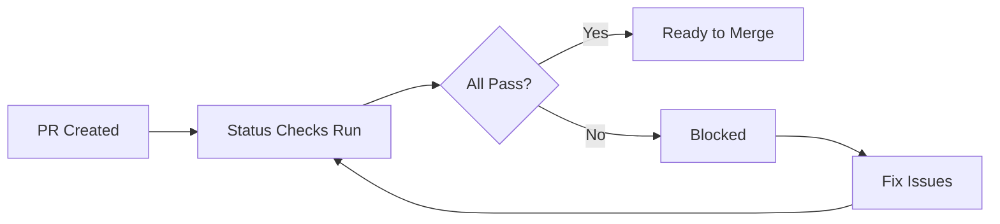

# How to Configure Status Checks in GitHub Actions

Author: [nawazdhandala](https://www.github.com/nawazdhandala)

Tags: GitHub Actions, Status Checks, Branch Protection, Pull Requests, CI/CD, Code Quality

Description: Learn how to configure required status checks in GitHub Actions to enforce code quality, testing requirements, and deployment gates before merging pull requests.

---

Status checks are the gatekeepers of your codebase. They prevent broken code from being merged by requiring workflows to pass before a pull request can be completed. This guide shows you how to configure and customize status checks effectively.

## Understanding Status Checks

Status checks come from GitHub Actions workflows, external CI systems, or GitHub Apps. They appear on pull requests as pending, passing, or failing indicators.



## Basic Status Check Workflow

Every job in a workflow creates a status check:

```yaml
# .github/workflows/ci.yml
name: CI

on:
  pull_request:
    branches: [main]

jobs:
  lint:
    runs-on: ubuntu-latest
    steps:
      - uses: actions/checkout@v4
      - run: npm ci
      - run: npm run lint

  test:
    runs-on: ubuntu-latest
    steps:
      - uses: actions/checkout@v4
      - run: npm ci
      - run: npm test

  build:
    runs-on: ubuntu-latest
    steps:
      - uses: actions/checkout@v4
      - run: npm ci
      - run: npm run build
```

This creates three status checks: `lint`, `test`, and `build`.

## Configuring Required Status Checks

In your repository settings (Settings > Branches > Branch protection rules):

1. Select "Require status checks to pass before merging"
2. Search for and select the checks you want to require
3. Enable "Require branches to be up to date before merging" if desired

```yaml
# These jobs become required if selected in branch protection
jobs:
  required-checks:
    runs-on: ubuntu-latest
    steps:
      - uses: actions/checkout@v4
      - run: npm ci
      - run: npm run lint
      - run: npm test
      - run: npm run build
```

## Named Status Checks

Give your status checks clear, descriptive names:

```yaml
jobs:
  lint:
    name: Code Linting  # This name appears in the PR status
    runs-on: ubuntu-latest
    steps:
      - uses: actions/checkout@v4
      - run: npm run lint

  unit-tests:
    name: Unit Tests (Node 20)
    runs-on: ubuntu-latest
    steps:
      - uses: actions/checkout@v4
      - uses: actions/setup-node@v4
        with:
          node-version: '20'
      - run: npm test

  security:
    name: Security Scan
    runs-on: ubuntu-latest
    steps:
      - uses: actions/checkout@v4
      - run: npm audit --audit-level=high
```

## Matrix Jobs and Status Checks

Matrix jobs create separate status checks for each combination:

```yaml
jobs:
  test:
    name: Test (${{ matrix.node }}, ${{ matrix.os }})
    runs-on: ${{ matrix.os }}
    strategy:
      matrix:
        node: [18, 20]
        os: [ubuntu-latest, windows-latest]
    steps:
      - uses: actions/checkout@v4
      - uses: actions/setup-node@v4
        with:
          node-version: ${{ matrix.node }}
      - run: npm test
```

This creates four checks:
- Test (18, ubuntu-latest)
- Test (18, windows-latest)
- Test (20, ubuntu-latest)
- Test (20, windows-latest)

## Single Required Check for Matrix Jobs

If you want one required check instead of many, add a summary job:

```yaml
jobs:
  test:
    runs-on: ${{ matrix.os }}
    strategy:
      matrix:
        node: [18, 20]
        os: [ubuntu-latest, windows-latest]
    steps:
      - uses: actions/checkout@v4
      - uses: actions/setup-node@v4
        with:
          node-version: ${{ matrix.node }}
      - run: npm test

  # Single check that depends on all matrix jobs
  tests-passed:
    name: All Tests Passed
    needs: test
    runs-on: ubuntu-latest
    if: always()
    steps:
      - name: Check test results
        run: |
          if [ "${{ needs.test.result }}" != "success" ]; then
            echo "Some tests failed"
            exit 1
          fi
          echo "All tests passed"
```

Now require only `All Tests Passed` in branch protection.

## Conditional Status Checks

Handle status checks that only run for certain paths:

```yaml
jobs:
  changes:
    runs-on: ubuntu-latest
    outputs:
      backend: ${{ steps.filter.outputs.backend }}
    steps:
      - uses: dorny/paths-filter@v2
        id: filter
        with:
          filters: |
            backend:
              - 'api/**'

  backend-tests:
    needs: changes
    if: needs.changes.outputs.backend == 'true'
    runs-on: ubuntu-latest
    steps:
      - uses: actions/checkout@v4
      - run: npm test --prefix api

  # Always-running check that passes when tests are skipped
  backend-status:
    name: Backend Tests
    needs: [changes, backend-tests]
    runs-on: ubuntu-latest
    if: always()
    steps:
      - name: Check status
        run: |
          if [ "${{ needs.changes.outputs.backend }}" != "true" ]; then
            echo "Backend tests skipped - no changes"
            exit 0
          fi
          if [ "${{ needs.backend-tests.result }}" != "success" ]; then
            echo "Backend tests failed"
            exit 1
          fi
          echo "Backend tests passed"
```

## Custom Status Check API

Create custom status checks using the GitHub API:

```yaml
jobs:
  deploy:
    runs-on: ubuntu-latest
    steps:
      - name: Set pending status
        uses: actions/github-script@v7
        with:
          script: |
            await github.rest.repos.createCommitStatus({
              owner: context.repo.owner,
              repo: context.repo.repo,
              sha: context.sha,
              state: 'pending',
              context: 'deployment/production',
              description: 'Deployment in progress...'
            });

      - name: Deploy
        id: deploy
        run: ./deploy.sh
        continue-on-error: true

      - name: Update status
        uses: actions/github-script@v7
        if: always()
        with:
          script: |
            const state = '${{ steps.deploy.outcome }}' === 'success' ? 'success' : 'failure';
            const description = state === 'success' ? 'Deployment successful' : 'Deployment failed';
            await github.rest.repos.createCommitStatus({
              owner: context.repo.owner,
              repo: context.repo.repo,
              sha: context.sha,
              state: state,
              context: 'deployment/production',
              description: description,
              target_url: 'https://app.example.com'
            });
```

## Status Checks with External Services

Report status from external services:

```yaml
jobs:
  external-scan:
    runs-on: ubuntu-latest
    steps:
      - uses: actions/checkout@v4

      - name: Start external scan
        id: scan
        run: |
          # Trigger external service
          SCAN_ID=$(curl -X POST https://scanner.example.com/scan \
            -H "Authorization: Bearer ${{ secrets.SCANNER_TOKEN }}" \
            -d '{"repo": "${{ github.repository }}", "sha": "${{ github.sha }}"}' \
            | jq -r '.scan_id')
          echo "scan-id=$SCAN_ID" >> $GITHUB_OUTPUT

      - name: Wait for scan
        run: |
          # Poll until complete
          while true; do
            STATUS=$(curl https://scanner.example.com/scan/${{ steps.scan.outputs.scan-id }} \
              -H "Authorization: Bearer ${{ secrets.SCANNER_TOKEN }}" \
              | jq -r '.status')
            if [ "$STATUS" = "complete" ]; then
              break
            fi
            sleep 10
          done

      - name: Report results
        uses: actions/github-script@v7
        with:
          script: |
            const response = await fetch(
              `https://scanner.example.com/scan/${{ steps.scan.outputs.scan-id }}`,
              { headers: { 'Authorization': `Bearer ${{ secrets.SCANNER_TOKEN }}` } }
            );
            const result = await response.json();

            await github.rest.repos.createCommitStatus({
              owner: context.repo.owner,
              repo: context.repo.repo,
              sha: context.sha,
              state: result.passed ? 'success' : 'failure',
              context: 'security/external-scan',
              description: `Found ${result.issues} issues`,
              target_url: result.report_url
            });
```

## Check Runs vs Commit Statuses

GitHub has two types of status checks:

1. **Commit Statuses** - Simple pass/fail from the Status API
2. **Check Runs** - Rich checks from the Checks API with annotations

```yaml
jobs:
  lint-with-annotations:
    runs-on: ubuntu-latest
    steps:
      - uses: actions/checkout@v4

      - name: Run ESLint
        id: eslint
        run: |
          npm run lint -- --format json --output-file eslint-results.json || true

      - name: Annotate code
        uses: actions/github-script@v7
        with:
          script: |
            const fs = require('fs');
            const results = JSON.parse(fs.readFileSync('eslint-results.json'));

            const annotations = [];
            for (const result of results) {
              for (const message of result.messages) {
                annotations.push({
                  path: result.filePath.replace(process.cwd() + '/', ''),
                  start_line: message.line,
                  end_line: message.endLine || message.line,
                  annotation_level: message.severity === 2 ? 'failure' : 'warning',
                  message: message.message,
                  title: message.ruleId
                });
              }
            }

            // Create check run with annotations
            await github.rest.checks.create({
              owner: context.repo.owner,
              repo: context.repo.repo,
              name: 'ESLint',
              head_sha: context.sha,
              status: 'completed',
              conclusion: annotations.some(a => a.annotation_level === 'failure') ? 'failure' : 'success',
              output: {
                title: 'ESLint Results',
                summary: `Found ${annotations.length} issues`,
                annotations: annotations.slice(0, 50)  // Max 50 per request
              }
            });
```

## Bypassing Status Checks

Admins can bypass required checks, but this should be rare:

```yaml
jobs:
  emergency-deploy:
    runs-on: ubuntu-latest
    environment:
      name: production
      # Requires admin approval
    if: github.event_name == 'workflow_dispatch'
    steps:
      - name: Emergency deployment
        run: |
          echo "Bypassing normal checks for emergency deployment"
          ./deploy.sh --force
```

## Best Practices

1. **Name checks clearly** - Use descriptive names that explain what the check validates.

2. **Group related checks** - Use a summary job to consolidate matrix results.

3. **Handle skipped checks** - Create placeholder jobs that pass when checks are skipped due to path filters.

4. **Keep checks fast** - Long-running checks slow down development. Optimize or run them separately.

5. **Document requirements** - Explain why each required check exists in your contributing guide.

6. **Review regularly** - Remove checks that no longer provide value.

Status checks are your first line of defense against broken code. Configure them thoughtfully to balance protection with developer velocity.
