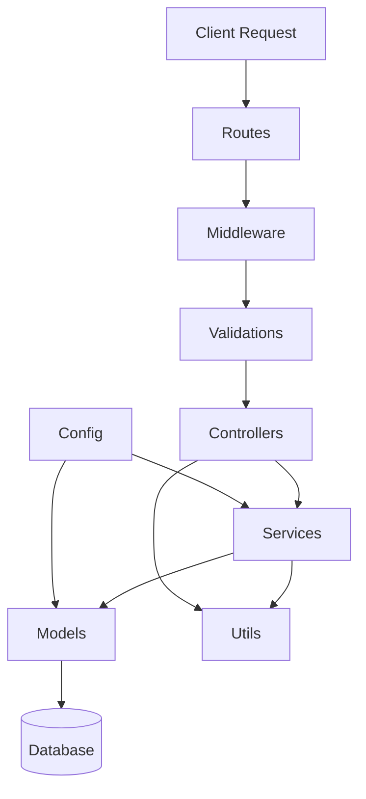

# How to Structure a Production Node.js Application

Author: [nawazdhandala](https://www.github.com/nawazdhandala)

Tags: Node.js, Project Structure, Backend, Architecture, Express, TypeScript, Best Practices

Description: Learn how to structure a production-ready Node.js application with a scalable folder organization, separation of concerns, and practical patterns that make your codebase maintainable as it grows.

---

> A well-structured Node.js application is easier to maintain, test, and scale. This guide shows you a battle-tested folder structure and architectural patterns used in production applications serving millions of requests.

When you start a new Node.js project, it's tempting to throw everything into a single file. That works fine for prototypes, but production applications need structure. Without it, you'll end up with a tangled mess that's impossible to debug or extend.

---

## The Problem with Flat Structures

Most Node.js tutorials show you something like this:

```
my-app/
  index.js
  routes.js
  db.js
```

This falls apart quickly. Where do you put middleware? How do you organize business logic? What about configuration for different environments?

---

## A Production-Ready Folder Structure

Here's a structure that scales from small APIs to large enterprise applications:

```
src/
  config/           # Configuration files and environment handling
  controllers/      # Request handlers
  middleware/       # Express middleware
  models/           # Database models
  routes/           # Route definitions
  services/         # Business logic
  utils/            # Helper functions
  validations/      # Request validation schemas
  jobs/             # Background jobs and workers
  types/            # TypeScript type definitions
  app.ts            # Express app setup
  server.ts         # Server entry point
tests/
  unit/             # Unit tests
  integration/      # Integration tests
  fixtures/         # Test data
```

Let me walk through each directory and explain its purpose.

---

## Project Architecture Overview



---

## Configuration Layer

The config directory manages all environment-specific settings. Never hardcode values that change between environments.

```typescript
// src/config/index.ts
import dotenv from 'dotenv';
import path from 'path';

// Load environment-specific .env file
const envFile = `.env.${process.env.NODE_ENV || 'development'}`;
dotenv.config({ path: path.resolve(process.cwd(), envFile) });

// Configuration object with type safety
export const config = {
  env: process.env.NODE_ENV || 'development',
  port: parseInt(process.env.PORT || '3000', 10),

  database: {
    host: process.env.DB_HOST || 'localhost',
    port: parseInt(process.env.DB_PORT || '5432', 10),
    name: process.env.DB_NAME || 'myapp',
    user: process.env.DB_USER || 'postgres',
    password: process.env.DB_PASSWORD || '',
    // Connection pool settings for production
    pool: {
      min: parseInt(process.env.DB_POOL_MIN || '2', 10),
      max: parseInt(process.env.DB_POOL_MAX || '10', 10),
    },
  },

  redis: {
    host: process.env.REDIS_HOST || 'localhost',
    port: parseInt(process.env.REDIS_PORT || '6379', 10),
  },

  jwt: {
    secret: process.env.JWT_SECRET || 'change-this-in-production',
    expiresIn: process.env.JWT_EXPIRES_IN || '7d',
  },

  logging: {
    level: process.env.LOG_LEVEL || 'info',
  },
};

// Validate required config in production
if (config.env === 'production') {
  const required = ['DB_PASSWORD', 'JWT_SECRET'];
  for (const key of required) {
    if (!process.env[key]) {
      throw new Error(`Missing required environment variable: ${key}`);
    }
  }
}
```

For database-specific configuration, create a separate file:

```typescript
// src/config/database.ts
import { config } from './index';

export const databaseConfig = {
  client: 'pg',
  connection: {
    host: config.database.host,
    port: config.database.port,
    database: config.database.name,
    user: config.database.user,
    password: config.database.password,
  },
  pool: config.database.pool,
  // Migration settings
  migrations: {
    directory: './migrations',
    tableName: 'knex_migrations',
  },
  seeds: {
    directory: './seeds',
  },
};
```

---

## Models Layer

Models represent your database entities. Keep them focused on data structure and basic queries.

```typescript
// src/models/User.ts
import { Model } from 'objection';
import { BaseModel } from './BaseModel';

export interface UserData {
  id: string;
  email: string;
  passwordHash: string;
  name: string;
  role: 'user' | 'admin';
  createdAt: Date;
  updatedAt: Date;
}

export class User extends BaseModel implements UserData {
  id!: string;
  email!: string;
  passwordHash!: string;
  name!: string;
  role!: 'user' | 'admin';
  createdAt!: Date;
  updatedAt!: Date;

  static tableName = 'users';

  // JSON schema for validation
  static jsonSchema = {
    type: 'object',
    required: ['email', 'passwordHash', 'name'],
    properties: {
      id: { type: 'string', format: 'uuid' },
      email: { type: 'string', format: 'email' },
      passwordHash: { type: 'string' },
      name: { type: 'string', minLength: 1, maxLength: 255 },
      role: { type: 'string', enum: ['user', 'admin'] },
    },
  };

  // Define relationships
  static relationMappings = () => ({
    posts: {
      relation: Model.HasManyRelation,
      modelClass: require('./Post').Post,
      join: {
        from: 'users.id',
        to: 'posts.authorId',
      },
    },
  });

  // Hide sensitive fields when converting to JSON
  $formatJson(json: UserData): Partial<UserData> {
    const formatted = super.$formatJson(json);
    delete formatted.passwordHash;
    return formatted;
  }
}
```

Create a base model for shared functionality:

```typescript
// src/models/BaseModel.ts
import { Model } from 'objection';
import { v4 as uuidv4 } from 'uuid';

export class BaseModel extends Model {
  id!: string;
  createdAt!: Date;
  updatedAt!: Date;

  // Auto-generate UUID before insert
  $beforeInsert() {
    this.id = this.id || uuidv4();
    this.createdAt = new Date();
    this.updatedAt = new Date();
  }

  // Update timestamp on changes
  $beforeUpdate() {
    this.updatedAt = new Date();
  }
}
```

---

## Services Layer

Services contain your business logic. They're where the real work happens - separate from HTTP concerns.

```typescript
// src/services/UserService.ts
import bcrypt from 'bcrypt';
import { User } from '../models/User';
import { AppError } from '../utils/errors';
import { logger } from '../utils/logger';

export interface CreateUserInput {
  email: string;
  password: string;
  name: string;
}

export interface UpdateUserInput {
  name?: string;
  email?: string;
}

export class UserService {
  private readonly saltRounds = 12;

  async createUser(input: CreateUserInput): Promise<User> {
    // Check if email already exists
    const existingUser = await User.query().findOne({ email: input.email });
    if (existingUser) {
      throw new AppError('Email already registered', 409);
    }

    // Hash the password
    const passwordHash = await bcrypt.hash(input.password, this.saltRounds);

    // Create the user
    const user = await User.query().insert({
      email: input.email,
      passwordHash,
      name: input.name,
      role: 'user',
    });

    logger.info('User created', { userId: user.id, email: user.email });
    return user;
  }

  async getUserById(id: string): Promise<User> {
    const user = await User.query().findById(id);
    if (!user) {
      throw new AppError('User not found', 404);
    }
    return user;
  }

  async getUserByEmail(email: string): Promise<User | undefined> {
    return User.query().findOne({ email });
  }

  async updateUser(id: string, input: UpdateUserInput): Promise<User> {
    const user = await this.getUserById(id);

    // If changing email, check it's not taken
    if (input.email && input.email !== user.email) {
      const existingUser = await User.query().findOne({ email: input.email });
      if (existingUser) {
        throw new AppError('Email already in use', 409);
      }
    }

    const updated = await user.$query().patchAndFetch(input);
    logger.info('User updated', { userId: id });
    return updated;
  }

  async verifyPassword(user: User, password: string): Promise<boolean> {
    return bcrypt.compare(password, user.passwordHash);
  }

  async listUsers(page: number = 1, limit: number = 20): Promise<{
    users: User[];
    total: number;
    page: number;
    totalPages: number;
  }> {
    const offset = (page - 1) * limit;

    const [users, countResult] = await Promise.all([
      User.query().offset(offset).limit(limit).orderBy('createdAt', 'desc'),
      User.query().count('id as count').first(),
    ]);

    const total = parseInt(countResult?.count as string || '0', 10);

    return {
      users,
      total,
      page,
      totalPages: Math.ceil(total / limit),
    };
  }
}

// Export singleton instance
export const userService = new UserService();
```

---

## Controllers Layer

Controllers handle HTTP requests and responses. They should be thin - just validate input, call services, and format output.

```typescript
// src/controllers/UserController.ts
import { Request, Response, NextFunction } from 'express';
import { userService } from '../services/UserService';
import { asyncHandler } from '../utils/asyncHandler';

export class UserController {
  // Create a new user
  create = asyncHandler(async (req: Request, res: Response) => {
    const user = await userService.createUser(req.body);

    res.status(201).json({
      success: true,
      data: user,
    });
  });

  // Get user by ID
  getById = asyncHandler(async (req: Request, res: Response) => {
    const user = await userService.getUserById(req.params.id);

    res.json({
      success: true,
      data: user,
    });
  });

  // Update user
  update = asyncHandler(async (req: Request, res: Response) => {
    const user = await userService.updateUser(req.params.id, req.body);

    res.json({
      success: true,
      data: user,
    });
  });

  // List users with pagination
  list = asyncHandler(async (req: Request, res: Response) => {
    const page = parseInt(req.query.page as string) || 1;
    const limit = parseInt(req.query.limit as string) || 20;

    const result = await userService.listUsers(page, limit);

    res.json({
      success: true,
      data: result.users,
      pagination: {
        page: result.page,
        totalPages: result.totalPages,
        total: result.total,
      },
    });
  });

  // Get current authenticated user
  me = asyncHandler(async (req: Request, res: Response) => {
    // req.user is set by auth middleware
    const user = await userService.getUserById(req.user!.id);

    res.json({
      success: true,
      data: user,
    });
  });
}

export const userController = new UserController();
```

The `asyncHandler` utility wraps async functions to catch errors:

```typescript
// src/utils/asyncHandler.ts
import { Request, Response, NextFunction } from 'express';

type AsyncFunction = (
  req: Request,
  res: Response,
  next: NextFunction
) => Promise<any>;

export const asyncHandler = (fn: AsyncFunction) => {
  return (req: Request, res: Response, next: NextFunction) => {
    Promise.resolve(fn(req, res, next)).catch(next);
  };
};
```

---

## Routes Layer

Routes define your API endpoints and connect them to controllers.

```typescript
// src/routes/userRoutes.ts
import { Router } from 'express';
import { userController } from '../controllers/UserController';
import { authenticate } from '../middleware/auth';
import { validate } from '../middleware/validate';
import { createUserSchema, updateUserSchema } from '../validations/userSchemas';

const router = Router();

// Public routes
router.post('/', validate(createUserSchema), userController.create);

// Protected routes - require authentication
router.use(authenticate);

router.get('/me', userController.me);
router.get('/:id', userController.getById);
router.patch('/:id', validate(updateUserSchema), userController.update);
router.get('/', userController.list);

export { router as userRoutes };
```

Combine all routes in an index file:

```typescript
// src/routes/index.ts
import { Router } from 'express';
import { userRoutes } from './userRoutes';
import { authRoutes } from './authRoutes';
import { healthRoutes } from './healthRoutes';

const router = Router();

// Health check - no prefix
router.use('/health', healthRoutes);

// API routes
router.use('/auth', authRoutes);
router.use('/users', userRoutes);

export { router as apiRoutes };
```

---

## Middleware Layer

Middleware handles cross-cutting concerns like authentication, logging, and error handling.

```typescript
// src/middleware/auth.ts
import { Request, Response, NextFunction } from 'express';
import jwt from 'jsonwebtoken';
import { config } from '../config';
import { AppError } from '../utils/errors';

export interface AuthPayload {
  id: string;
  email: string;
  role: string;
}

// Extend Express Request type
declare global {
  namespace Express {
    interface Request {
      user?: AuthPayload;
    }
  }
}

export const authenticate = (
  req: Request,
  res: Response,
  next: NextFunction
) => {
  // Get token from header
  const authHeader = req.headers.authorization;
  if (!authHeader || !authHeader.startsWith('Bearer ')) {
    throw new AppError('No token provided', 401);
  }

  const token = authHeader.split(' ')[1];

  try {
    // Verify the token
    const decoded = jwt.verify(token, config.jwt.secret) as AuthPayload;
    req.user = decoded;
    next();
  } catch (error) {
    throw new AppError('Invalid token', 401);
  }
};

// Optional auth - doesn't fail if no token
export const optionalAuth = (
  req: Request,
  res: Response,
  next: NextFunction
) => {
  const authHeader = req.headers.authorization;
  if (!authHeader || !authHeader.startsWith('Bearer ')) {
    return next();
  }

  const token = authHeader.split(' ')[1];

  try {
    const decoded = jwt.verify(token, config.jwt.secret) as AuthPayload;
    req.user = decoded;
  } catch (error) {
    // Token invalid, but that's okay for optional auth
  }

  next();
};

// Role-based access control
export const requireRole = (...roles: string[]) => {
  return (req: Request, res: Response, next: NextFunction) => {
    if (!req.user) {
      throw new AppError('Authentication required', 401);
    }

    if (!roles.includes(req.user.role)) {
      throw new AppError('Insufficient permissions', 403);
    }

    next();
  };
};
```

Create a centralized error handler:

```typescript
// src/middleware/errorHandler.ts
import { Request, Response, NextFunction } from 'express';
import { AppError } from '../utils/errors';
import { logger } from '../utils/logger';
import { config } from '../config';

export const errorHandler = (
  err: Error,
  req: Request,
  res: Response,
  next: NextFunction
) => {
  // Log the error
  logger.error('Request error', {
    error: err.message,
    stack: err.stack,
    path: req.path,
    method: req.method,
  });

  // Handle known errors
  if (err instanceof AppError) {
    return res.status(err.statusCode).json({
      success: false,
      error: err.message,
    });
  }

  // Handle validation errors (from Joi or similar)
  if (err.name === 'ValidationError') {
    return res.status(400).json({
      success: false,
      error: 'Validation failed',
      details: err.message,
    });
  }

  // Handle JWT errors
  if (err.name === 'JsonWebTokenError') {
    return res.status(401).json({
      success: false,
      error: 'Invalid token',
    });
  }

  // Unknown errors - don't leak details in production
  const message = config.env === 'production'
    ? 'Internal server error'
    : err.message;

  res.status(500).json({
    success: false,
    error: message,
  });
};
```

---

## Validation Layer

Use a validation library like Joi or Zod to validate incoming requests:

```typescript
// src/validations/userSchemas.ts
import Joi from 'joi';

export const createUserSchema = Joi.object({
  email: Joi.string().email().required(),
  password: Joi.string().min(8).required(),
  name: Joi.string().min(1).max(255).required(),
});

export const updateUserSchema = Joi.object({
  email: Joi.string().email(),
  name: Joi.string().min(1).max(255),
}).min(1); // At least one field required

export const loginSchema = Joi.object({
  email: Joi.string().email().required(),
  password: Joi.string().required(),
});
```

Create a validation middleware:

```typescript
// src/middleware/validate.ts
import { Request, Response, NextFunction } from 'express';
import Joi from 'joi';
import { AppError } from '../utils/errors';

export const validate = (schema: Joi.ObjectSchema) => {
  return (req: Request, res: Response, next: NextFunction) => {
    const { error, value } = schema.validate(req.body, {
      abortEarly: false,
      stripUnknown: true,
    });

    if (error) {
      const message = error.details.map(d => d.message).join(', ');
      throw new AppError(message, 400);
    }

    // Replace body with validated and sanitized data
    req.body = value;
    next();
  };
};
```

---

## Utilities Layer

Create reusable utility functions:

```typescript
// src/utils/errors.ts
export class AppError extends Error {
  constructor(
    public message: string,
    public statusCode: number = 500
  ) {
    super(message);
    this.name = 'AppError';
    Error.captureStackTrace(this, this.constructor);
  }
}

// Common error factories
export const notFound = (resource: string) =>
  new AppError(`${resource} not found`, 404);

export const unauthorized = (message = 'Unauthorized') =>
  new AppError(message, 401);

export const forbidden = (message = 'Forbidden') =>
  new AppError(message, 403);

export const badRequest = (message: string) =>
  new AppError(message, 400);
```

```typescript
// src/utils/logger.ts
import pino from 'pino';
import { config } from '../config';

export const logger = pino({
  level: config.logging.level,
  transport: config.env === 'development'
    ? { target: 'pino-pretty' }
    : undefined,
  base: {
    env: config.env,
  },
});
```

---

## Application Setup

Bring everything together in the app setup:

```typescript
// src/app.ts
import express from 'express';
import helmet from 'helmet';
import cors from 'cors';
import compression from 'compression';
import { apiRoutes } from './routes';
import { errorHandler } from './middleware/errorHandler';
import { requestLogger } from './middleware/requestLogger';

export const createApp = () => {
  const app = express();

  // Security headers
  app.use(helmet());

  // CORS
  app.use(cors());

  // Compression
  app.use(compression());

  // Parse JSON bodies
  app.use(express.json({ limit: '10kb' }));

  // Request logging
  app.use(requestLogger);

  // API routes
  app.use('/api/v1', apiRoutes);

  // 404 handler
  app.use((req, res) => {
    res.status(404).json({
      success: false,
      error: 'Route not found',
    });
  });

  // Error handler - must be last
  app.use(errorHandler);

  return app;
};
```

```typescript
// src/server.ts
import { createApp } from './app';
import { config } from './config';
import { logger } from './utils/logger';
import { initDatabase } from './config/database';

const start = async () => {
  try {
    // Initialize database connection
    await initDatabase();
    logger.info('Database connected');

    // Create and start the app
    const app = createApp();

    app.listen(config.port, () => {
      logger.info(`Server running on port ${config.port}`, {
        env: config.env,
        port: config.port,
      });
    });

    // Graceful shutdown
    const shutdown = async (signal: string) => {
      logger.info(`${signal} received, shutting down gracefully`);
      process.exit(0);
    };

    process.on('SIGTERM', () => shutdown('SIGTERM'));
    process.on('SIGINT', () => shutdown('SIGINT'));

  } catch (error) {
    logger.error('Failed to start server', { error });
    process.exit(1);
  }
};

start();
```

---

## Testing Structure

Organize tests to mirror your source structure:

```typescript
// tests/unit/services/UserService.test.ts
import { userService } from '../../../src/services/UserService';
import { User } from '../../../src/models/User';

// Mock the User model
jest.mock('../../../src/models/User');

describe('UserService', () => {
  beforeEach(() => {
    jest.clearAllMocks();
  });

  describe('createUser', () => {
    it('should create a user with hashed password', async () => {
      const mockUser = {
        id: '123',
        email: 'test@example.com',
        name: 'Test User',
      };

      (User.query as jest.Mock).mockReturnValue({
        findOne: jest.fn().mockResolvedValue(null),
        insert: jest.fn().mockResolvedValue(mockUser),
      });

      const result = await userService.createUser({
        email: 'test@example.com',
        password: 'password123',
        name: 'Test User',
      });

      expect(result.email).toBe('test@example.com');
    });

    it('should throw if email already exists', async () => {
      (User.query as jest.Mock).mockReturnValue({
        findOne: jest.fn().mockResolvedValue({ id: 'existing' }),
      });

      await expect(
        userService.createUser({
          email: 'existing@example.com',
          password: 'password123',
          name: 'Test User',
        })
      ).rejects.toThrow('Email already registered');
    });
  });
});
```

---

## Key Principles

1. **Separation of Concerns**: Each layer has a single responsibility. Controllers don't contain business logic, services don't know about HTTP.

2. **Dependency Injection**: Services receive their dependencies, making them testable and flexible.

3. **Configuration Management**: All environment-specific values live in config, validated at startup.

4. **Error Handling**: Centralized error handling with consistent response formats.

5. **Validation at the Edge**: Validate all incoming data before it reaches your business logic.

6. **Type Safety**: Use TypeScript to catch errors at compile time instead of runtime.

---

## Conclusion

A well-structured Node.js application pays dividends as your project grows. The patterns shown here have been refined through building and maintaining production applications. Start with this structure, and adapt it to your needs.

The key insight is that structure isn't about following rules - it's about making the right thing easy. When adding a new feature is as simple as creating a service, controller, and route, your team moves faster and makes fewer mistakes.

---

*Building a Node.js application that needs monitoring? [OneUptime](https://oneuptime.com) provides comprehensive monitoring, logging, and alerting for your production Node.js applications.*

**Related Reading:**
- [How to Build Structured Loggers in Node.js](https://oneuptime.com/blog/post/2025-01-19-structured-loggers-nodejs/view)
- [How to Use Jest for Testing Node.js Applications](https://oneuptime.com/blog/post/2025-01-07-jest-testing-nodejs/view)
