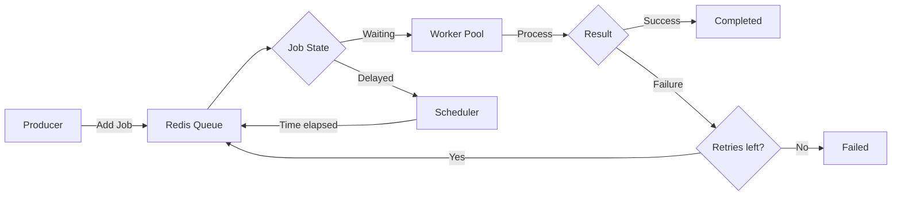

# How to Build a Task Scheduler with BullMQ in Node.js

Author: [nawazdhandala](https://www.github.com/nawazdhandala)

Tags: Node.js, BullMQ, Redis, Task Scheduling, Backend

Description: Learn how to build a production-ready task scheduler with BullMQ in Node.js, featuring cron jobs, delayed tasks, retries, and job prioritization.

---

Background job processing is essential for scalable applications. Email sending, report generation, data synchronization, and cleanup tasks should not block your API responses. BullMQ is a Redis-based queue system that handles job scheduling, retries, and concurrent processing.

This guide covers building a complete task scheduler with BullMQ: defining jobs, scheduling with cron expressions, handling failures, and monitoring queue health.

## Setting Up BullMQ

BullMQ requires Redis 5.0 or higher. Install the dependencies and create a basic queue:

```typescript
// Install: npm install bullmq ioredis

// config/redis.ts
import { Redis } from 'ioredis';

// Redis connection shared across queues and workers
export const redisConnection = new Redis({
  host: process.env.REDIS_HOST || 'localhost',
  port: parseInt(process.env.REDIS_PORT || '6379'),
  maxRetriesPerRequest: null, // Required for BullMQ
});

// Close connection on shutdown
process.on('SIGTERM', async () => {
  await redisConnection.quit();
});
```

```typescript
// queues/emailQueue.ts
import { Queue, Worker, Job } from 'bullmq';
import { redisConnection } from '../config/redis';

// Define the job data structure
interface EmailJobData {
  to: string;
  subject: string;
  body: string;
  templateId?: string;
  variables?: Record<string, string>;
}

// Create the queue with a name and Redis connection
export const emailQueue = new Queue<EmailJobData>('email', {
  connection: redisConnection,
  defaultJobOptions: {
    attempts: 3,
    backoff: {
      type: 'exponential',
      delay: 1000,
    },
    removeOnComplete: {
      count: 1000, // Keep last 1000 completed jobs
    },
    removeOnFail: {
      count: 5000, // Keep last 5000 failed jobs for debugging
    },
  },
});

// Add a job to the queue
export async function sendEmail(data: EmailJobData): Promise<string> {
  const job = await emailQueue.add('send', data);
  return job.id!;
}
```

## Creating Workers

Workers process jobs from the queue. They run in separate processes or containers for isolation and scalability.

```typescript
// workers/emailWorker.ts
import { Worker, Job } from 'bullmq';
import { redisConnection } from '../config/redis';

interface EmailJobData {
  to: string;
  subject: string;
  body: string;
  templateId?: string;
  variables?: Record<string, string>;
}

// The processor function handles each job
async function processEmail(job: Job<EmailJobData>): Promise<void> {
  const { to, subject, body, templateId, variables } = job.data;

  // Update progress for long-running jobs
  await job.updateProgress(10);

  // Render template if specified
  let emailBody = body;
  if (templateId && variables) {
    emailBody = await renderTemplate(templateId, variables);
    await job.updateProgress(50);
  }

  // Send the email via your email provider
  await sendViaProvider({
    to,
    subject,
    body: emailBody,
  });

  await job.updateProgress(100);

  // Log completion for debugging
  console.log(`Email sent to ${to}: ${subject}`);
}

// Create the worker
const emailWorker = new Worker<EmailJobData>('email', processEmail, {
  connection: redisConnection,
  concurrency: 5, // Process 5 jobs in parallel
  limiter: {
    max: 100,
    duration: 60000, // Max 100 emails per minute
  },
});

// Event handlers for monitoring
emailWorker.on('completed', (job) => {
  console.log(`Job ${job.id} completed`);
});

emailWorker.on('failed', (job, error) => {
  console.error(`Job ${job?.id} failed:`, error.message);
});

emailWorker.on('error', (error) => {
  console.error('Worker error:', error);
});

// Graceful shutdown
async function shutdown() {
  await emailWorker.close();
  console.log('Email worker stopped');
}

process.on('SIGTERM', shutdown);
process.on('SIGINT', shutdown);

// Helper functions (implement based on your providers)
async function renderTemplate(templateId: string, variables: Record<string, string>): Promise<string> {
  // Your template rendering logic
  return `Rendered template ${templateId}`;
}

async function sendViaProvider(email: { to: string; subject: string; body: string }): Promise<void> {
  // Your email provider integration
  console.log(`Sending to ${email.to}`);
}
```

## Scheduling Jobs with Cron

BullMQ supports repeatable jobs using cron expressions. These are useful for periodic tasks like daily reports or hourly cleanups.

```typescript
// scheduler/cronJobs.ts
import { Queue } from 'bullmq';
import { redisConnection } from '../config/redis';

// Queue for scheduled tasks
export const schedulerQueue = new Queue('scheduler', {
  connection: redisConnection,
});

// Define scheduled jobs
interface ScheduledJob {
  name: string;
  cron: string;
  data: Record<string, unknown>;
  timezone?: string;
}

const scheduledJobs: ScheduledJob[] = [
  {
    name: 'daily-report',
    cron: '0 9 * * *', // Every day at 9 AM
    data: { reportType: 'daily' },
    timezone: 'America/New_York',
  },
  {
    name: 'cleanup-expired',
    cron: '0 */4 * * *', // Every 4 hours
    data: { olderThanDays: 30 },
  },
  {
    name: 'sync-external-data',
    cron: '*/15 * * * *', // Every 15 minutes
    data: { source: 'external-api' },
  },
  {
    name: 'weekly-digest',
    cron: '0 10 * * 1', // Monday at 10 AM
    data: { digestType: 'weekly' },
    timezone: 'UTC',
  },
];

// Register all scheduled jobs on application startup
export async function registerScheduledJobs(): Promise<void> {
  // Remove existing repeatable jobs to avoid duplicates
  const existingJobs = await schedulerQueue.getRepeatableJobs();
  for (const job of existingJobs) {
    await schedulerQueue.removeRepeatableByKey(job.key);
  }

  // Add fresh scheduled jobs
  for (const job of scheduledJobs) {
    await schedulerQueue.add(job.name, job.data, {
      repeat: {
        pattern: job.cron,
        tz: job.timezone,
      },
      jobId: job.name, // Use name as ID for easy lookup
    });

    console.log(`Scheduled job: ${job.name} with cron: ${job.cron}`);
  }
}

// Worker to process scheduled jobs
import { Worker, Job } from 'bullmq';

const schedulerWorker = new Worker(
  'scheduler',
  async (job: Job) => {
    console.log(`Running scheduled job: ${job.name}`);

    switch (job.name) {
      case 'daily-report':
        await generateDailyReport(job.data as { reportType: string });
        break;

      case 'cleanup-expired':
        await cleanupExpiredRecords(job.data as { olderThanDays: number });
        break;

      case 'sync-external-data':
        await syncExternalData(job.data as { source: string });
        break;

      case 'weekly-digest':
        await sendWeeklyDigest(job.data as { digestType: string });
        break;

      default:
        console.warn(`Unknown scheduled job: ${job.name}`);
    }
  },
  { connection: redisConnection }
);

// Job handlers
async function generateDailyReport(data: { reportType: string }): Promise<void> {
  console.log(`Generating ${data.reportType} report`);
  // Your report generation logic
}

async function cleanupExpiredRecords(data: { olderThanDays: number }): Promise<void> {
  console.log(`Cleaning up records older than ${data.olderThanDays} days`);
  // Your cleanup logic
}

async function syncExternalData(data: { source: string }): Promise<void> {
  console.log(`Syncing data from ${data.source}`);
  // Your sync logic
}

async function sendWeeklyDigest(data: { digestType: string }): Promise<void> {
  console.log(`Sending ${data.digestType} digest`);
  // Your digest logic
}
```

## Delayed Jobs

Schedule jobs to run after a specific delay or at a specific time:

```typescript
// queues/delayedJobs.ts
import { Queue } from 'bullmq';
import { redisConnection } from '../config/redis';

const notificationQueue = new Queue('notifications', {
  connection: redisConnection,
});

// Schedule a reminder 24 hours from now
export async function scheduleReminder(
  userId: string,
  message: string
): Promise<string> {
  const job = await notificationQueue.add(
    'reminder',
    { userId, message },
    {
      delay: 24 * 60 * 60 * 1000, // 24 hours in milliseconds
    }
  );
  return job.id!;
}

// Schedule at a specific timestamp
export async function scheduleNotificationAt(
  userId: string,
  message: string,
  sendAt: Date
): Promise<string> {
  const delay = sendAt.getTime() - Date.now();

  if (delay <= 0) {
    throw new Error('Scheduled time must be in the future');
  }

  const job = await notificationQueue.add(
    'scheduled-notification',
    { userId, message, scheduledFor: sendAt.toISOString() },
    { delay }
  );

  return job.id!;
}

// Cancel a scheduled job
export async function cancelScheduledNotification(jobId: string): Promise<boolean> {
  const job = await notificationQueue.getJob(jobId);

  if (!job) {
    return false;
  }

  // Only remove if not yet processed
  const state = await job.getState();
  if (state === 'delayed' || state === 'waiting') {
    await job.remove();
    return true;
  }

  return false;
}
```

## Job Priorities

Process important jobs before others using priority levels:

```typescript
// queues/priorityQueue.ts
import { Queue, Worker, Job } from 'bullmq';
import { redisConnection } from '../config/redis';

interface TaskData {
  taskType: string;
  payload: Record<string, unknown>;
}

// Queue with priority support
const taskQueue = new Queue<TaskData>('tasks', {
  connection: redisConnection,
});

// Priority levels (lower number = higher priority)
export enum Priority {
  CRITICAL = 1,
  HIGH = 5,
  NORMAL = 10,
  LOW = 20,
}

export async function addTask(
  taskType: string,
  payload: Record<string, unknown>,
  priority: Priority = Priority.NORMAL
): Promise<string> {
  const job = await taskQueue.add(
    taskType,
    { taskType, payload },
    { priority }
  );
  return job.id!;
}

// Usage examples
async function exampleUsage() {
  // Critical task: process immediately before other jobs
  await addTask('payment-webhook', { paymentId: '123' }, Priority.CRITICAL);

  // High priority: important but not critical
  await addTask('password-reset', { userId: 'user-456' }, Priority.HIGH);

  // Normal priority: default for most tasks
  await addTask('generate-thumbnail', { imageId: 'img-789' }, Priority.NORMAL);

  // Low priority: can wait, like analytics
  await addTask('track-event', { event: 'page_view' }, Priority.LOW);
}
```

## Error Handling and Retries

Configure retry strategies for different failure scenarios:

```typescript
// queues/retryStrategies.ts
import { Queue, Worker, Job, UnrecoverableError } from 'bullmq';
import { redisConnection } from '../config/redis';

interface WebhookData {
  url: string;
  payload: Record<string, unknown>;
  headers?: Record<string, string>;
}

const webhookQueue = new Queue<WebhookData>('webhooks', {
  connection: redisConnection,
  defaultJobOptions: {
    attempts: 5,
    backoff: {
      type: 'exponential',
      delay: 2000, // Start with 2 seconds
    },
  },
});

const webhookWorker = new Worker<WebhookData>(
  'webhooks',
  async (job: Job<WebhookData>) => {
    const { url, payload, headers } = job.data;

    const response = await fetch(url, {
      method: 'POST',
      headers: {
        'Content-Type': 'application/json',
        ...headers,
      },
      body: JSON.stringify(payload),
    });

    if (!response.ok) {
      const status = response.status;

      // 4xx errors: client error, do not retry (except 429)
      if (status >= 400 && status < 500 && status !== 429) {
        throw new UnrecoverableError(
          `Webhook failed with ${status}: will not retry`
        );
      }

      // 429 or 5xx: retry with backoff
      throw new Error(`Webhook failed with status ${status}`);
    }

    return { status: response.status };
  },
  { connection: redisConnection }
);

// Custom backoff strategy
const customBackoffQueue = new Queue('custom-backoff', {
  connection: redisConnection,
  defaultJobOptions: {
    attempts: 6,
    backoff: {
      type: 'custom',
    },
  },
  settings: {
    backoffStrategy: (attemptsMade: number) => {
      // Custom delays: 1s, 5s, 30s, 2m, 10m, 1h
      const delays = [1000, 5000, 30000, 120000, 600000, 3600000];
      return delays[Math.min(attemptsMade - 1, delays.length - 1)];
    },
  },
});
```

## Monitoring Queue Health

Track queue metrics for observability and alerting:

```typescript
// monitoring/queueMetrics.ts
import { Queue, QueueEvents } from 'bullmq';
import { redisConnection } from '../config/redis';

interface QueueStats {
  name: string;
  waiting: number;
  active: number;
  completed: number;
  failed: number;
  delayed: number;
  paused: boolean;
}

export async function getQueueStats(queue: Queue): Promise<QueueStats> {
  const [waiting, active, completed, failed, delayed, paused] = await Promise.all([
    queue.getWaitingCount(),
    queue.getActiveCount(),
    queue.getCompletedCount(),
    queue.getFailedCount(),
    queue.getDelayedCount(),
    queue.isPaused(),
  ]);

  return {
    name: queue.name,
    waiting,
    active,
    completed,
    failed,
    delayed,
    paused,
  };
}

// Real-time event monitoring
export function monitorQueue(queue: Queue): QueueEvents {
  const queueEvents = new QueueEvents(queue.name, {
    connection: redisConnection,
  });

  queueEvents.on('completed', ({ jobId, returnvalue }) => {
    console.log(`Job ${jobId} completed with result:`, returnvalue);
  });

  queueEvents.on('failed', ({ jobId, failedReason }) => {
    console.error(`Job ${jobId} failed:`, failedReason);
  });

  queueEvents.on('stalled', ({ jobId }) => {
    console.warn(`Job ${jobId} stalled`);
  });

  queueEvents.on('progress', ({ jobId, data }) => {
    console.log(`Job ${jobId} progress:`, data);
  });

  return queueEvents;
}

// Health check endpoint data
export async function getSystemHealth(queues: Queue[]): Promise<{
  healthy: boolean;
  queues: QueueStats[];
  alerts: string[];
}> {
  const stats = await Promise.all(queues.map(getQueueStats));
  const alerts: string[] = [];

  // Check for issues
  for (const stat of stats) {
    if (stat.waiting > 10000) {
      alerts.push(`${stat.name}: High backlog (${stat.waiting} waiting)`);
    }
    if (stat.failed > 100) {
      alerts.push(`${stat.name}: High failure count (${stat.failed})`);
    }
    if (stat.paused) {
      alerts.push(`${stat.name}: Queue is paused`);
    }
  }

  return {
    healthy: alerts.length === 0,
    queues: stats,
    alerts,
  };
}
```

## Flow Diagram

Here is how jobs flow through the BullMQ system:



## Complete Example: Multi-Queue Application

Here is a full example combining multiple queues:

```typescript
// app.ts
import express from 'express';
import { emailQueue, sendEmail } from './queues/emailQueue';
import { schedulerQueue, registerScheduledJobs } from './scheduler/cronJobs';
import { getSystemHealth } from './monitoring/queueMetrics';

const app = express();
app.use(express.json());

// API to trigger email
app.post('/api/send-email', async (req, res) => {
  const { to, subject, body } = req.body;
  const jobId = await sendEmail({ to, subject, body });
  res.json({ jobId, status: 'queued' });
});

// Health check endpoint
app.get('/api/health', async (req, res) => {
  const health = await getSystemHealth([emailQueue, schedulerQueue]);
  const status = health.healthy ? 200 : 503;
  res.status(status).json(health);
});

// Initialize scheduled jobs on startup
async function init() {
  await registerScheduledJobs();
  console.log('Scheduled jobs registered');

  app.listen(3000, () => {
    console.log('Server running on port 3000');
  });
}

init().catch(console.error);
```

## Summary

BullMQ provides the building blocks for reliable task scheduling in Node.js:

| Feature | Use Case |
|---------|----------|
| **Delayed jobs** | Send reminders, schedule notifications |
| **Cron jobs** | Daily reports, periodic cleanup |
| **Priorities** | Process payments before analytics |
| **Retries with backoff** | Handle transient failures gracefully |
| **Rate limiting** | Respect API quotas |
| **Monitoring** | Track queue health and alert on issues |

With BullMQ, you can offload slow operations from your API, ensure jobs complete even after crashes, and scale workers independently. The Redis backend provides persistence and horizontal scaling across multiple worker processes.
