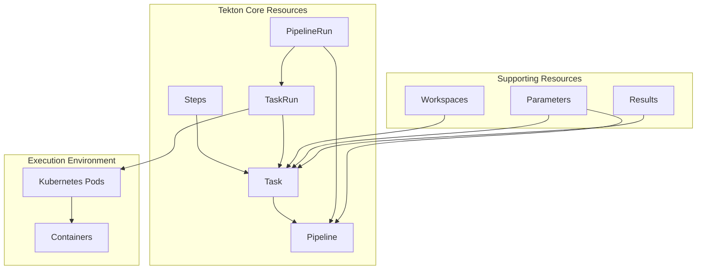

# How to Get Started with Tekton Pipelines

Author: [nawazdhandala](https://www.github.com/nawazdhandala)

Tags: Tekton, Kubernetes, CI/CD, Pipelines, DevOps, Cloud Native

Description: A practical introduction to Tekton Pipelines covering installation, core concepts, and building your first CI/CD pipeline on Kubernetes.

> Tekton is a powerful, Kubernetes-native framework for building CI/CD systems. This guide walks you through everything you need to start building pipelines with Tekton.

## What is Tekton?

Tekton is an open-source project that provides Kubernetes-native resources for building continuous integration and delivery (CI/CD) pipelines. Unlike traditional CI/CD tools that run as standalone applications, Tekton runs directly on Kubernetes, treating pipelines as native Kubernetes resources.

The project originated at Google and is now part of the CD Foundation. It offers several advantages over traditional CI/CD tools:

- **Kubernetes-native**: Pipelines are defined as Kubernetes custom resources
- **Portable**: Works on any Kubernetes cluster, whether on-premises or in the cloud
- **Flexible**: Build pipelines for any language or framework
- **Scalable**: Leverages Kubernetes for automatic scaling and resource management
- **Reusable**: Tasks can be shared and reused across pipelines

## Tekton Architecture

Before diving into installation, let's understand how Tekton components fit together.



### Core Concepts

**Step**: The smallest unit of execution. Each step runs a container that performs a specific action, like cloning a repository or running tests.

**Task**: A collection of steps that run sequentially. Tasks are reusable building blocks that can accept parameters and produce results.

**TaskRun**: An instance of a Task execution. When you want to run a Task, you create a TaskRun.

**Pipeline**: A collection of Tasks that can run in sequence or parallel. Pipelines define the overall workflow of your CI/CD process.

**PipelineRun**: An instance of a Pipeline execution. This triggers your entire pipeline to run.

**Workspace**: A shared volume that allows Tasks to share data between them.

## Prerequisites

Before installing Tekton, you need:

- A Kubernetes cluster (version 1.25 or later recommended)
- kubectl configured to access your cluster
- Cluster admin permissions

For local development, you can use minikube, kind, or Docker Desktop with Kubernetes enabled.

## Installing Tekton

### Install Tekton Pipelines

Tekton Pipelines is the core component that provides the pipeline execution engine.

```bash
# Install the latest release of Tekton Pipelines
kubectl apply --filename https://storage.googleapis.com/tekton-releases/pipeline/latest/release.yaml

# Wait for the installation to complete
kubectl wait --for=condition=ready pod -l app.kubernetes.io/part-of=tekton-pipelines -n tekton-pipelines --timeout=120s
```

Verify the installation:

```bash
# Check that all Tekton pods are running
kubectl get pods -n tekton-pipelines
```

You should see output similar to:

```
NAME                                           READY   STATUS    RESTARTS   AGE
tekton-pipelines-controller-7c4d5b5d8f-abcde   1/1     Running   0          60s
tekton-pipelines-webhook-6f8f8d5c7b-fghij      1/1     Running   0          60s
```

### Install Tekton CLI (tkn)

The Tekton CLI makes it easier to interact with Tekton resources.

```bash
# macOS with Homebrew
brew install tektoncd-cli

# Linux (x86_64)
curl -LO https://github.com/tektoncd/cli/releases/download/v0.35.0/tkn_0.35.0_Linux_x86_64.tar.gz
tar xvzf tkn_0.35.0_Linux_x86_64.tar.gz -C /usr/local/bin tkn

# Verify installation
tkn version
```

### Install Tekton Dashboard (Optional)

The Tekton Dashboard provides a web interface for viewing and managing pipelines.

```bash
# Install Tekton Dashboard
kubectl apply --filename https://storage.googleapis.com/tekton-releases/dashboard/latest/release.yaml

# Access the dashboard via port-forward
kubectl port-forward -n tekton-pipelines svc/tekton-dashboard 9097:9097
```

Open http://localhost:9097 in your browser to access the dashboard.

## Your First Task

Let's create a simple Task that prints a greeting message.

```yaml
# hello-task.yaml
apiVersion: tekton.dev/v1
kind: Task
metadata:
  name: hello
  namespace: default
spec:
  # Define parameters that can be passed to the task
  params:
    - name: username
      description: The name of the person to greet
      type: string
      default: "World"

  # Define the steps that make up this task
  steps:
    - name: greet
      # Use a lightweight alpine image
      image: alpine:3.19
      # Script to execute in this step
      script: |
        #!/bin/sh
        echo "Hello, $(params.username)!"
        echo "Welcome to Tekton Pipelines!"
        echo "Current time: $(date)"
```

Apply the Task:

```bash
kubectl apply -f hello-task.yaml
```

Now create a TaskRun to execute the Task:

```yaml
# hello-taskrun.yaml
apiVersion: tekton.dev/v1
kind: TaskRun
metadata:
  # generateName creates a unique name for each run
  generateName: hello-run-
  namespace: default
spec:
  taskRef:
    name: hello
  params:
    - name: username
      value: "Tekton User"
```

Run the Task:

```bash
# Create the TaskRun
kubectl create -f hello-taskrun.yaml

# View the TaskRun status
tkn taskrun list

# View the logs
tkn taskrun logs -f --last
```

## Building a Multi-Step Task

Real-world tasks often need multiple steps. Let's create a Task that clones a repository and runs tests.

```yaml
# build-test-task.yaml
apiVersion: tekton.dev/v1
kind: Task
metadata:
  name: build-and-test
  namespace: default
spec:
  params:
    - name: repo-url
      description: The Git repository URL
      type: string
    - name: branch
      description: The branch to checkout
      type: string
      default: "main"

  # Workspaces allow sharing data between steps
  workspaces:
    - name: source
      description: Workspace to clone the repository into

  # Results can pass data to other tasks
  results:
    - name: commit-sha
      description: The commit SHA that was checked out

  steps:
    # Step 1: Clone the repository
    - name: clone
      image: alpine/git:2.43.0
      workingDir: $(workspaces.source.path)
      script: |
        #!/bin/sh
        set -e

        echo "Cloning $(params.repo-url) branch $(params.branch)"
        git clone --branch $(params.branch) --depth 1 $(params.repo-url) .

        # Store the commit SHA as a result
        git rev-parse HEAD | tr -d '\n' > $(results.commit-sha.path)

        echo "Cloned successfully at commit $(cat $(results.commit-sha.path))"

    # Step 2: List files to verify clone worked
    - name: list-files
      image: alpine:3.19
      workingDir: $(workspaces.source.path)
      script: |
        #!/bin/sh
        echo "Repository contents:"
        ls -la

    # Step 3: Run any tests (placeholder for real testing)
    - name: run-tests
      image: alpine:3.19
      workingDir: $(workspaces.source.path)
      script: |
        #!/bin/sh
        echo "Running tests..."
        # In a real scenario, you would run your actual test command here
        # For example: npm test, pytest, go test, etc.
        echo "All tests passed!"
```

Run the Task with a workspace:

```yaml
# build-test-taskrun.yaml
apiVersion: tekton.dev/v1
kind: TaskRun
metadata:
  generateName: build-test-run-
  namespace: default
spec:
  taskRef:
    name: build-and-test
  params:
    - name: repo-url
      value: "https://github.com/tektoncd/pipeline"
    - name: branch
      value: "main"
  workspaces:
    - name: source
      # emptyDir provides temporary storage for this run
      emptyDir: {}
```

## Creating Your First Pipeline

Pipelines combine multiple Tasks into a workflow. Let's create a CI pipeline with build, test, and deploy stages.

```yaml
# ci-pipeline.yaml
apiVersion: tekton.dev/v1
kind: Pipeline
metadata:
  name: ci-pipeline
  namespace: default
spec:
  description: A simple CI pipeline that builds, tests, and deploys

  # Pipeline-level parameters
  params:
    - name: repo-url
      description: Git repository URL
      type: string
    - name: branch
      description: Git branch to build
      type: string
      default: "main"
    - name: image-name
      description: Name for the container image
      type: string

  # Pipeline-level workspaces shared across tasks
  workspaces:
    - name: shared-workspace
      description: Workspace for sharing data between tasks

  tasks:
    # Task 1: Clone the repository
    - name: fetch-source
      taskRef:
        name: git-clone
        kind: Task
      params:
        - name: url
          value: $(params.repo-url)
        - name: revision
          value: $(params.branch)
      workspaces:
        - name: output
          workspace: shared-workspace

    # Task 2: Run tests (runs after fetch-source)
    - name: run-tests
      taskRef:
        name: run-tests
      runAfter:
        - fetch-source
      workspaces:
        - name: source
          workspace: shared-workspace

    # Task 3: Build container image (runs after tests pass)
    - name: build-image
      taskRef:
        name: build-image
      runAfter:
        - run-tests
      params:
        - name: image
          value: $(params.image-name)
      workspaces:
        - name: source
          workspace: shared-workspace

    # Task 4: Deploy to staging (runs after image is built)
    - name: deploy-staging
      taskRef:
        name: deploy
      runAfter:
        - build-image
      params:
        - name: environment
          value: staging
        - name: image
          value: $(params.image-name)
```

### Supporting Tasks

Here are the supporting Tasks referenced by the pipeline:

```yaml
# git-clone-task.yaml
apiVersion: tekton.dev/v1
kind: Task
metadata:
  name: git-clone
  namespace: default
spec:
  params:
    - name: url
      type: string
    - name: revision
      type: string
      default: "main"
  workspaces:
    - name: output
  results:
    - name: commit
      description: The precise commit SHA
  steps:
    - name: clone
      image: alpine/git:2.43.0
      workingDir: $(workspaces.output.path)
      script: |
        #!/bin/sh
        set -e
        git clone --branch $(params.revision) --depth 1 $(params.url) .
        git rev-parse HEAD | tr -d '\n' > $(results.commit.path)
        echo "Cloned $(params.url) at $(cat $(results.commit.path))"
---
# run-tests-task.yaml
apiVersion: tekton.dev/v1
kind: Task
metadata:
  name: run-tests
  namespace: default
spec:
  workspaces:
    - name: source
  steps:
    - name: test
      image: node:20-alpine
      workingDir: $(workspaces.source.path)
      script: |
        #!/bin/sh
        echo "Running unit tests..."
        # Check if package.json exists and run npm test
        if [ -f package.json ]; then
          npm ci --prefer-offline
          npm test
        else
          echo "No package.json found, skipping npm tests"
        fi
        echo "Tests completed successfully"
---
# build-image-task.yaml
apiVersion: tekton.dev/v1
kind: Task
metadata:
  name: build-image
  namespace: default
spec:
  params:
    - name: image
      type: string
  workspaces:
    - name: source
  steps:
    - name: build
      # Kaniko builds container images without requiring Docker daemon
      image: gcr.io/kaniko-project/executor:v1.19.0
      args:
        - "--dockerfile=$(workspaces.source.path)/Dockerfile"
        - "--context=$(workspaces.source.path)"
        - "--destination=$(params.image)"
        - "--no-push"
      # In production, remove --no-push and configure registry credentials
---
# deploy-task.yaml
apiVersion: tekton.dev/v1
kind: Task
metadata:
  name: deploy
  namespace: default
spec:
  params:
    - name: environment
      type: string
    - name: image
      type: string
  steps:
    - name: deploy
      image: bitnami/kubectl:1.29
      script: |
        #!/bin/sh
        echo "Deploying $(params.image) to $(params.environment)"
        # In production, this would apply Kubernetes manifests
        # kubectl apply -f k8s/$(params.environment)/
        echo "Deployment to $(params.environment) completed"
```

### Running the Pipeline

Create a PipelineRun to execute the pipeline:

```yaml
# ci-pipelinerun.yaml
apiVersion: tekton.dev/v1
kind: PipelineRun
metadata:
  generateName: ci-pipeline-run-
  namespace: default
spec:
  pipelineRef:
    name: ci-pipeline
  params:
    - name: repo-url
      value: "https://github.com/your-org/your-repo"
    - name: branch
      value: "main"
    - name: image-name
      value: "my-registry/my-app:latest"
  workspaces:
    - name: shared-workspace
      volumeClaimTemplate:
        spec:
          accessModes:
            - ReadWriteOnce
          resources:
            requests:
              storage: 1Gi
```

Execute and monitor the pipeline:

```bash
# Create the PipelineRun
kubectl create -f ci-pipelinerun.yaml

# List pipeline runs
tkn pipelinerun list

# Watch the pipeline execution
tkn pipelinerun logs -f --last

# Get detailed status
tkn pipelinerun describe --last
```

## Running Tasks in Parallel

You can run Tasks in parallel by not specifying `runAfter`. Here's an example:

```yaml
# parallel-pipeline.yaml
apiVersion: tekton.dev/v1
kind: Pipeline
metadata:
  name: parallel-checks
  namespace: default
spec:
  workspaces:
    - name: source

  tasks:
    - name: fetch-source
      taskRef:
        name: git-clone
      workspaces:
        - name: output
          workspace: source

    # These three tasks run in parallel after fetch-source
    - name: lint
      taskRef:
        name: lint
      runAfter: [fetch-source]
      workspaces:
        - name: source
          workspace: source

    - name: unit-test
      taskRef:
        name: unit-test
      runAfter: [fetch-source]
      workspaces:
        - name: source
          workspace: source

    - name: security-scan
      taskRef:
        name: security-scan
      runAfter: [fetch-source]
      workspaces:
        - name: source
          workspace: source

    # This task runs after all parallel tasks complete
    - name: build
      taskRef:
        name: build-image
      runAfter: [lint, unit-test, security-scan]
      workspaces:
        - name: source
          workspace: source
```

## Using the Tekton Hub

Tekton Hub (hub.tekton.dev) provides a catalog of reusable Tasks and Pipelines. You can install community Tasks instead of writing your own.

```bash
# Install git-clone task from Tekton Hub
kubectl apply -f https://api.hub.tekton.dev/v1/resource/tekton/task/git-clone/0.9/raw

# Install kaniko task for building images
kubectl apply -f https://api.hub.tekton.dev/v1/resource/tekton/task/kaniko/0.6/raw

# List available tasks
tkn hub search git

# Get info about a specific task
tkn hub info task git-clone
```

## Debugging Pipeline Failures

When things go wrong, here's how to diagnose issues:

```bash
# Get detailed TaskRun information
tkn taskrun describe <taskrun-name>

# View logs for a specific step
tkn taskrun logs <taskrun-name> -s <step-name>

# Get all events related to the TaskRun
kubectl describe taskrun <taskrun-name>

# Check pod status directly
kubectl get pods -l tekton.dev/taskRun=<taskrun-name>
kubectl logs <pod-name> -c step-<step-name>
```

Common issues and solutions:

- **ImagePullBackOff**: Check that the container image exists and is accessible
- **Timeout**: Increase the timeout in the TaskRun or Pipeline spec
- **Permission denied**: Verify ServiceAccount permissions and workspace access

## Best Practices

Here are some recommendations for working with Tekton:

**Keep Tasks small and focused**: Each Task should do one thing well. This makes them easier to test and reuse.

**Use parameters and results**: Make Tasks configurable through parameters and pass data between Tasks using results.

**Leverage workspaces**: Use workspaces to share data between Tasks rather than storing artifacts externally.

**Version your resources**: Include version labels and use specific image tags rather than `latest`.

**Set resource limits**: Always define CPU and memory limits for your steps to prevent resource exhaustion.

```yaml
steps:
  - name: build
    image: node:20-alpine
    resources:
      requests:
        memory: "256Mi"
        cpu: "250m"
      limits:
        memory: "512Mi"
        cpu: "500m"
```

## What's Next?

Now that you understand the basics of Tekton, here are some areas to explore:

- **Tekton Triggers**: Automatically trigger pipelines from Git webhooks
- **Tekton Chains**: Add supply chain security with signed provenance
- **Tekton Results**: Store and query pipeline execution history
- **Integration with GitOps**: Combine Tekton with ArgoCD or Flux for complete CI/CD

Tekton provides a solid foundation for building CI/CD systems that are truly Kubernetes-native. The learning curve can feel steep at first, but the flexibility and portability it offers make it a worthwhile investment for teams running workloads on Kubernetes.
