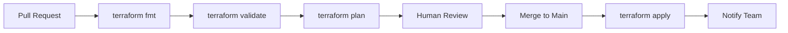

# How to Build CI/CD Pipelines for Terraform

Author: [nawazdhandala](https://www.github.com/nawazdhandala)

Tags: Terraform, CI/CD, DevOps, GitHub Actions, GitLab CI, Infrastructure as Code, Automation

Description: Learn how to automate Terraform workflows with CI/CD pipelines using GitHub Actions, GitLab CI, and other tools. Covers plan reviews, automated applies, and security best practices.

---

Manual Terraform operations don't scale. Teams need automated pipelines that plan on pull requests, require approvals, and apply on merge. This guide covers building production-ready CI/CD for Terraform.

## Pipeline Workflow



## GitHub Actions Pipeline

### Basic Pipeline

```yaml
# .github/workflows/terraform.yml

name: Terraform

on:
  push:
    branches: [main]
  pull_request:
    branches: [main]

env:
  TF_VERSION: "1.6.0"
  AWS_REGION: "us-east-1"

jobs:
  terraform:
    name: Terraform
    runs-on: ubuntu-latest

    # Required for OIDC authentication
    permissions:
      id-token: write
      contents: read
      pull-requests: write

    steps:
      - name: Checkout code
        uses: actions/checkout@v4

      # Configure AWS credentials using OIDC (no long-lived secrets)
      - name: Configure AWS credentials
        uses: aws-actions/configure-aws-credentials@v4
        with:
          role-to-assume: arn:aws:iam::123456789012:role/terraform-github-actions
          aws-region: ${{ env.AWS_REGION }}

      - name: Setup Terraform
        uses: hashicorp/setup-terraform@v3
        with:
          terraform_version: ${{ env.TF_VERSION }}

      - name: Terraform Format
        id: fmt
        run: terraform fmt -check -recursive
        continue-on-error: true

      - name: Terraform Init
        id: init
        run: terraform init

      - name: Terraform Validate
        id: validate
        run: terraform validate -no-color

      - name: Terraform Plan
        id: plan
        if: github.event_name == 'pull_request'
        run: terraform plan -no-color -out=tfplan
        continue-on-error: true

      # Post plan output as PR comment
      - name: Post Plan to PR
        uses: actions/github-script@v7
        if: github.event_name == 'pull_request'
        env:
          PLAN: ${{ steps.plan.outputs.stdout }}
        with:
          github-token: ${{ secrets.GITHUB_TOKEN }}
          script: |
            const output = `#### Terraform Format: \`${{ steps.fmt.outcome }}\`
            #### Terraform Init: \`${{ steps.init.outcome }}\`
            #### Terraform Validate: \`${{ steps.validate.outcome }}\`
            #### Terraform Plan: \`${{ steps.plan.outcome }}\`

            <details><summary>Show Plan</summary>

            \`\`\`terraform
            ${process.env.PLAN}
            \`\`\`

            </details>

            *Pushed by: @${{ github.actor }}*`;

            github.rest.issues.createComment({
              issue_number: context.issue.number,
              owner: context.repo.owner,
              repo: context.repo.repo,
              body: output
            })

      # Apply only on push to main
      - name: Terraform Apply
        if: github.ref == 'refs/heads/main' && github.event_name == 'push'
        run: terraform apply -auto-approve
```

### Multi-Environment Pipeline

```yaml
# .github/workflows/terraform-environments.yml

name: Terraform Multi-Environment

on:
  push:
    branches: [main, develop]
  pull_request:
    branches: [main, develop]

jobs:
  determine-environment:
    runs-on: ubuntu-latest
    outputs:
      environment: ${{ steps.set-env.outputs.environment }}
    steps:
      - id: set-env
        run: |
          if [[ "${{ github.base_ref }}" == "main" ]] || [[ "${{ github.ref }}" == "refs/heads/main" ]]; then
            echo "environment=prod" >> $GITHUB_OUTPUT
          else
            echo "environment=dev" >> $GITHUB_OUTPUT
          fi

  terraform:
    needs: determine-environment
    runs-on: ubuntu-latest
    environment: ${{ needs.determine-environment.outputs.environment }}

    defaults:
      run:
        working-directory: environments/${{ needs.determine-environment.outputs.environment }}

    steps:
      - uses: actions/checkout@v4

      - name: Configure AWS credentials
        uses: aws-actions/configure-aws-credentials@v4
        with:
          role-to-assume: ${{ vars.AWS_ROLE_ARN }}
          aws-region: us-east-1

      - name: Setup Terraform
        uses: hashicorp/setup-terraform@v3
        with:
          terraform_version: "1.6.0"

      - name: Terraform Init
        run: terraform init

      - name: Terraform Plan
        run: terraform plan -out=tfplan

      - name: Terraform Apply
        if: github.event_name == 'push'
        run: terraform apply -auto-approve tfplan
```

## GitLab CI Pipeline

```yaml
# .gitlab-ci.yml

image:
  name: hashicorp/terraform:1.6.0
  entrypoint: [""]

variables:
  TF_ROOT: ${CI_PROJECT_DIR}
  TF_STATE_NAME: default

cache:
  key: terraform
  paths:
    - ${TF_ROOT}/.terraform

stages:
  - validate
  - plan
  - apply

before_script:
  - cd ${TF_ROOT}
  - terraform init

validate:
  stage: validate
  script:
    - terraform fmt -check -recursive
    - terraform validate
  rules:
    - if: $CI_PIPELINE_SOURCE == "merge_request_event"
    - if: $CI_COMMIT_BRANCH == $CI_DEFAULT_BRANCH

plan:
  stage: plan
  script:
    - terraform plan -out=plan.tfplan
  artifacts:
    paths:
      - plan.tfplan
    expire_in: 1 week
  rules:
    - if: $CI_PIPELINE_SOURCE == "merge_request_event"
    - if: $CI_COMMIT_BRANCH == $CI_DEFAULT_BRANCH

apply:
  stage: apply
  script:
    - terraform apply -auto-approve plan.tfplan
  dependencies:
    - plan
  rules:
    - if: $CI_COMMIT_BRANCH == $CI_DEFAULT_BRANCH
  when: manual  # Require manual approval
  environment:
    name: production
```

## AWS IAM Role for GitHub Actions

Use OIDC for secure, secret-free authentication:

```hcl
# github-oidc.tf

# Create OIDC provider for GitHub
resource "aws_iam_openid_connect_provider" "github" {
  url = "https://token.actions.githubusercontent.com"

  client_id_list = ["sts.amazonaws.com"]

  thumbprint_list = ["6938fd4d98bab03faadb97b34396831e3780aea1"]
}

# IAM role that GitHub Actions can assume
resource "aws_iam_role" "github_actions" {
  name = "terraform-github-actions"

  assume_role_policy = jsonencode({
    Version = "2012-10-17"
    Statement = [{
      Effect = "Allow"
      Principal = {
        Federated = aws_iam_openid_connect_provider.github.arn
      }
      Action = "sts:AssumeRoleWithWebIdentity"
      Condition = {
        StringEquals = {
          "token.actions.githubusercontent.com:aud" = "sts.amazonaws.com"
        }
        StringLike = {
          # Restrict to specific repo and branches
          "token.actions.githubusercontent.com:sub" = "repo:myorg/myrepo:*"
        }
      }
    }]
  })
}

# Attach necessary policies
resource "aws_iam_role_policy_attachment" "terraform_policy" {
  role       = aws_iam_role.github_actions.name
  policy_arn = aws_iam_policy.terraform.arn
}

resource "aws_iam_policy" "terraform" {
  name = "terraform-policy"

  policy = jsonencode({
    Version = "2012-10-17"
    Statement = [
      {
        Effect = "Allow"
        Action = [
          "s3:GetObject",
          "s3:PutObject",
          "s3:DeleteObject",
          "s3:ListBucket"
        ]
        Resource = [
          "arn:aws:s3:::mycompany-terraform-state",
          "arn:aws:s3:::mycompany-terraform-state/*"
        ]
      },
      {
        Effect = "Allow"
        Action = [
          "dynamodb:GetItem",
          "dynamodb:PutItem",
          "dynamodb:DeleteItem"
        ]
        Resource = "arn:aws:dynamodb:*:*:table/terraform-state-locks"
      },
      {
        Effect   = "Allow"
        Action   = ["ec2:*", "rds:*", "s3:*"]  # Adjust based on needs
        Resource = "*"
      }
    ]
  })
}
```

## Security Scanning

Add security scanning to your pipeline:

```yaml
# .github/workflows/terraform.yml (add to jobs)

security-scan:
  name: Security Scan
  runs-on: ubuntu-latest
  steps:
    - uses: actions/checkout@v4

    # Scan for security issues with tfsec
    - name: tfsec
      uses: aquasecurity/tfsec-action@v1.0.0
      with:
        soft_fail: true

    # Scan for misconfigurations with checkov
    - name: Checkov
      uses: bridgecrewio/checkov-action@master
      with:
        directory: .
        framework: terraform
        soft_fail: true
        output_format: github_failed_only

    # Scan for cost estimation
    - name: Infracost
      uses: infracost/actions/setup@v2
      with:
        api-key: ${{ secrets.INFRACOST_API_KEY }}

    - name: Generate cost report
      run: |
        infracost breakdown --path . --format json --out-file /tmp/infracost.json
        infracost comment github --path /tmp/infracost.json \
          --repo ${{ github.repository }} \
          --github-token ${{ secrets.GITHUB_TOKEN }} \
          --pull-request ${{ github.event.pull_request.number }}
```

## Plan Artifacts

Save plans as artifacts for auditing:

```yaml
- name: Terraform Plan
  run: |
    terraform plan -out=tfplan
    terraform show -json tfplan > tfplan.json

- name: Upload Plan
  uses: actions/upload-artifact@v4
  with:
    name: terraform-plan-${{ github.sha }}
    path: |
      tfplan
      tfplan.json
    retention-days: 30

# Later job applies the saved plan
- name: Download Plan
  uses: actions/download-artifact@v4
  with:
    name: terraform-plan-${{ github.sha }}

- name: Terraform Apply
  run: terraform apply tfplan
```

## Slack Notifications

```yaml
- name: Notify Slack
  if: always()
  uses: 8398a7/action-slack@v3
  with:
    status: ${{ job.status }}
    fields: repo,message,commit,author,action,eventName,ref,workflow
    text: |
      Terraform ${{ github.event_name == 'push' && 'Apply' || 'Plan' }} ${{ job.status }}
  env:
    SLACK_WEBHOOK_URL: ${{ secrets.SLACK_WEBHOOK }}
```

## Pull Request Workflow

Best practices for PR-based Terraform:

1. **Require plan review** before merge
2. **Block merges** if plan fails
3. **Show cost impact** in PR comments
4. **Auto-apply on merge** to main branch

```yaml
# Branch protection rules (set in GitHub UI or API)
# - Require pull request reviews
# - Require status checks: terraform / Terraform
# - Require branches to be up to date
```

## Drift Detection

Schedule regular drift checks:

```yaml
# .github/workflows/drift-detection.yml

name: Drift Detection

on:
  schedule:
    - cron: '0 8 * * *'  # Daily at 8am UTC
  workflow_dispatch:

jobs:
  detect-drift:
    runs-on: ubuntu-latest
    steps:
      - uses: actions/checkout@v4

      - name: Setup Terraform
        uses: hashicorp/setup-terraform@v3

      - name: Terraform Init
        run: terraform init

      - name: Detect Drift
        id: drift
        run: |
          terraform plan -detailed-exitcode -out=drift.plan
        continue-on-error: true

      - name: Report Drift
        if: steps.drift.outcome == 'failure'
        run: |
          echo "Drift detected! Creating issue..."
          gh issue create \
            --title "Terraform Drift Detected" \
            --body "$(terraform show drift.plan)"
        env:
          GH_TOKEN: ${{ secrets.GITHUB_TOKEN }}
```

## Best Practices

1. **Use OIDC** instead of long-lived credentials
2. **Plan on PR**, apply on merge
3. **Require approvals** for production changes
4. **Save plan artifacts** for auditing
5. **Add security scanning** to catch issues early
6. **Show cost estimates** before applying
7. **Notify on failures** via Slack/Teams
8. **Run drift detection** on schedule

---

CI/CD pipelines bring consistency and safety to Terraform workflows. Start with a basic plan/apply pipeline, then add security scanning, cost estimation, and drift detection as your practices mature.
