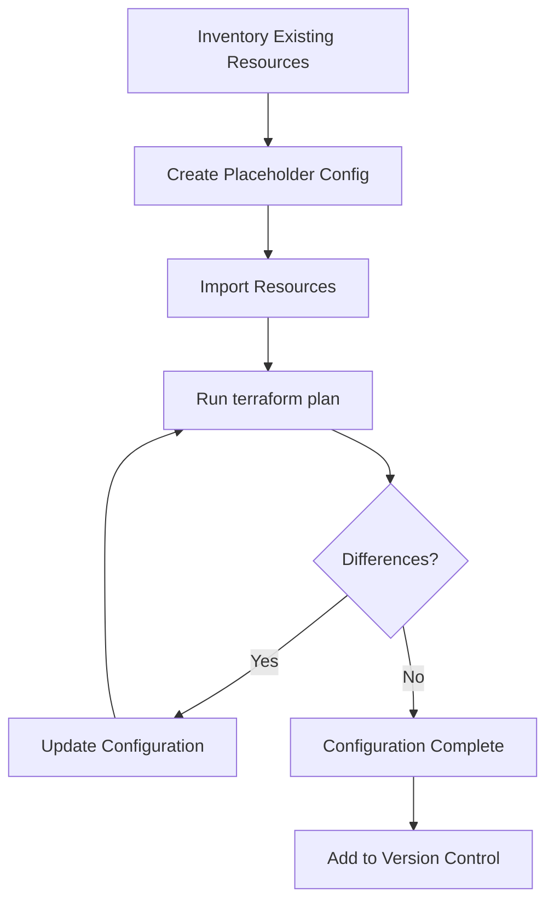

# How to Import Existing Resources into Terraform

Author: [nawazdhandala](https://www.github.com/nawazdhandala)

Tags: Terraform, Infrastructure as Code, Import, Migration, DevOps

Description: Learn how to bring existing cloud resources under Terraform management using terraform import, import blocks, and automated tools. Includes step-by-step examples and best practices.

---

Most organizations don't start with Terraform. They have existing infrastructure created manually through consoles or scripts. Terraform import brings these resources under Infrastructure as Code management without recreating them.

## Import Methods

Terraform offers three approaches:

1. **terraform import command** - Traditional, resource-by-resource
2. **import blocks** - Declarative, in configuration (Terraform 1.5+)
3. **Automated tools** - Generate configuration automatically

## Method 1: terraform import Command

The classic approach imports one resource at a time.

### Step 1: Write the Resource Configuration

First, create a placeholder configuration matching the existing resource:

```hcl
# main.tf

# Placeholder for existing S3 bucket
resource "aws_s3_bucket" "existing_data" {
  bucket = "mycompany-existing-data-bucket"

  # Other attributes will be populated after import
}
```

### Step 2: Run terraform import

```bash
# Syntax: terraform import <resource_address> <resource_id>
terraform import aws_s3_bucket.existing_data mycompany-existing-data-bucket

# Output:
# aws_s3_bucket.existing_data: Importing...
# aws_s3_bucket.existing_data: Import successful!
```

### Step 3: Update Configuration to Match State

After import, run `terraform plan` to see what's missing:

```bash
terraform plan

# Terraform will show differences between config and imported state
# Update your configuration to match
```

Update the configuration:

```hcl
resource "aws_s3_bucket" "existing_data" {
  bucket = "mycompany-existing-data-bucket"
}

resource "aws_s3_bucket_versioning" "existing_data" {
  bucket = aws_s3_bucket.existing_data.id
  versioning_configuration {
    status = "Enabled"
  }
}

resource "aws_s3_bucket_server_side_encryption_configuration" "existing_data" {
  bucket = aws_s3_bucket.existing_data.id

  rule {
    apply_server_side_encryption_by_default {
      sse_algorithm = "AES256"
    }
  }
}
```

### Common Resource Import Examples

```bash
# EC2 Instance
terraform import aws_instance.web i-1234567890abcdef0

# Security Group
terraform import aws_security_group.web sg-1234567890abcdef0

# RDS Instance
terraform import aws_db_instance.main mydb-instance

# VPC
terraform import aws_vpc.main vpc-1234567890abcdef0

# IAM Role
terraform import aws_iam_role.app my-application-role

# Load Balancer
terraform import aws_lb.main arn:aws:elasticloadbalancing:us-east-1:123456789012:loadbalancer/app/my-lb/1234567890

# Azure Resource Group
terraform import azurerm_resource_group.example /subscriptions/00000000-0000-0000-0000-000000000000/resourceGroups/mygroup

# GCP Compute Instance
terraform import google_compute_instance.default projects/my-project/zones/us-central1-a/instances/my-instance
```

## Method 2: Import Blocks (Terraform 1.5+)

Import blocks declare imports in configuration files:

```hcl
# imports.tf

# Import an existing S3 bucket
import {
  to = aws_s3_bucket.data
  id = "mycompany-data-bucket"
}

# Import an existing EC2 instance
import {
  to = aws_instance.web
  id = "i-1234567890abcdef0"
}

# Import an existing security group
import {
  to = aws_security_group.web
  id = "sg-1234567890abcdef0"
}
```

Then run plan and apply:

```bash
# Preview what will be imported
terraform plan

# Execute the import
terraform apply
```

### Generate Configuration with Import Blocks

Terraform 1.5+ can generate configuration for you:

```bash
# Generate configuration for imported resources
terraform plan -generate-config-out=generated.tf

# Review generated.tf and refine as needed
```

Example generated output:

```hcl
# generated.tf

resource "aws_s3_bucket" "data" {
  bucket              = "mycompany-data-bucket"
  object_lock_enabled = false
}

resource "aws_instance" "web" {
  ami                    = "ami-0c55b159cbfafe1f0"
  instance_type          = "t3.medium"
  subnet_id              = "subnet-12345"
  vpc_security_group_ids = ["sg-12345"]

  tags = {
    Name = "web-server"
  }
}
```

## Method 3: Automated Import Tools

### Terraformer

Terraformer imports entire cloud accounts:

```bash
# Install terraformer
brew install terraformer

# Import all AWS resources in a region
terraformer import aws --resources=* --regions=us-east-1

# Import specific resource types
terraformer import aws --resources=vpc,subnet,ec2_instance --regions=us-east-1

# Import with filtering
terraformer import aws --resources=s3 --filter=aws_s3_bucket=myprefix
```

Terraformer generates both state and configuration files.

### Azure Terrafy

For Azure resources:

```bash
# Install aztfexport
brew install aztfexport

# Export entire resource group
aztfexport resource-group myResourceGroup

# Export specific resources by ID
aztfexport resource /subscriptions/.../resourceGroups/myGroup/providers/...
```

### Google Cloud

For GCP, use the gcloud export commands:

```bash
# Export as Terraform
gcloud beta resource-config bulk-export \
  --project=my-project \
  --resource-format=terraform
```

## Step-by-Step Migration Workflow



### 1. Inventory Resources

List all resources to import:

```bash
# AWS - List all resources with tags
aws resourcegroupstaggingapi get-resources --output json > aws-resources.json

# Or use specific service commands
aws ec2 describe-instances --output json
aws rds describe-db-instances --output json
aws s3api list-buckets --output json
```

### 2. Create Import Plan

Document what needs importing:

```markdown
# Import Plan

## VPC Resources
- [ ] vpc-abc123 -> aws_vpc.main
- [ ] subnet-def456 -> aws_subnet.public[0]
- [ ] subnet-ghi789 -> aws_subnet.public[1]

## Compute Resources
- [ ] i-jkl012 -> aws_instance.web
- [ ] i-mno345 -> aws_instance.api

## Database Resources
- [ ] mydb -> aws_db_instance.main
```

### 3. Import in Dependency Order

Import resources in the right order:

```bash
# 1. VPC first (no dependencies)
terraform import aws_vpc.main vpc-abc123

# 2. Subnets (depend on VPC)
terraform import aws_subnet.public[0] subnet-def456
terraform import aws_subnet.public[1] subnet-ghi789

# 3. Security groups (depend on VPC)
terraform import aws_security_group.web sg-pqr678

# 4. Instances (depend on subnets and SGs)
terraform import aws_instance.web i-jkl012
```

### 4. Handle Complex Resources

Some resources have multiple components:

```bash
# S3 bucket with multiple configurations
terraform import aws_s3_bucket.main my-bucket
terraform import aws_s3_bucket_versioning.main my-bucket
terraform import aws_s3_bucket_server_side_encryption_configuration.main my-bucket
terraform import aws_s3_bucket_public_access_block.main my-bucket

# IAM role with policies
terraform import aws_iam_role.app my-role
terraform import aws_iam_role_policy_attachment.app my-role/arn:aws:iam::aws:policy/AmazonS3ReadOnlyAccess
```

## Handling Import Errors

### Resource Already Managed

```
Error: Resource already managed by Terraform
```

Solution: The resource is in another state file. Remove from the other state first:

```bash
# In the other Terraform project
terraform state rm aws_instance.web
```

### Resource Not Found

```
Error: Cannot import non-existent resource
```

Solution: Verify the resource ID is correct:

```bash
# Check the resource exists
aws ec2 describe-instances --instance-ids i-1234567890abcdef0
```

### Configuration Mismatch

```
Error: Provider configuration not present
```

Solution: Ensure provider is configured before importing.

## Importing Modules

Import resources into module instances:

```bash
# Import into a module
terraform import module.vpc.aws_vpc.main vpc-abc123
terraform import module.vpc.aws_subnet.private[0] subnet-def456

# Import into nested modules
terraform import module.app.module.database.aws_db_instance.main mydb
```

## Best Practices

1. **Import incrementally** - Don't try to import everything at once
2. **Use count/for_each carefully** - Match indexes to existing resources
3. **Review state after import** - Verify all attributes are captured
4. **Plan before commit** - Ensure no unexpected changes
5. **Document the process** - Create runbooks for team members

## Post-Import Checklist

After importing, verify:

- [ ] `terraform plan` shows no changes
- [ ] All resources are in state file
- [ ] Configuration matches actual infrastructure
- [ ] No hardcoded values that should be variables
- [ ] Resources are properly organized in files
- [ ] State is backed up

---

Importing existing resources into Terraform takes patience, but the payoff is managing all infrastructure as code. Start with non-critical resources to build confidence, then tackle production infrastructure with a well-planned migration.
