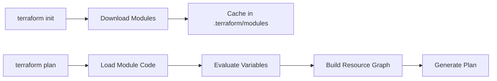

# How to Use Terraform Modules Effectively

Author: [nawazdhandala](https://www.github.com/nawazdhandala)

Tags: Terraform, Infrastructure as Code, DevOps, Modules, IaC Best Practices, Cloud Infrastructure

Description: A practical guide to using Terraform modules effectively, covering module consumption patterns, input/output design, versioning strategies, debugging techniques, and common pitfalls to avoid.

---

Terraform modules are the building blocks of scalable infrastructure code. While creating modules is straightforward, using them effectively requires understanding patterns that keep your infrastructure maintainable, debuggable, and secure. This guide focuses on the consumer side - how to use modules well, whether they come from the Terraform Registry, your organization's internal registry, or Git repositories.

## Understanding Module Sources

Before diving into patterns, let's clarify where modules can come from and how to reference them properly.

```hcl
# Local module - relative path from current directory
module "vpc" {
  source = "./modules/vpc"
}

# Terraform Registry - the most common source for public modules
module "vpc" {
  source  = "terraform-aws-modules/vpc/aws"
  version = "5.4.0"  # Always pin versions
}

# Git repository with specific tag
module "internal_vpc" {
  source = "git::https://github.com/company/terraform-modules.git//vpc?ref=v2.1.0"
}

# Git repository with SSH (for private repos)
module "private_module" {
  source = "git::ssh://git@github.com/company/terraform-modules.git//networking?ref=v1.0.0"
}

# S3 bucket for internal distribution
module "s3_module" {
  source = "s3::https://s3-us-west-2.amazonaws.com/my-bucket/modules/vpc.zip"
}
```

The double slash (`//`) in Git sources separates the repository URL from the subdirectory path within the repo.

## Module Workflow

Understanding how Terraform processes modules helps you use them more effectively.



When you run `terraform init`, modules are downloaded and cached in the `.terraform/modules` directory. This directory should be in your `.gitignore` since it can be regenerated.

## Passing Variables to Modules

Variables are your interface to modules. Here's how to pass them effectively.

### Basic Variable Passing

```hcl
# Using literal values
module "web_server" {
  source = "terraform-aws-modules/ec2-instance/aws"
  version = "5.5.0"

  name          = "web-server"
  instance_type = "t3.medium"
  ami           = "ami-0c55b159cbfafe1f0"

  # List of subnet IDs
  subnet_id = "subnet-12345678"

  # Map for tags
  tags = {
    Environment = "production"
    Team        = "platform"
  }
}
```

### Using Variables and Locals

```hcl
# variables.tf
variable "environment" {
  description = "Deployment environment"
  type        = string
}

variable "vpc_cidr" {
  description = "VPC CIDR block"
  type        = string
  default     = "10.0.0.0/16"
}

# locals.tf - compute derived values
locals {
  # Common tags applied to all resources
  common_tags = {
    Environment = var.environment
    ManagedBy   = "terraform"
    Project     = "myapp"
  }

  # Calculate subnet CIDRs from VPC CIDR
  public_subnets  = [for i in range(3) : cidrsubnet(var.vpc_cidr, 8, i)]
  private_subnets = [for i in range(3) : cidrsubnet(var.vpc_cidr, 8, i + 10)]
}

# main.tf - pass computed values to module
module "vpc" {
  source  = "terraform-aws-modules/vpc/aws"
  version = "5.4.0"

  name = "${var.environment}-vpc"
  cidr = var.vpc_cidr

  azs             = ["us-east-1a", "us-east-1b", "us-east-1c"]
  private_subnets = local.private_subnets
  public_subnets  = local.public_subnets

  # Merge common tags with module-specific tags
  tags = merge(local.common_tags, {
    Component = "networking"
  })
}
```

### Conditional Module Features

Many modules have optional features controlled by boolean variables:

```hcl
module "vpc" {
  source  = "terraform-aws-modules/vpc/aws"
  version = "5.4.0"

  name = "production-vpc"
  cidr = "10.0.0.0/16"

  # Enable NAT Gateway for private subnet internet access
  enable_nat_gateway     = true
  single_nat_gateway     = var.environment == "dev" ? true : false  # Save costs in dev
  one_nat_gateway_per_az = var.environment == "prod" ? true : false # HA in prod

  # Enable VPN Gateway only in production
  enable_vpn_gateway = var.environment == "prod"

  # DNS settings
  enable_dns_hostnames = true
  enable_dns_support   = true
}
```

## Working with Module Outputs

Module outputs let you chain modules together and export values for other configurations.

### Basic Output Usage

```hcl
# Get VPC ID from the vpc module
resource "aws_security_group" "web" {
  name   = "web-sg"
  vpc_id = module.vpc.vpc_id  # Reference module output

  ingress {
    from_port   = 443
    to_port     = 443
    protocol    = "tcp"
    cidr_blocks = ["0.0.0.0/0"]
  }
}
```

### Chaining Modules

```hcl
# Networking module creates VPC and subnets
module "networking" {
  source  = "terraform-aws-modules/vpc/aws"
  version = "5.4.0"

  name = "app-vpc"
  cidr = "10.0.0.0/16"

  azs             = ["us-east-1a", "us-east-1b"]
  private_subnets = ["10.0.1.0/24", "10.0.2.0/24"]
  public_subnets  = ["10.0.101.0/24", "10.0.102.0/24"]
}

# EKS module consumes networking outputs
module "eks" {
  source  = "terraform-aws-modules/eks/aws"
  version = "19.21.0"

  cluster_name    = "my-cluster"
  cluster_version = "1.28"

  # Use outputs from networking module
  vpc_id     = module.networking.vpc_id
  subnet_ids = module.networking.private_subnets

  # Node groups need the VPC security group
  cluster_additional_security_group_ids = [module.networking.default_security_group_id]
}

# RDS module also uses networking outputs
module "database" {
  source  = "terraform-aws-modules/rds/aws"
  version = "6.3.0"

  identifier = "myapp-db"

  engine         = "postgres"
  engine_version = "15.4"
  instance_class = "db.t3.medium"

  # Place in private subnets from networking module
  db_subnet_group_name   = module.networking.database_subnet_group_name
  vpc_security_group_ids = [aws_security_group.database.id]
}
```

### Exporting Module Outputs

```hcl
# outputs.tf - expose values for other configurations or CI/CD
output "vpc_id" {
  description = "ID of the created VPC"
  value       = module.networking.vpc_id
}

output "eks_cluster_endpoint" {
  description = "Endpoint for the EKS cluster API server"
  value       = module.eks.cluster_endpoint
  sensitive   = false
}

output "database_endpoint" {
  description = "Database connection endpoint"
  value       = module.database.db_instance_endpoint
  sensitive   = true  # Hide in logs
}
```

## Version Pinning Strategies

Always pin module versions. Unpinned modules can break your infrastructure without warning.

```hcl
# Exact version - most predictable
module "vpc" {
  source  = "terraform-aws-modules/vpc/aws"
  version = "5.4.0"
}

# Pessimistic constraint - allows patch updates only
module "vpc" {
  source  = "terraform-aws-modules/vpc/aws"
  version = "~> 5.4.0"  # Allows 5.4.x but not 5.5.0
}

# Range constraint - flexible but riskier
module "vpc" {
  source  = "terraform-aws-modules/vpc/aws"
  version = ">= 5.0.0, < 6.0.0"  # Any 5.x version
}
```

For production environments, use exact versions. For development, pessimistic constraints work well.

## Handling Module Updates

Updating modules requires care. Here's a safe process:

```bash
# 1. Check current module version
terraform version

# 2. Review changelog for breaking changes
# Visit the module's GitHub releases page

# 3. Update version in your configuration
# Edit the version constraint in your .tf file

# 4. Re-initialize to download new version
terraform init -upgrade

# 5. Generate and review plan
terraform plan -out=update.plan

# 6. Apply only after careful review
terraform apply update.plan
```

When updating across major versions, read the migration guide. Major versions often have breaking changes.

## Debugging Module Issues

When modules don't behave as expected, use these techniques.

### Inspect Module Outputs

```bash
# Show all outputs from a specific module
terraform output -json | jq '.module_name'

# Show specific output
terraform output vpc_id
```

### View Module State

```bash
# List all resources including those in modules
terraform state list

# Show details of a resource inside a module
terraform state show 'module.vpc.aws_vpc.this[0]'
```

### Enable Debug Logging

```bash
# See detailed provider and module operations
TF_LOG=DEBUG terraform plan

# Log to file for analysis
TF_LOG=DEBUG TF_LOG_PATH=./debug.log terraform plan
```

### Common Module Errors

**Error: Module not found**
```bash
# Solution: Re-initialize
terraform init
```

**Error: Unsupported attribute**
```hcl
# The module might have renamed or removed an output
# Check the module's outputs.tf or documentation

# Wrong - output was renamed
vpc_id = module.networking.vpc_id

# Correct - new output name
vpc_id = module.networking.this_vpc_id
```

**Error: Invalid count argument**
```hcl
# Modules can use count for conditional creation
module "optional_feature" {
  source = "./modules/feature"
  count  = var.enable_feature ? 1 : 0

  # configuration...
}

# Access with index when count is used
output "feature_id" {
  value = var.enable_feature ? module.optional_feature[0].id : null
}
```

## Module Composition Patterns

### Wrapper Modules

Create thin wrapper modules to standardize usage across your organization:

```hcl
# modules/company-vpc/main.tf
# Wraps the public module with company standards

module "vpc" {
  source  = "terraform-aws-modules/vpc/aws"
  version = "5.4.0"

  name = var.name
  cidr = var.cidr

  azs             = var.availability_zones
  private_subnets = var.private_subnets
  public_subnets  = var.public_subnets

  # Company-mandated settings
  enable_dns_hostnames = true
  enable_dns_support   = true

  # Enforce flow logs for compliance
  enable_flow_log                      = true
  create_flow_log_cloudwatch_log_group = true
  create_flow_log_cloudwatch_iam_role  = true

  # Standard tagging
  tags = merge(var.tags, {
    ManagedBy    = "terraform"
    CostCenter   = var.cost_center
    SecurityZone = "internal"
  })
}

# Expose only the outputs teams need
output "vpc_id" {
  value = module.vpc.vpc_id
}

output "private_subnet_ids" {
  value = module.vpc.private_subnets
}
```

### Module Factories

For creating multiple similar resources:

```hcl
# Create multiple S3 buckets with consistent configuration
variable "buckets" {
  description = "Map of bucket configurations"
  type = map(object({
    versioning = bool
    lifecycle_days = number
  }))
  default = {
    logs = {
      versioning = false
      lifecycle_days = 90
    }
    artifacts = {
      versioning = true
      lifecycle_days = 365
    }
    backups = {
      versioning = true
      lifecycle_days = 2555  # 7 years for compliance
    }
  }
}

module "s3_buckets" {
  source   = "terraform-aws-modules/s3-bucket/aws"
  version  = "3.15.1"
  for_each = var.buckets

  bucket = "${var.environment}-${each.key}-${random_id.suffix.hex}"

  versioning = {
    enabled = each.value.versioning
  }

  lifecycle_rule = [
    {
      id      = "expire-old-objects"
      enabled = true
      expiration = {
        days = each.value.lifecycle_days
      }
    }
  ]

  # Block all public access - company policy
  block_public_acls       = true
  block_public_policy     = true
  ignore_public_acls      = true
  restrict_public_buckets = true
}
```

## State Considerations with Modules

### Moving Resources Between Modules

When refactoring, you might need to move resources:

```bash
# Move a resource from root to a module
terraform state mv 'aws_vpc.main' 'module.networking.aws_vpc.main'

# Move between modules
terraform state mv 'module.old.aws_instance.web' 'module.new.aws_instance.web'
```

### Importing Existing Resources into Modules

```bash
# Import existing infrastructure into a module
terraform import 'module.vpc.aws_vpc.this[0]' vpc-12345678
```

### Module State Isolation

For large infrastructures, consider splitting state by module:

```hcl
# networking/main.tf - separate state file
terraform {
  backend "s3" {
    bucket = "terraform-state"
    key    = "networking/terraform.tfstate"
    region = "us-east-1"
  }
}

module "vpc" {
  source  = "terraform-aws-modules/vpc/aws"
  version = "5.4.0"
  # ...
}
```

```hcl
# compute/main.tf - separate state, references networking via data source
terraform {
  backend "s3" {
    bucket = "terraform-state"
    key    = "compute/terraform.tfstate"
    region = "us-east-1"
  }
}

# Read networking outputs from remote state
data "terraform_remote_state" "networking" {
  backend = "s3"
  config = {
    bucket = "terraform-state"
    key    = "networking/terraform.tfstate"
    region = "us-east-1"
  }
}

module "eks" {
  source  = "terraform-aws-modules/eks/aws"
  version = "19.21.0"

  vpc_id     = data.terraform_remote_state.networking.outputs.vpc_id
  subnet_ids = data.terraform_remote_state.networking.outputs.private_subnets
  # ...
}
```

## Common Pitfalls and How to Avoid Them

### Pitfall 1: Not Reading Module Documentation

Every module has specific requirements and behaviors. Always read the README and examples.

```bash
# View module documentation from CLI
terraform providers schema -json | jq '.provider_schemas'
```

### Pitfall 2: Ignoring Module Deprecation Warnings

```hcl
# Terraform will warn about deprecated attributes
# Don't ignore these - plan for migration

# Deprecated
enable_classiclink = true

# New approach per module docs
# enable_classiclink removed in version 4.0
```

### Pitfall 3: Hardcoding Values That Should Be Variables

```hcl
# Bad - hardcoded values limit reusability
module "web" {
  source = "./modules/web"

  instance_type = "t3.medium"  # What about other environments?
  ami           = "ami-12345"  # AMIs are region-specific
}

# Good - parameterized
module "web" {
  source = "./modules/web"

  instance_type = var.web_instance_type
  ami           = data.aws_ami.latest.id
}
```

### Pitfall 4: Not Using terraform validate

```bash
# Always validate before plan
terraform validate

# Catches syntax errors and type mismatches without
# accessing the cloud provider
```

---

Using Terraform modules effectively comes down to treating them like well-designed APIs. Understand the interface (variables and outputs), pin versions for stability, and compose them thoughtfully. Start with official registry modules when available, wrap them with your organization's standards, and invest time in understanding their internals when debugging. The patterns here will help you build maintainable infrastructure that scales with your team.
