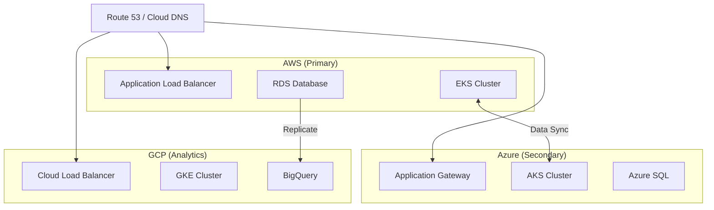

# How to Deploy Multi-Cloud Infrastructure with Terraform

Author: [nawazdhandala](https://www.github.com/nawazdhandala)

Tags: Terraform, Multi-Cloud, AWS, Azure, GCP, Infrastructure as Code, DevOps

Description: Learn how to manage infrastructure across AWS, Azure, and GCP with a single Terraform configuration. Covers provider configuration, cross-cloud networking, and abstraction patterns.

---

Multi-cloud strategies reduce vendor lock-in and improve resilience. Terraform's provider model makes it possible to manage AWS, Azure, and GCP from a single configuration. This guide covers practical patterns for multi-cloud deployments.

## Why Multi-Cloud?

Organizations adopt multi-cloud for:
- **Vendor independence**: Avoid lock-in to a single provider
- **Best-of-breed services**: Use each cloud's strengths
- **Geographic reach**: Deploy where one provider lacks presence
- **Resilience**: Survive provider outages
- **Cost optimization**: Use spot pricing across providers

## Provider Configuration

Configure multiple providers in one Terraform configuration:

```hcl
# versions.tf

terraform {
  required_version = ">= 1.0"

  required_providers {
    aws = {
      source  = "hashicorp/aws"
      version = "~> 5.0"
    }
    azurerm = {
      source  = "hashicorp/azurerm"
      version = "~> 3.0"
    }
    google = {
      source  = "hashicorp/google"
      version = "~> 5.0"
    }
  }
}

# AWS Provider
provider "aws" {
  region = var.aws_region

  default_tags {
    tags = {
      Project   = var.project_name
      ManagedBy = "terraform"
    }
  }
}

# Azure Provider
provider "azurerm" {
  features {}

  subscription_id = var.azure_subscription_id
}

# Google Cloud Provider
provider "google" {
  project = var.gcp_project_id
  region  = var.gcp_region
}
```

## Variables Structure

```hcl
# variables.tf

variable "project_name" {
  description = "Name for the project across all clouds"
  type        = string
  default     = "multicloud-app"
}

# AWS Configuration
variable "aws_region" {
  description = "AWS region"
  type        = string
  default     = "us-east-1"
}

# Azure Configuration
variable "azure_subscription_id" {
  description = "Azure subscription ID"
  type        = string
}

variable "azure_location" {
  description = "Azure location"
  type        = string
  default     = "eastus"
}

# GCP Configuration
variable "gcp_project_id" {
  description = "GCP project ID"
  type        = string
}

variable "gcp_region" {
  description = "GCP region"
  type        = string
  default     = "us-central1"
}
```

## Multi-Cloud Architecture



## Networking Module Per Cloud

Create abstracted networking modules:

```hcl
# modules/aws-network/main.tf

resource "aws_vpc" "main" {
  cidr_block           = var.cidr_block
  enable_dns_hostnames = true
  enable_dns_support   = true

  tags = {
    Name = "${var.name}-vpc"
  }
}

resource "aws_subnet" "private" {
  count             = length(var.availability_zones)
  vpc_id            = aws_vpc.main.id
  cidr_block        = cidrsubnet(var.cidr_block, 4, count.index)
  availability_zone = var.availability_zones[count.index]

  tags = {
    Name = "${var.name}-private-${count.index + 1}"
    Type = "private"
  }
}

resource "aws_subnet" "public" {
  count                   = length(var.availability_zones)
  vpc_id                  = aws_vpc.main.id
  cidr_block              = cidrsubnet(var.cidr_block, 4, count.index + 4)
  availability_zone       = var.availability_zones[count.index]
  map_public_ip_on_launch = true

  tags = {
    Name = "${var.name}-public-${count.index + 1}"
    Type = "public"
  }
}
```

```hcl
# modules/azure-network/main.tf

resource "azurerm_resource_group" "main" {
  name     = "${var.name}-rg"
  location = var.location
}

resource "azurerm_virtual_network" "main" {
  name                = "${var.name}-vnet"
  resource_group_name = azurerm_resource_group.main.name
  location            = azurerm_resource_group.main.location
  address_space       = [var.cidr_block]
}

resource "azurerm_subnet" "private" {
  count                = var.subnet_count
  name                 = "${var.name}-private-${count.index + 1}"
  resource_group_name  = azurerm_resource_group.main.name
  virtual_network_name = azurerm_virtual_network.main.name
  address_prefixes     = [cidrsubnet(var.cidr_block, 4, count.index)]
}

resource "azurerm_subnet" "public" {
  count                = var.subnet_count
  name                 = "${var.name}-public-${count.index + 1}"
  resource_group_name  = azurerm_resource_group.main.name
  virtual_network_name = azurerm_virtual_network.main.name
  address_prefixes     = [cidrsubnet(var.cidr_block, 4, count.index + 4)]
}
```

```hcl
# modules/gcp-network/main.tf

resource "google_compute_network" "main" {
  name                    = "${var.name}-vpc"
  auto_create_subnetworks = false
}

resource "google_compute_subnetwork" "private" {
  count                    = var.subnet_count
  name                     = "${var.name}-private-${count.index + 1}"
  ip_cidr_range            = cidrsubnet(var.cidr_block, 4, count.index)
  region                   = var.region
  network                  = google_compute_network.main.id
  private_ip_google_access = true
}

resource "google_compute_subnetwork" "public" {
  count         = var.subnet_count
  name          = "${var.name}-public-${count.index + 1}"
  ip_cidr_range = cidrsubnet(var.cidr_block, 4, count.index + 4)
  region        = var.region
  network       = google_compute_network.main.id
}
```

## Using the Modules

```hcl
# main.tf

# AWS Network
module "aws_network" {
  source = "./modules/aws-network"

  name               = var.project_name
  cidr_block         = "10.0.0.0/16"
  availability_zones = ["us-east-1a", "us-east-1b", "us-east-1c"]
}

# Azure Network
module "azure_network" {
  source = "./modules/azure-network"

  name         = var.project_name
  location     = var.azure_location
  cidr_block   = "10.1.0.0/16"
  subnet_count = 3
}

# GCP Network
module "gcp_network" {
  source = "./modules/gcp-network"

  name         = var.project_name
  region       = var.gcp_region
  cidr_block   = "10.2.0.0/16"
  subnet_count = 3
}
```

## Cross-Cloud VPN Connectivity

Connect AWS and Azure with VPN:

```hcl
# cross-cloud-vpn.tf

# AWS Side
resource "aws_vpn_gateway" "to_azure" {
  vpc_id = module.aws_network.vpc_id

  tags = {
    Name = "vpn-to-azure"
  }
}

resource "aws_customer_gateway" "azure" {
  bgp_asn    = 65000
  ip_address = azurerm_public_ip.vpn.ip_address
  type       = "ipsec.1"

  tags = {
    Name = "azure-gateway"
  }
}

resource "aws_vpn_connection" "to_azure" {
  vpn_gateway_id      = aws_vpn_gateway.to_azure.id
  customer_gateway_id = aws_customer_gateway.azure.id
  type                = "ipsec.1"
  static_routes_only  = true

  tags = {
    Name = "vpn-to-azure"
  }
}

# Azure Side
resource "azurerm_public_ip" "vpn" {
  name                = "vpn-gateway-ip"
  location            = var.azure_location
  resource_group_name = module.azure_network.resource_group_name
  allocation_method   = "Static"
  sku                 = "Standard"
}

resource "azurerm_virtual_network_gateway" "main" {
  name                = "vpn-gateway"
  location            = var.azure_location
  resource_group_name = module.azure_network.resource_group_name
  type                = "Vpn"
  vpn_type            = "RouteBased"
  sku                 = "VpnGw1"

  ip_configuration {
    name                          = "gateway-config"
    public_ip_address_id          = azurerm_public_ip.vpn.id
    private_ip_address_allocation = "Dynamic"
    subnet_id                     = module.azure_network.gateway_subnet_id
  }
}

resource "azurerm_local_network_gateway" "aws" {
  name                = "aws-gateway"
  location            = var.azure_location
  resource_group_name = module.azure_network.resource_group_name
  gateway_address     = aws_vpn_connection.to_azure.tunnel1_address
  address_space       = ["10.0.0.0/16"]  # AWS VPC CIDR
}

resource "azurerm_virtual_network_gateway_connection" "to_aws" {
  name                       = "vpn-to-aws"
  location                   = var.azure_location
  resource_group_name        = module.azure_network.resource_group_name
  type                       = "IPsec"
  virtual_network_gateway_id = azurerm_virtual_network_gateway.main.id
  local_network_gateway_id   = azurerm_local_network_gateway.aws.id
  shared_key                 = aws_vpn_connection.to_azure.tunnel1_preshared_key
}
```

## Global Load Balancing

Use DNS for multi-cloud load balancing:

```hcl
# dns.tf

# Route 53 Health Checks
resource "aws_route53_health_check" "aws_endpoint" {
  fqdn              = module.aws_app.load_balancer_dns
  port              = 443
  type              = "HTTPS"
  resource_path     = "/health"
  failure_threshold = "3"
  request_interval  = "30"

  tags = {
    Name = "aws-health-check"
  }
}

resource "aws_route53_health_check" "azure_endpoint" {
  fqdn              = module.azure_app.load_balancer_dns
  port              = 443
  type              = "HTTPS"
  resource_path     = "/health"
  failure_threshold = "3"
  request_interval  = "30"

  tags = {
    Name = "azure-health-check"
  }
}

# Weighted routing across clouds
resource "aws_route53_record" "app_aws" {
  zone_id = var.route53_zone_id
  name    = "app.example.com"
  type    = "A"

  alias {
    name                   = module.aws_app.load_balancer_dns
    zone_id                = module.aws_app.load_balancer_zone_id
    evaluate_target_health = true
  }

  weighted_routing_policy {
    weight = 70  # 70% to AWS
  }

  set_identifier  = "aws"
  health_check_id = aws_route53_health_check.aws_endpoint.id
}

resource "aws_route53_record" "app_azure" {
  zone_id = var.route53_zone_id
  name    = "app.example.com"
  type    = "CNAME"
  ttl     = 60
  records = [module.azure_app.load_balancer_dns]

  weighted_routing_policy {
    weight = 30  # 30% to Azure
  }

  set_identifier  = "azure"
  health_check_id = aws_route53_health_check.azure_endpoint.id
}
```

## Provider Aliases

Use provider aliases for multiple regions:

```hcl
# Multi-region AWS
provider "aws" {
  alias  = "us_west"
  region = "us-west-2"
}

provider "aws" {
  alias  = "eu"
  region = "eu-west-1"
}

# Deploy to multiple regions
module "aws_us_east" {
  source = "./modules/aws-app"
  # Uses default AWS provider
}

module "aws_us_west" {
  source = "./modules/aws-app"
  providers = {
    aws = aws.us_west
  }
}

module "aws_eu" {
  source = "./modules/aws-app"
  providers = {
    aws = aws.eu
  }
}
```

## State Management for Multi-Cloud

Use separate state files per cloud or region:

```
terraform-state/
├── aws/
│   ├── us-east-1/terraform.tfstate
│   └── us-west-2/terraform.tfstate
├── azure/
│   └── eastus/terraform.tfstate
└── gcp/
    └── us-central1/terraform.tfstate
```

Or use workspaces:

```bash
terraform workspace new aws-us-east
terraform workspace new azure-eastus
terraform workspace new gcp-us-central
```

## Outputs for Cross-Cloud References

```hcl
# outputs.tf

output "aws_vpc_id" {
  description = "AWS VPC ID"
  value       = module.aws_network.vpc_id
}

output "azure_vnet_id" {
  description = "Azure Virtual Network ID"
  value       = module.azure_network.vnet_id
}

output "gcp_network_id" {
  description = "GCP Network ID"
  value       = module.gcp_network.network_id
}

output "aws_load_balancer" {
  description = "AWS Load Balancer DNS"
  value       = module.aws_app.load_balancer_dns
}

output "azure_load_balancer" {
  description = "Azure Load Balancer DNS"
  value       = module.azure_app.load_balancer_dns
}

output "gcp_load_balancer" {
  description = "GCP Load Balancer IP"
  value       = module.gcp_app.load_balancer_ip
}
```

## Best Practices

1. **Use consistent naming** across clouds
2. **Abstract common patterns** into modules
3. **Avoid cloud-specific features** when possible
4. **Use separate state files** per cloud
5. **Configure VPN/peering** for private connectivity
6. **Implement health checks** for failover
7. **Document cloud-specific decisions**
8. **Test failover scenarios** regularly

## Challenges and Solutions

| Challenge | Solution |
|-----------|----------|
| Different API semantics | Abstract with modules |
| Credential management | Use OIDC/workload identity |
| State complexity | Separate state per cloud |
| Network connectivity | VPN or dedicated interconnect |
| Cost tracking | Tagging and cost allocation |

---

Multi-cloud with Terraform requires thoughtful architecture, but the provider model makes it manageable. Start with a primary cloud and gradually add others as your needs grow. Use abstraction layers to keep configurations maintainable.
