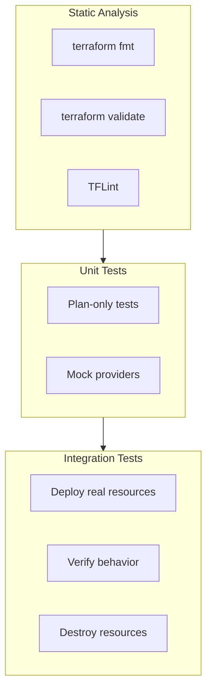

# How to Test Terraform with Terratest

Author: [nawazdhandala](https://www.github.com/nawazdhandala)

Tags: Terraform, Testing, Terratest, Infrastructure as Code, DevOps, Go

Description: Learn how to write automated tests for Terraform infrastructure using Terratest. Covers unit tests, integration tests, and best practices for testing infrastructure code.

---

Infrastructure code deserves the same testing rigor as application code. Terratest, a Go library from Gruntwork, makes it possible to write automated tests that deploy real infrastructure, validate it works, and tear it down.

## Why Test Infrastructure?

Without tests, you discover bugs when:
- Production breaks after a change
- New team members modify unfamiliar code
- Provider updates cause unexpected behavior
- Refactoring introduces regressions

Tests catch these issues before they reach production.

## Testing Approaches



## Setting Up Terratest

### Project Structure

```
terraform-modules/
├── modules/
│   └── vpc/
│       ├── main.tf
│       ├── variables.tf
│       └── outputs.tf
└── test/
    ├── go.mod
    ├── go.sum
    └── vpc_test.go
```

### Initialize Go Module

```bash
cd test
go mod init github.com/mycompany/terraform-modules/test
go get github.com/gruntwork-io/terratest/modules/terraform
go get github.com/stretchr/testify/assert
```

## Writing Your First Test

```go
// test/vpc_test.go

package test

import (
    "testing"

    "github.com/gruntwork-io/terratest/modules/terraform"
    "github.com/stretchr/testify/assert"
)

func TestVPCModule(t *testing.T) {
    // Run tests in parallel for speed
    t.Parallel()

    // Configure Terraform options
    terraformOptions := terraform.WithDefaultRetryableErrors(t, &terraform.Options{
        // Path to the Terraform module
        TerraformDir: "../modules/vpc",

        // Variables to pass to Terraform
        Vars: map[string]interface{}{
            "name":       "test-vpc",
            "cidr_block": "10.0.0.0/16",
            "environment": "test",
        },
    })

    // Clean up resources at the end of the test
    defer terraform.Destroy(t, terraformOptions)

    // Deploy the infrastructure
    terraform.InitAndApply(t, terraformOptions)

    // Get outputs
    vpcId := terraform.Output(t, terraformOptions, "vpc_id")
    vpcCidr := terraform.Output(t, terraformOptions, "vpc_cidr")

    // Validate outputs
    assert.NotEmpty(t, vpcId)
    assert.Equal(t, "10.0.0.0/16", vpcCidr)
}
```

### Run the Test

```bash
cd test
go test -v -timeout 30m
```

## Testing AWS Resources

### Test EC2 Instance

```go
// test/ec2_test.go

package test

import (
    "testing"
    "fmt"

    "github.com/gruntwork-io/terratest/modules/aws"
    "github.com/gruntwork-io/terratest/modules/terraform"
    "github.com/stretchr/testify/assert"
)

func TestEC2Instance(t *testing.T) {
    t.Parallel()

    awsRegion := "us-east-1"

    terraformOptions := terraform.WithDefaultRetryableErrors(t, &terraform.Options{
        TerraformDir: "../modules/ec2",
        Vars: map[string]interface{}{
            "instance_name": "test-instance",
            "instance_type": "t3.micro",
        },
        EnvVars: map[string]string{
            "AWS_DEFAULT_REGION": awsRegion,
        },
    })

    defer terraform.Destroy(t, terraformOptions)

    terraform.InitAndApply(t, terraformOptions)

    // Get instance ID from output
    instanceId := terraform.Output(t, terraformOptions, "instance_id")

    // Use AWS SDK to verify instance state
    instance := aws.GetInstanceByTag(t, awsRegion, "Name", "test-instance")
    assert.Equal(t, instanceId, instance.InstanceId)

    // Verify instance is running
    assert.Equal(t, "running", aws.GetInstanceState(t, awsRegion, instanceId))

    // Verify instance type
    assert.Equal(t, "t3.micro", instance.InstanceType)
}
```

### Test S3 Bucket

```go
// test/s3_test.go

package test

import (
    "testing"
    "strings"

    "github.com/gruntwork-io/terratest/modules/aws"
    "github.com/gruntwork-io/terratest/modules/random"
    "github.com/gruntwork-io/terratest/modules/terraform"
    "github.com/stretchr/testify/assert"
)

func TestS3Bucket(t *testing.T) {
    t.Parallel()

    awsRegion := "us-east-1"
    // Use random suffix to avoid naming conflicts
    uniqueId := strings.ToLower(random.UniqueId())
    bucketName := fmt.Sprintf("test-bucket-%s", uniqueId)

    terraformOptions := terraform.WithDefaultRetryableErrors(t, &terraform.Options{
        TerraformDir: "../modules/s3",
        Vars: map[string]interface{}{
            "bucket_name": bucketName,
            "versioning":  true,
        },
    })

    defer terraform.Destroy(t, terraformOptions)

    terraform.InitAndApply(t, terraformOptions)

    // Verify bucket exists
    aws.AssertS3BucketExists(t, awsRegion, bucketName)

    // Verify versioning is enabled
    versioning := aws.GetS3BucketVersioning(t, awsRegion, bucketName)
    assert.Equal(t, "Enabled", versioning)

    // Verify bucket policy
    bucketPolicy := aws.GetS3BucketPolicy(t, awsRegion, bucketName)
    assert.NotEmpty(t, bucketPolicy)
}
```

## Testing HTTP Endpoints

```go
// test/alb_test.go

package test

import (
    "testing"
    "time"
    "fmt"
    "crypto/tls"

    "github.com/gruntwork-io/terratest/modules/http-helper"
    "github.com/gruntwork-io/terratest/modules/terraform"
)

func TestALBEndpoint(t *testing.T) {
    t.Parallel()

    terraformOptions := terraform.WithDefaultRetryableErrors(t, &terraform.Options{
        TerraformDir: "../modules/alb-app",
        Vars: map[string]interface{}{
            "app_name": "test-app",
        },
    })

    defer terraform.Destroy(t, terraformOptions)

    terraform.InitAndApply(t, terraformOptions)

    // Get ALB DNS name
    albDns := terraform.Output(t, terraformOptions, "alb_dns_name")
    url := fmt.Sprintf("http://%s/health", albDns)

    // Configure TLS settings
    tlsConfig := &tls.Config{InsecureSkipVerify: true}

    // Retry for up to 5 minutes (ALB takes time to become healthy)
    maxRetries := 30
    sleepBetweenRetries := 10 * time.Second

    http_helper.HttpGetWithRetryWithCustomValidation(
        t,
        url,
        tlsConfig,
        maxRetries,
        sleepBetweenRetries,
        func(statusCode int, body string) bool {
            return statusCode == 200
        },
    )
}
```

## Testing SSH Connectivity

```go
// test/bastion_test.go

package test

import (
    "testing"
    "time"

    "github.com/gruntwork-io/terratest/modules/ssh"
    "github.com/gruntwork-io/terratest/modules/terraform"
    "github.com/stretchr/testify/assert"
)

func TestBastionSSH(t *testing.T) {
    t.Parallel()

    // Generate SSH key pair for testing
    keyPair := ssh.GenerateRSAKeyPair(t, 2048)

    terraformOptions := terraform.WithDefaultRetryableErrors(t, &terraform.Options{
        TerraformDir: "../modules/bastion",
        Vars: map[string]interface{}{
            "public_key": keyPair.PublicKey,
        },
    })

    defer terraform.Destroy(t, terraformOptions)

    terraform.InitAndApply(t, terraformOptions)

    // Get bastion IP
    bastionIp := terraform.Output(t, terraformOptions, "public_ip")

    // Configure SSH host
    host := ssh.Host{
        Hostname:    bastionIp,
        SshUserName: "ec2-user",
        SshKeyPair:  keyPair,
    }

    // Wait for SSH to become available
    maxRetries := 30
    sleepBetweenRetries := 10 * time.Second

    ssh.CheckSshConnectionWithRetry(t, host, maxRetries, sleepBetweenRetries)

    // Run command via SSH
    output := ssh.CheckSshCommand(t, host, "echo 'Hello from Terratest'")
    assert.Contains(t, output, "Hello from Terratest")
}
```

## Table-Driven Tests

Test multiple configurations efficiently:

```go
func TestMultipleConfigurations(t *testing.T) {
    t.Parallel()

    testCases := []struct {
        name          string
        instanceType  string
        instanceCount int
    }{
        {"Small", "t3.micro", 1},
        {"Medium", "t3.small", 2},
        {"Large", "t3.medium", 3},
    }

    for _, tc := range testCases {
        // Capture range variable
        tc := tc

        t.Run(tc.name, func(t *testing.T) {
            t.Parallel()

            terraformOptions := terraform.WithDefaultRetryableErrors(t, &terraform.Options{
                TerraformDir: "../modules/ec2-cluster",
                Vars: map[string]interface{}{
                    "instance_type":  tc.instanceType,
                    "instance_count": tc.instanceCount,
                    "name_prefix":    fmt.Sprintf("test-%s", tc.name),
                },
            })

            defer terraform.Destroy(t, terraformOptions)

            terraform.InitAndApply(t, terraformOptions)

            // Verify instance count
            instanceIds := terraform.OutputList(t, terraformOptions, "instance_ids")
            assert.Equal(t, tc.instanceCount, len(instanceIds))
        })
    }
}
```

## Test Stages

Break long tests into stages for debugging:

```go
func TestStagedDeployment(t *testing.T) {
    t.Parallel()

    terraformOptions := terraform.WithDefaultRetryableErrors(t, &terraform.Options{
        TerraformDir: "../modules/full-stack",
    })

    // Stage: Deploy infrastructure
    test_structure.RunTestStage(t, "deploy", func() {
        terraform.InitAndApply(t, terraformOptions)
    })

    // Stage: Validate infrastructure
    test_structure.RunTestStage(t, "validate", func() {
        validateInfrastructure(t, terraformOptions)
    })

    // Stage: Destroy infrastructure
    test_structure.RunTestStage(t, "destroy", func() {
        terraform.Destroy(t, terraformOptions)
    })
}

// Run specific stages
// SKIP_deploy=true go test -v     # Skip deploy, use existing
// SKIP_destroy=true go test -v   # Keep infrastructure after test
```

## Plan-Only Tests (No Deploy)

For faster feedback without deploying:

```go
func TestPlanOnly(t *testing.T) {
    t.Parallel()

    terraformOptions := &terraform.Options{
        TerraformDir: "../modules/vpc",
        Vars: map[string]interface{}{
            "name":       "test-vpc",
            "cidr_block": "10.0.0.0/16",
        },
    }

    // Initialize and plan only
    terraform.Init(t, terraformOptions)
    planOutput := terraform.Plan(t, terraformOptions)

    // Verify expected resources in plan
    assert.Contains(t, planOutput, "aws_vpc.main will be created")
    assert.Contains(t, planOutput, "aws_subnet.public will be created")
}
```

## Best Practices

### 1. Use Unique Names

```go
uniqueId := random.UniqueId()
resourceName := fmt.Sprintf("test-%s", uniqueId)
```

### 2. Set Timeouts

```bash
go test -v -timeout 60m
```

### 3. Run in Parallel

```go
func TestModule(t *testing.T) {
    t.Parallel()  // Add this to all tests
    // ...
}
```

### 4. Clean Up on Failure

```go
defer terraform.Destroy(t, terraformOptions)
```

### 5. Use Retries for Async Resources

```go
maxRetries := 30
sleepBetweenRetries := 10 * time.Second
```

### 6. Test in Isolated Accounts

Use separate AWS accounts for testing to avoid conflicts with production.

## CI/CD Integration

```yaml
# .github/workflows/terraform-test.yml

name: Terraform Tests

on:
  pull_request:
    paths:
      - 'modules/**'
      - 'test/**'

jobs:
  test:
    runs-on: ubuntu-latest

    steps:
      - uses: actions/checkout@v4

      - name: Setup Go
        uses: actions/setup-go@v4
        with:
          go-version: '1.21'

      - name: Setup Terraform
        uses: hashicorp/setup-terraform@v3

      - name: Configure AWS credentials
        uses: aws-actions/configure-aws-credentials@v4
        with:
          role-to-assume: ${{ secrets.AWS_TEST_ROLE }}
          aws-region: us-east-1

      - name: Run Tests
        working-directory: test
        run: go test -v -timeout 60m
```

---

Terratest brings software engineering testing practices to infrastructure. Start with simple output validation, then gradually add integration tests that verify real behavior. The investment in tests pays off through confidence in changes and fewer production surprises.
