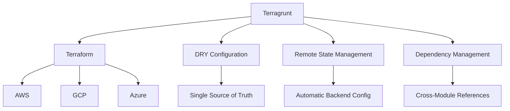
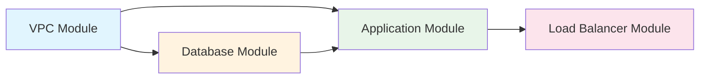
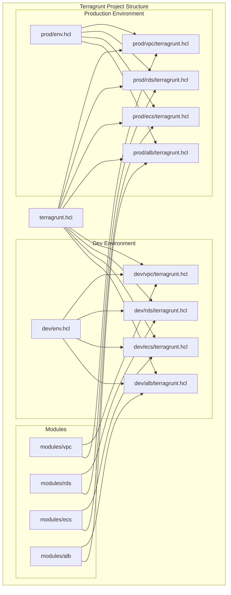

# How to Use Terragrunt for DRY Terraform

Author: [nawazdhandala](https://www.github.com/nawazdhandala)

Tags: Terraform, Terragrunt, Infrastructure as Code, DevOps, DRY, Cloud Infrastructure, Automation

Description: Learn how to eliminate code duplication in your Terraform projects using Terragrunt, with practical examples for managing multi-environment and multi-region deployments.

---

If you have ever managed Terraform configurations across multiple environments, you have probably experienced the pain of copying and pasting the same code over and over again. Staging looks like production, production looks like development, and when you need to make a change, you end up hunting through dozens of files. This is where Terragrunt comes in.

## What is Terragrunt?

Terragrunt is a thin wrapper around Terraform that provides extra tools for keeping your Terraform configurations DRY (Don't Repeat Yourself), working with multiple modules, and managing remote state. It was created by Gruntwork and has become a standard tool for teams managing complex infrastructure.



## The Problem: Terraform Code Duplication

Consider a typical multi-environment setup. Without Terragrunt, your project structure might look like this:

```
infrastructure/
├── dev/
│   ├── main.tf
│   ├── variables.tf
│   ├── outputs.tf
│   └── backend.tf
├── staging/
│   ├── main.tf         # 90% identical to dev
│   ├── variables.tf    # 90% identical to dev
│   ├── outputs.tf      # 90% identical to dev
│   └── backend.tf      # Different bucket name, same structure
└── production/
    ├── main.tf         # 90% identical to dev
    ├── variables.tf    # 90% identical to dev
    ├── outputs.tf      # 90% identical to dev
    └── backend.tf      # Different bucket name, same structure
```

The backend configuration in each environment is almost identical:

```hcl
# dev/backend.tf
terraform {
  backend "s3" {
    bucket         = "mycompany-terraform-state-dev"
    key            = "network/terraform.tfstate"
    region         = "us-east-1"
    encrypt        = true
    dynamodb_table = "terraform-locks-dev"
  }
}

# staging/backend.tf - same structure, different values
terraform {
  backend "s3" {
    bucket         = "mycompany-terraform-state-staging"
    key            = "network/terraform.tfstate"
    region         = "us-east-1"
    encrypt        = true
    dynamodb_table = "terraform-locks-staging"
  }
}

# production/backend.tf - same structure, different values
terraform {
  backend "s3" {
    bucket         = "mycompany-terraform-state-prod"
    key            = "network/terraform.tfstate"
    region         = "us-east-1"
    encrypt        = true
    dynamodb_table = "terraform-locks-prod"
  }
}
```

When you need to add a new variable or change a resource, you must update multiple files. This leads to configuration drift, missed updates, and inconsistencies between environments.

## The Solution: Terragrunt

Terragrunt solves this by allowing you to define configurations once and inherit them across environments. Here is how the same setup looks with Terragrunt:

```
infrastructure/
├── terragrunt.hcl                 # Root config with common settings
├── modules/
│   └── network/
│       ├── main.tf
│       ├── variables.tf
│       └── outputs.tf
├── dev/
│   ├── env.hcl                    # Environment-specific variables
│   └── network/
│       └── terragrunt.hcl         # Small config file
├── staging/
│   ├── env.hcl
│   └── network/
│       └── terragrunt.hcl
└── production/
    ├── env.hcl
    └── network/
        └── terragrunt.hcl
```

## Setting Up Terragrunt

### Installation

Install Terragrunt using your package manager:

```bash
# macOS with Homebrew
brew install terragrunt

# Linux with apt (Ubuntu/Debian)
# First, add the repository
curl -s https://apt.releases.hashicorp.com/gpg | sudo apt-key add -
sudo apt-get update && sudo apt-get install terragrunt

# Or download directly
wget https://github.com/gruntwork-io/terragrunt/releases/download/v0.55.0/terragrunt_linux_amd64
chmod +x terragrunt_linux_amd64
sudo mv terragrunt_linux_amd64 /usr/local/bin/terragrunt

# Verify installation
terragrunt --version
```

### Root Configuration

Create a root `terragrunt.hcl` file that defines common settings for all environments:

```hcl
# infrastructure/terragrunt.hcl

# Generate the backend configuration dynamically
# This eliminates the need for backend.tf files in each environment
remote_state {
  backend = "s3"

  # Generate the backend.tf file automatically
  generate = {
    path      = "backend.tf"
    if_exists = "overwrite_terragrunt"
  }

  config = {
    # Use path_relative_to_include() to create unique state paths
    # For dev/network, this becomes: dev/network/terraform.tfstate
    bucket         = "mycompany-terraform-state"
    key            = "${path_relative_to_include()}/terraform.tfstate"
    region         = "us-east-1"
    encrypt        = true
    dynamodb_table = "terraform-locks"

    # Skip prompts when creating the bucket
    skip_bucket_versioning = false
  }
}

# Generate provider configuration
# This ensures consistent provider versions across all environments
generate "provider" {
  path      = "provider.tf"
  if_exists = "overwrite_terragrunt"
  contents  = <<EOF
terraform {
  required_version = ">= 1.5.0"

  required_providers {
    aws = {
      source  = "hashicorp/aws"
      version = "~> 5.0"
    }
  }
}

provider "aws" {
  region = var.aws_region

  default_tags {
    tags = {
      ManagedBy   = "Terraform"
      Environment = var.environment
      Project     = var.project_name
    }
  }
}
EOF
}
```

### Environment Configuration

Each environment has its own `env.hcl` file with environment-specific values:

```hcl
# infrastructure/dev/env.hcl

locals {
  environment  = "dev"
  aws_region   = "us-east-1"
  project_name = "myapp"

  # Environment-specific sizing
  instance_type     = "t3.small"
  min_size          = 1
  max_size          = 2
  desired_capacity  = 1

  # Network configuration
  vpc_cidr          = "10.0.0.0/16"
  availability_zones = ["us-east-1a", "us-east-1b"]
}
```

```hcl
# infrastructure/production/env.hcl

locals {
  environment  = "production"
  aws_region   = "us-east-1"
  project_name = "myapp"

  # Production-grade sizing
  instance_type     = "t3.large"
  min_size          = 3
  max_size          = 10
  desired_capacity  = 5

  # Network configuration
  vpc_cidr          = "10.2.0.0/16"
  availability_zones = ["us-east-1a", "us-east-1b", "us-east-1c"]
}
```

### Module Configuration

Each module directory contains a minimal `terragrunt.hcl` that inherits from the root:

```hcl
# infrastructure/dev/network/terragrunt.hcl

# Include the root terragrunt.hcl configuration
# This pulls in remote_state and provider configuration
include "root" {
  path = find_in_parent_folders()
}

# Read environment-specific variables from env.hcl
locals {
  # Read and parse the env.hcl file from the parent directory
  env_vars = read_terragrunt_config(find_in_parent_folders("env.hcl"))

  # Extract commonly used variables
  environment = local.env_vars.locals.environment
  aws_region  = local.env_vars.locals.aws_region
}

# Specify the Terraform module to use
terraform {
  source = "${get_parent_terragrunt_dir()}/modules/network"
}

# Pass variables to the module
inputs = {
  environment        = local.environment
  aws_region         = local.aws_region
  project_name       = local.env_vars.locals.project_name
  vpc_cidr           = local.env_vars.locals.vpc_cidr
  availability_zones = local.env_vars.locals.availability_zones
}
```

## Managing Dependencies Between Modules

One of Terragrunt's most powerful features is dependency management. When one module depends on another, Terragrunt handles the orchestration automatically.



Here is how to set up dependencies:

```hcl
# infrastructure/dev/database/terragrunt.hcl

include "root" {
  path = find_in_parent_folders()
}

locals {
  env_vars = read_terragrunt_config(find_in_parent_folders("env.hcl"))
}

# Define dependency on the network module
# Terragrunt will apply network first, then database
dependency "network" {
  config_path = "../network"

  # Mock outputs for use during 'terragrunt plan' when network hasn't been applied
  # This allows planning without having to apply dependencies first
  mock_outputs = {
    vpc_id             = "vpc-mock"
    private_subnet_ids = ["subnet-mock-1", "subnet-mock-2"]
  }

  # Only use mocks when the dependency hasn't been applied
  mock_outputs_allowed_terraform_commands = ["validate", "plan"]
}

terraform {
  source = "${get_parent_terragrunt_dir()}/modules/database"
}

inputs = {
  environment        = local.env_vars.locals.environment
  aws_region         = local.env_vars.locals.aws_region
  project_name       = local.env_vars.locals.project_name

  # Reference outputs from the network module
  vpc_id             = dependency.network.outputs.vpc_id
  subnet_ids         = dependency.network.outputs.private_subnet_ids

  # Database-specific configuration
  instance_class     = local.env_vars.locals.environment == "production" ? "db.r6g.large" : "db.t3.medium"
  allocated_storage  = local.env_vars.locals.environment == "production" ? 100 : 20
}
```

## Running Terragrunt Commands

Terragrunt commands mirror Terraform commands but add extra functionality:

```bash
# Navigate to a specific module
cd infrastructure/dev/network

# Initialize and apply a single module
terragrunt init
terragrunt plan
terragrunt apply

# Apply all modules in an environment (respects dependencies)
cd infrastructure/dev
terragrunt run-all apply

# Plan across all modules
terragrunt run-all plan

# Destroy in reverse dependency order
terragrunt run-all destroy

# Show the dependency graph
terragrunt graph-dependencies
```

## Advanced Patterns

### Using Multiple Includes

Terragrunt allows multiple includes for layered configuration:

```hcl
# infrastructure/dev/network/terragrunt.hcl

# Include the root configuration
include "root" {
  path = find_in_parent_folders()
}

# Include a common module configuration
include "network_common" {
  path   = "${get_parent_terragrunt_dir()}/common/network.hcl"
  expose = true
}

locals {
  env_vars = read_terragrunt_config(find_in_parent_folders("env.hcl"))
}

terraform {
  source = "${get_parent_terragrunt_dir()}/modules/network"
}

# Merge common inputs with environment-specific ones
inputs = merge(
  include.network_common.inputs,
  {
    environment = local.env_vars.locals.environment
    vpc_cidr    = local.env_vars.locals.vpc_cidr
  }
)
```

### Hooks for Custom Actions

Run custom commands before or after Terraform actions:

```hcl
# infrastructure/production/database/terragrunt.hcl

include "root" {
  path = find_in_parent_folders()
}

terraform {
  source = "${get_parent_terragrunt_dir()}/modules/database"

  # Run before any Terraform command
  before_hook "validate_production" {
    commands = ["apply", "destroy"]
    execute  = ["bash", "-c", "echo 'WARNING: This is PRODUCTION!' && sleep 3"]
  }

  # Run after successful apply
  after_hook "notify_slack" {
    commands     = ["apply"]
    execute      = ["bash", "${get_parent_terragrunt_dir()}/scripts/notify-slack.sh"]
    run_on_error = false
  }

  # Run before destroy to create backup
  before_hook "backup_database" {
    commands = ["destroy"]
    execute  = ["bash", "${get_parent_terragrunt_dir()}/scripts/backup-db.sh"]
  }
}

inputs = {
  # ... inputs
}
```

### Multi-Region Deployments

For applications that span multiple regions:

```
infrastructure/
├── terragrunt.hcl
├── modules/
├── us-east-1/
│   ├── region.hcl
│   ├── dev/
│   │   ├── env.hcl
│   │   └── network/
│   └── production/
│       ├── env.hcl
│       └── network/
└── eu-west-1/
    ├── region.hcl
    ├── dev/
    │   ├── env.hcl
    │   └── network/
    └── production/
        ├── env.hcl
        └── network/
```

```hcl
# infrastructure/us-east-1/region.hcl
locals {
  aws_region = "us-east-1"
}

# infrastructure/eu-west-1/region.hcl
locals {
  aws_region = "eu-west-1"
}
```

```hcl
# infrastructure/us-east-1/dev/network/terragrunt.hcl

include "root" {
  path = find_in_parent_folders()
}

locals {
  # Read both region and environment configurations
  region_vars = read_terragrunt_config(find_in_parent_folders("region.hcl"))
  env_vars    = read_terragrunt_config(find_in_parent_folders("env.hcl"))
}

terraform {
  source = "${get_parent_terragrunt_dir()}/modules/network"
}

inputs = {
  aws_region  = local.region_vars.locals.aws_region
  environment = local.env_vars.locals.environment
  vpc_cidr    = local.env_vars.locals.vpc_cidr
}
```

## Complete Example: Three-Tier Application

Here is a complete example showing how all the pieces fit together:



### The VPC Module

```hcl
# modules/vpc/main.tf

variable "environment" {
  type        = string
  description = "Environment name (dev, staging, production)"
}

variable "project_name" {
  type        = string
  description = "Project name for resource naming"
}

variable "aws_region" {
  type        = string
  description = "AWS region"
}

variable "vpc_cidr" {
  type        = string
  description = "CIDR block for the VPC"
}

variable "availability_zones" {
  type        = list(string)
  description = "List of availability zones"
}

# Create VPC
resource "aws_vpc" "main" {
  cidr_block           = var.vpc_cidr
  enable_dns_hostnames = true
  enable_dns_support   = true

  tags = {
    Name = "${var.project_name}-${var.environment}-vpc"
  }
}

# Create public subnets for load balancers
resource "aws_subnet" "public" {
  count                   = length(var.availability_zones)
  vpc_id                  = aws_vpc.main.id
  cidr_block              = cidrsubnet(var.vpc_cidr, 4, count.index)
  availability_zone       = var.availability_zones[count.index]
  map_public_ip_on_launch = true

  tags = {
    Name = "${var.project_name}-${var.environment}-public-${count.index + 1}"
    Type = "public"
  }
}

# Create private subnets for applications
resource "aws_subnet" "private" {
  count             = length(var.availability_zones)
  vpc_id            = aws_vpc.main.id
  cidr_block        = cidrsubnet(var.vpc_cidr, 4, count.index + length(var.availability_zones))
  availability_zone = var.availability_zones[count.index]

  tags = {
    Name = "${var.project_name}-${var.environment}-private-${count.index + 1}"
    Type = "private"
  }
}

# Create database subnets
resource "aws_subnet" "database" {
  count             = length(var.availability_zones)
  vpc_id            = aws_vpc.main.id
  cidr_block        = cidrsubnet(var.vpc_cidr, 4, count.index + 2 * length(var.availability_zones))
  availability_zone = var.availability_zones[count.index]

  tags = {
    Name = "${var.project_name}-${var.environment}-database-${count.index + 1}"
    Type = "database"
  }
}

# Internet Gateway for public subnets
resource "aws_internet_gateway" "main" {
  vpc_id = aws_vpc.main.id

  tags = {
    Name = "${var.project_name}-${var.environment}-igw"
  }
}

# NAT Gateway for private subnets
resource "aws_eip" "nat" {
  count  = var.environment == "production" ? length(var.availability_zones) : 1
  domain = "vpc"

  tags = {
    Name = "${var.project_name}-${var.environment}-nat-eip-${count.index + 1}"
  }
}

resource "aws_nat_gateway" "main" {
  count         = var.environment == "production" ? length(var.availability_zones) : 1
  allocation_id = aws_eip.nat[count.index].id
  subnet_id     = aws_subnet.public[count.index].id

  tags = {
    Name = "${var.project_name}-${var.environment}-nat-${count.index + 1}"
  }

  depends_on = [aws_internet_gateway.main]
}

# Outputs for other modules to use
output "vpc_id" {
  value       = aws_vpc.main.id
  description = "The ID of the VPC"
}

output "public_subnet_ids" {
  value       = aws_subnet.public[*].id
  description = "List of public subnet IDs"
}

output "private_subnet_ids" {
  value       = aws_subnet.private[*].id
  description = "List of private subnet IDs"
}

output "database_subnet_ids" {
  value       = aws_subnet.database[*].id
  description = "List of database subnet IDs"
}
```

### The ECS Module Terragrunt Configuration

```hcl
# dev/ecs/terragrunt.hcl

include "root" {
  path = find_in_parent_folders()
}

locals {
  env_vars = read_terragrunt_config(find_in_parent_folders("env.hcl"))
}

# Define all dependencies
dependency "vpc" {
  config_path = "../vpc"

  mock_outputs = {
    vpc_id             = "vpc-mock"
    private_subnet_ids = ["subnet-mock-1", "subnet-mock-2"]
    public_subnet_ids  = ["subnet-mock-3", "subnet-mock-4"]
  }
  mock_outputs_allowed_terraform_commands = ["validate", "plan"]
}

dependency "rds" {
  config_path = "../rds"

  mock_outputs = {
    db_endpoint        = "mock-db.cluster.us-east-1.rds.amazonaws.com"
    db_port            = 5432
    db_security_group_id = "sg-mock"
  }
  mock_outputs_allowed_terraform_commands = ["validate", "plan"]
}

dependency "alb" {
  config_path = "../alb"

  mock_outputs = {
    target_group_arn  = "arn:aws:elasticloadbalancing:us-east-1:123456789:targetgroup/mock/mock"
    security_group_id = "sg-mock-alb"
  }
  mock_outputs_allowed_terraform_commands = ["validate", "plan"]
}

terraform {
  source = "${get_parent_terragrunt_dir()}/modules/ecs"
}

inputs = {
  environment  = local.env_vars.locals.environment
  aws_region   = local.env_vars.locals.aws_region
  project_name = local.env_vars.locals.project_name

  # From VPC module
  vpc_id     = dependency.vpc.outputs.vpc_id
  subnet_ids = dependency.vpc.outputs.private_subnet_ids

  # From RDS module
  database_endpoint          = dependency.rds.outputs.db_endpoint
  database_port              = dependency.rds.outputs.db_port
  database_security_group_id = dependency.rds.outputs.db_security_group_id

  # From ALB module
  target_group_arn      = dependency.alb.outputs.target_group_arn
  alb_security_group_id = dependency.alb.outputs.security_group_id

  # Environment-specific configuration
  desired_count  = local.env_vars.locals.desired_capacity
  cpu            = local.env_vars.locals.environment == "production" ? 1024 : 256
  memory         = local.env_vars.locals.environment == "production" ? 2048 : 512
  container_port = 8080
}
```

## Best Practices

### 1. Keep Modules Generic

Your Terraform modules should be environment-agnostic. All environment-specific values should come from Terragrunt inputs:

```hcl
# Good: Module accepts variables
variable "instance_type" {
  type = string
}

# Bad: Module has hardcoded values
resource "aws_instance" "example" {
  instance_type = "t3.large"  # Don't do this
}
```

### 2. Use Consistent Naming

Establish a naming convention and stick to it:

```hcl
# infrastructure/terragrunt.hcl

locals {
  # Standard naming convention
  name_prefix = "${local.project_name}-${local.environment}"
}
```

### 3. Version Your Modules

When using remote modules, always pin versions:

```hcl
terraform {
  source = "git::git@github.com:myorg/terraform-modules.git//vpc?ref=v1.2.3"
}
```

### 4. Use Workspaces Sparingly

Terragrunt's directory-based approach is generally preferred over Terraform workspaces for managing environments. It provides better visibility and isolation.

### 5. Implement CI/CD Guards

Add validation in your CI/CD pipeline:

```yaml
# .github/workflows/terraform.yml
name: Terraform

on:
  pull_request:
    paths:
      - 'infrastructure/**'

jobs:
  validate:
    runs-on: ubuntu-latest
    steps:
      - uses: actions/checkout@v4

      - name: Setup Terraform
        uses: hashicorp/setup-terraform@v3
        with:
          terraform_version: 1.5.0

      - name: Setup Terragrunt
        run: |
          wget https://github.com/gruntwork-io/terragrunt/releases/download/v0.55.0/terragrunt_linux_amd64
          chmod +x terragrunt_linux_amd64
          sudo mv terragrunt_linux_amd64 /usr/local/bin/terragrunt

      - name: Validate All Modules
        run: |
          cd infrastructure
          terragrunt run-all validate

      - name: Plan Dev Environment
        run: |
          cd infrastructure/dev
          terragrunt run-all plan -out=tfplan
        env:
          AWS_ACCESS_KEY_ID: ${{ secrets.AWS_ACCESS_KEY_ID }}
          AWS_SECRET_ACCESS_KEY: ${{ secrets.AWS_SECRET_ACCESS_KEY }}
```

## Migrating from Plain Terraform

If you have an existing Terraform project, here is a step-by-step migration path:

1. **Start with state**: Move your backend configuration to Terragrunt first
2. **Extract modules**: Identify repeated patterns and create shared modules
3. **Create environment configs**: Set up the directory structure with env.hcl files
4. **Migrate incrementally**: Move one module at a time, testing at each step
5. **Update CI/CD**: Modify your pipelines to use Terragrunt commands

```bash
# Import existing state into Terragrunt-managed configuration
cd infrastructure/dev/network
terragrunt import aws_vpc.main vpc-12345678
```

## Conclusion

Terragrunt transforms how you manage Terraform configurations at scale. By eliminating duplication, managing dependencies, and providing a consistent structure, it reduces errors and speeds up infrastructure changes.

The key benefits:

- **Single source of truth**: Define configurations once, use everywhere
- **Automatic state management**: No more copy-pasting backend configurations
- **Dependency orchestration**: Apply modules in the correct order automatically
- **Environment consistency**: Ensure staging matches production in structure

Start small by wrapping your existing Terraform with Terragrunt's remote state management, then gradually adopt more features as your infrastructure grows.

---

*Want to monitor the infrastructure you deploy with Terragrunt? [OneUptime](https://oneuptime.com) provides comprehensive monitoring, alerting, and status pages for your cloud infrastructure. Check out our [Terraform provider](https://oneuptime.com/blog/post/2025-07-01-introducing-terraform-provider-for-oneuptime/view) for managing OneUptime resources as code.*
