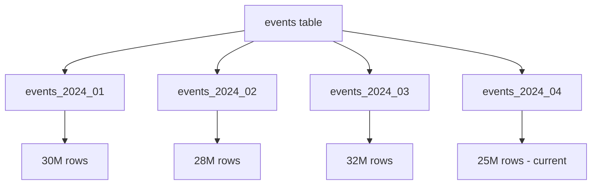

# How to Scale Tables with Time-Based Partitioning in PostgreSQL

Author: [nawazdhandala](https://www.github.com/nawazdhandala)

Tags: PostgreSQL, Partitioning, Time Series, Performance, Database Scaling, Data Management

Description: Learn how to implement time-based table partitioning in PostgreSQL to handle billions of rows efficiently. This guide covers partition creation, maintenance automation, query optimization, and data retention strategies.

---

> When a single table grows to hundreds of millions of rows, even indexed queries slow down and maintenance operations become painful. Table partitioning splits your data into smaller, manageable chunks. For time-series data like logs, events, and metrics, time-based partitioning is the most effective scaling strategy.

This guide shows you how to implement and maintain time-based partitioning in PostgreSQL.

---

## Why Partition by Time?

Time-based partitioning provides several benefits:

1. **Faster queries**: PostgreSQL only scans relevant partitions
2. **Efficient deletes**: Drop old partitions instead of DELETE
3. **Parallel maintenance**: VACUUM and REINDEX work on smaller chunks
4. **Better cache usage**: Hot data stays in memory



---

## Creating a Partitioned Table

### Step 1: Create the Parent Table

```sql
-- Parent table definition with partition key
CREATE TABLE events (
    id BIGSERIAL,
    event_type VARCHAR(50) NOT NULL,
    user_id INTEGER NOT NULL,
    payload JSONB,
    created_at TIMESTAMP NOT NULL DEFAULT NOW(),

    -- Primary key must include partition key
    PRIMARY KEY (created_at, id)
) PARTITION BY RANGE (created_at);

-- Create indexes on the parent (automatically applied to partitions)
CREATE INDEX idx_events_user ON events (user_id, created_at);
CREATE INDEX idx_events_type ON events (event_type, created_at);
```

### Step 2: Create Initial Partitions

```sql
-- Create monthly partitions for 2024
CREATE TABLE events_2024_01 PARTITION OF events
    FOR VALUES FROM ('2024-01-01') TO ('2024-02-01');

CREATE TABLE events_2024_02 PARTITION OF events
    FOR VALUES FROM ('2024-02-01') TO ('2024-03-01');

CREATE TABLE events_2024_03 PARTITION OF events
    FOR VALUES FROM ('2024-03-01') TO ('2024-04-01');

-- Continue for all needed months...

-- Create a default partition for unexpected data
CREATE TABLE events_default PARTITION OF events DEFAULT;
```

### Step 3: Verify Partition Structure

```sql
-- View partition hierarchy
SELECT
    parent.relname AS parent,
    child.relname AS partition,
    pg_get_expr(child.relpartbound, child.oid) AS bounds
FROM pg_inherits
JOIN pg_class parent ON pg_inherits.inhparent = parent.oid
JOIN pg_class child ON pg_inherits.inhrelid = child.oid
WHERE parent.relname = 'events';
```

---

## Automating Partition Management

### Create Partitions Automatically

```sql
-- Function to create monthly partitions
CREATE OR REPLACE FUNCTION create_monthly_partition(
    parent_table TEXT,
    partition_date DATE
)
RETURNS TEXT AS $$
DECLARE
    partition_name TEXT;
    start_date DATE;
    end_date DATE;
BEGIN
    -- Calculate partition boundaries
    start_date := DATE_TRUNC('month', partition_date);
    end_date := start_date + INTERVAL '1 month';

    -- Generate partition name
    partition_name := parent_table || '_' || TO_CHAR(start_date, 'YYYY_MM');

    -- Check if partition already exists
    IF EXISTS (
        SELECT 1 FROM pg_class WHERE relname = partition_name
    ) THEN
        RETURN 'Partition ' || partition_name || ' already exists';
    END IF;

    -- Create the partition
    EXECUTE format(
        'CREATE TABLE %I PARTITION OF %I FOR VALUES FROM (%L) TO (%L)',
        partition_name,
        parent_table,
        start_date,
        end_date
    );

    RETURN 'Created partition: ' || partition_name;
END;
$$ LANGUAGE plpgsql;

-- Create next 3 months of partitions
SELECT create_monthly_partition('events', CURRENT_DATE);
SELECT create_monthly_partition('events', CURRENT_DATE + INTERVAL '1 month');
SELECT create_monthly_partition('events', CURRENT_DATE + INTERVAL '2 months');
```

### Scheduled Partition Creation

```sql
-- Use pg_cron to create partitions automatically
-- First, enable pg_cron extension
CREATE EXTENSION IF NOT EXISTS pg_cron;

-- Schedule partition creation for the 1st of each month
SELECT cron.schedule(
    'create-event-partitions',
    '0 0 1 * *',  -- Run at midnight on the 1st
    $$SELECT create_monthly_partition('events', CURRENT_DATE + INTERVAL '2 months')$$
);

-- Verify scheduled jobs
SELECT * FROM cron.job;
```

---

## Data Retention with Partition Drops

### Dropping Old Partitions

```sql
-- Function to drop partitions older than retention period
CREATE OR REPLACE FUNCTION drop_old_partitions(
    parent_table TEXT,
    retention_months INTEGER
)
RETURNS SETOF TEXT AS $$
DECLARE
    partition_record RECORD;
    cutoff_date DATE;
    dropped_count INTEGER := 0;
BEGIN
    cutoff_date := DATE_TRUNC('month', CURRENT_DATE - (retention_months || ' months')::INTERVAL);

    FOR partition_record IN
        SELECT
            child.relname AS partition_name,
            pg_get_expr(child.relpartbound, child.oid) AS bounds
        FROM pg_inherits
        JOIN pg_class parent ON pg_inherits.inhparent = parent.oid
        JOIN pg_class child ON pg_inherits.inhrelid = child.oid
        WHERE parent.relname = parent_table
          AND child.relname != parent_table || '_default'
    LOOP
        -- Check if partition is older than cutoff
        IF partition_record.partition_name ~ '_[0-9]{4}_[0-9]{2}$' THEN
            DECLARE
                partition_date DATE;
            BEGIN
                partition_date := TO_DATE(
                    RIGHT(partition_record.partition_name, 7),
                    'YYYY_MM'
                );

                IF partition_date < cutoff_date THEN
                    EXECUTE format('DROP TABLE %I', partition_record.partition_name);
                    RETURN NEXT 'Dropped: ' || partition_record.partition_name;
                    dropped_count := dropped_count + 1;
                END IF;
            EXCEPTION WHEN OTHERS THEN
                RETURN NEXT 'Error parsing: ' || partition_record.partition_name;
            END;
        END IF;
    END LOOP;

    RETURN NEXT 'Total dropped: ' || dropped_count;
END;
$$ LANGUAGE plpgsql;

-- Keep only last 12 months
SELECT * FROM drop_old_partitions('events', 12);
```

### Scheduled Cleanup

```sql
-- Schedule monthly cleanup
SELECT cron.schedule(
    'cleanup-old-partitions',
    '0 2 1 * *',  -- Run at 2 AM on the 1st
    $$SELECT * FROM drop_old_partitions('events', 12)$$
);
```

---

## Query Optimization with Partitions

### Partition Pruning

PostgreSQL automatically skips irrelevant partitions when queries include the partition key:

```sql
-- This query only scans events_2024_03
EXPLAIN ANALYZE
SELECT * FROM events
WHERE created_at >= '2024-03-01'
  AND created_at < '2024-04-01';

-- Output shows:
-- Append
--   ->  Index Scan on events_2024_03
--       Index Cond: ((created_at >= '2024-03-01') AND (created_at < '2024-04-01'))
```

### Enabling Partition Pruning

```sql
-- Ensure partition pruning is enabled
SHOW enable_partition_pruning;  -- Should be 'on'

-- Enable if disabled
SET enable_partition_pruning = on;
```

### Writing Efficient Queries

```sql
-- Good: Includes partition key in WHERE clause
SELECT COUNT(*)
FROM events
WHERE created_at >= '2024-03-01' AND created_at < '2024-04-01'
  AND event_type = 'purchase';
-- Only scans one partition

-- Bad: No partition key constraint
SELECT COUNT(*)
FROM events
WHERE event_type = 'purchase';
-- Scans ALL partitions

-- Better: Add date range even if querying "all time"
SELECT COUNT(*)
FROM events
WHERE created_at >= '2023-01-01'  -- Add reasonable lower bound
  AND event_type = 'purchase';
```

### Parallel Query on Partitions

```sql
-- Enable parallel queries on partitions
SET parallel_tuple_cost = 0.01;
SET parallel_setup_cost = 100;
SET max_parallel_workers_per_gather = 4;

-- Query across multiple partitions in parallel
EXPLAIN ANALYZE
SELECT DATE_TRUNC('day', created_at) AS day, COUNT(*)
FROM events
WHERE created_at >= '2024-01-01' AND created_at < '2024-07-01'
GROUP BY DATE_TRUNC('day', created_at);

-- Shows: Parallel Append with multiple workers
```

---

## Migrating Existing Tables to Partitioned

### Step 1: Create New Partitioned Table

```sql
-- Rename existing table
ALTER TABLE events RENAME TO events_old;

-- Create new partitioned table
CREATE TABLE events (
    id BIGSERIAL,
    event_type VARCHAR(50) NOT NULL,
    user_id INTEGER NOT NULL,
    payload JSONB,
    created_at TIMESTAMP NOT NULL DEFAULT NOW(),
    PRIMARY KEY (created_at, id)
) PARTITION BY RANGE (created_at);

-- Create partitions covering existing data range
SELECT create_monthly_partition('events', d::DATE)
FROM generate_series('2023-01-01'::DATE, CURRENT_DATE, '1 month') d;

-- Create future partitions
SELECT create_monthly_partition('events', CURRENT_DATE + INTERVAL '1 month');
SELECT create_monthly_partition('events', CURRENT_DATE + INTERVAL '2 months');
```

### Step 2: Migrate Data

```sql
-- Copy data in batches to avoid long locks
DO $$
DECLARE
    batch_start TIMESTAMP;
    batch_end TIMESTAMP;
    batch_size INTERVAL := '1 day';
BEGIN
    batch_start := '2023-01-01';

    WHILE batch_start < CURRENT_DATE LOOP
        batch_end := batch_start + batch_size;

        INSERT INTO events (id, event_type, user_id, payload, created_at)
        SELECT id, event_type, user_id, payload, created_at
        FROM events_old
        WHERE created_at >= batch_start AND created_at < batch_end;

        RAISE NOTICE 'Migrated % to %', batch_start, batch_end;
        batch_start := batch_end;

        -- Brief pause to reduce load
        PERFORM pg_sleep(0.1);
    END LOOP;
END $$;

-- Verify row counts match
SELECT
    (SELECT COUNT(*) FROM events_old) AS old_count,
    (SELECT COUNT(*) FROM events) AS new_count;
```

### Step 3: Swap Tables

```sql
-- Final sync of any new data during migration
INSERT INTO events (id, event_type, user_id, payload, created_at)
SELECT id, event_type, user_id, payload, created_at
FROM events_old
WHERE created_at >= (SELECT MAX(created_at) FROM events);

-- Drop old table (when ready)
DROP TABLE events_old;
```

---

## Monitoring Partition Health

### Check Partition Sizes

```sql
-- View size of each partition
SELECT
    child.relname AS partition_name,
    pg_size_pretty(pg_relation_size(child.oid)) AS size,
    pg_size_pretty(pg_total_relation_size(child.oid)) AS total_size,
    (SELECT COUNT(*) FROM events WHERE created_at >=
        CASE WHEN child.relname ~ '_[0-9]{4}_[0-9]{2}$'
             THEN TO_DATE(RIGHT(child.relname, 7), 'YYYY_MM')
             ELSE '1970-01-01'::DATE
        END
        AND created_at <
        CASE WHEN child.relname ~ '_[0-9]{4}_[0-9]{2}$'
             THEN TO_DATE(RIGHT(child.relname, 7), 'YYYY_MM') + INTERVAL '1 month'
             ELSE '2100-01-01'::DATE
        END
    ) AS row_count
FROM pg_inherits
JOIN pg_class parent ON pg_inherits.inhparent = parent.oid
JOIN pg_class child ON pg_inherits.inhrelid = child.oid
WHERE parent.relname = 'events'
ORDER BY child.relname;
```

### Check for Default Partition Data

```sql
-- Data landing in default partition indicates missing partitions
SELECT COUNT(*) AS default_partition_rows
FROM events_default;

-- Find what dates are in default
SELECT
    DATE_TRUNC('month', created_at) AS month,
    COUNT(*) AS row_count
FROM events_default
GROUP BY DATE_TRUNC('month', created_at)
ORDER BY month;

-- Create missing partitions and move data
-- (Requires detaching default, creating partition, reattaching)
```

---

## Best Practices

### 1. Always Include Partition Key in Queries

```sql
-- Add date filters even for "all data" queries
SELECT * FROM events
WHERE created_at >= CURRENT_DATE - INTERVAL '30 days'
  AND user_id = 12345;
```

### 2. Create Partitions Ahead of Time

```sql
-- Always have at least 2-3 future partitions ready
-- Prevents inserts failing due to missing partitions
```

### 3. Size Partitions Appropriately

```sql
-- Monthly partitions work for most use cases
-- Weekly if you have very high volume
-- Yearly for low-volume historical data
```

### 4. Index the Parent Table

```sql
-- Indexes on parent automatically apply to all partitions
CREATE INDEX idx_events_user ON events (user_id, created_at);
-- Creates index on every partition
```

---

## Conclusion

Time-based partitioning is essential for scaling time-series data in PostgreSQL. Key takeaways:

1. Include the partition key in your primary key
2. Automate partition creation and cleanup
3. Always include date filters in queries for partition pruning
4. Monitor partition sizes and default partition content
5. Use DROP TABLE for data retention instead of DELETE

With proper partitioning, your PostgreSQL database can handle billions of rows while maintaining fast query performance.

---

*Need to monitor your partitioned tables? [OneUptime](https://oneuptime.com) provides database monitoring with partition health checks, size tracking, and performance analytics for PostgreSQL.*

**Related Reading:**
- [How to Tune PostgreSQL for High Write Throughput](https://oneuptime.com/blog/post/2026-01-27-high-write-throughput-postgresql/view)
- [How to Choose Between B-Tree, GIN, and BRIN Indexes in PostgreSQL](https://oneuptime.com/blog/post/2026-01-25-btree-gin-brin-indexes-postgresql/view)
