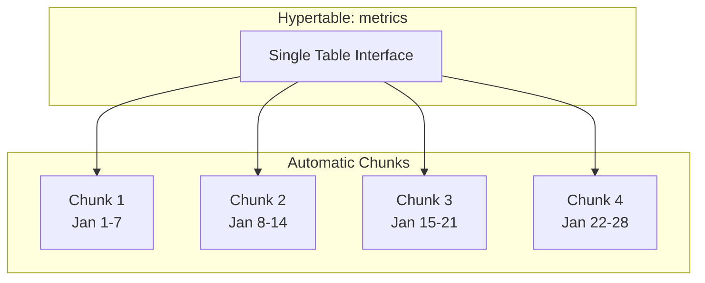
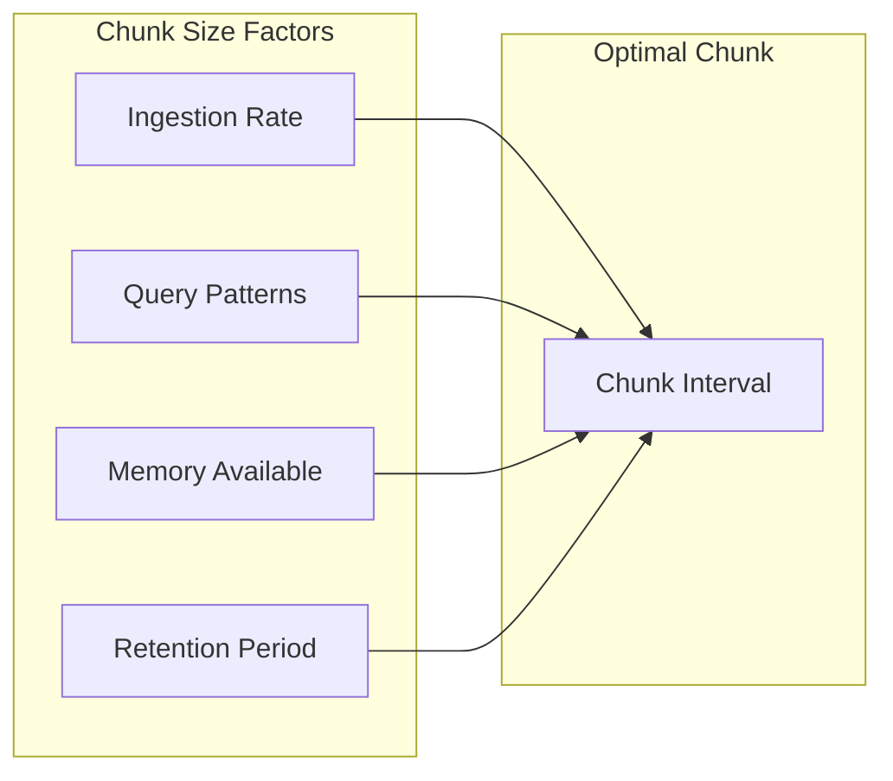
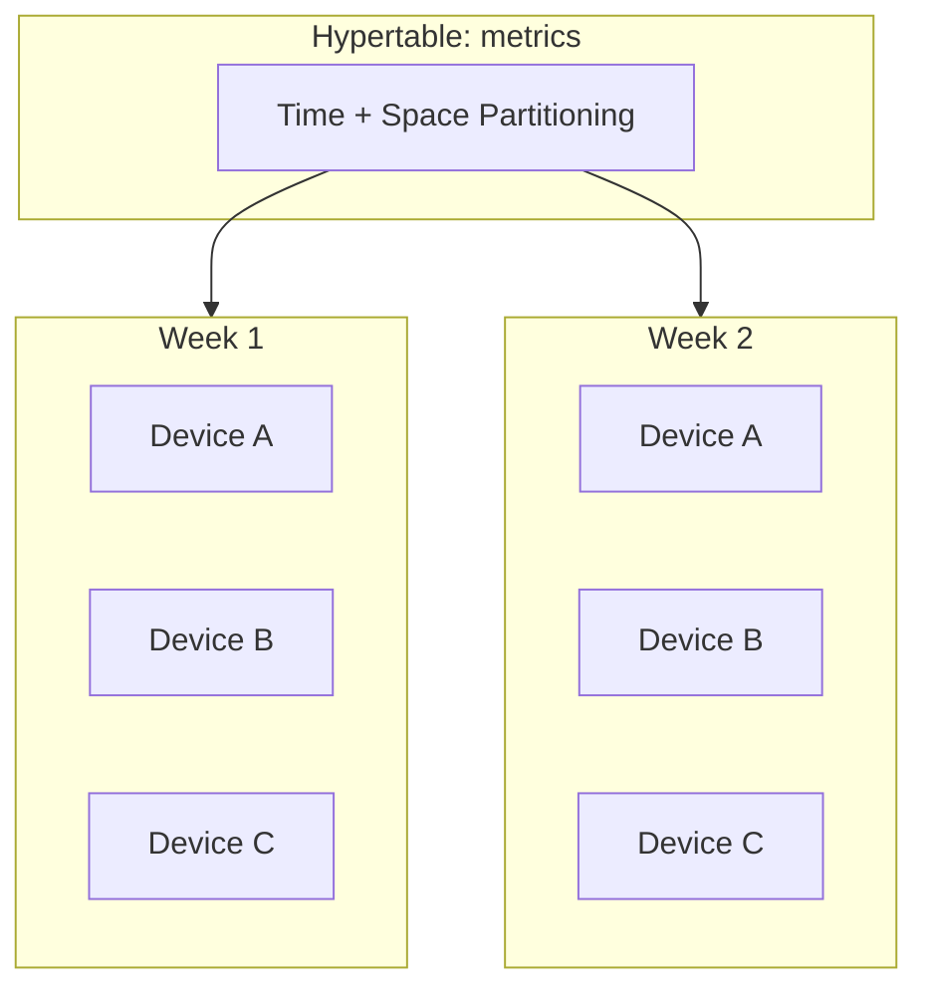
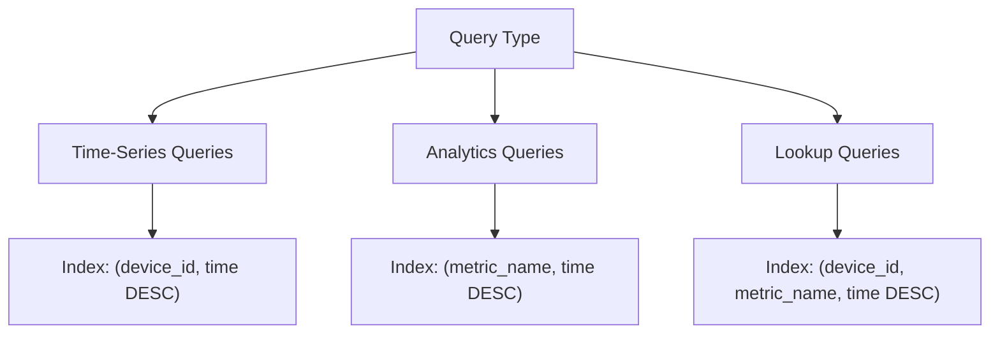
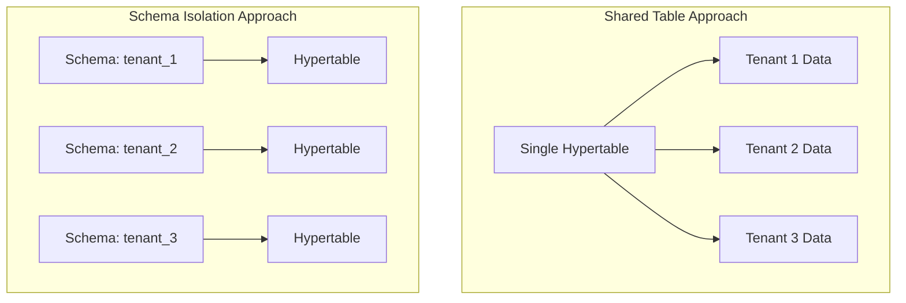
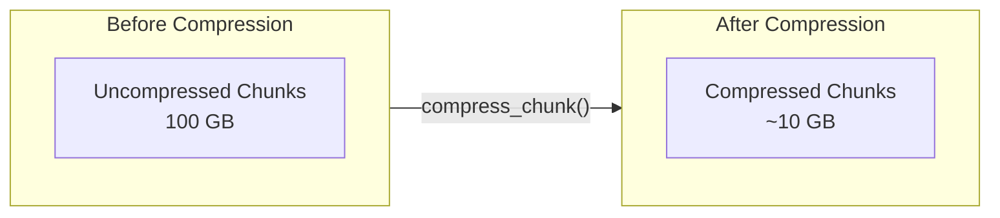
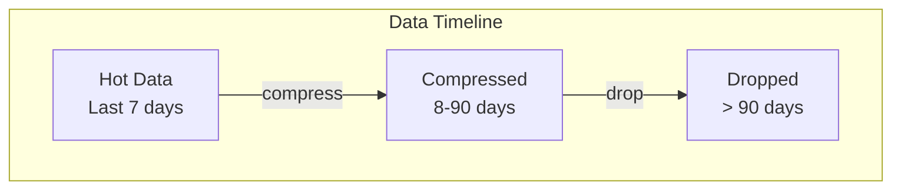
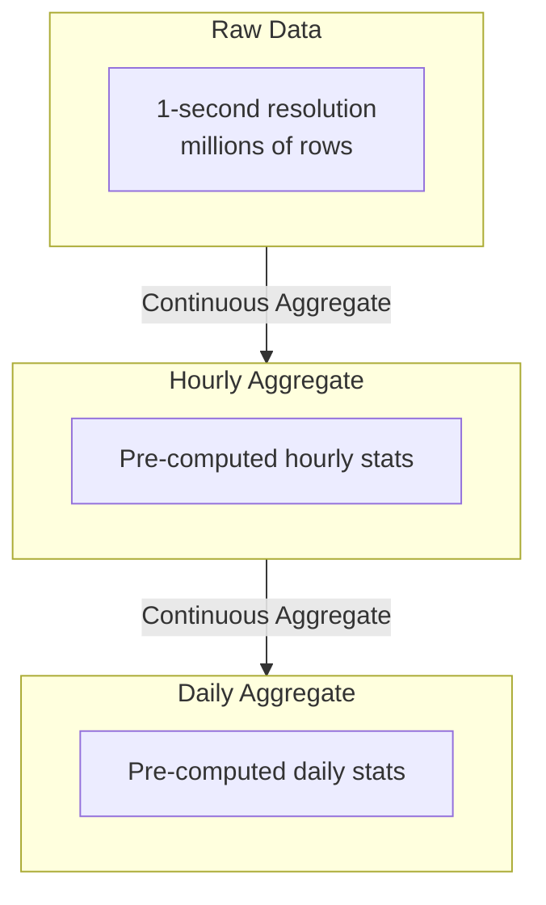

# How to Design TimescaleDB Hypertables

Author: [nawazdhandala](https://www.github.com/nawazdhandala)

Tags: TimescaleDB, Hypertables, Time-Series Database, PostgreSQL, Database Design, Data Partitioning, Performance Optimization

Description: A practical guide to designing TimescaleDB hypertables for optimal performance, covering partitioning strategies, chunk sizing, indexing, and real-world schema patterns.

---

> Hypertables are the foundation of TimescaleDB performance. Getting the design right from the start saves you from painful migrations later. This guide walks through the key decisions for building efficient time-series schemas.

Time-series data grows fast. Without proper partitioning, queries slow down and storage becomes unmanageable. Hypertables solve this by automatically splitting your data into chunks.

---

## What is a Hypertable?

A hypertable looks like a regular PostgreSQL table but automatically partitions data into smaller chunks based on time (and optionally space). This enables:

- Fast queries on recent data
- Efficient data retention policies
- Parallel query execution
- Easy data lifecycle management



---

## Creating Your First Hypertable

### Step 1: Create a Regular Table

Start with a standard PostgreSQL table definition. The table must include a time column that will be used for partitioning:

```sql
-- Create a metrics table for storing time-series data
-- This is a regular PostgreSQL table before conversion
CREATE TABLE metrics (
    -- Timestamp column is required for time-based partitioning
    time        TIMESTAMPTZ NOT NULL,
    -- Device identifier for filtering and potential space partitioning
    device_id   TEXT NOT NULL,
    -- Metric name allows storing multiple metric types in one table
    metric_name TEXT NOT NULL,
    -- The actual measurement value
    value       DOUBLE PRECISION NOT NULL,
    -- Optional metadata stored as JSON for flexibility
    metadata    JSONB DEFAULT '{}'
);
```

### Step 2: Convert to Hypertable

Use the `create_hypertable` function to convert the regular table into a hypertable:

```sql
-- Convert the metrics table to a hypertable
-- Parameters:
--   'metrics': the table name to convert
--   'time': the column used for time-based partitioning
SELECT create_hypertable('metrics', 'time');
```

This single command transforms your table into a hypertable with automatic time-based partitioning.

---

## Chunk Interval Selection

The chunk interval determines how much time each partition covers. This is one of the most important design decisions.

### Factors to Consider



### Guidelines for Chunk Intervals

| Data Volume | Recommended Interval | Chunk Size Target |
|-------------|---------------------|-------------------|
| < 1M rows/day | 1 week | ~10M rows |
| 1-10M rows/day | 1 day | ~10M rows |
| 10-100M rows/day | 6 hours | ~25M rows |
| > 100M rows/day | 1 hour | ~10M rows |

### Setting Custom Chunk Interval

```sql
-- Create hypertable with 1-day chunk interval
-- Use this for moderate ingestion rates (1-10M rows per day)
SELECT create_hypertable(
    'metrics',
    'time',
    chunk_time_interval => INTERVAL '1 day'
);

-- For high-volume ingestion (>100M rows/day), use smaller chunks
SELECT create_hypertable(
    'high_volume_metrics',
    'time',
    chunk_time_interval => INTERVAL '1 hour'
);

-- For low-volume data with long retention, use larger chunks
SELECT create_hypertable(
    'audit_logs',
    'time',
    chunk_time_interval => INTERVAL '1 week'
);
```

### Changing Chunk Interval on Existing Hypertables

You can change the chunk interval for future chunks without affecting existing data:

```sql
-- Change chunk interval for future data
-- Existing chunks remain unchanged
SELECT set_chunk_time_interval('metrics', INTERVAL '6 hours');

-- Verify the new setting
SELECT h.table_name,
       d.column_name,
       d.time_interval
FROM timescaledb_information.dimensions d
JOIN timescaledb_information.hypertables h
    ON d.hypertable_id = h.id
WHERE h.table_name = 'metrics';
```

---

## Space Partitioning

For very high cardinality data or distributed deployments, add a second partitioning dimension based on a space column.



### When to Use Space Partitioning

Use space partitioning when:

1. You have many devices/tenants (high cardinality)
2. Queries filter on specific devices/tenants
3. You want to distribute data across multiple disks
4. You're using TimescaleDB in a distributed setup

```sql
-- Create hypertable with both time and space partitioning
-- 'device_id' is the space partitioning column
-- 4 partitions divides data across 4 hash buckets
SELECT create_hypertable(
    'metrics',
    'time',
    partitioning_column => 'device_id',
    number_partitions => 4,
    chunk_time_interval => INTERVAL '1 day'
);
```

### Choosing the Number of Space Partitions

```sql
-- For single-node deployments:
-- Use number of CPU cores or disks, whichever is lower
-- Example: 4-core machine with 2 disks = 2 partitions
SELECT create_hypertable(
    'metrics',
    'time',
    partitioning_column => 'tenant_id',
    number_partitions => 2
);

-- For distributed TimescaleDB:
-- Match the number of data nodes
-- Example: 3 data nodes = 3 partitions
SELECT create_distributed_hypertable(
    'metrics',
    'time',
    partitioning_column => 'tenant_id',
    number_partitions => 3
);
```

---

## Index Design for Hypertables

Indexes on hypertables work differently than regular PostgreSQL tables. Each chunk gets its own copy of the index.

### Default Index Behavior

```sql
-- TimescaleDB automatically creates a time index
-- This is the default behavior when creating a hypertable
-- The index is: (time DESC)

-- View existing indexes on a hypertable
SELECT indexname, indexdef
FROM pg_indexes
WHERE tablename = 'metrics';
```

### Composite Indexes for Common Query Patterns

```sql
-- For queries that filter by device_id and time range
-- This index supports: WHERE device_id = 'X' AND time > Y
CREATE INDEX idx_metrics_device_time
    ON metrics (device_id, time DESC);

-- For queries that filter by metric name within a device
-- Supports: WHERE device_id = 'X' AND metric_name = 'Y' AND time > Z
CREATE INDEX idx_metrics_device_metric_time
    ON metrics (device_id, metric_name, time DESC);
```

### Index Recommendations by Query Pattern



```sql
-- Time-series queries: Get recent data for a device
-- Query: SELECT * FROM metrics WHERE device_id = ? ORDER BY time DESC LIMIT 100
CREATE INDEX idx_device_time ON metrics (device_id, time DESC);

-- Analytics queries: Aggregate by metric type over time
-- Query: SELECT metric_name, avg(value) FROM metrics WHERE time > ? GROUP BY metric_name
CREATE INDEX idx_metric_time ON metrics (metric_name, time DESC);

-- Lookup queries: Find specific metric for specific device
-- Query: SELECT * FROM metrics WHERE device_id = ? AND metric_name = ? AND time BETWEEN ? AND ?
CREATE INDEX idx_device_metric_time ON metrics (device_id, metric_name, time DESC);
```

---

## Schema Design Patterns

### Pattern 1: Wide Table (Single Metric Type)

Best for homogeneous data where all rows have the same structure:

```sql
-- Wide table pattern for CPU metrics
-- Each column represents a specific measurement
CREATE TABLE cpu_metrics (
    time        TIMESTAMPTZ NOT NULL,
    host_id     TEXT NOT NULL,
    -- CPU measurements as separate columns
    user_pct    DOUBLE PRECISION,
    system_pct  DOUBLE PRECISION,
    idle_pct    DOUBLE PRECISION,
    iowait_pct  DOUBLE PRECISION,
    -- Include metadata as columns
    cpu_count   INTEGER,
    PRIMARY KEY (host_id, time)
);

SELECT create_hypertable('cpu_metrics', 'time');

-- Query example: Get CPU usage for a host
SELECT time, user_pct, system_pct
FROM cpu_metrics
WHERE host_id = 'server-01'
  AND time > NOW() - INTERVAL '1 hour'
ORDER BY time DESC;
```

### Pattern 2: Narrow Table (Multiple Metric Types)

Best for heterogeneous data or when metric types change frequently:

```sql
-- Narrow table pattern for multiple metric types
-- More flexible but slightly less efficient for wide queries
CREATE TABLE metrics (
    time        TIMESTAMPTZ NOT NULL,
    host_id     TEXT NOT NULL,
    metric_name TEXT NOT NULL,
    value       DOUBLE PRECISION NOT NULL,
    -- Store additional dimensions as tags
    tags        JSONB DEFAULT '{}'
);

SELECT create_hypertable('metrics', 'time');

-- Create index for efficient filtering by metric name
CREATE INDEX idx_metrics_host_name_time
    ON metrics (host_id, metric_name, time DESC);

-- Query example: Get specific metric for a host
SELECT time, value
FROM metrics
WHERE host_id = 'server-01'
  AND metric_name = 'cpu.user_pct'
  AND time > NOW() - INTERVAL '1 hour'
ORDER BY time DESC;
```

### Pattern 3: Hybrid Approach

Combine wide tables for common metrics with a narrow table for custom metrics:

```sql
-- Core metrics with fixed schema (wide table)
CREATE TABLE system_metrics (
    time        TIMESTAMPTZ NOT NULL,
    host_id     TEXT NOT NULL,
    cpu_pct     DOUBLE PRECISION,
    memory_pct  DOUBLE PRECISION,
    disk_pct    DOUBLE PRECISION,
    PRIMARY KEY (host_id, time)
);

-- Custom metrics with flexible schema (narrow table)
CREATE TABLE custom_metrics (
    time        TIMESTAMPTZ NOT NULL,
    host_id     TEXT NOT NULL,
    metric_name TEXT NOT NULL,
    value       DOUBLE PRECISION NOT NULL
);

SELECT create_hypertable('system_metrics', 'time');
SELECT create_hypertable('custom_metrics', 'time');
```

---

## Multi-Tenant Hypertable Design

When building multi-tenant applications, consider these patterns:



### Shared Table with Tenant Column

```sql
-- Shared hypertable with tenant isolation via column
CREATE TABLE tenant_metrics (
    time        TIMESTAMPTZ NOT NULL,
    tenant_id   TEXT NOT NULL,
    device_id   TEXT NOT NULL,
    metric_name TEXT NOT NULL,
    value       DOUBLE PRECISION NOT NULL
);

-- Create hypertable with space partitioning on tenant_id
-- This ensures tenant data is co-located in chunks
SELECT create_hypertable(
    'tenant_metrics',
    'time',
    partitioning_column => 'tenant_id',
    number_partitions => 8,
    chunk_time_interval => INTERVAL '1 day'
);

-- Index optimized for tenant queries
CREATE INDEX idx_tenant_device_time
    ON tenant_metrics (tenant_id, device_id, time DESC);

-- Enable Row Level Security for tenant isolation
ALTER TABLE tenant_metrics ENABLE ROW LEVEL SECURITY;

-- Create policy to restrict access to tenant's own data
CREATE POLICY tenant_isolation ON tenant_metrics
    USING (tenant_id = current_setting('app.current_tenant'));
```

### Per-Tenant Schema Isolation

```sql
-- Create schema per tenant for complete isolation
CREATE SCHEMA tenant_acme;

-- Create hypertable in tenant schema
CREATE TABLE tenant_acme.metrics (
    time        TIMESTAMPTZ NOT NULL,
    device_id   TEXT NOT NULL,
    metric_name TEXT NOT NULL,
    value       DOUBLE PRECISION NOT NULL
);

SELECT create_hypertable('tenant_acme.metrics', 'time');

-- Function to create tenant schema with hypertable
CREATE OR REPLACE FUNCTION create_tenant_schema(tenant_name TEXT)
RETURNS void AS $$
BEGIN
    -- Create schema
    EXECUTE format('CREATE SCHEMA IF NOT EXISTS %I', tenant_name);

    -- Create metrics table
    EXECUTE format('
        CREATE TABLE %I.metrics (
            time TIMESTAMPTZ NOT NULL,
            device_id TEXT NOT NULL,
            metric_name TEXT NOT NULL,
            value DOUBLE PRECISION NOT NULL
        )', tenant_name);

    -- Convert to hypertable
    EXECUTE format(
        'SELECT create_hypertable(''%I.metrics'', ''time'')',
        tenant_name
    );
END;
$$ LANGUAGE plpgsql;

-- Usage
SELECT create_tenant_schema('tenant_globex');
```

---

## Compression Configuration

TimescaleDB compression reduces storage by 90%+ for time-series data. Configure it based on your query patterns.



### Enable Compression

```sql
-- Enable compression on the hypertable
-- segment_by: columns that identify unique time series
-- order_by: how data is sorted within segments
ALTER TABLE metrics SET (
    timescaledb.compress,
    timescaledb.compress_segmentby = 'device_id, metric_name',
    timescaledb.compress_orderby = 'time DESC'
);

-- Create a compression policy to automatically compress old data
-- Chunks older than 7 days will be compressed
SELECT add_compression_policy('metrics', INTERVAL '7 days');
```

### Compression Strategy by Use Case

```sql
-- High-cardinality device data
-- Segment by device for efficient device-level queries
ALTER TABLE device_metrics SET (
    timescaledb.compress,
    timescaledb.compress_segmentby = 'device_id',
    timescaledb.compress_orderby = 'time DESC'
);

-- Multi-tenant application
-- Segment by tenant and device for isolation
ALTER TABLE tenant_metrics SET (
    timescaledb.compress,
    timescaledb.compress_segmentby = 'tenant_id, device_id',
    timescaledb.compress_orderby = 'time DESC'
);

-- IoT with multiple sensor types
-- Segment by device and sensor type
ALTER TABLE sensor_data SET (
    timescaledb.compress,
    timescaledb.compress_segmentby = 'device_id, sensor_type',
    timescaledb.compress_orderby = 'time DESC'
);
```

### Monitor Compression Status

```sql
-- Check compression status for all chunks
SELECT
    hypertable_name,
    chunk_name,
    before_compression_total_bytes,
    after_compression_total_bytes,
    compression_ratio
FROM chunk_compression_stats('metrics')
ORDER BY chunk_name DESC;

-- Overall compression statistics
SELECT
    hypertable_name,
    pg_size_pretty(before_compression_total_bytes) AS before,
    pg_size_pretty(after_compression_total_bytes) AS after,
    round((1 - after_compression_total_bytes::numeric /
           before_compression_total_bytes) * 100, 2) AS compression_pct
FROM hypertable_compression_stats('metrics');
```

---

## Data Retention Policies

Automatically drop old data to manage storage costs:



### Configure Retention Policy

```sql
-- Drop chunks older than 90 days
-- This runs automatically as a background job
SELECT add_retention_policy('metrics', INTERVAL '90 days');

-- Verify the policy is active
SELECT * FROM timescaledb_information.jobs
WHERE proc_name = 'policy_retention';

-- Manually drop old chunks (for one-time cleanup)
SELECT drop_chunks('metrics', INTERVAL '90 days');
```

### Tiered Storage Strategy

```sql
-- Strategy: 7 days hot, 90 days compressed, then drop

-- Step 1: Create hypertable
CREATE TABLE metrics (
    time        TIMESTAMPTZ NOT NULL,
    device_id   TEXT NOT NULL,
    value       DOUBLE PRECISION NOT NULL
);
SELECT create_hypertable('metrics', 'time', chunk_time_interval => INTERVAL '1 day');

-- Step 2: Configure compression for data older than 7 days
ALTER TABLE metrics SET (
    timescaledb.compress,
    timescaledb.compress_segmentby = 'device_id',
    timescaledb.compress_orderby = 'time DESC'
);
SELECT add_compression_policy('metrics', INTERVAL '7 days');

-- Step 3: Configure retention to drop data older than 90 days
SELECT add_retention_policy('metrics', INTERVAL '90 days');

-- View all configured policies
SELECT application_name, schedule_interval, config
FROM timescaledb_information.jobs
WHERE hypertable_name = 'metrics';
```

---

## Continuous Aggregates for Pre-Computed Rollups

Continuous aggregates materialize query results for fast analytics:



### Create Continuous Aggregates

```sql
-- Create hourly rollup of device metrics
-- This view automatically updates as new data arrives
CREATE MATERIALIZED VIEW metrics_hourly
WITH (timescaledb.continuous) AS
SELECT
    -- time_bucket groups data into 1-hour intervals
    time_bucket('1 hour', time) AS bucket,
    device_id,
    metric_name,
    -- Common aggregations
    avg(value) AS avg_value,
    min(value) AS min_value,
    max(value) AS max_value,
    count(*) AS sample_count
FROM metrics
GROUP BY bucket, device_id, metric_name
WITH NO DATA;

-- Add a policy to refresh the continuous aggregate
-- Refresh data from 3 hours ago to 1 hour ago every hour
SELECT add_continuous_aggregate_policy('metrics_hourly',
    start_offset => INTERVAL '3 hours',
    end_offset => INTERVAL '1 hour',
    schedule_interval => INTERVAL '1 hour');
```

### Query Continuous Aggregates

```sql
-- Query the pre-computed hourly data instead of raw data
-- This is orders of magnitude faster for dashboards
SELECT
    bucket,
    avg_value,
    min_value,
    max_value
FROM metrics_hourly
WHERE device_id = 'sensor-001'
  AND metric_name = 'temperature'
  AND bucket > NOW() - INTERVAL '24 hours'
ORDER BY bucket DESC;

-- Create daily aggregate from hourly aggregate
-- Hierarchical aggregates for even faster long-term queries
CREATE MATERIALIZED VIEW metrics_daily
WITH (timescaledb.continuous) AS
SELECT
    time_bucket('1 day', bucket) AS day,
    device_id,
    metric_name,
    avg(avg_value) AS avg_value,
    min(min_value) AS min_value,
    max(max_value) AS max_value,
    sum(sample_count) AS sample_count
FROM metrics_hourly
GROUP BY day, device_id, metric_name
WITH NO DATA;

SELECT add_continuous_aggregate_policy('metrics_daily',
    start_offset => INTERVAL '3 days',
    end_offset => INTERVAL '1 day',
    schedule_interval => INTERVAL '1 day');
```

---

## Real-World Example: IoT Sensor Platform

Complete schema design for an IoT sensor monitoring platform:

```sql
-- Main sensor readings table
CREATE TABLE sensor_readings (
    time           TIMESTAMPTZ NOT NULL,
    device_id      TEXT NOT NULL,
    sensor_type    TEXT NOT NULL,
    value          DOUBLE PRECISION NOT NULL,
    unit           TEXT NOT NULL,
    quality        SMALLINT DEFAULT 100,
    location       POINT,
    metadata       JSONB DEFAULT '{}'
);

-- Convert to hypertable with optimized settings
-- 6-hour chunks for high-volume IoT data
-- Space partition by device_id for query locality
SELECT create_hypertable(
    'sensor_readings',
    'time',
    partitioning_column => 'device_id',
    number_partitions => 4,
    chunk_time_interval => INTERVAL '6 hours'
);

-- Create indexes for common query patterns

-- Pattern: Get latest readings for a device
CREATE INDEX idx_readings_device_time
    ON sensor_readings (device_id, time DESC);

-- Pattern: Get readings by sensor type across devices
CREATE INDEX idx_readings_type_time
    ON sensor_readings (sensor_type, time DESC);

-- Pattern: Find readings by location (requires PostGIS)
CREATE INDEX idx_readings_location
    ON sensor_readings USING GIST (location);

-- Enable compression with appropriate segmentation
ALTER TABLE sensor_readings SET (
    timescaledb.compress,
    timescaledb.compress_segmentby = 'device_id, sensor_type',
    timescaledb.compress_orderby = 'time DESC'
);

-- Compress data older than 1 day
SELECT add_compression_policy('sensor_readings', INTERVAL '1 day');

-- Keep 180 days of data
SELECT add_retention_policy('sensor_readings', INTERVAL '180 days');

-- Create hourly aggregates for dashboards
CREATE MATERIALIZED VIEW sensor_readings_hourly
WITH (timescaledb.continuous) AS
SELECT
    time_bucket('1 hour', time) AS bucket,
    device_id,
    sensor_type,
    avg(value) AS avg_value,
    min(value) AS min_value,
    max(value) AS max_value,
    percentile_cont(0.5) WITHIN GROUP (ORDER BY value) AS median_value,
    count(*) AS reading_count,
    avg(quality) AS avg_quality
FROM sensor_readings
GROUP BY bucket, device_id, sensor_type
WITH NO DATA;

SELECT add_continuous_aggregate_policy('sensor_readings_hourly',
    start_offset => INTERVAL '2 hours',
    end_offset => INTERVAL '1 hour',
    schedule_interval => INTERVAL '1 hour');

-- Daily aggregates for historical analysis
CREATE MATERIALIZED VIEW sensor_readings_daily
WITH (timescaledb.continuous) AS
SELECT
    time_bucket('1 day', bucket) AS day,
    device_id,
    sensor_type,
    avg(avg_value) AS avg_value,
    min(min_value) AS min_value,
    max(max_value) AS max_value,
    sum(reading_count) AS reading_count
FROM sensor_readings_hourly
GROUP BY day, device_id, sensor_type
WITH NO DATA;

SELECT add_continuous_aggregate_policy('sensor_readings_daily',
    start_offset => INTERVAL '2 days',
    end_offset => INTERVAL '1 day',
    schedule_interval => INTERVAL '1 day');
```

---

## Monitoring Hypertable Health

### Check Chunk Information

```sql
-- View all chunks and their sizes
SELECT
    hypertable_name,
    chunk_name,
    range_start,
    range_end,
    pg_size_pretty(total_bytes) AS size,
    is_compressed
FROM timescaledb_information.chunks
WHERE hypertable_name = 'sensor_readings'
ORDER BY range_start DESC
LIMIT 20;

-- Check total size of hypertable including indexes
SELECT
    hypertable_name,
    pg_size_pretty(total_bytes) AS total,
    pg_size_pretty(table_bytes) AS table_size,
    pg_size_pretty(index_bytes) AS index_size
FROM hypertable_detailed_size('sensor_readings');
```

### Job Monitoring

```sql
-- Check status of all TimescaleDB background jobs
SELECT
    job_id,
    application_name,
    schedule_interval,
    last_run_status,
    last_run_started_at,
    next_start
FROM timescaledb_information.job_stats
JOIN timescaledb_information.jobs USING (job_id)
ORDER BY next_start;

-- View recent job errors
SELECT
    job_id,
    pid,
    start_time,
    finish_time,
    sqlerrcode,
    err_message
FROM timescaledb_information.job_errors
ORDER BY start_time DESC
LIMIT 10;
```

---

## Best Practices Summary

1. **Choose chunk interval based on data volume** - target 10-25M rows per chunk
2. **Use space partitioning sparingly** - only for high-cardinality or distributed setups
3. **Design indexes for your query patterns** - always include time in composite indexes
4. **Enable compression with appropriate segmentation** - match segmentby to your filter columns
5. **Set retention policies early** - prevents storage from growing unbounded
6. **Use continuous aggregates for dashboards** - pre-compute common queries
7. **Monitor chunk sizes and job health** - catch issues before they impact performance

---

## Conclusion

Designing TimescaleDB hypertables requires understanding your data patterns and query requirements. The key decisions are:

- **Chunk interval** - balance between query performance and chunk management overhead
- **Space partitioning** - useful for multi-tenant or distributed setups
- **Index strategy** - optimize for your most common query patterns
- **Compression settings** - segment by columns you filter on most
- **Retention policies** - automate data lifecycle management
- **Continuous aggregates** - pre-compute for dashboard performance

Start with the defaults, monitor your workload, and tune as needed. TimescaleDB makes it easy to adjust these settings as your requirements evolve.

---

*Building a time-series application? [OneUptime](https://oneuptime.com) provides infrastructure monitoring with built-in support for time-series metrics and alerting.*
