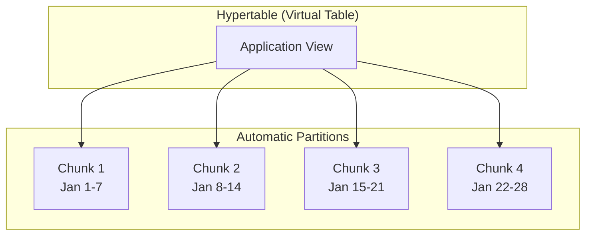

# How to Get Started with TimescaleDB for Time-Series Data

Author: [nawazdhandala](https://www.github.com/nawazdhandala)

Tags: TimescaleDB, Time-Series, PostgreSQL, Database, Monitoring, Metrics, Tutorial

Description: A practical guide to getting started with TimescaleDB for time-series data. Learn how to install, configure, and use TimescaleDB for metrics, IoT data, and application monitoring with real-world examples.

---

> Time-series data is everywhere - from server metrics and IoT sensors to financial transactions and user analytics. TimescaleDB brings the power of time-series optimizations to PostgreSQL, giving you the best of both worlds: familiar SQL and purpose-built performance.

If you're already comfortable with PostgreSQL, TimescaleDB is one of the easiest ways to handle time-series workloads. It's not a separate database to learn - it's an extension that supercharges PostgreSQL with automatic partitioning, compression, and time-aware query optimizations.

---

## What Makes TimescaleDB Different

TimescaleDB is built as a PostgreSQL extension, which means you get:

- **Full SQL support** - No new query language to learn
- **PostgreSQL ecosystem** - Works with existing tools, ORMs, and drivers
- **ACID compliance** - Transactions and data integrity you can trust
- **Hypertables** - Automatic time-based partitioning under the hood

The key concept in TimescaleDB is the **hypertable**. While it looks like a regular table to your application, TimescaleDB automatically partitions it into chunks based on time. This makes queries on recent data fast (they only scan relevant chunks) and allows efficient data lifecycle management.



---

## Installing TimescaleDB

### Using Docker (Recommended for Development)

The fastest way to get started is with Docker. TimescaleDB provides official images based on PostgreSQL.

```bash
# Pull and run TimescaleDB container
docker run -d \
  --name timescaledb \
  -p 5432:5432 \
  -e POSTGRES_PASSWORD=password \
  -e POSTGRES_DB=metrics \
  timescale/timescaledb:latest-pg16

# Verify it's running
docker logs timescaledb
```

### On Ubuntu/Debian

For production environments, install TimescaleDB directly on your server.

```bash
# Add TimescaleDB repository
sudo apt install -y gnupg postgresql-common apt-transport-https lsb-release wget

# Add repository key and source
echo "deb https://packagecloud.io/timescale/timescaledb/ubuntu/ $(lsb_release -c -s) main" | \
  sudo tee /etc/apt/sources.list.d/timescaledb.list

wget --quiet -O - https://packagecloud.io/timescale/timescaledb/gpgkey | \
  sudo apt-key add -

# Update and install
sudo apt update
sudo apt install -y timescaledb-2-postgresql-16

# Run the tuning script to optimize PostgreSQL settings
sudo timescaledb-tune --quiet --yes

# Restart PostgreSQL to apply changes
sudo systemctl restart postgresql
```

### Enabling the Extension

Once installed, you need to enable TimescaleDB in your database.

```sql
-- Connect to your database
psql -U postgres -d metrics

-- Enable the TimescaleDB extension
CREATE EXTENSION IF NOT EXISTS timescaledb;

-- Verify installation
SELECT extversion FROM pg_extension WHERE extname = 'timescaledb';
```

---

## Creating Your First Hypertable

Let's build a practical example: storing server metrics for monitoring.

### Define the Schema

Start with a regular PostgreSQL table, then convert it to a hypertable.

```sql
-- Create a table for server metrics
-- This looks like any normal PostgreSQL table
CREATE TABLE server_metrics (
    time        TIMESTAMPTZ NOT NULL,  -- Timestamp with timezone
    host_id     TEXT NOT NULL,         -- Server identifier
    cpu_usage   DOUBLE PRECISION,      -- CPU percentage (0-100)
    memory_used BIGINT,                -- Memory in bytes
    disk_io     DOUBLE PRECISION,      -- Disk I/O in MB/s
    network_in  BIGINT,                -- Network bytes received
    network_out BIGINT                 -- Network bytes sent
);

-- Convert to a hypertable, partitioned by time
-- TimescaleDB will create chunks automatically (default: 7 days per chunk)
SELECT create_hypertable('server_metrics', 'time');
```

The `create_hypertable` function transforms your table into a time-partitioned hypertable. By default, it creates weekly chunks, but you can customize this.

```sql
-- Create hypertable with custom chunk interval (1 day)
-- Useful for high-volume data where you want smaller partitions
SELECT create_hypertable(
    'server_metrics',
    'time',
    chunk_time_interval => INTERVAL '1 day'
);
```

### Adding Indexes for Query Performance

TimescaleDB automatically creates an index on the time column, but you'll want additional indexes for your query patterns.

```sql
-- Create composite index for host-based queries
-- Essential for queries like "show me CPU for host X over the last hour"
CREATE INDEX idx_metrics_host_time
ON server_metrics (host_id, time DESC);

-- Create index for finding high CPU events across all hosts
CREATE INDEX idx_metrics_cpu
ON server_metrics (cpu_usage)
WHERE cpu_usage > 90;
```

---

## Inserting Time-Series Data

### Basic Inserts

Inserting data works exactly like regular PostgreSQL.

```sql
-- Insert a single metric reading
INSERT INTO server_metrics (time, host_id, cpu_usage, memory_used, disk_io, network_in, network_out)
VALUES (NOW(), 'server-01', 45.2, 8589934592, 125.5, 1048576, 524288);

-- Insert multiple readings in a batch (more efficient)
INSERT INTO server_metrics (time, host_id, cpu_usage, memory_used, disk_io, network_in, network_out)
VALUES
    (NOW(), 'server-01', 45.2, 8589934592, 125.5, 1048576, 524288),
    (NOW(), 'server-02', 72.8, 12884901888, 98.3, 2097152, 1048576),
    (NOW(), 'server-03', 23.1, 4294967296, 45.2, 524288, 262144);
```

### Python Example with psycopg2

Here's how to insert metrics from a Python application.

```python
# metrics_collector.py
# Collects and stores server metrics in TimescaleDB
import psycopg2
from psycopg2.extras import execute_values
from datetime import datetime
import psutil  # For collecting system metrics

def get_connection():
    """Create database connection with connection pooling in production"""
    return psycopg2.connect(
        host="localhost",
        database="metrics",
        user="postgres",
        password="password"
    )

def collect_metrics(host_id: str) -> dict:
    """Collect current system metrics using psutil"""
    cpu = psutil.cpu_percent(interval=1)  # CPU over 1 second
    memory = psutil.virtual_memory()
    disk = psutil.disk_io_counters()
    network = psutil.net_io_counters()

    return {
        "time": datetime.now(),
        "host_id": host_id,
        "cpu_usage": cpu,
        "memory_used": memory.used,
        "disk_io": (disk.read_bytes + disk.write_bytes) / (1024 * 1024),  # Convert to MB
        "network_in": network.bytes_recv,
        "network_out": network.bytes_sent
    }

def insert_metrics(metrics: list[dict]):
    """Batch insert metrics for efficiency"""
    conn = get_connection()
    cursor = conn.cursor()

    # Use execute_values for efficient batch insert
    # This is much faster than individual INSERT statements
    query = """
        INSERT INTO server_metrics
        (time, host_id, cpu_usage, memory_used, disk_io, network_in, network_out)
        VALUES %s
    """

    values = [
        (m["time"], m["host_id"], m["cpu_usage"], m["memory_used"],
         m["disk_io"], m["network_in"], m["network_out"])
        for m in metrics
    ]

    execute_values(cursor, query, values)
    conn.commit()

    cursor.close()
    conn.close()

# Example: Collect and store metrics every 10 seconds
if __name__ == "__main__":
    import time
    import socket

    host_id = socket.gethostname()  # Use hostname as identifier

    while True:
        metrics = collect_metrics(host_id)
        insert_metrics([metrics])  # Wrap in list for batch insert
        print(f"Collected metrics for {host_id}: CPU={metrics['cpu_usage']}%")
        time.sleep(10)
```

---

## Querying Time-Series Data

TimescaleDB shines when querying time-series data. You can use standard SQL plus TimescaleDB-specific functions.

### Basic Time-Range Queries

```sql
-- Get metrics for the last hour
-- TimescaleDB automatically scans only relevant chunks
SELECT time, host_id, cpu_usage, memory_used
FROM server_metrics
WHERE time > NOW() - INTERVAL '1 hour'
ORDER BY time DESC;

-- Get metrics for a specific host over the last 24 hours
SELECT time, cpu_usage, memory_used
FROM server_metrics
WHERE host_id = 'server-01'
  AND time > NOW() - INTERVAL '24 hours'
ORDER BY time DESC;
```

### Time Bucketing with time_bucket()

The `time_bucket()` function is one of TimescaleDB's most useful features. It groups data into fixed time intervals.

```sql
-- Average CPU usage per hour for each host
-- time_bucket groups data into 1-hour intervals
SELECT
    time_bucket('1 hour', time) AS hour,
    host_id,
    AVG(cpu_usage) AS avg_cpu,
    MAX(cpu_usage) AS max_cpu,
    MIN(cpu_usage) AS min_cpu
FROM server_metrics
WHERE time > NOW() - INTERVAL '24 hours'
GROUP BY hour, host_id
ORDER BY hour DESC, host_id;

-- 5-minute averages for a dashboard
SELECT
    time_bucket('5 minutes', time) AS bucket,
    host_id,
    AVG(cpu_usage) AS avg_cpu,
    AVG(memory_used)::BIGINT AS avg_memory
FROM server_metrics
WHERE time > NOW() - INTERVAL '6 hours'
GROUP BY bucket, host_id
ORDER BY bucket DESC;
```

### Finding Gaps and Anomalies

```sql
-- Find time periods where CPU exceeded 90% for more than 5 minutes
WITH high_cpu_events AS (
    SELECT
        time_bucket('5 minutes', time) AS bucket,
        host_id,
        AVG(cpu_usage) AS avg_cpu
    FROM server_metrics
    WHERE time > NOW() - INTERVAL '24 hours'
    GROUP BY bucket, host_id
    HAVING AVG(cpu_usage) > 90
)
SELECT * FROM high_cpu_events
ORDER BY bucket DESC;

-- Find the latest metric for each host (useful for dashboards)
SELECT DISTINCT ON (host_id)
    host_id,
    time,
    cpu_usage,
    memory_used
FROM server_metrics
ORDER BY host_id, time DESC;
```

### Using first() and last() Aggregates

TimescaleDB provides special aggregates for time-series data.

```sql
-- Get the first and last CPU reading per hour
SELECT
    time_bucket('1 hour', time) AS hour,
    host_id,
    first(cpu_usage, time) AS first_cpu,  -- First value in the bucket
    last(cpu_usage, time) AS last_cpu,    -- Last value in the bucket
    AVG(cpu_usage) AS avg_cpu
FROM server_metrics
WHERE time > NOW() - INTERVAL '12 hours'
GROUP BY hour, host_id
ORDER BY hour DESC;
```

---

## Continuous Aggregates

For dashboards and reporting, you often need pre-computed aggregates. Continuous aggregates automatically maintain materialized views that update as new data arrives.

```sql
-- Create a continuous aggregate for hourly statistics
-- This runs in the background and stays up-to-date automatically
CREATE MATERIALIZED VIEW hourly_metrics
WITH (timescaledb.continuous) AS
SELECT
    time_bucket('1 hour', time) AS bucket,
    host_id,
    AVG(cpu_usage) AS avg_cpu,
    MAX(cpu_usage) AS max_cpu,
    AVG(memory_used)::BIGINT AS avg_memory,
    COUNT(*) AS sample_count
FROM server_metrics
GROUP BY bucket, host_id;

-- Add a refresh policy to keep the aggregate current
-- This refreshes data older than 1 hour, every 30 minutes
SELECT add_continuous_aggregate_policy('hourly_metrics',
    start_offset => INTERVAL '3 hours',  -- How far back to look
    end_offset => INTERVAL '1 hour',     -- Don't include the most recent hour (still collecting)
    schedule_interval => INTERVAL '30 minutes'  -- How often to refresh
);

-- Query the continuous aggregate (much faster than raw data)
SELECT * FROM hourly_metrics
WHERE bucket > NOW() - INTERVAL '7 days'
ORDER BY bucket DESC, host_id;
```

---

## Data Retention and Compression

Time-series data grows fast. TimescaleDB provides built-in tools for managing data lifecycle.

### Automatic Data Retention

```sql
-- Delete data older than 90 days automatically
-- This runs daily and removes old chunks efficiently
SELECT add_retention_policy('server_metrics', INTERVAL '90 days');

-- Check existing retention policies
SELECT * FROM timescaledb_information.jobs
WHERE proc_name = 'policy_retention';
```

### Compression for Storage Efficiency

Compression can reduce storage by 90% or more for time-series data.

```sql
-- Enable compression on the hypertable
-- segment_by keeps hosts separate for faster filtered queries
-- order_by ensures time-ordered compression
ALTER TABLE server_metrics SET (
    timescaledb.compress,
    timescaledb.compress_segmentby = 'host_id',
    timescaledb.compress_orderby = 'time DESC'
);

-- Add policy to compress chunks older than 7 days
SELECT add_compression_policy('server_metrics', INTERVAL '7 days');

-- Check compression statistics
SELECT
    chunk_name,
    before_compression_total_bytes,
    after_compression_total_bytes,
    round((1 - after_compression_total_bytes::numeric /
           before_compression_total_bytes) * 100, 2) AS compression_ratio
FROM chunk_compression_stats('server_metrics');
```

---

## Python Application Example

Here's a complete example showing how to build a metrics API with Flask and TimescaleDB.

```python
# metrics_api.py
# REST API for querying server metrics from TimescaleDB
from flask import Flask, jsonify, request
import psycopg2
from psycopg2.extras import RealDictCursor
from datetime import datetime, timedelta
from contextlib import contextmanager

app = Flask(__name__)

# Database configuration
DB_CONFIG = {
    "host": "localhost",
    "database": "metrics",
    "user": "postgres",
    "password": "password"
}

@contextmanager
def get_db_cursor():
    """Context manager for database connections with automatic cleanup"""
    conn = psycopg2.connect(**DB_CONFIG)
    cursor = conn.cursor(cursor_factory=RealDictCursor)  # Return dicts instead of tuples
    try:
        yield cursor
        conn.commit()
    finally:
        cursor.close()
        conn.close()

@app.route('/api/metrics/latest')
def get_latest_metrics():
    """Get the most recent metrics for all hosts"""
    with get_db_cursor() as cursor:
        cursor.execute("""
            SELECT DISTINCT ON (host_id)
                host_id,
                time,
                cpu_usage,
                memory_used,
                disk_io
            FROM server_metrics
            ORDER BY host_id, time DESC
        """)
        results = cursor.fetchall()

    return jsonify(results)

@app.route('/api/metrics/<host_id>')
def get_host_metrics(host_id):
    """Get metrics for a specific host over a time range"""
    # Parse query parameters with defaults
    hours = request.args.get('hours', 24, type=int)
    interval = request.args.get('interval', '5 minutes')

    with get_db_cursor() as cursor:
        # Use parameterized query to prevent SQL injection
        cursor.execute("""
            SELECT
                time_bucket(%s, time) AS bucket,
                AVG(cpu_usage) AS avg_cpu,
                MAX(cpu_usage) AS max_cpu,
                AVG(memory_used)::BIGINT AS avg_memory
            FROM server_metrics
            WHERE host_id = %s
              AND time > NOW() - make_interval(hours => %s)
            GROUP BY bucket
            ORDER BY bucket DESC
        """, (interval, host_id, hours))

        results = cursor.fetchall()

    return jsonify({
        "host_id": host_id,
        "interval": interval,
        "hours": hours,
        "data": results
    })

@app.route('/api/metrics/alerts')
def get_alerts():
    """Find hosts with high resource usage in the last hour"""
    cpu_threshold = request.args.get('cpu_threshold', 80, type=float)

    with get_db_cursor() as cursor:
        cursor.execute("""
            SELECT
                host_id,
                time_bucket('5 minutes', time) AS bucket,
                AVG(cpu_usage) AS avg_cpu,
                MAX(cpu_usage) AS max_cpu
            FROM server_metrics
            WHERE time > NOW() - INTERVAL '1 hour'
            GROUP BY host_id, bucket
            HAVING AVG(cpu_usage) > %s
            ORDER BY bucket DESC, avg_cpu DESC
        """, (cpu_threshold,))

        results = cursor.fetchall()

    return jsonify({
        "threshold": cpu_threshold,
        "alerts": results
    })

@app.route('/api/metrics/summary')
def get_summary():
    """Get aggregated summary from continuous aggregate"""
    days = request.args.get('days', 7, type=int)

    with get_db_cursor() as cursor:
        cursor.execute("""
            SELECT
                host_id,
                AVG(avg_cpu) AS overall_avg_cpu,
                MAX(max_cpu) AS peak_cpu,
                AVG(avg_memory)::BIGINT AS avg_memory,
                SUM(sample_count) AS total_samples
            FROM hourly_metrics
            WHERE bucket > NOW() - make_interval(days => %s)
            GROUP BY host_id
            ORDER BY overall_avg_cpu DESC
        """, (days,))

        results = cursor.fetchall()

    return jsonify(results)

if __name__ == '__main__':
    app.run(debug=True, port=5000)
```

---

## Best Practices

### Schema Design

1. **Always include a timestamp column** - Use TIMESTAMPTZ for timezone awareness
2. **Choose appropriate chunk intervals** - Smaller chunks (1 day) for high-volume data, larger (1 week) for lower volume
3. **Add indexes for common query patterns** - Composite indexes on (identifier, time) are common
4. **Use appropriate data types** - DOUBLE PRECISION for metrics, BIGINT for counts

### Query Optimization

1. **Always filter by time** - TimescaleDB can skip irrelevant chunks
2. **Use time_bucket() for aggregations** - It's optimized for hypertables
3. **Leverage continuous aggregates** - Pre-compute common aggregations
4. **Use EXPLAIN ANALYZE** - Check query plans to ensure chunk exclusion works

### Data Management

1. **Set up retention policies early** - Prevent unbounded growth
2. **Enable compression for older data** - 90%+ storage savings is common
3. **Monitor chunk sizes** - Keep them manageable (aim for chunks that fit in memory)
4. **Regular VACUUM** - TimescaleDB handles this better than vanilla PostgreSQL, but still monitor

---

## Monitoring Your TimescaleDB Instance

```sql
-- Check hypertable size and chunk count
SELECT
    hypertable_name,
    num_chunks,
    pg_size_pretty(total_bytes) AS total_size,
    pg_size_pretty(table_bytes) AS table_size,
    pg_size_pretty(index_bytes) AS index_size
FROM hypertable_detailed_size('server_metrics');

-- View all chunks and their time ranges
SELECT
    chunk_name,
    range_start,
    range_end,
    is_compressed
FROM timescaledb_information.chunks
WHERE hypertable_name = 'server_metrics'
ORDER BY range_start DESC
LIMIT 10;

-- Check compression status
SELECT
    hypertable_name,
    chunk_name,
    compression_status,
    uncompressed_total_size,
    compressed_total_size
FROM timescaledb_information.chunk_compression_settings;
```

---

## Conclusion

TimescaleDB makes time-series data management accessible to anyone familiar with PostgreSQL. By building on PostgreSQL rather than reinventing the wheel, you get:

- Familiar SQL syntax and tooling
- Automatic time-based partitioning with hypertables
- Built-in compression for efficient storage
- Continuous aggregates for fast dashboards
- Retention policies for data lifecycle management

Whether you're building a monitoring system, analyzing IoT sensor data, or tracking application metrics, TimescaleDB provides the foundation you need without forcing you to learn a completely new database system.

---

*Need a complete observability solution? [OneUptime](https://oneuptime.com) provides infrastructure monitoring, application performance monitoring, and incident management - all in one platform. It integrates with TimescaleDB and other databases to give you full visibility into your systems.*

**Related Reading:**
- [ClickHouse vs TimescaleDB: Which to Choose for Time-Series Data](https://oneuptime.com/blog/post/2026-01-21-clickhouse-vs-timescaledb/view)
- [How to Collect and Store Time-Series Metrics from IoT Devices](https://oneuptime.com/blog/post/2026-01-21-clickhouse-iot-time-series/view)
- [Popular PostgreSQL Extensions You Should Know](https://oneuptime.com/blog/post/2026-01-25-postgresql-popular-extensions/view)
