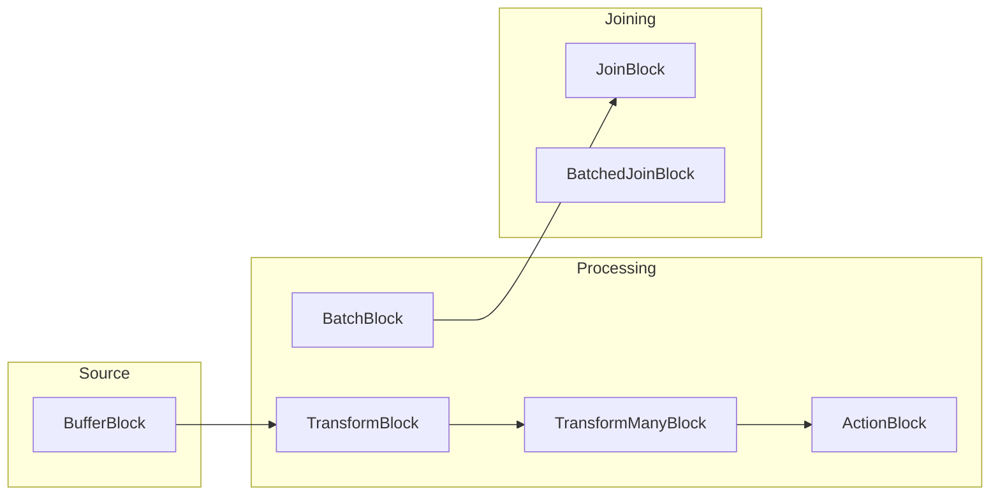

# How to Build Batch Processing with TPL Dataflow in .NET

Author: [nawazdhandala](https://www.github.com/nawazdhandala)

Tags: .NET, C#, TPL Dataflow, Batch Processing, Parallel Processing

Description: Learn how to build efficient batch processing pipelines in .NET using TPL Dataflow. This guide covers dataflow blocks, linking strategies, throttling, error handling, and real-world patterns for processing large datasets.

---

Processing large volumes of data efficiently requires more than just throwing threads at the problem. You need to manage backpressure, handle errors gracefully, and coordinate multiple processing stages. TPL Dataflow (Task Parallel Library Dataflow) provides the building blocks for creating data processing pipelines that handle these concerns out of the box.

## Why TPL Dataflow?

| Challenge | TPL Dataflow Solution |
|-----------|----------------------|
| Backpressure | Bounded capacity on blocks |
| Parallelism | Configurable parallelism per block |
| Ordering | Preserves order when needed |
| Error handling | Propagates errors through pipeline |
| Cancellation | Built-in cancellation support |
| Memory | Batching and throttling |

## Getting Started

Install the NuGet package:

```bash
dotnet add package System.Threading.Tasks.Dataflow
```

## Understanding Dataflow Blocks

TPL Dataflow provides several block types:



- **BufferBlock**: Stores messages for consumers
- **TransformBlock**: Transforms input to output
- **TransformManyBlock**: One input produces multiple outputs
- **ActionBlock**: Terminal block that executes an action
- **BatchBlock**: Groups inputs into batches
- **JoinBlock**: Combines inputs from multiple sources

## Basic Pipeline Example

Let's build a simple pipeline that processes order records:

```csharp
using System.Threading.Tasks.Dataflow;

public class Order
{
    public int Id { get; set; }
    public string CustomerEmail { get; set; } = string.Empty;
    public decimal Amount { get; set; }
    public DateTime CreatedAt { get; set; }
}

public class ProcessedOrder
{
    public int OrderId { get; set; }
    public decimal Tax { get; set; }
    public decimal Total { get; set; }
    public bool NotificationSent { get; set; }
}

public class OrderProcessor
{
    public async Task ProcessOrdersAsync(IEnumerable<Order> orders)
    {
        // Stage 1: Calculate tax
        var calculateTax = new TransformBlock<Order, ProcessedOrder>(order =>
        {
            var tax = order.Amount * 0.08m;  // 8% tax
            return new ProcessedOrder
            {
                OrderId = order.Id,
                Tax = tax,
                Total = order.Amount + tax
            };
        });

        // Stage 2: Send notification
        var sendNotification = new TransformBlock<ProcessedOrder, ProcessedOrder>(async processed =>
        {
            // Simulate sending email
            await Task.Delay(10);
            processed.NotificationSent = true;
            return processed;
        });

        // Stage 3: Save to database
        var saveResults = new ActionBlock<ProcessedOrder>(async processed =>
        {
            // Simulate database save
            await Task.Delay(5);
            Console.WriteLine($"Order {processed.OrderId} saved. Total: {processed.Total:C}");
        });

        // Link the blocks together
        calculateTax.LinkTo(sendNotification, new DataflowLinkOptions { PropagateCompletion = true });
        sendNotification.LinkTo(saveResults, new DataflowLinkOptions { PropagateCompletion = true });

        // Post all orders to the pipeline
        foreach (var order in orders)
        {
            await calculateTax.SendAsync(order);
        }

        // Signal completion and wait
        calculateTax.Complete();
        await saveResults.Completion;
    }
}
```

## Parallel Processing with Bounded Capacity

Control parallelism and memory usage with execution options:

```csharp
public class ParallelOrderProcessor
{
    private readonly ILogger<ParallelOrderProcessor> _logger;
    private readonly IOrderRepository _repository;

    public ParallelOrderProcessor(
        ILogger<ParallelOrderProcessor> logger,
        IOrderRepository repository)
    {
        _logger = logger;
        _repository = repository;
    }

    public async Task ProcessOrdersAsync(
        IAsyncEnumerable<Order> orders,
        CancellationToken cancellationToken = default)
    {
        // Configure execution options
        var parallelOptions = new ExecutionDataflowBlockOptions
        {
            MaxDegreeOfParallelism = 4,           // Process 4 items concurrently
            BoundedCapacity = 100,                 // Buffer up to 100 items
            CancellationToken = cancellationToken
        };

        var singleThreadOptions = new ExecutionDataflowBlockOptions
        {
            MaxDegreeOfParallelism = 1,            // Single threaded for ordering
            BoundedCapacity = 50,
            CancellationToken = cancellationToken
        };

        // Validation block (parallel)
        var validate = new TransformBlock<Order, Order>(order =>
        {
            if (order.Amount <= 0)
            {
                throw new ValidationException($"Invalid amount for order {order.Id}");
            }
            return order;
        }, parallelOptions);

        // Enrichment block (parallel, I/O bound)
        var enrich = new TransformBlock<Order, EnrichedOrder>(async order =>
        {
            var customer = await _repository.GetCustomerAsync(order.CustomerEmail);
            return new EnrichedOrder
            {
                Order = order,
                CustomerName = customer.Name,
                CustomerTier = customer.Tier
            };
        }, parallelOptions);

        // Pricing block (parallel, CPU bound)
        var calculatePricing = new TransformBlock<EnrichedOrder, PricedOrder>(enriched =>
        {
            var discount = enriched.CustomerTier switch
            {
                "Gold" => 0.15m,
                "Silver" => 0.10m,
                "Bronze" => 0.05m,
                _ => 0m
            };

            var discountAmount = enriched.Order.Amount * discount;
            var tax = (enriched.Order.Amount - discountAmount) * 0.08m;

            return new PricedOrder
            {
                OrderId = enriched.Order.Id,
                Subtotal = enriched.Order.Amount,
                Discount = discountAmount,
                Tax = tax,
                Total = enriched.Order.Amount - discountAmount + tax
            };
        }, parallelOptions);

        // Save block (single threaded to preserve order)
        var save = new ActionBlock<PricedOrder>(async priced =>
        {
            await _repository.SaveOrderAsync(priced);
            _logger.LogInformation("Saved order {OrderId}, Total: {Total:C}",
                priced.OrderId, priced.Total);
        }, singleThreadOptions);

        // Link blocks with completion propagation
        var linkOptions = new DataflowLinkOptions { PropagateCompletion = true };
        validate.LinkTo(enrich, linkOptions);
        enrich.LinkTo(calculatePricing, linkOptions);
        calculatePricing.LinkTo(save, linkOptions);

        // Feed data into the pipeline
        await foreach (var order in orders.WithCancellation(cancellationToken))
        {
            // SendAsync respects bounded capacity (backpressure)
            await validate.SendAsync(order, cancellationToken);
        }

        // Signal completion
        validate.Complete();

        // Wait for all processing to finish
        await save.Completion;
    }
}
```

## Batching for Bulk Operations

Use `BatchBlock` to group items for efficient bulk operations:

```csharp
public class BulkImportProcessor
{
    private readonly IDbContext _dbContext;

    public BulkImportProcessor(IDbContext dbContext)
    {
        _dbContext = dbContext;
    }

    public async Task ImportRecordsAsync(
        IEnumerable<ImportRecord> records,
        CancellationToken cancellationToken = default)
    {
        var options = new ExecutionDataflowBlockOptions
        {
            BoundedCapacity = 1000,
            CancellationToken = cancellationToken
        };

        // Transform individual records
        var transform = new TransformBlock<ImportRecord, ProcessedRecord>(record =>
        {
            return new ProcessedRecord
            {
                Id = record.ExternalId,
                Name = record.Name.Trim().ToUpperInvariant(),
                Value = decimal.Parse(record.Value),
                ImportedAt = DateTime.UtcNow
            };
        }, options);

        // Batch into groups of 100 for bulk insert
        var batch = new BatchBlock<ProcessedRecord>(100, new GroupingDataflowBlockOptions
        {
            BoundedCapacity = 500,
            CancellationToken = cancellationToken
        });

        // Bulk insert batches
        var bulkInsert = new ActionBlock<ProcessedRecord[]>(async batchRecords =>
        {
            await _dbContext.BulkInsertAsync(batchRecords);
            Console.WriteLine($"Inserted batch of {batchRecords.Length} records");
        }, new ExecutionDataflowBlockOptions
        {
            MaxDegreeOfParallelism = 2,  // 2 concurrent bulk inserts
            CancellationToken = cancellationToken
        });

        // Link the pipeline
        var linkOptions = new DataflowLinkOptions { PropagateCompletion = true };
        transform.LinkTo(batch, linkOptions);
        batch.LinkTo(bulkInsert, linkOptions);

        // Post records
        foreach (var record in records)
        {
            await transform.SendAsync(record, cancellationToken);
        }

        // Complete and flush remaining items
        transform.Complete();
        await bulkInsert.Completion;
    }
}
```

## Conditional Routing

Route items to different blocks based on conditions:

```csharp
public class ConditionalProcessor
{
    public async Task ProcessWithRoutingAsync(IEnumerable<Transaction> transactions)
    {
        var options = new ExecutionDataflowBlockOptions
        {
            MaxDegreeOfParallelism = 4,
            BoundedCapacity = 100
        };

        // Source buffer
        var source = new BufferBlock<Transaction>(new DataflowBlockOptions
        {
            BoundedCapacity = 100
        });

        // High-value transaction processing
        var highValueProcessor = new ActionBlock<Transaction>(async tx =>
        {
            Console.WriteLine($"High-value transaction: {tx.Id}, Amount: {tx.Amount:C}");
            await ProcessHighValueAsync(tx);
        }, options);

        // Normal transaction processing
        var normalProcessor = new ActionBlock<Transaction>(async tx =>
        {
            Console.WriteLine($"Normal transaction: {tx.Id}, Amount: {tx.Amount:C}");
            await ProcessNormalAsync(tx);
        }, options);

        // Flagged transaction processing
        var flaggedProcessor = new ActionBlock<Transaction>(async tx =>
        {
            Console.WriteLine($"Flagged transaction: {tx.Id}, reviewing...");
            await ProcessFlaggedAsync(tx);
        }, options);

        // Link with predicates for routing
        source.LinkTo(highValueProcessor,
            new DataflowLinkOptions { PropagateCompletion = true },
            tx => tx.Amount > 10000);  // Route high-value transactions

        source.LinkTo(flaggedProcessor,
            new DataflowLinkOptions { PropagateCompletion = true },
            tx => tx.IsFlagged);  // Route flagged transactions

        source.LinkTo(normalProcessor,
            new DataflowLinkOptions { PropagateCompletion = true });  // Everything else

        // Post transactions
        foreach (var tx in transactions)
        {
            await source.SendAsync(tx);
        }

        // Complete
        source.Complete();

        // Wait for all processors
        await Task.WhenAll(
            highValueProcessor.Completion,
            normalProcessor.Completion,
            flaggedProcessor.Completion);
    }

    private Task ProcessHighValueAsync(Transaction tx) => Task.Delay(50);
    private Task ProcessNormalAsync(Transaction tx) => Task.Delay(10);
    private Task ProcessFlaggedAsync(Transaction tx) => Task.Delay(100);
}
```

## Error Handling

Handle errors gracefully in the pipeline:

```csharp
public class ResilientProcessor
{
    private readonly ILogger<ResilientProcessor> _logger;

    public ResilientProcessor(ILogger<ResilientProcessor> logger)
    {
        _logger = logger;
    }

    public async Task ProcessWithErrorHandlingAsync(IEnumerable<DataItem> items)
    {
        var processedCount = 0;
        var errorCount = 0;

        // Create a transform block that handles errors internally
        var process = new TransformBlock<DataItem, Result<ProcessedItem>>(async item =>
        {
            try
            {
                // Simulate processing that might fail
                if (item.Value < 0)
                {
                    throw new InvalidOperationException($"Invalid value: {item.Value}");
                }

                await Task.Delay(10);

                return Result<ProcessedItem>.Success(new ProcessedItem
                {
                    Id = item.Id,
                    ProcessedValue = item.Value * 2
                });
            }
            catch (Exception ex)
            {
                _logger.LogError(ex, "Failed to process item {ItemId}", item.Id);
                return Result<ProcessedItem>.Failure(ex.Message);
            }
        }, new ExecutionDataflowBlockOptions
        {
            MaxDegreeOfParallelism = 4,
            BoundedCapacity = 100
        });

        // Handle successful results
        var saveSuccessful = new ActionBlock<Result<ProcessedItem>>(result =>
        {
            Interlocked.Increment(ref processedCount);
            Console.WriteLine($"Saved: {result.Value!.Id}");
        });

        // Handle failed results
        var logErrors = new ActionBlock<Result<ProcessedItem>>(result =>
        {
            Interlocked.Increment(ref errorCount);
            _logger.LogWarning("Failed item: {Error}", result.Error);
        });

        // Route based on success/failure
        process.LinkTo(saveSuccessful,
            new DataflowLinkOptions { PropagateCompletion = true },
            r => r.IsSuccess);

        process.LinkTo(logErrors,
            new DataflowLinkOptions { PropagateCompletion = true },
            r => !r.IsSuccess);

        // Post items
        foreach (var item in items)
        {
            await process.SendAsync(item);
        }

        process.Complete();

        await Task.WhenAll(saveSuccessful.Completion, logErrors.Completion);

        _logger.LogInformation("Processing complete. Success: {Success}, Errors: {Errors}",
            processedCount, errorCount);
    }
}

// Result wrapper for error handling
public class Result<T>
{
    public bool IsSuccess { get; private set; }
    public T? Value { get; private set; }
    public string? Error { get; private set; }

    public static Result<T> Success(T value) => new() { IsSuccess = true, Value = value };
    public static Result<T> Failure(string error) => new() { IsSuccess = false, Error = error };
}
```

## Progress Reporting

Track progress through the pipeline:

```csharp
public class ProgressTrackingProcessor
{
    public async Task ProcessWithProgressAsync(
        IReadOnlyList<WorkItem> items,
        IProgress<ProcessingProgress> progress,
        CancellationToken cancellationToken = default)
    {
        var totalItems = items.Count;
        var processedItems = 0;
        var startTime = DateTime.UtcNow;

        var process = new TransformBlock<WorkItem, WorkItem>(async item =>
        {
            await Task.Delay(50);  // Simulate work

            var current = Interlocked.Increment(ref processedItems);
            var elapsed = DateTime.UtcNow - startTime;
            var itemsPerSecond = current / elapsed.TotalSeconds;
            var estimatedRemaining = TimeSpan.FromSeconds((totalItems - current) / itemsPerSecond);

            progress.Report(new ProcessingProgress
            {
                TotalItems = totalItems,
                ProcessedItems = current,
                PercentComplete = (double)current / totalItems * 100,
                ItemsPerSecond = itemsPerSecond,
                EstimatedTimeRemaining = estimatedRemaining
            });

            return item;
        }, new ExecutionDataflowBlockOptions
        {
            MaxDegreeOfParallelism = 4,
            CancellationToken = cancellationToken
        });

        var complete = new ActionBlock<WorkItem>(_ => { });

        process.LinkTo(complete, new DataflowLinkOptions { PropagateCompletion = true });

        foreach (var item in items)
        {
            await process.SendAsync(item, cancellationToken);
        }

        process.Complete();
        await complete.Completion;
    }
}

public class ProcessingProgress
{
    public int TotalItems { get; set; }
    public int ProcessedItems { get; set; }
    public double PercentComplete { get; set; }
    public double ItemsPerSecond { get; set; }
    public TimeSpan EstimatedTimeRemaining { get; set; }
}
```

## Summary

| Block Type | Purpose | When to Use |
|------------|---------|-------------|
| **BufferBlock** | Queue/buffer | Decoupling producers from consumers |
| **TransformBlock** | 1:1 transformation | Data transformation |
| **TransformManyBlock** | 1:N transformation | Splitting/expanding data |
| **ActionBlock** | Terminal processing | Final operations (save, log) |
| **BatchBlock** | Group items | Bulk operations |
| **JoinBlock** | Combine sources | Joining related data |

TPL Dataflow gives you the tools to build robust batch processing pipelines. By choosing the right blocks, configuring parallelism appropriately, and handling errors at each stage, you can process millions of records efficiently while maintaining control over memory usage and throughput. Start simple, measure performance, and add complexity only where the bottlenecks demand it.
