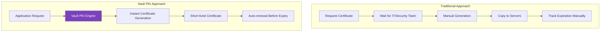
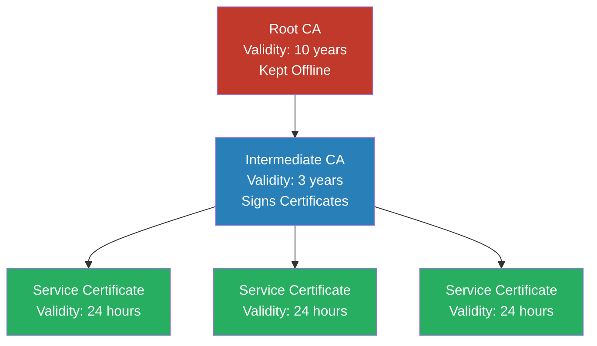
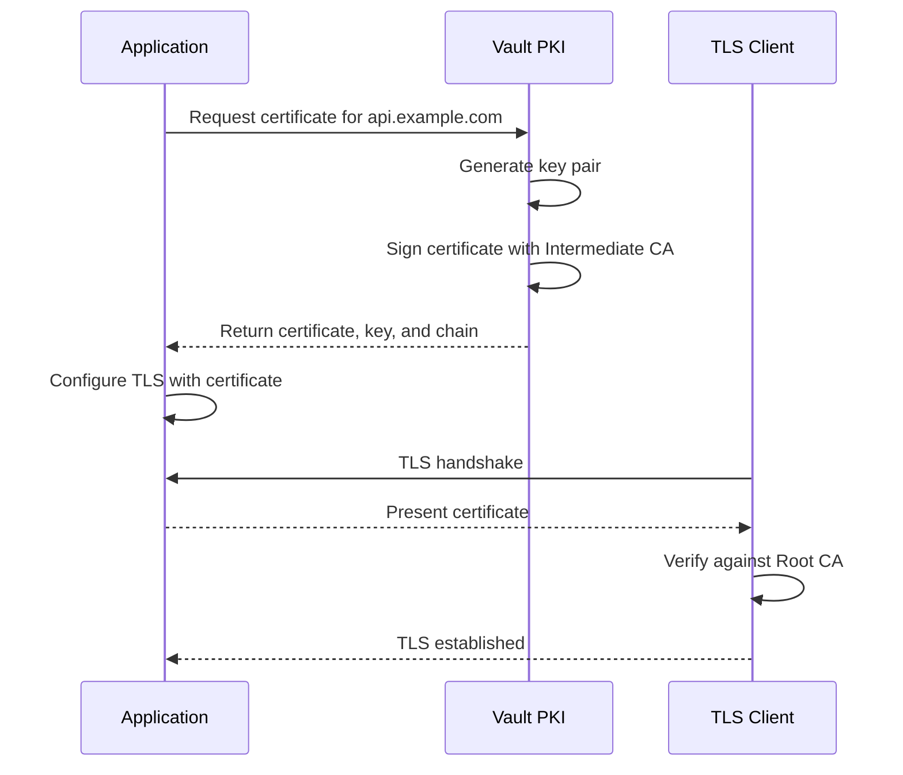
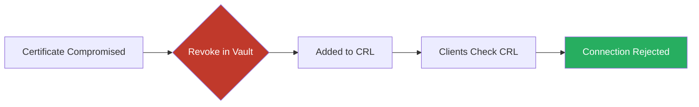

# How to Implement Vault PKI for Certificate Management

Author: [nawazdhandala](https://www.github.com/nawazdhandala)

Tags: HashiCorp Vault, PKI, SSL/TLS, Certificate Management, Security, DevOps, Infrastructure

Description: Learn how to set up and use HashiCorp Vault's PKI secrets engine to build your own internal Certificate Authority for automated certificate management.

---

Managing SSL/TLS certificates in a growing infrastructure quickly becomes a burden. Manually generating certificates, tracking expiration dates, and distributing them across services is error-prone and time-consuming. HashiCorp Vault's PKI secrets engine solves this by letting you run your own internal Certificate Authority (CA) with automated certificate issuance and short-lived certificates that reduce security risk.

## Why Use Vault PKI?

Traditional certificate management has several pain points:

- Certificates are manually generated and have long validity periods
- Private keys get copied across systems and stored insecurely
- Tracking certificate expiration requires external tooling
- Revoking compromised certificates is slow and incomplete

Vault PKI addresses these issues by providing on-demand certificate generation with short TTLs, centralized management, and automatic revocation.



## PKI Architecture Overview

A proper PKI setup uses a certificate chain with at least two levels: a Root CA and an Intermediate CA. The Root CA is kept offline or heavily protected, while the Intermediate CA handles day-to-day certificate signing.



## Setting Up the Root CA

First, enable the PKI secrets engine for the Root CA. We mount it at a separate path to keep it isolated from the Intermediate CA.

```bash
# Enable PKI secrets engine for Root CA at a dedicated path
vault secrets enable -path=pki_root pki

# Configure a long max TTL for the Root CA (10 years)
# This is the maximum validity for any certificate signed by this CA
vault secrets tune -max-lease-ttl=87600h pki_root
```

Generate the Root CA certificate. This certificate will be self-signed and serve as the trust anchor for your entire PKI.

```bash
# Generate the Root CA certificate
# common_name: The name that identifies this CA
# ttl: How long the Root CA certificate is valid
# key_type: RSA with 4096 bits provides strong security
vault write pki_root/root/generate/internal \
    common_name="My Organization Root CA" \
    issuer_name="root-2024" \
    key_type="rsa" \
    key_bits=4096 \
    ttl=87600h

# Save the Root CA certificate for distribution
# Clients need this certificate to trust certificates signed by your CA
vault read -field=certificate pki_root/cert/ca > root_ca.crt
```

Configure the CA URLs. These URLs are embedded in issued certificates and tell clients where to find revocation information.

```bash
# Configure the issuing certificate and CRL distribution URLs
# These URLs should be accessible to all clients that need to verify certificates
vault write pki_root/config/urls \
    issuing_certificates="https://vault.example.com:8200/v1/pki_root/ca" \
    crl_distribution_points="https://vault.example.com:8200/v1/pki_root/crl"
```

## Setting Up the Intermediate CA

The Intermediate CA handles the actual certificate signing. If it gets compromised, you can revoke it and create a new one without affecting the Root CA.

```bash
# Enable PKI secrets engine for Intermediate CA
vault secrets enable -path=pki_int pki

# Configure max TTL for intermediate (3 years)
# Shorter than Root CA but longer than issued certificates
vault secrets tune -max-lease-ttl=26280h pki_int
```

Generate a Certificate Signing Request (CSR) for the Intermediate CA. This CSR will be signed by the Root CA.

```bash
# Generate the Intermediate CA CSR
# This creates a private key stored in Vault and outputs a CSR
vault write -format=json pki_int/intermediate/generate/internal \
    common_name="My Organization Intermediate CA" \
    issuer_name="intermediate-2024" \
    key_type="rsa" \
    key_bits=4096 \
    | jq -r '.data.csr' > intermediate.csr
```

Sign the Intermediate CA certificate with the Root CA.

```bash
# Sign the Intermediate CSR with the Root CA
# This creates the Intermediate CA certificate
vault write -format=json pki_root/root/sign-intermediate \
    csr=@intermediate.csr \
    format=pem_bundle \
    ttl=26280h \
    | jq -r '.data.certificate' > intermediate.crt

# Import the signed certificate back into the Intermediate CA
vault write pki_int/intermediate/set-signed \
    certificate=@intermediate.crt
```

Configure URLs for the Intermediate CA.

```bash
# Configure URLs for the Intermediate CA
vault write pki_int/config/urls \
    issuing_certificates="https://vault.example.com:8200/v1/pki_int/ca" \
    crl_distribution_points="https://vault.example.com:8200/v1/pki_int/crl"
```

## Creating Certificate Roles

Roles define templates for certificate issuance. Each role specifies what domains, TTLs, and key types are allowed.

```bash
# Create a role for web server certificates
# This role allows certificates for *.example.com domains
vault write pki_int/roles/web-servers \
    allowed_domains="example.com" \
    allow_subdomains=true \
    allow_bare_domains=true \
    max_ttl="720h" \
    ttl="24h" \
    key_type="rsa" \
    key_bits=2048 \
    key_usage="DigitalSignature,KeyEncipherment" \
    ext_key_usage="ServerAuth"

# Create a role for internal services with shorter TTL
# Internal services can use even shorter-lived certificates
vault write pki_int/roles/internal-services \
    allowed_domains="internal.example.com,svc.cluster.local" \
    allow_subdomains=true \
    max_ttl="168h" \
    ttl="1h" \
    key_type="ec" \
    key_bits=256 \
    key_usage="DigitalSignature" \
    ext_key_usage="ServerAuth,ClientAuth"

# Create a role for client authentication certificates
vault write pki_int/roles/client-auth \
    allowed_domains="users.example.com" \
    allow_subdomains=true \
    max_ttl="720h" \
    ttl="8h" \
    key_type="ec" \
    key_bits=256 \
    key_usage="DigitalSignature" \
    ext_key_usage="ClientAuth" \
    organization="My Organization" \
    no_store=true
```

## Issuing Certificates

Once roles are configured, issuing certificates is straightforward.

```bash
# Issue a certificate for a web server
vault write pki_int/issue/web-servers \
    common_name="api.example.com" \
    alt_names="api-internal.example.com" \
    ttl="24h"

# The output includes:
# - certificate: The issued certificate
# - private_key: The private key (generated by Vault)
# - ca_chain: The certificate chain for verification
# - serial_number: Unique identifier for revocation
```



### Issuing Certificates with Your Own Key

If you need to use an existing private key, you can submit a CSR instead.

```bash
# Generate a private key outside Vault
openssl genrsa -out server.key 2048

# Create a CSR
openssl req -new -key server.key \
    -out server.csr \
    -subj "/CN=api.example.com"

# Submit the CSR to Vault for signing
vault write pki_int/sign/web-servers \
    csr=@server.csr \
    ttl="24h"
```

## Automating Certificate Renewal

The real power of Vault PKI comes from automation. Here is a Python script that handles certificate issuance and automatic renewal.

```python
import hvac
import ssl
import time
from datetime import datetime, timedelta
from pathlib import Path
from threading import Thread, Event

class VaultPKICertManager:
    """
    Manages TLS certificates using Vault PKI secrets engine.
    Handles automatic renewal before expiration.
    """

    def __init__(self, vault_addr, vault_token, pki_mount="pki_int"):
        # Initialize Vault client
        self.client = hvac.Client(url=vault_addr, token=vault_token)
        self.pki_mount = pki_mount

        # Certificate storage
        self.certificate = None
        self.private_key = None
        self.ca_chain = None
        self.expiration = None

        # Renewal thread control
        self._stop_renewal = Event()
        self._renewal_thread = None

    def issue_certificate(self, role, common_name, alt_names=None, ttl="24h"):
        """
        Issue a new certificate from Vault PKI.

        Args:
            role: The PKI role to use for issuance
            common_name: Primary domain name for the certificate
            alt_names: Comma-separated list of Subject Alternative Names
            ttl: Certificate validity period
        """
        # Build the request parameters
        params = {
            "common_name": common_name,
            "ttl": ttl
        }

        if alt_names:
            params["alt_names"] = alt_names

        # Request certificate from Vault
        response = self.client.secrets.pki.generate_certificate(
            name=role,
            mount_point=self.pki_mount,
            **params
        )

        # Extract certificate components from response
        data = response["data"]
        self.certificate = data["certificate"]
        self.private_key = data["private_key"]
        self.ca_chain = data.get("ca_chain", [])
        self.serial_number = data["serial_number"]

        # Parse expiration time for renewal scheduling
        # Vault returns expiration as Unix timestamp
        self.expiration = datetime.fromtimestamp(data["expiration"])

        return {
            "certificate": self.certificate,
            "private_key": self.private_key,
            "ca_chain": self.ca_chain,
            "expiration": self.expiration,
            "serial_number": self.serial_number
        }

    def save_to_files(self, cert_path, key_path, chain_path=None):
        """
        Save certificate, key, and chain to files.
        Useful for applications that read certificates from disk.
        """
        # Write certificate file
        Path(cert_path).write_text(self.certificate)

        # Write private key with restricted permissions
        key_file = Path(key_path)
        key_file.write_text(self.private_key)
        key_file.chmod(0o600)  # Read/write for owner only

        # Optionally write the CA chain
        if chain_path and self.ca_chain:
            chain_content = "\n".join(self.ca_chain)
            Path(chain_path).write_text(chain_content)

    def create_ssl_context(self, purpose=ssl.Purpose.CLIENT_AUTH):
        """
        Create an SSL context using the current certificate.
        Useful for Python applications using ssl module directly.
        """
        context = ssl.SSLContext(ssl.PROTOCOL_TLS_SERVER)

        # Load certificate and key from memory
        # We write to temp files because ssl module requires file paths
        import tempfile
        with tempfile.NamedTemporaryFile(mode='w', suffix='.crt', delete=False) as cert_file:
            cert_file.write(self.certificate)
            if self.ca_chain:
                cert_file.write("\n")
                cert_file.write("\n".join(self.ca_chain))
            cert_path = cert_file.name

        with tempfile.NamedTemporaryFile(mode='w', suffix='.key', delete=False) as key_file:
            key_file.write(self.private_key)
            key_path = key_file.name

        context.load_cert_chain(cert_path, key_path)

        # Clean up temp files
        Path(cert_path).unlink()
        Path(key_path).unlink()

        return context

    def start_auto_renewal(self, role, common_name, alt_names=None,
                           ttl="24h", renewal_threshold=0.7):
        """
        Start background thread that automatically renews certificates.

        Args:
            role: PKI role for renewal
            common_name: Domain name
            alt_names: Alternative names
            ttl: Certificate TTL
            renewal_threshold: Renew when this fraction of TTL has passed
        """
        def renewal_loop():
            while not self._stop_renewal.is_set():
                if self.expiration:
                    # Calculate when to renew (e.g., at 70% of TTL)
                    now = datetime.now()
                    total_validity = (self.expiration - now).total_seconds()
                    renew_at = now + timedelta(seconds=total_validity * renewal_threshold)

                    # Sleep until renewal time
                    sleep_seconds = (renew_at - now).total_seconds()
                    if sleep_seconds > 0:
                        # Use Event.wait() so we can be interrupted
                        if self._stop_renewal.wait(timeout=sleep_seconds):
                            break  # Stop signal received

                # Issue new certificate
                try:
                    self.issue_certificate(role, common_name, alt_names, ttl)
                    print(f"Certificate renewed. New expiration: {self.expiration}")
                except Exception as e:
                    print(f"Certificate renewal failed: {e}")
                    # Retry in 5 minutes
                    self._stop_renewal.wait(timeout=300)

        self._renewal_thread = Thread(target=renewal_loop, daemon=True)
        self._renewal_thread.start()

    def stop_auto_renewal(self):
        """Stop the auto-renewal background thread."""
        self._stop_renewal.set()
        if self._renewal_thread:
            self._renewal_thread.join(timeout=5)

    def revoke_certificate(self):
        """Revoke the current certificate."""
        if hasattr(self, 'serial_number'):
            self.client.secrets.pki.revoke_certificate(
                serial_number=self.serial_number,
                mount_point=self.pki_mount
            )


# Example usage
if __name__ == "__main__":
    manager = VaultPKICertManager(
        vault_addr="https://vault.example.com:8200",
        vault_token="your-vault-token",
        pki_mount="pki_int"
    )

    # Issue initial certificate
    cert_data = manager.issue_certificate(
        role="web-servers",
        common_name="api.example.com",
        alt_names="api-v2.example.com,api-internal.example.com",
        ttl="24h"
    )

    print(f"Certificate issued, expires: {cert_data['expiration']}")

    # Save to files for web server
    manager.save_to_files(
        cert_path="/etc/ssl/certs/api.crt",
        key_path="/etc/ssl/private/api.key",
        chain_path="/etc/ssl/certs/ca-chain.crt"
    )

    # Start auto-renewal (renew at 70% of TTL)
    manager.start_auto_renewal(
        role="web-servers",
        common_name="api.example.com",
        alt_names="api-v2.example.com",
        ttl="24h",
        renewal_threshold=0.7
    )
```

## Kubernetes Integration with cert-manager

For Kubernetes environments, cert-manager can integrate directly with Vault PKI.

```yaml
# vault-issuer.yaml
# ClusterIssuer that connects cert-manager to Vault PKI
apiVersion: cert-manager.io/v1
kind: ClusterIssuer
metadata:
  name: vault-issuer
spec:
  vault:
    # Vault server address
    server: https://vault.example.com:8200

    # Path to the PKI secrets engine
    path: pki_int/sign/internal-services

    # Authentication method - using Kubernetes auth
    auth:
      kubernetes:
        # Vault role configured for cert-manager
        role: cert-manager
        # Path to the Kubernetes auth mount in Vault
        mountPath: /v1/auth/kubernetes
        # Service account used by cert-manager
        secretRef:
          name: cert-manager-vault-token
          key: token

    # CA bundle to verify Vault's TLS certificate
    caBundle: <base64-encoded-ca-cert>
```

```yaml
# certificate.yaml
# Request a certificate from Vault via cert-manager
apiVersion: cert-manager.io/v1
kind: Certificate
metadata:
  name: api-tls
  namespace: default
spec:
  # Name of the Secret to store the certificate
  secretName: api-tls-secret

  # Certificate details
  commonName: api.internal.example.com
  dnsNames:
    - api.internal.example.com
    - api.svc.cluster.local

  # Use short-lived certificates (1 hour)
  duration: 1h

  # Renew 10 minutes before expiration
  renewBefore: 10m

  # Reference the Vault issuer
  issuerRef:
    name: vault-issuer
    kind: ClusterIssuer

  # Private key settings
  privateKey:
    algorithm: ECDSA
    size: 256
```

Configure Vault to allow cert-manager authentication.

```bash
# Enable Kubernetes auth method
vault auth enable kubernetes

# Configure Kubernetes auth to connect to the cluster
vault write auth/kubernetes/config \
    kubernetes_host="https://kubernetes.default.svc:443" \
    kubernetes_ca_cert=@/var/run/secrets/kubernetes.io/serviceaccount/ca.crt

# Create a policy for cert-manager
vault policy write cert-manager-policy -<<EOF
# Allow cert-manager to issue certificates
path "pki_int/sign/internal-services" {
  capabilities = ["create", "update"]
}

path "pki_int/issue/internal-services" {
  capabilities = ["create"]
}
EOF

# Create a Kubernetes auth role for cert-manager
vault write auth/kubernetes/role/cert-manager \
    bound_service_account_names=cert-manager \
    bound_service_account_namespaces=cert-manager \
    policies=cert-manager-policy \
    ttl=1h
```

## Certificate Revocation

When a certificate is compromised or no longer needed, revoke it immediately.

```bash
# Revoke a certificate by serial number
vault write pki_int/revoke \
    serial_number="39:dd:2e:90:b7:23:1f:8d:d3:7d:31:c5:1b:da:84:d0:5b:65:31:58"

# List revoked certificates
vault list pki_int/certs/revoked

# View the Certificate Revocation List (CRL)
curl -s https://vault.example.com:8200/v1/pki_int/crl | openssl crl -inform DER -text
```



## Monitoring and Maintenance

### Check Certificate Expiration

```bash
# List all issued certificates
vault list pki_int/certs

# Read certificate details including expiration
vault read pki_int/cert/<serial_number>
```

### Tidy Up Expired Certificates

Vault can automatically clean up expired certificates from its storage.

```bash
# Run tidy operation to clean up expired certificates
vault write pki_int/tidy \
    tidy_cert_store=true \
    tidy_revoked_certs=true \
    safety_buffer="72h"
```

### Rotate the Intermediate CA

When the Intermediate CA approaches expiration, create a new one.

```bash
# Generate new Intermediate CA CSR
vault write -format=json pki_int/intermediate/generate/internal \
    common_name="My Organization Intermediate CA v2" \
    issuer_name="intermediate-2027" \
    key_type="rsa" \
    key_bits=4096 \
    | jq -r '.data.csr' > intermediate_v2.csr

# Sign with Root CA
vault write -format=json pki_root/root/sign-intermediate \
    csr=@intermediate_v2.csr \
    format=pem_bundle \
    ttl=26280h \
    | jq -r '.data.certificate' > intermediate_v2.crt

# Import the new Intermediate CA
vault write pki_int/intermediate/set-signed \
    certificate=@intermediate_v2.crt

# Set the new issuer as default
vault write pki_int/config/issuers \
    default="intermediate-2027"
```

## Security Best Practices

### 1. Use Short-Lived Certificates

Short TTLs reduce the window of opportunity if a certificate is compromised.

```bash
# Production role with short TTL
vault write pki_int/roles/production-services \
    allowed_domains="prod.example.com" \
    allow_subdomains=true \
    max_ttl="4h" \
    ttl="1h"  # 1-hour certificates with auto-renewal
```

### 2. Restrict Role Permissions

Limit what domains each role can issue certificates for.

```bash
# Strictly limited role
vault write pki_int/roles/payment-service \
    allowed_domains="payments.prod.example.com" \
    allow_subdomains=false \
    allow_bare_domains=true \
    allow_glob_domains=false \
    allow_any_name=false \
    enforce_hostnames=true \
    max_ttl="1h"
```

### 3. Audit Certificate Issuance

Enable Vault audit logging to track all certificate operations.

```bash
# Enable file audit device
vault audit enable file file_path=/var/log/vault/audit.log

# All PKI operations will be logged:
# - Certificate issuance
# - Revocations
# - Configuration changes
```

### 4. Protect the Root CA

The Root CA should be used only to sign Intermediate CAs.

```bash
# Create a policy that prevents direct certificate issuance from Root CA
vault policy write root-ca-policy -<<EOF
# Only allow signing intermediate CSRs
path "pki_root/root/sign-intermediate" {
  capabilities = ["create", "update"]
}

# Deny direct certificate issuance
path "pki_root/issue/*" {
  capabilities = ["deny"]
}

path "pki_root/sign/*" {
  capabilities = ["deny"]
}
EOF
```

## Summary

Vault PKI transforms certificate management from a manual, error-prone process into an automated, secure workflow. By implementing a proper CA hierarchy, using short-lived certificates, and automating renewal, you can significantly improve your security posture while reducing operational overhead.

Key takeaways:

- Set up a two-tier CA hierarchy with Root and Intermediate CAs
- Use roles to define certificate templates with appropriate constraints
- Issue short-lived certificates and automate renewal
- Integrate with cert-manager for Kubernetes environments
- Monitor certificate expiration and maintain your CA infrastructure

## Further Reading

- [Vault PKI Secrets Engine Documentation](https://developer.hashicorp.com/vault/docs/secrets/pki)
- [Build Your Own Certificate Authority](https://developer.hashicorp.com/vault/tutorials/secrets-management/pki-engine)
- [PKI Secrets Engine - API](https://developer.hashicorp.com/vault/api-docs/secret/pki)
- [cert-manager Vault Issuer](https://cert-manager.io/docs/configuration/vault/)
