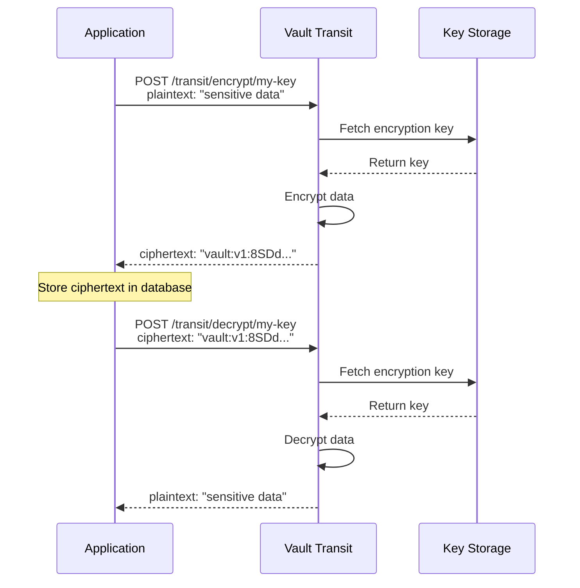
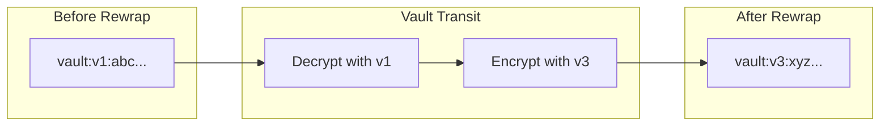
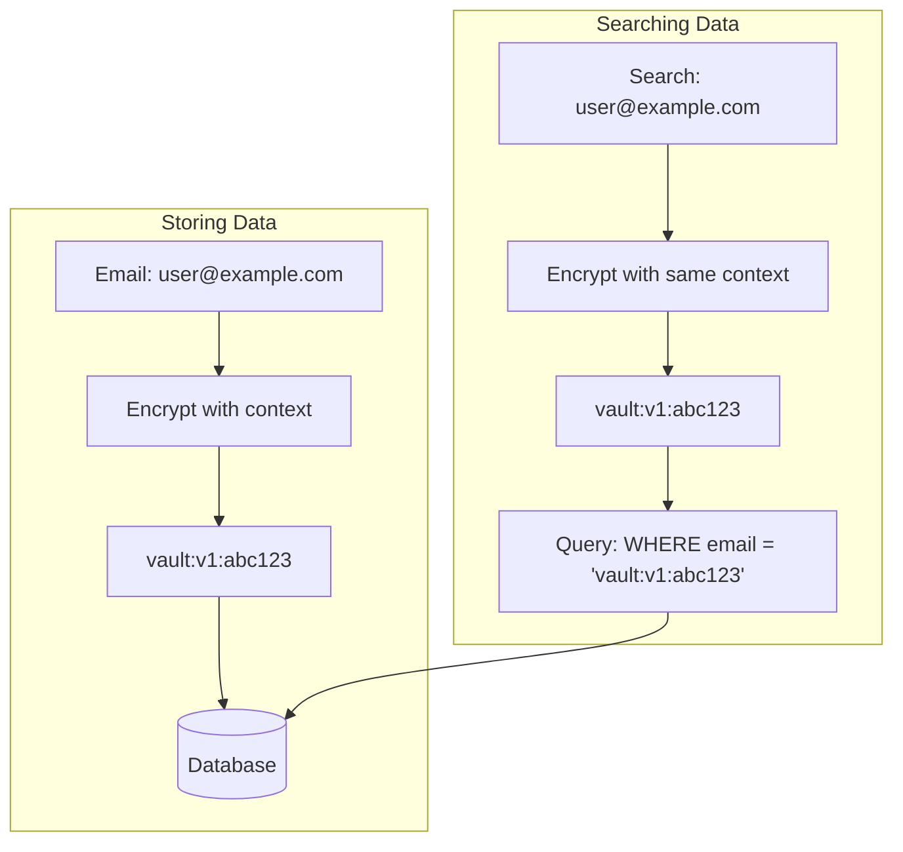

# How to Implement Vault Transit Secrets Engine

Author: [nawazdhandala](https://www.github.com/nawazdhandala)

Tags: HashiCorp Vault, Transit Secrets Engine, Encryption, Data Protection, Security, Key Management

Description: A practical guide to implementing HashiCorp Vault's Transit Secrets Engine for encryption as a service. Learn how to encrypt, decrypt, sign, and verify data without managing encryption keys in your applications.

---

> Managing encryption keys in applications is risky and complex. One leaked key compromises all your encrypted data. HashiCorp Vault's Transit Secrets Engine solves this by providing encryption as a service, where keys never leave Vault and your applications simply make API calls to encrypt or decrypt data.

The Transit Secrets Engine handles cryptographic operations on data in-transit. Unlike other secrets engines that store data, Transit only performs operations and returns results. Your applications send plaintext to Vault, receive ciphertext back, and never touch the actual encryption keys.

---

## How Transit Secrets Engine Works

The Transit engine acts as a cryptographic service. Applications send data to Vault, which performs encryption using keys stored securely within Vault, then returns the encrypted result. The keys themselves never leave Vault's memory.



---

## Setting Up the Transit Engine

### Enable the Transit Engine

First, enable the transit secrets engine in Vault:

```bash
# Enable the transit secrets engine at the default path
vault secrets enable transit

# Verify it's enabled
vault secrets list
```

You can also enable it at a custom path if you need multiple instances:

```bash
# Enable at a custom path for different environments
vault secrets enable -path=transit-prod transit
vault secrets enable -path=transit-dev transit
```

### Create Encryption Keys

Create keys for different purposes. Each key can have its own configuration:

```bash
# Create a key for encrypting user data
# Uses AES-256-GCM by default
vault write -f transit/keys/user-data

# Create a key for encrypting payment information
# Explicitly specify the key type
vault write transit/keys/payment-data type=aes256-gcm256

# Create an RSA key for signing operations
vault write transit/keys/signing-key type=rsa-4096

# Create a key that supports convergent encryption
# Same plaintext + context always produces same ciphertext
vault write transit/keys/deterministic-key \
    type=aes256-gcm256 \
    convergent_encryption=true \
    derived=true
```

### Key Configuration Options

Configure key rotation and export policies:

```bash
# Enable automatic key rotation every 30 days
vault write transit/keys/user-data/config \
    auto_rotate_period=720h

# Allow exporting the key (use with caution)
vault write transit/keys/backup-key/config \
    exportable=true \
    allow_plaintext_backup=true

# Set minimum decryption version
# Prevents decryption with old key versions
vault write transit/keys/user-data/config \
    min_decryption_version=2

# Set minimum encryption version
# Forces use of newer key versions
vault write transit/keys/user-data/config \
    min_encryption_version=3
```

---

## Basic Encryption and Decryption

### Encrypting Data

Vault requires plaintext to be base64 encoded before encryption:

```bash
# Encode plaintext as base64
PLAINTEXT=$(echo -n "my secret data" | base64)

# Encrypt the data
vault write transit/encrypt/user-data plaintext=$PLAINTEXT

# Response:
# Key           Value
# ---           -----
# ciphertext    vault:v1:8SDd3WHDOjf7mq69CyCqy...
# key_version   1
```

### Decrypting Data

Send the ciphertext back to get the original plaintext:

```bash
# Decrypt the ciphertext
vault write transit/decrypt/user-data \
    ciphertext="vault:v1:8SDd3WHDOjf7mq69CyCqy..."

# Response:
# Key          Value
# ---          -----
# plaintext    bXkgc2VjcmV0IGRhdGE=

# Decode the base64 result
echo "bXkgc2VjcmV0IGRhdGE=" | base64 -d
# Output: my secret data
```

### Batch Operations

Encrypt or decrypt multiple items in a single request:

```bash
# Batch encrypt multiple values
vault write transit/encrypt/user-data \
    batch_input='[
        {"plaintext": "'$(echo -n "data1" | base64)'"},
        {"plaintext": "'$(echo -n "data2" | base64)'"},
        {"plaintext": "'$(echo -n "data3" | base64)'"}
    ]'

# Batch decrypt
vault write transit/decrypt/user-data \
    batch_input='[
        {"ciphertext": "vault:v1:abc..."},
        {"ciphertext": "vault:v1:def..."},
        {"ciphertext": "vault:v1:ghi..."}
    ]'
```

---

## Key Rotation and Rewrapping

### Rotate Keys

Key rotation creates a new version while keeping old versions for decryption:

```bash
# Rotate the encryption key
vault write -f transit/keys/user-data/rotate

# Check key versions
vault read transit/keys/user-data

# Output shows:
# keys            map[1:... 2:... 3:...]
# latest_version  3
```

### Rewrap Ciphertext

After rotation, rewrap old ciphertext to use the latest key version:

```bash
# Rewrap ciphertext to use the latest key version
# This doesn't expose the plaintext
vault write transit/rewrap/user-data \
    ciphertext="vault:v1:8SDd3WHDOjf7mq69CyCqy..."

# Response contains ciphertext encrypted with latest key
# Key          Value
# ---          -----
# ciphertext   vault:v3:Jk2x9...
# key_version  3
```



---

## Implementing in Python

Here's a complete Python implementation for using the Transit engine:

```python
# vault_transit.py
import hvac
import base64
import os
from typing import Optional, List, Dict, Any

class VaultTransit:
    """
    Client for HashiCorp Vault Transit Secrets Engine.
    Provides encryption, decryption, signing, and key management operations.
    """

    def __init__(
        self,
        vault_addr: str = None,
        vault_token: str = None,
        mount_point: str = "transit"
    ):
        """
        Initialize the Vault Transit client.

        Args:
            vault_addr: Vault server address (default: VAULT_ADDR env var)
            vault_token: Vault authentication token (default: VAULT_TOKEN env var)
            mount_point: Transit engine mount path (default: "transit")
        """
        self.vault_addr = vault_addr or os.getenv("VAULT_ADDR", "http://localhost:8200")
        self.vault_token = vault_token or os.getenv("VAULT_TOKEN")
        self.mount_point = mount_point

        # Initialize the Vault client
        self.client = hvac.Client(
            url=self.vault_addr,
            token=self.vault_token
        )

        # Verify connection
        if not self.client.is_authenticated():
            raise ValueError("Failed to authenticate with Vault")

    def encrypt(
        self,
        key_name: str,
        plaintext: str,
        context: bytes = None
    ) -> str:
        """
        Encrypt plaintext using the specified key.

        Args:
            key_name: Name of the encryption key in Vault
            plaintext: The data to encrypt (will be base64 encoded)
            context: Optional context for derived keys (convergent encryption)

        Returns:
            Ciphertext string (format: vault:vN:base64data)
        """
        # Base64 encode the plaintext (Vault requirement)
        encoded_plaintext = base64.b64encode(plaintext.encode()).decode()

        # Build request parameters
        params = {"plaintext": encoded_plaintext}

        # Add context for convergent/derived encryption
        if context:
            params["context"] = base64.b64encode(context).decode()

        # Call Vault Transit encrypt endpoint
        response = self.client.secrets.transit.encrypt_data(
            name=key_name,
            mount_point=self.mount_point,
            **params
        )

        return response["data"]["ciphertext"]

    def decrypt(
        self,
        key_name: str,
        ciphertext: str,
        context: bytes = None
    ) -> str:
        """
        Decrypt ciphertext using the specified key.

        Args:
            key_name: Name of the encryption key in Vault
            ciphertext: The ciphertext to decrypt (vault:vN:base64data format)
            context: Optional context (must match encryption context)

        Returns:
            Decrypted plaintext string
        """
        params = {"ciphertext": ciphertext}

        if context:
            params["context"] = base64.b64encode(context).decode()

        response = self.client.secrets.transit.decrypt_data(
            name=key_name,
            mount_point=self.mount_point,
            **params
        )

        # Decode the base64 plaintext
        encoded_plaintext = response["data"]["plaintext"]
        return base64.b64decode(encoded_plaintext).decode()

    def encrypt_batch(
        self,
        key_name: str,
        plaintexts: List[str],
        context: bytes = None
    ) -> List[str]:
        """
        Encrypt multiple plaintext values in a single request.

        Args:
            key_name: Name of the encryption key
            plaintexts: List of plaintext strings to encrypt
            context: Optional context for all items

        Returns:
            List of ciphertext strings
        """
        batch_input = []

        for plaintext in plaintexts:
            item = {
                "plaintext": base64.b64encode(plaintext.encode()).decode()
            }
            if context:
                item["context"] = base64.b64encode(context).decode()
            batch_input.append(item)

        response = self.client.secrets.transit.encrypt_data(
            name=key_name,
            mount_point=self.mount_point,
            batch_input=batch_input
        )

        return [item["ciphertext"] for item in response["data"]["batch_results"]]

    def decrypt_batch(
        self,
        key_name: str,
        ciphertexts: List[str],
        context: bytes = None
    ) -> List[str]:
        """
        Decrypt multiple ciphertext values in a single request.

        Args:
            key_name: Name of the encryption key
            ciphertexts: List of ciphertext strings to decrypt
            context: Optional context for all items

        Returns:
            List of plaintext strings
        """
        batch_input = []

        for ciphertext in ciphertexts:
            item = {"ciphertext": ciphertext}
            if context:
                item["context"] = base64.b64encode(context).decode()
            batch_input.append(item)

        response = self.client.secrets.transit.decrypt_data(
            name=key_name,
            mount_point=self.mount_point,
            batch_input=batch_input
        )

        plaintexts = []
        for item in response["data"]["batch_results"]:
            decoded = base64.b64decode(item["plaintext"]).decode()
            plaintexts.append(decoded)

        return plaintexts

    def rewrap(
        self,
        key_name: str,
        ciphertext: str,
        context: bytes = None
    ) -> str:
        """
        Rewrap ciphertext with the latest key version.
        Does not expose plaintext during the operation.

        Args:
            key_name: Name of the encryption key
            ciphertext: Ciphertext to rewrap
            context: Optional context (must match original)

        Returns:
            New ciphertext encrypted with latest key version
        """
        params = {"ciphertext": ciphertext}

        if context:
            params["context"] = base64.b64encode(context).decode()

        response = self.client.secrets.transit.rewrap_data(
            name=key_name,
            mount_point=self.mount_point,
            **params
        )

        return response["data"]["ciphertext"]

    def rotate_key(self, key_name: str) -> None:
        """
        Rotate the encryption key to a new version.
        Old versions are retained for decryption.

        Args:
            key_name: Name of the key to rotate
        """
        self.client.secrets.transit.rotate_key(
            name=key_name,
            mount_point=self.mount_point
        )

    def create_key(
        self,
        key_name: str,
        key_type: str = "aes256-gcm96",
        derived: bool = False,
        convergent: bool = False,
        exportable: bool = False
    ) -> None:
        """
        Create a new encryption key.

        Args:
            key_name: Name for the new key
            key_type: Key type (aes256-gcm96, rsa-4096, etc.)
            derived: Enable key derivation for context-based keys
            convergent: Enable convergent encryption (same input = same output)
            exportable: Allow key export (use with caution)
        """
        self.client.secrets.transit.create_key(
            name=key_name,
            mount_point=self.mount_point,
            key_type=key_type,
            derived=derived,
            convergent_encryption=convergent,
            exportable=exportable
        )

    def get_key_info(self, key_name: str) -> Dict[str, Any]:
        """
        Get information about a key including versions and configuration.

        Args:
            key_name: Name of the key

        Returns:
            Dictionary with key information
        """
        response = self.client.secrets.transit.read_key(
            name=key_name,
            mount_point=self.mount_point
        )
        return response["data"]
```

### Usage Example

```python
# example_usage.py
from vault_transit import VaultTransit

# Initialize the client
transit = VaultTransit(
    vault_addr="http://vault.example.com:8200",
    vault_token="s.mytoken123"
)

# Create a key for user data encryption
transit.create_key(
    key_name="user-pii",
    key_type="aes256-gcm96"
)

# Encrypt sensitive data
ssn = "123-45-6789"
encrypted_ssn = transit.encrypt("user-pii", ssn)
print(f"Encrypted: {encrypted_ssn}")
# Output: Encrypted: vault:v1:8SDd3WHDOjf7mq69CyCqy...

# Store encrypted_ssn in your database
# ...

# Later, decrypt when needed
decrypted_ssn = transit.decrypt("user-pii", encrypted_ssn)
print(f"Decrypted: {decrypted_ssn}")
# Output: Decrypted: 123-45-6789

# Batch operations for efficiency
emails = [
    "user1@example.com",
    "user2@example.com",
    "user3@example.com"
]
encrypted_emails = transit.encrypt_batch("user-pii", emails)

# Decrypt batch
decrypted_emails = transit.decrypt_batch("user-pii", encrypted_emails)
```

---

## Implementing in Go

Here's a Go implementation using the official Vault client:

```go
// vault_transit.go
package vault

import (
    "context"
    "encoding/base64"
    "fmt"

    vault "github.com/hashicorp/vault/api"
)

// TransitClient provides encryption operations using Vault Transit
type TransitClient struct {
    client     *vault.Client
    mountPoint string
}

// NewTransitClient creates a new Transit client
func NewTransitClient(address, token, mountPoint string) (*TransitClient, error) {
    // Configure the Vault client
    config := vault.DefaultConfig()
    config.Address = address

    client, err := vault.NewClient(config)
    if err != nil {
        return nil, fmt.Errorf("failed to create vault client: %w", err)
    }

    // Set the authentication token
    client.SetToken(token)

    // Verify connectivity
    _, err = client.Auth().Token().LookupSelf()
    if err != nil {
        return nil, fmt.Errorf("failed to authenticate: %w", err)
    }

    return &TransitClient{
        client:     client,
        mountPoint: mountPoint,
    }, nil
}

// Encrypt encrypts plaintext using the specified key
func (t *TransitClient) Encrypt(ctx context.Context, keyName, plaintext string) (string, error) {
    // Base64 encode the plaintext
    encoded := base64.StdEncoding.EncodeToString([]byte(plaintext))

    // Build the request path
    path := fmt.Sprintf("%s/encrypt/%s", t.mountPoint, keyName)

    // Write to Vault
    secret, err := t.client.Logical().WriteWithContext(ctx, path, map[string]interface{}{
        "plaintext": encoded,
    })
    if err != nil {
        return "", fmt.Errorf("encryption failed: %w", err)
    }

    // Extract ciphertext from response
    ciphertext, ok := secret.Data["ciphertext"].(string)
    if !ok {
        return "", fmt.Errorf("invalid response: missing ciphertext")
    }

    return ciphertext, nil
}

// Decrypt decrypts ciphertext using the specified key
func (t *TransitClient) Decrypt(ctx context.Context, keyName, ciphertext string) (string, error) {
    path := fmt.Sprintf("%s/decrypt/%s", t.mountPoint, keyName)

    secret, err := t.client.Logical().WriteWithContext(ctx, path, map[string]interface{}{
        "ciphertext": ciphertext,
    })
    if err != nil {
        return "", fmt.Errorf("decryption failed: %w", err)
    }

    // Extract and decode plaintext
    encodedPlaintext, ok := secret.Data["plaintext"].(string)
    if !ok {
        return "", fmt.Errorf("invalid response: missing plaintext")
    }

    plaintext, err := base64.StdEncoding.DecodeString(encodedPlaintext)
    if err != nil {
        return "", fmt.Errorf("failed to decode plaintext: %w", err)
    }

    return string(plaintext), nil
}

// EncryptWithContext encrypts with additional context for derived keys
func (t *TransitClient) EncryptWithContext(
    ctx context.Context,
    keyName, plaintext string,
    encContext []byte,
) (string, error) {
    encoded := base64.StdEncoding.EncodeToString([]byte(plaintext))
    encodedContext := base64.StdEncoding.EncodeToString(encContext)

    path := fmt.Sprintf("%s/encrypt/%s", t.mountPoint, keyName)

    secret, err := t.client.Logical().WriteWithContext(ctx, path, map[string]interface{}{
        "plaintext": encoded,
        "context":   encodedContext,
    })
    if err != nil {
        return "", fmt.Errorf("encryption failed: %w", err)
    }

    return secret.Data["ciphertext"].(string), nil
}

// Rewrap re-encrypts ciphertext with the latest key version
func (t *TransitClient) Rewrap(ctx context.Context, keyName, ciphertext string) (string, error) {
    path := fmt.Sprintf("%s/rewrap/%s", t.mountPoint, keyName)

    secret, err := t.client.Logical().WriteWithContext(ctx, path, map[string]interface{}{
        "ciphertext": ciphertext,
    })
    if err != nil {
        return "", fmt.Errorf("rewrap failed: %w", err)
    }

    return secret.Data["ciphertext"].(string), nil
}

// RotateKey rotates the encryption key to a new version
func (t *TransitClient) RotateKey(ctx context.Context, keyName string) error {
    path := fmt.Sprintf("%s/keys/%s/rotate", t.mountPoint, keyName)

    _, err := t.client.Logical().WriteWithContext(ctx, path, nil)
    if err != nil {
        return fmt.Errorf("key rotation failed: %w", err)
    }

    return nil
}

// CreateKey creates a new encryption key
func (t *TransitClient) CreateKey(ctx context.Context, keyName, keyType string) error {
    path := fmt.Sprintf("%s/keys/%s", t.mountPoint, keyName)

    _, err := t.client.Logical().WriteWithContext(ctx, path, map[string]interface{}{
        "type": keyType,
    })
    if err != nil {
        return fmt.Errorf("key creation failed: %w", err)
    }

    return nil
}
```

### Go Usage Example

```go
// main.go
package main

import (
    "context"
    "fmt"
    "log"
)

func main() {
    ctx := context.Background()

    // Initialize the Transit client
    transit, err := NewTransitClient(
        "http://vault.example.com:8200",
        "s.mytoken123",
        "transit",
    )
    if err != nil {
        log.Fatalf("Failed to create client: %v", err)
    }

    // Create a key
    err = transit.CreateKey(ctx, "api-keys", "aes256-gcm96")
    if err != nil {
        log.Printf("Key may already exist: %v", err)
    }

    // Encrypt an API key
    apiKey := "sk_live_abc123xyz789"
    encrypted, err := transit.Encrypt(ctx, "api-keys", apiKey)
    if err != nil {
        log.Fatalf("Encryption failed: %v", err)
    }
    fmt.Printf("Encrypted: %s\n", encrypted)

    // Decrypt it back
    decrypted, err := transit.Decrypt(ctx, "api-keys", encrypted)
    if err != nil {
        log.Fatalf("Decryption failed: %v", err)
    }
    fmt.Printf("Decrypted: %s\n", decrypted)

    // Rotate the key
    err = transit.RotateKey(ctx, "api-keys")
    if err != nil {
        log.Fatalf("Rotation failed: %v", err)
    }

    // Rewrap with new key version
    rewrapped, err := transit.Rewrap(ctx, "api-keys", encrypted)
    if err != nil {
        log.Fatalf("Rewrap failed: %v", err)
    }
    fmt.Printf("Rewrapped: %s\n", rewrapped)
}
```

---

## Signing and Verification

The Transit engine also supports cryptographic signing for data integrity verification.

### Generate Signature

```bash
# Create an RSA signing key
vault write transit/keys/signing-key type=rsa-4096

# Sign data
DATA=$(echo -n "important document content" | base64)
vault write transit/sign/signing-key input=$DATA

# Response:
# signature    vault:v1:MEUCIQDx...
```

### Verify Signature

```bash
# Verify the signature
vault write transit/verify/signing-key \
    input=$DATA \
    signature="vault:v1:MEUCIQDx..."

# Response:
# valid    true
```

### Python Signing Implementation

```python
# signing.py
def sign_data(self, key_name: str, data: str, hash_algorithm: str = "sha2-256") -> str:
    """
    Sign data using the specified key.

    Args:
        key_name: Name of the signing key (must be RSA or ECDSA type)
        data: Data to sign
        hash_algorithm: Hash algorithm (sha2-256, sha2-384, sha2-512)

    Returns:
        Signature string
    """
    encoded_data = base64.b64encode(data.encode()).decode()

    response = self.client.secrets.transit.sign_data(
        name=key_name,
        mount_point=self.mount_point,
        hash_input=encoded_data,
        hash_algorithm=hash_algorithm
    )

    return response["data"]["signature"]

def verify_signature(
    self,
    key_name: str,
    data: str,
    signature: str,
    hash_algorithm: str = "sha2-256"
) -> bool:
    """
    Verify a signature against data.

    Args:
        key_name: Name of the signing key
        data: Original data that was signed
        signature: Signature to verify
        hash_algorithm: Hash algorithm used during signing

    Returns:
        True if signature is valid, False otherwise
    """
    encoded_data = base64.b64encode(data.encode()).decode()

    response = self.client.secrets.transit.verify_signed_data(
        name=key_name,
        mount_point=self.mount_point,
        hash_input=encoded_data,
        signature=signature,
        hash_algorithm=hash_algorithm
    )

    return response["data"]["valid"]
```

---

## Access Control with Policies

Create Vault policies to control who can use which keys and operations:

```hcl
# transit-encrypt-only.hcl
# Policy for applications that only need to encrypt data

# Allow encrypting with user-data key
path "transit/encrypt/user-data" {
  capabilities = ["update"]
}

# Allow encrypting with payment-data key
path "transit/encrypt/payment-data" {
  capabilities = ["update"]
}

# Deny all other transit operations
path "transit/*" {
  capabilities = ["deny"]
}
```

```hcl
# transit-full-access.hcl
# Policy for services that need full transit access

# Allow all operations on specific keys
path "transit/encrypt/user-data" {
  capabilities = ["update"]
}

path "transit/decrypt/user-data" {
  capabilities = ["update"]
}

path "transit/rewrap/user-data" {
  capabilities = ["update"]
}

# Allow key rotation for admins
path "transit/keys/user-data/rotate" {
  capabilities = ["update"]
}

# Allow reading key configuration
path "transit/keys/user-data" {
  capabilities = ["read"]
}
```

```hcl
# transit-admin.hcl
# Policy for key management operations

# Allow creating and managing keys
path "transit/keys/*" {
  capabilities = ["create", "read", "update", "delete", "list"]
}

# Allow all transit operations
path "transit/*" {
  capabilities = ["create", "read", "update", "delete", "list"]
}
```

Apply the policies:

```bash
# Create the policies
vault policy write transit-encrypt-only transit-encrypt-only.hcl
vault policy write transit-full-access transit-full-access.hcl
vault policy write transit-admin transit-admin.hcl

# Create tokens with specific policies
vault token create -policy=transit-encrypt-only -ttl=24h
vault token create -policy=transit-full-access -ttl=8h
```

---

## Database Field Encryption Pattern

A common use case is encrypting specific database fields while keeping others in plaintext:

```python
# models.py
from dataclasses import dataclass
from typing import Optional
from vault_transit import VaultTransit

# Initialize transit client as a singleton
transit = VaultTransit()

@dataclass
class User:
    """User model with encrypted PII fields."""

    id: int
    email: str  # Stored in plaintext for querying
    name: str

    # These fields are encrypted at rest
    _ssn_encrypted: Optional[str] = None
    _phone_encrypted: Optional[str] = None
    _address_encrypted: Optional[str] = None

    @property
    def ssn(self) -> Optional[str]:
        """Decrypt SSN on access."""
        if self._ssn_encrypted:
            return transit.decrypt("user-pii", self._ssn_encrypted)
        return None

    @ssn.setter
    def ssn(self, value: str) -> None:
        """Encrypt SSN on assignment."""
        self._ssn_encrypted = transit.encrypt("user-pii", value)

    @property
    def phone(self) -> Optional[str]:
        """Decrypt phone on access."""
        if self._phone_encrypted:
            return transit.decrypt("user-pii", self._phone_encrypted)
        return None

    @phone.setter
    def phone(self, value: str) -> None:
        """Encrypt phone on assignment."""
        self._phone_encrypted = transit.encrypt("user-pii", value)

    @property
    def address(self) -> Optional[str]:
        """Decrypt address on access."""
        if self._address_encrypted:
            return transit.decrypt("user-pii", self._address_encrypted)
        return None

    @address.setter
    def address(self, value: str) -> None:
        """Encrypt address on assignment."""
        self._address_encrypted = transit.encrypt("user-pii", value)

    def to_dict_for_storage(self) -> dict:
        """Return dictionary with encrypted fields for database storage."""
        return {
            "id": self.id,
            "email": self.email,
            "name": self.name,
            "ssn": self._ssn_encrypted,
            "phone": self._phone_encrypted,
            "address": self._address_encrypted
        }

# Usage
user = User(id=1, email="john@example.com", name="John Doe")
user.ssn = "123-45-6789"
user.phone = "+1-555-123-4567"
user.address = "123 Main St, City, ST 12345"

# Store encrypted data in database
db_record = user.to_dict_for_storage()
# {
#     "id": 1,
#     "email": "john@example.com",
#     "name": "John Doe",
#     "ssn": "vault:v1:8SDd...",
#     "phone": "vault:v1:7Kxm...",
#     "address": "vault:v1:Pqr2..."
# }
```

---

## Convergent Encryption for Searchable Data

Convergent encryption produces the same ciphertext for the same plaintext, enabling encrypted searches:

```python
# convergent_search.py
from vault_transit import VaultTransit

class EncryptedSearchIndex:
    """
    Enables searching encrypted data using convergent encryption.
    Same plaintext always produces same ciphertext when using
    the same context, allowing equality comparisons.
    """

    def __init__(self, key_name: str):
        self.transit = VaultTransit()
        self.key_name = key_name

        # Create convergent key if it doesn't exist
        try:
            self.transit.create_key(
                key_name=key_name,
                derived=True,
                convergent=True
            )
        except Exception:
            pass  # Key may already exist

    def encrypt_for_index(self, value: str, context: str) -> str:
        """
        Encrypt a value for indexing.
        Same value + context always produces same ciphertext.

        Args:
            value: Value to encrypt
            context: Context string (e.g., field name)

        Returns:
            Deterministic ciphertext
        """
        return self.transit.encrypt(
            self.key_name,
            value,
            context=context.encode()
        )

    def search_token(self, search_value: str, context: str) -> str:
        """
        Generate a search token for an encrypted field.

        Args:
            search_value: Value to search for
            context: Same context used during encryption

        Returns:
            Encrypted token that matches stored values
        """
        return self.encrypt_for_index(search_value, context)

# Usage example
index = EncryptedSearchIndex("search-index")

# When storing user data
email = "user@example.com"
encrypted_email = index.encrypt_for_index(email, "email")

# Store in database
# INSERT INTO users (email_encrypted, ...) VALUES ('vault:v1:abc...', ...)

# When searching
search_email = "user@example.com"
search_token = index.search_token(search_email, "email")

# Query database with encrypted token
# SELECT * FROM users WHERE email_encrypted = 'vault:v1:abc...'
```



---

## Key Rotation Strategy

Implement a background process to rotate keys and rewrap data:

```python
# key_rotation.py
import logging
from datetime import datetime, timedelta
from typing import List, Tuple
from vault_transit import VaultTransit

logging.basicConfig(level=logging.INFO)
logger = logging.getLogger(__name__)

class KeyRotationManager:
    """Manages key rotation and data rewrapping for Transit keys."""

    def __init__(self, transit: VaultTransit):
        self.transit = transit

    def should_rotate(self, key_name: str, max_age_days: int = 30) -> bool:
        """
        Check if a key should be rotated based on age.

        Args:
            key_name: Name of the key to check
            max_age_days: Maximum age before rotation

        Returns:
            True if key should be rotated
        """
        key_info = self.transit.get_key_info(key_name)
        latest_version = key_info["latest_version"]

        # Get creation time of latest version
        keys = key_info["keys"]
        latest_key = keys[str(latest_version)]
        creation_time = datetime.fromisoformat(
            latest_key["creation_time"].replace("Z", "+00:00")
        )

        age = datetime.now(creation_time.tzinfo) - creation_time
        return age > timedelta(days=max_age_days)

    def rotate_key(self, key_name: str) -> int:
        """
        Rotate a key and return the new version number.

        Args:
            key_name: Name of the key to rotate

        Returns:
            New key version number
        """
        self.transit.rotate_key(key_name)
        key_info = self.transit.get_key_info(key_name)
        new_version = key_info["latest_version"]
        logger.info(f"Rotated key '{key_name}' to version {new_version}")
        return new_version

    def rewrap_batch(
        self,
        key_name: str,
        ciphertexts: List[str],
        batch_size: int = 100
    ) -> List[Tuple[str, str]]:
        """
        Rewrap a list of ciphertexts to use the latest key version.

        Args:
            key_name: Name of the encryption key
            ciphertexts: List of ciphertexts to rewrap
            batch_size: Number of items per batch

        Returns:
            List of (old_ciphertext, new_ciphertext) tuples
        """
        results = []

        for i in range(0, len(ciphertexts), batch_size):
            batch = ciphertexts[i:i + batch_size]

            for old_ciphertext in batch:
                # Extract version from ciphertext
                version = self._get_ciphertext_version(old_ciphertext)
                key_info = self.transit.get_key_info(key_name)

                # Only rewrap if not already using latest version
                if version < key_info["latest_version"]:
                    new_ciphertext = self.transit.rewrap(key_name, old_ciphertext)
                    results.append((old_ciphertext, new_ciphertext))
                    logger.debug(f"Rewrapped from v{version} to latest")

            logger.info(f"Processed batch {i//batch_size + 1}")

        return results

    def _get_ciphertext_version(self, ciphertext: str) -> int:
        """Extract version number from ciphertext (vault:vN:...)."""
        parts = ciphertext.split(":")
        if len(parts) >= 2 and parts[1].startswith("v"):
            return int(parts[1][1:])
        return 0

# Usage in a scheduled job
def rotate_and_rewrap_job():
    """Scheduled job to rotate keys and rewrap data."""
    transit = VaultTransit()
    rotation_manager = KeyRotationManager(transit)

    keys_to_manage = ["user-pii", "payment-data", "api-keys"]

    for key_name in keys_to_manage:
        # Check if rotation is needed
        if rotation_manager.should_rotate(key_name, max_age_days=30):
            logger.info(f"Rotating key: {key_name}")
            rotation_manager.rotate_key(key_name)

            # Fetch all ciphertexts from database for this key
            # This is application-specific
            ciphertexts = fetch_ciphertexts_from_db(key_name)

            # Rewrap in batches
            updates = rotation_manager.rewrap_batch(key_name, ciphertexts)

            # Update database with new ciphertexts
            for old_ct, new_ct in updates:
                update_ciphertext_in_db(old_ct, new_ct)

            logger.info(f"Rewrapped {len(updates)} records for {key_name}")
```

---

## Best Practices

### 1. Use Separate Keys for Different Data Types

```bash
# Create purpose-specific keys
vault write -f transit/keys/user-pii          # SSN, DOB, etc.
vault write -f transit/keys/payment-data      # Credit cards, bank accounts
vault write -f transit/keys/api-credentials   # API keys, tokens
vault write -f transit/keys/session-data      # Session tokens
```

### 2. Implement Proper Error Handling

```python
from hvac.exceptions import VaultError, Forbidden, InvalidPath

def safe_encrypt(transit: VaultTransit, key_name: str, data: str) -> str:
    """Encrypt with proper error handling."""
    try:
        return transit.encrypt(key_name, data)
    except Forbidden:
        logger.error(f"Permission denied for key: {key_name}")
        raise PermissionError(f"Not authorized to use key: {key_name}")
    except InvalidPath:
        logger.error(f"Key not found: {key_name}")
        raise KeyError(f"Encryption key not found: {key_name}")
    except VaultError as e:
        logger.error(f"Vault error: {e}")
        raise RuntimeError(f"Encryption service unavailable: {e}")
```

### 3. Cache Key Metadata

```python
from functools import lru_cache
from datetime import datetime, timedelta

class CachedTransitClient(VaultTransit):
    """Transit client with cached key metadata."""

    @lru_cache(maxsize=100)
    def _get_cached_key_info(self, key_name: str, cache_key: str) -> dict:
        """Cache key info with time-based invalidation."""
        return self.get_key_info(key_name)

    def get_key_info_cached(self, key_name: str, ttl_minutes: int = 5) -> dict:
        """Get key info with caching."""
        # Create cache key based on current time window
        time_window = datetime.now().replace(
            second=0, microsecond=0
        ).minute // ttl_minutes
        cache_key = f"{key_name}:{time_window}"
        return self._get_cached_key_info(key_name, cache_key)
```

### 4. Monitor Transit Operations

```python
import time
from prometheus_client import Counter, Histogram

# Metrics
TRANSIT_OPS = Counter(
    'vault_transit_operations_total',
    'Total Transit operations',
    ['operation', 'key', 'status']
)

TRANSIT_LATENCY = Histogram(
    'vault_transit_operation_duration_seconds',
    'Transit operation latency',
    ['operation', 'key']
)

def monitored_encrypt(transit: VaultTransit, key_name: str, data: str) -> str:
    """Encrypt with metrics collection."""
    start = time.time()
    try:
        result = transit.encrypt(key_name, data)
        TRANSIT_OPS.labels(operation='encrypt', key=key_name, status='success').inc()
        return result
    except Exception as e:
        TRANSIT_OPS.labels(operation='encrypt', key=key_name, status='error').inc()
        raise
    finally:
        TRANSIT_LATENCY.labels(operation='encrypt', key=key_name).observe(
            time.time() - start
        )
```

---

## Conclusion

Vault's Transit Secrets Engine provides a robust solution for encryption as a service. Key takeaways:

- **Keys never leave Vault**: Applications send data to Vault for encryption, eliminating key management in application code
- **Key rotation is seamless**: Rotate keys without re-encrypting all data immediately, then rewrap at your own pace
- **Granular access control**: Use Vault policies to control which applications can use which keys
- **Convergent encryption**: Enable searching encrypted data when needed

By centralizing cryptographic operations in Vault, you reduce the risk of key exposure and simplify compliance with data protection requirements.

---

*Need to monitor your Vault cluster and encryption operations? [OneUptime](https://oneuptime.com) provides infrastructure monitoring with custom metrics, alerting, and dashboards to keep your secrets management infrastructure healthy.*

**Related Reading:**
- [How to Implement Zero Trust Security in Kubernetes](https://oneuptime.com/blog/post/2026-01-06-kubernetes-network-policies-zero-trust/view)
- [How to Set Up Secrets Management with External Secrets Operator](https://oneuptime.com/blog/post/2026-02-09-external-secrets-operator-aws-secrets-manager/view)
