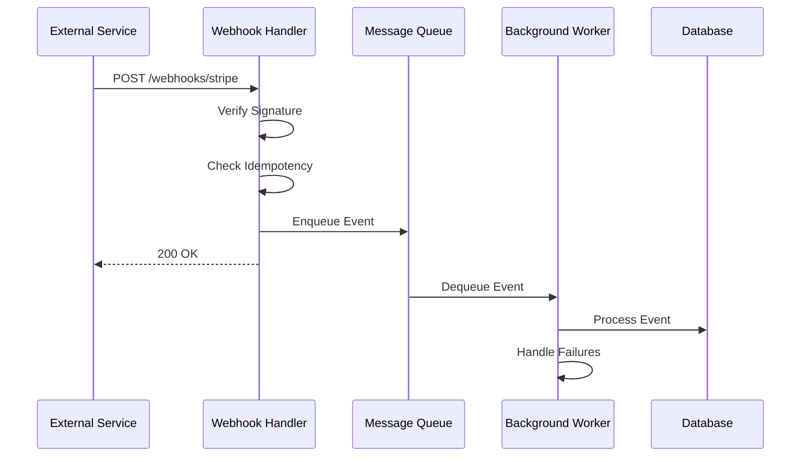

# How to Build Webhook Handlers in .NET

Author: [nawazdhandala](https://www.github.com/nawazdhandala)

Tags: .NET, ASP.NET Core, Webhooks, API Integration, Event-Driven, Security, Background Processing

Description: Learn how to build secure and reliable webhook handlers in .NET, including signature verification, idempotent processing, retry handling, and background job processing patterns.

---

Webhooks are HTTP callbacks that notify your application when events occur in external systems. They are the backbone of modern integrations with payment processors, CI/CD pipelines, messaging platforms, and countless other services. Building reliable webhook handlers requires careful attention to security, idempotency, and error handling.

## Webhook Architecture



## Basic Webhook Endpoint

### Simple Handler

```csharp
// WebhooksController.cs
[ApiController]
[Route("webhooks")]
public class WebhooksController : ControllerBase
{
    private readonly IWebhookProcessor _processor;
    private readonly ILogger<WebhooksController> _logger;

    public WebhooksController(
        IWebhookProcessor processor,
        ILogger<WebhooksController> logger)
    {
        _processor = processor;
        _logger = logger;
    }

    [HttpPost("stripe")]
    public async Task<IActionResult> HandleStripeWebhook()
    {
        // Read raw body for signature verification
        var json = await new StreamReader(HttpContext.Request.Body).ReadToEndAsync();

        try
        {
            var stripeEvent = await _processor.ProcessStripeAsync(json, Request.Headers);

            _logger.LogInformation(
                "Processed Stripe webhook: {EventType} {EventId}",
                stripeEvent.Type,
                stripeEvent.Id);

            return Ok();
        }
        catch (WebhookSignatureException ex)
        {
            _logger.LogWarning(ex, "Invalid Stripe webhook signature");
            return Unauthorized();
        }
        catch (DuplicateEventException ex)
        {
            _logger.LogInformation("Duplicate webhook event: {EventId}", ex.EventId);
            return Ok(); // Return success for duplicates
        }
        catch (Exception ex)
        {
            _logger.LogError(ex, "Failed to process Stripe webhook");
            return StatusCode(500);
        }
    }
}
```

## Signature Verification

Always verify webhook signatures to ensure requests come from the expected source.

### Stripe Signature Verification

```csharp
// StripeWebhookProcessor.cs
public class StripeWebhookProcessor : IStripeWebhookProcessor
{
    private readonly string _webhookSecret;
    private readonly ILogger<StripeWebhookProcessor> _logger;

    public StripeWebhookProcessor(
        IConfiguration configuration,
        ILogger<StripeWebhookProcessor> logger)
    {
        _webhookSecret = configuration["Stripe:WebhookSecret"]
            ?? throw new InvalidOperationException("Stripe webhook secret not configured");
        _logger = logger;
    }

    public async Task<StripeEvent> ProcessAsync(string payload, IHeaderDictionary headers)
    {
        var signature = headers["Stripe-Signature"].FirstOrDefault()
            ?? throw new WebhookSignatureException("Missing Stripe-Signature header");

        try
        {
            // Stripe SDK handles signature verification
            var stripeEvent = EventUtility.ConstructEvent(
                payload,
                signature,
                _webhookSecret,
                throwOnApiVersionMismatch: false);

            return stripeEvent;
        }
        catch (StripeException ex)
        {
            throw new WebhookSignatureException("Invalid Stripe signature", ex);
        }
    }
}
```

### Generic HMAC Verification

```csharp
// HmacSignatureVerifier.cs
public class HmacSignatureVerifier
{
    public bool Verify(
        string payload,
        string signature,
        string secret,
        string algorithm = "HMACSHA256")
    {
        using var hmac = algorithm switch
        {
            "HMACSHA256" => (HMAC)new HMACSHA256(Encoding.UTF8.GetBytes(secret)),
            "HMACSHA512" => new HMACSHA512(Encoding.UTF8.GetBytes(secret)),
            _ => throw new ArgumentException($"Unsupported algorithm: {algorithm}")
        };

        var payloadBytes = Encoding.UTF8.GetBytes(payload);
        var computedHash = hmac.ComputeHash(payloadBytes);
        var computedSignature = Convert.ToHexString(computedHash).ToLowerInvariant();

        // Handle different signature formats
        var providedSignature = signature
            .Replace("sha256=", "")
            .Replace("sha512=", "")
            .ToLowerInvariant();

        // Use constant-time comparison to prevent timing attacks
        return CryptographicOperations.FixedTimeEquals(
            Encoding.UTF8.GetBytes(computedSignature),
            Encoding.UTF8.GetBytes(providedSignature));
    }
}

// Usage in controller
[HttpPost("github")]
public async Task<IActionResult> HandleGitHubWebhook()
{
    var payload = await new StreamReader(Request.Body).ReadToEndAsync();
    var signature = Request.Headers["X-Hub-Signature-256"].FirstOrDefault();

    if (string.IsNullOrEmpty(signature))
        return Unauthorized("Missing signature");

    var secret = _configuration["GitHub:WebhookSecret"];

    if (!_signatureVerifier.Verify(payload, signature, secret))
        return Unauthorized("Invalid signature");

    // Process the webhook
    var eventType = Request.Headers["X-GitHub-Event"].FirstOrDefault();
    await _processor.ProcessGitHubEventAsync(eventType, payload);

    return Ok();
}
```

## Idempotent Processing

Webhooks may be delivered multiple times. Implement idempotency to handle duplicates.

```csharp
// IdempotencyService.cs
public class IdempotencyService : IIdempotencyService
{
    private readonly IDistributedCache _cache;
    private readonly TimeSpan _lockDuration = TimeSpan.FromHours(24);

    public IdempotencyService(IDistributedCache cache)
    {
        _cache = cache;
    }

    public async Task<bool> TryAcquireLockAsync(string eventId)
    {
        var key = $"webhook:processed:{eventId}";

        // Try to set the key only if it does not exist
        var options = new DistributedCacheEntryOptions
        {
            AbsoluteExpirationRelativeToNow = _lockDuration
        };

        try
        {
            // Use Redis SET NX pattern or similar
            var existing = await _cache.GetStringAsync(key);
            if (existing != null)
                return false; // Already processed

            await _cache.SetStringAsync(key, DateTime.UtcNow.ToString("O"), options);
            return true;
        }
        catch
        {
            // If cache fails, allow processing (fail open for availability)
            return true;
        }
    }

    public async Task MarkAsProcessedAsync(string eventId)
    {
        var key = $"webhook:processed:{eventId}";
        var options = new DistributedCacheEntryOptions
        {
            AbsoluteExpirationRelativeToNow = _lockDuration
        };

        await _cache.SetStringAsync(key, DateTime.UtcNow.ToString("O"), options);
    }
}

// Using idempotency in handler
public class WebhookProcessor : IWebhookProcessor
{
    private readonly IIdempotencyService _idempotency;
    private readonly IEventHandler _handler;

    public async Task ProcessAsync(WebhookEvent webhookEvent)
    {
        // Check if already processed
        if (!await _idempotency.TryAcquireLockAsync(webhookEvent.Id))
        {
            throw new DuplicateEventException(webhookEvent.Id);
        }

        try
        {
            await _handler.HandleAsync(webhookEvent);
            await _idempotency.MarkAsProcessedAsync(webhookEvent.Id);
        }
        catch
        {
            // On failure, allow retry by not marking as processed
            throw;
        }
    }
}
```

## Background Processing

Respond quickly to webhooks and process asynchronously.

### Using Channels for Queuing

```csharp
// WebhookQueue.cs
public class WebhookQueue
{
    private readonly Channel<WebhookEvent> _channel;

    public WebhookQueue()
    {
        _channel = Channel.CreateBounded<WebhookEvent>(new BoundedChannelOptions(1000)
        {
            FullMode = BoundedChannelFullMode.Wait
        });
    }

    public async ValueTask EnqueueAsync(WebhookEvent webhookEvent, CancellationToken cancellationToken)
    {
        await _channel.Writer.WriteAsync(webhookEvent, cancellationToken);
    }

    public IAsyncEnumerable<WebhookEvent> DequeueAllAsync(CancellationToken cancellationToken)
    {
        return _channel.Reader.ReadAllAsync(cancellationToken);
    }
}

// WebhookWorker.cs
public class WebhookWorker : BackgroundService
{
    private readonly WebhookQueue _queue;
    private readonly IServiceProvider _services;
    private readonly ILogger<WebhookWorker> _logger;

    public WebhookWorker(
        WebhookQueue queue,
        IServiceProvider services,
        ILogger<WebhookWorker> logger)
    {
        _queue = queue;
        _services = services;
        _logger = logger;
    }

    protected override async Task ExecuteAsync(CancellationToken stoppingToken)
    {
        await foreach (var webhookEvent in _queue.DequeueAllAsync(stoppingToken))
        {
            using var scope = _services.CreateScope();
            var processor = scope.ServiceProvider.GetRequiredService<IWebhookProcessor>();

            try
            {
                await processor.ProcessEventAsync(webhookEvent);
            }
            catch (Exception ex)
            {
                _logger.LogError(ex,
                    "Failed to process webhook {EventType} {EventId}",
                    webhookEvent.Type,
                    webhookEvent.Id);

                // Requeue with retry count
                if (webhookEvent.RetryCount < 3)
                {
                    webhookEvent.RetryCount++;
                    await _queue.EnqueueAsync(webhookEvent, stoppingToken);
                }
            }
        }
    }
}

// Controller using the queue
[HttpPost("stripe")]
public async Task<IActionResult> HandleStripeWebhook()
{
    var json = await new StreamReader(Request.Body).ReadToEndAsync();
    var signature = Request.Headers["Stripe-Signature"].FirstOrDefault();

    // Verify signature synchronously
    var webhookEvent = _signatureVerifier.Verify(json, signature);

    // Queue for async processing
    await _queue.EnqueueAsync(webhookEvent, HttpContext.RequestAborted);

    // Return immediately
    return Ok();
}
```

### Using Message Broker

```csharp
// RabbitMQWebhookPublisher.cs
public class RabbitMQWebhookPublisher : IWebhookPublisher
{
    private readonly IConnection _connection;
    private readonly ILogger<RabbitMQWebhookPublisher> _logger;

    public async Task PublishAsync(WebhookEvent webhookEvent)
    {
        using var channel = _connection.CreateModel();

        channel.QueueDeclare(
            queue: "webhooks",
            durable: true,
            exclusive: false,
            autoDelete: false);

        var properties = channel.CreateBasicProperties();
        properties.Persistent = true;
        properties.Headers = new Dictionary<string, object>
        {
            ["event-type"] = webhookEvent.Type,
            ["event-id"] = webhookEvent.Id,
            ["source"] = webhookEvent.Source
        };

        var body = JsonSerializer.SerializeToUtf8Bytes(webhookEvent);

        channel.BasicPublish(
            exchange: "",
            routingKey: "webhooks",
            basicProperties: properties,
            body: body);

        _logger.LogInformation(
            "Published webhook to queue: {EventType} {EventId}",
            webhookEvent.Type,
            webhookEvent.Id);
    }
}
```

## Event Type Routing

Route different event types to appropriate handlers.

```csharp
// IWebhookEventHandler.cs
public interface IWebhookEventHandler
{
    string EventType { get; }
    Task HandleAsync(WebhookEvent webhookEvent, CancellationToken cancellationToken);
}

// PaymentSucceededHandler.cs
public class PaymentSucceededHandler : IWebhookEventHandler
{
    public string EventType => "payment_intent.succeeded";

    private readonly IOrderService _orderService;
    private readonly INotificationService _notifications;

    public PaymentSucceededHandler(
        IOrderService orderService,
        INotificationService notifications)
    {
        _orderService = orderService;
        _notifications = notifications;
    }

    public async Task HandleAsync(WebhookEvent webhookEvent, CancellationToken cancellationToken)
    {
        var paymentIntent = webhookEvent.Data.ToObject<PaymentIntent>();

        // Update order status
        await _orderService.MarkAsPaidAsync(paymentIntent.Metadata["order_id"]);

        // Send confirmation
        await _notifications.SendPaymentConfirmationAsync(paymentIntent.ReceiptEmail);
    }
}

// WebhookDispatcher.cs
public class WebhookDispatcher
{
    private readonly IEnumerable<IWebhookEventHandler> _handlers;
    private readonly ILogger<WebhookDispatcher> _logger;

    public WebhookDispatcher(
        IEnumerable<IWebhookEventHandler> handlers,
        ILogger<WebhookDispatcher> logger)
    {
        _handlers = handlers;
        _logger = logger;
    }

    public async Task DispatchAsync(WebhookEvent webhookEvent, CancellationToken cancellationToken)
    {
        var handler = _handlers.FirstOrDefault(h => h.EventType == webhookEvent.Type);

        if (handler == null)
        {
            _logger.LogWarning("No handler registered for event type: {EventType}", webhookEvent.Type);
            return;
        }

        await handler.HandleAsync(webhookEvent, cancellationToken);
    }
}

// Registration
builder.Services.AddScoped<IWebhookEventHandler, PaymentSucceededHandler>();
builder.Services.AddScoped<IWebhookEventHandler, PaymentFailedHandler>();
builder.Services.AddScoped<IWebhookEventHandler, SubscriptionCreatedHandler>();
builder.Services.AddScoped<WebhookDispatcher>();
```

## Retry Logic

Implement exponential backoff for failed webhook processing.

```csharp
// RetryPolicy.cs
public class WebhookRetryPolicy
{
    private readonly int _maxRetries;
    private readonly TimeSpan _baseDelay;

    public WebhookRetryPolicy(int maxRetries = 5, TimeSpan? baseDelay = null)
    {
        _maxRetries = maxRetries;
        _baseDelay = baseDelay ?? TimeSpan.FromSeconds(1);
    }

    public async Task<T> ExecuteAsync<T>(
        Func<Task<T>> operation,
        CancellationToken cancellationToken)
    {
        var attempts = 0;
        var exceptions = new List<Exception>();

        while (attempts < _maxRetries)
        {
            try
            {
                return await operation();
            }
            catch (Exception ex) when (IsTransient(ex))
            {
                exceptions.Add(ex);
                attempts++;

                if (attempts >= _maxRetries)
                    break;

                // Exponential backoff with jitter
                var delay = CalculateDelay(attempts);
                await Task.Delay(delay, cancellationToken);
            }
        }

        throw new AggregateException(
            $"Operation failed after {_maxRetries} attempts",
            exceptions);
    }

    private TimeSpan CalculateDelay(int attempt)
    {
        // Exponential backoff: 1s, 2s, 4s, 8s, 16s...
        var exponentialDelay = TimeSpan.FromTicks(_baseDelay.Ticks * (long)Math.Pow(2, attempt - 1));

        // Add jitter (up to 25% of the delay)
        var jitter = TimeSpan.FromMilliseconds(Random.Shared.Next(0, (int)(exponentialDelay.TotalMilliseconds * 0.25)));

        return exponentialDelay + jitter;
    }

    private bool IsTransient(Exception ex)
    {
        return ex is HttpRequestException
            || ex is TimeoutException
            || ex is SocketException;
    }
}
```

## Observability

Track webhook processing with logs and metrics.

```csharp
// WebhookMetrics.cs
public class WebhookMetrics
{
    private readonly Counter<long> _received;
    private readonly Counter<long> _processed;
    private readonly Counter<long> _failed;
    private readonly Histogram<double> _processingDuration;

    public WebhookMetrics(IMeterFactory meterFactory)
    {
        var meter = meterFactory.Create("Webhooks");

        _received = meter.CreateCounter<long>(
            "webhooks_received_total",
            "events",
            "Total webhook events received");

        _processed = meter.CreateCounter<long>(
            "webhooks_processed_total",
            "events",
            "Total webhook events processed successfully");

        _failed = meter.CreateCounter<long>(
            "webhooks_failed_total",
            "events",
            "Total webhook events that failed processing");

        _processingDuration = meter.CreateHistogram<double>(
            "webhooks_processing_duration_ms",
            "ms",
            "Webhook processing duration");
    }

    public void RecordReceived(string source, string eventType)
    {
        _received.Add(1,
            new KeyValuePair<string, object>("source", source),
            new KeyValuePair<string, object>("event_type", eventType));
    }

    public void RecordProcessed(string source, string eventType, double durationMs)
    {
        var tags = new[]
        {
            new KeyValuePair<string, object>("source", source),
            new KeyValuePair<string, object>("event_type", eventType)
        };

        _processed.Add(1, tags);
        _processingDuration.Record(durationMs, tags);
    }

    public void RecordFailed(string source, string eventType, string errorType)
    {
        _failed.Add(1,
            new KeyValuePair<string, object>("source", source),
            new KeyValuePair<string, object>("event_type", eventType),
            new KeyValuePair<string, object>("error_type", errorType));
    }
}
```

## Testing Webhooks

Test your handlers with mock events.

```csharp
// WebhookHandlerTests.cs
public class PaymentSucceededHandlerTests
{
    [Fact]
    public async Task ShouldUpdateOrderStatus_WhenPaymentSucceeds()
    {
        // Arrange
        var orderService = new Mock<IOrderService>();
        var notifications = new Mock<INotificationService>();

        var handler = new PaymentSucceededHandler(
            orderService.Object,
            notifications.Object);

        var webhookEvent = new WebhookEvent
        {
            Id = "evt_123",
            Type = "payment_intent.succeeded",
            Data = JObject.FromObject(new
            {
                id = "pi_123",
                amount = 5000,
                metadata = new { order_id = "order_456" },
                receipt_email = "customer@example.com"
            })
        };

        // Act
        await handler.HandleAsync(webhookEvent, CancellationToken.None);

        // Assert
        orderService.Verify(s => s.MarkAsPaidAsync("order_456"), Times.Once);
        notifications.Verify(n => n.SendPaymentConfirmationAsync("customer@example.com"), Times.Once);
    }
}

// Integration test with signature verification
public class WebhookIntegrationTests : IClassFixture<WebApplicationFactory<Program>>
{
    private readonly WebApplicationFactory<Program> _factory;

    [Fact]
    public async Task StripeWebhook_ShouldReject_InvalidSignature()
    {
        // Arrange
        var client = _factory.CreateClient();
        var payload = "{\"type\":\"test\"}";

        var request = new HttpRequestMessage(HttpMethod.Post, "/webhooks/stripe");
        request.Content = new StringContent(payload, Encoding.UTF8, "application/json");
        request.Headers.Add("Stripe-Signature", "invalid_signature");

        // Act
        var response = await client.SendAsync(request);

        // Assert
        Assert.Equal(HttpStatusCode.Unauthorized, response.StatusCode);
    }
}
```

## Summary

| Aspect | Implementation |
|--------|----------------|
| **Signature Verification** | HMAC comparison with constant-time check |
| **Idempotency** | Distributed cache for event deduplication |
| **Async Processing** | Channels or message broker for queuing |
| **Routing** | Handler interface with event type dispatch |
| **Retry** | Exponential backoff with jitter |
| **Observability** | Counters and histograms for monitoring |

Webhook handlers are critical integration points that require careful design. Always verify signatures, handle duplicates gracefully, respond quickly, and process asynchronously. With these patterns, your webhook handlers will be reliable, secure, and easy to maintain.
