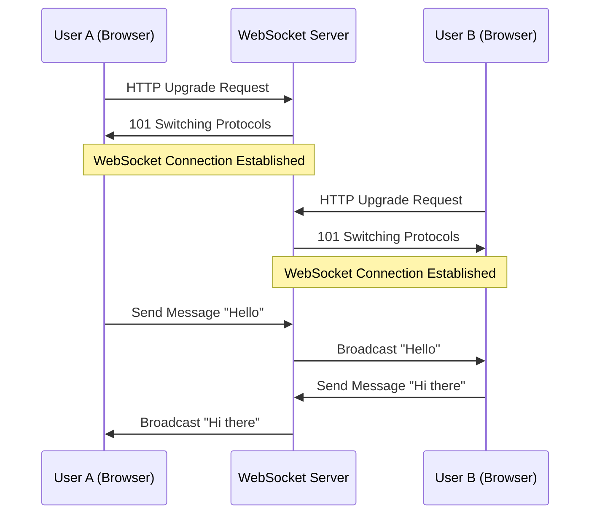
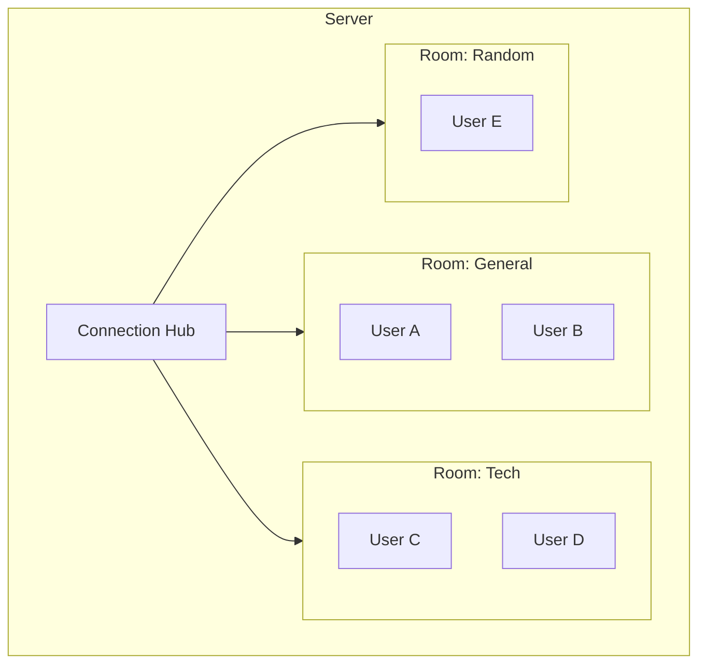
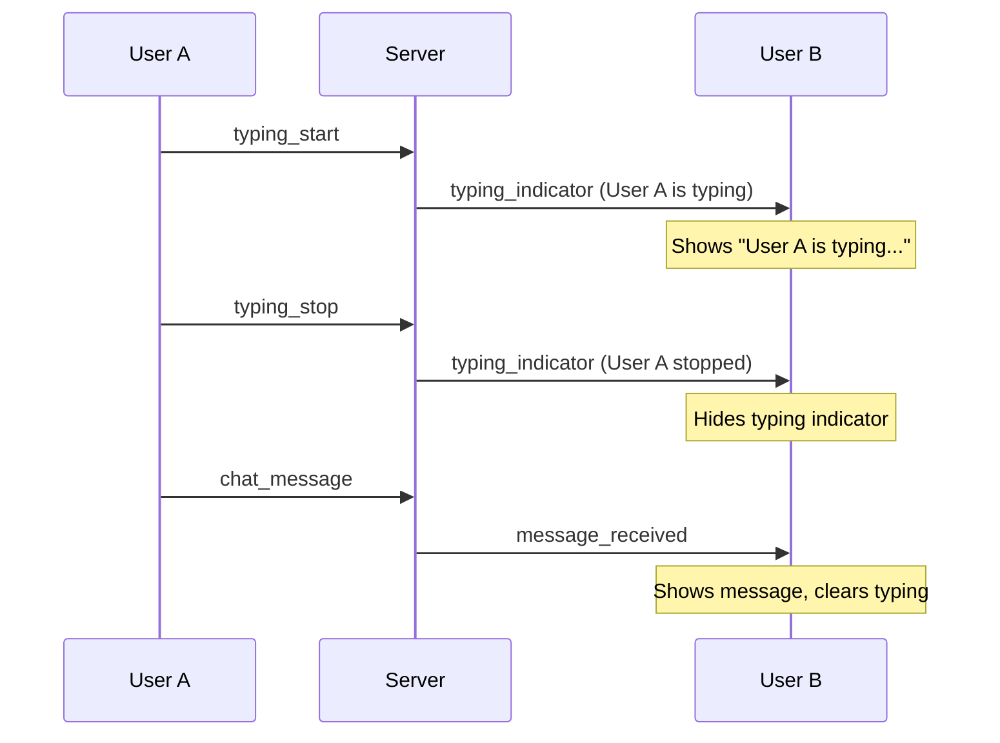
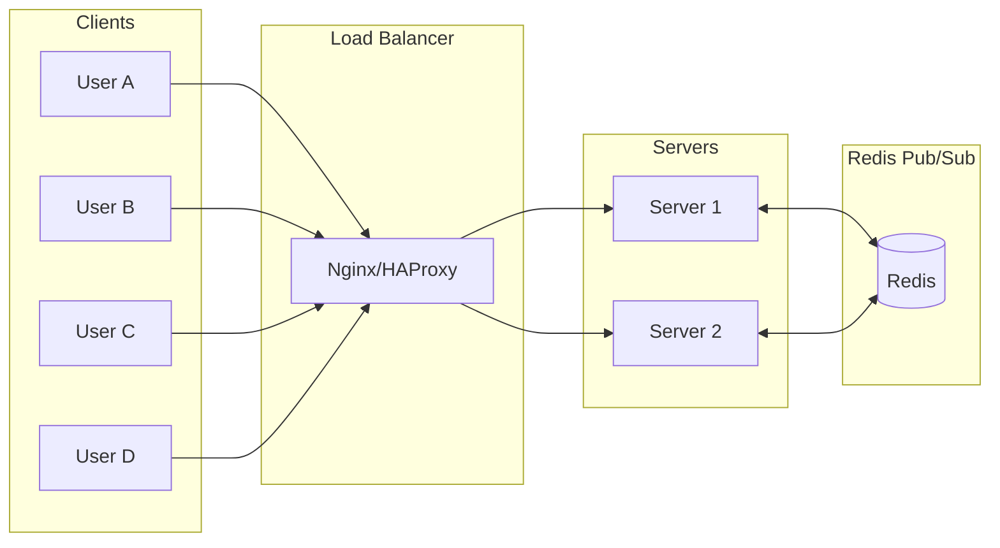

# How to Build Chat Applications with WebSockets

Author: [nawazdhandala](https://www.github.com/nawazdhandala)

Tags: WebSocket, Chat Application, Real-Time, Node.js, JavaScript

Description: Learn how to build a real-time chat application with WebSockets including rooms, private messages, typing indicators, and message persistence.

---

Real-time chat is one of the most common use cases for WebSockets. Unlike HTTP requests where the client always initiates communication, WebSockets maintain a persistent bidirectional connection between client and server. This makes them perfect for chat applications where messages need to flow instantly in both directions.

In this guide, we will build a complete chat application from scratch using Node.js and vanilla JavaScript. We will cover everything from basic messaging to advanced features like rooms, private messages, typing indicators, and message persistence.

## Understanding WebSocket Architecture

Before diving into code, let's understand how WebSockets work in a chat context:



The key difference from traditional HTTP is that once the connection is established, both sides can send messages at any time without waiting for a request.

## Project Setup

Let's start by setting up our Node.js project:

```bash
# Create project directory
mkdir websocket-chat && cd websocket-chat

# Initialize npm project
npm init -y

# Install dependencies
npm install ws express uuid
```

Our dependencies are minimal:
- `ws`: A fast WebSocket implementation for Node.js
- `express`: For serving static files and handling HTTP requests
- `uuid`: For generating unique identifiers

## Basic Server Structure

Here's our server foundation:

```javascript
// server.js
const express = require('express');
const http = require('http');
const WebSocket = require('ws');
const { v4: uuidv4 } = require('uuid');
const path = require('path');

// Create Express app and HTTP server
const app = express();
const server = http.createServer(app);

// Create WebSocket server attached to HTTP server
const wss = new WebSocket.Server({ server });

// Serve static files from public directory
app.use(express.static(path.join(__dirname, 'public')));

// Store connected clients with metadata
const clients = new Map();

// Store chat rooms
const rooms = new Map();

// Store message history (in production, use a database)
const messageHistory = [];

const PORT = process.env.PORT || 3000;

server.listen(PORT, () => {
    console.log(`Server running on port ${PORT}`);
});
```

## Connection Management

When a client connects, we need to assign them an ID and track their state:

```javascript
// server.js (continued)

// Handle new WebSocket connections
wss.on('connection', (ws) => {
    // Generate unique client ID
    const clientId = uuidv4();

    // Store client with initial metadata
    clients.set(ws, {
        id: clientId,
        username: null,      // Set when user joins
        currentRoom: null,   // Track which room they're in
        isTyping: false      // Track typing state
    });

    console.log(`Client connected: ${clientId}`);

    // Send welcome message with client ID
    ws.send(JSON.stringify({
        type: 'connection',
        clientId: clientId,
        message: 'Connected to chat server'
    }));

    // Handle incoming messages
    ws.on('message', (data) => {
        handleMessage(ws, data);
    });

    // Handle client disconnect
    ws.on('close', () => {
        handleDisconnect(ws);
    });

    // Handle errors
    ws.on('error', (error) => {
        console.error(`WebSocket error for ${clientId}:`, error);
    });
});
```

## Message Protocol

A well-defined message protocol is crucial. All messages follow a consistent JSON structure:

```javascript
// Message types our server understands
const MESSAGE_TYPES = {
    // User actions
    SET_USERNAME: 'set_username',
    JOIN_ROOM: 'join_room',
    LEAVE_ROOM: 'leave_room',
    CHAT_MESSAGE: 'chat_message',
    PRIVATE_MESSAGE: 'private_message',
    TYPING_START: 'typing_start',
    TYPING_STOP: 'typing_stop',

    // Server responses
    USERNAME_SET: 'username_set',
    ROOM_JOINED: 'room_joined',
    ROOM_LEFT: 'room_left',
    USER_JOINED: 'user_joined',
    USER_LEFT: 'user_left',
    MESSAGE_RECEIVED: 'message_received',
    TYPING_INDICATOR: 'typing_indicator',
    ERROR: 'error',
    ROOM_USERS: 'room_users',
    MESSAGE_HISTORY: 'message_history'
};
```

## Message Handler

The central message handler routes messages to appropriate functions:

```javascript
// server.js (continued)

function handleMessage(ws, data) {
    let message;

    // Parse incoming JSON
    try {
        message = JSON.parse(data);
    } catch (error) {
        sendError(ws, 'Invalid JSON format');
        return;
    }

    const client = clients.get(ws);

    // Route message based on type
    switch (message.type) {
        case MESSAGE_TYPES.SET_USERNAME:
            handleSetUsername(ws, client, message.username);
            break;

        case MESSAGE_TYPES.JOIN_ROOM:
            handleJoinRoom(ws, client, message.room);
            break;

        case MESSAGE_TYPES.LEAVE_ROOM:
            handleLeaveRoom(ws, client);
            break;

        case MESSAGE_TYPES.CHAT_MESSAGE:
            handleChatMessage(ws, client, message.content);
            break;

        case MESSAGE_TYPES.PRIVATE_MESSAGE:
            handlePrivateMessage(ws, client, message.targetId, message.content);
            break;

        case MESSAGE_TYPES.TYPING_START:
            handleTypingIndicator(ws, client, true);
            break;

        case MESSAGE_TYPES.TYPING_STOP:
            handleTypingIndicator(ws, client, false);
            break;

        default:
            sendError(ws, `Unknown message type: ${message.type}`);
    }
}

// Helper to send error messages
function sendError(ws, message) {
    ws.send(JSON.stringify({
        type: MESSAGE_TYPES.ERROR,
        message: message
    }));
}
```

## Username Management

Users must set a username before chatting:

```javascript
// server.js (continued)

function handleSetUsername(ws, client, username) {
    // Validate username
    if (!username || typeof username !== 'string') {
        sendError(ws, 'Username is required');
        return;
    }

    // Trim and limit username length
    username = username.trim().substring(0, 20);

    if (username.length < 2) {
        sendError(ws, 'Username must be at least 2 characters');
        return;
    }

    // Check if username is taken
    for (const [, c] of clients) {
        if (c.username === username && c.id !== client.id) {
            sendError(ws, 'Username is already taken');
            return;
        }
    }

    // Set the username
    client.username = username;

    // Confirm to client
    ws.send(JSON.stringify({
        type: MESSAGE_TYPES.USERNAME_SET,
        username: username
    }));

    console.log(`Client ${client.id} set username to: ${username}`);
}
```

## Room Management

Rooms allow users to separate conversations:



```javascript
// server.js (continued)

function handleJoinRoom(ws, client, roomName) {
    // Require username first
    if (!client.username) {
        sendError(ws, 'Please set a username first');
        return;
    }

    // Validate room name
    if (!roomName || typeof roomName !== 'string') {
        sendError(ws, 'Room name is required');
        return;
    }

    roomName = roomName.trim().toLowerCase().substring(0, 30);

    // Leave current room if in one
    if (client.currentRoom) {
        handleLeaveRoom(ws, client);
    }

    // Create room if it doesn't exist
    if (!rooms.has(roomName)) {
        rooms.set(roomName, new Set());
    }

    // Add client to room
    const room = rooms.get(roomName);
    room.add(ws);
    client.currentRoom = roomName;

    // Notify client they joined
    ws.send(JSON.stringify({
        type: MESSAGE_TYPES.ROOM_JOINED,
        room: roomName
    }));

    // Send room's message history to new user
    const roomHistory = messageHistory
        .filter(msg => msg.room === roomName)
        .slice(-50); // Last 50 messages

    ws.send(JSON.stringify({
        type: MESSAGE_TYPES.MESSAGE_HISTORY,
        messages: roomHistory
    }));

    // Send current users list
    const usersInRoom = getUsersInRoom(roomName);
    ws.send(JSON.stringify({
        type: MESSAGE_TYPES.ROOM_USERS,
        users: usersInRoom
    }));

    // Notify other users in the room
    broadcastToRoom(roomName, {
        type: MESSAGE_TYPES.USER_JOINED,
        username: client.username,
        userId: client.id
    }, ws); // Exclude the joining user

    console.log(`${client.username} joined room: ${roomName}`);
}

function handleLeaveRoom(ws, client) {
    if (!client.currentRoom) return;

    const roomName = client.currentRoom;
    const room = rooms.get(roomName);

    if (room) {
        // Remove from room
        room.delete(ws);

        // Delete empty rooms
        if (room.size === 0) {
            rooms.delete(roomName);
        } else {
            // Notify remaining users
            broadcastToRoom(roomName, {
                type: MESSAGE_TYPES.USER_LEFT,
                username: client.username,
                userId: client.id
            });
        }
    }

    // Notify client
    ws.send(JSON.stringify({
        type: MESSAGE_TYPES.ROOM_LEFT,
        room: roomName
    }));

    client.currentRoom = null;
    console.log(`${client.username} left room: ${roomName}`);
}

// Get list of users in a room
function getUsersInRoom(roomName) {
    const room = rooms.get(roomName);
    if (!room) return [];

    const users = [];
    for (const ws of room) {
        const client = clients.get(ws);
        if (client && client.username) {
            users.push({
                id: client.id,
                username: client.username
            });
        }
    }
    return users;
}
```

## Chat Messages

The core feature of sending and receiving messages:

```javascript
// server.js (continued)

function handleChatMessage(ws, client, content) {
    // Validate prerequisites
    if (!client.username) {
        sendError(ws, 'Please set a username first');
        return;
    }

    if (!client.currentRoom) {
        sendError(ws, 'Please join a room first');
        return;
    }

    // Validate content
    if (!content || typeof content !== 'string') {
        sendError(ws, 'Message content is required');
        return;
    }

    // Sanitize and limit message length
    content = content.trim().substring(0, 1000);

    if (content.length === 0) {
        return; // Ignore empty messages
    }

    // Create message object
    const message = {
        id: uuidv4(),
        type: MESSAGE_TYPES.MESSAGE_RECEIVED,
        room: client.currentRoom,
        userId: client.id,
        username: client.username,
        content: content,
        timestamp: new Date().toISOString()
    };

    // Store in history
    messageHistory.push(message);

    // Keep history manageable (in production, persist to database)
    if (messageHistory.length > 1000) {
        messageHistory.shift();
    }

    // Broadcast to everyone in the room including sender
    broadcastToRoom(client.currentRoom, message);

    // Reset typing indicator
    client.isTyping = false;
}

// Broadcast message to all clients in a room
function broadcastToRoom(roomName, message, excludeWs = null) {
    const room = rooms.get(roomName);
    if (!room) return;

    const messageStr = JSON.stringify(message);

    for (const ws of room) {
        // Skip excluded client and closed connections
        if (ws === excludeWs) continue;
        if (ws.readyState !== WebSocket.OPEN) continue;

        ws.send(messageStr);
    }
}
```

## Private Messages

Direct messages between users:

```javascript
// server.js (continued)

function handlePrivateMessage(ws, client, targetId, content) {
    // Validate prerequisites
    if (!client.username) {
        sendError(ws, 'Please set a username first');
        return;
    }

    // Find target client
    let targetWs = null;
    let targetClient = null;

    for (const [ws, c] of clients) {
        if (c.id === targetId) {
            targetWs = ws;
            targetClient = c;
            break;
        }
    }

    if (!targetWs || !targetClient) {
        sendError(ws, 'User not found');
        return;
    }

    // Validate content
    if (!content || typeof content !== 'string' || content.trim().length === 0) {
        sendError(ws, 'Message content is required');
        return;
    }

    content = content.trim().substring(0, 1000);

    // Create private message
    const privateMessage = {
        type: MESSAGE_TYPES.PRIVATE_MESSAGE,
        fromId: client.id,
        fromUsername: client.username,
        toId: targetId,
        toUsername: targetClient.username,
        content: content,
        timestamp: new Date().toISOString()
    };

    // Send to recipient
    if (targetWs.readyState === WebSocket.OPEN) {
        targetWs.send(JSON.stringify(privateMessage));
    }

    // Send confirmation to sender
    ws.send(JSON.stringify({
        ...privateMessage,
        type: 'private_message_sent'
    }));
}
```

## Typing Indicators

Show when other users are typing:



```javascript
// server.js (continued)

function handleTypingIndicator(ws, client, isTyping) {
    if (!client.username || !client.currentRoom) {
        return; // Silently ignore if not in a room
    }

    // Update client state
    client.isTyping = isTyping;

    // Broadcast to room (excluding sender)
    broadcastToRoom(client.currentRoom, {
        type: MESSAGE_TYPES.TYPING_INDICATOR,
        userId: client.id,
        username: client.username,
        isTyping: isTyping
    }, ws);
}
```

## Disconnect Handling

Clean up when users disconnect:

```javascript
// server.js (continued)

function handleDisconnect(ws) {
    const client = clients.get(ws);

    if (client) {
        console.log(`Client disconnected: ${client.username || client.id}`);

        // Leave current room
        if (client.currentRoom) {
            const roomName = client.currentRoom;
            const room = rooms.get(roomName);

            if (room) {
                room.delete(ws);

                // Notify others
                broadcastToRoom(roomName, {
                    type: MESSAGE_TYPES.USER_LEFT,
                    username: client.username,
                    userId: client.id
                });

                // Clean up empty rooms
                if (room.size === 0) {
                    rooms.delete(roomName);
                }
            }
        }

        // Remove from clients map
        clients.delete(ws);
    }
}
```

## Client-Side Implementation

Now let's build the browser client. Create a public directory for static files:

```bash
mkdir public
```

### HTML Structure

```html
<!-- public/index.html -->
<!DOCTYPE html>
<html lang="en">
<head>
    <meta charset="UTF-8">
    <meta name="viewport" content="width=device-width, initial-scale=1.0">
    <title>WebSocket Chat</title>
    <link rel="stylesheet" href="style.css">
</head>
<body>
    <div class="chat-container">
        <!-- Login Panel -->
        <div id="login-panel" class="panel">
            <h2>Welcome to Chat</h2>
            <input type="text" id="username-input" placeholder="Enter your username" maxlength="20">
            <button id="set-username-btn">Set Username</button>
        </div>

        <!-- Room Selection Panel -->
        <div id="room-panel" class="panel hidden">
            <h2>Join a Room</h2>
            <input type="text" id="room-input" placeholder="Enter room name" maxlength="30">
            <button id="join-room-btn">Join Room</button>
            <div id="available-rooms"></div>
        </div>

        <!-- Chat Panel -->
        <div id="chat-panel" class="panel hidden">
            <div class="chat-header">
                <span id="room-name">Room Name</span>
                <button id="leave-room-btn">Leave Room</button>
            </div>

            <div id="users-list"></div>

            <div id="messages-container"></div>

            <div id="typing-indicator" class="hidden"></div>

            <div class="message-input-container">
                <input type="text" id="message-input" placeholder="Type a message..." maxlength="1000">
                <button id="send-btn">Send</button>
            </div>
        </div>

        <!-- Connection Status -->
        <div id="connection-status">Connecting...</div>
    </div>

    <script src="chat.js"></script>
</body>
</html>
```

### CSS Styling

```css
/* public/style.css */
* {
    margin: 0;
    padding: 0;
    box-sizing: border-box;
}

body {
    font-family: -apple-system, BlinkMacSystemFont, 'Segoe UI', Roboto, sans-serif;
    background-color: #1a1a2e;
    color: #eee;
    height: 100vh;
    display: flex;
    justify-content: center;
    align-items: center;
}

.chat-container {
    width: 100%;
    max-width: 600px;
    height: 90vh;
    background: #16213e;
    border-radius: 12px;
    overflow: hidden;
    display: flex;
    flex-direction: column;
}

.panel {
    padding: 20px;
    display: flex;
    flex-direction: column;
    gap: 15px;
}

.panel.hidden {
    display: none;
}

.panel h2 {
    text-align: center;
    color: #e94560;
}

input[type="text"] {
    padding: 12px 16px;
    border: none;
    border-radius: 8px;
    background: #0f3460;
    color: #fff;
    font-size: 16px;
}

input[type="text"]:focus {
    outline: 2px solid #e94560;
}

button {
    padding: 12px 24px;
    border: none;
    border-radius: 8px;
    background: #e94560;
    color: #fff;
    font-size: 16px;
    cursor: pointer;
    transition: background 0.2s;
}

button:hover {
    background: #ff6b6b;
}

/* Chat Panel */
#chat-panel {
    flex: 1;
    display: flex;
    flex-direction: column;
}

.chat-header {
    display: flex;
    justify-content: space-between;
    align-items: center;
    padding: 15px 20px;
    background: #0f3460;
}

#room-name {
    font-weight: bold;
    font-size: 18px;
}

#leave-room-btn {
    padding: 8px 16px;
    font-size: 14px;
    background: #533483;
}

#users-list {
    padding: 10px 20px;
    background: #1a1a40;
    font-size: 14px;
    color: #888;
}

#messages-container {
    flex: 1;
    overflow-y: auto;
    padding: 20px;
    display: flex;
    flex-direction: column;
    gap: 10px;
}

.message {
    padding: 10px 15px;
    background: #0f3460;
    border-radius: 12px;
    max-width: 80%;
}

.message.own {
    background: #533483;
    align-self: flex-end;
}

.message.system {
    background: transparent;
    color: #888;
    text-align: center;
    align-self: center;
    font-size: 14px;
}

.message.private {
    background: #1e5128;
    border-left: 3px solid #4e9f3d;
}

.message-username {
    font-weight: bold;
    color: #e94560;
    font-size: 14px;
}

.message.own .message-username {
    color: #ff6b6b;
}

.message-content {
    margin-top: 5px;
    word-wrap: break-word;
}

.message-time {
    font-size: 11px;
    color: #666;
    margin-top: 5px;
}

#typing-indicator {
    padding: 10px 20px;
    font-size: 14px;
    color: #888;
    font-style: italic;
}

.message-input-container {
    display: flex;
    gap: 10px;
    padding: 15px 20px;
    background: #0f3460;
}

.message-input-container input {
    flex: 1;
}

/* Connection Status */
#connection-status {
    position: fixed;
    bottom: 20px;
    right: 20px;
    padding: 8px 16px;
    border-radius: 20px;
    font-size: 14px;
    background: #533483;
}

#connection-status.connected {
    background: #1e5128;
}

#connection-status.disconnected {
    background: #7b2d26;
}
```

### JavaScript Client

```javascript
// public/chat.js

// WebSocket connection
let ws = null;
let clientId = null;
let currentUsername = null;
let currentRoom = null;
let typingTimeout = null;
let isCurrentlyTyping = false;

// DOM Elements
const loginPanel = document.getElementById('login-panel');
const roomPanel = document.getElementById('room-panel');
const chatPanel = document.getElementById('chat-panel');
const connectionStatus = document.getElementById('connection-status');

const usernameInput = document.getElementById('username-input');
const setUsernameBtn = document.getElementById('set-username-btn');
const roomInput = document.getElementById('room-input');
const joinRoomBtn = document.getElementById('join-room-btn');
const roomNameDisplay = document.getElementById('room-name');
const leaveRoomBtn = document.getElementById('leave-room-btn');
const usersList = document.getElementById('users-list');
const messagesContainer = document.getElementById('messages-container');
const typingIndicator = document.getElementById('typing-indicator');
const messageInput = document.getElementById('message-input');
const sendBtn = document.getElementById('send-btn');

// Initialize connection
function connect() {
    // Use wss:// for production with SSL
    const protocol = window.location.protocol === 'https:' ? 'wss:' : 'ws:';
    ws = new WebSocket(`${protocol}//${window.location.host}`);

    ws.onopen = () => {
        console.log('Connected to server');
        updateConnectionStatus('connected', 'Connected');
    };

    ws.onclose = () => {
        console.log('Disconnected from server');
        updateConnectionStatus('disconnected', 'Disconnected');

        // Attempt reconnection after 3 seconds
        setTimeout(connect, 3000);
    };

    ws.onerror = (error) => {
        console.error('WebSocket error:', error);
    };

    ws.onmessage = (event) => {
        handleServerMessage(JSON.parse(event.data));
    };
}

// Update connection status display
function updateConnectionStatus(status, text) {
    connectionStatus.className = status;
    connectionStatus.textContent = text;
}

// Handle messages from server
function handleServerMessage(message) {
    console.log('Received:', message);

    switch (message.type) {
        case 'connection':
            clientId = message.clientId;
            break;

        case 'username_set':
            currentUsername = message.username;
            showPanel('room');
            break;

        case 'room_joined':
            currentRoom = message.room;
            roomNameDisplay.textContent = `#${message.room}`;
            showPanel('chat');
            messageInput.focus();
            break;

        case 'room_left':
            currentRoom = null;
            showPanel('room');
            messagesContainer.innerHTML = '';
            break;

        case 'room_users':
            updateUsersList(message.users);
            break;

        case 'message_history':
            // Clear and load history
            messagesContainer.innerHTML = '';
            message.messages.forEach(msg => displayMessage(msg));
            scrollToBottom();
            break;

        case 'message_received':
            displayMessage(message);
            scrollToBottom();
            break;

        case 'user_joined':
            addSystemMessage(`${message.username} joined the room`);
            break;

        case 'user_left':
            addSystemMessage(`${message.username} left the room`);
            break;

        case 'typing_indicator':
            updateTypingIndicator(message);
            break;

        case 'private_message':
            displayPrivateMessage(message, false);
            break;

        case 'private_message_sent':
            displayPrivateMessage(message, true);
            break;

        case 'error':
            alert(message.message);
            break;
    }
}

// Show specific panel
function showPanel(panel) {
    loginPanel.classList.add('hidden');
    roomPanel.classList.add('hidden');
    chatPanel.classList.add('hidden');

    if (panel === 'login') loginPanel.classList.remove('hidden');
    if (panel === 'room') roomPanel.classList.remove('hidden');
    if (panel === 'chat') chatPanel.classList.remove('hidden');
}

// Display a chat message
function displayMessage(message) {
    const div = document.createElement('div');
    const isOwn = message.userId === clientId;
    div.className = `message ${isOwn ? 'own' : ''}`;

    const time = new Date(message.timestamp).toLocaleTimeString();

    div.innerHTML = `
        <div class="message-username">${escapeHtml(message.username)}</div>
        <div class="message-content">${escapeHtml(message.content)}</div>
        <div class="message-time">${time}</div>
    `;

    messagesContainer.appendChild(div);
}

// Display private message
function displayPrivateMessage(message, isSent) {
    const div = document.createElement('div');
    div.className = 'message private';

    const time = new Date(message.timestamp).toLocaleTimeString();
    const label = isSent ? `To ${message.toUsername}` : `From ${message.fromUsername}`;

    div.innerHTML = `
        <div class="message-username">[Private] ${escapeHtml(label)}</div>
        <div class="message-content">${escapeHtml(message.content)}</div>
        <div class="message-time">${time}</div>
    `;

    messagesContainer.appendChild(div);
    scrollToBottom();
}

// Add system message
function addSystemMessage(text) {
    const div = document.createElement('div');
    div.className = 'message system';
    div.textContent = text;
    messagesContainer.appendChild(div);
    scrollToBottom();
}

// Update users list
function updateUsersList(users) {
    const names = users.map(u => u.username).join(', ');
    usersList.textContent = `Online: ${names}`;
}

// Update typing indicator
const typingUsers = new Map();

function updateTypingIndicator(message) {
    if (message.isTyping) {
        typingUsers.set(message.userId, message.username);
    } else {
        typingUsers.delete(message.userId);
    }

    if (typingUsers.size === 0) {
        typingIndicator.classList.add('hidden');
    } else {
        const names = Array.from(typingUsers.values());
        let text;

        if (names.length === 1) {
            text = `${names[0]} is typing...`;
        } else if (names.length === 2) {
            text = `${names[0]} and ${names[1]} are typing...`;
        } else {
            text = 'Several people are typing...';
        }

        typingIndicator.textContent = text;
        typingIndicator.classList.remove('hidden');
    }
}

// Scroll messages to bottom
function scrollToBottom() {
    messagesContainer.scrollTop = messagesContainer.scrollHeight;
}

// Escape HTML to prevent XSS
function escapeHtml(text) {
    const div = document.createElement('div');
    div.textContent = text;
    return div.innerHTML;
}

// Send message to server
function send(message) {
    if (ws && ws.readyState === WebSocket.OPEN) {
        ws.send(JSON.stringify(message));
    }
}

// Handle typing indicator
function handleTyping() {
    if (!isCurrentlyTyping) {
        isCurrentlyTyping = true;
        send({ type: 'typing_start' });
    }

    // Clear existing timeout
    if (typingTimeout) {
        clearTimeout(typingTimeout);
    }

    // Set new timeout to stop typing indicator
    typingTimeout = setTimeout(() => {
        isCurrentlyTyping = false;
        send({ type: 'typing_stop' });
    }, 1000);
}

// Event Listeners
setUsernameBtn.addEventListener('click', () => {
    const username = usernameInput.value.trim();
    if (username) {
        send({ type: 'set_username', username });
    }
});

usernameInput.addEventListener('keypress', (e) => {
    if (e.key === 'Enter') setUsernameBtn.click();
});

joinRoomBtn.addEventListener('click', () => {
    const room = roomInput.value.trim();
    if (room) {
        send({ type: 'join_room', room });
    }
});

roomInput.addEventListener('keypress', (e) => {
    if (e.key === 'Enter') joinRoomBtn.click();
});

leaveRoomBtn.addEventListener('click', () => {
    send({ type: 'leave_room' });
});

sendBtn.addEventListener('click', () => {
    const content = messageInput.value.trim();
    if (content) {
        send({ type: 'chat_message', content });
        messageInput.value = '';
        isCurrentlyTyping = false;
    }
});

messageInput.addEventListener('keypress', (e) => {
    if (e.key === 'Enter') {
        sendBtn.click();
    } else {
        handleTyping();
    }
});

messageInput.addEventListener('input', handleTyping);

// Start connection
connect();
```

## Complete Server File

Here's the complete server code with all pieces together:

```javascript
// server.js - Complete WebSocket Chat Server
const express = require('express');
const http = require('http');
const WebSocket = require('ws');
const { v4: uuidv4 } = require('uuid');
const path = require('path');

const app = express();
const server = http.createServer(app);
const wss = new WebSocket.Server({ server });

app.use(express.static(path.join(__dirname, 'public')));

// Data stores
const clients = new Map();
const rooms = new Map();
const messageHistory = [];

// Message types
const MSG = {
    SET_USERNAME: 'set_username',
    JOIN_ROOM: 'join_room',
    LEAVE_ROOM: 'leave_room',
    CHAT_MESSAGE: 'chat_message',
    PRIVATE_MESSAGE: 'private_message',
    TYPING_START: 'typing_start',
    TYPING_STOP: 'typing_stop',
    USERNAME_SET: 'username_set',
    ROOM_JOINED: 'room_joined',
    ROOM_LEFT: 'room_left',
    USER_JOINED: 'user_joined',
    USER_LEFT: 'user_left',
    MESSAGE_RECEIVED: 'message_received',
    TYPING_INDICATOR: 'typing_indicator',
    ERROR: 'error',
    ROOM_USERS: 'room_users',
    MESSAGE_HISTORY: 'message_history'
};

// Connection handler
wss.on('connection', (ws) => {
    const clientId = uuidv4();

    clients.set(ws, {
        id: clientId,
        username: null,
        currentRoom: null,
        isTyping: false
    });

    ws.send(JSON.stringify({
        type: 'connection',
        clientId: clientId
    }));

    ws.on('message', (data) => handleMessage(ws, data));
    ws.on('close', () => handleDisconnect(ws));
    ws.on('error', console.error);
});

function handleMessage(ws, data) {
    let msg;
    try {
        msg = JSON.parse(data);
    } catch {
        return sendError(ws, 'Invalid JSON');
    }

    const client = clients.get(ws);

    switch (msg.type) {
        case MSG.SET_USERNAME:
            setUsername(ws, client, msg.username);
            break;
        case MSG.JOIN_ROOM:
            joinRoom(ws, client, msg.room);
            break;
        case MSG.LEAVE_ROOM:
            leaveRoom(ws, client);
            break;
        case MSG.CHAT_MESSAGE:
            chatMessage(ws, client, msg.content);
            break;
        case MSG.PRIVATE_MESSAGE:
            privateMessage(ws, client, msg.targetId, msg.content);
            break;
        case MSG.TYPING_START:
            setTyping(ws, client, true);
            break;
        case MSG.TYPING_STOP:
            setTyping(ws, client, false);
            break;
    }
}

function sendError(ws, message) {
    ws.send(JSON.stringify({ type: MSG.ERROR, message }));
}

function setUsername(ws, client, username) {
    if (!username || username.trim().length < 2) {
        return sendError(ws, 'Username must be at least 2 characters');
    }

    username = username.trim().substring(0, 20);

    for (const [, c] of clients) {
        if (c.username === username && c.id !== client.id) {
            return sendError(ws, 'Username taken');
        }
    }

    client.username = username;
    ws.send(JSON.stringify({ type: MSG.USERNAME_SET, username }));
}

function joinRoom(ws, client, roomName) {
    if (!client.username) return sendError(ws, 'Set username first');
    if (!roomName) return sendError(ws, 'Room name required');

    roomName = roomName.trim().toLowerCase().substring(0, 30);

    if (client.currentRoom) leaveRoom(ws, client);

    if (!rooms.has(roomName)) rooms.set(roomName, new Set());

    rooms.get(roomName).add(ws);
    client.currentRoom = roomName;

    ws.send(JSON.stringify({ type: MSG.ROOM_JOINED, room: roomName }));

    const history = messageHistory.filter(m => m.room === roomName).slice(-50);
    ws.send(JSON.stringify({ type: MSG.MESSAGE_HISTORY, messages: history }));

    const users = getUsersInRoom(roomName);
    ws.send(JSON.stringify({ type: MSG.ROOM_USERS, users }));

    broadcastToRoom(roomName, {
        type: MSG.USER_JOINED,
        username: client.username,
        userId: client.id
    }, ws);
}

function leaveRoom(ws, client) {
    if (!client.currentRoom) return;

    const roomName = client.currentRoom;
    const room = rooms.get(roomName);

    if (room) {
        room.delete(ws);
        if (room.size === 0) {
            rooms.delete(roomName);
        } else {
            broadcastToRoom(roomName, {
                type: MSG.USER_LEFT,
                username: client.username,
                userId: client.id
            });
        }
    }

    ws.send(JSON.stringify({ type: MSG.ROOM_LEFT, room: roomName }));
    client.currentRoom = null;
}

function chatMessage(ws, client, content) {
    if (!client.username || !client.currentRoom) return;
    if (!content || content.trim().length === 0) return;

    content = content.trim().substring(0, 1000);

    const message = {
        id: uuidv4(),
        type: MSG.MESSAGE_RECEIVED,
        room: client.currentRoom,
        userId: client.id,
        username: client.username,
        content,
        timestamp: new Date().toISOString()
    };

    messageHistory.push(message);
    if (messageHistory.length > 1000) messageHistory.shift();

    broadcastToRoom(client.currentRoom, message);
}

function privateMessage(ws, client, targetId, content) {
    if (!client.username) return sendError(ws, 'Set username first');
    if (!content || content.trim().length === 0) return;

    let targetWs, targetClient;
    for (const [w, c] of clients) {
        if (c.id === targetId) {
            targetWs = w;
            targetClient = c;
            break;
        }
    }

    if (!targetWs) return sendError(ws, 'User not found');

    const pm = {
        type: MSG.PRIVATE_MESSAGE,
        fromId: client.id,
        fromUsername: client.username,
        toId: targetId,
        toUsername: targetClient.username,
        content: content.trim().substring(0, 1000),
        timestamp: new Date().toISOString()
    };

    if (targetWs.readyState === WebSocket.OPEN) {
        targetWs.send(JSON.stringify(pm));
    }

    ws.send(JSON.stringify({ ...pm, type: 'private_message_sent' }));
}

function setTyping(ws, client, isTyping) {
    if (!client.username || !client.currentRoom) return;

    client.isTyping = isTyping;
    broadcastToRoom(client.currentRoom, {
        type: MSG.TYPING_INDICATOR,
        userId: client.id,
        username: client.username,
        isTyping
    }, ws);
}

function handleDisconnect(ws) {
    const client = clients.get(ws);
    if (client && client.currentRoom) {
        leaveRoom(ws, client);
    }
    clients.delete(ws);
}

function getUsersInRoom(roomName) {
    const room = rooms.get(roomName);
    if (!room) return [];

    return Array.from(room)
        .map(ws => clients.get(ws))
        .filter(c => c && c.username)
        .map(c => ({ id: c.id, username: c.username }));
}

function broadcastToRoom(roomName, message, excludeWs = null) {
    const room = rooms.get(roomName);
    if (!room) return;

    const str = JSON.stringify(message);
    for (const ws of room) {
        if (ws !== excludeWs && ws.readyState === WebSocket.OPEN) {
            ws.send(str);
        }
    }
}

const PORT = process.env.PORT || 3000;
server.listen(PORT, () => console.log(`Server running on port ${PORT}`));
```

## Running the Application

Start the server:

```bash
node server.js
```

Open your browser to `http://localhost:3000` and test the chat. Open multiple tabs to simulate different users.

## Adding Message Persistence

For production, you will want to persist messages to a database. Here's how to integrate with MongoDB:

```javascript
// db.js - MongoDB integration
const { MongoClient } = require('mongodb');

const uri = process.env.MONGODB_URI || 'mongodb://localhost:27017';
const client = new MongoClient(uri);

let db;

async function connectDB() {
    await client.connect();
    db = client.db('chat');

    // Create indexes for efficient queries
    await db.collection('messages').createIndex({ room: 1, timestamp: -1 });
    await db.collection('messages').createIndex({ timestamp: 1 }, { expireAfterSeconds: 604800 }); // 7 days TTL

    console.log('Connected to MongoDB');
    return db;
}

async function saveMessage(message) {
    return db.collection('messages').insertOne(message);
}

async function getMessageHistory(room, limit = 50) {
    return db.collection('messages')
        .find({ room })
        .sort({ timestamp: -1 })
        .limit(limit)
        .toArray()
        .then(msgs => msgs.reverse());
}

module.exports = { connectDB, saveMessage, getMessageHistory };
```

## Security Considerations

When building a production chat application, consider these security measures:

1. **Rate Limiting**: Prevent message flooding
2. **Input Validation**: Sanitize all user input
3. **Authentication**: Verify user identity
4. **HTTPS/WSS**: Always use encrypted connections
5. **Message Size Limits**: Prevent oversized payloads

```javascript
// Rate limiting example
const rateLimiter = new Map();

function checkRateLimit(clientId, limit = 10, window = 1000) {
    const now = Date.now();
    const clientData = rateLimiter.get(clientId) || { count: 0, resetTime: now + window };

    if (now > clientData.resetTime) {
        clientData.count = 0;
        clientData.resetTime = now + window;
    }

    clientData.count++;
    rateLimiter.set(clientId, clientData);

    return clientData.count <= limit;
}
```

## Scaling with Redis

For multiple server instances, use Redis as a message broker:



```javascript
// redis-adapter.js
const Redis = require('ioredis');

const pub = new Redis();
const sub = new Redis();

// Subscribe to chat channel
sub.subscribe('chat:messages');

// Handle messages from other servers
sub.on('message', (channel, message) => {
    const data = JSON.parse(message);
    // Broadcast to local clients in the room
    broadcastToRoom(data.room, data.message);
});

// Publish message to all servers
function publishMessage(room, message) {
    pub.publish('chat:messages', JSON.stringify({ room, message }));
}
```

## Conclusion

You now have a fully functional real-time chat application with WebSockets. The key concepts covered include:

- WebSocket connection management and lifecycle
- Message protocol design with JSON
- Room-based message routing
- Private messaging between users
- Typing indicators for better UX
- Client-side reconnection handling
- Security considerations and rate limiting
- Scaling strategies with Redis

From here, you can extend the application with features like file sharing, message reactions, user presence status, or integration with push notifications for mobile support. The WebSocket foundation we built is flexible enough to support all these additions.
