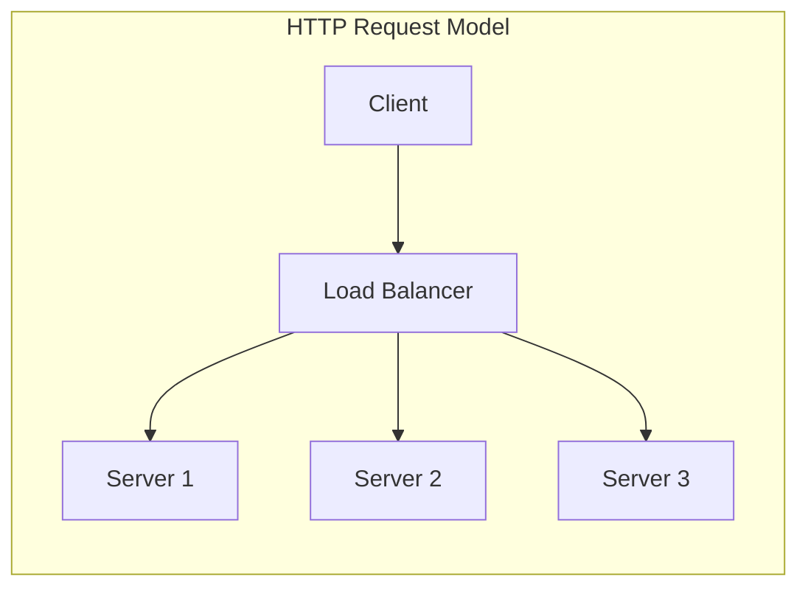
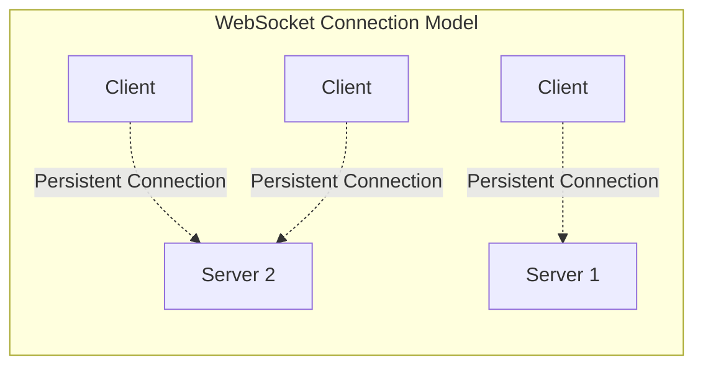
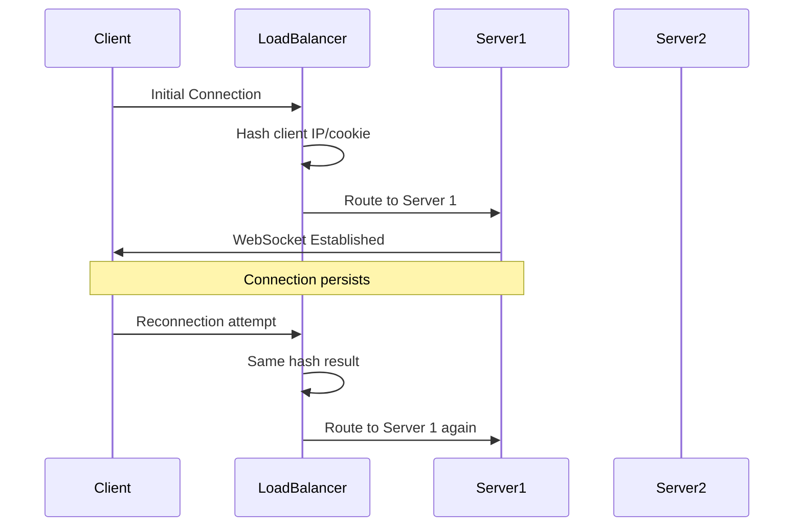
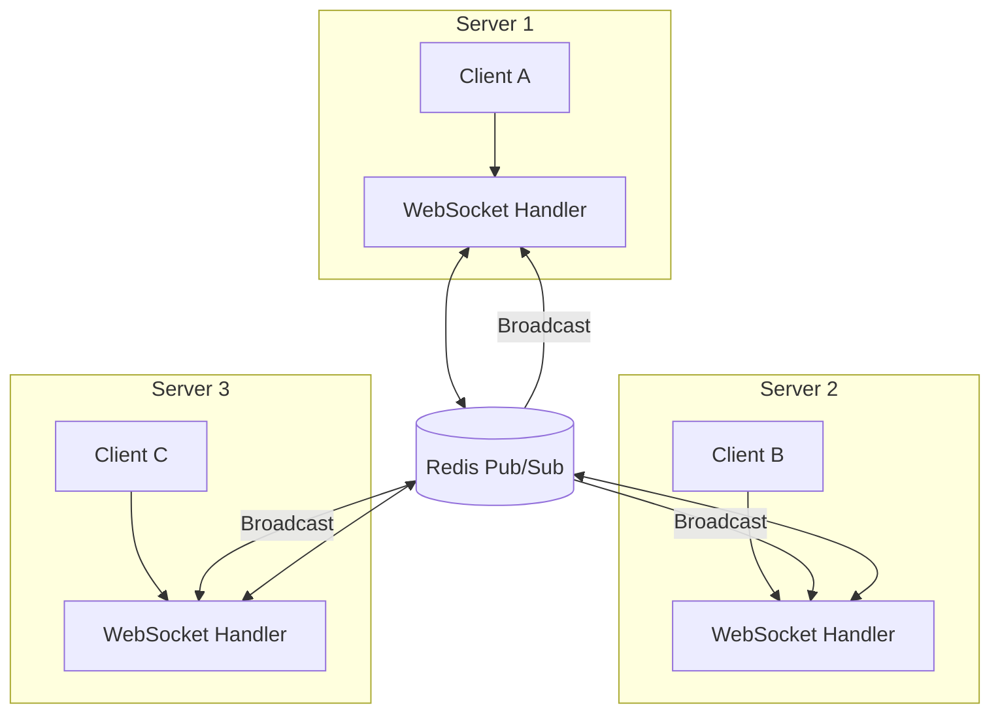
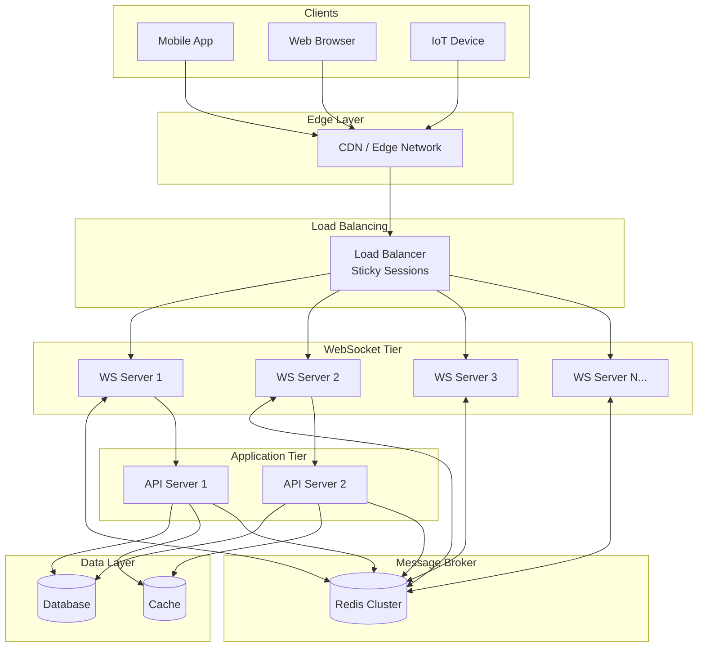
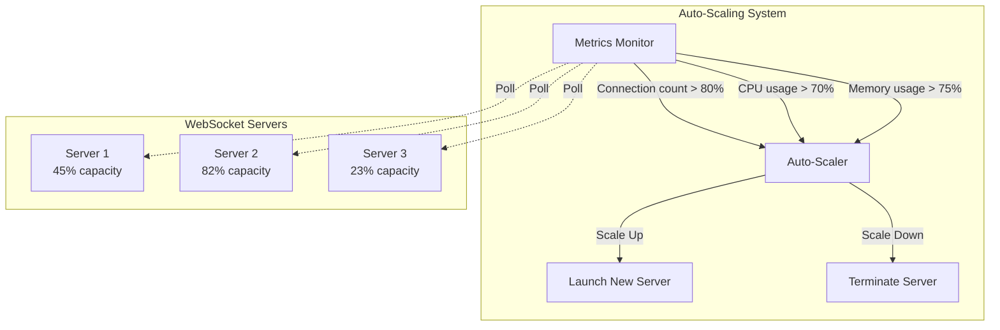

# How to Scale WebSocket Connections

Author: [nawazdhandala](https://www.github.com/nawazdhandala)

Tags: WebSocket, Scaling, Real-Time, Backend Development, Architecture

Description: Learn how to scale WebSocket connections to handle millions of concurrent users with load balancing, sticky sessions, and pub/sub patterns.

---

WebSocket connections present unique scaling challenges compared to traditional HTTP requests. While HTTP is stateless and each request can be handled by any server, WebSocket connections are persistent and stateful. This means you need careful planning to scale beyond a single server.

In this guide, we will explore the key strategies for scaling WebSocket applications to handle millions of concurrent connections.

## Understanding the WebSocket Scaling Challenge

Before diving into solutions, let us understand why WebSocket scaling is different from HTTP scaling.



With HTTP, any server can handle any request because the request contains all the information needed. Load balancers can distribute requests using simple round-robin algorithms.



With WebSockets, once a connection is established, all messages must go through that same server. This creates two main challenges:

1. **Connection affinity**: Clients must always reach the same server
2. **Cross-server communication**: Messages often need to reach clients connected to different servers

## Strategy 1: Sticky Sessions with Load Balancers

The first step in scaling WebSockets is ensuring that a client always connects to the same server. This is called "sticky sessions" or "session affinity."

### How Sticky Sessions Work



### NGINX Configuration for WebSocket Sticky Sessions

```nginx
# NGINX configuration for WebSocket load balancing with sticky sessions

# Define the upstream group of WebSocket servers
upstream websocket_servers {
    # Use IP hash to ensure the same client always reaches the same server
    # This is critical for WebSocket connections that maintain state
    ip_hash;

    # List of backend WebSocket servers
    server ws-server-1:8080 weight=1;
    server ws-server-2:8080 weight=1;
    server ws-server-3:8080 weight=1;

    # Keep connections alive to reduce handshake overhead
    keepalive 64;
}

server {
    listen 80;
    server_name ws.example.com;

    location /socket {
        # Proxy to the upstream WebSocket servers
        proxy_pass http://websocket_servers;

        # Required headers for WebSocket upgrade
        proxy_http_version 1.1;
        proxy_set_header Upgrade $http_upgrade;
        proxy_set_header Connection "upgrade";

        # Pass the real client IP to the backend
        proxy_set_header X-Real-IP $remote_addr;
        proxy_set_header X-Forwarded-For $proxy_add_x_forwarded_for;
        proxy_set_header Host $host;

        # Increase timeouts for long-lived connections
        # Default is 60s which is too short for WebSockets
        proxy_read_timeout 3600s;
        proxy_send_timeout 3600s;

        # Disable buffering for real-time data
        proxy_buffering off;
    }
}
```

### Alternative: Cookie-Based Sticky Sessions

IP hash works well in many cases, but can cause uneven distribution when clients share IPs (corporate networks, mobile carriers). Cookie-based stickiness provides better distribution.

```nginx
upstream websocket_servers {
    # Use a sticky cookie instead of IP hash
    # The cookie is set on the first request and used for subsequent routing
    sticky cookie srv_id expires=1h domain=.example.com path=/;

    server ws-server-1:8080;
    server ws-server-2:8080;
    server ws-server-3:8080;
}
```

## Strategy 2: Pub/Sub for Cross-Server Communication

Sticky sessions solve the connection problem, but what happens when User A on Server 1 needs to send a message to User B on Server 2? This is where pub/sub systems come in.



### Implementing Pub/Sub with Redis in Node.js

```javascript
// websocket-server.js
// A scalable WebSocket server using Redis pub/sub for cross-server messaging

const WebSocket = require('ws');
const Redis = require('ioredis');

// Create separate Redis connections for pub and sub
// Redis requires separate connections for publishing and subscribing
const redisPub = new Redis({
    host: process.env.REDIS_HOST || 'localhost',
    port: process.env.REDIS_PORT || 6379,
    password: process.env.REDIS_PASSWORD,
    // Retry strategy for resilience
    retryStrategy: (times) => Math.min(times * 50, 2000)
});

const redisSub = new Redis({
    host: process.env.REDIS_HOST || 'localhost',
    port: process.env.REDIS_PORT || 6379,
    password: process.env.REDIS_PASSWORD,
    retryStrategy: (times) => Math.min(times * 50, 2000)
});

// Track connected clients on this server instance
// Key: unique client ID, Value: WebSocket connection
const localClients = new Map();

// Track which channels each client is subscribed to
const clientChannels = new Map();

// Create WebSocket server
const wss = new WebSocket.Server({
    port: process.env.WS_PORT || 8080,
    // Increase max payload for larger messages
    maxPayload: 1024 * 1024 // 1MB
});

// Generate a unique ID for each server instance
// This helps with debugging and tracking message origins
const serverId = `server-${process.pid}-${Date.now()}`;

console.log(`WebSocket server ${serverId} starting...`);

// Handle new WebSocket connections
wss.on('connection', (ws, req) => {
    // Generate unique client ID from headers or create one
    const clientId = req.headers['x-client-id'] || `client-${Date.now()}-${Math.random().toString(36).substr(2, 9)}`;

    // Store the connection locally
    localClients.set(clientId, ws);
    clientChannels.set(clientId, new Set());

    console.log(`Client ${clientId} connected to ${serverId}`);

    // Send the client their ID for future reference
    ws.send(JSON.stringify({
        type: 'connected',
        clientId: clientId,
        serverId: serverId
    }));

    // Handle incoming messages from the client
    ws.on('message', async (data) => {
        try {
            const message = JSON.parse(data);
            await handleClientMessage(clientId, message);
        } catch (error) {
            console.error('Error processing message:', error);
            ws.send(JSON.stringify({ type: 'error', message: 'Invalid message format' }));
        }
    });

    // Clean up when client disconnects
    ws.on('close', () => {
        console.log(`Client ${clientId} disconnected from ${serverId}`);

        // Unsubscribe from all channels
        const channels = clientChannels.get(clientId) || new Set();
        channels.forEach(channel => {
            unsubscribeFromChannel(clientId, channel);
        });

        // Remove from local tracking
        localClients.delete(clientId);
        clientChannels.delete(clientId);
    });

    // Handle errors
    ws.on('error', (error) => {
        console.error(`WebSocket error for ${clientId}:`, error);
    });
});

// Process messages from clients
async function handleClientMessage(clientId, message) {
    switch (message.type) {
        case 'subscribe':
            // Client wants to join a channel
            await subscribeToChannel(clientId, message.channel);
            break;

        case 'unsubscribe':
            // Client wants to leave a channel
            await unsubscribeFromChannel(clientId, message.channel);
            break;

        case 'broadcast':
            // Client wants to send a message to all subscribers of a channel
            await broadcastToChannel(message.channel, {
                type: 'message',
                channel: message.channel,
                from: clientId,
                data: message.data,
                timestamp: Date.now()
            });
            break;

        case 'direct':
            // Client wants to send a message to a specific user
            await sendDirectMessage(message.targetClientId, {
                type: 'direct',
                from: clientId,
                data: message.data,
                timestamp: Date.now()
            });
            break;

        default:
            console.warn(`Unknown message type: ${message.type}`);
    }
}

// Subscribe a client to a channel
async function subscribeToChannel(clientId, channel) {
    const redisChannel = `channel:${channel}`;

    // Track locally which channels this client is subscribed to
    const channels = clientChannels.get(clientId);
    if (channels) {
        channels.add(channel);
    }

    // Subscribe to Redis channel if not already subscribed
    // We subscribe at the server level, not per-client
    const subscriberCount = await getChannelSubscriberCount(channel);
    if (subscriberCount === 1) {
        // First subscriber on this server, subscribe to Redis
        redisSub.subscribe(redisChannel);
    }

    // Notify the client of successful subscription
    const ws = localClients.get(clientId);
    if (ws && ws.readyState === WebSocket.OPEN) {
        ws.send(JSON.stringify({
            type: 'subscribed',
            channel: channel
        }));
    }

    console.log(`Client ${clientId} subscribed to ${channel}`);
}

// Unsubscribe a client from a channel
async function unsubscribeFromChannel(clientId, channel) {
    const channels = clientChannels.get(clientId);
    if (channels) {
        channels.delete(channel);
    }

    // Check if any local clients are still subscribed
    const subscriberCount = await getChannelSubscriberCount(channel);
    if (subscriberCount === 0) {
        // No more local subscribers, unsubscribe from Redis
        redisSub.unsubscribe(`channel:${channel}`);
    }
}

// Count how many local clients are subscribed to a channel
function getChannelSubscriberCount(channel) {
    let count = 0;
    for (const [, channels] of clientChannels) {
        if (channels.has(channel)) {
            count++;
        }
    }
    return count;
}

// Broadcast a message to all subscribers of a channel
async function broadcastToChannel(channel, message) {
    const redisChannel = `channel:${channel}`;
    const payload = JSON.stringify({
        ...message,
        _origin: serverId // Track which server sent this
    });

    // Publish to Redis so all servers receive it
    await redisPub.publish(redisChannel, payload);
}

// Send a direct message to a specific client
async function sendDirectMessage(targetClientId, message) {
    const payload = JSON.stringify({
        ...message,
        _origin: serverId
    });

    // Publish to a client-specific channel
    await redisPub.publish(`client:${targetClientId}`, payload);
}

// Handle messages received from Redis
redisSub.on('message', (redisChannel, payload) => {
    try {
        const message = JSON.parse(payload);

        // Check if this is a channel broadcast or direct message
        if (redisChannel.startsWith('channel:')) {
            const channel = redisChannel.replace('channel:', '');
            deliverChannelMessage(channel, message);
        } else if (redisChannel.startsWith('client:')) {
            const clientId = redisChannel.replace('client:', '');
            deliverDirectMessage(clientId, message);
        }
    } catch (error) {
        console.error('Error processing Redis message:', error);
    }
});

// Deliver a channel message to all local subscribers
function deliverChannelMessage(channel, message) {
    // Remove internal metadata before sending to clients
    const { _origin, ...clientMessage } = message;
    const payload = JSON.stringify(clientMessage);

    // Find all local clients subscribed to this channel
    for (const [clientId, channels] of clientChannels) {
        if (channels.has(channel)) {
            const ws = localClients.get(clientId);
            if (ws && ws.readyState === WebSocket.OPEN) {
                ws.send(payload);
            }
        }
    }
}

// Deliver a direct message to a specific local client
function deliverDirectMessage(clientId, message) {
    const ws = localClients.get(clientId);
    if (ws && ws.readyState === WebSocket.OPEN) {
        const { _origin, ...clientMessage } = message;
        ws.send(JSON.stringify(clientMessage));
    }
}

// Subscribe to direct messages for any client that connects to this server
// This is handled dynamically when clients connect

console.log(`WebSocket server ${serverId} ready on port ${process.env.WS_PORT || 8080}`);
```

## Strategy 3: Horizontal Scaling Architecture

With sticky sessions and pub/sub in place, you can scale horizontally by adding more WebSocket servers. Here is a complete architecture diagram:



## Strategy 4: Connection Pooling and Resource Management

Each WebSocket connection consumes server resources. To handle millions of connections, you need to optimize resource usage.

### Tuning OS-Level Limits

```bash
#!/bin/bash
# system-tuning.sh
# Optimize Linux server for high WebSocket connection counts

# Increase the maximum number of file descriptors
# Each WebSocket connection requires a file descriptor
echo "* soft nofile 1000000" >> /etc/security/limits.conf
echo "* hard nofile 1000000" >> /etc/security/limits.conf

# Increase system-wide file descriptor limit
echo "fs.file-max = 2000000" >> /etc/sysctl.conf

# Optimize TCP settings for many connections
# Increase the range of local ports available
echo "net.ipv4.ip_local_port_range = 1024 65535" >> /etc/sysctl.conf

# Enable TCP keepalive to detect dead connections
echo "net.ipv4.tcp_keepalive_time = 60" >> /etc/sysctl.conf
echo "net.ipv4.tcp_keepalive_intvl = 10" >> /etc/sysctl.conf
echo "net.ipv4.tcp_keepalive_probes = 6" >> /etc/sysctl.conf

# Increase socket buffer sizes for better throughput
echo "net.core.rmem_max = 16777216" >> /etc/sysctl.conf
echo "net.core.wmem_max = 16777216" >> /etc/sysctl.conf

# Increase the maximum number of connections in the backlog queue
echo "net.core.somaxconn = 65535" >> /etc/sysctl.conf
echo "net.ipv4.tcp_max_syn_backlog = 65535" >> /etc/sysctl.conf

# Apply the changes
sysctl -p

echo "System tuned for high WebSocket connection counts"
```

### Implementing Connection Limits Per Server

```javascript
// connection-manager.js
// Manage connection limits and graceful degradation

class ConnectionManager {
    constructor(options = {}) {
        // Maximum connections this server should handle
        this.maxConnections = options.maxConnections || 50000;

        // Warn when approaching the limit
        this.warningThreshold = options.warningThreshold || 0.8;

        // Track connections by type/priority
        this.connections = new Map();
        this.connectionsByPriority = {
            high: new Set(),    // Premium users, critical connections
            normal: new Set(),  // Regular users
            low: new Set()      // Anonymous, background connections
        };

        // Metrics for monitoring
        this.metrics = {
            totalConnections: 0,
            rejectedConnections: 0,
            droppedConnections: 0
        };
    }

    // Check if we can accept a new connection
    canAcceptConnection(priority = 'normal') {
        const currentCount = this.connections.size;

        // Always accept high priority connections up to 90% capacity
        if (priority === 'high' && currentCount < this.maxConnections * 0.9) {
            return true;
        }

        // Accept normal priority up to 80% capacity
        if (priority === 'normal' && currentCount < this.maxConnections * 0.8) {
            return true;
        }

        // Accept low priority up to 70% capacity
        if (priority === 'low' && currentCount < this.maxConnections * 0.7) {
            return true;
        }

        // If at capacity, only accept high priority
        if (currentCount >= this.maxConnections) {
            if (priority === 'high') {
                // Drop a low priority connection to make room
                return this.dropLowestPriorityConnection();
            }
            this.metrics.rejectedConnections++;
            return false;
        }

        return true;
    }

    // Register a new connection
    addConnection(connectionId, ws, priority = 'normal', metadata = {}) {
        if (!this.canAcceptConnection(priority)) {
            return false;
        }

        const connection = {
            id: connectionId,
            ws: ws,
            priority: priority,
            metadata: metadata,
            connectedAt: Date.now(),
            lastActivity: Date.now()
        };

        this.connections.set(connectionId, connection);
        this.connectionsByPriority[priority].add(connectionId);
        this.metrics.totalConnections++;

        // Check if we should emit a warning
        this.checkCapacityWarning();

        return true;
    }

    // Remove a connection
    removeConnection(connectionId) {
        const connection = this.connections.get(connectionId);
        if (connection) {
            this.connectionsByPriority[connection.priority].delete(connectionId);
            this.connections.delete(connectionId);
        }
    }

    // Update connection activity timestamp
    updateActivity(connectionId) {
        const connection = this.connections.get(connectionId);
        if (connection) {
            connection.lastActivity = Date.now();
        }
    }

    // Drop the oldest low priority connection
    dropLowestPriorityConnection() {
        // First try low priority
        if (this.connectionsByPriority.low.size > 0) {
            const connectionId = this.findOldestConnection('low');
            if (connectionId) {
                this.closeConnection(connectionId, 'capacity');
                return true;
            }
        }

        // Then try normal priority
        if (this.connectionsByPriority.normal.size > 0) {
            const connectionId = this.findOldestConnection('normal');
            if (connectionId) {
                this.closeConnection(connectionId, 'capacity');
                return true;
            }
        }

        return false;
    }

    // Find the oldest connection of a given priority
    findOldestConnection(priority) {
        let oldestId = null;
        let oldestTime = Date.now();

        for (const connectionId of this.connectionsByPriority[priority]) {
            const connection = this.connections.get(connectionId);
            if (connection && connection.lastActivity < oldestTime) {
                oldestTime = connection.lastActivity;
                oldestId = connectionId;
            }
        }

        return oldestId;
    }

    // Close a connection gracefully
    closeConnection(connectionId, reason) {
        const connection = this.connections.get(connectionId);
        if (connection && connection.ws) {
            // Send a close message explaining why
            connection.ws.send(JSON.stringify({
                type: 'closing',
                reason: reason,
                message: 'Please reconnect to another server'
            }));

            // Close the WebSocket
            connection.ws.close(1001, reason);
            this.removeConnection(connectionId);
            this.metrics.droppedConnections++;
        }
    }

    // Check capacity and emit warning if needed
    checkCapacityWarning() {
        const usage = this.connections.size / this.maxConnections;
        if (usage >= this.warningThreshold) {
            console.warn(`Connection capacity at ${(usage * 100).toFixed(1)}%`);
            // Could emit to monitoring system here
        }
    }

    // Get current statistics
    getStats() {
        return {
            current: this.connections.size,
            max: this.maxConnections,
            usage: (this.connections.size / this.maxConnections * 100).toFixed(1) + '%',
            byPriority: {
                high: this.connectionsByPriority.high.size,
                normal: this.connectionsByPriority.normal.size,
                low: this.connectionsByPriority.low.size
            },
            metrics: this.metrics
        };
    }
}

module.exports = ConnectionManager;
```

## Strategy 5: Health Checks and Auto-Scaling

For production deployments, you need health checks and auto-scaling to handle traffic spikes.



### Health Check Endpoint Implementation

```javascript
// health-check.js
// Health check endpoint for load balancers and monitoring systems

const express = require('express');
const app = express();

// Reference to your connection manager
let connectionManager;
let wsServer;

// Initialize with your WebSocket server instance
function init(connManager, wss) {
    connectionManager = connManager;
    wsServer = wss;
}

// Basic health check - is the server running?
app.get('/health', (req, res) => {
    res.status(200).json({
        status: 'healthy',
        timestamp: new Date().toISOString()
    });
});

// Detailed health check for monitoring systems
app.get('/health/detailed', (req, res) => {
    const stats = connectionManager.getStats();
    const memoryUsage = process.memoryUsage();

    const health = {
        status: 'healthy',
        timestamp: new Date().toISOString(),
        uptime: process.uptime(),
        connections: stats,
        memory: {
            heapUsed: Math.round(memoryUsage.heapUsed / 1024 / 1024) + 'MB',
            heapTotal: Math.round(memoryUsage.heapTotal / 1024 / 1024) + 'MB',
            rss: Math.round(memoryUsage.rss / 1024 / 1024) + 'MB'
        },
        cpu: process.cpuUsage()
    };

    // Determine overall health status
    const connectionUsage = stats.current / stats.max;
    const memoryUsagePercent = memoryUsage.heapUsed / memoryUsage.heapTotal;

    if (connectionUsage > 0.9 || memoryUsagePercent > 0.9) {
        health.status = 'critical';
        res.status(503);
    } else if (connectionUsage > 0.8 || memoryUsagePercent > 0.8) {
        health.status = 'warning';
        res.status(200);
    }

    res.json(health);
});

// Readiness check - can this server accept new connections?
app.get('/ready', (req, res) => {
    const stats = connectionManager.getStats();
    const canAccept = connectionManager.canAcceptConnection('normal');

    if (canAccept) {
        res.status(200).json({
            ready: true,
            capacity: stats.usage
        });
    } else {
        // Return 503 so load balancer stops sending new connections
        res.status(503).json({
            ready: false,
            capacity: stats.usage,
            message: 'Server at capacity'
        });
    }
});

// Graceful shutdown endpoint for draining connections
app.post('/drain', async (req, res) => {
    console.log('Drain requested - stopping new connections');

    // Stop accepting new connections
    wsServer.close();

    // Notify all connected clients to reconnect elsewhere
    const stats = connectionManager.getStats();
    res.json({
        draining: true,
        connectionsToMigrate: stats.current
    });

    // Give clients time to reconnect, then exit
    setTimeout(() => {
        process.exit(0);
    }, 30000); // 30 seconds drain time
});

const PORT = process.env.HEALTH_PORT || 8081;
app.listen(PORT, () => {
    console.log(`Health check server running on port ${PORT}`);
});

module.exports = { init };
```

## Best Practices Summary

Here are the key takeaways for scaling WebSocket connections:

1. **Use sticky sessions** to ensure clients always reach the same server after the initial connection is established.

2. **Implement pub/sub messaging** with Redis or another message broker to enable cross-server communication.

3. **Tune your operating system** to handle many concurrent connections by increasing file descriptor limits and optimizing TCP settings.

4. **Implement connection management** with priority levels and graceful degradation when approaching capacity.

5. **Add health checks** that report connection counts and capacity, allowing load balancers to route traffic intelligently.

6. **Plan for graceful shutdowns** so you can drain connections from a server before taking it offline.

7. **Monitor everything** - track connection counts, message rates, and latency to identify bottlenecks before they cause outages.

## Conclusion

Scaling WebSocket connections requires a different approach than scaling HTTP applications. By combining sticky sessions, pub/sub messaging, connection management, and proper infrastructure configuration, you can build WebSocket applications that handle millions of concurrent users reliably.

The key is to plan for scale from the beginning. Implement pub/sub early, even if you start with a single server. Design your connection management to handle graceful degradation. And always monitor your capacity so you can scale proactively rather than reactively.
